# Equation ledger

<!-- Generated from src/chapter1.tex through src/chapter6.tex.
     Do not edit equation entries by hand. -->

This file is generated review material for the display equations in the six maintained chapter TeX files.
Entries follow chapter order, printed-page order, and display order within each page.
The Markdown equation and the LaTeX source block are produced from the same extracted display.

## Chapter 1

### p. 2 · display 1 · ch01-p002-e01

Source: `src/chapter1.tex:57` · display type: `bracket`

#### Markdown math

$$
	\phi(\vec{x},t)=\Re\,A e^{i(\vec{k}\cdot\vec{x}-\sigma t)}.
$$

<details>
<summary>LaTeX source</summary>

```tex
\[
	\phi(\vec{x},t)=\Re\,A e^{i(\vec{k}\cdot\vec{x}-\sigma t)}.
\]
```

</details>

| Source PDF                                                                              | MathJax                                                                                | MathML                                                                              |
| --------------------------------------------------------------------------------------- | -------------------------------------------------------------------------------------- | ----------------------------------------------------------------------------------- |
| [](equations/ch01-p002-e01-source.png) | [](equations/ch01-p002-e01-mathjax.png) | [](equations/ch01-p002-e01-mathml.png) |

### p. 3 · display 1 · ch01-p003-e01

Source: `src/chapter1.tex:70` · display type: `bracket`

#### Markdown math

$$
	\lambda=2\pi/|\vec{k}|=\text{wavelength},\qquad
	f=\sigma/2\pi=\text{frequency},\qquad
	T=2\pi/\sigma=1/f=\text{period}.
$$

<details>
<summary>LaTeX source</summary>

```tex
\[
	\lambda=2\pi/|\vec{k}|=\text{wavelength},\qquad
	f=\sigma/2\pi=\text{frequency},\qquad
	T=2\pi/\sigma=1/f=\text{period}.
\]
```

</details>

| Source PDF                                                                              | MathJax                                                                                | MathML                                                                              |
| --------------------------------------------------------------------------------------- | -------------------------------------------------------------------------------------- | ----------------------------------------------------------------------------------- |
| [](equations/ch01-p003-e01-source.png) | [](equations/ch01-p003-e01-mathjax.png) | [](equations/ch01-p003-e01-mathml.png) |

### p. 3 · display 2 · ch01-p003-e02

Source: `src/chapter1.tex:78` · display type: `bracket`

#### Markdown math

$$
	\phi(\vec{x},t)=|A|\cos\left(\vec{k}\cdot\vec{x}-\sigma t
	+\tan^{-1}\frac{\Im A}{\Re A}\right)
$$

<details>
<summary>LaTeX source</summary>

```tex
\[
	\phi(\vec{x},t)=|A|\cos\left(\vec{k}\cdot\vec{x}-\sigma t
	+\tan^{-1}\frac{\Im A}{\Re A}\right)
\]
```

</details>

| Source PDF                                                                              | MathJax                                                                                | MathML                                                                              |
| --------------------------------------------------------------------------------------- | -------------------------------------------------------------------------------------- | ----------------------------------------------------------------------------------- |
| [](equations/ch01-p003-e02-source.png) | [](equations/ch01-p003-e02-mathjax.png) | [](equations/ch01-p003-e02-mathml.png) |

### p. 4 · display 1 · ch01-p004-e01

Source: `src/chapter1.tex:108` · display type: `bracket`

#### Markdown math

$$
	c=\sigma/|\vec{k}|=\lambda/T.
$$

<details>
<summary>LaTeX source</summary>

```tex
\[
	c=\sigma/|\vec{k}|=\lambda/T.
\]
```

</details>

| Source PDF                                                                              | MathJax                                                                                | MathML                                                                              |
| --------------------------------------------------------------------------------------- | -------------------------------------------------------------------------------------- | ----------------------------------------------------------------------------------- |
| [](equations/ch01-p004-e01-source.png) | [](equations/ch01-p004-e01-mathjax.png) | [](equations/ch01-p004-e01-mathml.png) |

### p. 4 · display 2 · ch01-p004-e02

Source: `src/chapter1.tex:113` · display type: `bracket`

#### Markdown math

$$
	\frac{c}{\cos\theta}
	=\left(\frac{\sigma}{|\vec{k}|}\right)
	\left(\frac{|\vec{k}|}{k}\right)
	=\sigma/k
$$

<details>
<summary>LaTeX source</summary>

```tex
\[
	\frac{c}{\cos\theta}
	=\left(\frac{\sigma}{|\vec{k}|}\right)
	\left(\frac{|\vec{k}|}{k}\right)
	=\sigma/k
\]
```

</details>

| Source PDF                                                                              | MathJax                                                                                | MathML                                                                              |
| --------------------------------------------------------------------------------------- | -------------------------------------------------------------------------------------- | ----------------------------------------------------------------------------------- |
| [](equations/ch01-p004-e02-source.png) | [](equations/ch01-p004-e02-mathjax.png) | [](equations/ch01-p004-e02-mathml.png) |

### p. 4 · display 3 · ch01-p004-e03

Source: `src/chapter1.tex:124` · display type: `bracket`

#### Markdown math

$$
	Ae^{i(\vec{k}\cdot\vec{x}-\sigma t)}
	+Ae^{i(-\vec{k}\cdot\vec{x}-\sigma t)}
	=2Ae^{-i\sigma t}\cos(\vec{k}\cdot\vec{x})
$$

<details>
<summary>LaTeX source</summary>

```tex
\[
	Ae^{i(\vec{k}\cdot\vec{x}-\sigma t)}
	+Ae^{i(-\vec{k}\cdot\vec{x}-\sigma t)}
	=2Ae^{-i\sigma t}\cos(\vec{k}\cdot\vec{x})
\]
```

</details>

| Source PDF                                                                              | MathJax                                                                                | MathML                                                                              |
| --------------------------------------------------------------------------------------- | -------------------------------------------------------------------------------------- | ----------------------------------------------------------------------------------- |
| [](equations/ch01-p004-e03-source.png) | [](equations/ch01-p004-e03-mathjax.png) | [](equations/ch01-p004-e03-mathml.png) |

### p. 5 · display 1 · ch01-p005-e01

Source: `src/chapter1.tex:143` · display type: `bracket`

#### Markdown math

$$
	\sigma=\Omega(\vec{k})
$$

<details>
<summary>LaTeX source</summary>

```tex
\[
	\sigma=\Omega(\vec{k})
\]
```

</details>

| Source PDF                                                                              | MathJax                                                                                | MathML                                                                              |
| --------------------------------------------------------------------------------------- | -------------------------------------------------------------------------------------- | ----------------------------------------------------------------------------------- |
| [](equations/ch01-p005-e01-source.png) | [](equations/ch01-p005-e01-mathjax.png) | [](equations/ch01-p005-e01-mathml.png) |

### p. 6 · display 1 · ch01-p006-e01

Source: `src/chapter1.tex:209` · display type: `bracket`

#### Markdown math

$$
	\sigma=\Omega_j(\vec{k}),\qquad j=1,\ldots,n
$$

<details>
<summary>LaTeX source</summary>

```tex
\[
	\sigma=\Omega_j(\vec{k}),\qquad j=1,\ldots,n
\]
```

</details>

| Source PDF                                                                              | MathJax                                                                                | MathML                                                                              |
| --------------------------------------------------------------------------------------- | -------------------------------------------------------------------------------------- | ----------------------------------------------------------------------------------- |
| [](equations/ch01-p006-e01-source.png) | [](equations/ch01-p006-e01-mathjax.png) | [](equations/ch01-p006-e01-mathml.png) |

### p. 7 · display 1 · ch01-p007-e01

Source: `src/chapter1.tex:219` · display type: `bracket`

#### Markdown math

$$
	\phi(\vec{x},t)=\sum_{j=1}^n
	\iiint_{-\infty}^{\infty}
	A_j(\vec{k})e^{i[\vec{k}\cdot\vec{x}-\Omega_j(\vec{k})t]}
	\,d\vec{k}
$$

<details>
<summary>LaTeX source</summary>

```tex
\[
	\phi(\vec{x},t)=\sum_{j=1}^n
	\iiint_{-\infty}^{\infty}
	A_j(\vec{k})e^{i[\vec{k}\cdot\vec{x}-\Omega_j(\vec{k})t]}
	\,d\vec{k}
\]
```

</details>

| Source PDF                                                                              | MathJax                                                                                | MathML                                                                              |
| --------------------------------------------------------------------------------------- | -------------------------------------------------------------------------------------- | ----------------------------------------------------------------------------------- |
| [](equations/ch01-p007-e01-source.png) | [](equations/ch01-p007-e01-mathjax.png) | [](equations/ch01-p007-e01-mathml.png) |

### p. 7 · display 2 · ch01-p007-e02

Source: `src/chapter1.tex:227` · display type: `bracket`

#### Markdown math

$$
	\sigma=\Omega(k)
$$

<details>
<summary>LaTeX source</summary>

```tex
\[
	\sigma=\Omega(k)
\]
```

</details>

| Source PDF                                                                              | MathJax                                                                                | MathML                                                                              |
| --------------------------------------------------------------------------------------- | -------------------------------------------------------------------------------------- | ----------------------------------------------------------------------------------- |
| [](equations/ch01-p007-e02-source.png) | [](equations/ch01-p007-e02-mathjax.png) | [](equations/ch01-p007-e02-mathml.png) |

### p. 7 · display 3 · ch01-p007-e03

Source: `src/chapter1.tex:230` · display type: `bracket`

#### Markdown math

$$
	\phi(x,t)=\int_{-\infty}^{\infty}
	A(k)e^{i[kx-\Omega(k)t]}
	\,dk.
$$

<details>
<summary>LaTeX source</summary>

```tex
\[
	\phi(x,t)=\int_{-\infty}^{\infty}
	A(k)e^{i[kx-\Omega(k)t]}
	\,dk.
\]
```

</details>

| Source PDF                                                                              | MathJax                                                                                | MathML                                                                              |
| --------------------------------------------------------------------------------------- | -------------------------------------------------------------------------------------- | ----------------------------------------------------------------------------------- |
| [](equations/ch01-p007-e03-source.png) | [](equations/ch01-p007-e03-mathjax.png) | [](equations/ch01-p007-e03-mathml.png) |

### p. 7 · display 4 · ch01-p007-e04

Source: `src/chapter1.tex:236` · display type: `bracket`

#### Markdown math

$$
	\phi(x,0)=\int_{-\infty}^{\infty}A(k)e^{ikx}\,dk;
	\qquad
	A(k)=\frac{1}{2\pi}\int_{-\infty}^{\infty}\phi(x,0)e^{-ikx}\,dx.
$$

<details>
<summary>LaTeX source</summary>

```tex
\[
	\phi(x,0)=\int_{-\infty}^{\infty}A(k)e^{ikx}\,dk;
	\qquad
	A(k)=\frac{1}{2\pi}\int_{-\infty}^{\infty}\phi(x,0)e^{-ikx}\,dx.
\]
```

</details>

| Source PDF                                                                              | MathJax                                                                                | MathML                                                                              |
| --------------------------------------------------------------------------------------- | -------------------------------------------------------------------------------------- | ----------------------------------------------------------------------------------- |
| [](equations/ch01-p007-e04-source.png) | [](equations/ch01-p007-e04-mathjax.png) | [](equations/ch01-p007-e04-mathml.png) |

### p. 7 · display 5 · ch01-p007-e05

Source: `src/chapter1.tex:242` · display type: `bracket`

#### Markdown math

$$
	\phi(x,t)=\int_{-\infty}^{\infty}A(k)e^{ik(x-ct)}\,dk
	=\int_{-\infty}^{\infty}A(k)e^{ikx'}\,dk
	=\phi(x-ct,0).
$$

<details>
<summary>LaTeX source</summary>

```tex
\[
	\phi(x,t)=\int_{-\infty}^{\infty}A(k)e^{ik(x-ct)}\,dk
	=\int_{-\infty}^{\infty}A(k)e^{ikx'}\,dk
	=\phi(x-ct,0).
\]
```

</details>

| Source PDF                                                                              | MathJax                                                                                | MathML                                                                              |
| --------------------------------------------------------------------------------------- | -------------------------------------------------------------------------------------- | ----------------------------------------------------------------------------------- |
| [](equations/ch01-p007-e05-source.png) | [](equations/ch01-p007-e05-mathjax.png) | [](equations/ch01-p007-e05-mathml.png) |

### p. 8 · display 1 · ch01-p008-e01

Source: `src/chapter1.tex:276` · display type: `bracket`

#### Markdown math

$$
	\phi(x,0)=\int_{-\infty}^{\infty}A(k)e^{ikx}\,dk;
	\qquad
	A(k)=\frac{1}{2\pi}\int_{-\infty}^{\infty}\phi(x,0)e^{-ikx}\,dx
$$

<details>
<summary>LaTeX source</summary>

```tex
\[
	\phi(x,0)=\int_{-\infty}^{\infty}A(k)e^{ikx}\,dk;
	\qquad
	A(k)=\frac{1}{2\pi}\int_{-\infty}^{\infty}\phi(x,0)e^{-ikx}\,dx
\]
```

</details>

| Source PDF                                                                              | MathJax                                                                                | MathML                                                                              |
| --------------------------------------------------------------------------------------- | -------------------------------------------------------------------------------------- | ----------------------------------------------------------------------------------- |
| [](equations/ch01-p008-e01-source.png) | [](equations/ch01-p008-e01-mathjax.png) | [](equations/ch01-p008-e01-mathml.png) |

### p. 8 · display 2 · ch01-p008-e02

Source: `src/chapter1.tex:282` · display type: `bracket`

#### Markdown math

$$
	A(k)=\frac{1}{2\pi}\int_{-\infty}^{\infty}
	a(x)e^{i(k_0-k)x}\,dx;
	\qquad
	a(x)=\int_{-\infty}^{\infty}A(k)e^{i(k-k_0)x}\,dk.
$$

<details>
<summary>LaTeX source</summary>

```tex
\[
	A(k)=\frac{1}{2\pi}\int_{-\infty}^{\infty}
	a(x)e^{i(k_0-k)x}\,dx;
	\qquad
	a(x)=\int_{-\infty}^{\infty}A(k)e^{i(k-k_0)x}\,dk.
\]
```

</details>

| Source PDF                                                                              | MathJax                                                                                | MathML                                                                              |
| --------------------------------------------------------------------------------------- | -------------------------------------------------------------------------------------- | ----------------------------------------------------------------------------------- |
| [](equations/ch01-p008-e02-source.png) | [](equations/ch01-p008-e02-mathjax.png) | [](equations/ch01-p008-e02-mathml.png) |

### p. 9 · display 1 · ch01-p009-e01

Source: `src/chapter1.tex:309` · display type: `align*`

#### Markdown math

$$
\begin{aligned}
	\phi(x,t)
	 & =\int_{-\infty}^{\infty}A(k)e^{i[kx-\Omega(k)t]}\,dk                 \\
	 & \simeq\int_{-\infty}^{\infty}A(k)
	e^{i[kx-\Omega(k_0)t-(k-k_0)(\partial\Omega/\partial k)|_{k=k_0}t]}\,dk \\
	 & =\int_{-\infty}^{\infty}A(k)
	e^{i[kx-\Omega(k_0)t-(k-k_0)(\partial\Omega/\partial k)|_{k=k_0}t]}
	e^{ik_0x-ik_0x}\,dk                                                     \\
	 & =e^{i[k_0x-\Omega(k_0)t]}
	\int_{-\infty}^{\infty}A(k)
	e^{i(k-k_0)[x-(\partial\Omega/\partial k)|_{k=k_0}t]}\,dk.
\end{aligned}
$$

<details>
<summary>LaTeX source</summary>

```tex
\begin{align*}
	\phi(x,t)
	 & =\int_{-\infty}^{\infty}A(k)e^{i[kx-\Omega(k)t]}\,dk                 \\
	 & \simeq\int_{-\infty}^{\infty}A(k)
	e^{i[kx-\Omega(k_0)t-(k-k_0)(\partial\Omega/\partial k)|_{k=k_0}t]}\,dk \\
	 & =\int_{-\infty}^{\infty}A(k)
	e^{i[kx-\Omega(k_0)t-(k-k_0)(\partial\Omega/\partial k)|_{k=k_0}t]}
	e^{ik_0x-ik_0x}\,dk                                                     \\
	 & =e^{i[k_0x-\Omega(k_0)t]}
	\int_{-\infty}^{\infty}A(k)
	e^{i(k-k_0)[x-(\partial\Omega/\partial k)|_{k=k_0}t]}\,dk.
\end{align*}
```

</details>

| Source PDF                                                                              | MathJax                                                                                | MathML                                                                              |
| --------------------------------------------------------------------------------------- | -------------------------------------------------------------------------------------- | ----------------------------------------------------------------------------------- |
| [](equations/ch01-p009-e01-source.png) | [](equations/ch01-p009-e01-mathjax.png) | [](equations/ch01-p009-e01-mathml.png) |

### p. 9 · display 2 · ch01-p009-e02

Source: `src/chapter1.tex:322` · display type: `bracket`

#### Markdown math

$$
	\phi(x,t)=e^{i[k_0x-\Omega(k_0)t]}
	a\left(x-\left.\frac{\partial\Omega}{\partial k}\right|_{k=k_0}t\right).
$$

<details>
<summary>LaTeX source</summary>

```tex
\[
	\phi(x,t)=e^{i[k_0x-\Omega(k_0)t]}
	a\left(x-\left.\frac{\partial\Omega}{\partial k}\right|_{k=k_0}t\right).
\]
```

</details>

| Source PDF                                                                              | MathJax                                                                                | MathML                                                                              |
| --------------------------------------------------------------------------------------- | -------------------------------------------------------------------------------------- | ----------------------------------------------------------------------------------- |
| [](equations/ch01-p009-e02-source.png) | [](equations/ch01-p009-e02-mathjax.png) | [](equations/ch01-p009-e02-mathml.png) |

### p. 9 · display 3 · ch01-p009-e03

Source: `src/chapter1.tex:329` · display type: `bracket`

#### Markdown math

$$
	c_g=\left.\frac{\partial\Omega}{\partial k}\right|_{k=k_0}
$$

<details>
<summary>LaTeX source</summary>

```tex
\[
	c_g=\left.\frac{\partial\Omega}{\partial k}\right|_{k=k_0}
\]
```

</details>

| Source PDF                                                                              | MathJax                                                                                | MathML                                                                              |
| --------------------------------------------------------------------------------------- | -------------------------------------------------------------------------------------- | ----------------------------------------------------------------------------------- |
| [](equations/ch01-p009-e03-source.png) | [](equations/ch01-p009-e03-mathjax.png) | [](equations/ch01-p009-e03-mathml.png) |

### p. 9 · display 4 · ch01-p009-e04

Source: `src/chapter1.tex:340` · display type: `bracket`

#### Markdown math

$$
	\phi(x,t)=\int_{-\infty}^{\infty}A(k)e^{i[kx-\Omega(k)t]}\,dk.
$$

<details>
<summary>LaTeX source</summary>

```tex
\[
	\phi(x,t)=\int_{-\infty}^{\infty}A(k)e^{i[kx-\Omega(k)t]}\,dk.
\]
```

</details>

| Source PDF                                                                              | MathJax                                                                                | MathML                                                                              |
| --------------------------------------------------------------------------------------- | -------------------------------------------------------------------------------------- | ----------------------------------------------------------------------------------- |
| [](equations/ch01-p009-e04-source.png) | [](equations/ch01-p009-e04-mathjax.png) | [](equations/ch01-p009-e04-mathml.png) |

### p. 9 · display 5 · ch01-p009-e05

Source: `src/chapter1.tex:344` · display type: `bracket`

#### Markdown math

$$
	\Theta(k;x,t)=kx/t-\Omega(k).
$$

<details>
<summary>LaTeX source</summary>

```tex
\[
	\Theta(k;x,t)=kx/t-\Omega(k).
\]
```

</details>

| Source PDF                                                                              | MathJax                                                                                | MathML                                                                              |
| --------------------------------------------------------------------------------------- | -------------------------------------------------------------------------------------- | ----------------------------------------------------------------------------------- |
| [](equations/ch01-p009-e05-source.png) | [](equations/ch01-p009-e05-mathjax.png) | [](equations/ch01-p009-e05-mathml.png) |

### p. 9 · display 6 · ch01-p009-e06

Source: `src/chapter1.tex:348` · display type: `bracket`

#### Markdown math

$$
	\phi(x,t)=\int_{-\infty}^{\infty}A(k)e^{it\Theta(k;x,t)}\,dk.
$$

<details>
<summary>LaTeX source</summary>

```tex
\[
	\phi(x,t)=\int_{-\infty}^{\infty}A(k)e^{it\Theta(k;x,t)}\,dk.
\]
```

</details>

| Source PDF                                                                              | MathJax                                                                                | MathML                                                                              |
| --------------------------------------------------------------------------------------- | -------------------------------------------------------------------------------------- | ----------------------------------------------------------------------------------- |
| [](equations/ch01-p009-e06-source.png) | [](equations/ch01-p009-e06-mathjax.png) | [](equations/ch01-p009-e06-mathml.png) |

### p. 10 · display 1 · ch01-p010-e01

Source: `src/chapter1.tex:372` · display type: `bracket`

#### Markdown math

$$
	\phi(x,t)\simeq\int_{-\infty}^{\infty}A(k)
	e^{it[\Theta(k_0)+(k-k_0)\Theta'(k_0)
					+(k-k_0)^2\Theta''(k_0)/2]}\,dk.
$$

<details>
<summary>LaTeX source</summary>

```tex
\[
	\phi(x,t)\simeq\int_{-\infty}^{\infty}A(k)
	e^{it[\Theta(k_0)+(k-k_0)\Theta'(k_0)
					+(k-k_0)^2\Theta''(k_0)/2]}\,dk.
\]
```

</details>

| Source PDF                                                                              | MathJax                                                                                | MathML                                                                              |
| --------------------------------------------------------------------------------------- | -------------------------------------------------------------------------------------- | ----------------------------------------------------------------------------------- |
| [](equations/ch01-p010-e01-source.png) | [](equations/ch01-p010-e01-mathjax.png) | [](equations/ch01-p010-e01-mathml.png) |

### p. 10 · display 2 · ch01-p010-e02

Source: `src/chapter1.tex:380` · display type: `bracket`

#### Markdown math

$$
	x/t-\left.\frac{\partial\Omega}{\partial k}\right|_{k_0}=0
$$

<details>
<summary>LaTeX source</summary>

```tex
\[
	x/t-\left.\frac{\partial\Omega}{\partial k}\right|_{k_0}=0
\]
```

</details>

| Source PDF                                                                              | MathJax                                                                                | MathML                                                                              |
| --------------------------------------------------------------------------------------- | -------------------------------------------------------------------------------------- | ----------------------------------------------------------------------------------- |
| [](equations/ch01-p010-e02-source.png) | [](equations/ch01-p010-e02-mathjax.png) | [](equations/ch01-p010-e02-mathml.png) |

### p. 10 · display 3 · ch01-p010-e03

Source: `src/chapter1.tex:385` · display type: `bracket`

#### Markdown math

$$
	\left.\frac{\partial\Omega}{\partial k}\right|_{k_0}=x/t;
$$

<details>
<summary>LaTeX source</summary>

```tex
\[
	\left.\frac{\partial\Omega}{\partial k}\right|_{k_0}=x/t;
\]
```

</details>

| Source PDF                                                                              | MathJax                                                                                | MathML                                                                              |
| --------------------------------------------------------------------------------------- | -------------------------------------------------------------------------------------- | ----------------------------------------------------------------------------------- |
| [](equations/ch01-p010-e03-source.png) | [](equations/ch01-p010-e03-mathjax.png) | [](equations/ch01-p010-e03-mathml.png) |

### p. 10 · display 4 · ch01-p010-e04

Source: `src/chapter1.tex:391` · display type: `bracket`

#### Markdown math

$$
	\phi(x,t)\simeq A(k_0)e^{it\Theta(k_0)}
	\int_{-\infty}^{\infty}
	e^{i(k-k_0)^2\Theta''(k_0)t/2}\,dk.
$$

<details>
<summary>LaTeX source</summary>

```tex
\[
	\phi(x,t)\simeq A(k_0)e^{it\Theta(k_0)}
	\int_{-\infty}^{\infty}
	e^{i(k-k_0)^2\Theta''(k_0)t/2}\,dk.
\]
```

</details>

| Source PDF                                                                              | MathJax                                                                                | MathML                                                                              |
| --------------------------------------------------------------------------------------- | -------------------------------------------------------------------------------------- | ----------------------------------------------------------------------------------- |
| [](equations/ch01-p010-e04-source.png) | [](equations/ch01-p010-e04-mathjax.png) | [](equations/ch01-p010-e04-mathml.png) |

### p. 11 · display 1 · ch01-p011-e01

Source: `src/chapter1.tex:403` · display type: `bracket`

#### Markdown math

$$
	\phi(x,t)\simeq A(k_0)e^{it\Theta(k_0)}
		[2\pi/-it\Theta''(k_0;x,t)]^{1/2}
$$

<details>
<summary>LaTeX source</summary>

```tex
\[
	\phi(x,t)\simeq A(k_0)e^{it\Theta(k_0)}
		[2\pi/-it\Theta''(k_0;x,t)]^{1/2}
\]
```

</details>

| Source PDF                                                                              | MathJax                                                                                | MathML                                                                              |
| --------------------------------------------------------------------------------------- | -------------------------------------------------------------------------------------- | ----------------------------------------------------------------------------------- |
| [](equations/ch01-p011-e01-source.png) | [](equations/ch01-p011-e01-mathjax.png) | [](equations/ch01-p011-e01-mathml.png) |

### p. 11 · display 2 · ch01-p011-e02

Source: `src/chapter1.tex:407` · display type: `bracket`

#### Markdown math

$$
	\phi(x,t)\simeq A(k_0)e^{i[k_0x-\Omega(k_0)t]}
		[2\pi/-it\Theta''(k_0;x,t)]^{1/2}.
$$

<details>
<summary>LaTeX source</summary>

```tex
\[
	\phi(x,t)\simeq A(k_0)e^{i[k_0x-\Omega(k_0)t]}
		[2\pi/-it\Theta''(k_0;x,t)]^{1/2}.
\]
```

</details>

| Source PDF                                                                              | MathJax                                                                                | MathML                                                                              |
| --------------------------------------------------------------------------------------- | -------------------------------------------------------------------------------------- | ----------------------------------------------------------------------------------- |
| [](equations/ch01-p011-e02-source.png) | [](equations/ch01-p011-e02-mathjax.png) | [](equations/ch01-p011-e02-mathml.png) |

### p. 11 · display 3 · ch01-p011-e03

Source: `src/chapter1.tex:413` · display type: `bracket`

#### Markdown math

$$
	\left.\frac{\partial\Omega}{\partial k}\right|_{k_0}=x/t.
$$

<details>
<summary>LaTeX source</summary>

```tex
\[
	\left.\frac{\partial\Omega}{\partial k}\right|_{k_0}=x/t.
\]
```

</details>

| Source PDF                                                                              | MathJax                                                                                | MathML                                                                              |
| --------------------------------------------------------------------------------------- | -------------------------------------------------------------------------------------- | ----------------------------------------------------------------------------------- |
| [](equations/ch01-p011-e03-source.png) | [](equations/ch01-p011-e03-mathjax.png) | [](equations/ch01-p011-e03-mathml.png) |

### p. 11 · display 4 · ch01-p011-e04

Source: `src/chapter1.tex:435` · display type: `bracket`

#### Markdown math

$$
	\phi=a(\vec{x},t)e^{i\Theta(\vec{x},t)}
$$

<details>
<summary>LaTeX source</summary>

```tex
\[
	\phi=a(\vec{x},t)e^{i\Theta(\vec{x},t)}
\]
```

</details>

| Source PDF                                                                              | MathJax                                                                                | MathML                                                                              |
| --------------------------------------------------------------------------------------- | -------------------------------------------------------------------------------------- | ----------------------------------------------------------------------------------- |
| [](equations/ch01-p011-e04-source.png) | [](equations/ch01-p011-e04-mathjax.png) | [](equations/ch01-p011-e04-mathml.png) |

### p. 12 · display 1 · ch01-p012-e01

Source: `src/chapter1.tex:449` · display type: `bracket`

#### Markdown math

$$
	\vec{k}=\left.\nabla\Theta\right|_t;
	\qquad
	N=-\left.\Theta_t\right|_{\vec{x}}
$$

<details>
<summary>LaTeX source</summary>

```tex
\[
	\vec{k}=\left.\nabla\Theta\right|_t;
	\qquad
	N=-\left.\Theta_t\right|_{\vec{x}}
\]
```

</details>

| Source PDF                                                                              | MathJax                                                                                | MathML                                                                              |
| --------------------------------------------------------------------------------------- | -------------------------------------------------------------------------------------- | ----------------------------------------------------------------------------------- |
| [](equations/ch01-p012-e01-source.png) | [](equations/ch01-p012-e01-mathjax.png) | [](equations/ch01-p012-e01-mathml.png) |

### p. 12 · display 2 · ch01-p012-e02

Source: `src/chapter1.tex:459` · display type: `bracket`

#### Markdown math

$$
	\nabla\times\vec{k}=0
$$

<details>
<summary>LaTeX source</summary>

```tex
\[
	\nabla\times\vec{k}=0
\]
```

</details>

| Source PDF                                                                              | MathJax                                                                                | MathML                                                                              |
| --------------------------------------------------------------------------------------- | -------------------------------------------------------------------------------------- | ----------------------------------------------------------------------------------- |
| [](equations/ch01-p012-e02-source.png) | [](equations/ch01-p012-e02-mathjax.png) | [](equations/ch01-p012-e02-mathml.png) |

### p. 12 · display 3 · ch01-p012-e03

Source: `src/chapter1.tex:469` · display type: `bracket`

#### Markdown math

$$
	n=\frac{1}{2\pi}\int_A^B\vec{k}\cdot d\vec{s}.
$$

<details>
<summary>LaTeX source</summary>

```tex
\[
	n=\frac{1}{2\pi}\int_A^B\vec{k}\cdot d\vec{s}.
\]
```

</details>

| Source PDF                                                                              | MathJax                                                                                | MathML                                                                              |
| --------------------------------------------------------------------------------------- | -------------------------------------------------------------------------------------- | ----------------------------------------------------------------------------------- |
| [](equations/ch01-p012-e03-source.png) | [](equations/ch01-p012-e03-mathjax.png) | [](equations/ch01-p012-e03-mathml.png) |

### p. 13 · display 1 · ch01-p013-e01

Source: `src/chapter1.tex:486` · display type: `equation`

#### Markdown math

$$
	\left.\frac{\partial\vec{k}}{\partial t}\right|_{\vec{x}}
	+\left.\nabla N\right|_t=0.
	\tag{1.1}
$$

<details>
<summary>LaTeX source</summary>

```tex
\begin{equation}
	\left.\frac{\partial\vec{k}}{\partial t}\right|_{\vec{x}}
	+\left.\nabla N\right|_t=0.
	\tag{1.1}
\end{equation}
```

</details>

| Source PDF                                                                              | MathJax                                                                                | MathML                                                                              |
| --------------------------------------------------------------------------------------- | -------------------------------------------------------------------------------------- | ----------------------------------------------------------------------------------- |
| [](equations/ch01-p013-e01-source.png) | [](equations/ch01-p013-e01-mathjax.png) | [](equations/ch01-p013-e01-mathml.png) |

### p. 13 · display 2 · ch01-p013-e02

Source: `src/chapter1.tex:492` · display type: `bracket`

#### Markdown math

$$
	\frac{\partial n}{\partial t}
	=\frac{1}{2\pi}\int_A^B\frac{\partial\vec{k}}{\partial t}\cdot d\vec{s}
	=-\frac{1}{2\pi}\int_A^B\nabla N\cdot d\vec{s}
	=\frac{1}{2\pi}(N_A-N_B).
$$

<details>
<summary>LaTeX source</summary>

```tex
\[
	\frac{\partial n}{\partial t}
	=\frac{1}{2\pi}\int_A^B\frac{\partial\vec{k}}{\partial t}\cdot d\vec{s}
	=-\frac{1}{2\pi}\int_A^B\nabla N\cdot d\vec{s}
	=\frac{1}{2\pi}(N_A-N_B).
\]
```

</details>

| Source PDF                                                                              | MathJax                                                                                | MathML                                                                              |
| --------------------------------------------------------------------------------------- | -------------------------------------------------------------------------------------- | ----------------------------------------------------------------------------------- |
| [](equations/ch01-p013-e02-source.png) | [](equations/ch01-p013-e02-mathjax.png) | [](equations/ch01-p013-e02-mathml.png) |

### p. 13 · display 3 · ch01-p013-e03

Source: `src/chapter1.tex:507` · display type: `bracket`

#### Markdown math

$$
	N=\Omega(\vec{k};\vec{x},t)
$$

<details>
<summary>LaTeX source</summary>

```tex
\[
	N=\Omega(\vec{k};\vec{x},t)
\]
```

</details>

| Source PDF                                                                              | MathJax                                                                                | MathML                                                                              |
| --------------------------------------------------------------------------------------- | -------------------------------------------------------------------------------------- | ----------------------------------------------------------------------------------- |
| [](equations/ch01-p013-e03-source.png) | [](equations/ch01-p013-e03-mathjax.png) | [](equations/ch01-p013-e03-mathml.png) |

### p. 13 · display 4 · ch01-p013-e04

Source: `src/chapter1.tex:518` · display type: `bracket`

#### Markdown math

$$
	\left.\frac{\partial N}{\partial t}\right|_{\vec{x}}
	=\left.\frac{\partial\Omega}{\partial t}\right|_{\vec{k},\vec{x}}
	+\left.\frac{\partial\Omega}{\partial k_i}\right|_{\vec{x},t}
	\left.\frac{\partial k_i}{\partial t}\right|_{\vec{x}}
	=\left.\frac{\partial\Omega}{\partial t}\right|_{\vec{k},\vec{x}}
	-c_{g_i}\left.\frac{\partial N}{\partial x_i}\right|_t
$$

<details>
<summary>LaTeX source</summary>

```tex
\[
	\left.\frac{\partial N}{\partial t}\right|_{\vec{x}}
	=\left.\frac{\partial\Omega}{\partial t}\right|_{\vec{k},\vec{x}}
	+\left.\frac{\partial\Omega}{\partial k_i}\right|_{\vec{x},t}
	\left.\frac{\partial k_i}{\partial t}\right|_{\vec{x}}
	=\left.\frac{\partial\Omega}{\partial t}\right|_{\vec{k},\vec{x}}
	-c_{g_i}\left.\frac{\partial N}{\partial x_i}\right|_t
\]
```

</details>

| Source PDF                                                                              | MathJax                                                                                | MathML                                                                              |
| --------------------------------------------------------------------------------------- | -------------------------------------------------------------------------------------- | ----------------------------------------------------------------------------------- |
| [](equations/ch01-p013-e04-source.png) | [](equations/ch01-p013-e04-mathjax.png) | [](equations/ch01-p013-e04-mathml.png) |

### p. 13 · display 5 · ch01-p013-e05

Source: `src/chapter1.tex:527` · display type: `bracket`

#### Markdown math

$$
	c_{g_i}=\frac{\partial N}{\partial k_i}=\frac{\partial\Omega}{\partial k_i}.
$$

<details>
<summary>LaTeX source</summary>

```tex
\[
	c_{g_i}=\frac{\partial N}{\partial k_i}=\frac{\partial\Omega}{\partial k_i}.
\]
```

</details>

| Source PDF                                                                              | MathJax                                                                                | MathML                                                                              |
| --------------------------------------------------------------------------------------- | -------------------------------------------------------------------------------------- | ----------------------------------------------------------------------------------- |
| [](equations/ch01-p013-e05-source.png) | [](equations/ch01-p013-e05-mathjax.png) | [](equations/ch01-p013-e05-mathml.png) |

### p. 14 · display 1 · ch01-p014-e01

Source: `src/chapter1.tex:537` · display type: `equation`

#### Markdown math

$$
	\frac{\partial N}{\partial t}+\vec{c}_g\cdot\nabla N
	=\left.\frac{\partial\Omega}{\partial t}\right|_{\vec{k},\vec{x}}.
	\tag{1.2}
$$

<details>
<summary>LaTeX source</summary>

```tex
\begin{equation}
	\frac{\partial N}{\partial t}+\vec{c}_g\cdot\nabla N
	=\left.\frac{\partial\Omega}{\partial t}\right|_{\vec{k},\vec{x}}.
	\tag{1.2}
\end{equation}
```

</details>

| Source PDF                                                                              | MathJax                                                                                | MathML                                                                              |
| --------------------------------------------------------------------------------------- | -------------------------------------------------------------------------------------- | ----------------------------------------------------------------------------------- |
| [](equations/ch01-p014-e01-source.png) | [](equations/ch01-p014-e01-mathjax.png) | [](equations/ch01-p014-e01-mathml.png) |

### p. 14 · display 2 · ch01-p014-e02

Source: `src/chapter1.tex:543` · display type: `bracket`

#### Markdown math

$$
	\frac{\partial k_i}{\partial t}
	+\frac{\partial\Omega}{\partial x_i}
	+\frac{\partial\Omega}{\partial k_j}
	\frac{\partial k_j}{\partial x_i}=0.
$$

<details>
<summary>LaTeX source</summary>

```tex
\[
	\frac{\partial k_i}{\partial t}
	+\frac{\partial\Omega}{\partial x_i}
	+\frac{\partial\Omega}{\partial k_j}
	\frac{\partial k_j}{\partial x_i}=0.
\]
```

</details>

| Source PDF                                                                              | MathJax                                                                                | MathML                                                                              |
| --------------------------------------------------------------------------------------- | -------------------------------------------------------------------------------------- | ----------------------------------------------------------------------------------- |
| [](equations/ch01-p014-e02-source.png) | [](equations/ch01-p014-e02-mathjax.png) | [](equations/ch01-p014-e02-mathml.png) |

### p. 14 · display 3 · ch01-p014-e03

Source: `src/chapter1.tex:551` · display type: `equation`

#### Markdown math

$$
	\frac{\partial k_i}{\partial t}+\vec{c}_g\cdot\nabla k_i
	=-\left.\frac{\partial\Omega}{\partial x_i}\right|_{\vec{k},t}.
	\tag{1.3}
$$

<details>
<summary>LaTeX source</summary>

```tex
\begin{equation}
	\frac{\partial k_i}{\partial t}+\vec{c}_g\cdot\nabla k_i
	=-\left.\frac{\partial\Omega}{\partial x_i}\right|_{\vec{k},t}.
	\tag{1.3}
\end{equation}
```

</details>

| Source PDF                                                                              | MathJax                                                                                | MathML                                                                              |
| --------------------------------------------------------------------------------------- | -------------------------------------------------------------------------------------- | ----------------------------------------------------------------------------------- |
| [](equations/ch01-p014-e03-source.png) | [](equations/ch01-p014-e03-mathjax.png) | [](equations/ch01-p014-e03-mathml.png) |

### p. 15 · display 1 · ch01-p015-e01

Source: `src/chapter1.tex:593` · display type: `bracket`

#### Markdown math

$$
	\frac{\partial k_i}{\partial t}
	+c_{g_j}\frac{\partial k_i}{\partial x_j}=0
$$

<details>
<summary>LaTeX source</summary>

```tex
\[
	\frac{\partial k_i}{\partial t}
	+c_{g_j}\frac{\partial k_i}{\partial x_j}=0
\]
```

</details>

| Source PDF                                                                              | MathJax                                                                                | MathML                                                                              |
| --------------------------------------------------------------------------------------- | -------------------------------------------------------------------------------------- | ----------------------------------------------------------------------------------- |
| [](equations/ch01-p015-e01-source.png) | [](equations/ch01-p015-e01-mathjax.png) | [](equations/ch01-p015-e01-mathml.png) |

### p. 15 · display 2 · ch01-p015-e02

Source: `src/chapter1.tex:597` · display type: `bracket`

#### Markdown math

$$
	\frac{\partial N}{\partial t}
	+c_{g_j}\frac{\partial N}{\partial x_j}=0
$$

<details>
<summary>LaTeX source</summary>

```tex
\[
	\frac{\partial N}{\partial t}
	+c_{g_j}\frac{\partial N}{\partial x_j}=0
\]
```

</details>

| Source PDF                                                                              | MathJax                                                                                | MathML                                                                              |
| --------------------------------------------------------------------------------------- | -------------------------------------------------------------------------------------- | ----------------------------------------------------------------------------------- |
| [](equations/ch01-p015-e02-source.png) | [](equations/ch01-p015-e02-mathjax.png) | [](equations/ch01-p015-e02-mathml.png) |

### p. 16 · display 1 · ch01-p016-e01

Source: `src/chapter1.tex:622` · display type: `bracket`

#### Markdown math

$$
	\vec{x}=\vec{x}_0+
	\int_0^t\vec{c}_g[\vec{k}(\vec{x},t)]\,dt
$$

<details>
<summary>LaTeX source</summary>

```tex
\[
	\vec{x}=\vec{x}_0+
	\int_0^t\vec{c}_g[\vec{k}(\vec{x},t)]\,dt
\]
```

</details>

| Source PDF                                                                              | MathJax                                                                                | MathML                                                                              |
| --------------------------------------------------------------------------------------- | -------------------------------------------------------------------------------------- | ----------------------------------------------------------------------------------- |
| [](equations/ch01-p016-e01-source.png) | [](equations/ch01-p016-e01-mathjax.png) | [](equations/ch01-p016-e01-mathml.png) |

### p. 16 · display 2 · ch01-p016-e02

Source: `src/chapter1.tex:631` · display type: `bracket`

#### Markdown math

$$
	\frac{d}{dt}=\frac{\partial}{\partial t}+\vec{c}_g\cdot\nabla
$$

<details>
<summary>LaTeX source</summary>

```tex
\[
	\frac{d}{dt}=\frac{\partial}{\partial t}+\vec{c}_g\cdot\nabla
\]
```

</details>

| Source PDF                                                                              | MathJax                                                                                | MathML                                                                              |
| --------------------------------------------------------------------------------------- | -------------------------------------------------------------------------------------- | ----------------------------------------------------------------------------------- |
| [](equations/ch01-p016-e02-source.png) | [](equations/ch01-p016-e02-mathjax.png) | [](equations/ch01-p016-e02-mathml.png) |

### p. 16 · display 3 · ch01-p016-e03

Source: `src/chapter1.tex:636` · display type: `bracket`

#### Markdown math

$$
	\frac{dk_i}{dt}=-\frac{\partial\Omega}{\partial x_i}
$$

<details>
<summary>LaTeX source</summary>

```tex
\[
	\frac{dk_i}{dt}=-\frac{\partial\Omega}{\partial x_i}
\]
```

</details>

| Source PDF                                                                              | MathJax                                                                                | MathML                                                                              |
| --------------------------------------------------------------------------------------- | -------------------------------------------------------------------------------------- | ----------------------------------------------------------------------------------- |
| [](equations/ch01-p016-e03-source.png) | [](equations/ch01-p016-e03-mathjax.png) | [](equations/ch01-p016-e03-mathml.png) |

### p. 16 · display 4 · ch01-p016-e04

Source: `src/chapter1.tex:640` · display type: `bracket`

#### Markdown math

$$
	\frac{dN}{dt}=\frac{\partial\Omega}{\partial t}.
$$

<details>
<summary>LaTeX source</summary>

```tex
\[
	\frac{dN}{dt}=\frac{\partial\Omega}{\partial t}.
\]
```

</details>

| Source PDF                                                                              | MathJax                                                                                | MathML                                                                              |
| --------------------------------------------------------------------------------------- | -------------------------------------------------------------------------------------- | ----------------------------------------------------------------------------------- |
| [](equations/ch01-p016-e04-source.png) | [](equations/ch01-p016-e04-mathjax.png) | [](equations/ch01-p016-e04-mathml.png) |

### p. 17 · display 1 · ch01-p017-e01

Source: `src/chapter1.tex:650` · display type: `bracket`

#### Markdown math

$$
	\frac{d\vec{x}}{dt}=\vec{c}_g[\vec{k}(\vec{x},t)].
$$

<details>
<summary>LaTeX source</summary>

```tex
\[
	\frac{d\vec{x}}{dt}=\vec{c}_g[\vec{k}(\vec{x},t)].
\]
```

</details>

| Source PDF                                                                              | MathJax                                                                                | MathML                                                                              |
| --------------------------------------------------------------------------------------- | -------------------------------------------------------------------------------------- | ----------------------------------------------------------------------------------- |
| [](equations/ch01-p017-e01-source.png) | [](equations/ch01-p017-e01-mathjax.png) | [](equations/ch01-p017-e01-mathml.png) |

### p. 17 · display 2 · ch01-p017-e02

Source: `src/chapter1.tex:662` · display type: `bracket`

#### Markdown math

$$
	\frac{\partial\mathcal{A}}{\partial t}
	+\nabla\cdot(\vec{c}_g\mathcal{A})=0
$$

<details>
<summary>LaTeX source</summary>

```tex
\[
	\frac{\partial\mathcal{A}}{\partial t}
	+\nabla\cdot(\vec{c}_g\mathcal{A})=0
\]
```

</details>

| Source PDF                                                                              | MathJax                                                                                | MathML                                                                              |
| --------------------------------------------------------------------------------------- | -------------------------------------------------------------------------------------- | ----------------------------------------------------------------------------------- |
| [](equations/ch01-p017-e02-source.png) | [](equations/ch01-p017-e02-mathjax.png) | [](equations/ch01-p017-e02-mathml.png) |

## Chapter 2

### p. 18 · display 1 · ch02-p018-e01

Source: `src/chapter2.tex:24` · display type: `align*`

#### Markdown math

$$
\begin{aligned}
	\frac{\partial\vec u^{\,*}}{\partial t}
	+\vec u^{\,*}\cdot\nabla\vec u^{\,*}
	                                 & =-\frac{1}{\rho^*}\nabla p^*, \\
	\frac{\partial\rho^*}{\partial t}
	+\nabla\cdot(\rho^*\vec u^{\,*}) & =0.
\end{aligned}
$$

<details>
<summary>LaTeX source</summary>

```tex
\begin{align*}
	\frac{\partial\vec u^{\,*}}{\partial t}
	+\vec u^{\,*}\cdot\nabla\vec u^{\,*}
	                                 & =-\frac{1}{\rho^*}\nabla p^*, \\
	\frac{\partial\rho^*}{\partial t}
	+\nabla\cdot(\rho^*\vec u^{\,*}) & =0.
\end{align*}
```

</details>

| Source PDF                                                                              | MathJax                                                                                | MathML                                                                              |
| --------------------------------------------------------------------------------------- | -------------------------------------------------------------------------------------- | ----------------------------------------------------------------------------------- |
| [](equations/ch02-p018-e01-source.png) | [](equations/ch02-p018-e01-mathjax.png) | [](equations/ch02-p018-e01-mathml.png) |

### p. 19 · display 1 · ch02-p019-e01

Source: `src/chapter2.tex:41` · display type: `bracket`

#### Markdown math

$$
	\left(\frac{D\rho^*}{Dt}\right)_S
	=\left(\frac{\partial\rho^*}{\partial p^*}\right)_S
	\left(\frac{Dp^*}{Dt}\right)_S.
$$

<details>
<summary>LaTeX source</summary>

```tex
\[
	\left(\frac{D\rho^*}{Dt}\right)_S
	=\left(\frac{\partial\rho^*}{\partial p^*}\right)_S
	\left(\frac{Dp^*}{Dt}\right)_S.
\]
```

</details>

| Source PDF                                                                              | MathJax                                                                                | MathML                                                                              |
| --------------------------------------------------------------------------------------- | -------------------------------------------------------------------------------------- | ----------------------------------------------------------------------------------- |
| [](equations/ch02-p019-e01-source.png) | [](equations/ch02-p019-e01-mathjax.png) | [](equations/ch02-p019-e01-mathml.png) |

### p. 19 · display 2 · ch02-p019-e02

Source: `src/chapter2.tex:47` · display type: `bracket`

#### Markdown math

$$
	\rho^*=\rho_0;\qquad p^*=p_0;\qquad \vec u^{\,*}=0.
$$

<details>
<summary>LaTeX source</summary>

```tex
\[
	\rho^*=\rho_0;\qquad p^*=p_0;\qquad \vec u^{\,*}=0.
\]
```

</details>

| Source PDF                                                                              | MathJax                                                                                | MathML                                                                              |
| --------------------------------------------------------------------------------------- | -------------------------------------------------------------------------------------- | ----------------------------------------------------------------------------------- |
| [](equations/ch02-p019-e02-source.png) | [](equations/ch02-p019-e02-mathjax.png) | [](equations/ch02-p019-e02-mathml.png) |

### p. 19 · display 3 · ch02-p019-e03

Source: `src/chapter2.tex:52` · display type: `bracket`

#### Markdown math

$$
	\rho^*=\rho_0+\rho;\qquad
	p^*=p_0+p;\qquad
	\vec u^{\,*}=0+\vec u
$$

<details>
<summary>LaTeX source</summary>

```tex
\[
	\rho^*=\rho_0+\rho;\qquad
	p^*=p_0+p;\qquad
	\vec u^{\,*}=0+\vec u
\]
```

</details>

| Source PDF                                                                              | MathJax                                                                                | MathML                                                                              |
| --------------------------------------------------------------------------------------- | -------------------------------------------------------------------------------------- | ----------------------------------------------------------------------------------- |
| [](equations/ch02-p019-e03-source.png) | [](equations/ch02-p019-e03-mathjax.png) | [](equations/ch02-p019-e03-mathml.png) |

### p. 19 · display 4 · ch02-p019-e04

Source: `src/chapter2.tex:59` · display type: `align*`

#### Markdown math

$$
\begin{aligned}
	\frac{\partial\vec u}{\partial t}                       & =-\frac{1}{\rho_0}\nabla p,           \\
	\frac{\partial\rho}{\partial t}+\rho_0\nabla\cdot\vec u & =0,                                   \\
	\frac{\partial\rho}{\partial t}                         & =c^{-2}\frac{\partial p}{\partial t},
\end{aligned}
$$

<details>
<summary>LaTeX source</summary>

```tex
\begin{align*}
	\frac{\partial\vec u}{\partial t}                       & =-\frac{1}{\rho_0}\nabla p,           \\
	\frac{\partial\rho}{\partial t}+\rho_0\nabla\cdot\vec u & =0,                                   \\
	\frac{\partial\rho}{\partial t}                         & =c^{-2}\frac{\partial p}{\partial t},
\end{align*}
```

</details>

| Source PDF                                                                              | MathJax                                                                                | MathML                                                                              |
| --------------------------------------------------------------------------------------- | -------------------------------------------------------------------------------------- | ----------------------------------------------------------------------------------- |
| [](equations/ch02-p019-e04-source.png) | [](equations/ch02-p019-e04-mathjax.png) | [](equations/ch02-p019-e04-mathml.png) |

### p. 19 · display 5 · ch02-p019-e05

Source: `src/chapter2.tex:65` · display type: `bracket`

#### Markdown math

$$
	c^2=\left(\frac{\partial\rho^*}{\partial p^*}\right)_S^{-1}.
$$

<details>
<summary>LaTeX source</summary>

```tex
\[
	c^2=\left(\frac{\partial\rho^*}{\partial p^*}\right)_S^{-1}.
\]
```

</details>

| Source PDF                                                                              | MathJax                                                                                | MathML                                                                              |
| --------------------------------------------------------------------------------------- | -------------------------------------------------------------------------------------- | ----------------------------------------------------------------------------------- |
| [](equations/ch02-p019-e05-source.png) | [](equations/ch02-p019-e05-mathjax.png) | [](equations/ch02-p019-e05-mathml.png) |

### p. 19 · display 6 · ch02-p019-e06

Source: `src/chapter2.tex:69` · display type: `waveequation`

#### Markdown math

$$
	\frac{\partial^2p}{\partial t^2}-c^2\nabla^2p=0.
$$

<details>
<summary>LaTeX source</summary>

```tex
\begin{waveequation}
	\frac{\partial^2p}{\partial t^2}-c^2\nabla^2p=0.
\end{waveequation}
```

</details>

| Source PDF                                                                              | MathJax                                                                                | MathML                                                                              |
| --------------------------------------------------------------------------------------- | -------------------------------------------------------------------------------------- | ----------------------------------------------------------------------------------- |
| [](equations/ch02-p019-e06-source.png) | [](equations/ch02-p019-e06-mathjax.png) | [](equations/ch02-p019-e06-mathml.png) |

### p. 20 · display 1 · ch02-p020-e01

Source: `src/chapter2.tex:84` · display type: `waveequation`

#### Markdown math

$$
	\sigma^2=c_0^2(k^2+\ell^2+m^2)
$$

<details>
<summary>LaTeX source</summary>

```tex
\begin{waveequation}
	\sigma^2=c_0^2(k^2+\ell^2+m^2)
\end{waveequation}
```

</details>

| Source PDF                                                                              | MathJax                                                                                | MathML                                                                              |
| --------------------------------------------------------------------------------------- | -------------------------------------------------------------------------------------- | ----------------------------------------------------------------------------------- |
| [](equations/ch02-p020-e01-source.png) | [](equations/ch02-p020-e01-mathjax.png) | [](equations/ch02-p020-e01-mathml.png) |

### p. 20 · display 2 · ch02-p020-e02

Source: `src/chapter2.tex:93` · display type: `bracket`

#### Markdown math

$$
	c_{gx}=\frac{\partial\sigma}{\partial k};\qquad
	c_{gy}=\frac{\partial\sigma}{\partial\ell};\qquad
	c_{gz}=\frac{\partial\sigma}{\partial m}
$$

<details>
<summary>LaTeX source</summary>

```tex
\[
	c_{gx}=\frac{\partial\sigma}{\partial k};\qquad
	c_{gy}=\frac{\partial\sigma}{\partial\ell};\qquad
	c_{gz}=\frac{\partial\sigma}{\partial m}
\]
```

</details>

| Source PDF                                                                              | MathJax                                                                                | MathML                                                                              |
| --------------------------------------------------------------------------------------- | -------------------------------------------------------------------------------------- | ----------------------------------------------------------------------------------- |
| [](equations/ch02-p020-e02-source.png) | [](equations/ch02-p020-e02-mathjax.png) | [](equations/ch02-p020-e02-mathml.png) |

### p. 20 · display 3 · ch02-p020-e03

Source: `src/chapter2.tex:102` · display type: `bracket`

#### Markdown math

$$
	\vec u=\frac{\vec k a}{\sigma\rho_0}
	e^{i(\vec k\cdot\vec x-\sigma t)}.
$$

<details>
<summary>LaTeX source</summary>

```tex
\[
	\vec u=\frac{\vec k a}{\sigma\rho_0}
	e^{i(\vec k\cdot\vec x-\sigma t)}.
\]
```

</details>

| Source PDF                                                                              | MathJax                                                                                | MathML                                                                              |
| --------------------------------------------------------------------------------------- | -------------------------------------------------------------------------------------- | ----------------------------------------------------------------------------------- |
| [](equations/ch02-p020-e03-source.png) | [](equations/ch02-p020-e03-mathjax.png) | [](equations/ch02-p020-e03-mathml.png) |

### p. 20 · display 4 · ch02-p020-e04

Source: `src/chapter2.tex:113` · display type: `bracket`

#### Markdown math

$$
	p_{inc}=p_0e^{-i\sigma t+ikx+i\ell y-imz}
$$

<details>
<summary>LaTeX source</summary>

```tex
\[
	p_{inc}=p_0e^{-i\sigma t+ikx+i\ell y-imz}
\]
```

</details>

| Source PDF                                                                              | MathJax                                                                                | MathML                                                                              |
| --------------------------------------------------------------------------------------- | -------------------------------------------------------------------------------------- | ----------------------------------------------------------------------------------- |
| [](equations/ch02-p020-e04-source.png) | [](equations/ch02-p020-e04-mathjax.png) | [](equations/ch02-p020-e04-mathml.png) |

### p. 21 · display 1 · ch02-p021-e01

Source: `src/chapter2.tex:125` · display type: `bracket`

#### Markdown math

$$
	p_z=0\qquad\text{at }z=0.
$$

<details>
<summary>LaTeX source</summary>

```tex
\[
	p_z=0\qquad\text{at }z=0.
\]
```

</details>

| Source PDF                                                                              | MathJax                                                                                | MathML                                                                              |
| --------------------------------------------------------------------------------------- | -------------------------------------------------------------------------------------- | ----------------------------------------------------------------------------------- |
| [](equations/ch02-p021-e01-source.png) | [](equations/ch02-p021-e01-mathjax.png) | [](equations/ch02-p021-e01-mathml.png) |

### p. 21 · display 2 · ch02-p021-e02

Source: `src/chapter2.tex:133` · display type: `bracket`

#### Markdown math

$$
	p_{ref}=p_0e^{-i\sigma t+ikx+i\ell y+imz}
$$

<details>
<summary>LaTeX source</summary>

```tex
\[
	p_{ref}=p_0e^{-i\sigma t+ikx+i\ell y+imz}
\]
```

</details>

| Source PDF                                                                              | MathJax                                                                                | MathML                                                                              |
| --------------------------------------------------------------------------------------- | -------------------------------------------------------------------------------------- | ----------------------------------------------------------------------------------- |
| [](equations/ch02-p021-e02-source.png) | [](equations/ch02-p021-e02-mathjax.png) | [](equations/ch02-p021-e02-mathml.png) |

### p. 21 · display 3 · ch02-p021-e03

Source: `src/chapter2.tex:137` · display type: `bracket`

#### Markdown math

$$
	p=p_{inc}+p_{ref}=2p_0e^{-i\sigma t+ikx+i\ell y}\cos mz.
$$

<details>
<summary>LaTeX source</summary>

```tex
\[
	p=p_{inc}+p_{ref}=2p_0e^{-i\sigma t+ikx+i\ell y}\cos mz.
\]
```

</details>

| Source PDF                                                                              | MathJax                                                                                | MathML                                                                              |
| --------------------------------------------------------------------------------------- | -------------------------------------------------------------------------------------- | ----------------------------------------------------------------------------------- |
| [](equations/ch02-p021-e03-source.png) | [](equations/ch02-p021-e03-mathjax.png) | [](equations/ch02-p021-e03-mathml.png) |

### p. 22 · display 1 · ch02-p022-e01

Source: `src/chapter2.tex:154` · display type: `bracket`

#### Markdown math

$$
	|\vec k_i|\cos\theta_i=|\vec k_r|\cos\theta_r,
$$

<details>
<summary>LaTeX source</summary>

```tex
\[
	|\vec k_i|\cos\theta_i=|\vec k_r|\cos\theta_r,
\]
```

</details>

| Source PDF                                                                              | MathJax                                                                                | MathML                                                                              |
| --------------------------------------------------------------------------------------- | -------------------------------------------------------------------------------------- | ----------------------------------------------------------------------------------- |
| [](equations/ch02-p022-e01-source.png) | [](equations/ch02-p022-e01-mathjax.png) | [](equations/ch02-p022-e01-mathml.png) |

### p. 23 · display 1 · ch02-p023-e01

Source: `src/chapter2.tex:186` · display type: `bracket`

#### Markdown math

$$
	p(x,y,z,t)=p_0e^{-i\sigma t+ikx+i\ell y}P(z).
$$

<details>
<summary>LaTeX source</summary>

```tex
\[
	p(x,y,z,t)=p_0e^{-i\sigma t+ikx+i\ell y}P(z).
\]
```

</details>

| Source PDF                                                                              | MathJax                                                                                | MathML                                                                              |
| --------------------------------------------------------------------------------------- | -------------------------------------------------------------------------------------- | ----------------------------------------------------------------------------------- |
| [](equations/ch02-p023-e01-source.png) | [](equations/ch02-p023-e01-mathjax.png) | [](equations/ch02-p023-e01-mathml.png) |

### p. 23 · display 2 · ch02-p023-e02

Source: `src/chapter2.tex:191` · display type: `bracket`

#### Markdown math

$$
	P_{zz}+(\sigma^2/c_0^2-k^2-\ell^2)P=0
$$

<details>
<summary>LaTeX source</summary>

```tex
\[
	P_{zz}+(\sigma^2/c_0^2-k^2-\ell^2)P=0
\]
```

</details>

| Source PDF                                                                              | MathJax                                                                                | MathML                                                                              |
| --------------------------------------------------------------------------------------- | -------------------------------------------------------------------------------------- | ----------------------------------------------------------------------------------- |
| [](equations/ch02-p023-e02-source.png) | [](equations/ch02-p023-e02-mathjax.png) | [](equations/ch02-p023-e02-mathml.png) |

### p. 23 · display 3 · ch02-p023-e03

Source: `src/chapter2.tex:194` · display type: `bracket`

#### Markdown math

$$
	P_z=0\qquad\text{at }z=0,-D.
$$

<details>
<summary>LaTeX source</summary>

```tex
\[
	P_z=0\qquad\text{at }z=0,-D.
\]
```

</details>

| Source PDF                                                                              | MathJax                                                                                | MathML                                                                              |
| --------------------------------------------------------------------------------------- | -------------------------------------------------------------------------------------- | ----------------------------------------------------------------------------------- |
| [](equations/ch02-p023-e03-source.png) | [](equations/ch02-p023-e03-mathjax.png) | [](equations/ch02-p023-e03-mathml.png) |

### p. 23 · display 4 · ch02-p023-e04

Source: `src/chapter2.tex:198` · display type: `bracket`

#### Markdown math

$$
	P(z)=\cos n\pi z/D
$$

<details>
<summary>LaTeX source</summary>

```tex
\[
	P(z)=\cos n\pi z/D
\]
```

</details>

| Source PDF                                                                              | MathJax                                                                                | MathML                                                                              |
| --------------------------------------------------------------------------------------- | -------------------------------------------------------------------------------------- | ----------------------------------------------------------------------------------- |
| [](equations/ch02-p023-e04-source.png) | [](equations/ch02-p023-e04-mathjax.png) | [](equations/ch02-p023-e04-mathml.png) |

### p. 23 · display 5 · ch02-p023-e05

Source: `src/chapter2.tex:202` · display type: `waveequation`

#### Markdown math

$$
	\sigma^2/c_0^2=k^2+\ell^2+n^2\pi^2/D^2,
	\qquad n=0,1,2,\ldots
$$

<details>
<summary>LaTeX source</summary>

```tex
\begin{waveequation}
	\sigma^2/c_0^2=k^2+\ell^2+n^2\pi^2/D^2,
	\qquad n=0,1,2,\ldots
\end{waveequation}
```

</details>

| Source PDF                                                                              | MathJax                                                                                | MathML                                                                              |
| --------------------------------------------------------------------------------------- | -------------------------------------------------------------------------------------- | ----------------------------------------------------------------------------------- |
| [](equations/ch02-p023-e05-source.png) | [](equations/ch02-p023-e05-mathjax.png) | [](equations/ch02-p023-e05-mathml.png) |

### p. 24 · display 1 · ch02-p024-e01

Source: `src/chapter2.tex:213` · display type: `bracket`

#### Markdown math

$$
	\frac12p_0e^{-i\sigma t+ikx+i\ell y+in\pi z/D}
	+\frac12p_0e^{-i\sigma t+ikx+i\ell y-in\pi z/D}
$$

<details>
<summary>LaTeX source</summary>

```tex
\[
	\frac12p_0e^{-i\sigma t+ikx+i\ell y+in\pi z/D}
	+\frac12p_0e^{-i\sigma t+ikx+i\ell y-in\pi z/D}
\]
```

</details>

| Source PDF                                                                              | MathJax                                                                                | MathML                                                                              |
| --------------------------------------------------------------------------------------- | -------------------------------------------------------------------------------------- | ----------------------------------------------------------------------------------- |
| [](equations/ch02-p024-e01-source.png) | [](equations/ch02-p024-e01-mathjax.png) | [](equations/ch02-p024-e01-mathml.png) |

### p. 24 · display 2 · ch02-p024-e02

Source: `src/chapter2.tex:225` · display type: `bracket`

#### Markdown math

$$
	c_{ph}=\sigma/(k^2+\ell^2)^{1/2}
	=\pm c_0\left[1+\frac{n^2\pi^2}{(k^2+\ell^2)D^2}\right]^{1/2}.
$$

<details>
<summary>LaTeX source</summary>

```tex
\[
	c_{ph}=\sigma/(k^2+\ell^2)^{1/2}
	=\pm c_0\left[1+\frac{n^2\pi^2}{(k^2+\ell^2)D^2}\right]^{1/2}.
\]
```

</details>

| Source PDF                                                                              | MathJax                                                                                | MathML                                                                              |
| --------------------------------------------------------------------------------------- | -------------------------------------------------------------------------------------- | ----------------------------------------------------------------------------------- |
| [](equations/ch02-p024-e02-source.png) | [](equations/ch02-p024-e02-mathjax.png) | [](equations/ch02-p024-e02-mathml.png) |

### p. 24 · display 3 · ch02-p024-e03

Source: `src/chapter2.tex:230` · display type: `bracket`

#### Markdown math

$$
	\vec c_g
	=c_0\frac{k\hat i+\ell\hat j}
	{(k^2+\ell^2+n^2\pi^2/D^2)^{1/2}}.
$$

<details>
<summary>LaTeX source</summary>

```tex
\[
	\vec c_g
	=c_0\frac{k\hat i+\ell\hat j}
	{(k^2+\ell^2+n^2\pi^2/D^2)^{1/2}}.
\]
```

</details>

| Source PDF                                                                              | MathJax                                                                                | MathML                                                                              |
| --------------------------------------------------------------------------------------- | -------------------------------------------------------------------------------------- | ----------------------------------------------------------------------------------- |
| [](equations/ch02-p024-e03-source.png) | [](equations/ch02-p024-e03-mathjax.png) | [](equations/ch02-p024-e03-mathml.png) |

### p. 25 · display 1 · ch02-p025-e01

Source: `src/chapter2.tex:253` · display type: `bracket`

#### Markdown math

$$
	(k^2+\ell^2)=\sigma^2/c_0^2-n^2\pi^2/D^2
$$

<details>
<summary>LaTeX source</summary>

```tex
\[
	(k^2+\ell^2)=\sigma^2/c_0^2-n^2\pi^2/D^2
\]
```

</details>

| Source PDF                                                                              | MathJax                                                                                | MathML                                                                              |
| --------------------------------------------------------------------------------------- | -------------------------------------------------------------------------------------- | ----------------------------------------------------------------------------------- |
| [](equations/ch02-p025-e01-source.png) | [](equations/ch02-p025-e01-mathjax.png) | [](equations/ch02-p025-e01-mathml.png) |

### p. 25 · display 2 · ch02-p025-e02

Source: `src/chapter2.tex:260` · display type: `align*`

#### Markdown math

$$
\begin{aligned}
	n<n_{max}\qquad
	p & =e^{-i\sigma t+i(\sigma^2/c_0^2-n^2\pi^2/D^2)^{1/2}x}
	\cos\frac{n\pi z}{D},                                     \\
	n>n_{max}\qquad
	p & =e^{-i\sigma t-(n^2\pi^2/D^2-\sigma^2/c_0^2)^{1/2}x}
	\cos\frac{n\pi z}{D}.
\end{aligned}
$$

<details>
<summary>LaTeX source</summary>

```tex
\begin{align*}
	n<n_{max}\qquad
	p & =e^{-i\sigma t+i(\sigma^2/c_0^2-n^2\pi^2/D^2)^{1/2}x}
	\cos\frac{n\pi z}{D},                                     \\
	n>n_{max}\qquad
	p & =e^{-i\sigma t-(n^2\pi^2/D^2-\sigma^2/c_0^2)^{1/2}x}
	\cos\frac{n\pi z}{D}.
\end{align*}
```

</details>

| Source PDF                                                                              | MathJax                                                                                | MathML                                                                              |
| --------------------------------------------------------------------------------------- | -------------------------------------------------------------------------------------- | ----------------------------------------------------------------------------------- |
| [](equations/ch02-p025-e02-source.png) | [](equations/ch02-p025-e02-mathjax.png) | [](equations/ch02-p025-e02-mathml.png) |

### p. 26 · display 1 · ch02-p026-e01

Source: `src/chapter2.tex:295` · display type: `align*`

#### Markdown math

$$
\begin{aligned}
	p_I & =a e^{-i\sigma t+ikx+im_1z},  \\
	p_R & =Ra e^{-i\sigma t+ikx-im_1z}, \\
	p_T & =Ta e^{-i\sigma t+ikx+im_2z},
\end{aligned}
$$

<details>
<summary>LaTeX source</summary>

```tex
\begin{align*}
	p_I & =a e^{-i\sigma t+ikx+im_1z},  \\
	p_R & =Ra e^{-i\sigma t+ikx-im_1z}, \\
	p_T & =Ta e^{-i\sigma t+ikx+im_2z},
\end{align*}
```

</details>

| Source PDF                                                                              | MathJax                                                                                | MathML                                                                              |
| --------------------------------------------------------------------------------------- | -------------------------------------------------------------------------------------- | ----------------------------------------------------------------------------------- |
| [](equations/ch02-p026-e01-source.png) | [](equations/ch02-p026-e01-mathjax.png) | [](equations/ch02-p026-e01-mathml.png) |

### p. 27 · display 1 · ch02-p027-e01

Source: `src/chapter2.tex:314` · display type: `align*`

#### Markdown math

$$
\begin{aligned}
	p_I+p_R                         & =p_T                    &  & \text{at }z=0, \\
	\frac{1}{\rho_1}(p_{Iz}+p_{Rz}) & =\frac{1}{\rho_2}p_{Tz} &  & \text{at }z=0.
\end{aligned}
$$

<details>
<summary>LaTeX source</summary>

```tex
\begin{align*}
	p_I+p_R                         & =p_T                    &  & \text{at }z=0, \\
	\frac{1}{\rho_1}(p_{Iz}+p_{Rz}) & =\frac{1}{\rho_2}p_{Tz} &  & \text{at }z=0.
\end{align*}
```

</details>

| Source PDF                                                                              | MathJax                                                                                | MathML                                                                              |
| --------------------------------------------------------------------------------------- | -------------------------------------------------------------------------------------- | ----------------------------------------------------------------------------------- |
| [](equations/ch02-p027-e01-source.png) | [](equations/ch02-p027-e01-mathjax.png) | [](equations/ch02-p027-e01-mathml.png) |

### p. 27 · display 2 · ch02-p027-e02

Source: `src/chapter2.tex:319` · display type: `align*`

#### Markdown math

$$
\begin{aligned}
	1+R                     & =T,                   \\
	\frac{m_1}{\rho_1}(1-R) & =\frac{m_2}{\rho_2}T.
\end{aligned}
$$

<details>
<summary>LaTeX source</summary>

```tex
\begin{align*}
	1+R                     & =T,                   \\
	\frac{m_1}{\rho_1}(1-R) & =\frac{m_2}{\rho_2}T.
\end{align*}
```

</details>

| Source PDF                                                                              | MathJax                                                                                | MathML                                                                              |
| --------------------------------------------------------------------------------------- | -------------------------------------------------------------------------------------- | ----------------------------------------------------------------------------------- |
| [](equations/ch02-p027-e02-source.png) | [](equations/ch02-p027-e02-mathjax.png) | [](equations/ch02-p027-e02-mathml.png) |

### p. 27 · display 3 · ch02-p027-e03

Source: `src/chapter2.tex:325` · display type: `bracket`

#### Markdown math

$$
	\frac{1}{\rho_1c_1}(1-R)\cos\theta_I
	=\frac{1}{\rho_2c_2}T\cos\theta_T.
$$

<details>
<summary>LaTeX source</summary>

```tex
\[
	\frac{1}{\rho_1c_1}(1-R)\cos\theta_I
	=\frac{1}{\rho_2c_2}T\cos\theta_T.
\]
```

</details>

| Source PDF                                                                              | MathJax                                                                                | MathML                                                                              |
| --------------------------------------------------------------------------------------- | -------------------------------------------------------------------------------------- | ----------------------------------------------------------------------------------- |
| [](equations/ch02-p027-e03-source.png) | [](equations/ch02-p027-e03-mathjax.png) | [](equations/ch02-p027-e03-mathml.png) |

### p. 27 · display 4 · ch02-p027-e04

Source: `src/chapter2.tex:330` · display type: `waveequation`

#### Markdown math

$$
	R=\frac{\rho_2c_2\cos\theta_I-\rho_1c_1\cos\theta_T}
	{\rho_2c_2\cos\theta_I+\rho_1c_1\cos\theta_T}
$$

<details>
<summary>LaTeX source</summary>

```tex
\begin{waveequation}
	R=\frac{\rho_2c_2\cos\theta_I-\rho_1c_1\cos\theta_T}
	{\rho_2c_2\cos\theta_I+\rho_1c_1\cos\theta_T}
\end{waveequation}
```

</details>

| Source PDF                                                                              | MathJax                                                                                | MathML                                                                              |
| --------------------------------------------------------------------------------------- | -------------------------------------------------------------------------------------- | ----------------------------------------------------------------------------------- |
| [](equations/ch02-p027-e04-source.png) | [](equations/ch02-p027-e04-mathjax.png) | [](equations/ch02-p027-e04-mathml.png) |

### p. 27 · display 5 · ch02-p027-e05

Source: `src/chapter2.tex:334` · display type: `waveequation`

#### Markdown math

$$
	T=\frac{2\rho_2c_2\cos\theta_I}
	{\rho_2c_2\cos\theta_I+\rho_1c_1\cos\theta_T}.
$$

<details>
<summary>LaTeX source</summary>

```tex
\begin{waveequation}
	T=\frac{2\rho_2c_2\cos\theta_I}
	{\rho_2c_2\cos\theta_I+\rho_1c_1\cos\theta_T}.
\end{waveequation}
```

</details>

| Source PDF                                                                              | MathJax                                                                                | MathML                                                                              |
| --------------------------------------------------------------------------------------- | -------------------------------------------------------------------------------------- | ----------------------------------------------------------------------------------- |
| [](equations/ch02-p027-e05-source.png) | [](equations/ch02-p027-e05-mathjax.png) | [](equations/ch02-p027-e05-mathml.png) |

### p. 28 · display 1 · ch02-p028-e01

Source: `src/chapter2.tex:358` · display type: `bracket`

#### Markdown math

$$
	|p_Iw_I|=|p_Rw_R|+|p_Tw_T|.
$$

<details>
<summary>LaTeX source</summary>

```tex
\[
	|p_Iw_I|=|p_Rw_R|+|p_Tw_T|.
\]
```

</details>

| Source PDF                                                                              | MathJax                                                                                | MathML                                                                              |
| --------------------------------------------------------------------------------------- | -------------------------------------------------------------------------------------- | ----------------------------------------------------------------------------------- |
| [](equations/ch02-p028-e01-source.png) | [](equations/ch02-p028-e01-mathjax.png) | [](equations/ch02-p028-e01-mathml.png) |

### p. 28 · display 2 · ch02-p028-e02

Source: `src/chapter2.tex:364` · display type: `bracket`

#### Markdown math

$$
	\sigma=c_1(k^2+m_1^2)^{1/2}=c_2(k^2+m_2^2)^{1/2}.
$$

<details>
<summary>LaTeX source</summary>

```tex
\[
	\sigma=c_1(k^2+m_1^2)^{1/2}=c_2(k^2+m_2^2)^{1/2}.
\]
```

</details>

| Source PDF                                                                              | MathJax                                                                                | MathML                                                                              |
| --------------------------------------------------------------------------------------- | -------------------------------------------------------------------------------------- | ----------------------------------------------------------------------------------- |
| [](equations/ch02-p028-e02-source.png) | [](equations/ch02-p028-e02-mathjax.png) | [](equations/ch02-p028-e02-mathml.png) |

### p. 28 · display 3 · ch02-p028-e03

Source: `src/chapter2.tex:368` · display type: `waveequation`

#### Markdown math

$$
	\frac{\sin\theta_I}{c_1}=\frac{\sin\theta_T}{c_2}
$$

<details>
<summary>LaTeX source</summary>

```tex
\begin{waveequation}
	\frac{\sin\theta_I}{c_1}=\frac{\sin\theta_T}{c_2}
\end{waveequation}
```

</details>

| Source PDF                                                                              | MathJax                                                                                | MathML                                                                              |
| --------------------------------------------------------------------------------------- | -------------------------------------------------------------------------------------- | ----------------------------------------------------------------------------------- |
| [](equations/ch02-p028-e03-source.png) | [](equations/ch02-p028-e03-mathjax.png) | [](equations/ch02-p028-e03-mathml.png) |

### p. 28 · display 4 · ch02-p028-e04

Source: `src/chapter2.tex:373` · display type: `waveequation`

#### Markdown math

$$
	\theta_{Ic}=\sin^{-1}(c_1/c_2)
$$

<details>
<summary>LaTeX source</summary>

```tex
\begin{waveequation}
	\theta_{Ic}=\sin^{-1}(c_1/c_2)
\end{waveequation}
```

</details>

| Source PDF                                                                              | MathJax                                                                                | MathML                                                                              |
| --------------------------------------------------------------------------------------- | -------------------------------------------------------------------------------------- | ----------------------------------------------------------------------------------- |
| [](equations/ch02-p028-e04-source.png) | [](equations/ch02-p028-e04-mathjax.png) | [](equations/ch02-p028-e04-mathml.png) |

### p. 29 · display 1 · ch02-p029-e01

Source: `src/chapter2.tex:395` · display type: `align*`

#### Markdown math

$$
\begin{aligned}
	\vec u_t                       & =-\nabla p/\rho_0+\vec F/\rho_0, \\
	\rho_t+\rho_0\nabla\cdot\vec u & =Q.
\end{aligned}
$$

<details>
<summary>LaTeX source</summary>

```tex
\begin{align*}
	\vec u_t                       & =-\nabla p/\rho_0+\vec F/\rho_0, \\
	\rho_t+\rho_0\nabla\cdot\vec u & =Q.
\end{align*}
```

</details>

| Source PDF                                                                              | MathJax                                                                                | MathML                                                                              |
| --------------------------------------------------------------------------------------- | -------------------------------------------------------------------------------------- | ----------------------------------------------------------------------------------- |
| [](equations/ch02-p029-e01-source.png) | [](equations/ch02-p029-e01-mathjax.png) | [](equations/ch02-p029-e01-mathml.png) |

### p. 29 · display 2 · ch02-p029-e02

Source: `src/chapter2.tex:400` · display type: `waveequation`

#### Markdown math

$$
	p_{tt}-c^2\nabla^2p=c^2(Q_t-\nabla\cdot\vec F).
$$

<details>
<summary>LaTeX source</summary>

```tex
\begin{waveequation}
	p_{tt}-c^2\nabla^2p=c^2(Q_t-\nabla\cdot\vec F).
\end{waveequation}
```

</details>

| Source PDF                                                                              | MathJax                                                                                | MathML                                                                              |
| --------------------------------------------------------------------------------------- | -------------------------------------------------------------------------------------- | ----------------------------------------------------------------------------------- |
| [](equations/ch02-p029-e02-source.png) | [](equations/ch02-p029-e02-mathjax.png) | [](equations/ch02-p029-e02-mathml.png) |

### p. 29 · display 3 · ch02-p029-e03

Source: `src/chapter2.tex:415` · display type: `bracket`

#### Markdown math

$$
	p_{tt}-c^2p_{xx}=0\qquad -\infty<x<\infty
$$

<details>
<summary>LaTeX source</summary>

```tex
\[
	p_{tt}-c^2p_{xx}=0\qquad -\infty<x<\infty
\]
```

</details>

| Source PDF                                                                              | MathJax                                                                                | MathML                                                                              |
| --------------------------------------------------------------------------------------- | -------------------------------------------------------------------------------------- | ----------------------------------------------------------------------------------- |
| [](equations/ch02-p029-e03-source.png) | [](equations/ch02-p029-e03-mathjax.png) | [](equations/ch02-p029-e03-mathml.png) |

### p. 29 · display 4 · ch02-p029-e04

Source: `src/chapter2.tex:418` · display type: `bracket`

#### Markdown math

$$
	p(x,0)=P_0(x)\ ;\qquad p_t(x,0)=Q_0(x).
$$

<details>
<summary>LaTeX source</summary>

```tex
\[
	p(x,0)=P_0(x)\ ;\qquad p_t(x,0)=Q_0(x).
\]
```

</details>

| Source PDF                                                                              | MathJax                                                                                | MathML                                                                              |
| --------------------------------------------------------------------------------------- | -------------------------------------------------------------------------------------- | ----------------------------------------------------------------------------------- |
| [](equations/ch02-p029-e04-source.png) | [](equations/ch02-p029-e04-mathjax.png) | [](equations/ch02-p029-e04-mathml.png) |

### p. 30 · display 1 · ch02-p030-e01

Source: `src/chapter2.tex:428` · display type: `bracket`

#### Markdown math

$$
	p=f(x-ct)+g(x+ct).
$$

<details>
<summary>LaTeX source</summary>

```tex
\[
	p=f(x-ct)+g(x+ct).
\]
```

</details>

| Source PDF                                                                              | MathJax                                                                                | MathML                                                                              |
| --------------------------------------------------------------------------------------- | -------------------------------------------------------------------------------------- | ----------------------------------------------------------------------------------- |
| [](equations/ch02-p030-e01-source.png) | [](equations/ch02-p030-e01-mathjax.png) | [](equations/ch02-p030-e01-mathml.png) |

### p. 30 · display 2 · ch02-p030-e02

Source: `src/chapter2.tex:432` · display type: `align*`

#### Markdown math

$$
\begin{aligned}
	f(x)+g(x)      & =P_0(x), \\
	-cf'(x)+cg'(x) & =Q_0(x).
\end{aligned}
$$

<details>
<summary>LaTeX source</summary>

```tex
\begin{align*}
	f(x)+g(x)      & =P_0(x), \\
	-cf'(x)+cg'(x) & =Q_0(x).
\end{align*}
```

</details>

| Source PDF                                                                              | MathJax                                                                                | MathML                                                                              |
| --------------------------------------------------------------------------------------- | -------------------------------------------------------------------------------------- | ----------------------------------------------------------------------------------- |
| [](equations/ch02-p030-e02-source.png) | [](equations/ch02-p030-e02-mathjax.png) | [](equations/ch02-p030-e02-mathml.png) |

### p. 30 · display 3 · ch02-p030-e03

Source: `src/chapter2.tex:437` · display type: `bracket`

#### Markdown math

$$
	f(x)-g(x)=-\frac1c\int_0^x Q_0(x')\,dx'+K
$$

<details>
<summary>LaTeX source</summary>

```tex
\[
	f(x)-g(x)=-\frac1c\int_0^x Q_0(x')\,dx'+K
\]
```

</details>

| Source PDF                                                                              | MathJax                                                                                | MathML                                                                              |
| --------------------------------------------------------------------------------------- | -------------------------------------------------------------------------------------- | ----------------------------------------------------------------------------------- |
| [](equations/ch02-p030-e03-source.png) | [](equations/ch02-p030-e03-mathjax.png) | [](equations/ch02-p030-e03-mathml.png) |

### p. 30 · display 4 · ch02-p030-e04

Source: `src/chapter2.tex:441` · display type: `align*`

#### Markdown math

$$
\begin{aligned}
	2f(x) & =P_0(x)-\frac1c\int_0^x Q_0(x')\,dx'+K, \\
	2g(x) & =P_0(x)+\frac1c\int_0^x Q_0(x')\,dx'-K.
\end{aligned}
$$

<details>
<summary>LaTeX source</summary>

```tex
\begin{align*}
	2f(x) & =P_0(x)-\frac1c\int_0^x Q_0(x')\,dx'+K, \\
	2g(x) & =P_0(x)+\frac1c\int_0^x Q_0(x')\,dx'-K.
\end{align*}
```

</details>

| Source PDF                                                                              | MathJax                                                                                | MathML                                                                              |
| --------------------------------------------------------------------------------------- | -------------------------------------------------------------------------------------- | ----------------------------------------------------------------------------------- |
| [](equations/ch02-p030-e04-source.png) | [](equations/ch02-p030-e04-mathjax.png) | [](equations/ch02-p030-e04-mathml.png) |

### p. 30 · display 5 · ch02-p030-e05

Source: `src/chapter2.tex:446` · display type: `bracket`

#### Markdown math

$$
	p(x,t)=\frac12\left[P_0(x-ct)+P_0(x+ct)
		+\frac1c\int_{x-ct}^{x+ct}Q_0(x')\,dx'\right].
$$

<details>
<summary>LaTeX source</summary>

```tex
\[
	p(x,t)=\frac12\left[P_0(x-ct)+P_0(x+ct)
		+\frac1c\int_{x-ct}^{x+ct}Q_0(x')\,dx'\right].
\]
```

</details>

| Source PDF                                                                              | MathJax                                                                                | MathML                                                                              |
| --------------------------------------------------------------------------------------- | -------------------------------------------------------------------------------------- | ----------------------------------------------------------------------------------- |
| [](equations/ch02-p030-e05-source.png) | [](equations/ch02-p030-e05-mathjax.png) | [](equations/ch02-p030-e05-mathml.png) |

### p. 30 · display 6 · ch02-p030-e06

Source: `src/chapter2.tex:453` · display type: `bracket`

#### Markdown math

$$
	p(x,t)=\frac12[P_0(x-ct)+P_0(x+ct)]
$$

<details>
<summary>LaTeX source</summary>

```tex
\[
	p(x,t)=\frac12[P_0(x-ct)+P_0(x+ct)]
\]
```

</details>

| Source PDF                                                                              | MathJax                                                                                | MathML                                                                              |
| --------------------------------------------------------------------------------------- | -------------------------------------------------------------------------------------- | ----------------------------------------------------------------------------------- |
| [](equations/ch02-p030-e06-source.png) | [](equations/ch02-p030-e06-mathjax.png) | [](equations/ch02-p030-e06-mathml.png) |

### p. 30 · display 7 · ch02-p030-e07

Source: `src/chapter2.tex:458` · display type: `bracket`

#### Markdown math

$$
	p(x,t)=\int_{-\infty}^{\infty}\bar p(k,t)e^{ikx}\,dk.
$$

<details>
<summary>LaTeX source</summary>

```tex
\[
	p(x,t)=\int_{-\infty}^{\infty}\bar p(k,t)e^{ikx}\,dk.
\]
```

</details>

| Source PDF                                                                              | MathJax                                                                                | MathML                                                                              |
| --------------------------------------------------------------------------------------- | -------------------------------------------------------------------------------------- | ----------------------------------------------------------------------------------- |
| [](equations/ch02-p030-e07-source.png) | [](equations/ch02-p030-e07-mathjax.png) | [](equations/ch02-p030-e07-mathml.png) |

### p. 30 · display 8 · ch02-p030-e08

Source: `src/chapter2.tex:462` · display type: `bracket`

#### Markdown math

$$
	\bar p_{tt}+c^2k^2\bar p=0
$$

<details>
<summary>LaTeX source</summary>

```tex
\[
	\bar p_{tt}+c^2k^2\bar p=0
\]
```

</details>

| Source PDF                                                                              | MathJax                                                                                | MathML                                                                              |
| --------------------------------------------------------------------------------------- | -------------------------------------------------------------------------------------- | ----------------------------------------------------------------------------------- |
| [](equations/ch02-p030-e08-source.png) | [](equations/ch02-p030-e08-mathjax.png) | [](equations/ch02-p030-e08-mathml.png) |

### p. 30 · display 9 · ch02-p030-e09

Source: `src/chapter2.tex:465` · display type: `bracket`

#### Markdown math

$$
	\bar p(k,0)=\bar P_0(k)\ ;\qquad \bar p_t(k,0)=0.
$$

<details>
<summary>LaTeX source</summary>

```tex
\[
	\bar p(k,0)=\bar P_0(k)\ ;\qquad \bar p_t(k,0)=0.
\]
```

</details>

| Source PDF                                                                              | MathJax                                                                                | MathML                                                                              |
| --------------------------------------------------------------------------------------- | -------------------------------------------------------------------------------------- | ----------------------------------------------------------------------------------- |
| [](equations/ch02-p030-e09-source.png) | [](equations/ch02-p030-e09-mathjax.png) | [](equations/ch02-p030-e09-mathml.png) |

### p. 31 · display 1 · ch02-p031-e01

Source: `src/chapter2.tex:475` · display type: `bracket`

#### Markdown math

$$
	\bar p(k,t)=\bar P_0(k)\cos(ckt)
$$

<details>
<summary>LaTeX source</summary>

```tex
\[
	\bar p(k,t)=\bar P_0(k)\cos(ckt)
\]
```

</details>

| Source PDF                                                                              | MathJax                                                                                | MathML                                                                              |
| --------------------------------------------------------------------------------------- | -------------------------------------------------------------------------------------- | ----------------------------------------------------------------------------------- |
| [](equations/ch02-p031-e01-source.png) | [](equations/ch02-p031-e01-mathjax.png) | [](equations/ch02-p031-e01-mathml.png) |

### p. 31 · display 2 · ch02-p031-e02

Source: `src/chapter2.tex:479` · display type: `align*`

#### Markdown math

$$
\begin{aligned}
	p(x,t)
	 & =\int_{-\infty}^{\infty}\bar P_0(k)\cos(ckt)e^{ikx}\,dk \\
	 & =\frac12\int_{-\infty}^{\infty}\bar P_0(k)
	\left(e^{ikx+ickt}+e^{ikx-ickt}\right)\,dk                 \\
	 & =\frac12[P_0(x-ct)+P_0(x+ct)].
\end{aligned}
$$

<details>
<summary>LaTeX source</summary>

```tex
\begin{align*}
	p(x,t)
	 & =\int_{-\infty}^{\infty}\bar P_0(k)\cos(ckt)e^{ikx}\,dk \\
	 & =\frac12\int_{-\infty}^{\infty}\bar P_0(k)
	\left(e^{ikx+ickt}+e^{ikx-ickt}\right)\,dk                 \\
	 & =\frac12[P_0(x-ct)+P_0(x+ct)].
\end{align*}
```

</details>

| Source PDF                                                                              | MathJax                                                                                | MathML                                                                              |
| --------------------------------------------------------------------------------------- | -------------------------------------------------------------------------------------- | ----------------------------------------------------------------------------------- |
| [](equations/ch02-p031-e02-source.png) | [](equations/ch02-p031-e02-mathjax.png) | [](equations/ch02-p031-e02-mathml.png) |

### p. 31 · display 3 · ch02-p031-e03

Source: `src/chapter2.tex:491` · display type: `bracket`

#### Markdown math

$$
	Q_t-\nabla\cdot\vec F=\delta(x)q_t(t)
$$

<details>
<summary>LaTeX source</summary>

```tex
\[
	Q_t-\nabla\cdot\vec F=\delta(x)q_t(t)
\]
```

</details>

| Source PDF                                                                              | MathJax                                                                                | MathML                                                                              |
| --------------------------------------------------------------------------------------- | -------------------------------------------------------------------------------------- | ----------------------------------------------------------------------------------- |
| [](equations/ch02-p031-e03-source.png) | [](equations/ch02-p031-e03-mathjax.png) | [](equations/ch02-p031-e03-mathml.png) |

### p. 31 · display 4 · ch02-p031-e04

Source: `src/chapter2.tex:495` · display type: `bracket`

#### Markdown math

$$
	p_{tt}-c^2p_{xx}=\delta(x)q_t(t)c^2
$$

<details>
<summary>LaTeX source</summary>

```tex
\[
	p_{tt}-c^2p_{xx}=\delta(x)q_t(t)c^2
\]
```

</details>

| Source PDF                                                                              | MathJax                                                                                | MathML                                                                              |
| --------------------------------------------------------------------------------------- | -------------------------------------------------------------------------------------- | ----------------------------------------------------------------------------------- |
| [](equations/ch02-p031-e04-source.png) | [](equations/ch02-p031-e04-mathjax.png) | [](equations/ch02-p031-e04-mathml.png) |

### p. 31 · display 5 · ch02-p031-e05

Source: `src/chapter2.tex:498` · display type: `bracket`

#### Markdown math

$$
	p(x,0)=p_t(x,0)=0\qquad\text{at }t=0.
$$

<details>
<summary>LaTeX source</summary>

```tex
\[
	p(x,0)=p_t(x,0)=0\qquad\text{at }t=0.
\]
```

</details>

| Source PDF                                                                              | MathJax                                                                                | MathML                                                                              |
| --------------------------------------------------------------------------------------- | -------------------------------------------------------------------------------------- | ----------------------------------------------------------------------------------- |
| [](equations/ch02-p031-e05-source.png) | [](equations/ch02-p031-e05-mathjax.png) | [](equations/ch02-p031-e05-mathml.png) |

### p. 31 · display 6 · ch02-p031-e06

Source: `src/chapter2.tex:502` · display type: `bracket`

#### Markdown math

$$
	\int_{0^-}^{0^+}(p_{tt}-c^2p_{xx})\,dx
	=-c^2p_x\big|_{0^-}^{0^+}=c^2q_t(t).
$$

<details>
<summary>LaTeX source</summary>

```tex
\[
	\int_{0^-}^{0^+}(p_{tt}-c^2p_{xx})\,dx
	=-c^2p_x\big|_{0^-}^{0^+}=c^2q_t(t).
\]
```

</details>

| Source PDF                                                                              | MathJax                                                                                | MathML                                                                              |
| --------------------------------------------------------------------------------------- | -------------------------------------------------------------------------------------- | ----------------------------------------------------------------------------------- |
| [](equations/ch02-p031-e06-source.png) | [](equations/ch02-p031-e06-mathjax.png) | [](equations/ch02-p031-e06-mathml.png) |

### p. 32 · display 1 · ch02-p032-e01

Source: `src/chapter2.tex:520` · display type: `bracket`

#### Markdown math

$$
	p^R(x,t)=p^L(-x,t)
$$

<details>
<summary>LaTeX source</summary>

```tex
\[
	p^R(x,t)=p^L(-x,t)
\]
```

</details>

| Source PDF                                                                              | MathJax                                                                                | MathML                                                                              |
| --------------------------------------------------------------------------------------- | -------------------------------------------------------------------------------------- | ----------------------------------------------------------------------------------- |
| [](equations/ch02-p032-e01-source.png) | [](equations/ch02-p032-e01-mathjax.png) | [](equations/ch02-p032-e01-mathml.png) |

### p. 32 · display 2 · ch02-p032-e02

Source: `src/chapter2.tex:523` · display type: `bracket`

#### Markdown math

$$
	p^R(x,t)=f(x-ct)+g(x+ct)
$$

<details>
<summary>LaTeX source</summary>

```tex
\[
	p^R(x,t)=f(x-ct)+g(x+ct)
\]
```

</details>

| Source PDF                                                                              | MathJax                                                                                | MathML                                                                              |
| --------------------------------------------------------------------------------------- | -------------------------------------------------------------------------------------- | ----------------------------------------------------------------------------------- |
| [](equations/ch02-p032-e02-source.png) | [](equations/ch02-p032-e02-mathjax.png) | [](equations/ch02-p032-e02-mathml.png) |

### p. 32 · display 3 · ch02-p032-e03

Source: `src/chapter2.tex:526` · display type: `bracket`

#### Markdown math

$$
	p^L(x,t)=f(-x-ct)+g(-x+ct).
$$

<details>
<summary>LaTeX source</summary>

```tex
\[
	p^L(x,t)=f(-x-ct)+g(-x+ct).
\]
```

</details>

| Source PDF                                                                              | MathJax                                                                                | MathML                                                                              |
| --------------------------------------------------------------------------------------- | -------------------------------------------------------------------------------------- | ----------------------------------------------------------------------------------- |
| [](equations/ch02-p032-e03-source.png) | [](equations/ch02-p032-e03-mathjax.png) | [](equations/ch02-p032-e03-mathml.png) |

### p. 32 · display 4 · ch02-p032-e04

Source: `src/chapter2.tex:530` · display type: `bracket`

#### Markdown math

$$
	f'(-ct)+g'(ct)+f'(-ct)+g'(ct)=-q_t(t)
$$

<details>
<summary>LaTeX source</summary>

```tex
\[
	f'(-ct)+g'(ct)+f'(-ct)+g'(ct)=-q_t(t)
\]
```

</details>

| Source PDF                                                                              | MathJax                                                                                | MathML                                                                              |
| --------------------------------------------------------------------------------------- | -------------------------------------------------------------------------------------- | ----------------------------------------------------------------------------------- |
| [](equations/ch02-p032-e04-source.png) | [](equations/ch02-p032-e04-mathjax.png) | [](equations/ch02-p032-e04-mathml.png) |

### p. 32 · display 5 · ch02-p032-e05

Source: `src/chapter2.tex:535` · display type: `bracket`

#### Markdown math

$$
	p^R(x,t)=f(x-ct)\qquad p^R\text{ is all right going waves}
$$

<details>
<summary>LaTeX source</summary>

```tex
\[
	p^R(x,t)=f(x-ct)\qquad p^R\text{ is all right going waves}
\]
```

</details>

| Source PDF                                                                              | MathJax                                                                                | MathML                                                                              |
| --------------------------------------------------------------------------------------- | -------------------------------------------------------------------------------------- | ----------------------------------------------------------------------------------- |
| [](equations/ch02-p032-e05-source.png) | [](equations/ch02-p032-e05-mathjax.png) | [](equations/ch02-p032-e05-mathml.png) |

### p. 32 · display 6 · ch02-p032-e06

Source: `src/chapter2.tex:538` · display type: `bracket`

#### Markdown math

$$
	p^L(x,t)=f(-x-ct)\qquad p^L\text{ is all left going waves}.
$$

<details>
<summary>LaTeX source</summary>

```tex
\[
	p^L(x,t)=f(-x-ct)\qquad p^L\text{ is all left going waves}.
\]
```

</details>

| Source PDF                                                                              | MathJax                                                                                | MathML                                                                              |
| --------------------------------------------------------------------------------------- | -------------------------------------------------------------------------------------- | ----------------------------------------------------------------------------------- |
| [](equations/ch02-p032-e06-source.png) | [](equations/ch02-p032-e06-mathjax.png) | [](equations/ch02-p032-e06-mathml.png) |

### p. 32 · display 7 · ch02-p032-e07

Source: `src/chapter2.tex:542` · display type: `bracket`

#### Markdown math

$$
	2f'(-ct)=-q_t(t)
$$

<details>
<summary>LaTeX source</summary>

```tex
\[
	2f'(-ct)=-q_t(t)
\]
```

</details>

| Source PDF                                                                              | MathJax                                                                                | MathML                                                                              |
| --------------------------------------------------------------------------------------- | -------------------------------------------------------------------------------------- | ----------------------------------------------------------------------------------- |
| [](equations/ch02-p032-e07-source.png) | [](equations/ch02-p032-e07-mathjax.png) | [](equations/ch02-p032-e07-mathml.png) |

### p. 32 · display 8 · ch02-p032-e08

Source: `src/chapter2.tex:545` · display type: `bracket`

#### Markdown math

$$
	2f(-ct)=q(t)c
$$

<details>
<summary>LaTeX source</summary>

```tex
\[
	2f(-ct)=q(t)c
\]
```

</details>

| Source PDF                                                                              | MathJax                                                                                | MathML                                                                              |
| --------------------------------------------------------------------------------------- | -------------------------------------------------------------------------------------- | ----------------------------------------------------------------------------------- |
| [](equations/ch02-p032-e08-source.png) | [](equations/ch02-p032-e08-mathjax.png) | [](equations/ch02-p032-e08-mathml.png) |

### p. 32 · display 9 · ch02-p032-e09

Source: `src/chapter2.tex:548` · display type: `bracket`

#### Markdown math

$$
	f(\tau)=\frac{c}{2}q(-\tau/c).
$$

<details>
<summary>LaTeX source</summary>

```tex
\[
	f(\tau)=\frac{c}{2}q(-\tau/c).
\]
```

</details>

| Source PDF                                                                              | MathJax                                                                                | MathML                                                                              |
| --------------------------------------------------------------------------------------- | -------------------------------------------------------------------------------------- | ----------------------------------------------------------------------------------- |
| [](equations/ch02-p032-e09-source.png) | [](equations/ch02-p032-e09-mathjax.png) | [](equations/ch02-p032-e09-mathml.png) |

### p. 33 · display 1 · ch02-p033-e01

Source: `src/chapter2.tex:558` · display type: `bracket`

#### Markdown math

$$
	p^R(x,t)=\frac{c}{2}q(-x/c+t)
$$

<details>
<summary>LaTeX source</summary>

```tex
\[
	p^R(x,t)=\frac{c}{2}q(-x/c+t)
\]
```

</details>

| Source PDF                                                                              | MathJax                                                                                | MathML                                                                              |
| --------------------------------------------------------------------------------------- | -------------------------------------------------------------------------------------- | ----------------------------------------------------------------------------------- |
| [](equations/ch02-p033-e01-source.png) | [](equations/ch02-p033-e01-mathjax.png) | [](equations/ch02-p033-e01-mathml.png) |

### p. 33 · display 2 · ch02-p033-e02

Source: `src/chapter2.tex:561` · display type: `bracket`

#### Markdown math

$$
	p^L(x,t)=\frac{c}{2}q(x/c+t).
$$

<details>
<summary>LaTeX source</summary>

```tex
\[
	p^L(x,t)=\frac{c}{2}q(x/c+t).
\]
```

</details>

| Source PDF                                                                              | MathJax                                                                                | MathML                                                                              |
| --------------------------------------------------------------------------------------- | -------------------------------------------------------------------------------------- | ----------------------------------------------------------------------------------- |
| [](equations/ch02-p033-e02-source.png) | [](equations/ch02-p033-e02-mathjax.png) | [](equations/ch02-p033-e02-mathml.png) |

### p. 33 · display 3 · ch02-p033-e03

Source: `src/chapter2.tex:568` · display type: `bracket`

#### Markdown math

$$
	p_{tt}-c^2p_{xx}=c^2\delta(x)e^{-i\sigma t}
$$

<details>
<summary>LaTeX source</summary>

```tex
\[
	p_{tt}-c^2p_{xx}=c^2\delta(x)e^{-i\sigma t}
\]
```

</details>

| Source PDF                                                                              | MathJax                                                                                | MathML                                                                              |
| --------------------------------------------------------------------------------------- | -------------------------------------------------------------------------------------- | ----------------------------------------------------------------------------------- |
| [](equations/ch02-p033-e03-source.png) | [](equations/ch02-p033-e03-mathjax.png) | [](equations/ch02-p033-e03-mathml.png) |

### p. 33 · display 4 · ch02-p033-e04

Source: `src/chapter2.tex:572` · display type: `bracket`

#### Markdown math

$$
	p^R(x,t)=\frac{-c}{2(i\sigma)}e^{-i\sigma(-x/c+t)}
$$

<details>
<summary>LaTeX source</summary>

```tex
\[
	p^R(x,t)=\frac{-c}{2(i\sigma)}e^{-i\sigma(-x/c+t)}
\]
```

</details>

| Source PDF                                                                              | MathJax                                                                                | MathML                                                                              |
| --------------------------------------------------------------------------------------- | -------------------------------------------------------------------------------------- | ----------------------------------------------------------------------------------- |
| [](equations/ch02-p033-e04-source.png) | [](equations/ch02-p033-e04-mathjax.png) | [](equations/ch02-p033-e04-mathml.png) |

### p. 33 · display 5 · ch02-p033-e05

Source: `src/chapter2.tex:575` · display type: `bracket`

#### Markdown math

$$
	p^L(x,t)=\frac{-c}{2(i\sigma)}e^{-i\sigma(x/c+t)}.
$$

<details>
<summary>LaTeX source</summary>

```tex
\[
	p^L(x,t)=\frac{-c}{2(i\sigma)}e^{-i\sigma(x/c+t)}.
\]
```

</details>

| Source PDF                                                                              | MathJax                                                                                | MathML                                                                              |
| --------------------------------------------------------------------------------------- | -------------------------------------------------------------------------------------- | ----------------------------------------------------------------------------------- |
| [](equations/ch02-p033-e05-source.png) | [](equations/ch02-p033-e05-mathjax.png) | [](equations/ch02-p033-e05-mathml.png) |

### p. 34 · display 1 · ch02-p034-e01

Source: `src/chapter2.tex:598` · display type: `bracket`

#### Markdown math

$$
	c(s,T,z)=c_0+\alpha_0(T-10)+\beta_0(T-10)^2+\gamma_0(T-18)^2
	+\delta_0(s-35)+\epsilon_0(T-18)(s-35)+\zeta_0|z|
$$

<details>
<summary>LaTeX source</summary>

```tex
\[
	c(s,T,z)=c_0+\alpha_0(T-10)+\beta_0(T-10)^2+\gamma_0(T-18)^2
	+\delta_0(s-35)+\epsilon_0(T-18)(s-35)+\zeta_0|z|
\]
```

</details>

| Source PDF                                                                              | MathJax                                                                                | MathML                                                                              |
| --------------------------------------------------------------------------------------- | -------------------------------------------------------------------------------------- | ----------------------------------------------------------------------------------- |
| [](equations/ch02-p034-e01-source.png) | [](equations/ch02-p034-e01-mathjax.png) | [](equations/ch02-p034-e01-mathml.png) |

### p. 34 · display 2 · ch02-p034-e02

Source: `src/chapter2.tex:604` · display type: `bracket`

#### Markdown math

$$
			c_0=1493.0,\quad \alpha_0=3.0,\quad \beta_0=-0.006,\quad \gamma_0=-0.04,
			\quad \delta_0=1.2,\quad \epsilon_0=-0.01,\quad \zeta_0=0.0164.
$$

<details>
<summary>LaTeX source</summary>

```tex
		\[
			c_0=1493.0,\quad \alpha_0=3.0,\quad \beta_0=-0.006,\quad \gamma_0=-0.04,
			\quad \delta_0=1.2,\quad \epsilon_0=-0.01,\quad \zeta_0=0.0164.
		\]
```

</details>

| Source PDF                                                                              | MathJax                                                                                | MathML                                                                              |
| --------------------------------------------------------------------------------------- | -------------------------------------------------------------------------------------- | ----------------------------------------------------------------------------------- |
| [](equations/ch02-p034-e02-source.png) | [](equations/ch02-p034-e02-mathjax.png) | [](equations/ch02-p034-e02-mathml.png) |

### p. 35 · display 1 · ch02-p035-e01

Source: `src/chapter2.tex:638` · display type: `bracket`

#### Markdown math

$$
	\sigma=\Omega(k,m;z).
$$

<details>
<summary>LaTeX source</summary>

```tex
\[
	\sigma=\Omega(k,m;z).
\]
```

</details>

| Source PDF                                                                              | MathJax                                                                                | MathML                                                                              |
| --------------------------------------------------------------------------------------- | -------------------------------------------------------------------------------------- | ----------------------------------------------------------------------------------- |
| [](equations/ch02-p035-e01-source.png) | [](equations/ch02-p035-e01-mathjax.png) | [](equations/ch02-p035-e01-mathml.png) |

### p. 35 · display 2 · ch02-p035-e02

Source: `src/chapter2.tex:644` · display type: `align*`

#### Markdown math

$$
\begin{aligned}
	\frac{dN}{dt} & =0,                                  \\
	\frac{dk}{dt} & =0,                                  \\
	\frac{dm}{dt} & =-\frac{\partial\Omega}{\partial z}.
\end{aligned}
$$

<details>
<summary>LaTeX source</summary>

```tex
\begin{align*}
	\frac{dN}{dt} & =0,                                  \\
	\frac{dk}{dt} & =0,                                  \\
	\frac{dm}{dt} & =-\frac{\partial\Omega}{\partial z}.
\end{align*}
```

</details>

| Source PDF                                                                              | MathJax                                                                                | MathML                                                                              |
| --------------------------------------------------------------------------------------- | -------------------------------------------------------------------------------------- | ----------------------------------------------------------------------------------- |
| [](equations/ch02-p035-e02-source.png) | [](equations/ch02-p035-e02-mathjax.png) | [](equations/ch02-p035-e02-mathml.png) |

### p. 36 · display 1 · ch02-p036-e01

Source: `src/chapter2.tex:662` · display type: `waveequation`

#### Markdown math

$$
	\frac{\sin\theta_0}{c_0}=\frac{\sin\theta}{c(z)}
$$

<details>
<summary>LaTeX source</summary>

```tex
\begin{waveequation}
	\frac{\sin\theta_0}{c_0}=\frac{\sin\theta}{c(z)}
\end{waveequation}
```

</details>

| Source PDF                                                                              | MathJax                                                                                | MathML                                                                              |
| --------------------------------------------------------------------------------------- | -------------------------------------------------------------------------------------- | ----------------------------------------------------------------------------------- |
| [](equations/ch02-p036-e01-source.png) | [](equations/ch02-p036-e01-mathjax.png) | [](equations/ch02-p036-e01-mathml.png) |

### p. 36 · display 2 · ch02-p036-e02

Source: `src/chapter2.tex:666` · display type: `bracket`

#### Markdown math

$$
	\sin\theta=\frac{c(z)}{c_0}\sin\theta_0
$$

<details>
<summary>LaTeX source</summary>

```tex
\[
	\sin\theta=\frac{c(z)}{c_0}\sin\theta_0
\]
```

</details>

| Source PDF                                                                              | MathJax                                                                                | MathML                                                                              |
| --------------------------------------------------------------------------------------- | -------------------------------------------------------------------------------------- | ----------------------------------------------------------------------------------- |
| [](equations/ch02-p036-e02-source.png) | [](equations/ch02-p036-e02-mathjax.png) | [](equations/ch02-p036-e02-mathml.png) |

### p. 36 · display 3 · ch02-p036-e03

Source: `src/chapter2.tex:687` · display type: `bracket`

#### Markdown math

$$
	\frac{dz}{dx}=\frac{c_{gz}}{c_{gx}}
	=\frac{\partial\Omega/\partial m}{\partial\Omega/\partial k}
	=\frac{m}{k}
	=\left(\frac{\sigma^2}{c^2(z)k^2}-1\right)^{1/2}
$$

<details>
<summary>LaTeX source</summary>

```tex
\[
	\frac{dz}{dx}=\frac{c_{gz}}{c_{gx}}
	=\frac{\partial\Omega/\partial m}{\partial\Omega/\partial k}
	=\frac{m}{k}
	=\left(\frac{\sigma^2}{c^2(z)k^2}-1\right)^{1/2}
\]
```

</details>

| Source PDF                                                                              | MathJax                                                                                | MathML                                                                              |
| --------------------------------------------------------------------------------------- | -------------------------------------------------------------------------------------- | ----------------------------------------------------------------------------------- |
| [](equations/ch02-p036-e03-source.png) | [](equations/ch02-p036-e03-mathjax.png) | [](equations/ch02-p036-e03-mathml.png) |

### p. 37 · display 1 · ch02-p037-e01

Source: `src/chapter2.tex:701` · display type: `bracket`

#### Markdown math

$$
	\frac{dz}{dx}\simeq
	\left[
		(z-z_c)\frac{d}{dz}\left(\frac{\sigma^2}{c^2(z)k^2}\right)_{z=z_c}
		\right]^{1/2}
$$

<details>
<summary>LaTeX source</summary>

```tex
\[
	\frac{dz}{dx}\simeq
	\left[
		(z-z_c)\frac{d}{dz}\left(\frac{\sigma^2}{c^2(z)k^2}\right)_{z=z_c}
		\right]^{1/2}
\]
```

</details>

| Source PDF                                                                              | MathJax                                                                                | MathML                                                                              |
| --------------------------------------------------------------------------------------- | -------------------------------------------------------------------------------------- | ----------------------------------------------------------------------------------- |
| [](equations/ch02-p037-e01-source.png) | [](equations/ch02-p037-e01-mathjax.png) | [](equations/ch02-p037-e01-mathml.png) |

### p. 37 · display 2 · ch02-p037-e02

Source: `src/chapter2.tex:708` · display type: `bracket`

#### Markdown math

$$
	z=z_c+\frac14
	\left[\frac{d}{dz}\left(\frac{\sigma^2}{c^2(z)k^2}\right)\right]_{z=z_c}
	(x-x_0)^2.
$$

<details>
<summary>LaTeX source</summary>

```tex
\[
	z=z_c+\frac14
	\left[\frac{d}{dz}\left(\frac{\sigma^2}{c^2(z)k^2}\right)\right]_{z=z_c}
	(x-x_0)^2.
\]
```

</details>

| Source PDF                                                                              | MathJax                                                                                | MathML                                                                              |
| --------------------------------------------------------------------------------------- | -------------------------------------------------------------------------------------- | ----------------------------------------------------------------------------------- |
| [](equations/ch02-p037-e02-source.png) | [](equations/ch02-p037-e02-mathjax.png) | [](equations/ch02-p037-e02-mathml.png) |

## Chapter 3

### p. 39 · display 1 · ch03-p039-e01

Source: `src/chapter3.tex:32` · display type: `bracket`

#### Markdown math

$$
	\frac{D\vec u}{Dt}=-\nabla p/\rho-g\hat k.
$$

<details>
<summary>LaTeX source</summary>

```tex
\[
	\frac{D\vec u}{Dt}=-\nabla p/\rho-g\hat k.
\]
```

</details>

| Source PDF                                                                              | MathJax                                                                                | MathML                                                                              |
| --------------------------------------------------------------------------------------- | -------------------------------------------------------------------------------------- | ----------------------------------------------------------------------------------- |
| [](equations/ch03-p039-e01-source.png) | [](equations/ch03-p039-e01-mathjax.png) | [](equations/ch03-p039-e01-mathml.png) |

### p. 39 · display 2 · ch03-p039-e02

Source: `src/chapter3.tex:36` · display type: `bracket`

#### Markdown math

$$
	\vec\omega=\nabla\times\vec u
$$

<details>
<summary>LaTeX source</summary>

```tex
\[
	\vec\omega=\nabla\times\vec u
\]
```

</details>

| Source PDF                                                                              | MathJax                                                                                | MathML                                                                              |
| --------------------------------------------------------------------------------------- | -------------------------------------------------------------------------------------- | ----------------------------------------------------------------------------------- |
| [](equations/ch03-p039-e02-source.png) | [](equations/ch03-p039-e02-mathjax.png) | [](equations/ch03-p039-e02-mathml.png) |

### p. 39 · display 3 · ch03-p039-e03

Source: `src/chapter3.tex:40` · display type: `bracket`

#### Markdown math

$$
	\frac{D\vec\omega}{Dt}=(\vec\omega\cdot\nabla)\vec u.
$$

<details>
<summary>LaTeX source</summary>

```tex
\[
	\frac{D\vec\omega}{Dt}=(\vec\omega\cdot\nabla)\vec u.
\]
```

</details>

| Source PDF                                                                              | MathJax                                                                                | MathML                                                                              |
| --------------------------------------------------------------------------------------- | -------------------------------------------------------------------------------------- | ----------------------------------------------------------------------------------- |
| [](equations/ch03-p039-e03-source.png) | [](equations/ch03-p039-e03-mathjax.png) | [](equations/ch03-p039-e03-mathml.png) |

### p. 39 · display 4 · ch03-p039-e04

Source: `src/chapter3.tex:47` · display type: `bracket`

#### Markdown math

$$
	\vec u(\vec x,t)=\nabla\phi(\vec x,t).
$$

<details>
<summary>LaTeX source</summary>

```tex
\[
	\vec u(\vec x,t)=\nabla\phi(\vec x,t).
\]
```

</details>

| Source PDF                                                                              | MathJax                                                                                | MathML                                                                              |
| --------------------------------------------------------------------------------------- | -------------------------------------------------------------------------------------- | ----------------------------------------------------------------------------------- |
| [](equations/ch03-p039-e04-source.png) | [](equations/ch03-p039-e04-mathjax.png) | [](equations/ch03-p039-e04-mathml.png) |

### p. 39 · display 5 · ch03-p039-e05

Source: `src/chapter3.tex:51` · display type: `bracket`

#### Markdown math

$$
	\nabla^2\phi=0.
$$

<details>
<summary>LaTeX source</summary>

```tex
\[
	\nabla^2\phi=0.
\]
```

</details>

| Source PDF                                                                              | MathJax                                                                                | MathML                                                                              |
| --------------------------------------------------------------------------------------- | -------------------------------------------------------------------------------------- | ----------------------------------------------------------------------------------- |
| [](equations/ch03-p039-e05-source.png) | [](equations/ch03-p039-e05-mathjax.png) | [](equations/ch03-p039-e05-mathml.png) |

### p. 39 · display 6 · ch03-p039-e06

Source: `src/chapter3.tex:57` · display type: `bracket`

#### Markdown math

$$
	\phi_z=0\qquad\text{at}\qquad z=-D.
$$

<details>
<summary>LaTeX source</summary>

```tex
\[
	\phi_z=0\qquad\text{at}\qquad z=-D.
\]
```

</details>

| Source PDF                                                                              | MathJax                                                                                | MathML                                                                              |
| --------------------------------------------------------------------------------------- | -------------------------------------------------------------------------------------- | ----------------------------------------------------------------------------------- |
| [](equations/ch03-p039-e06-source.png) | [](equations/ch03-p039-e06-mathjax.png) | [](equations/ch03-p039-e06-mathml.png) |

### p. 40 · display 1 · ch03-p040-e01

Source: `src/chapter3.tex:71` · display type: `bracket`

#### Markdown math

$$
	w[x,y,\eta(x,y,t),t]=\eta_t+u\eta_x+v\eta_y
	\qquad\text{at}\qquad z=\eta.
$$

<details>
<summary>LaTeX source</summary>

```tex
\[
	w[x,y,\eta(x,y,t),t]=\eta_t+u\eta_x+v\eta_y
	\qquad\text{at}\qquad z=\eta.
\]
```

</details>

| Source PDF                                                                              | MathJax                                                                                | MathML                                                                              |
| --------------------------------------------------------------------------------------- | -------------------------------------------------------------------------------------- | ----------------------------------------------------------------------------------- |
| [](equations/ch03-p040-e01-source.png) | [](equations/ch03-p040-e01-mathjax.png) | [](equations/ch03-p040-e01-mathml.png) |

### p. 40 · display 2 · ch03-p040-e02

Source: `src/chapter3.tex:76` · display type: `bracket`

#### Markdown math

$$
	\eta_t+\phi_x\eta_x+\phi_y\eta_y=\phi_z
	\qquad\text{at}\qquad z=\eta.
$$

<details>
<summary>LaTeX source</summary>

```tex
\[
	\eta_t+\phi_x\eta_x+\phi_y\eta_y=\phi_z
	\qquad\text{at}\qquad z=\eta.
\]
```

</details>

| Source PDF                                                                              | MathJax                                                                                | MathML                                                                              |
| --------------------------------------------------------------------------------------- | -------------------------------------------------------------------------------------- | ----------------------------------------------------------------------------------- |
| [](equations/ch03-p040-e02-source.png) | [](equations/ch03-p040-e02-mathjax.png) | [](equations/ch03-p040-e02-mathml.png) |

### p. 40 · display 3 · ch03-p040-e03

Source: `src/chapter3.tex:86` · display type: `bracket`

#### Markdown math

$$
	p(x,y,\eta,t)=p_{\mathrm{atmosphere}}.
$$

<details>
<summary>LaTeX source</summary>

```tex
\[
	p(x,y,\eta,t)=p_{\mathrm{atmosphere}}.
\]
```

</details>

| Source PDF                                                                              | MathJax                                                                                | MathML                                                                              |
| --------------------------------------------------------------------------------------- | -------------------------------------------------------------------------------------- | ----------------------------------------------------------------------------------- |
| [](equations/ch03-p040-e03-source.png) | [](equations/ch03-p040-e03-mathjax.png) | [](equations/ch03-p040-e03-mathml.png) |

### p. 40 · display 4 · ch03-p040-e04

Source: `src/chapter3.tex:90` · display type: `bracket`

#### Markdown math

$$
	\vec u_t+(\vec u\cdot\nabla)\vec u=-\nabla p/\rho-g\hat k.
$$

<details>
<summary>LaTeX source</summary>

```tex
\[
	\vec u_t+(\vec u\cdot\nabla)\vec u=-\nabla p/\rho-g\hat k.
\]
```

</details>

| Source PDF                                                                              | MathJax                                                                                | MathML                                                                              |
| --------------------------------------------------------------------------------------- | -------------------------------------------------------------------------------------- | ----------------------------------------------------------------------------------- |
| [](equations/ch03-p040-e04-source.png) | [](equations/ch03-p040-e04-mathjax.png) | [](equations/ch03-p040-e04-mathml.png) |

### p. 40 · display 5 · ch03-p040-e05

Source: `src/chapter3.tex:94` · display type: `bracket`

#### Markdown math

$$
	(\vec u\cdot\nabla)\vec u=(\nabla\times\vec u)\times\vec u
	+\nabla(\vec u\cdot\vec u/2)
$$

<details>
<summary>LaTeX source</summary>

```tex
\[
	(\vec u\cdot\nabla)\vec u=(\nabla\times\vec u)\times\vec u
	+\nabla(\vec u\cdot\vec u/2)
\]
```

</details>

| Source PDF                                                                              | MathJax                                                                                | MathML                                                                              |
| --------------------------------------------------------------------------------------- | -------------------------------------------------------------------------------------- | ----------------------------------------------------------------------------------- |
| [](equations/ch03-p040-e05-source.png) | [](equations/ch03-p040-e05-mathjax.png) | [](equations/ch03-p040-e05-mathml.png) |

### p. 40 · display 6 · ch03-p040-e06

Source: `src/chapter3.tex:99` · display type: `bracket`

#### Markdown math

$$
	\vec u_t+\vec\omega\times\vec u=-\nabla p/\rho
	-\nabla(\vec u\cdot\vec u/2)-\nabla gz.
$$

<details>
<summary>LaTeX source</summary>

```tex
\[
	\vec u_t+\vec\omega\times\vec u=-\nabla p/\rho
	-\nabla(\vec u\cdot\vec u/2)-\nabla gz.
\]
```

</details>

| Source PDF                                                                              | MathJax                                                                                | MathML                                                                              |
| --------------------------------------------------------------------------------------- | -------------------------------------------------------------------------------------- | ----------------------------------------------------------------------------------- |
| [](equations/ch03-p040-e06-source.png) | [](equations/ch03-p040-e06-mathjax.png) | [](equations/ch03-p040-e06-mathml.png) |

### p. 40 · display 7 · ch03-p040-e07

Source: `src/chapter3.tex:104` · display type: `bracket`

#### Markdown math

$$
	\nabla\left(\phi_t+p/\rho+\frac12|\nabla\phi|^2+gz\right)=0
$$

<details>
<summary>LaTeX source</summary>

```tex
\[
	\nabla\left(\phi_t+p/\rho+\frac12|\nabla\phi|^2+gz\right)=0
\]
```

</details>

| Source PDF                                                                              | MathJax                                                                                | MathML                                                                              |
| --------------------------------------------------------------------------------------- | -------------------------------------------------------------------------------------- | ----------------------------------------------------------------------------------- |
| [](equations/ch03-p040-e07-source.png) | [](equations/ch03-p040-e07-mathjax.png) | [](equations/ch03-p040-e07-mathml.png) |

### p. 40 · display 8 · ch03-p040-e08

Source: `src/chapter3.tex:107` · display type: `bracket`

#### Markdown math

$$
	\phi_t+p/\rho+gz+\frac12|\nabla\phi|^2=f(t).
$$

<details>
<summary>LaTeX source</summary>

```tex
\[
	\phi_t+p/\rho+gz+\frac12|\nabla\phi|^2=f(t).
\]
```

</details>

| Source PDF                                                                              | MathJax                                                                                | MathML                                                                              |
| --------------------------------------------------------------------------------------- | -------------------------------------------------------------------------------------- | ----------------------------------------------------------------------------------- |
| [](equations/ch03-p040-e08-source.png) | [](equations/ch03-p040-e08-mathjax.png) | [](equations/ch03-p040-e08-mathml.png) |

### p. 41 · display 1 · ch03-p041-e01

Source: `src/chapter3.tex:117` · display type: `bracket`

#### Markdown math

$$
	\phi_t+\frac12|\nabla\phi|^2+g\eta=f(t)-p_{atm}/\rho.
$$

<details>
<summary>LaTeX source</summary>

```tex
\[
	\phi_t+\frac12|\nabla\phi|^2+g\eta=f(t)-p_{atm}/\rho.
\]
```

</details>

| Source PDF                                                                              | MathJax                                                                                | MathML                                                                              |
| --------------------------------------------------------------------------------------- | -------------------------------------------------------------------------------------- | ----------------------------------------------------------------------------------- |
| [](equations/ch03-p041-e01-source.png) | [](equations/ch03-p041-e01-mathjax.png) | [](equations/ch03-p041-e01-mathml.png) |

### p. 41 · display 2 · ch03-p041-e02

Source: `src/chapter3.tex:123` · display type: `bracket`

#### Markdown math

$$
	\phi_t+\frac12|\nabla\phi|^2+g\eta=0
	\qquad\text{at}\qquad z=\eta.
$$

<details>
<summary>LaTeX source</summary>

```tex
\[
	\phi_t+\frac12|\nabla\phi|^2+g\eta=0
	\qquad\text{at}\qquad z=\eta.
\]
```

</details>

| Source PDF                                                                              | MathJax                                                                                | MathML                                                                              |
| --------------------------------------------------------------------------------------- | -------------------------------------------------------------------------------------- | ----------------------------------------------------------------------------------- |
| [](equations/ch03-p041-e02-source.png) | [](equations/ch03-p041-e02-mathjax.png) | [](equations/ch03-p041-e02-mathml.png) |

### p. 41 · display 3 · ch03-p041-e03

Source: `src/chapter3.tex:131` · display type: `wavealign`

#### Markdown math

$$
\begin{aligned}
	\eta_t+\phi_x\eta_x+\phi_y\eta_y&=\phi_z &&\text{at }z=\eta,\\
	\phi_t+\frac12|\nabla\phi|^2+g\eta&=0 &&\text{at }z=\eta,\\
	\nabla^2\phi&=0,\\
	\phi_z&=0 &&\text{at }z=-D.
\end{aligned}
$$

<details>
<summary>LaTeX source</summary>

```tex
\begin{wavealign}
	\eta_t+\phi_x\eta_x+\phi_y\eta_y&=\phi_z &&\text{at }z=\eta,\\
	\phi_t+\frac12|\nabla\phi|^2+g\eta&=0 &&\text{at }z=\eta,\\
	\nabla^2\phi&=0,\\
	\phi_z&=0 &&\text{at }z=-D.
\end{wavealign}
```

</details>

| Source PDF                                                                              | MathJax                                                                                | MathML                                                                              |
| --------------------------------------------------------------------------------------- | -------------------------------------------------------------------------------------- | ----------------------------------------------------------------------------------- |
| [](equations/ch03-p041-e03-source.png) | [](equations/ch03-p041-e03-mathjax.png) | [](equations/ch03-p041-e03-mathml.png) |

### p. 41 · display 4 · ch03-p041-e04

Source: `src/chapter3.tex:143` · display type: `bracket`

#### Markdown math

$$
	\eta_t=\phi_z\qquad\text{at}\qquad z=0
$$

<details>
<summary>LaTeX source</summary>

```tex
\[
	\eta_t=\phi_z\qquad\text{at}\qquad z=0
\]
```

</details>

| Source PDF                                                                              | MathJax                                                                                | MathML                                                                              |
| --------------------------------------------------------------------------------------- | -------------------------------------------------------------------------------------- | ----------------------------------------------------------------------------------- |
| [](equations/ch03-p041-e04-source.png) | [](equations/ch03-p041-e04-mathjax.png) | [](equations/ch03-p041-e04-mathml.png) |

### p. 41 · display 5 · ch03-p041-e05

Source: `src/chapter3.tex:146` · display type: `bracket`

#### Markdown math

$$
	\phi_t+g\eta=0\qquad\text{at}\qquad z=0
$$

<details>
<summary>LaTeX source</summary>

```tex
\[
	\phi_t+g\eta=0\qquad\text{at}\qquad z=0
\]
```

</details>

| Source PDF                                                                              | MathJax                                                                                | MathML                                                                              |
| --------------------------------------------------------------------------------------- | -------------------------------------------------------------------------------------- | ----------------------------------------------------------------------------------- |
| [](equations/ch03-p041-e05-source.png) | [](equations/ch03-p041-e05-mathjax.png) | [](equations/ch03-p041-e05-mathml.png) |

### p. 42 · display 1 · ch03-p042-e01

Source: `src/chapter3.tex:155` · display type: `bracket`

#### Markdown math

$$
	\nabla^2\phi=0
$$

<details>
<summary>LaTeX source</summary>

```tex
\[
	\nabla^2\phi=0
\]
```

</details>

| Source PDF                                                                              | MathJax                                                                                | MathML                                                                              |
| --------------------------------------------------------------------------------------- | -------------------------------------------------------------------------------------- | ----------------------------------------------------------------------------------- |
| [](equations/ch03-p042-e01-source.png) | [](equations/ch03-p042-e01-mathjax.png) | [](equations/ch03-p042-e01-mathml.png) |

### p. 42 · display 2 · ch03-p042-e02

Source: `src/chapter3.tex:158` · display type: `bracket`

#### Markdown math

$$
	\phi_z=0\qquad\text{at}\qquad z=-D.
$$

<details>
<summary>LaTeX source</summary>

```tex
\[
	\phi_z=0\qquad\text{at}\qquad z=-D.
\]
```

</details>

| Source PDF                                                                              | MathJax                                                                                | MathML                                                                              |
| --------------------------------------------------------------------------------------- | -------------------------------------------------------------------------------------- | ----------------------------------------------------------------------------------- |
| [](equations/ch03-p042-e02-source.png) | [](equations/ch03-p042-e02-mathjax.png) | [](equations/ch03-p042-e02-mathml.png) |

### p. 42 · display 3 · ch03-p042-e03

Source: `src/chapter3.tex:167` · display type: `bracket`

#### Markdown math

$$
	\phi_{tt}+g\phi_z=0\qquad\text{at}\qquad z=0.
$$

<details>
<summary>LaTeX source</summary>

```tex
\[
	\phi_{tt}+g\phi_z=0\qquad\text{at}\qquad z=0.
\]
```

</details>

| Source PDF                                                                              | MathJax                                                                                | MathML                                                                              |
| --------------------------------------------------------------------------------------- | -------------------------------------------------------------------------------------- | ----------------------------------------------------------------------------------- |
| [](equations/ch03-p042-e03-source.png) | [](equations/ch03-p042-e03-mathjax.png) | [](equations/ch03-p042-e03-mathml.png) |

### p. 42 · display 4 · ch03-p042-e04

Source: `src/chapter3.tex:171` · display type: `bracket`

#### Markdown math

$$
	\phi=Ae^{-i\sigma t+ikx}\cosh k(z+D)
$$

<details>
<summary>LaTeX source</summary>

```tex
\[
	\phi=Ae^{-i\sigma t+ikx}\cosh k(z+D)
\]
```

</details>

| Source PDF                                                                              | MathJax                                                                                | MathML                                                                              |
| --------------------------------------------------------------------------------------- | -------------------------------------------------------------------------------------- | ----------------------------------------------------------------------------------- |
| [](equations/ch03-p042-e04-source.png) | [](equations/ch03-p042-e04-mathjax.png) | [](equations/ch03-p042-e04-mathml.png) |

### p. 42 · display 5 · ch03-p042-e05

Source: `src/chapter3.tex:175` · display type: `waveequation`

#### Markdown math

$$
	\sigma^2=gk\tanh kD
$$

<details>
<summary>LaTeX source</summary>

```tex
\begin{waveequation}
	\sigma^2=gk\tanh kD
\end{waveequation}
```

</details>

| Source PDF                                                                              | MathJax                                                                                | MathML                                                                              |
| --------------------------------------------------------------------------------------- | -------------------------------------------------------------------------------------- | ----------------------------------------------------------------------------------- |
| [](equations/ch03-p042-e05-source.png) | [](equations/ch03-p042-e05-mathjax.png) | [](equations/ch03-p042-e05-mathml.png) |

### p. 42 · display 6 · ch03-p042-e06

Source: `src/chapter3.tex:185` · display type: `bracket`

#### Markdown math

$$
	A=-ia\sigma/(k\sinh kD)=-iag/(\sigma\cosh kD).
$$

<details>
<summary>LaTeX source</summary>

```tex
\[
	A=-ia\sigma/(k\sinh kD)=-iag/(\sigma\cosh kD).
\]
```

</details>

| Source PDF                                                                              | MathJax                                                                                | MathML                                                                              |
| --------------------------------------------------------------------------------------- | -------------------------------------------------------------------------------------- | ----------------------------------------------------------------------------------- |
| [](equations/ch03-p042-e06-source.png) | [](equations/ch03-p042-e06-mathjax.png) | [](equations/ch03-p042-e06-mathml.png) |

### p. 43 · display 1 · ch03-p043-e01

Source: `src/chapter3.tex:197` · display type: `align*`

#### Markdown math

$$
\begin{aligned}
	\eta     & =a\cos(kx-\sigma t),                                                    \\
	\phi     & =\frac{a\sigma}{k\sinh kD}\cosh k(z+D)\sin(kx-\sigma t),                \\
	u        & =\phi_x=\frac{a\sigma}{\sinh kD}\cosh k(z+D)\cos(kx-\sigma t),          \\
	w        & =\phi_z=\frac{a\sigma}{\sinh kD}\sinh k(z+D)\sin(kx-\sigma t),          \\
	p        & =-\rho gz+\frac{\rho\sigma^2a}{k\sinh kD}\cosh k(z+D)\cos(kx-\sigma t), \\
	\sigma^2 & =gk\tanh kD.
\end{aligned}
$$

<details>
<summary>LaTeX source</summary>

```tex
\begin{align*}
	\eta     & =a\cos(kx-\sigma t),                                                    \\
	\phi     & =\frac{a\sigma}{k\sinh kD}\cosh k(z+D)\sin(kx-\sigma t),                \\
	u        & =\phi_x=\frac{a\sigma}{\sinh kD}\cosh k(z+D)\cos(kx-\sigma t),          \\
	w        & =\phi_z=\frac{a\sigma}{\sinh kD}\sinh k(z+D)\sin(kx-\sigma t),          \\
	p        & =-\rho gz+\frac{\rho\sigma^2a}{k\sinh kD}\cosh k(z+D)\cos(kx-\sigma t), \\
	\sigma^2 & =gk\tanh kD.
\end{align*}
```

</details>

| Source PDF                                                                              | MathJax                                                                                | MathML                                                                              |
| --------------------------------------------------------------------------------------- | -------------------------------------------------------------------------------------- | ----------------------------------------------------------------------------------- |
| [](equations/ch03-p043-e01-source.png) | [](equations/ch03-p043-e01-mathjax.png) | [](equations/ch03-p043-e01-mathml.png) |

### p. 43 · display 2 · ch03-p043-e02

Source: `src/chapter3.tex:211` · display type: `align*`

#### Markdown math

$$
\begin{aligned}
	\eta     & =a\cos(kx-\sigma t),                       \\
	\phi     & =\frac{a\sigma}{k}e^{kz}\sin(kx-\sigma t), \\
	\sigma^2 & =gk.
\end{aligned}
$$

<details>
<summary>LaTeX source</summary>

```tex
\begin{align*}
	\eta     & =a\cos(kx-\sigma t),                       \\
	\phi     & =\frac{a\sigma}{k}e^{kz}\sin(kx-\sigma t), \\
	\sigma^2 & =gk.
\end{align*}
```

</details>

| Source PDF                                                                              | MathJax                                                                                | MathML                                                                              |
| --------------------------------------------------------------------------------------- | -------------------------------------------------------------------------------------- | ----------------------------------------------------------------------------------- |
| [](equations/ch03-p043-e02-source.png) | [](equations/ch03-p043-e02-mathjax.png) | [](equations/ch03-p043-e02-mathml.png) |

### p. 44 · display 1 · ch03-p044-e01

Source: `src/chapter3.tex:233` · display type: `bracket`

#### Markdown math

$$
	\eta_t=\phi_{1z}\ ;\qquad \eta_t=\phi_{2z}
$$

<details>
<summary>LaTeX source</summary>

```tex
\[
	\eta_t=\phi_{1z}\ ;\qquad \eta_t=\phi_{2z}
\]
```

</details>

| Source PDF                                                                              | MathJax                                                                                | MathML                                                                              |
| --------------------------------------------------------------------------------------- | -------------------------------------------------------------------------------------- | ----------------------------------------------------------------------------------- |
| [](equations/ch03-p044-e01-source.png) | [](equations/ch03-p044-e01-mathjax.png) | [](equations/ch03-p044-e01-mathml.png) |

### p. 44 · display 2 · ch03-p044-e02

Source: `src/chapter3.tex:236` · display type: `bracket`

#### Markdown math

$$
	\rho_1(\phi_{1t}+g\eta)=\rho_2(\phi_{2t}+g\eta).
$$

<details>
<summary>LaTeX source</summary>

```tex
\[
	\rho_1(\phi_{1t}+g\eta)=\rho_2(\phi_{2t}+g\eta).
\]
```

</details>

| Source PDF                                                                              | MathJax                                                                                | MathML                                                                              |
| --------------------------------------------------------------------------------------- | -------------------------------------------------------------------------------------- | ----------------------------------------------------------------------------------- |
| [](equations/ch03-p044-e02-source.png) | [](equations/ch03-p044-e02-mathjax.png) | [](equations/ch03-p044-e02-mathml.png) |

### p. 44 · display 3 · ch03-p044-e03

Source: `src/chapter3.tex:240` · display type: `align*`

#### Markdown math

$$
\begin{aligned}
	\phi_1 & =A_1e^{-i\sigma t+ikx-kz}, \\
	\phi_2 & =A_2e^{-i\sigma t+ikx+kz}, \\
	\eta   & =ae^{-i\sigma t+ikx}.
\end{aligned}
$$

<details>
<summary>LaTeX source</summary>

```tex
\begin{align*}
	\phi_1 & =A_1e^{-i\sigma t+ikx-kz}, \\
	\phi_2 & =A_2e^{-i\sigma t+ikx+kz}, \\
	\eta   & =ae^{-i\sigma t+ikx}.
\end{align*}
```

</details>

| Source PDF                                                                              | MathJax                                                                                | MathML                                                                              |
| --------------------------------------------------------------------------------------- | -------------------------------------------------------------------------------------- | ----------------------------------------------------------------------------------- |
| [](equations/ch03-p044-e03-source.png) | [](equations/ch03-p044-e03-mathjax.png) | [](equations/ch03-p044-e03-mathml.png) |

### p. 44 · display 4 · ch03-p044-e04

Source: `src/chapter3.tex:246` · display type: `bracket`

#### Markdown math

$$
	-i\sigma a=-kA_1\ ;\qquad -i\sigma a=kA_2\ ;\qquad
	\rho_1(-i\sigma A_1+ga)=\rho_2(-i\sigma A_2+ga)
$$

<details>
<summary>LaTeX source</summary>

```tex
\[
	-i\sigma a=-kA_1\ ;\qquad -i\sigma a=kA_2\ ;\qquad
	\rho_1(-i\sigma A_1+ga)=\rho_2(-i\sigma A_2+ga)
\]
```

</details>

| Source PDF                                                                              | MathJax                                                                                | MathML                                                                              |
| --------------------------------------------------------------------------------------- | -------------------------------------------------------------------------------------- | ----------------------------------------------------------------------------------- |
| [](equations/ch03-p044-e04-source.png) | [](equations/ch03-p044-e04-mathjax.png) | [](equations/ch03-p044-e04-mathml.png) |

### p. 44 · display 5 · ch03-p044-e05

Source: `src/chapter3.tex:251` · display type: `bracket`

#### Markdown math

$$
	A_1=i a\sigma/k\ ;\qquad A_2=-i a\sigma/k\ ;\qquad
	\rho_1(\sigma^2/k+g)=\rho_2(-\sigma^2/k+g).
$$

<details>
<summary>LaTeX source</summary>

```tex
\[
	A_1=i a\sigma/k\ ;\qquad A_2=-i a\sigma/k\ ;\qquad
	\rho_1(\sigma^2/k+g)=\rho_2(-\sigma^2/k+g).
\]
```

</details>

| Source PDF                                                                              | MathJax                                                                                | MathML                                                                              |
| --------------------------------------------------------------------------------------- | -------------------------------------------------------------------------------------- | ----------------------------------------------------------------------------------- |
| [](equations/ch03-p044-e05-source.png) | [](equations/ch03-p044-e05-mathjax.png) | [](equations/ch03-p044-e05-mathml.png) |

### p. 44 · display 6 · ch03-p044-e06

Source: `src/chapter3.tex:256` · display type: `waveequation`

#### Markdown math

$$
	\sigma^2=gk\frac{\rho_2-\rho_1}{\rho_2+\rho_1}.
$$

<details>
<summary>LaTeX source</summary>

```tex
\begin{waveequation}
	\sigma^2=gk\frac{\rho_2-\rho_1}{\rho_2+\rho_1}.
\end{waveequation}
```

</details>

| Source PDF                                                                              | MathJax                                                                                | MathML                                                                              |
| --------------------------------------------------------------------------------------- | -------------------------------------------------------------------------------------- | ----------------------------------------------------------------------------------- |
| [](equations/ch03-p044-e06-source.png) | [](equations/ch03-p044-e06-mathjax.png) | [](equations/ch03-p044-e06-mathml.png) |

### p. 45 · display 1 · ch03-p045-e01

Source: `src/chapter3.tex:286` · display type: `bracket`

#### Markdown math

$$
	u_t=-p_x/\rho\ ;\qquad w_t=-p_z/\rho\ ;\qquad u_x+w_z=0.
$$

<details>
<summary>LaTeX source</summary>

```tex
\[
	u_t=-p_x/\rho\ ;\qquad w_t=-p_z/\rho\ ;\qquad u_x+w_z=0.
\]
```

</details>

| Source PDF                                                                              | MathJax                                                                                | MathML                                                                              |
| --------------------------------------------------------------------------------------- | -------------------------------------------------------------------------------------- | ----------------------------------------------------------------------------------- |
| [](equations/ch03-p045-e01-source.png) | [](equations/ch03-p045-e01-mathjax.png) | [](equations/ch03-p045-e01-mathml.png) |

### p. 46 · display 1 · ch03-p046-e01

Source: `src/chapter3.tex:315` · display type: `bracket`

#### Markdown math

$$
	\left.\phi_t\right|_{z=\eta}
	=\left.\phi_t\right|_{z=0}+\left.\eta\phi_{tz}\right|_{z=0}+\cdots
$$

<details>
<summary>LaTeX source</summary>

```tex
\[
	\left.\phi_t\right|_{z=\eta}
	=\left.\phi_t\right|_{z=0}+\left.\eta\phi_{tz}\right|_{z=0}+\cdots
\]
```

</details>

| Source PDF                                                                              | MathJax                                                                                | MathML                                                                              |
| --------------------------------------------------------------------------------------- | -------------------------------------------------------------------------------------- | ----------------------------------------------------------------------------------- |
| [](equations/ch03-p046-e01-source.png) | [](equations/ch03-p046-e01-mathjax.png) | [](equations/ch03-p046-e01-mathml.png) |

### p. 46 · display 2 · ch03-p046-e02

Source: `src/chapter3.tex:319` · display type: `bracket`

#### Markdown math

$$
	=\left[-i\sigma A+a(-i\sigma kA)e^{-i\sigma t+ikx}\right]e^{-i\sigma t+ikx}+\cdots
$$

<details>
<summary>LaTeX source</summary>

```tex
\[
	=\left[-i\sigma A+a(-i\sigma kA)e^{-i\sigma t+ikx}\right]e^{-i\sigma t+ikx}+\cdots
\]
```

</details>

| Source PDF                                                                              | MathJax                                                                                | MathML                                                                              |
| --------------------------------------------------------------------------------------- | -------------------------------------------------------------------------------------- | ----------------------------------------------------------------------------------- |
| [](equations/ch03-p046-e02-source.png) | [](equations/ch03-p046-e02-mathjax.png) | [](equations/ch03-p046-e02-mathml.png) |

### p. 46 · display 3 · ch03-p046-e03

Source: `src/chapter3.tex:329` · display type: `bracket`

#### Markdown math

$$
	u_t=-p_x^*/\rho\ ;\qquad w_t=-p_z^*/\rho-g\ ;\qquad u_x+w_z=0.
$$

<details>
<summary>LaTeX source</summary>

```tex
\[
	u_t=-p_x^*/\rho\ ;\qquad w_t=-p_z^*/\rho-g\ ;\qquad u_x+w_z=0.
\]
```

</details>

| Source PDF                                                                              | MathJax                                                                                | MathML                                                                              |
| --------------------------------------------------------------------------------------- | -------------------------------------------------------------------------------------- | ----------------------------------------------------------------------------------- |
| [](equations/ch03-p046-e03-source.png) | [](equations/ch03-p046-e03-mathjax.png) | [](equations/ch03-p046-e03-mathml.png) |

### p. 46 · display 4 · ch03-p046-e04

Source: `src/chapter3.tex:336` · display type: `bracket`

#### Markdown math

$$
	u_t=-g\eta_x.
$$

<details>
<summary>LaTeX source</summary>

```tex
\[
	u_t=-g\eta_x.
\]
```

</details>

| Source PDF                                                                              | MathJax                                                                                | MathML                                                                              |
| --------------------------------------------------------------------------------------- | -------------------------------------------------------------------------------------- | ----------------------------------------------------------------------------------- |
| [](equations/ch03-p046-e04-source.png) | [](equations/ch03-p046-e04-mathjax.png) | [](equations/ch03-p046-e04-mathml.png) |

### p. 47 · display 1 · ch03-p047-e01

Source: `src/chapter3.tex:348` · display type: `bracket`

#### Markdown math

$$
	\int_{-D}^{\eta}(w_z+u_x)\,dz=0
$$

<details>
<summary>LaTeX source</summary>

```tex
\[
	\int_{-D}^{\eta}(w_z+u_x)\,dz=0
\]
```

</details>

| Source PDF                                                                              | MathJax                                                                                | MathML                                                                              |
| --------------------------------------------------------------------------------------- | -------------------------------------------------------------------------------------- | ----------------------------------------------------------------------------------- |
| [](equations/ch03-p047-e01-source.png) | [](equations/ch03-p047-e01-mathjax.png) | [](equations/ch03-p047-e01-mathml.png) |

### p. 47 · display 2 · ch03-p047-e02

Source: `src/chapter3.tex:351` · display type: `bracket`

#### Markdown math

$$
	\eta_t+u\eta_x+\int_{-D}^{\eta}u_x\,dz=0
$$

<details>
<summary>LaTeX source</summary>

```tex
\[
	\eta_t+u\eta_x+\int_{-D}^{\eta}u_x\,dz=0
\]
```

</details>

| Source PDF                                                                              | MathJax                                                                                | MathML                                                                              |
| --------------------------------------------------------------------------------------- | -------------------------------------------------------------------------------------- | ----------------------------------------------------------------------------------- |
| [](equations/ch03-p047-e02-source.png) | [](equations/ch03-p047-e02-mathjax.png) | [](equations/ch03-p047-e02-mathml.png) |

### p. 47 · display 3 · ch03-p047-e03

Source: `src/chapter3.tex:354` · display type: `bracket`

#### Markdown math

$$
	\eta_t+[u(\eta+D)]_x=0.
$$

<details>
<summary>LaTeX source</summary>

```tex
\[
	\eta_t+[u(\eta+D)]_x=0.
\]
```

</details>

| Source PDF                                                                              | MathJax                                                                                | MathML                                                                              |
| --------------------------------------------------------------------------------------- | -------------------------------------------------------------------------------------- | ----------------------------------------------------------------------------------- |
| [](equations/ch03-p047-e03-source.png) | [](equations/ch03-p047-e03-mathjax.png) | [](equations/ch03-p047-e03-mathml.png) |

### p. 47 · display 4 · ch03-p047-e04

Source: `src/chapter3.tex:358` · display type: `bracket`

#### Markdown math

$$
	\eta_t+Du_x=0
$$

<details>
<summary>LaTeX source</summary>

```tex
\[
	\eta_t+Du_x=0
\]
```

</details>

| Source PDF                                                                              | MathJax                                                                                | MathML                                                                              |
| --------------------------------------------------------------------------------------- | -------------------------------------------------------------------------------------- | ----------------------------------------------------------------------------------- |
| [](equations/ch03-p047-e04-source.png) | [](equations/ch03-p047-e04-mathjax.png) | [](equations/ch03-p047-e04-mathml.png) |

### p. 47 · display 5 · ch03-p047-e05

Source: `src/chapter3.tex:363` · display type: `bracket`

#### Markdown math

$$
	\eta_{tt}-gD\eta_{xx}=0
$$

<details>
<summary>LaTeX source</summary>

```tex
\[
	\eta_{tt}-gD\eta_{xx}=0
\]
```

</details>

| Source PDF                                                                              | MathJax                                                                                | MathML                                                                              |
| --------------------------------------------------------------------------------------- | -------------------------------------------------------------------------------------- | ----------------------------------------------------------------------------------- |
| [](equations/ch03-p047-e05-source.png) | [](equations/ch03-p047-e05-mathjax.png) | [](equations/ch03-p047-e05-mathml.png) |

### p. 47 · display 6 · ch03-p047-e06

Source: `src/chapter3.tex:368` · display type: `align*`

#### Markdown math

$$
\begin{aligned}
	u   & =\frac{gak}{\sigma}e^{-i\sigma t+ikx},          \\
	w   & =\frac{-igak^2}{\sigma}(z+D)e^{-i\sigma t+ikx}, \\
	p^* & =g\rho(\eta-z).
\end{aligned}
$$

<details>
<summary>LaTeX source</summary>

```tex
\begin{align*}
	u   & =\frac{gak}{\sigma}e^{-i\sigma t+ikx},          \\
	w   & =\frac{-igak^2}{\sigma}(z+D)e^{-i\sigma t+ikx}, \\
	p^* & =g\rho(\eta-z).
\end{align*}
```

</details>

| Source PDF                                                                              | MathJax                                                                                | MathML                                                                              |
| --------------------------------------------------------------------------------------- | -------------------------------------------------------------------------------------- | ----------------------------------------------------------------------------------- |
| [](equations/ch03-p047-e06-source.png) | [](equations/ch03-p047-e06-mathjax.png) | [](equations/ch03-p047-e06-mathml.png) |

### p. 48 · display 1 · ch03-p048-e01

Source: `src/chapter3.tex:387` · display type: `align*`

#### Markdown math

$$
\begin{aligned}
	\phi_t+g\eta+\frac12(\phi_x^2+\phi_y^2+\phi_z^2) & =0      &  & \text{at }z=\eta, \\
	\eta_t+(\phi_x\eta_x+\phi_y\eta_y)               & =\phi_z &  & \text{at }z=\eta, \\
	\nabla^2\phi                                     & =0,                            \\
	\phi_z                                           & =0      &  & \text{at }z=-D.
\end{aligned}
$$

<details>
<summary>LaTeX source</summary>

```tex
\begin{align*}
	\phi_t+g\eta+\frac12(\phi_x^2+\phi_y^2+\phi_z^2) & =0      &  & \text{at }z=\eta, \\
	\eta_t+(\phi_x\eta_x+\phi_y\eta_y)               & =\phi_z &  & \text{at }z=\eta, \\
	\nabla^2\phi                                     & =0,                            \\
	\phi_z                                           & =0      &  & \text{at }z=-D.
\end{align*}
```

</details>

| Source PDF                                                                              | MathJax                                                                                | MathML                                                                              |
| --------------------------------------------------------------------------------------- | -------------------------------------------------------------------------------------- | ----------------------------------------------------------------------------------- |
| [](equations/ch03-p048-e01-source.png) | [](equations/ch03-p048-e01-mathjax.png) | [](equations/ch03-p048-e01-mathml.png) |

### p. 48 · display 2 · ch03-p048-e02

Source: `src/chapter3.tex:394` · display type: `bracket`

#### Markdown math

$$
	\begin{array}{ccl}
		\text{dimensional} &   & \text{dimensionless}                                         \\[2pt]
		(x,y)              & = & (x,y)L,                                                      \\
		z                  & = & zD,                                                          \\
		t                  & = & tL/(gD)^{1/2},                                               \\
		\eta               & = & \eta a,                                                      \\
		\phi               & = & \phi\,gaL/(gD)^{1/2}\qquad(\text{from }\phi_t+g\eta\simeq0).
	\end{array}
$$

<details>
<summary>LaTeX source</summary>

```tex
\[
	\begin{array}{ccl}
		\text{dimensional} &   & \text{dimensionless}                                         \\[2pt]
		(x,y)              & = & (x,y)L,                                                      \\
		z                  & = & zD,                                                          \\
		t                  & = & tL/(gD)^{1/2},                                               \\
		\eta               & = & \eta a,                                                      \\
		\phi               & = & \phi\,gaL/(gD)^{1/2}\qquad(\text{from }\phi_t+g\eta\simeq0).
	\end{array}
\]
```

</details>

| Source PDF                                                                              | MathJax                                                                                | MathML                                                                              |
| --------------------------------------------------------------------------------------- | -------------------------------------------------------------------------------------- | ----------------------------------------------------------------------------------- |
| [](equations/ch03-p048-e02-source.png) | [](equations/ch03-p048-e02-mathjax.png) | [](equations/ch03-p048-e02-mathml.png) |

### p. 48 · display 3 · ch03-p048-e03

Source: `src/chapter3.tex:405` · display type: `bracket`

#### Markdown math

$$
	\eta_t+\phi_x\eta_x=\phi_z
$$

<details>
<summary>LaTeX source</summary>

```tex
\[
	\eta_t+\phi_x\eta_x=\phi_z
\]
```

</details>

| Source PDF                                                                              | MathJax                                                                                | MathML                                                                              |
| --------------------------------------------------------------------------------------- | -------------------------------------------------------------------------------------- | ----------------------------------------------------------------------------------- |
| [](equations/ch03-p048-e03-source.png) | [](equations/ch03-p048-e03-mathjax.png) | [](equations/ch03-p048-e03-mathml.png) |

### p. 48 · display 4 · ch03-p048-e04

Source: `src/chapter3.tex:409` · display type: `bracket`

#### Markdown math

$$
	\frac{a(gD)^{1/2}}{L}\eta_t
	+\frac{gaL}{(gD)^{1/2}}\frac{a}{L^2}\phi_x\eta_x
	=\frac{gaL}{D(gD)^{1/2}}\phi_z
$$

<details>
<summary>LaTeX source</summary>

```tex
\[
	\frac{a(gD)^{1/2}}{L}\eta_t
	+\frac{gaL}{(gD)^{1/2}}\frac{a}{L^2}\phi_x\eta_x
	=\frac{gaL}{D(gD)^{1/2}}\phi_z
\]
```

</details>

| Source PDF                                                                              | MathJax                                                                                | MathML                                                                              |
| --------------------------------------------------------------------------------------- | -------------------------------------------------------------------------------------- | ----------------------------------------------------------------------------------- |
| [](equations/ch03-p048-e04-source.png) | [](equations/ch03-p048-e04-mathjax.png) | [](equations/ch03-p048-e04-mathml.png) |

### p. 48 · display 5 · ch03-p048-e05

Source: `src/chapter3.tex:414` · display type: `bracket`

#### Markdown math

$$
	\eta_t+(a/D)\phi_x\eta_x=(L/D)^2\phi_z
	\qquad\text{at}\qquad z=(a/D)\eta.
$$

<details>
<summary>LaTeX source</summary>

```tex
\[
	\eta_t+(a/D)\phi_x\eta_x=(L/D)^2\phi_z
	\qquad\text{at}\qquad z=(a/D)\eta.
\]
```

</details>

| Source PDF                                                                              | MathJax                                                                                | MathML                                                                              |
| --------------------------------------------------------------------------------------- | -------------------------------------------------------------------------------------- | ----------------------------------------------------------------------------------- |
| [](equations/ch03-p048-e05-source.png) | [](equations/ch03-p048-e05-mathjax.png) | [](equations/ch03-p048-e05-mathml.png) |

### p. 48 · display 6 · ch03-p048-e06

Source: `src/chapter3.tex:419` · display type: `bracket`

#### Markdown math

$$
	\epsilon=a/D\ ;\qquad \delta=D/L
$$

<details>
<summary>LaTeX source</summary>

```tex
\[
	\epsilon=a/D\ ;\qquad \delta=D/L
\]
```

</details>

| Source PDF                                                                              | MathJax                                                                                | MathML                                                                              |
| --------------------------------------------------------------------------------------- | -------------------------------------------------------------------------------------- | ----------------------------------------------------------------------------------- |
| [](equations/ch03-p048-e06-source.png) | [](equations/ch03-p048-e06-mathjax.png) | [](equations/ch03-p048-e06-mathml.png) |

### p. 48 · display 7 · ch03-p048-e07

Source: `src/chapter3.tex:425` · display type: `bracket`

#### Markdown math

$$
	\phi_t+\frac{\epsilon}{2}(\phi_x^2+\phi_y^2)
	+\frac{\epsilon\delta^{-2}}{2}\phi_z^2+\eta=0
	\qquad\text{at}\qquad z=\epsilon\eta
$$

<details>
<summary>LaTeX source</summary>

```tex
\[
	\phi_t+\frac{\epsilon}{2}(\phi_x^2+\phi_y^2)
	+\frac{\epsilon\delta^{-2}}{2}\phi_z^2+\eta=0
	\qquad\text{at}\qquad z=\epsilon\eta
\]
```

</details>

| Source PDF                                                                              | MathJax                                                                                | MathML                                                                              |
| --------------------------------------------------------------------------------------- | -------------------------------------------------------------------------------------- | ----------------------------------------------------------------------------------- |
| [](equations/ch03-p048-e07-source.png) | [](equations/ch03-p048-e07-mathjax.png) | [](equations/ch03-p048-e07-mathml.png) |

### p. 49 · display 1 · ch03-p049-e01

Source: `src/chapter3.tex:436` · display type: `bracket`

#### Markdown math

$$
	\eta_t+\epsilon(\eta_x\phi_x+\phi_y\eta_y)=\delta^{-2}\phi_z
	\qquad\text{at}\qquad z=\epsilon\eta
$$

<details>
<summary>LaTeX source</summary>

```tex
\[
	\eta_t+\epsilon(\eta_x\phi_x+\phi_y\eta_y)=\delta^{-2}\phi_z
	\qquad\text{at}\qquad z=\epsilon\eta
\]
```

</details>

| Source PDF                                                                              | MathJax                                                                                | MathML                                                                              |
| --------------------------------------------------------------------------------------- | -------------------------------------------------------------------------------------- | ----------------------------------------------------------------------------------- |
| [](equations/ch03-p049-e01-source.png) | [](equations/ch03-p049-e01-mathjax.png) | [](equations/ch03-p049-e01-mathml.png) |

### p. 49 · display 2 · ch03-p049-e02

Source: `src/chapter3.tex:440` · display type: `bracket`

#### Markdown math

$$
	\phi_{zz}+\delta^2(\phi_{xx}+\phi_{yy})=0
$$

<details>
<summary>LaTeX source</summary>

```tex
\[
	\phi_{zz}+\delta^2(\phi_{xx}+\phi_{yy})=0
\]
```

</details>

| Source PDF                                                                              | MathJax                                                                                | MathML                                                                              |
| --------------------------------------------------------------------------------------- | -------------------------------------------------------------------------------------- | ----------------------------------------------------------------------------------- |
| [](equations/ch03-p049-e02-source.png) | [](equations/ch03-p049-e02-mathjax.png) | [](equations/ch03-p049-e02-mathml.png) |

### p. 49 · display 3 · ch03-p049-e03

Source: `src/chapter3.tex:443` · display type: `bracket`

#### Markdown math

$$
	\phi_z=0\qquad\text{at}\qquad z=-1.
$$

<details>
<summary>LaTeX source</summary>

```tex
\[
	\phi_z=0\qquad\text{at}\qquad z=-1.
\]
```

</details>

| Source PDF                                                                              | MathJax                                                                                | MathML                                                                              |
| --------------------------------------------------------------------------------------- | -------------------------------------------------------------------------------------- | ----------------------------------------------------------------------------------- |
| [](equations/ch03-p049-e03-source.png) | [](equations/ch03-p049-e03-mathjax.png) | [](equations/ch03-p049-e03-mathml.png) |

### p. 49 · display 4 · ch03-p049-e04

Source: `src/chapter3.tex:448` · display type: `bracket`

#### Markdown math

$$
	\phi_t+\eta=0\ ;\qquad \eta_t=\phi_z\qquad\text{at}\qquad z=0
$$

<details>
<summary>LaTeX source</summary>

```tex
\[
	\phi_t+\eta=0\ ;\qquad \eta_t=\phi_z\qquad\text{at}\qquad z=0
\]
```

</details>

| Source PDF                                                                              | MathJax                                                                                | MathML                                                                              |
| --------------------------------------------------------------------------------------- | -------------------------------------------------------------------------------------- | ----------------------------------------------------------------------------------- |
| [](equations/ch03-p049-e04-source.png) | [](equations/ch03-p049-e04-mathjax.png) | [](equations/ch03-p049-e04-mathml.png) |

### p. 49 · display 5 · ch03-p049-e05

Source: `src/chapter3.tex:451` · display type: `bracket`

#### Markdown math

$$
	\nabla^2\phi=0
$$

<details>
<summary>LaTeX source</summary>

```tex
\[
	\nabla^2\phi=0
\]
```

</details>

| Source PDF                                                                              | MathJax                                                                                | MathML                                                                              |
| --------------------------------------------------------------------------------------- | -------------------------------------------------------------------------------------- | ----------------------------------------------------------------------------------- |
| [](equations/ch03-p049-e05-source.png) | [](equations/ch03-p049-e05-mathjax.png) | [](equations/ch03-p049-e05-mathml.png) |

### p. 49 · display 6 · ch03-p049-e06

Source: `src/chapter3.tex:454` · display type: `bracket`

#### Markdown math

$$
	\phi_z=0\qquad\text{at}\qquad z=-1
$$

<details>
<summary>LaTeX source</summary>

```tex
\[
	\phi_z=0\qquad\text{at}\qquad z=-1
\]
```

</details>

| Source PDF                                                                              | MathJax                                                                                | MathML                                                                              |
| --------------------------------------------------------------------------------------- | -------------------------------------------------------------------------------------- | ----------------------------------------------------------------------------------- |
| [](equations/ch03-p049-e06-source.png) | [](equations/ch03-p049-e06-mathjax.png) | [](equations/ch03-p049-e06-mathml.png) |

### p. 49 · display 7 · ch03-p049-e07

Source: `src/chapter3.tex:463` · display type: `bracket`

#### Markdown math

$$
	\delta^{(0)}:\qquad \phi_{0zz}=0\ ;\qquad \phi_{0z}=0\qquad\text{at}\qquad z=-1
$$

<details>
<summary>LaTeX source</summary>

```tex
\[
	\delta^{(0)}:\qquad \phi_{0zz}=0\ ;\qquad \phi_{0z}=0\qquad\text{at}\qquad z=-1
\]
```

</details>

| Source PDF                                                                              | MathJax                                                                                | MathML                                                                              |
| --------------------------------------------------------------------------------------- | -------------------------------------------------------------------------------------- | ----------------------------------------------------------------------------------- |
| [](equations/ch03-p049-e07-source.png) | [](equations/ch03-p049-e07-mathjax.png) | [](equations/ch03-p049-e07-mathml.png) |

### p. 49 · display 8 · ch03-p049-e08

Source: `src/chapter3.tex:467` · display type: `bracket`

#### Markdown math

$$
	\delta^{(2)}:\qquad \phi_{2zz}+\phi_{0xx}+\phi_{0yy}=0\ ;\qquad
	\phi_{2z}=0\qquad\text{at}\qquad z=-1
$$

<details>
<summary>LaTeX source</summary>

```tex
\[
	\delta^{(2)}:\qquad \phi_{2zz}+\phi_{0xx}+\phi_{0yy}=0\ ;\qquad
	\phi_{2z}=0\qquad\text{at}\qquad z=-1
\]
```

</details>

| Source PDF                                                                              | MathJax                                                                                | MathML                                                                              |
| --------------------------------------------------------------------------------------- | -------------------------------------------------------------------------------------- | ----------------------------------------------------------------------------------- |
| [](equations/ch03-p049-e08-source.png) | [](equations/ch03-p049-e08-mathjax.png) | [](equations/ch03-p049-e08-mathml.png) |

### p. 49 · display 9 · ch03-p049-e09

Source: `src/chapter3.tex:472` · display type: `bracket`

#### Markdown math

$$
	\phi_2(x,y,z,t)=-(z+1)^2(\phi_{0xx}+\phi_{0yy})/2.
$$

<details>
<summary>LaTeX source</summary>

```tex
\[
	\phi_2(x,y,z,t)=-(z+1)^2(\phi_{0xx}+\phi_{0yy})/2.
\]
```

</details>

| Source PDF                                                                              | MathJax                                                                                | MathML                                                                              |
| --------------------------------------------------------------------------------------- | -------------------------------------------------------------------------------------- | ----------------------------------------------------------------------------------- |
| [](equations/ch03-p049-e09-source.png) | [](equations/ch03-p049-e09-mathjax.png) | [](equations/ch03-p049-e09-mathml.png) |

### p. 49 · display 10 · ch03-p049-e10

Source: `src/chapter3.tex:476` · display type: `bracket`

#### Markdown math

$$
	\phi=\phi_0(x,y,t)-(z+1)^2\delta^2(\phi_{0xx}+\phi_{0yy})/2.
$$

<details>
<summary>LaTeX source</summary>

```tex
\[
	\phi=\phi_0(x,y,t)-(z+1)^2\delta^2(\phi_{0xx}+\phi_{0yy})/2.
\]
```

</details>

| Source PDF                                                                              | MathJax                                                                                | MathML                                                                              |
| --------------------------------------------------------------------------------------- | -------------------------------------------------------------------------------------- | ----------------------------------------------------------------------------------- |
| [](equations/ch03-p049-e10-source.png) | [](equations/ch03-p049-e10-mathjax.png) | [](equations/ch03-p049-e10-mathml.png) |

### p. 49 · display 11 · ch03-p049-e11

Source: `src/chapter3.tex:480` · display type: `bracket`

#### Markdown math

$$
	\phi_{0t}+\frac12(\phi_{0x}^2+\phi_{0y}^2)+O(\delta^2)+\eta=0.
$$

<details>
<summary>LaTeX source</summary>

```tex
\[
	\phi_{0t}+\frac12(\phi_{0x}^2+\phi_{0y}^2)+O(\delta^2)+\eta=0.
\]
```

</details>

| Source PDF                                                                              | MathJax                                                                                | MathML                                                                              |
| --------------------------------------------------------------------------------------- | -------------------------------------------------------------------------------------- | ----------------------------------------------------------------------------------- |
| [](equations/ch03-p049-e11-source.png) | [](equations/ch03-p049-e11-mathjax.png) | [](equations/ch03-p049-e11-mathml.png) |

### p. 50 · display 1 · ch03-p050-e01

Source: `src/chapter3.tex:489` · display type: `bracket`

#### Markdown math

$$
	h_t+(h\phi_{0x})_x+(h\phi_{0y})_y=0+O(\delta^2)
$$

<details>
<summary>LaTeX source</summary>

```tex
\[
	h_t+(h\phi_{0x})_x+(h\phi_{0y})_y=0+O(\delta^2)
\]
```

</details>

| Source PDF                                                                              | MathJax                                                                                | MathML                                                                              |
| --------------------------------------------------------------------------------------- | -------------------------------------------------------------------------------------- | ----------------------------------------------------------------------------------- |
| [](equations/ch03-p050-e01-source.png) | [](equations/ch03-p050-e01-mathjax.png) | [](equations/ch03-p050-e01-mathml.png) |

### p. 50 · display 2 · ch03-p050-e02

Source: `src/chapter3.tex:495` · display type: `wavealign`

#### Markdown math

$$
\begin{aligned}
	h_t+(u_0h)_x+(v_0h)_y&=0,\\
	u_{0t}+u_0u_{0x}+v_0u_{0y}&=-\eta_x,\\
	v_{0t}+u_0v_{0x}+v_0v_{0y}&=-\eta_y.
\end{aligned}
$$

<details>
<summary>LaTeX source</summary>

```tex
\begin{wavealign}
	h_t+(u_0h)_x+(v_0h)_y&=0,\\
	u_{0t}+u_0u_{0x}+v_0u_{0y}&=-\eta_x,\\
	v_{0t}+u_0v_{0x}+v_0v_{0y}&=-\eta_y.
\end{wavealign}
```

</details>

| Source PDF                                                                              | MathJax                                                                                | MathML                                                                              |
| --------------------------------------------------------------------------------------- | -------------------------------------------------------------------------------------- | ----------------------------------------------------------------------------------- |
| [](equations/ch03-p050-e02-source.png) | [](equations/ch03-p050-e02-mathjax.png) | [](equations/ch03-p050-e02-mathml.png) |

### p. 50 · display 3 · ch03-p050-e03

Source: `src/chapter3.tex:512` · display type: `bracket`

#### Markdown math

$$
	\eta(x,t)=\int_{-\infty}^{\infty}
	\left[C(k)e^{i\sigma t+ikx}+D(k)e^{-i\sigma t+ikx}\right]dk
$$

<details>
<summary>LaTeX source</summary>

```tex
\[
	\eta(x,t)=\int_{-\infty}^{\infty}
	\left[C(k)e^{i\sigma t+ikx}+D(k)e^{-i\sigma t+ikx}\right]dk
\]
```

</details>

| Source PDF                                                                              | MathJax                                                                                | MathML                                                                              |
| --------------------------------------------------------------------------------------- | -------------------------------------------------------------------------------------- | ----------------------------------------------------------------------------------- |
| [](equations/ch03-p050-e03-source.png) | [](equations/ch03-p050-e03-mathjax.png) | [](equations/ch03-p050-e03-mathml.png) |

### p. 50 · display 4 · ch03-p050-e04

Source: `src/chapter3.tex:517` · display type: `bracket`

#### Markdown math

$$
	\eta(x,0)=\int_{-\infty}^{\infty}[C(k)+D(k)]e^{ikx}\,dk
$$

<details>
<summary>LaTeX source</summary>

```tex
\[
	\eta(x,0)=\int_{-\infty}^{\infty}[C(k)+D(k)]e^{ikx}\,dk
\]
```

</details>

| Source PDF                                                                              | MathJax                                                                                | MathML                                                                              |
| --------------------------------------------------------------------------------------- | -------------------------------------------------------------------------------------- | ----------------------------------------------------------------------------------- |
| [](equations/ch03-p050-e04-source.png) | [](equations/ch03-p050-e04-mathjax.png) | [](equations/ch03-p050-e04-mathml.png) |

### p. 50 · display 5 · ch03-p050-e05

Source: `src/chapter3.tex:520` · display type: `bracket`

#### Markdown math

$$
	\eta_t(x,0)=\int_{-\infty}^{\infty}i\sigma[C(k)-D(k)]e^{ikx}\,dk.
$$

<details>
<summary>LaTeX source</summary>

```tex
\[
	\eta_t(x,0)=\int_{-\infty}^{\infty}i\sigma[C(k)-D(k)]e^{ikx}\,dk.
\]
```

</details>

| Source PDF                                                                              | MathJax                                                                                | MathML                                                                              |
| --------------------------------------------------------------------------------------- | -------------------------------------------------------------------------------------- | ----------------------------------------------------------------------------------- |
| [](equations/ch03-p050-e05-source.png) | [](equations/ch03-p050-e05-mathjax.png) | [](equations/ch03-p050-e05-mathml.png) |

### p. 51 · display 1 · ch03-p051-e01

Source: `src/chapter3.tex:530` · display type: `bracket`

#### Markdown math

$$
	\eta(x,t)=\frac12\int_{-\infty}^{\infty}
	\bar\eta_0(k)\left(e^{i\sigma t+ikx}+e^{-i\sigma t+ikx}\right)dk
$$

<details>
<summary>LaTeX source</summary>

```tex
\[
	\eta(x,t)=\frac12\int_{-\infty}^{\infty}
	\bar\eta_0(k)\left(e^{i\sigma t+ikx}+e^{-i\sigma t+ikx}\right)dk
\]
```

</details>

| Source PDF                                                                              | MathJax                                                                                | MathML                                                                              |
| --------------------------------------------------------------------------------------- | -------------------------------------------------------------------------------------- | ----------------------------------------------------------------------------------- |
| [](equations/ch03-p051-e01-source.png) | [](equations/ch03-p051-e01-mathjax.png) | [](equations/ch03-p051-e01-mathml.png) |

### p. 51 · display 2 · ch03-p051-e02

Source: `src/chapter3.tex:537` · display type: `bracket`

#### Markdown math

$$
	\eta(x,t)=\frac12\int_{-\infty}^{\infty}\bar\eta_0(k)e^{i\Theta_+t}\,dk
	+\frac12\int_{-\infty}^{\infty}\bar\eta_0(k)e^{i\Theta_-t}\,dk
$$

<details>
<summary>LaTeX source</summary>

```tex
\[
	\eta(x,t)=\frac12\int_{-\infty}^{\infty}\bar\eta_0(k)e^{i\Theta_+t}\,dk
	+\frac12\int_{-\infty}^{\infty}\bar\eta_0(k)e^{i\Theta_-t}\,dk
\]
```

</details>

| Source PDF                                                                              | MathJax                                                                                | MathML                                                                              |
| --------------------------------------------------------------------------------------- | -------------------------------------------------------------------------------------- | ----------------------------------------------------------------------------------- |
| [](equations/ch03-p051-e02-source.png) | [](equations/ch03-p051-e02-mathjax.png) | [](equations/ch03-p051-e02-mathml.png) |

### p. 51 · display 3 · ch03-p051-e03

Source: `src/chapter3.tex:542` · display type: `bracket`

#### Markdown math

$$
	\Theta_\pm\equiv kx/t\pm(\operatorname{sign}k)(g|k|)^{1/2}.
$$

<details>
<summary>LaTeX source</summary>

```tex
\[
	\Theta_\pm\equiv kx/t\pm(\operatorname{sign}k)(g|k|)^{1/2}.
\]
```

</details>

| Source PDF                                                                              | MathJax                                                                                | MathML                                                                              |
| --------------------------------------------------------------------------------------- | -------------------------------------------------------------------------------------- | ----------------------------------------------------------------------------------- |
| [](equations/ch03-p051-e03-source.png) | [](equations/ch03-p051-e03-mathjax.png) | [](equations/ch03-p051-e03-mathml.png) |

### p. 51 · display 4 · ch03-p051-e04

Source: `src/chapter3.tex:547` · display type: `bracket`

#### Markdown math

$$
	\eta(x>0,t)=\frac12\int_{-\infty}^{\infty}\bar\eta_0(k)e^{i\Theta_-t}\,dk.
$$

<details>
<summary>LaTeX source</summary>

```tex
\[
	\eta(x>0,t)=\frac12\int_{-\infty}^{\infty}\bar\eta_0(k)e^{i\Theta_-t}\,dk.
\]
```

</details>

| Source PDF                                                                              | MathJax                                                                                | MathML                                                                              |
| --------------------------------------------------------------------------------------- | -------------------------------------------------------------------------------------- | ----------------------------------------------------------------------------------- |
| [](equations/ch03-p051-e04-source.png) | [](equations/ch03-p051-e04-mathjax.png) | [](equations/ch03-p051-e04-mathml.png) |

### p. 51 · display 5 · ch03-p051-e05

Source: `src/chapter3.tex:551` · display type: `bracket`

#### Markdown math

$$
	\Theta_-=kx/t-(gk)^{1/2}
$$

<details>
<summary>LaTeX source</summary>

```tex
\[
	\Theta_-=kx/t-(gk)^{1/2}
\]
```

</details>

| Source PDF                                                                              | MathJax                                                                                | MathML                                                                              |
| --------------------------------------------------------------------------------------- | -------------------------------------------------------------------------------------- | ----------------------------------------------------------------------------------- |
| [](equations/ch03-p051-e05-source.png) | [](equations/ch03-p051-e05-mathjax.png) | [](equations/ch03-p051-e05-mathml.png) |

### p. 51 · display 6 · ch03-p051-e06

Source: `src/chapter3.tex:555` · display type: `bracket`

#### Markdown math

$$
	\Theta_-'=x/t-\frac12(g/k)^{1/2}=0
$$

<details>
<summary>LaTeX source</summary>

```tex
\[
	\Theta_-'=x/t-\frac12(g/k)^{1/2}=0
\]
```

</details>

| Source PDF                                                                              | MathJax                                                                                | MathML                                                                              |
| --------------------------------------------------------------------------------------- | -------------------------------------------------------------------------------------- | ----------------------------------------------------------------------------------- |
| [](equations/ch03-p051-e06-source.png) | [](equations/ch03-p051-e06-mathjax.png) | [](equations/ch03-p051-e06-mathml.png) |

### p. 51 · display 7 · ch03-p051-e07

Source: `src/chapter3.tex:559` · display type: `bracket`

#### Markdown math

$$
	x/t=\frac12(g/k_0)^{1/2}
$$

<details>
<summary>LaTeX source</summary>

```tex
\[
	x/t=\frac12(g/k_0)^{1/2}
\]
```

</details>

| Source PDF                                                                              | MathJax                                                                                | MathML                                                                              |
| --------------------------------------------------------------------------------------- | -------------------------------------------------------------------------------------- | ----------------------------------------------------------------------------------- |
| [](equations/ch03-p051-e07-source.png) | [](equations/ch03-p051-e07-mathjax.png) | [](equations/ch03-p051-e07-mathml.png) |

### p. 51 · display 8 · ch03-p051-e08

Source: `src/chapter3.tex:563` · display type: `bracket`

#### Markdown math

$$
	\Theta_-''(k_0)=\frac{g^{1/2}}{4k_0^{3/2}}=\frac{2x^3}{gt^3}.
$$

<details>
<summary>LaTeX source</summary>

```tex
\[
	\Theta_-''(k_0)=\frac{g^{1/2}}{4k_0^{3/2}}=\frac{2x^3}{gt^3}.
\]
```

</details>

| Source PDF                                                                              | MathJax                                                                                | MathML                                                                              |
| --------------------------------------------------------------------------------------- | -------------------------------------------------------------------------------------- | ----------------------------------------------------------------------------------- |
| [](equations/ch03-p051-e08-source.png) | [](equations/ch03-p051-e08-mathjax.png) | [](equations/ch03-p051-e08-mathml.png) |

### p. 51 · display 9 · ch03-p051-e09

Source: `src/chapter3.tex:567` · display type: `bracket`

#### Markdown math

$$
	\eta_{k>0}(x>0,t)\simeq
	\frac12\bar\eta_0(k_0)e^{i\Theta_-(k_0)t}
	\left[\frac{2\pi}{it\Theta_-''(k_0)}\right]^{1/2}.
$$

<details>
<summary>LaTeX source</summary>

```tex
\[
	\eta_{k>0}(x>0,t)\simeq
	\frac12\bar\eta_0(k_0)e^{i\Theta_-(k_0)t}
	\left[\frac{2\pi}{it\Theta_-''(k_0)}\right]^{1/2}.
\]
```

</details>

| Source PDF                                                                              | MathJax                                                                                | MathML                                                                              |
| --------------------------------------------------------------------------------------- | -------------------------------------------------------------------------------------- | ----------------------------------------------------------------------------------- |
| [](equations/ch03-p051-e09-source.png) | [](equations/ch03-p051-e09-mathjax.png) | [](equations/ch03-p051-e09-mathml.png) |

### p. 52 · display 1 · ch03-p052-e01

Source: `src/chapter3.tex:579` · display type: `bracket`

#### Markdown math

$$
	\eta_{k>0}(x>0,t)=\frac12\bar\eta_0(k_0)e^{-igt^2/4x}e^{-i\pi/4}
	\left(\pi gt^2/x^3\right)^{1/2}.
$$

<details>
<summary>LaTeX source</summary>

```tex
\[
	\eta_{k>0}(x>0,t)=\frac12\bar\eta_0(k_0)e^{-igt^2/4x}e^{-i\pi/4}
	\left(\pi gt^2/x^3\right)^{1/2}.
\]
```

</details>

| Source PDF                                                                              | MathJax                                                                                | MathML                                                                              |
| --------------------------------------------------------------------------------------- | -------------------------------------------------------------------------------------- | ----------------------------------------------------------------------------------- |
| [](equations/ch03-p052-e01-source.png) | [](equations/ch03-p052-e01-mathjax.png) | [](equations/ch03-p052-e01-mathml.png) |

### p. 52 · display 2 · ch03-p052-e02

Source: `src/chapter3.tex:584` · display type: `bracket`

#### Markdown math

$$
	\eta(x>0,t)=\bar\eta_0(k_0)(\pi g)^{1/2}\frac{t}{x^{3/2}}
	\cos(gt^2/4x+\pi/4).
$$

<details>
<summary>LaTeX source</summary>

```tex
\[
	\eta(x>0,t)=\bar\eta_0(k_0)(\pi g)^{1/2}\frac{t}{x^{3/2}}
	\cos(gt^2/4x+\pi/4).
\]
```

</details>

| Source PDF                                                                              | MathJax                                                                                | MathML                                                                              |
| --------------------------------------------------------------------------------------- | -------------------------------------------------------------------------------------- | ----------------------------------------------------------------------------------- |
| [](equations/ch03-p052-e02-source.png) | [](equations/ch03-p052-e02-mathjax.png) | [](equations/ch03-p052-e02-mathml.png) |

### p. 52 · display 3 · ch03-p052-e03

Source: `src/chapter3.tex:590` · display type: `bracket`

#### Markdown math

$$
	\eta(x>0,t)=\frac12(g/\pi)^{1/2}\frac{t}{x^{3/2}}
	\cos(gt^2/4x+\pi/4).
$$

<details>
<summary>LaTeX source</summary>

```tex
\[
	\eta(x>0,t)=\frac12(g/\pi)^{1/2}\frac{t}{x^{3/2}}
	\cos(gt^2/4x+\pi/4).
\]
```

</details>

| Source PDF                                                                              | MathJax                                                                                | MathML                                                                              |
| --------------------------------------------------------------------------------------- | -------------------------------------------------------------------------------------- | ----------------------------------------------------------------------------------- |
| [](equations/ch03-p052-e03-source.png) | [](equations/ch03-p052-e03-mathjax.png) | [](equations/ch03-p052-e03-mathml.png) |

### p. 52 · display 4 · ch03-p052-e04

Source: `src/chapter3.tex:606` · display type: `bracket`

#### Markdown math

$$
	\sigma_{0t}+\left.\frac{\partial\sigma}{\partial k}\right|_{k_0}\sigma_{0x}=0
	\ ;\qquad
	k_{0t}+\left.\frac{\partial\sigma}{\partial k}\right|_{k_0}k_{0x}=0
$$

<details>
<summary>LaTeX source</summary>

```tex
\[
	\sigma_{0t}+\left.\frac{\partial\sigma}{\partial k}\right|_{k_0}\sigma_{0x}=0
	\ ;\qquad
	k_{0t}+\left.\frac{\partial\sigma}{\partial k}\right|_{k_0}k_{0x}=0
\]
```

</details>

| Source PDF                                                                              | MathJax                                                                                | MathML                                                                              |
| --------------------------------------------------------------------------------------- | -------------------------------------------------------------------------------------- | ----------------------------------------------------------------------------------- |
| [](equations/ch03-p052-e04-source.png) | [](equations/ch03-p052-e04-mathjax.png) | [](equations/ch03-p052-e04-mathml.png) |

### p. 53 · display 1 · ch03-p053-e01

Source: `src/chapter3.tex:625` · display type: `bracket`

#### Markdown math

$$
	N=\Omega(k_0)+\left(x-\frac{\partial\Omega}{\partial k_0}t\right)
	\frac{\partial k_0}{\partial t}=\Omega(k_0)=\sigma_0
$$

<details>
<summary>LaTeX source</summary>

```tex
\[
	N=\Omega(k_0)+\left(x-\frac{\partial\Omega}{\partial k_0}t\right)
	\frac{\partial k_0}{\partial t}=\Omega(k_0)=\sigma_0
\]
```

</details>

| Source PDF                                                                              | MathJax                                                                                | MathML                                                                              |
| --------------------------------------------------------------------------------------- | -------------------------------------------------------------------------------------- | ----------------------------------------------------------------------------------- |
| [](equations/ch03-p053-e01-source.png) | [](equations/ch03-p053-e01-mathjax.png) | [](equations/ch03-p053-e01-mathml.png) |

### p. 53 · display 2 · ch03-p053-e02

Source: `src/chapter3.tex:629` · display type: `bracket`

#### Markdown math

$$
	k=k_0+\left(x-\frac{\partial\Omega}{\partial k_0}t\right)
	\frac{\partial k_0}{\partial x}=k_0
$$

<details>
<summary>LaTeX source</summary>

```tex
\[
	k=k_0+\left(x-\frac{\partial\Omega}{\partial k_0}t\right)
	\frac{\partial k_0}{\partial x}=k_0
\]
```

</details>

| Source PDF                                                                              | MathJax                                                                                | MathML                                                                              |
| --------------------------------------------------------------------------------------- | -------------------------------------------------------------------------------------- | ----------------------------------------------------------------------------------- |
| [](equations/ch03-p053-e02-source.png) | [](equations/ch03-p053-e02-mathjax.png) | [](equations/ch03-p053-e02-mathml.png) |

### p. 53 · display 3 · ch03-p053-e03

Source: `src/chapter3.tex:636` · display type: `bracket`

#### Markdown math

$$
	-\frac{\partial}{\partial x}\left.\frac{\partial P}{\partial t}\right|_x
	+\frac{\partial}{\partial t}\left.\frac{\partial P}{\partial x}\right|_t=0
$$

<details>
<summary>LaTeX source</summary>

```tex
\[
	-\frac{\partial}{\partial x}\left.\frac{\partial P}{\partial t}\right|_x
	+\frac{\partial}{\partial t}\left.\frac{\partial P}{\partial x}\right|_t=0
\]
```

</details>

| Source PDF                                                                              | MathJax                                                                                | MathML                                                                              |
| --------------------------------------------------------------------------------------- | -------------------------------------------------------------------------------------- | ----------------------------------------------------------------------------------- |
| [](equations/ch03-p053-e03-source.png) | [](equations/ch03-p053-e03-mathjax.png) | [](equations/ch03-p053-e03-mathml.png) |

### p. 53 · display 4 · ch03-p053-e04

Source: `src/chapter3.tex:642` · display type: `bracket`

#### Markdown math

$$
	\sigma_{0t}+\left.\frac{\partial\sigma}{\partial k}\right|_{k_0}\sigma_{0x}=0
	\ ;\qquad
	k_{0t}+\left.\frac{\partial\sigma}{\partial k}\right|_{k_0}k_{0x}=0
$$

<details>
<summary>LaTeX source</summary>

```tex
\[
	\sigma_{0t}+\left.\frac{\partial\sigma}{\partial k}\right|_{k_0}\sigma_{0x}=0
	\ ;\qquad
	k_{0t}+\left.\frac{\partial\sigma}{\partial k}\right|_{k_0}k_{0x}=0
\]
```

</details>

| Source PDF                                                                              | MathJax                                                                                | MathML                                                                              |
| --------------------------------------------------------------------------------------- | -------------------------------------------------------------------------------------- | ----------------------------------------------------------------------------------- |
| [](equations/ch03-p053-e04-source.png) | [](equations/ch03-p053-e04-mathjax.png) | [](equations/ch03-p053-e04-mathml.png) |

### p. 53 · display 5 · ch03-p053-e05

Source: `src/chapter3.tex:653` · display type: `bracket`

#### Markdown math

$$
	\mathcal E_t+(c_g\mathcal E)_x=0
$$

<details>
<summary>LaTeX source</summary>

```tex
\[
	\mathcal E_t+(c_g\mathcal E)_x=0
\]
```

</details>

| Source PDF                                                                              | MathJax                                                                                | MathML                                                                              |
| --------------------------------------------------------------------------------------- | -------------------------------------------------------------------------------------- | ----------------------------------------------------------------------------------- |
| [](equations/ch03-p053-e05-source.png) | [](equations/ch03-p053-e05-mathjax.png) | [](equations/ch03-p053-e05-mathml.png) |

### p. 54 · display 1 · ch03-p054-e01

Source: `src/chapter3.tex:682` · display type: `bracket`

#### Markdown math

$$
	\eta(x,t)=\Re\left\{K_1\frac{P^{1/2}}{x}e^{iP}\right\}
$$

<details>
<summary>LaTeX source</summary>

```tex
\[
	\eta(x,t)=\Re\left\{K_1\frac{P^{1/2}}{x}e^{iP}\right\}
\]
```

</details>

| Source PDF                                                                              | MathJax                                                                                | MathML                                                                              |
| --------------------------------------------------------------------------------------- | -------------------------------------------------------------------------------------- | ----------------------------------------------------------------------------------- |
| [](equations/ch03-p054-e01-source.png) | [](equations/ch03-p054-e01-mathjax.png) | [](equations/ch03-p054-e01-mathml.png) |

### p. 54 · display 2 · ch03-p054-e02

Source: `src/chapter3.tex:687` · display type: `bracket`

#### Markdown math

$$
	\eta(x,y,t)=\Re\left\{K_2\frac{P}{r^2}e^{iP}\right\}
$$

<details>
<summary>LaTeX source</summary>

```tex
\[
	\eta(x,y,t)=\Re\left\{K_2\frac{P}{r^2}e^{iP}\right\}
\]
```

</details>

| Source PDF                                                                              | MathJax                                                                                | MathML                                                                              |
| --------------------------------------------------------------------------------------- | -------------------------------------------------------------------------------------- | ----------------------------------------------------------------------------------- |
| [](equations/ch03-p054-e02-source.png) | [](equations/ch03-p054-e02-mathjax.png) | [](equations/ch03-p054-e02-mathml.png) |

### p. 55 · display 1 · ch03-p055-e01

Source: `src/chapter3.tex:707` · display type: `bracket`

#### Markdown math

$$
	\eta(r,\theta,t=0)=\int_{-\infty}^{0}K_2\frac{P}{\rho^2(t)}e^{iP(t)}\,dt
$$

<details>
<summary>LaTeX source</summary>

```tex
\[
	\eta(r,\theta,t=0)=\int_{-\infty}^{0}K_2\frac{P}{\rho^2(t)}e^{iP(t)}\,dt
\]
```

</details>

| Source PDF                                                                              | MathJax                                                                                | MathML                                                                              |
| --------------------------------------------------------------------------------------- | -------------------------------------------------------------------------------------- | ----------------------------------------------------------------------------------- |
| [](equations/ch03-p055-e01-source.png) | [](equations/ch03-p055-e01-mathjax.png) | [](equations/ch03-p055-e01-mathml.png) |

### p. 55 · display 2 · ch03-p055-e02

Source: `src/chapter3.tex:715` · display type: `bracket`

#### Markdown math

$$
	\frac{2gt}{4\rho}-\frac{gt^2\rho_t}{4\rho^2}=0
$$

<details>
<summary>LaTeX source</summary>

```tex
\[
	\frac{2gt}{4\rho}-\frac{gt^2\rho_t}{4\rho^2}=0
\]
```

</details>

| Source PDF                                                                              | MathJax                                                                                | MathML                                                                              |
| --------------------------------------------------------------------------------------- | -------------------------------------------------------------------------------------- | ----------------------------------------------------------------------------------- |
| [](equations/ch03-p055-e02-source.png) | [](equations/ch03-p055-e02-mathjax.png) | [](equations/ch03-p055-e02-mathml.png) |

### p. 55 · display 3 · ch03-p055-e03

Source: `src/chapter3.tex:718` · display type: `bracket`

#### Markdown math

$$
	\frac{2gt}{4\rho}-\frac{gt^2}{4\rho^2}\frac{1}{2\rho}
	(2V^2t+2Vr\cos\theta)=0
$$

<details>
<summary>LaTeX source</summary>

```tex
\[
	\frac{2gt}{4\rho}-\frac{gt^2}{4\rho^2}\frac{1}{2\rho}
	(2V^2t+2Vr\cos\theta)=0
\]
```

</details>

| Source PDF                                                                              | MathJax                                                                                | MathML                                                                              |
| --------------------------------------------------------------------------------------- | -------------------------------------------------------------------------------------- | ----------------------------------------------------------------------------------- |
| [](equations/ch03-p055-e03-source.png) | [](equations/ch03-p055-e03-mathjax.png) | [](equations/ch03-p055-e03-mathml.png) |

### p. 55 · display 4 · ch03-p055-e04

Source: `src/chapter3.tex:722` · display type: `bracket`

#### Markdown math

$$
	2\rho^2-V^2t^2-Vrt\cos\theta=0
$$

<details>
<summary>LaTeX source</summary>

```tex
\[
	2\rho^2-V^2t^2-Vrt\cos\theta=0
\]
```

</details>

| Source PDF                                                                              | MathJax                                                                                | MathML                                                                              |
| --------------------------------------------------------------------------------------- | -------------------------------------------------------------------------------------- | ----------------------------------------------------------------------------------- |
| [](equations/ch03-p055-e04-source.png) | [](equations/ch03-p055-e04-mathjax.png) | [](equations/ch03-p055-e04-mathml.png) |

### p. 55 · display 5 · ch03-p055-e05

Source: `src/chapter3.tex:725` · display type: `bracket`

#### Markdown math

$$
	2(r^2+V^2t^2+2Vrt\cos\theta)-V^2t^2-Vrt\cos\theta=0
$$

<details>
<summary>LaTeX source</summary>

```tex
\[
	2(r^2+V^2t^2+2Vrt\cos\theta)-V^2t^2-Vrt\cos\theta=0
\]
```

</details>

| Source PDF                                                                              | MathJax                                                                                | MathML                                                                              |
| --------------------------------------------------------------------------------------- | -------------------------------------------------------------------------------------- | ----------------------------------------------------------------------------------- |
| [](equations/ch03-p055-e05-source.png) | [](equations/ch03-p055-e05-mathjax.png) | [](equations/ch03-p055-e05-mathml.png) |

### p. 55 · display 6 · ch03-p055-e06

Source: `src/chapter3.tex:728` · display type: `bracket`

#### Markdown math

$$
	2r^2+V^2t^2+3Vrt\cos\theta=0
$$

<details>
<summary>LaTeX source</summary>

```tex
\[
	2r^2+V^2t^2+3Vrt\cos\theta=0
\]
```

</details>

| Source PDF                                                                              | MathJax                                                                                | MathML                                                                              |
| --------------------------------------------------------------------------------------- | -------------------------------------------------------------------------------------- | ----------------------------------------------------------------------------------- |
| [](equations/ch03-p055-e06-source.png) | [](equations/ch03-p055-e06-mathjax.png) | [](equations/ch03-p055-e06-mathml.png) |

### p. 55 · display 7 · ch03-p055-e07

Source: `src/chapter3.tex:731` · display type: `bracket`

#### Markdown math

$$
	t_\pm=-\frac{3r}{2V}
	\left[\cos\theta\pm(\cos^2\theta-8/9)^{1/2}\right].
$$

<details>
<summary>LaTeX source</summary>

```tex
\[
	t_\pm=-\frac{3r}{2V}
	\left[\cos\theta\pm(\cos^2\theta-8/9)^{1/2}\right].
\]
```

</details>

| Source PDF                                                                              | MathJax                                                                                | MathML                                                                              |
| --------------------------------------------------------------------------------------- | -------------------------------------------------------------------------------------- | ----------------------------------------------------------------------------------- |
| [](equations/ch03-p055-e07-source.png) | [](equations/ch03-p055-e07-mathjax.png) | [](equations/ch03-p055-e07-mathml.png) |

### p. 57 · display 1 · ch03-p057-e01

Source: `src/chapter3.tex:775` · display type: `bracket`

#### Markdown math

$$
	\rho\vec u_t=-\nabla p-g\rho\hat k
$$

<details>
<summary>LaTeX source</summary>

```tex
\[
	\rho\vec u_t=-\nabla p-g\rho\hat k
\]
```

</details>

| Source PDF                                                                              | MathJax                                                                                | MathML                                                                              |
| --------------------------------------------------------------------------------------- | -------------------------------------------------------------------------------------- | ----------------------------------------------------------------------------------- |
| [](equations/ch03-p057-e01-source.png) | [](equations/ch03-p057-e01-mathjax.png) | [](equations/ch03-p057-e01-mathml.png) |

### p. 57 · display 2 · ch03-p057-e02

Source: `src/chapter3.tex:778` · display type: `bracket`

#### Markdown math

$$
	\nabla\cdot\vec u=0.
$$

<details>
<summary>LaTeX source</summary>

```tex
\[
	\nabla\cdot\vec u=0.
\]
```

</details>

| Source PDF                                                                              | MathJax                                                                                | MathML                                                                              |
| --------------------------------------------------------------------------------------- | -------------------------------------------------------------------------------------- | ----------------------------------------------------------------------------------- |
| [](equations/ch03-p057-e02-source.png) | [](equations/ch03-p057-e02-mathjax.png) | [](equations/ch03-p057-e02-mathml.png) |

### p. 57 · display 3 · ch03-p057-e03

Source: `src/chapter3.tex:782` · display type: `bracket`

#### Markdown math

$$
	\left(\frac12\rho\vec u\cdot\vec u\right)_t
	+\vec u\cdot\nabla p+g\rho w=0.
$$

<details>
<summary>LaTeX source</summary>

```tex
\[
	\left(\frac12\rho\vec u\cdot\vec u\right)_t
	+\vec u\cdot\nabla p+g\rho w=0.
\]
```

</details>

| Source PDF                                                                              | MathJax                                                                                | MathML                                                                              |
| --------------------------------------------------------------------------------------- | -------------------------------------------------------------------------------------- | ----------------------------------------------------------------------------------- |
| [](equations/ch03-p057-e03-source.png) | [](equations/ch03-p057-e03-mathjax.png) | [](equations/ch03-p057-e03-mathml.png) |

### p. 57 · display 4 · ch03-p057-e04

Source: `src/chapter3.tex:787` · display type: `bracket`

#### Markdown math

$$
	\left[\frac12\rho\vec u\cdot\vec u+g\rho z\right]_t
	+\nabla\cdot(\vec u p)=0
$$

<details>
<summary>LaTeX source</summary>

```tex
\[
	\left[\frac12\rho\vec u\cdot\vec u+g\rho z\right]_t
	+\nabla\cdot(\vec u p)=0
\]
```

</details>

| Source PDF                                                                              | MathJax                                                                                | MathML                                                                              |
| --------------------------------------------------------------------------------------- | -------------------------------------------------------------------------------------- | ----------------------------------------------------------------------------------- |
| [](equations/ch03-p057-e04-source.png) | [](equations/ch03-p057-e04-mathjax.png) | [](equations/ch03-p057-e04-mathml.png) |

### p. 57 · display 5 · ch03-p057-e05

Source: `src/chapter3.tex:791` · display type: `bracket`

#### Markdown math

$$
	[ke+pe]_t+\nabla\cdot eflux=0.
$$

<details>
<summary>LaTeX source</summary>

```tex
\[
	[ke+pe]_t+\nabla\cdot eflux=0.
\]
```

</details>

| Source PDF                                                                              | MathJax                                                                                | MathML                                                                              |
| --------------------------------------------------------------------------------------- | -------------------------------------------------------------------------------------- | ----------------------------------------------------------------------------------- |
| [](equations/ch03-p057-e05-source.png) | [](equations/ch03-p057-e05-mathjax.png) | [](equations/ch03-p057-e05-mathml.png) |

### p. 57 · display 6 · ch03-p057-e06

Source: `src/chapter3.tex:795` · display type: `align*`

#### Markdown math

$$
\begin{aligned}
	\int_{-D}^{\eta}
	[\partial_x(up)+\partial_y(vp)+\partial_z(wp)]\,dz
	 & =\partial_x\int_{-D}^{\eta}up\,dz
	-p(\eta)u\eta_x+p(-D)uD_x+\cdots      \\
	 & \qquad +wp(\eta)-wp(-D)            \\
	 & =\partial_x\int_{-D}^{\eta}up\,dz,
\end{aligned}
$$

<details>
<summary>LaTeX source</summary>

```tex
\begin{align*}
	\int_{-D}^{\eta}
	[\partial_x(up)+\partial_y(vp)+\partial_z(wp)]\,dz
	 & =\partial_x\int_{-D}^{\eta}up\,dz
	-p(\eta)u\eta_x+p(-D)uD_x+\cdots      \\
	 & \qquad +wp(\eta)-wp(-D)            \\
	 & =\partial_x\int_{-D}^{\eta}up\,dz,
\end{align*}
```

</details>

| Source PDF                                                                              | MathJax                                                                                | MathML                                                                              |
| --------------------------------------------------------------------------------------- | -------------------------------------------------------------------------------------- | ----------------------------------------------------------------------------------- |
| [](equations/ch03-p057-e06-source.png) | [](equations/ch03-p057-e06-mathjax.png) | [](equations/ch03-p057-e06-mathml.png) |

### p. 57 · display 7 · ch03-p057-e07

Source: `src/chapter3.tex:805` · display type: `bracket`

#### Markdown math

$$
	\left[
		\int_{-D}^{\eta}\frac12\rho\,\overline{\vec u\cdot\vec u}\,dz
		+\frac12\rho g\,\overline{\eta^2}
		\right]_t
	+\nabla_H\cdot\int_{-D}^{\eta}\overline{\vec u p}\,dz=0
$$

<details>
<summary>LaTeX source</summary>

```tex
\[
	\left[
		\int_{-D}^{\eta}\frac12\rho\,\overline{\vec u\cdot\vec u}\,dz
		+\frac12\rho g\,\overline{\eta^2}
		\right]_t
	+\nabla_H\cdot\int_{-D}^{\eta}\overline{\vec u p}\,dz=0
\]
```

</details>

| Source PDF                                                                              | MathJax                                                                                | MathML                                                                              |
| --------------------------------------------------------------------------------------- | -------------------------------------------------------------------------------------- | ----------------------------------------------------------------------------------- |
| [](equations/ch03-p057-e07-source.png) | [](equations/ch03-p057-e07-mathjax.png) | [](equations/ch03-p057-e07-mathml.png) |

### p. 57 · display 8 · ch03-p057-e08

Source: `src/chapter3.tex:812` · display type: `bracket`

#### Markdown math

$$
	[\overline{KE}+\overline{PE}]_t+\nabla_H\cdot\overline{Eflux}=0
$$

<details>
<summary>LaTeX source</summary>

```tex
\[
	[\overline{KE}+\overline{PE}]_t+\nabla_H\cdot\overline{Eflux}=0
\]
```

</details>

| Source PDF                                                                              | MathJax                                                                                | MathML                                                                              |
| --------------------------------------------------------------------------------------- | -------------------------------------------------------------------------------------- | ----------------------------------------------------------------------------------- |
| [](equations/ch03-p057-e08-source.png) | [](equations/ch03-p057-e08-mathjax.png) | [](equations/ch03-p057-e08-mathml.png) |

### p. 57 · display 9 · ch03-p057-e09

Source: `src/chapter3.tex:826` · display type: `align*`

#### Markdown math

$$
\begin{aligned}
		\eta & =a\cos(kx-\sigma t),
		     & \sigma^2                                                 & =gk\tanh kD, \\
		\phi & =\frac{a\sigma}{k\sinh kD}\cosh k(z+D)\sin(kx-\sigma t),                \\
		p    & =-g\rho z+\frac{\rho\sigma^2a}{k\sinh kD}
		\cosh k(z+D)\cos(kx-\sigma t),
\end{aligned}
$$

<details>
<summary>LaTeX source</summary>

```tex
	\begin{align*}
		\eta & =a\cos(kx-\sigma t),
		     & \sigma^2                                                 & =gk\tanh kD, \\
		\phi & =\frac{a\sigma}{k\sinh kD}\cosh k(z+D)\sin(kx-\sigma t),                \\
		p    & =-g\rho z+\frac{\rho\sigma^2a}{k\sinh kD}
		\cosh k(z+D)\cos(kx-\sigma t),
	\end{align*}
```

</details>

| Source PDF                                                                              | MathJax                                                                                | MathML                                                                              |
| --------------------------------------------------------------------------------------- | -------------------------------------------------------------------------------------- | ----------------------------------------------------------------------------------- |
| [](equations/ch03-p057-e09-source.png) | [](equations/ch03-p057-e09-mathjax.png) | [](equations/ch03-p057-e09-mathml.png) |

### p. 58 · display 1 · ch03-p058-e01

Source: `src/chapter3.tex:848` · display type: `bracket`

#### Markdown math

$$
	\overline{KE}=\overline{PE}=\frac14\rho ga^2
$$

<details>
<summary>LaTeX source</summary>

```tex
\[
	\overline{KE}=\overline{PE}=\frac14\rho ga^2
\]
```

</details>

| Source PDF                                                                              | MathJax                                                                                | MathML                                                                              |
| --------------------------------------------------------------------------------------- | -------------------------------------------------------------------------------------- | ----------------------------------------------------------------------------------- |
| [](equations/ch03-p058-e01-source.png) | [](equations/ch03-p058-e01-mathjax.png) | [](equations/ch03-p058-e01-mathml.png) |

### p. 58 · display 2 · ch03-p058-e02

Source: `src/chapter3.tex:853` · display type: `align*`

#### Markdown math

$$
\begin{aligned}
	\overline{Eflux}
	 & =\int_{-D}^{0}\overline{up}\,dz                  \\
	 & =\frac12\rho ga^2
	\left(\frac{\sigma^2}{gk}\coth kD\right)
	\frac{\sigma}{2k}
	\left(1+\frac{2kD}{\sinh2kD}\right)                 \\
	 & =\overline E\,\frac{\partial\sigma}{\partial k}.
\end{aligned}
$$

<details>
<summary>LaTeX source</summary>

```tex
\begin{align*}
	\overline{Eflux}
	 & =\int_{-D}^{0}\overline{up}\,dz                  \\
	 & =\frac12\rho ga^2
	\left(\frac{\sigma^2}{gk}\coth kD\right)
	\frac{\sigma}{2k}
	\left(1+\frac{2kD}{\sinh2kD}\right)                 \\
	 & =\overline E\,\frac{\partial\sigma}{\partial k}.
\end{align*}
```

</details>

| Source PDF                                                                              | MathJax                                                                                | MathML                                                                              |
| --------------------------------------------------------------------------------------- | -------------------------------------------------------------------------------------- | ----------------------------------------------------------------------------------- |
| [](equations/ch03-p058-e02-source.png) | [](equations/ch03-p058-e02-mathjax.png) | [](equations/ch03-p058-e02-mathml.png) |

### p. 58 · display 3 · ch03-p058-e03

Source: `src/chapter3.tex:863` · display type: `waveequation`

#### Markdown math

$$
	\overline{Eflux}=\overline E\,\vec c_g.
$$

<details>
<summary>LaTeX source</summary>

```tex
\begin{waveequation}
	\overline{Eflux}=\overline E\,\vec c_g.
\end{waveequation}
```

</details>

| Source PDF                                                                              | MathJax                                                                                | MathML                                                                              |
| --------------------------------------------------------------------------------------- | -------------------------------------------------------------------------------------- | ----------------------------------------------------------------------------------- |
| [](equations/ch03-p058-e03-source.png) | [](equations/ch03-p058-e03-mathjax.png) | [](equations/ch03-p058-e03-mathml.png) |

### p. 58 · display 4 · ch03-p058-e04

Source: `src/chapter3.tex:867` · display type: `waveequation`

#### Markdown math

$$
	\overline E_t+\nabla_H\cdot(\overline E\,\vec c_g)=0.
$$

<details>
<summary>LaTeX source</summary>

```tex
\begin{waveequation}
	\overline E_t+\nabla_H\cdot(\overline E\,\vec c_g)=0.
\end{waveequation}
```

</details>

| Source PDF                                                                              | MathJax                                                                                | MathML                                                                              |
| --------------------------------------------------------------------------------------- | -------------------------------------------------------------------------------------- | ----------------------------------------------------------------------------------- |
| [](equations/ch03-p058-e04-source.png) | [](equations/ch03-p058-e04-mathjax.png) | [](equations/ch03-p058-e04-mathml.png) |

### p. 59 · display 1 · ch03-p059-e01

Source: `src/chapter3.tex:890` · display type: `align*`

#### Markdown math

$$
\begin{aligned}
	U_t+UU_x+VU_y & =-P_x/\rho, \\
	V_t+UV_x+VV_y & =-P_y/\rho, \\
	U_x+V_y+W_z   & =0
	\quad\text{or}\quad
	(h+D)_t+[U(h+D)]_x+[V(h+D)]_y=0.
\end{aligned}
$$

<details>
<summary>LaTeX source</summary>

```tex
\begin{align*}
	U_t+UU_x+VU_y & =-P_x/\rho, \\
	V_t+UV_x+VV_y & =-P_y/\rho, \\
	U_x+V_y+W_z   & =0
	\quad\text{or}\quad
	(h+D)_t+[U(h+D)]_x+[V(h+D)]_y=0.
\end{align*}
```

</details>

| Source PDF                                                                              | MathJax                                                                                | MathML                                                                              |
| --------------------------------------------------------------------------------------- | -------------------------------------------------------------------------------------- | ----------------------------------------------------------------------------------- |
| [](equations/ch03-p059-e01-source.png) | [](equations/ch03-p059-e01-mathjax.png) | [](equations/ch03-p059-e01-mathml.png) |

### p. 59 · display 2 · ch03-p059-e02

Source: `src/chapter3.tex:899` · display type: `bracket`

#### Markdown math

$$
	P=\rho g(h-z).
$$

<details>
<summary>LaTeX source</summary>

```tex
\[
	P=\rho g(h-z).
\]
```

</details>

| Source PDF                                                                              | MathJax                                                                                | MathML                                                                              |
| --------------------------------------------------------------------------------------- | -------------------------------------------------------------------------------------- | ----------------------------------------------------------------------------------- |
| [](equations/ch03-p059-e02-source.png) | [](equations/ch03-p059-e02-mathjax.png) | [](equations/ch03-p059-e02-mathml.png) |

### p. 59 · display 3 · ch03-p059-e03

Source: `src/chapter3.tex:905` · display type: `bracket`

#### Markdown math

$$
	\frac{Du^*}{Dt}=-p_x^*/\rho
	\ \longrightarrow\
	(U+u)_t+UU_x+Uu_x+uU_x+uu_x\ldots=-P_x/\rho-p_x/\rho.
$$

<details>
<summary>LaTeX source</summary>

```tex
\[
	\frac{Du^*}{Dt}=-p_x^*/\rho
	\ \longrightarrow\
	(U+u)_t+UU_x+Uu_x+uU_x+uu_x\ldots=-P_x/\rho-p_x/\rho.
\]
```

</details>

| Source PDF                                                                              | MathJax                                                                                | MathML                                                                              |
| --------------------------------------------------------------------------------------- | -------------------------------------------------------------------------------------- | ----------------------------------------------------------------------------------- |
| [](equations/ch03-p059-e03-source.png) | [](equations/ch03-p059-e03-mathjax.png) | [](equations/ch03-p059-e03-mathml.png) |

### p. 59 · display 4 · ch03-p059-e04

Source: `src/chapter3.tex:912` · display type: `bracket`

#### Markdown math

$$
	u_t+Uu_x+uU_x+Vu_y+vU_y=-p_x/\rho
$$

<details>
<summary>LaTeX source</summary>

```tex
\[
	u_t+Uu_x+uU_x+Vu_y+vU_y=-p_x/\rho
\]
```

</details>

| Source PDF                                                                              | MathJax                                                                                | MathML                                                                              |
| --------------------------------------------------------------------------------------- | -------------------------------------------------------------------------------------- | ----------------------------------------------------------------------------------- |
| [](equations/ch03-p059-e04-source.png) | [](equations/ch03-p059-e04-mathjax.png) | [](equations/ch03-p059-e04-mathml.png) |

### p. 59 · display 5 · ch03-p059-e05

Source: `src/chapter3.tex:917` · display type: `align*`

#### Markdown math

$$
\begin{aligned}
	u_t+Uu_x+Vu_y & =-p_x/\rho,   \\
	v_t+Uv_x+Vv_y & =-p_y/\rho,   \\
	w_t+Uw_x+Vw_y & =-p_z/\rho-g.
\end{aligned}
$$

<details>
<summary>LaTeX source</summary>

```tex
\begin{align*}
	u_t+Uu_x+Vu_y & =-p_x/\rho,   \\
	v_t+Uv_x+Vv_y & =-p_y/\rho,   \\
	w_t+Uw_x+Vw_y & =-p_z/\rho-g.
\end{align*}
```

</details>

| Source PDF                                                                              | MathJax                                                                                | MathML                                                                              |
| --------------------------------------------------------------------------------------- | -------------------------------------------------------------------------------------- | ----------------------------------------------------------------------------------- |
| [](equations/ch03-p059-e05-source.png) | [](equations/ch03-p059-e05-mathjax.png) | [](equations/ch03-p059-e05-mathml.png) |

### p. 60 · display 1 · ch03-p060-e01

Source: `src/chapter3.tex:931` · display type: `bracket`

#### Markdown math

$$
	p_t+Up_x+Vp_y=g\rho w\qquad\text{at}\qquad z=0.
$$

<details>
<summary>LaTeX source</summary>

```tex
\[
	p_t+Up_x+Vp_y=g\rho w\qquad\text{at}\qquad z=0.
\]
```

</details>

| Source PDF                                                                              | MathJax                                                                                | MathML                                                                              |
| --------------------------------------------------------------------------------------- | -------------------------------------------------------------------------------------- | ----------------------------------------------------------------------------------- |
| [](equations/ch03-p060-e01-source.png) | [](equations/ch03-p060-e01-mathjax.png) | [](equations/ch03-p060-e01-mathml.png) |

### p. 60 · display 2 · ch03-p060-e02

Source: `src/chapter3.tex:936` · display type: `bracket`

#### Markdown math

$$
	\sigma=kU+\ell V+
	\left[g(k^2+\ell^2)^{1/2}\tanh D(k^2+\ell^2)^{1/2}\right]^{1/2}
$$

<details>
<summary>LaTeX source</summary>

```tex
\[
	\sigma=kU+\ell V+
	\left[g(k^2+\ell^2)^{1/2}\tanh D(k^2+\ell^2)^{1/2}\right]^{1/2}
\]
```

</details>

| Source PDF                                                                              | MathJax                                                                                | MathML                                                                              |
| --------------------------------------------------------------------------------------- | -------------------------------------------------------------------------------------- | ----------------------------------------------------------------------------------- |
| [](equations/ch03-p060-e02-source.png) | [](equations/ch03-p060-e02-mathjax.png) | [](equations/ch03-p060-e02-mathml.png) |

### p. 60 · display 3 · ch03-p060-e03

Source: `src/chapter3.tex:946` · display type: `waveequation`

#### Markdown math

$$
	\sigma=\vec k\cdot\vec U(x,y,t)
		+[g|\vec k|\tanh|\vec k|D(x,y,t)]^{1/2}.
$$

<details>
<summary>LaTeX source</summary>

```tex
\begin{waveequation}
	\sigma=\vec k\cdot\vec U(x,y,t)
		+[g|\vec k|\tanh|\vec k|D(x,y,t)]^{1/2}.
\end{waveequation}
```

</details>

| Source PDF                                                                              | MathJax                                                                                | MathML                                                                              |
| --------------------------------------------------------------------------------------- | -------------------------------------------------------------------------------------- | ----------------------------------------------------------------------------------- |
| [](equations/ch03-p060-e03-source.png) | [](equations/ch03-p060-e03-mathjax.png) | [](equations/ch03-p060-e03-mathml.png) |

### p. 60 · display 4 · ch03-p060-e04

Source: `src/chapter3.tex:953` · display type: `bracket`

#### Markdown math

$$
	\vec c_g=\frac{\partial\sigma}{\partial\vec k}
	=\vec U+\frac{\partial\sigma'}{\partial\vec k}
	=\vec U+\vec c_g'.
$$

<details>
<summary>LaTeX source</summary>

```tex
\[
	\vec c_g=\frac{\partial\sigma}{\partial\vec k}
	=\vec U+\frac{\partial\sigma'}{\partial\vec k}
	=\vec U+\vec c_g'.
\]
```

</details>

| Source PDF                                                                              | MathJax                                                                                | MathML                                                                              |
| --------------------------------------------------------------------------------------- | -------------------------------------------------------------------------------------- | ----------------------------------------------------------------------------------- |
| [](equations/ch03-p060-e04-source.png) | [](equations/ch03-p060-e04-mathjax.png) | [](equations/ch03-p060-e04-mathml.png) |

### p. 60 · display 5 · ch03-p060-e05

Source: `src/chapter3.tex:959` · display type: `bracket`

#### Markdown math

$$
	\sigma_t+(\vec U+\vec c_g')\cdot\nabla\sigma
	=\Omega_t
	=\vec k\cdot\vec U_t
	+\frac{\partial}{\partial t}[g|\vec k|\tanh|\vec k|D(x,y,t)]^{1/2}
$$

<details>
<summary>LaTeX source</summary>

```tex
\[
	\sigma_t+(\vec U+\vec c_g')\cdot\nabla\sigma
	=\Omega_t
	=\vec k\cdot\vec U_t
	+\frac{\partial}{\partial t}[g|\vec k|\tanh|\vec k|D(x,y,t)]^{1/2}
\]
```

</details>

| Source PDF                                                                              | MathJax                                                                                | MathML                                                                              |
| --------------------------------------------------------------------------------------- | -------------------------------------------------------------------------------------- | ----------------------------------------------------------------------------------- |
| [](equations/ch03-p060-e05-source.png) | [](equations/ch03-p060-e05-mathjax.png) | [](equations/ch03-p060-e05-mathml.png) |

### p. 60 · display 6 · ch03-p060-e06

Source: `src/chapter3.tex:965` · display type: `bracket`

#### Markdown math

$$
	k_{it}+(\vec U+\vec c_g')\cdot\nabla k_i
	=-\Omega_{x_i}
	=-\vec k\cdot\frac{\partial\vec U}{\partial x_i}
	-\frac{\partial}{\partial x_i}[g|\vec k|\tanh|\vec k|D(x,y,t)]^{1/2}.
$$

<details>
<summary>LaTeX source</summary>

```tex
\[
	k_{it}+(\vec U+\vec c_g')\cdot\nabla k_i
	=-\Omega_{x_i}
	=-\vec k\cdot\frac{\partial\vec U}{\partial x_i}
	-\frac{\partial}{\partial x_i}[g|\vec k|\tanh|\vec k|D(x,y,t)]^{1/2}.
\]
```

</details>

| Source PDF                                                                              | MathJax                                                                                | MathML                                                                              |
| --------------------------------------------------------------------------------------- | -------------------------------------------------------------------------------------- | ----------------------------------------------------------------------------------- |
| [](equations/ch03-p060-e06-source.png) | [](equations/ch03-p060-e06-mathjax.png) | [](equations/ch03-p060-e06-mathml.png) |

### p. 61 · display 1 · ch03-p061-e01

Source: `src/chapter3.tex:984` · display type: `bracket`

#### Markdown math

$$
	\sigma=\Omega(k;x)=kU+(gk\tanh kD)^{1/2}
$$

<details>
<summary>LaTeX source</summary>

```tex
\[
	\sigma=\Omega(k;x)=kU+(gk\tanh kD)^{1/2}
\]
```

</details>

| Source PDF                                                                              | MathJax                                                                                | MathML                                                                              |
| --------------------------------------------------------------------------------------- | -------------------------------------------------------------------------------------- | ----------------------------------------------------------------------------------- |
| [](equations/ch03-p061-e01-source.png) | [](equations/ch03-p061-e01-mathjax.png) | [](equations/ch03-p061-e01-mathml.png) |

### p. 61 · display 2 · ch03-p061-e02

Source: `src/chapter3.tex:988` · display type: `bracket`

#### Markdown math

$$
	\sigma_t+(c_g'+U)\sigma_x=0.
$$

<details>
<summary>LaTeX source</summary>

```tex
\[
	\sigma_t+(c_g'+U)\sigma_x=0.
\]
```

</details>

| Source PDF                                                                              | MathJax                                                                                | MathML                                                                              |
| --------------------------------------------------------------------------------------- | -------------------------------------------------------------------------------------- | ----------------------------------------------------------------------------------- |
| [](equations/ch03-p061-e02-source.png) | [](equations/ch03-p061-e02-mathjax.png) | [](equations/ch03-p061-e02-mathml.png) |

### p. 61 · display 3 · ch03-p061-e03

Source: `src/chapter3.tex:994` · display type: `bracket`

#### Markdown math

$$
	\sigma=k(x)U(x)+[gk(x)\tanh k(x)D]^{1/2}
$$

<details>
<summary>LaTeX source</summary>

```tex
\[
	\sigma=k(x)U(x)+[gk(x)\tanh k(x)D]^{1/2}
\]
```

</details>

| Source PDF                                                                              | MathJax                                                                                | MathML                                                                              |
| --------------------------------------------------------------------------------------- | -------------------------------------------------------------------------------------- | ----------------------------------------------------------------------------------- |
| [](equations/ch03-p061-e03-source.png) | [](equations/ch03-p061-e03-mathjax.png) | [](equations/ch03-p061-e03-mathml.png) |

### p. 63 · display 1 · ch03-p063-e01

Source: `src/chapter3.tex:1038` · display type: `bracket`

#### Markdown math

$$
	\sigma=\ell V(x)+(gK\tanh KD)^{1/2}
$$

<details>
<summary>LaTeX source</summary>

```tex
\[
	\sigma=\ell V(x)+(gK\tanh KD)^{1/2}
\]
```

</details>

| Source PDF                                                                              | MathJax                                                                                | MathML                                                                              |
| --------------------------------------------------------------------------------------- | -------------------------------------------------------------------------------------- | ----------------------------------------------------------------------------------- |
| [](equations/ch03-p063-e01-source.png) | [](equations/ch03-p063-e01-mathjax.png) | [](equations/ch03-p063-e01-mathml.png) |

### p. 63 · display 2 · ch03-p063-e02

Source: `src/chapter3.tex:1042` · display type: `align*`

#### Markdown math

$$
\begin{aligned}
	\sigma_t+\vec c_g\cdot\nabla\sigma & =\Omega_t=0,    \\
	\ell_t+\vec c_g\cdot\nabla\ell     & =-\Omega_y=0,   \\
	k_t+\vec c_g\cdot\nabla k          & =-\Omega_x\ne0,
\end{aligned}
$$

<details>
<summary>LaTeX source</summary>

```tex
\begin{align*}
	\sigma_t+\vec c_g\cdot\nabla\sigma & =\Omega_t=0,    \\
	\ell_t+\vec c_g\cdot\nabla\ell     & =-\Omega_y=0,   \\
	k_t+\vec c_g\cdot\nabla k          & =-\Omega_x\ne0,
\end{align*}
```

</details>

| Source PDF                                                                              | MathJax                                                                                | MathML                                                                              |
| --------------------------------------------------------------------------------------- | -------------------------------------------------------------------------------------- | ----------------------------------------------------------------------------------- |
| [](equations/ch03-p063-e02-source.png) | [](equations/ch03-p063-e02-mathjax.png) | [](equations/ch03-p063-e02-mathml.png) |

### p. 63 · display 3 · ch03-p063-e03

Source: `src/chapter3.tex:1049` · display type: `bracket`

#### Markdown math

$$
	\sigma=\ell V(x)+[g(k^2(x)+\ell^2)^{1/2}\tanh\{(k^2(x)+\ell^2)^{1/2}D\}]^{1/2}
$$

<details>
<summary>LaTeX source</summary>

```tex
\[
	\sigma=\ell V(x)+[g(k^2(x)+\ell^2)^{1/2}\tanh\{(k^2(x)+\ell^2)^{1/2}D\}]^{1/2}
\]
```

</details>

| Source PDF                                                                              | MathJax                                                                                | MathML                                                                              |
| --------------------------------------------------------------------------------------- | -------------------------------------------------------------------------------------- | ----------------------------------------------------------------------------------- |
| [](equations/ch03-p063-e03-source.png) | [](equations/ch03-p063-e03-mathjax.png) | [](equations/ch03-p063-e03-mathml.png) |

### p. 63 · display 4 · ch03-p063-e04

Source: `src/chapter3.tex:1053` · display type: `bracket`

#### Markdown math

$$
	\ell=[k^2(x)+\ell^2]^{1/2}\sin\theta(x)=\text{constant}
$$

<details>
<summary>LaTeX source</summary>

```tex
\[
	\ell=[k^2(x)+\ell^2]^{1/2}\sin\theta(x)=\text{constant}
\]
```

</details>

| Source PDF                                                                              | MathJax                                                                                | MathML                                                                              |
| --------------------------------------------------------------------------------------- | -------------------------------------------------------------------------------------- | ----------------------------------------------------------------------------------- |
| [](equations/ch03-p063-e04-source.png) | [](equations/ch03-p063-e04-mathjax.png) | [](equations/ch03-p063-e04-mathml.png) |

### p. 63 · display 5 · ch03-p063-e05

Source: `src/chapter3.tex:1059` · display type: `bracket`

#### Markdown math

$$
	\sigma=\ell V(x)+[g(k^2(x)+\ell^2)^{1/2}]^{1/2}
$$

<details>
<summary>LaTeX source</summary>

```tex
\[
	\sigma=\ell V(x)+[g(k^2(x)+\ell^2)^{1/2}]^{1/2}
\]
```

</details>

| Source PDF                                                                              | MathJax                                                                                | MathML                                                                              |
| --------------------------------------------------------------------------------------- | -------------------------------------------------------------------------------------- | ----------------------------------------------------------------------------------- |
| [](equations/ch03-p063-e05-source.png) | [](equations/ch03-p063-e05-mathjax.png) | [](equations/ch03-p063-e05-mathml.png) |

### p. 63 · display 6 · ch03-p063-e06

Source: `src/chapter3.tex:1063` · display type: `bracket`

#### Markdown math

$$
	k^2(x)=\frac{[\sigma-\ell V(x)]^4}{g^2}-\ell^2
$$

<details>
<summary>LaTeX source</summary>

```tex
\[
	k^2(x)=\frac{[\sigma-\ell V(x)]^4}{g^2}-\ell^2
\]
```

</details>

| Source PDF                                                                              | MathJax                                                                                | MathML                                                                              |
| --------------------------------------------------------------------------------------- | -------------------------------------------------------------------------------------- | ----------------------------------------------------------------------------------- |
| [](equations/ch03-p063-e06-source.png) | [](equations/ch03-p063-e06-mathjax.png) | [](equations/ch03-p063-e06-mathml.png) |

### p. 63 · display 7 · ch03-p063-e07

Source: `src/chapter3.tex:1067` · display type: `bracket`

#### Markdown math

$$
	\frac{\sin\theta(x)}{\sin\theta_0}
	=\frac{(k_0^2+\ell^2)^{1/2}}{(k^2(x)+\ell^2)^{1/2}}
	=\frac{(\sigma-\ell V_0)^2}{(\sigma-\ell V(x))^2}.
$$

<details>
<summary>LaTeX source</summary>

```tex
\[
	\frac{\sin\theta(x)}{\sin\theta_0}
	=\frac{(k_0^2+\ell^2)^{1/2}}{(k^2(x)+\ell^2)^{1/2}}
	=\frac{(\sigma-\ell V_0)^2}{(\sigma-\ell V(x))^2}.
\]
```

</details>

| Source PDF                                                                              | MathJax                                                                                | MathML                                                                              |
| --------------------------------------------------------------------------------------- | -------------------------------------------------------------------------------------- | ----------------------------------------------------------------------------------- |
| [](equations/ch03-p063-e07-source.png) | [](equations/ch03-p063-e07-mathjax.png) | [](equations/ch03-p063-e07-mathml.png) |

### p. 63 · display 8 · ch03-p063-e08

Source: `src/chapter3.tex:1073` · display type: `bracket`

#### Markdown math

$$
	V(x)\to[\sigma-(g\ell)^{1/2}]/\ell,
$$

<details>
<summary>LaTeX source</summary>

```tex
\[
	V(x)\to[\sigma-(g\ell)^{1/2}]/\ell,
\]
```

</details>

| Source PDF                                                                              | MathJax                                                                                | MathML                                                                              |
| --------------------------------------------------------------------------------------- | -------------------------------------------------------------------------------------- | ----------------------------------------------------------------------------------- |
| [](equations/ch03-p063-e08-source.png) | [](equations/ch03-p063-e08-mathjax.png) | [](equations/ch03-p063-e08-mathml.png) |

## Chapter 4

### p. 65 · display 1 · ch04-p065-e01

Source: `src/chapter4.tex:37` · display type: `bracket`

#### Markdown math

$$
	g(\rho_{out}-\rho_{in})
	=g[(\rho_0+\rho_{0z}\xi)-(\rho_0-\rho_0g\xi/c^2)]
	=\rho_0\xi_{tt}.
$$

<details>
<summary>LaTeX source</summary>

```tex
\[
	g(\rho_{out}-\rho_{in})
	=g[(\rho_0+\rho_{0z}\xi)-(\rho_0-\rho_0g\xi/c^2)]
	=\rho_0\xi_{tt}.
\]
```

</details>

| Source PDF                                                                              | MathJax                                                                                | MathML                                                                              |
| --------------------------------------------------------------------------------------- | -------------------------------------------------------------------------------------- | ----------------------------------------------------------------------------------- |
| [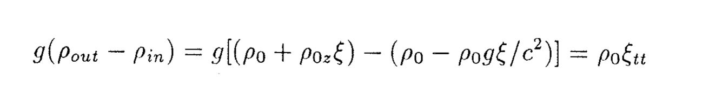](equations/ch04-p065-e01-source.png) | [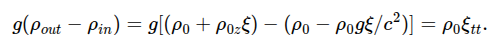](equations/ch04-p065-e01-mathjax.png) | [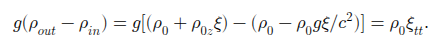](equations/ch04-p065-e01-mathml.png) |

### p. 65 · display 2 · ch04-p065-e02

Source: `src/chapter4.tex:43` · display type: `bracket`

#### Markdown math

$$
	\xi_{tt}+\xi\left(-\frac{g\rho_{0z}}{\rho_0}-\frac{g^2}{c^2}\right)=0
$$

<details>
<summary>LaTeX source</summary>

```tex
\[
	\xi_{tt}+\xi\left(-\frac{g\rho_{0z}}{\rho_0}-\frac{g^2}{c^2}\right)=0
\]
```

</details>

| Source PDF                                                                              | MathJax                                                                                | MathML                                                                              |
| --------------------------------------------------------------------------------------- | -------------------------------------------------------------------------------------- | ----------------------------------------------------------------------------------- |
| [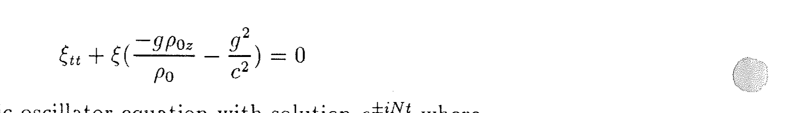](equations/ch04-p065-e02-source.png) | [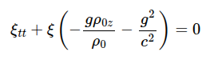](equations/ch04-p065-e02-mathjax.png) | [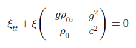](equations/ch04-p065-e02-mathml.png) |

### p. 65 · display 3 · ch04-p065-e03

Source: `src/chapter4.tex:47` · display type: `bracket`

#### Markdown math

$$
	N^2(z)=-\frac{g\rho_{0z}}{\rho_0}-\frac{g^2}{c^2}.
$$

<details>
<summary>LaTeX source</summary>

```tex
\[
	N^2(z)=-\frac{g\rho_{0z}}{\rho_0}-\frac{g^2}{c^2}.
\]
```

</details>

| Source PDF                                                                              | MathJax                                                                                | MathML                                                                              |
| --------------------------------------------------------------------------------------- | -------------------------------------------------------------------------------------- | ----------------------------------------------------------------------------------- |
| [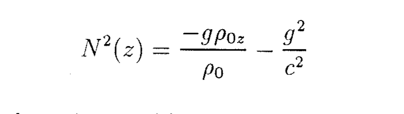](equations/ch04-p065-e03-source.png) | [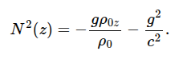](equations/ch04-p065-e03-mathjax.png) | [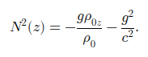](equations/ch04-p065-e03-mathml.png) |

### p. 66 · display 1 · ch04-p066-e01

Source: `src/chapter4.tex:67` · display type: `bracket`

#### Markdown math

$$
	\frac{D\vec u^{\,*}}{Dt}+f\hat k\times\vec u^{\,*}
	=-\frac{\nabla p^*}{\rho^*}-g\hat k
$$

<details>
<summary>LaTeX source</summary>

```tex
\[
	\frac{D\vec u^{\,*}}{Dt}+f\hat k\times\vec u^{\,*}
	=-\frac{\nabla p^*}{\rho^*}-g\hat k
\]
```

</details>

| Source PDF                                                                              | MathJax                                                                                | MathML                                                                              |
| --------------------------------------------------------------------------------------- | -------------------------------------------------------------------------------------- | ----------------------------------------------------------------------------------- |
| [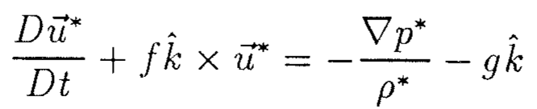](equations/ch04-p066-e01-source.png) | [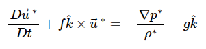](equations/ch04-p066-e01-mathjax.png) | [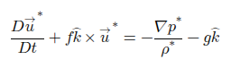](equations/ch04-p066-e01-mathml.png) |

### p. 66 · display 2 · ch04-p066-e02

Source: `src/chapter4.tex:71` · display type: `bracket`

#### Markdown math

$$
	\frac{\partial\rho^*}{\partial t}+\nabla\cdot\rho^*\vec u^{\,*}=0
$$

<details>
<summary>LaTeX source</summary>

```tex
\[
	\frac{\partial\rho^*}{\partial t}+\nabla\cdot\rho^*\vec u^{\,*}=0
\]
```

</details>

| Source PDF                                                                              | MathJax                                                                                | MathML                                                                              |
| --------------------------------------------------------------------------------------- | -------------------------------------------------------------------------------------- | ----------------------------------------------------------------------------------- |
| [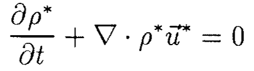](equations/ch04-p066-e02-source.png) | [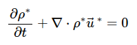](equations/ch04-p066-e02-mathjax.png) | [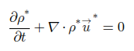](equations/ch04-p066-e02-mathml.png) |

### p. 66 · display 3 · ch04-p066-e03

Source: `src/chapter4.tex:74` · display type: `bracket`

#### Markdown math

$$
	\frac{D\rho^*}{Dt}=0\ \Rightarrow\ \nabla\cdot\vec u^{\,*}=0.
$$

<details>
<summary>LaTeX source</summary>

```tex
\[
	\frac{D\rho^*}{Dt}=0\ \Rightarrow\ \nabla\cdot\vec u^{\,*}=0.
\]
```

</details>

| Source PDF                                                                              | MathJax                                                                                | MathML                                                                              |
| --------------------------------------------------------------------------------------- | -------------------------------------------------------------------------------------- | ----------------------------------------------------------------------------------- |
| [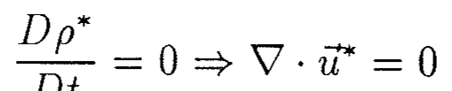](equations/ch04-p066-e03-source.png) | [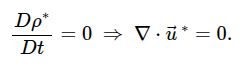](equations/ch04-p066-e03-mathjax.png) | [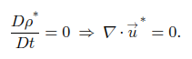](equations/ch04-p066-e03-mathml.png) |

### p. 66 · display 4 · ch04-p066-e04

Source: `src/chapter4.tex:80` · display type: `bracket`

#### Markdown math

$$
	\vec u^{\,*}=\vec u_0+\vec u\ ;\qquad p^*=p_0+p\ ;\qquad \rho^*=\rho_0+\rho.
$$

<details>
<summary>LaTeX source</summary>

```tex
\[
	\vec u^{\,*}=\vec u_0+\vec u\ ;\qquad p^*=p_0+p\ ;\qquad \rho^*=\rho_0+\rho.
\]
```

</details>

| Source PDF                                                                              | MathJax                                                                                | MathML                                                                              |
| --------------------------------------------------------------------------------------- | -------------------------------------------------------------------------------------- | ----------------------------------------------------------------------------------- |
| [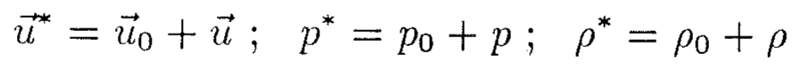](equations/ch04-p066-e04-source.png) | [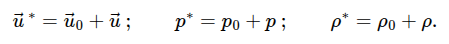](equations/ch04-p066-e04-mathjax.png) | [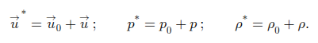](equations/ch04-p066-e04-mathml.png) |

### p. 66 · display 5 · ch04-p066-e05

Source: `src/chapter4.tex:85` · display type: `bracket`

#### Markdown math

$$
	\frac{\partial\vec u}{\partial t}+f\hat k\times\vec u
	=-\frac{\nabla p}{\rho_0}-\frac{g\rho\hat k}{\rho_0}
$$

<details>
<summary>LaTeX source</summary>

```tex
\[
	\frac{\partial\vec u}{\partial t}+f\hat k\times\vec u
	=-\frac{\nabla p}{\rho_0}-\frac{g\rho\hat k}{\rho_0}
\]
```

</details>

| Source PDF                                                                              | MathJax                                                                                | MathML                                                                              |
| --------------------------------------------------------------------------------------- | -------------------------------------------------------------------------------------- | ----------------------------------------------------------------------------------- |
| [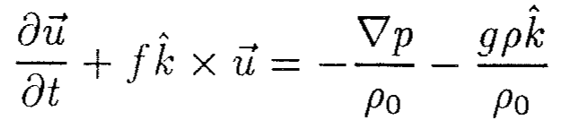](equations/ch04-p066-e05-source.png) | [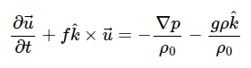](equations/ch04-p066-e05-mathjax.png) | [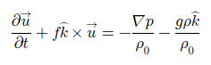](equations/ch04-p066-e05-mathml.png) |

### p. 66 · display 6 · ch04-p066-e06

Source: `src/chapter4.tex:89` · display type: `bracket`

#### Markdown math

$$
	\rho_t+w\rho_{0z}=0
$$

<details>
<summary>LaTeX source</summary>

```tex
\[
	\rho_t+w\rho_{0z}=0
\]
```

</details>

| Source PDF                                                                              | MathJax                                                                                | MathML                                                                              |
| --------------------------------------------------------------------------------------- | -------------------------------------------------------------------------------------- | ----------------------------------------------------------------------------------- |
| [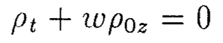](equations/ch04-p066-e06-source.png) | [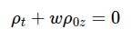](equations/ch04-p066-e06-mathjax.png) | [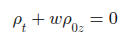](equations/ch04-p066-e06-mathml.png) |

### p. 66 · display 7 · ch04-p066-e07

Source: `src/chapter4.tex:92` · display type: `bracket`

#### Markdown math

$$
	\nabla\cdot\vec u=0.
$$

<details>
<summary>LaTeX source</summary>

```tex
\[
	\nabla\cdot\vec u=0.
\]
```

</details>

| Source PDF                                                                              | MathJax                                                                                | MathML                                                                              |
| --------------------------------------------------------------------------------------- | -------------------------------------------------------------------------------------- | ----------------------------------------------------------------------------------- |
| [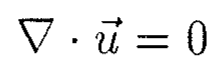](equations/ch04-p066-e07-source.png) | [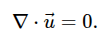](equations/ch04-p066-e07-mathjax.png) | [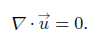](equations/ch04-p066-e07-mathml.png) |

### p. 66 · display 8 · ch04-p066-e08

Source: `src/chapter4.tex:96` · display type: `align*`

#### Markdown math

$$
\begin{aligned}
	-i\sigma u-fv           & =-p_x/\rho_0,              \\
	-i\sigma v+fu           & =-p_y/\rho_0,              \\
	-i\sigma w              & =-p_z/\rho_0-g\rho/\rho_0, \\
	u_x+v_y+w_z             & =0,                        \\
	-i\sigma\rho+w\rho_{0z} & =0.
\end{aligned}
$$

<details>
<summary>LaTeX source</summary>

```tex
\begin{align*}
	-i\sigma u-fv           & =-p_x/\rho_0,              \\
	-i\sigma v+fu           & =-p_y/\rho_0,              \\
	-i\sigma w              & =-p_z/\rho_0-g\rho/\rho_0, \\
	u_x+v_y+w_z             & =0,                        \\
	-i\sigma\rho+w\rho_{0z} & =0.
\end{align*}
```

</details>

| Source PDF                                                                              | MathJax                                                                                | MathML                                                                              |
| --------------------------------------------------------------------------------------- | -------------------------------------------------------------------------------------- | ----------------------------------------------------------------------------------- |
| [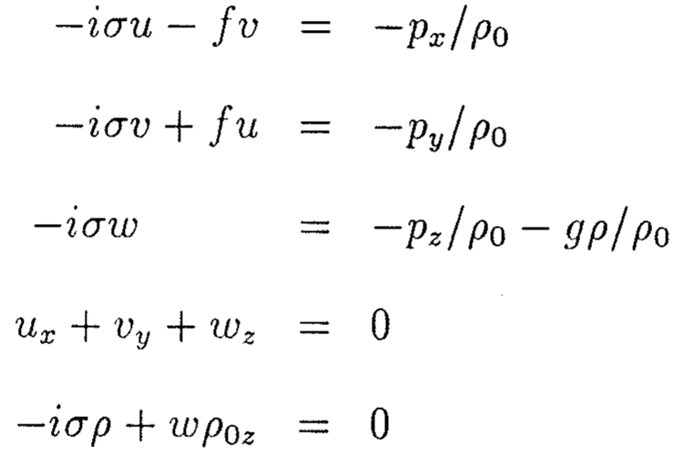](equations/ch04-p066-e08-source.png) | [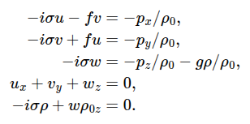](equations/ch04-p066-e08-mathjax.png) | [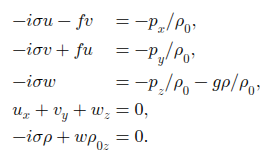](equations/ch04-p066-e08-mathml.png) |

### p. 66 · display 9 · ch04-p066-e09

Source: `src/chapter4.tex:104` · display type: `bracket`

#### Markdown math

$$
	\rho_0(N^2-\sigma^2)w=i\sigma p_z.
$$

<details>
<summary>LaTeX source</summary>

```tex
\[
	\rho_0(N^2-\sigma^2)w=i\sigma p_z.
\]
```

</details>

| Source PDF                                                                              | MathJax                                                                                | MathML                                                                              |
| --------------------------------------------------------------------------------------- | -------------------------------------------------------------------------------------- | ----------------------------------------------------------------------------------- |
| [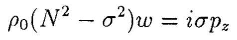](equations/ch04-p066-e09-source.png) | [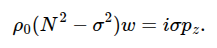](equations/ch04-p066-e09-mathjax.png) | [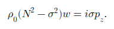](equations/ch04-p066-e09-mathml.png) |

### p. 67 · display 1 · ch04-p067-e01

Source: `src/chapter4.tex:114` · display type: `bracket`

#### Markdown math

$$
	u=\frac{1}{\rho_0}\frac{-i\sigma p_x+fp_y}{\sigma^2-f^2}
$$

<details>
<summary>LaTeX source</summary>

```tex
\[
	u=\frac{1}{\rho_0}\frac{-i\sigma p_x+fp_y}{\sigma^2-f^2}
\]
```

</details>

| Source PDF                                                                              | MathJax                                                                                | MathML                                                                              |
| --------------------------------------------------------------------------------------- | -------------------------------------------------------------------------------------- | ----------------------------------------------------------------------------------- |
| [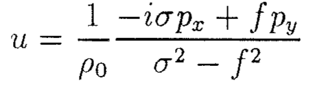](equations/ch04-p067-e01-source.png) | [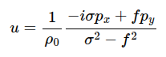](equations/ch04-p067-e01-mathjax.png) | [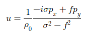](equations/ch04-p067-e01-mathml.png) |

### p. 67 · display 2 · ch04-p067-e02

Source: `src/chapter4.tex:117` · display type: `bracket`

#### Markdown math

$$
	v=\frac{1}{\rho_0}\frac{-i\sigma p_y-fp_x}{\sigma^2-f^2}
$$

<details>
<summary>LaTeX source</summary>

```tex
\[
	v=\frac{1}{\rho_0}\frac{-i\sigma p_y-fp_x}{\sigma^2-f^2}
\]
```

</details>

| Source PDF                                                                              | MathJax                                                                                | MathML                                                                              |
| --------------------------------------------------------------------------------------- | -------------------------------------------------------------------------------------- | ----------------------------------------------------------------------------------- |
| [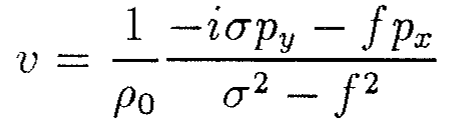](equations/ch04-p067-e02-source.png) | [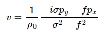](equations/ch04-p067-e02-mathjax.png) | [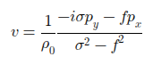](equations/ch04-p067-e02-mathml.png) |

### p. 67 · display 3 · ch04-p067-e03

Source: `src/chapter4.tex:121` · display type: `bracket`

#### Markdown math

$$
	-i\sigma\nabla_H^2p+(\sigma^2-f^2)\rho_0w_z=0
$$

<details>
<summary>LaTeX source</summary>

```tex
\[
	-i\sigma\nabla_H^2p+(\sigma^2-f^2)\rho_0w_z=0
\]
```

</details>

| Source PDF                                                                              | MathJax                                                                                | MathML                                                                              |
| --------------------------------------------------------------------------------------- | -------------------------------------------------------------------------------------- | ----------------------------------------------------------------------------------- |
| [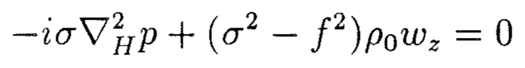](equations/ch04-p067-e03-source.png) | [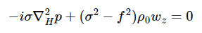](equations/ch04-p067-e03-mathjax.png) | [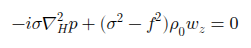](equations/ch04-p067-e03-mathml.png) |

### p. 67 · display 4 · ch04-p067-e04

Source: `src/chapter4.tex:125` · display type: `bracket`

#### Markdown math

$$
	\rho_0(N^2-\sigma^2)\nabla_H^2w-(\sigma^2-f^2)(\rho_0w_z)_z=0
$$

<details>
<summary>LaTeX source</summary>

```tex
\[
	\rho_0(N^2-\sigma^2)\nabla_H^2w-(\sigma^2-f^2)(\rho_0w_z)_z=0
\]
```

</details>

| Source PDF                                                                              | MathJax                                                                                | MathML                                                                              |
| --------------------------------------------------------------------------------------- | -------------------------------------------------------------------------------------- | ----------------------------------------------------------------------------------- |
| [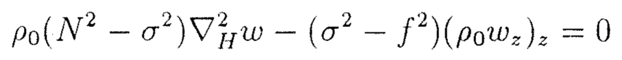](equations/ch04-p067-e04-source.png) | [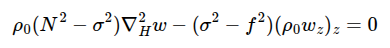](equations/ch04-p067-e04-mathjax.png) | [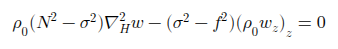](equations/ch04-p067-e04-mathml.png) |

### p. 67 · display 5 · ch04-p067-e05

Source: `src/chapter4.tex:129` · display type: `bracket`

#### Markdown math

$$
	\frac{1}{\rho_0}(\rho_0w_z)_z
	-\left(\frac{N^2-\sigma^2}{\sigma^2-f^2}\right)\nabla_H^2w=0.
$$

<details>
<summary>LaTeX source</summary>

```tex
\[
	\frac{1}{\rho_0}(\rho_0w_z)_z
	-\left(\frac{N^2-\sigma^2}{\sigma^2-f^2}\right)\nabla_H^2w=0.
\]
```

</details>

| Source PDF                                                                              | MathJax                                                                                | MathML                                                                              |
| --------------------------------------------------------------------------------------- | -------------------------------------------------------------------------------------- | ----------------------------------------------------------------------------------- |
| [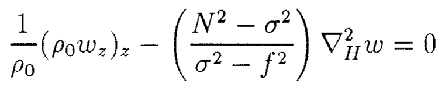](equations/ch04-p067-e05-source.png) | [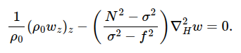](equations/ch04-p067-e05-mathjax.png) | [](equations/ch04-p067-e05-mathml.png) |

### p. 67 · display 6 · ch04-p067-e06

Source: `src/chapter4.tex:135` · display type: `bracket`

#### Markdown math

$$
	w_{zz}-\frac{N^2-\sigma^2}{\sigma^2-f^2}\nabla_H^2w=0.
$$

<details>
<summary>LaTeX source</summary>

```tex
\[
	w_{zz}-\frac{N^2-\sigma^2}{\sigma^2-f^2}\nabla_H^2w=0.
\]
```

</details>

| Source PDF                                                                              | MathJax                                                                                | MathML                                                                              |
| --------------------------------------------------------------------------------------- | -------------------------------------------------------------------------------------- | ----------------------------------------------------------------------------------- |
| [](equations/ch04-p067-e06-source.png) | [](equations/ch04-p067-e06-mathjax.png) | [](equations/ch04-p067-e06-mathml.png) |

### p. 67 · display 7 · ch04-p067-e07

Source: `src/chapter4.tex:144` · display type: `bracket`

#### Markdown math

$$
	-i\sigma p+w p_{0z}=0\qquad\text{at}\qquad z=0
$$

<details>
<summary>LaTeX source</summary>

```tex
\[
	-i\sigma p+w p_{0z}=0\qquad\text{at}\qquad z=0
\]
```

</details>

| Source PDF                                                                              | MathJax                                                                                | MathML                                                                              |
| --------------------------------------------------------------------------------------- | -------------------------------------------------------------------------------------- | ----------------------------------------------------------------------------------- |
| [](equations/ch04-p067-e07-source.png) | [](equations/ch04-p067-e07-mathjax.png) | [](equations/ch04-p067-e07-mathml.png) |

### p. 67 · display 8 · ch04-p067-e08

Source: `src/chapter4.tex:148` · display type: `bracket`

#### Markdown math

$$
	-i\sigma p-wg\rho_0=0\qquad\text{at}\qquad z=0.
$$

<details>
<summary>LaTeX source</summary>

```tex
\[
	-i\sigma p-wg\rho_0=0\qquad\text{at}\qquad z=0.
\]
```

</details>

| Source PDF                                                                              | MathJax                                                                                | MathML                                                                              |
| --------------------------------------------------------------------------------------- | -------------------------------------------------------------------------------------- | ----------------------------------------------------------------------------------- |
| [](equations/ch04-p067-e08-source.png) | [](equations/ch04-p067-e08-mathjax.png) | [](equations/ch04-p067-e08-mathml.png) |

### p. 67 · display 9 · ch04-p067-e09

Source: `src/chapter4.tex:152` · display type: `bracket`

#### Markdown math

$$
	(\sigma^2-f^2)w_z+g\nabla_H^2w=0\qquad\text{at}\qquad z=0.
$$

<details>
<summary>LaTeX source</summary>

```tex
\[
	(\sigma^2-f^2)w_z+g\nabla_H^2w=0\qquad\text{at}\qquad z=0.
\]
```

</details>

| Source PDF                                                                              | MathJax                                                                                | MathML                                                                              |
| --------------------------------------------------------------------------------------- | -------------------------------------------------------------------------------------- | ----------------------------------------------------------------------------------- |
| [](equations/ch04-p067-e09-source.png) | [](equations/ch04-p067-e09-mathjax.png) | [](equations/ch04-p067-e09-mathml.png) |

### p. 68 · display 1 · ch04-p068-e01

Source: `src/chapter4.tex:162` · display type: `bracket`

#### Markdown math

$$
	w=0\qquad\text{at}\qquad z=-D.
$$

<details>
<summary>LaTeX source</summary>

```tex
\[
	w=0\qquad\text{at}\qquad z=-D.
\]
```

</details>

| Source PDF                                                                              | MathJax                                                                                | MathML                                                                              |
| --------------------------------------------------------------------------------------- | -------------------------------------------------------------------------------------- | ----------------------------------------------------------------------------------- |
| [](equations/ch04-p068-e01-source.png) | [](equations/ch04-p068-e01-mathjax.png) | [](equations/ch04-p068-e01-mathml.png) |

### p. 68 · display 2 · ch04-p068-e02

Source: `src/chapter4.tex:175` · display type: `waveequation`

#### Markdown math

$$
	w_{zz}-\left(\frac{N^2-\sigma^2}{\sigma^2-f^2}\right)(w_{xx}+w_{yy})=0.
$$

<details>
<summary>LaTeX source</summary>

```tex
\begin{waveequation}
	w_{zz}-\left(\frac{N^2-\sigma^2}{\sigma^2-f^2}\right)(w_{xx}+w_{yy})=0.
\end{waveequation}
```

</details>

| Source PDF                                                                              | MathJax                                                                                | MathML                                                                              |
| --------------------------------------------------------------------------------------- | -------------------------------------------------------------------------------------- | ----------------------------------------------------------------------------------- |
| [](equations/ch04-p068-e02-source.png) | [](equations/ch04-p068-e02-mathjax.png) | [](equations/ch04-p068-e02-mathml.png) |

### p. 68 · display 3 · ch04-p068-e03

Source: `src/chapter4.tex:179` · display type: `bracket`

#### Markdown math

$$
	w=e^{-i\sigma t+ikx+i\ell y+imz}
$$

<details>
<summary>LaTeX source</summary>

```tex
\[
	w=e^{-i\sigma t+ikx+i\ell y+imz}
\]
```

</details>

| Source PDF                                                                              | MathJax                                                                                | MathML                                                                              |
| --------------------------------------------------------------------------------------- | -------------------------------------------------------------------------------------- | ----------------------------------------------------------------------------------- |
| [](equations/ch04-p068-e03-source.png) | [](equations/ch04-p068-e03-mathjax.png) | [](equations/ch04-p068-e03-mathml.png) |

### p. 68 · display 4 · ch04-p068-e04

Source: `src/chapter4.tex:183` · display type: `waveequation`

#### Markdown math

$$
	m^2=\left(\frac{N^2-\sigma^2}{\sigma^2-f^2}\right)(k^2+\ell^2)
$$

<details>
<summary>LaTeX source</summary>

```tex
\begin{waveequation}
	m^2=\left(\frac{N^2-\sigma^2}{\sigma^2-f^2}\right)(k^2+\ell^2)
\end{waveequation}
```

</details>

| Source PDF                                                                              | MathJax                                                                                | MathML                                                                              |
| --------------------------------------------------------------------------------------- | -------------------------------------------------------------------------------------- | ----------------------------------------------------------------------------------- |
| [](equations/ch04-p068-e04-source.png) | [](equations/ch04-p068-e04-mathjax.png) | [](equations/ch04-p068-e04-mathml.png) |

### p. 69 · display 1 · ch04-p069-e01

Source: `src/chapter4.tex:200` · display type: `bracket`

#### Markdown math

$$
	m=K\cos\theta\ ;\qquad (k^2+\ell^2)^{1/2}=K\sin\theta
$$

<details>
<summary>LaTeX source</summary>

```tex
\[
	m=K\cos\theta\ ;\qquad (k^2+\ell^2)^{1/2}=K\sin\theta
\]
```

</details>

| Source PDF                                                                              | MathJax                                                                                | MathML                                                                              |
| --------------------------------------------------------------------------------------- | -------------------------------------------------------------------------------------- | ----------------------------------------------------------------------------------- |
| [](equations/ch04-p069-e01-source.png) | [](equations/ch04-p069-e01-mathjax.png) | [](equations/ch04-p069-e01-mathml.png) |

### p. 69 · display 2 · ch04-p069-e02

Source: `src/chapter4.tex:204` · display type: `bracket`

#### Markdown math

$$
	\sigma^2=N^2\sin^2\theta+f^2\cos^2\theta
$$

<details>
<summary>LaTeX source</summary>

```tex
\[
	\sigma^2=N^2\sin^2\theta+f^2\cos^2\theta
\]
```

</details>

| Source PDF                                                                              | MathJax                                                                                | MathML                                                                              |
| --------------------------------------------------------------------------------------- | -------------------------------------------------------------------------------------- | ----------------------------------------------------------------------------------- |
| [](equations/ch04-p069-e02-source.png) | [](equations/ch04-p069-e02-mathjax.png) | [](equations/ch04-p069-e02-mathml.png) |

### p. 69 · display 3 · ch04-p069-e03

Source: `src/chapter4.tex:208` · display type: `bracket`

#### Markdown math

$$
	\sigma^2K^2=N^2(k^2+\ell^2)+f^2m^2.
$$

<details>
<summary>LaTeX source</summary>

```tex
\[
	\sigma^2K^2=N^2(k^2+\ell^2)+f^2m^2.
\]
```

</details>

| Source PDF                                                                              | MathJax                                                                                | MathML                                                                              |
| --------------------------------------------------------------------------------------- | -------------------------------------------------------------------------------------- | ----------------------------------------------------------------------------------- |
| [](equations/ch04-p069-e03-source.png) | [](equations/ch04-p069-e03-mathjax.png) | [](equations/ch04-p069-e03-mathml.png) |

### p. 69 · display 4 · ch04-p069-e04

Source: `src/chapter4.tex:222` · display type: `bracket`

#### Markdown math

$$
	u_t=-gp\sin\theta/\rho_0
$$

<details>
<summary>LaTeX source</summary>

```tex
\[
	u_t=-gp\sin\theta/\rho_0
\]
```

</details>

| Source PDF                                                                              | MathJax                                                                                | MathML                                                                              |
| --------------------------------------------------------------------------------------- | -------------------------------------------------------------------------------------- | ----------------------------------------------------------------------------------- |
| [](equations/ch04-p069-e04-source.png) | [](equations/ch04-p069-e04-mathjax.png) | [](equations/ch04-p069-e04-mathml.png) |

### p. 70 · display 1 · ch04-p070-e01

Source: `src/chapter4.tex:232` · display type: `bracket`

#### Markdown math

$$
	\rho_t+u\sin\theta\,\rho_{0z}=0
$$

<details>
<summary>LaTeX source</summary>

```tex
\[
	\rho_t+u\sin\theta\,\rho_{0z}=0
\]
```

</details>

| Source PDF                                                                              | MathJax                                                                                | MathML                                                                              |
| --------------------------------------------------------------------------------------- | -------------------------------------------------------------------------------------- | ----------------------------------------------------------------------------------- |
| [](equations/ch04-p070-e01-source.png) | [](equations/ch04-p070-e01-mathjax.png) | [](equations/ch04-p070-e01-mathml.png) |

### p. 70 · display 2 · ch04-p070-e02

Source: `src/chapter4.tex:237` · display type: `bracket`

#### Markdown math

$$
	u_{tt}+N^2\sin^2\theta\,u=0\ ;\qquad \sigma^2=N^2\sin^2\theta
$$

<details>
<summary>LaTeX source</summary>

```tex
\[
	u_{tt}+N^2\sin^2\theta\,u=0\ ;\qquad \sigma^2=N^2\sin^2\theta
\]
```

</details>

| Source PDF                                                                              | MathJax                                                                                | MathML                                                                              |
| --------------------------------------------------------------------------------------- | -------------------------------------------------------------------------------------- | ----------------------------------------------------------------------------------- |
| [](equations/ch04-p070-e02-source.png) | [](equations/ch04-p070-e02-mathjax.png) | [](equations/ch04-p070-e02-mathml.png) |

### p. 70 · display 3 · ch04-p070-e03

Source: `src/chapter4.tex:247` · display type: `bracket`

#### Markdown math

$$
	\vec u_t+f\cos\theta\,\hat k'\times\vec u=0.
$$

<details>
<summary>LaTeX source</summary>

```tex
\[
	\vec u_t+f\cos\theta\,\hat k'\times\vec u=0.
\]
```

</details>

| Source PDF                                                                              | MathJax                                                                                | MathML                                                                              |
| --------------------------------------------------------------------------------------- | -------------------------------------------------------------------------------------- | ----------------------------------------------------------------------------------- |
| [](equations/ch04-p070-e03-source.png) | [](equations/ch04-p070-e03-mathjax.png) | [](equations/ch04-p070-e03-mathml.png) |

### p. 70 · display 4 · ch04-p070-e04

Source: `src/chapter4.tex:253` · display type: `bracket`

#### Markdown math

$$
	W(k,\ell,m,\sigma)
	=m^2-\frac{N^2-\sigma^2}{\sigma^2-f^2}(k^2+\ell^2)=0.
$$

<details>
<summary>LaTeX source</summary>

```tex
\[
	W(k,\ell,m,\sigma)
	=m^2-\frac{N^2-\sigma^2}{\sigma^2-f^2}(k^2+\ell^2)=0.
\]
```

</details>

| Source PDF                                                                              | MathJax                                                                                | MathML                                                                              |
| --------------------------------------------------------------------------------------- | -------------------------------------------------------------------------------------- | ----------------------------------------------------------------------------------- |
| [](equations/ch04-p070-e04-source.png) | [](equations/ch04-p070-e04-mathjax.png) | [](equations/ch04-p070-e04-mathml.png) |

### p. 70 · display 5 · ch04-p070-e05

Source: `src/chapter4.tex:258` · display type: `bracket`

#### Markdown math

$$
	dW\big|_{\ell,m}
	=\frac{\partial W}{\partial k}\,dk
	+\frac{\partial W}{\partial\sigma}\,d\sigma=0
$$

<details>
<summary>LaTeX source</summary>

```tex
\[
	dW\big|_{\ell,m}
	=\frac{\partial W}{\partial k}\,dk
	+\frac{\partial W}{\partial\sigma}\,d\sigma=0
\]
```

</details>

| Source PDF                                                                              | MathJax                                                                                | MathML                                                                              |
| --------------------------------------------------------------------------------------- | -------------------------------------------------------------------------------------- | ----------------------------------------------------------------------------------- |
| [](equations/ch04-p070-e05-source.png) | [](equations/ch04-p070-e05-mathjax.png) | [](equations/ch04-p070-e05-mathml.png) |

### p. 71 · display 1 · ch04-p071-e01

Source: `src/chapter4.tex:270` · display type: `bracket`

#### Markdown math

$$
	\left.\frac{\partial\sigma}{\partial k}\right|_{\ell,m}
	=-\frac{\left.\partial W/\partial k\right|_{\ell,m}}
	{\left.\partial W/\partial\sigma\right|_{\ell,m}}
	\qquad\text{etc.}
$$

<details>
<summary>LaTeX source</summary>

```tex
\[
	\left.\frac{\partial\sigma}{\partial k}\right|_{\ell,m}
	=-\frac{\left.\partial W/\partial k\right|_{\ell,m}}
	{\left.\partial W/\partial\sigma\right|_{\ell,m}}
	\qquad\text{etc.}
\]
```

</details>

| Source PDF                                                                              | MathJax                                                                                | MathML                                                                              |
| --------------------------------------------------------------------------------------- | -------------------------------------------------------------------------------------- | ----------------------------------------------------------------------------------- |
| [](equations/ch04-p071-e01-source.png) | [](equations/ch04-p071-e01-mathjax.png) | [](equations/ch04-p071-e01-mathml.png) |

### p. 71 · display 2 · ch04-p071-e02

Source: `src/chapter4.tex:277` · display type: `align*`

#### Markdown math

$$
\begin{aligned}
	c_{gx} & =\frac{\partial\sigma}{\partial k}
	=\frac{k}{\sigma}\frac{N^2-\sigma^2}{K^2},    \\
	c_{gy} & =\frac{\partial\sigma}{\partial\ell}
	=\frac{\ell}{\sigma}\frac{N^2-\sigma^2}{K^2}, \\
	c_{gz} & =\frac{\partial\sigma}{\partial m}
	=-\frac{m}{\sigma}\frac{\sigma^2-f^2}{K^2}.
\end{aligned}
$$

<details>
<summary>LaTeX source</summary>

```tex
\begin{align*}
	c_{gx} & =\frac{\partial\sigma}{\partial k}
	=\frac{k}{\sigma}\frac{N^2-\sigma^2}{K^2},    \\
	c_{gy} & =\frac{\partial\sigma}{\partial\ell}
	=\frac{\ell}{\sigma}\frac{N^2-\sigma^2}{K^2}, \\
	c_{gz} & =\frac{\partial\sigma}{\partial m}
	=-\frac{m}{\sigma}\frac{\sigma^2-f^2}{K^2}.
\end{align*}
```

</details>

| Source PDF                                                                              | MathJax                                                                                | MathML                                                                              |
| --------------------------------------------------------------------------------------- | -------------------------------------------------------------------------------------- | ----------------------------------------------------------------------------------- |
| [](equations/ch04-p071-e02-source.png) | [](equations/ch04-p071-e02-mathjax.png) | [](equations/ch04-p071-e02-mathml.png) |

### p. 71 · display 3 · ch04-p071-e03

Source: `src/chapter4.tex:286` · display type: `align*`

#### Markdown math

$$
\begin{aligned}
	\vec k\cdot\vec c_g
	 & =\left(\frac{k^2}{\sigma}+\frac{\ell^2}{\sigma}\right)
	\left(\frac{N^2-\sigma^2}{K^2}\right)
	-\frac{m^2}{\sigma}\left(\frac{\sigma^2-f^2}{K^2}\right)               \\
	 & =\frac{-\sigma^2(k^2+\ell^2+m^2)+N^2(k^2+\ell^2)+f^2m^2}{K^2\sigma} \\
	 & =0.
\end{aligned}
$$

<details>
<summary>LaTeX source</summary>

```tex
\begin{align*}
	\vec k\cdot\vec c_g
	 & =\left(\frac{k^2}{\sigma}+\frac{\ell^2}{\sigma}\right)
	\left(\frac{N^2-\sigma^2}{K^2}\right)
	-\frac{m^2}{\sigma}\left(\frac{\sigma^2-f^2}{K^2}\right)               \\
	 & =\frac{-\sigma^2(k^2+\ell^2+m^2)+N^2(k^2+\ell^2)+f^2m^2}{K^2\sigma} \\
	 & =0.
\end{align*}
```

</details>

| Source PDF                                                                              | MathJax                                                                                | MathML                                                                              |
| --------------------------------------------------------------------------------------- | -------------------------------------------------------------------------------------- | ----------------------------------------------------------------------------------- |
| [](equations/ch04-p071-e03-source.png) | [](equations/ch04-p071-e03-mathjax.png) | [](equations/ch04-p071-e03-mathml.png) |

### p. 71 · display 4 · ch04-p071-e04

Source: `src/chapter4.tex:296` · display type: `bracket`

#### Markdown math

$$
	\vec c_g=\frac{1}{\sigma K^2}
	[\hat i k(N^2-\sigma^2)+\hat j\ell(N^2-\sigma^2)
		+\hat k m(f^2-\sigma^2+N^2-N^2)]
$$

<details>
<summary>LaTeX source</summary>

```tex
\[
	\vec c_g=\frac{1}{\sigma K^2}
	[\hat i k(N^2-\sigma^2)+\hat j\ell(N^2-\sigma^2)
		+\hat k m(f^2-\sigma^2+N^2-N^2)]
\]
```

</details>

| Source PDF                                                                              | MathJax                                                                                | MathML                                                                              |
| --------------------------------------------------------------------------------------- | -------------------------------------------------------------------------------------- | ----------------------------------------------------------------------------------- |
| [](equations/ch04-p071-e04-source.png) | [](equations/ch04-p071-e04-mathjax.png) | [](equations/ch04-p071-e04-mathml.png) |

### p. 71 · display 5 · ch04-p071-e05

Source: `src/chapter4.tex:302` · display type: `bracket`

#### Markdown math

$$
	\vec c_g=\frac{1}{\sigma K^2}
	[\vec k(N^2-\sigma^2)-\hat k m(N^2-f^2)].
$$

<details>
<summary>LaTeX source</summary>

```tex
\[
	\vec c_g=\frac{1}{\sigma K^2}
	[\vec k(N^2-\sigma^2)-\hat k m(N^2-f^2)].
\]
```

</details>

| Source PDF                                                                              | MathJax                                                                                | MathML                                                                              |
| --------------------------------------------------------------------------------------- | -------------------------------------------------------------------------------------- | ----------------------------------------------------------------------------------- |
| [](equations/ch04-p071-e05-source.png) | [](equations/ch04-p071-e05-mathjax.png) | [](equations/ch04-p071-e05-mathml.png) |

### p. 72 · display 1 · ch04-p072-e01

Source: `src/chapter4.tex:316` · display type: `align*`

#### Markdown math

$$
\begin{aligned}
	|\vec c_g|
	 & =\left(c_{gx}^2+c_{gy}^2+c_{gz}^2\right)^{1/2}            \\
	 & =\frac{[k^2(N^2-\sigma^2)^2+\ell^2(N^2-\sigma^2)^2
			    +m^2(\sigma^2-f^2)^2]^{1/2}}{\sigma K^2}         \\
	 & =\frac{[(N^2-\sigma^2)^2\sin^2\theta
			    +(\sigma^2-f^2)^2\cos^2\theta]^{1/2}}{\sigma K}        \\
	 & =\frac{[(N^2-f^2)^2\sin^4\theta\cos^2\theta
			    +(N^2-f^2)^2\cos^4\theta\sin^2\theta]^{1/2}}{\sigma K} \\
	 & =\frac{|N^2-f^2|\sin\theta\cos\theta}{\sigma K}.
\end{aligned}
$$

<details>
<summary>LaTeX source</summary>

```tex
\begin{align*}
	|\vec c_g|
	 & =\left(c_{gx}^2+c_{gy}^2+c_{gz}^2\right)^{1/2}            \\
	 & =\frac{[k^2(N^2-\sigma^2)^2+\ell^2(N^2-\sigma^2)^2
			    +m^2(\sigma^2-f^2)^2]^{1/2}}{\sigma K^2}         \\
	 & =\frac{[(N^2-\sigma^2)^2\sin^2\theta
			    +(\sigma^2-f^2)^2\cos^2\theta]^{1/2}}{\sigma K}        \\
	 & =\frac{[(N^2-f^2)^2\sin^4\theta\cos^2\theta
			    +(N^2-f^2)^2\cos^4\theta\sin^2\theta]^{1/2}}{\sigma K} \\
	 & =\frac{|N^2-f^2|\sin\theta\cos\theta}{\sigma K}.
\end{align*}
```

</details>

| Source PDF                                                                              | MathJax                                                                                | MathML                                                                              |
| --------------------------------------------------------------------------------------- | -------------------------------------------------------------------------------------- | ----------------------------------------------------------------------------------- |
| [](equations/ch04-p072-e01-source.png) | [](equations/ch04-p072-e01-mathjax.png) | [](equations/ch04-p072-e01-mathml.png) |

### p. 72 · display 2 · ch04-p072-e02

Source: `src/chapter4.tex:328` · display type: `bracket`

#### Markdown math

$$
	\sigma^2=N^2\cos^2\phi+f^2\sin^2\phi
$$

<details>
<summary>LaTeX source</summary>

```tex
\[
	\sigma^2=N^2\cos^2\phi+f^2\sin^2\phi
\]
```

</details>

| Source PDF                                                                              | MathJax                                                                                | MathML                                                                              |
| --------------------------------------------------------------------------------------- | -------------------------------------------------------------------------------------- | ----------------------------------------------------------------------------------- |
| [](equations/ch04-p072-e02-source.png) | [](equations/ch04-p072-e02-mathjax.png) | [](equations/ch04-p072-e02-mathml.png) |

### p. 72 · display 3 · ch04-p072-e03

Source: `src/chapter4.tex:331` · display type: `bracket`

#### Markdown math

$$
	|\vec c_g|=|N^2-f^2|\sin\phi\cos\phi/(\sigma K).
$$

<details>
<summary>LaTeX source</summary>

```tex
\[
	|\vec c_g|=|N^2-f^2|\sin\phi\cos\phi/(\sigma K).
\]
```

</details>

| Source PDF                                                                              | MathJax                                                                                | MathML                                                                              |
| --------------------------------------------------------------------------------------- | -------------------------------------------------------------------------------------- | ----------------------------------------------------------------------------------- |
| [](equations/ch04-p072-e03-source.png) | [](equations/ch04-p072-e03-mathjax.png) | [](equations/ch04-p072-e03-mathml.png) |

### p. 73 · display 1 · ch04-p073-e01

Source: `src/chapter4.tex:356` · display type: `bracket`

#### Markdown math

$$
	\sigma=f\sin\phi\ ;\qquad |\vec c_g|=f\cos\phi/K.
$$

<details>
<summary>LaTeX source</summary>

```tex
\[
	\sigma=f\sin\phi\ ;\qquad |\vec c_g|=f\cos\phi/K.
\]
```

</details>

| Source PDF                                                                              | MathJax                                                                                | MathML                                                                              |
| --------------------------------------------------------------------------------------- | -------------------------------------------------------------------------------------- | ----------------------------------------------------------------------------------- |
| [](equations/ch04-p073-e01-source.png) | [](equations/ch04-p073-e01-mathjax.png) | [](equations/ch04-p073-e01-mathml.png) |

### p. 73 · display 2 · ch04-p073-e02

Source: `src/chapter4.tex:370` · display type: `bracket`

#### Markdown math

$$
	u_t-fv=0
$$

<details>
<summary>LaTeX source</summary>

```tex
\[
	u_t-fv=0
\]
```

</details>

| Source PDF                                                                              | MathJax                                                                                | MathML                                                                              |
| --------------------------------------------------------------------------------------- | -------------------------------------------------------------------------------------- | ----------------------------------------------------------------------------------- |
| [](equations/ch04-p073-e02-source.png) | [](equations/ch04-p073-e02-mathjax.png) | [](equations/ch04-p073-e02-mathml.png) |

### p. 74 · display 1 · ch04-p074-e01

Source: `src/chapter4.tex:379` · display type: `bracket`

#### Markdown math

$$
	v_t+fu=0
$$

<details>
<summary>LaTeX source</summary>

```tex
\[
	v_t+fu=0
\]
```

</details>

| Source PDF                                                                              | MathJax                                                                                | MathML                                                                              |
| --------------------------------------------------------------------------------------- | -------------------------------------------------------------------------------------- | ----------------------------------------------------------------------------------- |
| [](equations/ch04-p074-e01-source.png) | [](equations/ch04-p074-e01-mathjax.png) | [](equations/ch04-p074-e01-mathml.png) |

### p. 74 · display 2 · ch04-p074-e02

Source: `src/chapter4.tex:387` · display type: `bracket`

#### Markdown math

$$
	\sigma=N\cos\phi\ ;\qquad |\vec c_g|=N\sin\phi/K.
$$

<details>
<summary>LaTeX source</summary>

```tex
\[
	\sigma=N\cos\phi\ ;\qquad |\vec c_g|=N\sin\phi/K.
\]
```

</details>

| Source PDF                                                                              | MathJax                                                                                | MathML                                                                              |
| --------------------------------------------------------------------------------------- | -------------------------------------------------------------------------------------- | ----------------------------------------------------------------------------------- |
| [](equations/ch04-p074-e02-source.png) | [](equations/ch04-p074-e02-mathjax.png) | [](equations/ch04-p074-e02-mathml.png) |

### p. 75 · display 1 · ch04-p075-e01

Source: `src/chapter4.tex:416` · display type: `bracket`

#### Markdown math

$$
	\sigma^2=N^2\cos^2\phi+f^2\sin^2\phi
$$

<details>
<summary>LaTeX source</summary>

```tex
\[
	\sigma^2=N^2\cos^2\phi+f^2\sin^2\phi
\]
```

</details>

| Source PDF                                                                              | MathJax                                                                                | MathML                                                                              |
| --------------------------------------------------------------------------------------- | -------------------------------------------------------------------------------------- | ----------------------------------------------------------------------------------- |
| [](equations/ch04-p075-e01-source.png) | [](equations/ch04-p075-e01-mathjax.png) | [](equations/ch04-p075-e01-mathml.png) |

### p. 75 · display 2 · ch04-p075-e02

Source: `src/chapter4.tex:419` · display type: `bracket`

#### Markdown math

$$
	|\vec c_g|=|N^2-f^2|\sin\phi\cos\phi/(\sigma K).
$$

<details>
<summary>LaTeX source</summary>

```tex
\[
	|\vec c_g|=|N^2-f^2|\sin\phi\cos\phi/(\sigma K).
\]
```

</details>

| Source PDF                                                                              | MathJax                                                                                | MathML                                                                              |
| --------------------------------------------------------------------------------------- | -------------------------------------------------------------------------------------- | ----------------------------------------------------------------------------------- |
| [](equations/ch04-p075-e02-source.png) | [](equations/ch04-p075-e02-mathjax.png) | [](equations/ch04-p075-e02-mathml.png) |

### p. 75 · display 3 · ch04-p075-e03

Source: `src/chapter4.tex:432` · display type: `bracket`

#### Markdown math

$$
	w_{zz}+\frac{\sigma^2-N^2}{\sigma^2-f^2}(w_{xx}+w_{yy})=0
$$

<details>
<summary>LaTeX source</summary>

```tex
\[
	w_{zz}+\frac{\sigma^2-N^2}{\sigma^2-f^2}(w_{xx}+w_{yy})=0
\]
```

</details>

| Source PDF                                                                              | MathJax                                                                                | MathML                                                                              |
| --------------------------------------------------------------------------------------- | -------------------------------------------------------------------------------------- | ----------------------------------------------------------------------------------- |
| [](equations/ch04-p075-e03-source.png) | [](equations/ch04-p075-e03-mathjax.png) | [](equations/ch04-p075-e03-mathml.png) |

### p. 75 · display 4 · ch04-p075-e04

Source: `src/chapter4.tex:438` · display type: `bracket`

#### Markdown math

$$
	m^2=-\frac{\sigma^2-N^2}{\sigma^2-f^2}(k^2+\ell^2).
$$

<details>
<summary>LaTeX source</summary>

```tex
\[
	m^2=-\frac{\sigma^2-N^2}{\sigma^2-f^2}(k^2+\ell^2).
\]
```

</details>

| Source PDF                                                                              | MathJax                                                                                | MathML                                                                              |
| --------------------------------------------------------------------------------------- | -------------------------------------------------------------------------------------- | ----------------------------------------------------------------------------------- |
| [](equations/ch04-p075-e04-source.png) | [](equations/ch04-p075-e04-mathjax.png) | [](equations/ch04-p075-e04-mathml.png) |

### p. 76 · display 1 · ch04-p076-e01

Source: `src/chapter4.tex:461` · display type: `bracket`

#### Markdown math

$$
	S^2\equiv\sigma^2-f^2\ ;\qquad
	R^2\equiv\frac{N^2-\sigma^2}{\sigma^2-f^2}
$$

<details>
<summary>LaTeX source</summary>

```tex
\[
	S^2\equiv\sigma^2-f^2\ ;\qquad
	R^2\equiv\frac{N^2-\sigma^2}{\sigma^2-f^2}
\]
```

</details>

| Source PDF                                                                              | MathJax                                                                                | MathML                                                                              |
| --------------------------------------------------------------------------------------- | -------------------------------------------------------------------------------------- | ----------------------------------------------------------------------------------- |
| [](equations/ch04-p076-e01-source.png) | [](equations/ch04-p076-e01-mathjax.png) | [](equations/ch04-p076-e01-mathml.png) |

### p. 77 · display 1 · ch04-p077-e01

Source: `src/chapter4.tex:480` · display type: `bracket`

#### Markdown math

$$
	w=e^{-i\sigma t+ikx}\omega(z)
$$

<details>
<summary>LaTeX source</summary>

```tex
\[
	w=e^{-i\sigma t+ikx}\omega(z)
\]
```

</details>

| Source PDF                                                                              | MathJax                                                                                | MathML                                                                              |
| --------------------------------------------------------------------------------------- | -------------------------------------------------------------------------------------- | ----------------------------------------------------------------------------------- |
| [](equations/ch04-p077-e01-source.png) | [](equations/ch04-p077-e01-mathjax.png) | [](equations/ch04-p077-e01-mathml.png) |

### p. 77 · display 2 · ch04-p077-e02

Source: `src/chapter4.tex:484` · display type: `bracket`

#### Markdown math

$$
	(\sigma^2-f^2)\omega_z-gk^2\omega=0\qquad z=0
$$

<details>
<summary>LaTeX source</summary>

```tex
\[
	(\sigma^2-f^2)\omega_z-gk^2\omega=0\qquad z=0
\]
```

</details>

| Source PDF                                                                              | MathJax                                                                                | MathML                                                                              |
| --------------------------------------------------------------------------------------- | -------------------------------------------------------------------------------------- | ----------------------------------------------------------------------------------- |
| [](equations/ch04-p077-e02-source.png) | [](equations/ch04-p077-e02-mathjax.png) | [](equations/ch04-p077-e02-mathml.png) |

### p. 77 · display 3 · ch04-p077-e03

Source: `src/chapter4.tex:487` · display type: `bracket`

#### Markdown math

$$
	\omega_{zz}-k^2R_1^2\omega=0
$$

<details>
<summary>LaTeX source</summary>

```tex
\[
	\omega_{zz}-k^2R_1^2\omega=0
\]
```

</details>

| Source PDF                                                                              | MathJax                                                                                | MathML                                                                              |
| --------------------------------------------------------------------------------------- | -------------------------------------------------------------------------------------- | ----------------------------------------------------------------------------------- |
| [](equations/ch04-p077-e03-source.png) | [](equations/ch04-p077-e03-mathjax.png) | [](equations/ch04-p077-e03-mathml.png) |

### p. 77 · display 4 · ch04-p077-e04

Source: `src/chapter4.tex:490` · display type: `bracket`

#### Markdown math

$$
	\omega=0\qquad z=-D.
$$

<details>
<summary>LaTeX source</summary>

```tex
\[
	\omega=0\qquad z=-D.
\]
```

</details>

| Source PDF                                                                              | MathJax                                                                                | MathML                                                                              |
| --------------------------------------------------------------------------------------- | -------------------------------------------------------------------------------------- | ----------------------------------------------------------------------------------- |
| [](equations/ch04-p077-e04-source.png) | [](equations/ch04-p077-e04-mathjax.png) | [](equations/ch04-p077-e04-mathml.png) |

### p. 77 · display 5 · ch04-p077-e05

Source: `src/chapter4.tex:494` · display type: `bracket`

#### Markdown math

$$
	w=e^{-i\sigma t+ikx}\sinh[kR_1(z+D)]
$$

<details>
<summary>LaTeX source</summary>

```tex
\[
	w=e^{-i\sigma t+ikx}\sinh[kR_1(z+D)]
\]
```

</details>

| Source PDF                                                                              | MathJax                                                                                | MathML                                                                              |
| --------------------------------------------------------------------------------------- | -------------------------------------------------------------------------------------- | ----------------------------------------------------------------------------------- |
| [](equations/ch04-p077-e05-source.png) | [](equations/ch04-p077-e05-mathjax.png) | [](equations/ch04-p077-e05-mathml.png) |

### p. 77 · display 6 · ch04-p077-e06

Source: `src/chapter4.tex:498` · display type: `waveequation`

#### Markdown math

$$
	\frac{R_1(\sigma^2-f^2)}{gk}=\tanh(kR_1D).
$$

<details>
<summary>LaTeX source</summary>

```tex
\begin{waveequation}
	\frac{R_1(\sigma^2-f^2)}{gk}=\tanh(kR_1D).
\end{waveequation}
```

</details>

| Source PDF                                                                              | MathJax                                                                                | MathML                                                                              |
| --------------------------------------------------------------------------------------- | -------------------------------------------------------------------------------------- | ----------------------------------------------------------------------------------- |
| [](equations/ch04-p077-e06-source.png) | [](equations/ch04-p077-e06-mathjax.png) | [](equations/ch04-p077-e06-mathml.png) |

### p. 78 · display 1 · ch04-p078-e01

Source: `src/chapter4.tex:516` · display type: `bracket`

#### Markdown math

$$
	N^2=f^2=0\ ;\qquad R_1^2=1\ ;\qquad \sigma^2-f^2=\sigma^2>0.
$$

<details>
<summary>LaTeX source</summary>

```tex
\[
	N^2=f^2=0\ ;\qquad R_1^2=1\ ;\qquad \sigma^2-f^2=\sigma^2>0.
\]
```

</details>

| Source PDF                                                                              | MathJax                                                                                | MathML                                                                              |
| --------------------------------------------------------------------------------------- | -------------------------------------------------------------------------------------- | ----------------------------------------------------------------------------------- |
| [](equations/ch04-p078-e01-source.png) | [](equations/ch04-p078-e01-mathjax.png) | [](equations/ch04-p078-e01-mathml.png) |

### p. 78 · display 2 · ch04-p078-e02

Source: `src/chapter4.tex:530` · display type: `bracket`

#### Markdown math

$$
	w=e^{-i\sigma t+ikx}\omega(z)
$$

<details>
<summary>LaTeX source</summary>

```tex
\[
	w=e^{-i\sigma t+ikx}\omega(z)
\]
```

</details>

| Source PDF                                                                              | MathJax                                                                                | MathML                                                                              |
| --------------------------------------------------------------------------------------- | -------------------------------------------------------------------------------------- | ----------------------------------------------------------------------------------- |
| [](equations/ch04-p078-e02-source.png) | [](equations/ch04-p078-e02-mathjax.png) | [](equations/ch04-p078-e02-mathml.png) |

### p. 78 · display 3 · ch04-p078-e03

Source: `src/chapter4.tex:534` · display type: `bracket`

#### Markdown math

$$
	(\sigma^2-f^2)\omega_z-gk^2\omega=0\qquad z=0
$$

<details>
<summary>LaTeX source</summary>

```tex
\[
	(\sigma^2-f^2)\omega_z-gk^2\omega=0\qquad z=0
\]
```

</details>

| Source PDF                                                                              | MathJax                                                                                | MathML                                                                              |
| --------------------------------------------------------------------------------------- | -------------------------------------------------------------------------------------- | ----------------------------------------------------------------------------------- |
| [](equations/ch04-p078-e03-source.png) | [](equations/ch04-p078-e03-mathjax.png) | [](equations/ch04-p078-e03-mathml.png) |

### p. 78 · display 4 · ch04-p078-e04

Source: `src/chapter4.tex:537` · display type: `bracket`

#### Markdown math

$$
	\omega_{zz}+k^2R^2\omega=0.
$$

<details>
<summary>LaTeX source</summary>

```tex
\[
	\omega_{zz}+k^2R^2\omega=0.
\]
```

</details>

| Source PDF                                                                              | MathJax                                                                                | MathML                                                                              |
| --------------------------------------------------------------------------------------- | -------------------------------------------------------------------------------------- | ----------------------------------------------------------------------------------- |
| [](equations/ch04-p078-e04-source.png) | [](equations/ch04-p078-e04-mathjax.png) | [](equations/ch04-p078-e04-mathml.png) |

### p. 79 · display 1 · ch04-p079-e01

Source: `src/chapter4.tex:546` · display type: `bracket`

#### Markdown math

$$
	\omega=0\qquad z=-D.
$$

<details>
<summary>LaTeX source</summary>

```tex
\[
	\omega=0\qquad z=-D.
\]
```

</details>

| Source PDF                                                                              | MathJax                                                                                | MathML                                                                              |
| --------------------------------------------------------------------------------------- | -------------------------------------------------------------------------------------- | ----------------------------------------------------------------------------------- |
| [](equations/ch04-p079-e01-source.png) | [](equations/ch04-p079-e01-mathjax.png) | [](equations/ch04-p079-e01-mathml.png) |

### p. 79 · display 2 · ch04-p079-e02

Source: `src/chapter4.tex:550` · display type: `bracket`

#### Markdown math

$$
	w=e^{-i\sigma t+ikx}\sin[kR(z+D)]
$$

<details>
<summary>LaTeX source</summary>

```tex
\[
	w=e^{-i\sigma t+ikx}\sin[kR(z+D)]
\]
```

</details>

| Source PDF                                                                              | MathJax                                                                                | MathML                                                                              |
| --------------------------------------------------------------------------------------- | -------------------------------------------------------------------------------------- | ----------------------------------------------------------------------------------- |
| [](equations/ch04-p079-e02-source.png) | [](equations/ch04-p079-e02-mathjax.png) | [](equations/ch04-p079-e02-mathml.png) |

### p. 79 · display 3 · ch04-p079-e03

Source: `src/chapter4.tex:554` · display type: `bracket`

#### Markdown math

$$
	\frac{R(\sigma^2-f^2)}{gk}=\tan(kRD).
$$

<details>
<summary>LaTeX source</summary>

```tex
\[
	\frac{R(\sigma^2-f^2)}{gk}=\tan(kRD).
\]
```

</details>

| Source PDF                                                                              | MathJax                                                                                | MathML                                                                              |
| --------------------------------------------------------------------------------------- | -------------------------------------------------------------------------------------- | ----------------------------------------------------------------------------------- |
| [](equations/ch04-p079-e03-source.png) | [](equations/ch04-p079-e03-mathjax.png) | [](equations/ch04-p079-e03-mathml.png) |

### p. 79 · display 4 · ch04-p079-e04

Source: `src/chapter4.tex:566` · display type: `bracket`

#### Markdown math

$$
	k_nRD=\pm n\pi,
$$

<details>
<summary>LaTeX source</summary>

```tex
\[
	k_nRD=\pm n\pi,
\]
```

</details>

| Source PDF                                                                              | MathJax                                                                                | MathML                                                                              |
| --------------------------------------------------------------------------------------- | -------------------------------------------------------------------------------------- | ----------------------------------------------------------------------------------- |
| [](equations/ch04-p079-e04-source.png) | [](equations/ch04-p079-e04-mathjax.png) | [](equations/ch04-p079-e04-mathml.png) |

### p. 79 · display 5 · ch04-p079-e05

Source: `src/chapter4.tex:570` · display type: `bracket`

#### Markdown math

$$
	k_nD\left(\frac{N^2-\sigma^2}{\sigma^2-f^2}\right)^{1/2}=\pm n\pi.
$$

<details>
<summary>LaTeX source</summary>

```tex
\[
	k_nD\left(\frac{N^2-\sigma^2}{\sigma^2-f^2}\right)^{1/2}=\pm n\pi.
\]
```

</details>

| Source PDF                                                                              | MathJax                                                                                | MathML                                                                              |
| --------------------------------------------------------------------------------------- | -------------------------------------------------------------------------------------- | ----------------------------------------------------------------------------------- |
| [](equations/ch04-p079-e05-source.png) | [](equations/ch04-p079-e05-mathjax.png) | [](equations/ch04-p079-e05-mathml.png) |

### p. 79 · display 6 · ch04-p079-e06

Source: `src/chapter4.tex:575` · display type: `bracket`

#### Markdown math

$$
	\frac{\sigma^2-f^2}{gD}=k_0^2.
$$

<details>
<summary>LaTeX source</summary>

```tex
\[
	\frac{\sigma^2-f^2}{gD}=k_0^2.
\]
```

</details>

| Source PDF                                                                              | MathJax                                                                                | MathML                                                                              |
| --------------------------------------------------------------------------------------- | -------------------------------------------------------------------------------------- | ----------------------------------------------------------------------------------- |
| [](equations/ch04-p079-e06-source.png) | [](equations/ch04-p079-e06-mathjax.png) | [](equations/ch04-p079-e06-mathml.png) |

### p. 80 · display 1 · ch04-p080-e01

Source: `src/chapter4.tex:591` · display type: `bracket`

#### Markdown math

$$
	\sigma^2\simeq k^2gD+f^2.
$$

<details>
<summary>LaTeX source</summary>

```tex
\[
	\sigma^2\simeq k^2gD+f^2.
\]
```

</details>

| Source PDF                                                                              | MathJax                                                                                | MathML                                                                              |
| --------------------------------------------------------------------------------------- | -------------------------------------------------------------------------------------- | ----------------------------------------------------------------------------------- |
| [](equations/ch04-p080-e01-source.png) | [](equations/ch04-p080-e01-mathjax.png) | [](equations/ch04-p080-e01-mathml.png) |

### p. 80 · display 2 · ch04-p080-e02

Source: `src/chapter4.tex:595` · display type: `bracket`

#### Markdown math

$$
	(\sigma^2-f^2)(n\pi/kD)^2\simeq(N^2-\sigma^2)
$$

<details>
<summary>LaTeX source</summary>

```tex
\[
	(\sigma^2-f^2)(n\pi/kD)^2\simeq(N^2-\sigma^2)
\]
```

</details>

| Source PDF                                                                              | MathJax                                                                                | MathML                                                                              |
| --------------------------------------------------------------------------------------- | -------------------------------------------------------------------------------------- | ----------------------------------------------------------------------------------- |
| [](equations/ch04-p080-e02-source.png) | [](equations/ch04-p080-e02-mathjax.png) | [](equations/ch04-p080-e02-mathml.png) |

### p. 80 · display 3 · ch04-p080-e03

Source: `src/chapter4.tex:598` · display type: `bracket`

#### Markdown math

$$
	\sigma^2[1+(n\pi/kD)^2]\simeq N^2+f^2(n\pi/kD)^2.
$$

<details>
<summary>LaTeX source</summary>

```tex
\[
	\sigma^2[1+(n\pi/kD)^2]\simeq N^2+f^2(n\pi/kD)^2.
\]
```

</details>

| Source PDF                                                                              | MathJax                                                                                | MathML                                                                              |
| --------------------------------------------------------------------------------------- | -------------------------------------------------------------------------------------- | ----------------------------------------------------------------------------------- |
| [](equations/ch04-p080-e03-source.png) | [](equations/ch04-p080-e03-mathjax.png) | [](equations/ch04-p080-e03-mathml.png) |

### p. 80 · display 4 · ch04-p080-e04

Source: `src/chapter4.tex:609` · display type: `bracket`

#### Markdown math

$$
	w=w_0e^{-i\sigma t+ikx}\sin[kR(z+D)].
$$

<details>
<summary>LaTeX source</summary>

```tex
\[
	w=w_0e^{-i\sigma t+ikx}\sin[kR(z+D)].
\]
```

</details>

| Source PDF                                                                              | MathJax                                                                                | MathML                                                                              |
| --------------------------------------------------------------------------------------- | -------------------------------------------------------------------------------------- | ----------------------------------------------------------------------------------- |
| [](equations/ch04-p080-e04-source.png) | [](equations/ch04-p080-e04-mathjax.png) | [](equations/ch04-p080-e04-mathml.png) |

### p. 80 · display 5 · ch04-p080-e05

Source: `src/chapter4.tex:613` · display type: `bracket`

#### Markdown math

$$
	u=iRw_0e^{-i\sigma t+ikx}\cos[kR(z+D)].
$$

<details>
<summary>LaTeX source</summary>

```tex
\[
	u=iRw_0e^{-i\sigma t+ikx}\cos[kR(z+D)].
\]
```

</details>

| Source PDF                                                                              | MathJax                                                                                | MathML                                                                              |
| --------------------------------------------------------------------------------------- | -------------------------------------------------------------------------------------- | ----------------------------------------------------------------------------------- |
| [](equations/ch04-p080-e05-source.png) | [](equations/ch04-p080-e05-mathjax.png) | [](equations/ch04-p080-e05-mathml.png) |

### p. 81 · display 1 · ch04-p081-e01

Source: `src/chapter4.tex:623` · display type: `bracket`

#### Markdown math

$$
	w=w_0\cos(k_1x-\sigma t)\sin[\pi(z+D)/D]\ ;\qquad
	u=-Rw_0\sin(k_1x-\sigma t)\cos[\pi(z+D)/D]
$$

<details>
<summary>LaTeX source</summary>

```tex
\[
	w=w_0\cos(k_1x-\sigma t)\sin[\pi(z+D)/D]\ ;\qquad
	u=-Rw_0\sin(k_1x-\sigma t)\cos[\pi(z+D)/D]
\]
```

</details>

| Source PDF                                                                              | MathJax                                                                                | MathML                                                                              |
| --------------------------------------------------------------------------------------- | -------------------------------------------------------------------------------------- | ----------------------------------------------------------------------------------- |
| [](equations/ch04-p081-e01-source.png) | [](equations/ch04-p081-e01-mathjax.png) | [](equations/ch04-p081-e01-mathml.png) |

### p. 82 · display 1 · ch04-p082-e01

Source: `src/chapter4.tex:660` · display type: `bracket`

#### Markdown math

$$
	w=e^{-i\sigma t+kx}\omega(z)
$$

<details>
<summary>LaTeX source</summary>

```tex
\[
	w=e^{-i\sigma t+kx}\omega(z)
\]
```

</details>

| Source PDF                                                                              | MathJax                                                                                | MathML                                                                              |
| --------------------------------------------------------------------------------------- | -------------------------------------------------------------------------------------- | ----------------------------------------------------------------------------------- |
| [](equations/ch04-p082-e01-source.png) | [](equations/ch04-p082-e01-mathjax.png) | [](equations/ch04-p082-e01-mathml.png) |

### p. 82 · display 2 · ch04-p082-e02

Source: `src/chapter4.tex:663` · display type: `bracket`

#### Markdown math

$$
	(\sigma^2-f^2)\omega_z+gk^2\omega=0\qquad\text{at }z=0
$$

<details>
<summary>LaTeX source</summary>

```tex
\[
	(\sigma^2-f^2)\omega_z+gk^2\omega=0\qquad\text{at }z=0
\]
```

</details>

| Source PDF                                                                              | MathJax                                                                                | MathML                                                                              |
| --------------------------------------------------------------------------------------- | -------------------------------------------------------------------------------------- | ----------------------------------------------------------------------------------- |
| [](equations/ch04-p082-e02-source.png) | [](equations/ch04-p082-e02-mathjax.png) | [](equations/ch04-p082-e02-mathml.png) |

### p. 82 · display 3 · ch04-p082-e03

Source: `src/chapter4.tex:666` · display type: `bracket`

#### Markdown math

$$
	\omega_{zz}+k^2R_1^2\omega=0
$$

<details>
<summary>LaTeX source</summary>

```tex
\[
	\omega_{zz}+k^2R_1^2\omega=0
\]
```

</details>

| Source PDF                                                                              | MathJax                                                                                | MathML                                                                              |
| --------------------------------------------------------------------------------------- | -------------------------------------------------------------------------------------- | ----------------------------------------------------------------------------------- |
| [](equations/ch04-p082-e03-source.png) | [](equations/ch04-p082-e03-mathjax.png) | [](equations/ch04-p082-e03-mathml.png) |

### p. 82 · display 4 · ch04-p082-e04

Source: `src/chapter4.tex:669` · display type: `bracket`

#### Markdown math

$$
	\omega=0\qquad\text{at }z=-D.
$$

<details>
<summary>LaTeX source</summary>

```tex
\[
	\omega=0\qquad\text{at }z=-D.
\]
```

</details>

| Source PDF                                                                              | MathJax                                                                                | MathML                                                                              |
| --------------------------------------------------------------------------------------- | -------------------------------------------------------------------------------------- | ----------------------------------------------------------------------------------- |
| [](equations/ch04-p082-e04-source.png) | [](equations/ch04-p082-e04-mathjax.png) | [](equations/ch04-p082-e04-mathml.png) |

### p. 82 · display 5 · ch04-p082-e05

Source: `src/chapter4.tex:673` · display type: `bracket`

#### Markdown math

$$
	w=e^{-i\sigma t+kx}\sin[kR_1(z+D)]
$$

<details>
<summary>LaTeX source</summary>

```tex
\[
	w=e^{-i\sigma t+kx}\sin[kR_1(z+D)]
\]
```

</details>

| Source PDF                                                                              | MathJax                                                                                | MathML                                                                              |
| --------------------------------------------------------------------------------------- | -------------------------------------------------------------------------------------- | ----------------------------------------------------------------------------------- |
| [](equations/ch04-p082-e05-source.png) | [](equations/ch04-p082-e05-mathjax.png) | [](equations/ch04-p082-e05-mathml.png) |

### p. 82 · display 6 · ch04-p082-e06

Source: `src/chapter4.tex:676` · display type: `bracket`

#### Markdown math

$$
	\frac{R_1(\sigma^2-f^2)}{gk}=-\tan kR_1D.
$$

<details>
<summary>LaTeX source</summary>

```tex
\[
	\frac{R_1(\sigma^2-f^2)}{gk}=-\tan kR_1D.
\]
```

</details>

| Source PDF                                                                              | MathJax                                                                                | MathML                                                                              |
| --------------------------------------------------------------------------------------- | -------------------------------------------------------------------------------------- | ----------------------------------------------------------------------------------- |
| [](equations/ch04-p082-e06-source.png) | [](equations/ch04-p082-e06-mathjax.png) | [](equations/ch04-p082-e06-mathml.png) |

### p. 83 · display 1 · ch04-p083-e01

Source: `src/chapter4.tex:692` · display type: `bracket`

#### Markdown math

$$
	w=e^{-i\sigma t+kx}\omega(z)
$$

<details>
<summary>LaTeX source</summary>

```tex
\[
	w=e^{-i\sigma t+kx}\omega(z)
\]
```

</details>

| Source PDF                                                                              | MathJax                                                                                | MathML                                                                              |
| --------------------------------------------------------------------------------------- | -------------------------------------------------------------------------------------- | ----------------------------------------------------------------------------------- |
| [](equations/ch04-p083-e01-source.png) | [](equations/ch04-p083-e01-mathjax.png) | [](equations/ch04-p083-e01-mathml.png) |

### p. 83 · display 2 · ch04-p083-e02

Source: `src/chapter4.tex:695` · display type: `bracket`

#### Markdown math

$$
	(\sigma^2-f^2)\omega_z+gk^2\omega=0\qquad\text{at }z=0
$$

<details>
<summary>LaTeX source</summary>

```tex
\[
	(\sigma^2-f^2)\omega_z+gk^2\omega=0\qquad\text{at }z=0
\]
```

</details>

| Source PDF                                                                              | MathJax                                                                                | MathML                                                                              |
| --------------------------------------------------------------------------------------- | -------------------------------------------------------------------------------------- | ----------------------------------------------------------------------------------- |
| [](equations/ch04-p083-e02-source.png) | [](equations/ch04-p083-e02-mathjax.png) | [](equations/ch04-p083-e02-mathml.png) |

### p. 83 · display 3 · ch04-p083-e03

Source: `src/chapter4.tex:698` · display type: `bracket`

#### Markdown math

$$
	\omega_{zz}-k^2R^2\omega=0
$$

<details>
<summary>LaTeX source</summary>

```tex
\[
	\omega_{zz}-k^2R^2\omega=0
\]
```

</details>

| Source PDF                                                                              | MathJax                                                                                | MathML                                                                              |
| --------------------------------------------------------------------------------------- | -------------------------------------------------------------------------------------- | ----------------------------------------------------------------------------------- |
| [](equations/ch04-p083-e03-source.png) | [](equations/ch04-p083-e03-mathjax.png) | [](equations/ch04-p083-e03-mathml.png) |

### p. 83 · display 4 · ch04-p083-e04

Source: `src/chapter4.tex:701` · display type: `bracket`

#### Markdown math

$$
	\omega=0\qquad\text{at }z=-D.
$$

<details>
<summary>LaTeX source</summary>

```tex
\[
	\omega=0\qquad\text{at }z=-D.
\]
```

</details>

| Source PDF                                                                              | MathJax                                                                                | MathML                                                                              |
| --------------------------------------------------------------------------------------- | -------------------------------------------------------------------------------------- | ----------------------------------------------------------------------------------- |
| [](equations/ch04-p083-e04-source.png) | [](equations/ch04-p083-e04-mathjax.png) | [](equations/ch04-p083-e04-mathml.png) |

### p. 83 · display 5 · ch04-p083-e05

Source: `src/chapter4.tex:705` · display type: `bracket`

#### Markdown math

$$
	w=e^{-i\sigma t+kx}\sinh[kR(z+D)]
$$

<details>
<summary>LaTeX source</summary>

```tex
\[
	w=e^{-i\sigma t+kx}\sinh[kR(z+D)]
\]
```

</details>

| Source PDF                                                                              | MathJax                                                                                | MathML                                                                              |
| --------------------------------------------------------------------------------------- | -------------------------------------------------------------------------------------- | ----------------------------------------------------------------------------------- |
| [](equations/ch04-p083-e05-source.png) | [](equations/ch04-p083-e05-mathjax.png) | [](equations/ch04-p083-e05-mathml.png) |

### p. 83 · display 6 · ch04-p083-e06

Source: `src/chapter4.tex:708` · display type: `bracket`

#### Markdown math

$$
	\frac{R(\sigma^2-f^2)}{gk}=-\tanh kRD.
$$

<details>
<summary>LaTeX source</summary>

```tex
\[
	\frac{R(\sigma^2-f^2)}{gk}=-\tanh kRD.
\]
```

</details>

| Source PDF                                                                              | MathJax                                                                                | MathML                                                                              |
| --------------------------------------------------------------------------------------- | -------------------------------------------------------------------------------------- | ----------------------------------------------------------------------------------- |
| [](equations/ch04-p083-e06-source.png) | [](equations/ch04-p083-e06-mathjax.png) | [](equations/ch04-p083-e06-mathml.png) |

### p. 85 · display 1 · ch04-p085-e01

Source: `src/chapter4.tex:752` · display type: `bracket`

#### Markdown math

$$
	h=h_0\sin[k(x+Ut)]
$$

<details>
<summary>LaTeX source</summary>

```tex
\[
	h=h_0\sin[k(x+Ut)]
\]
```

</details>

| Source PDF                                                                              | MathJax                                                                                | MathML                                                                              |
| --------------------------------------------------------------------------------------- | -------------------------------------------------------------------------------------- | ----------------------------------------------------------------------------------- |
| [](equations/ch04-p085-e01-source.png) | [](equations/ch04-p085-e01-mathjax.png) | [](equations/ch04-p085-e01-mathml.png) |

### p. 85 · display 2 · ch04-p085-e02

Source: `src/chapter4.tex:756` · display type: `bracket`

#### Markdown math

$$
	\sigma=-Uk.
$$

<details>
<summary>LaTeX source</summary>

```tex
\[
	\sigma=-Uk.
\]
```

</details>

| Source PDF                                                                              | MathJax                                                                                | MathML                                                                              |
| --------------------------------------------------------------------------------------- | -------------------------------------------------------------------------------------- | ----------------------------------------------------------------------------------- |
| [](equations/ch04-p085-e02-source.png) | [](equations/ch04-p085-e02-mathjax.png) | [](equations/ch04-p085-e02-mathml.png) |

### p. 85 · display 3 · ch04-p085-e03

Source: `src/chapter4.tex:761` · display type: `bracket`

#### Markdown math

$$
	w=U\frac{\partial h}{\partial x}=w_0e^{-i\sigma t+ikx}
	\qquad\text{on}\qquad z=0.
$$

<details>
<summary>LaTeX source</summary>

```tex
\[
	w=U\frac{\partial h}{\partial x}=w_0e^{-i\sigma t+ikx}
	\qquad\text{on}\qquad z=0.
\]
```

</details>

| Source PDF                                                                              | MathJax                                                                                | MathML                                                                              |
| --------------------------------------------------------------------------------------- | -------------------------------------------------------------------------------------- | ----------------------------------------------------------------------------------- |
| [](equations/ch04-p085-e03-source.png) | [](equations/ch04-p085-e03-mathjax.png) | [](equations/ch04-p085-e03-mathml.png) |

### p. 85 · display 4 · ch04-p085-e04

Source: `src/chapter4.tex:766` · display type: `bracket`

#### Markdown math

$$
	w_{zz}-\frac{N^2-\sigma^2}{\sigma^2}w_{xx}=0.
$$

<details>
<summary>LaTeX source</summary>

```tex
\[
	w_{zz}-\frac{N^2-\sigma^2}{\sigma^2}w_{xx}=0.
\]
```

</details>

| Source PDF                                                                              | MathJax                                                                                | MathML                                                                              |
| --------------------------------------------------------------------------------------- | -------------------------------------------------------------------------------------- | ----------------------------------------------------------------------------------- |
| [](equations/ch04-p085-e04-source.png) | [](equations/ch04-p085-e04-mathjax.png) | [](equations/ch04-p085-e04-mathml.png) |

### p. 85 · display 5 · ch04-p085-e05

Source: `src/chapter4.tex:770` · display type: `bracket`

#### Markdown math

$$
	w=w_0e^{-i\sigma t+ikx+imz}
$$

<details>
<summary>LaTeX source</summary>

```tex
\[
	w=w_0e^{-i\sigma t+ikx+imz}
\]
```

</details>

| Source PDF                                                                              | MathJax                                                                                | MathML                                                                              |
| --------------------------------------------------------------------------------------- | -------------------------------------------------------------------------------------- | ----------------------------------------------------------------------------------- |
| [](equations/ch04-p085-e05-source.png) | [](equations/ch04-p085-e05-mathjax.png) | [](equations/ch04-p085-e05-mathml.png) |

### p. 85 · display 6 · ch04-p085-e06

Source: `src/chapter4.tex:774` · display type: `waveequation`

#### Markdown math

$$
	m^2=k^2(N^2-\sigma^2)/\sigma^2=(N/U)^2-k^2
$$

<details>
<summary>LaTeX source</summary>

```tex
\begin{waveequation}
	m^2=k^2(N^2-\sigma^2)/\sigma^2=(N/U)^2-k^2
\end{waveequation}
```

</details>

| Source PDF                                                                              | MathJax                                                                                | MathML                                                                              |
| --------------------------------------------------------------------------------------- | -------------------------------------------------------------------------------------- | ----------------------------------------------------------------------------------- |
| [](equations/ch04-p085-e06-source.png) | [](equations/ch04-p085-e06-mathjax.png) | [](equations/ch04-p085-e06-mathml.png) |

### p. 86 · display 1 · ch04-p086-e01

Source: `src/chapter4.tex:792` · display type: `bracket`

#### Markdown math

$$
	w=w_0e^{-i\sigma t+ikx-mz}\ ;\qquad
	m^2=k^2-(N/U)^2
$$

<details>
<summary>LaTeX source</summary>

```tex
\[
	w=w_0e^{-i\sigma t+ikx-mz}\ ;\qquad
	m^2=k^2-(N/U)^2
\]
```

</details>

| Source PDF                                                                              | MathJax                                                                                | MathML                                                                              |
| --------------------------------------------------------------------------------------- | -------------------------------------------------------------------------------------- | ----------------------------------------------------------------------------------- |
| [](equations/ch04-p086-e01-source.png) | [](equations/ch04-p086-e01-mathjax.png) | [](equations/ch04-p086-e01-mathml.png) |

### p. 86 · display 2 · ch04-p086-e02

Source: `src/chapter4.tex:797` · display type: `bracket`

#### Markdown math

$$
	\rho_0w_{zt}=p_{xx}
$$

<details>
<summary>LaTeX source</summary>

```tex
\[
	\rho_0w_{zt}=p_{xx}
\]
```

</details>

| Source PDF                                                                              | MathJax                                                                                | MathML                                                                              |
| --------------------------------------------------------------------------------------- | -------------------------------------------------------------------------------------- | ----------------------------------------------------------------------------------- |
| [](equations/ch04-p086-e02-source.png) | [](equations/ch04-p086-e02-mathjax.png) | [](equations/ch04-p086-e02-mathml.png) |

### p. 86 · display 3 · ch04-p086-e03

Source: `src/chapter4.tex:801` · display type: `bracket`

#### Markdown math

$$
	\rho_0i\sigma mw=-k^2p
$$

<details>
<summary>LaTeX source</summary>

```tex
\[
	\rho_0i\sigma mw=-k^2p
\]
```

</details>

| Source PDF                                                                              | MathJax                                                                                | MathML                                                                              |
| --------------------------------------------------------------------------------------- | -------------------------------------------------------------------------------------- | ----------------------------------------------------------------------------------- |
| [](equations/ch04-p086-e03-source.png) | [](equations/ch04-p086-e03-mathjax.png) | [](equations/ch04-p086-e03-mathml.png) |

### p. 86 · display 4 · ch04-p086-e04

Source: `src/chapter4.tex:805` · display type: `bracket`

#### Markdown math

$$
	p=\frac{-\rho_0i\sigma m}{k^2}w
	=\frac{-\rho_0i\sigma m}{k^2}w_0e^{-i\sigma t+ikx-mz}.
$$

<details>
<summary>LaTeX source</summary>

```tex
\[
	p=\frac{-\rho_0i\sigma m}{k^2}w
	=\frac{-\rho_0i\sigma m}{k^2}w_0e^{-i\sigma t+ikx-mz}.
\]
```

</details>

| Source PDF                                                                              | MathJax                                                                                | MathML                                                                              |
| --------------------------------------------------------------------------------------- | -------------------------------------------------------------------------------------- | ----------------------------------------------------------------------------------- |
| [](equations/ch04-p086-e04-source.png) | [](equations/ch04-p086-e04-mathjax.png) | [](equations/ch04-p086-e04-mathml.png) |

### p. 86 · display 5 · ch04-p086-e05

Source: `src/chapter4.tex:819` · display type: `bracket`

#### Markdown math

$$
	w=w_0e^{-i\sigma t+ikx+imz}.
$$

<details>
<summary>LaTeX source</summary>

```tex
\[
	w=w_0e^{-i\sigma t+ikx+imz}.
\]
```

</details>

| Source PDF                                                                              | MathJax                                                                                | MathML                                                                              |
| --------------------------------------------------------------------------------------- | -------------------------------------------------------------------------------------- | ----------------------------------------------------------------------------------- |
| [](equations/ch04-p086-e05-source.png) | [](equations/ch04-p086-e05-mathjax.png) | [](equations/ch04-p086-e05-mathml.png) |

### p. 87 · display 1 · ch04-p087-e01

Source: `src/chapter4.tex:830` · display type: `bracket`

#### Markdown math

$$
	p=\frac{-\rho_0\sigma m}{k^2}w
	=\frac{-\rho_0\sigma m}{k^2}w_0e^{-i\sigma t+ikx+imz}.
$$

<details>
<summary>LaTeX source</summary>

```tex
\[
	p=\frac{-\rho_0\sigma m}{k^2}w
	=\frac{-\rho_0\sigma m}{k^2}w_0e^{-i\sigma t+ikx+imz}.
\]
```

</details>

| Source PDF                                                                              | MathJax                                                                                | MathML                                                                              |
| --------------------------------------------------------------------------------------- | -------------------------------------------------------------------------------------- | ----------------------------------------------------------------------------------- |
| [](equations/ch04-p087-e01-source.png) | [](equations/ch04-p087-e01-mathjax.png) | [](equations/ch04-p087-e01-mathml.png) |

### p. 87 · display 2 · ch04-p087-e02

Source: `src/chapter4.tex:838` · display type: `bracket`

#### Markdown math

$$
	\tau=-\rho_0\overline{uw}
	=\frac{\overline{wp}}{U}
	=\frac{-\rho_0\sigma m w_0^2}{2k^2}\frac1U
	=\frac12\rho_0kh_0^2U^2
	\left(\frac{N^2}{U^2}-k^2\right)^{1/2}.
$$

<details>
<summary>LaTeX source</summary>

```tex
\[
	\tau=-\rho_0\overline{uw}
	=\frac{\overline{wp}}{U}
	=\frac{-\rho_0\sigma m w_0^2}{2k^2}\frac1U
	=\frac12\rho_0kh_0^2U^2
	\left(\frac{N^2}{U^2}-k^2\right)^{1/2}.
\]
```

</details>

| Source PDF                                                                              | MathJax                                                                                | MathML                                                                              |
| --------------------------------------------------------------------------------------- | -------------------------------------------------------------------------------------- | ----------------------------------------------------------------------------------- |
| [](equations/ch04-p087-e02-source.png) | [](equations/ch04-p087-e02-mathjax.png) | [](equations/ch04-p087-e02-mathml.png) |

### p. 87 · display 3 · ch04-p087-e03

Source: `src/chapter4.tex:859` · display type: `bracket`

#### Markdown math

$$
	w_{zz}-R^2w_{xx}=0
$$

<details>
<summary>LaTeX source</summary>

```tex
\[
	w_{zz}-R^2w_{xx}=0
\]
```

</details>

| Source PDF                                                                              | MathJax                                                                                | MathML                                                                              |
| --------------------------------------------------------------------------------------- | -------------------------------------------------------------------------------------- | ----------------------------------------------------------------------------------- |
| [](equations/ch04-p087-e03-source.png) | [](equations/ch04-p087-e03-mathjax.png) | [](equations/ch04-p087-e03-mathml.png) |

### p. 88 · display 1 · ch04-p088-e01

Source: `src/chapter4.tex:870` · display type: `bracket`

#### Markdown math

$$
	-\sigma t+kx\pm Rkz=\text{constant}.
$$

<details>
<summary>LaTeX source</summary>

```tex
\[
	-\sigma t+kx\pm Rkz=\text{constant}.
\]
```

</details>

| Source PDF                                                                              | MathJax                                                                                | MathML                                                                              |
| --------------------------------------------------------------------------------------- | -------------------------------------------------------------------------------------- | ----------------------------------------------------------------------------------- |
| [](equations/ch04-p088-e01-source.png) | [](equations/ch04-p088-e01-mathjax.png) | [](equations/ch04-p088-e01-mathml.png) |

### p. 88 · display 2 · ch04-p088-e02

Source: `src/chapter4.tex:874` · display type: `bracket`

#### Markdown math

$$
	x\pm Rz=(\sigma/k)t+\text{constant}.
$$

<details>
<summary>LaTeX source</summary>

```tex
\[
	x\pm Rz=(\sigma/k)t+\text{constant}.
\]
```

</details>

| Source PDF                                                                              | MathJax                                                                                | MathML                                                                              |
| --------------------------------------------------------------------------------------- | -------------------------------------------------------------------------------------- | ----------------------------------------------------------------------------------- |
| [](equations/ch04-p088-e02-source.png) | [](equations/ch04-p088-e02-mathjax.png) | [](equations/ch04-p088-e02-mathml.png) |

### p. 88 · display 3 · ch04-p088-e03

Source: `src/chapter4.tex:883` · display type: `bracket`

#### Markdown math

$$
	z_x=\pm R^{-1}
	=\pm\left(\frac{\sigma^2-f^2}{N^2-\sigma^2}\right)^{1/2}
	=\pm\left(\frac{(N^2-f^2)\cos^2\phi}
	{(N^2-f^2)\sin^2\phi}\right)^{1/2}
	=\pm\cot\phi.
$$

<details>
<summary>LaTeX source</summary>

```tex
\[
	z_x=\pm R^{-1}
	=\pm\left(\frac{\sigma^2-f^2}{N^2-\sigma^2}\right)^{1/2}
	=\pm\left(\frac{(N^2-f^2)\cos^2\phi}
	{(N^2-f^2)\sin^2\phi}\right)^{1/2}
	=\pm\cot\phi.
\]
```

</details>

| Source PDF                                                                              | MathJax                                                                                | MathML                                                                              |
| --------------------------------------------------------------------------------------- | -------------------------------------------------------------------------------------- | ----------------------------------------------------------------------------------- |
| [](equations/ch04-p088-e03-source.png) | [](equations/ch04-p088-e03-mathjax.png) | [](equations/ch04-p088-e03-mathml.png) |

### p. 88 · display 4 · ch04-p088-e04

Source: `src/chapter4.tex:891` · display type: `bracket`

#### Markdown math

$$
	w=F(x+Rz)+G(x-Rz)
$$

<details>
<summary>LaTeX source</summary>

```tex
\[
	w=F(x+Rz)+G(x-Rz)
\]
```

</details>

| Source PDF                                                                              | MathJax                                                                                | MathML                                                                              |
| --------------------------------------------------------------------------------------- | -------------------------------------------------------------------------------------- | ----------------------------------------------------------------------------------- |
| [](equations/ch04-p088-e04-source.png) | [](equations/ch04-p088-e04-mathjax.png) | [](equations/ch04-p088-e04-mathml.png) |

### p. 89 · display 1 · ch04-p089-e01

Source: `src/chapter4.tex:921` · display type: `bracket`

#### Markdown math

$$
	|\vec k_i|\cos(\tan^{-1}R-\tan^{-1}a)
	=|\vec k_r|\cos(\tan^{-1}R+\tan^{-1}a).
$$

<details>
<summary>LaTeX source</summary>

```tex
\[
	|\vec k_i|\cos(\tan^{-1}R-\tan^{-1}a)
	=|\vec k_r|\cos(\tan^{-1}R+\tan^{-1}a).
\]
```

</details>

| Source PDF                                                                              | MathJax                                                                                | MathML                                                                              |
| --------------------------------------------------------------------------------------- | -------------------------------------------------------------------------------------- | ----------------------------------------------------------------------------------- |
| [](equations/ch04-p089-e01-source.png) | [](equations/ch04-p089-e01-mathjax.png) | [](equations/ch04-p089-e01-mathml.png) |

### p. 90 · display 1 · ch04-p090-e01

Source: `src/chapter4.tex:937` · display type: `waveequation`

#### Markdown math

$$
	|\vec k_r|=|\vec k_i|\left(\frac{1+aR}{1-aR}\right).
$$

<details>
<summary>LaTeX source</summary>

```tex
\begin{waveequation}
	|\vec k_r|=|\vec k_i|\left(\frac{1+aR}{1-aR}\right).
\end{waveequation}
```

</details>

| Source PDF                                                                              | MathJax                                                                                | MathML                                                                              |
| --------------------------------------------------------------------------------------- | -------------------------------------------------------------------------------------- | ----------------------------------------------------------------------------------- |
| [](equations/ch04-p090-e01-source.png) | [](equations/ch04-p090-e01-mathjax.png) | [](equations/ch04-p090-e01-mathml.png) |

### p. 90 · display 2 · ch04-p090-e02

Source: `src/chapter4.tex:940` · display type: `bracket`

#### Markdown math

$$
	m_r=\pm m_i\left(\frac{1+aR}{1-aR}\right)
	\left(\frac{R+a}{R-a}\right).
$$

<details>
<summary>LaTeX source</summary>

```tex
\[
	m_r=\pm m_i\left(\frac{1+aR}{1-aR}\right)
	\left(\frac{R+a}{R-a}\right).
\]
```

</details>

| Source PDF                                                                              | MathJax                                                                                | MathML                                                                              |
| --------------------------------------------------------------------------------------- | -------------------------------------------------------------------------------------- | ----------------------------------------------------------------------------------- |
| [](equations/ch04-p090-e02-source.png) | [](equations/ch04-p090-e02-mathjax.png) | [](equations/ch04-p090-e02-mathml.png) |

### p. 90 · display 3 · ch04-p090-e03

Source: `src/chapter4.tex:954` · display type: `bracket`

#### Markdown math

$$
	|\vec v_i|\sin(\tan^{-1}R^{-1}+\tan^{-1}a)
	=|\vec v_r|\sin(\tan^{-1}R^{-1}-\tan^{-1}a).
$$

<details>
<summary>LaTeX source</summary>

```tex
\[
	|\vec v_i|\sin(\tan^{-1}R^{-1}+\tan^{-1}a)
	=|\vec v_r|\sin(\tan^{-1}R^{-1}-\tan^{-1}a).
\]
```

</details>

| Source PDF                                                                              | MathJax                                                                                | MathML                                                                              |
| --------------------------------------------------------------------------------------- | -------------------------------------------------------------------------------------- | ----------------------------------------------------------------------------------- |
| [](equations/ch04-p090-e03-source.png) | [](equations/ch04-p090-e03-mathjax.png) | [](equations/ch04-p090-e03-mathml.png) |

### p. 90 · display 4 · ch04-p090-e04

Source: `src/chapter4.tex:959` · display type: `waveequation`

#### Markdown math

$$
	|\vec v_r|=|\vec v_i|\left(\frac{1+aR}{1-aR}\right).
$$

<details>
<summary>LaTeX source</summary>

```tex
\begin{waveequation}
	|\vec v_r|=|\vec v_i|\left(\frac{1+aR}{1-aR}\right).
\end{waveequation}
```

</details>

| Source PDF                                                                              | MathJax                                                                                | MathML                                                                              |
| --------------------------------------------------------------------------------------- | -------------------------------------------------------------------------------------- | ----------------------------------------------------------------------------------- |
| [](equations/ch04-p090-e04-source.png) | [](equations/ch04-p090-e04-mathjax.png) | [](equations/ch04-p090-e04-mathml.png) |

### p. 92 · display 1 · ch04-p092-e01

Source: `src/chapter4.tex:996` · display type: `bracket`

#### Markdown math

$$
	R^2(z)=\frac{N^2(z)-\sigma^2}{\sigma^2-f^2}
$$

<details>
<summary>LaTeX source</summary>

```tex
\[
	R^2(z)=\frac{N^2(z)-\sigma^2}{\sigma^2-f^2}
\]
```

</details>

| Source PDF                                                                              | MathJax                                                                                | MathML                                                                              |
| --------------------------------------------------------------------------------------- | -------------------------------------------------------------------------------------- | ----------------------------------------------------------------------------------- |
| [](equations/ch04-p092-e01-source.png) | [](equations/ch04-p092-e01-mathjax.png) | [](equations/ch04-p092-e01-mathml.png) |

### p. 92 · display 2 · ch04-p092-e02

Source: `src/chapter4.tex:1001` · display type: `bracket`

#### Markdown math

$$
	w=e^{-i\sigma t+ikx}\omega(z).
$$

<details>
<summary>LaTeX source</summary>

```tex
\[
	w=e^{-i\sigma t+ikx}\omega(z).
\]
```

</details>

| Source PDF                                                                              | MathJax                                                                                | MathML                                                                              |
| --------------------------------------------------------------------------------------- | -------------------------------------------------------------------------------------- | ----------------------------------------------------------------------------------- |
| [](equations/ch04-p092-e02-source.png) | [](equations/ch04-p092-e02-mathjax.png) | [](equations/ch04-p092-e02-mathml.png) |

### p. 92 · display 3 · ch04-p092-e03

Source: `src/chapter4.tex:1005` · display type: `bracket`

#### Markdown math

$$
	(\sigma^2-f^2)\omega_z-gk^2\omega=0\qquad\text{at }z=0
$$

<details>
<summary>LaTeX source</summary>

```tex
\[
	(\sigma^2-f^2)\omega_z-gk^2\omega=0\qquad\text{at }z=0
\]
```

</details>

| Source PDF                                                                              | MathJax                                                                                | MathML                                                                              |
| --------------------------------------------------------------------------------------- | -------------------------------------------------------------------------------------- | ----------------------------------------------------------------------------------- |
| [](equations/ch04-p092-e03-source.png) | [](equations/ch04-p092-e03-mathjax.png) | [](equations/ch04-p092-e03-mathml.png) |

### p. 92 · display 4 · ch04-p092-e04

Source: `src/chapter4.tex:1008` · display type: `bracket`

#### Markdown math

$$
	\omega_{zz}+k^2R^2(z)\omega=0
$$

<details>
<summary>LaTeX source</summary>

```tex
\[
	\omega_{zz}+k^2R^2(z)\omega=0
\]
```

</details>

| Source PDF                                                                              | MathJax                                                                                | MathML                                                                              |
| --------------------------------------------------------------------------------------- | -------------------------------------------------------------------------------------- | ----------------------------------------------------------------------------------- |
| [](equations/ch04-p092-e04-source.png) | [](equations/ch04-p092-e04-mathjax.png) | [](equations/ch04-p092-e04-mathml.png) |

### p. 93 · display 1 · ch04-p093-e01

Source: `src/chapter4.tex:1017` · display type: `bracket`

#### Markdown math

$$
	\omega=0\qquad\text{at }z=-D.
$$

<details>
<summary>LaTeX source</summary>

```tex
\[
	\omega=0\qquad\text{at }z=-D.
\]
```

</details>

| Source PDF                                                                              | MathJax                                                                                | MathML                                                                              |
| --------------------------------------------------------------------------------------- | -------------------------------------------------------------------------------------- | ----------------------------------------------------------------------------------- |
| [](equations/ch04-p093-e01-source.png) | [](equations/ch04-p093-e01-mathjax.png) | [](equations/ch04-p093-e01-mathml.png) |

### p. 93 · display 2 · ch04-p093-e02

Source: `src/chapter4.tex:1033` · display type: `bracket`

#### Markdown math

$$
	(p\psi_z)_z+(q+\lambda r)\psi=0
$$

<details>
<summary>LaTeX source</summary>

```tex
\[
	(p\psi_z)_z+(q+\lambda r)\psi=0
\]
```

</details>

| Source PDF                                                                              | MathJax                                                                                | MathML                                                                              |
| --------------------------------------------------------------------------------------- | -------------------------------------------------------------------------------------- | ----------------------------------------------------------------------------------- |
| [](equations/ch04-p093-e02-source.png) | [](equations/ch04-p093-e02-mathjax.png) | [](equations/ch04-p093-e02-mathml.png) |

### p. 93 · display 3 · ch04-p093-e03

Source: `src/chapter4.tex:1036` · display type: `bracket`

#### Markdown math

$$
	a_{1,2}\psi_z+b_{1,2}\psi=0\qquad\text{at }z=0,-D
$$

<details>
<summary>LaTeX source</summary>

```tex
\[
	a_{1,2}\psi_z+b_{1,2}\psi=0\qquad\text{at }z=0,-D
\]
```

</details>

| Source PDF                                                                              | MathJax                                                                                | MathML                                                                              |
| --------------------------------------------------------------------------------------- | -------------------------------------------------------------------------------------- | ----------------------------------------------------------------------------------- |
| [](equations/ch04-p093-e03-source.png) | [](equations/ch04-p093-e03-mathjax.png) | [](equations/ch04-p093-e03-mathml.png) |

### p. 93 · display 4 · ch04-p093-e04

Source: `src/chapter4.tex:1041` · display type: `bracket`

#### Markdown math

$$
	\lambda_1\le\lambda_2\le\lambda_3\le\cdots\to\infty.
$$

<details>
<summary>LaTeX source</summary>

```tex
\[
	\lambda_1\le\lambda_2\le\lambda_3\le\cdots\to\infty.
\]
```

</details>

| Source PDF                                                                              | MathJax                                                                                | MathML                                                                              |
| --------------------------------------------------------------------------------------- | -------------------------------------------------------------------------------------- | ----------------------------------------------------------------------------------- |
| [](equations/ch04-p093-e04-source.png) | [](equations/ch04-p093-e04-mathjax.png) | [](equations/ch04-p093-e04-mathml.png) |

### p. 93 · display 5 · ch04-p093-e05

Source: `src/chapter4.tex:1045` · display type: `bracket`

#### Markdown math

$$
	\int_{-D}^{0}\psi_i\psi_jr(z)\,dz=\delta_{ij}
$$

<details>
<summary>LaTeX source</summary>

```tex
\[
	\int_{-D}^{0}\psi_i\psi_jr(z)\,dz=\delta_{ij}
\]
```

</details>

| Source PDF                                                                              | MathJax                                                                                | MathML                                                                              |
| --------------------------------------------------------------------------------------- | -------------------------------------------------------------------------------------- | ----------------------------------------------------------------------------------- |
| [](equations/ch04-p093-e05-source.png) | [](equations/ch04-p093-e05-mathjax.png) | [](equations/ch04-p093-e05-mathml.png) |

### p. 94 · display 1 · ch04-p094-e01

Source: `src/chapter4.tex:1056` · display type: `bracket`

#### Markdown math

$$
	\lambda=k^2,\qquad r=R^2(z),\qquad p=1,\qquad q=0.
$$

<details>
<summary>LaTeX source</summary>

```tex
\[
	\lambda=k^2,\qquad r=R^2(z),\qquad p=1,\qquad q=0.
\]
```

</details>

| Source PDF                                                                              | MathJax                                                                                | MathML                                                                              |
| --------------------------------------------------------------------------------------- | -------------------------------------------------------------------------------------- | ----------------------------------------------------------------------------------- |
| [](equations/ch04-p094-e01-source.png) | [](equations/ch04-p094-e01-mathjax.png) | [](equations/ch04-p094-e01-mathml.png) |

### p. 94 · display 2 · ch04-p094-e02

Source: `src/chapter4.tex:1065` · display type: `bracket`

#### Markdown math

$$
	-\infty<\cdots<(k_2^e)^2<(k_1^e)^2<0<(k_1^w)^2<(k_2^w)^2<\cdots<+\infty
$$

<details>
<summary>LaTeX source</summary>

```tex
\[
	-\infty<\cdots<(k_2^e)^2<(k_1^e)^2<0<(k_1^w)^2<(k_2^w)^2<\cdots<+\infty
\]
```

</details>

| Source PDF                                                                              | MathJax                                                                                | MathML                                                                              |
| --------------------------------------------------------------------------------------- | -------------------------------------------------------------------------------------- | ----------------------------------------------------------------------------------- |
| [](equations/ch04-p094-e02-source.png) | [](equations/ch04-p094-e02-mathjax.png) | [](equations/ch04-p094-e02-mathml.png) |

### p. 94 · display 3 · ch04-p094-e03

Source: `src/chapter4.tex:1078` · display type: `waveequation`

#### Markdown math

$$
	\int_{-D}^{0}\omega_i\omega_jR^2(z)\,dz
	=-\omega_i(0)\omega_j(0)g/(\sigma^2-f^2).
$$

<details>
<summary>LaTeX source</summary>

```tex
\begin{waveequation}
	\int_{-D}^{0}\omega_i\omega_jR^2(z)\,dz
	=-\omega_i(0)\omega_j(0)g/(\sigma^2-f^2).
\end{waveequation}
```

</details>

| Source PDF                                                                              | MathJax                                                                                | MathML                                                                              |
| --------------------------------------------------------------------------------------- | -------------------------------------------------------------------------------------- | ----------------------------------------------------------------------------------- |
| [](equations/ch04-p094-e03-source.png) | [](equations/ch04-p094-e03-mathjax.png) | [](equations/ch04-p094-e03-mathml.png) |

## Chapter 5

### p. 97 · display 1 · ch05-p097-e01

Source: `src/chapter5.tex:35` · display type: `align*`

#### Markdown math

$$
\begin{aligned}
	u_t-2\Omega\sin\theta\,v+2\Omega\cos\theta\,w
	                                             & =-\frac{p_\phi}{\rho_0a\cos\theta},                              \\
	v_t+2\Omega\sin\theta\,u
	                                             & =-\frac{p_\theta}{\rho_0a}-\Omega^2a\sin\theta\cos\theta,        \\
	w_t-2\Omega\cos\theta\,u
	                                             & =-\frac{p_z}{\rho_0}-\frac{g\rho}{\rho_0}+\Omega^2a\cos^2\theta, \\
	\rho_t+w\rho_{0z}                            & =0,                                                              \\
	u_\phi+(v\cos\theta)_\theta+a\cos\theta\,w_z & =0.
\end{aligned}
$$

<details>
<summary>LaTeX source</summary>

```tex
\begin{align*}
	u_t-2\Omega\sin\theta\,v+2\Omega\cos\theta\,w
	                                             & =-\frac{p_\phi}{\rho_0a\cos\theta},                              \\
	v_t+2\Omega\sin\theta\,u
	                                             & =-\frac{p_\theta}{\rho_0a}-\Omega^2a\sin\theta\cos\theta,        \\
	w_t-2\Omega\cos\theta\,u
	                                             & =-\frac{p_z}{\rho_0}-\frac{g\rho}{\rho_0}+\Omega^2a\cos^2\theta, \\
	\rho_t+w\rho_{0z}                            & =0,                                                              \\
	u_\phi+(v\cos\theta)_\theta+a\cos\theta\,w_z & =0.
\end{align*}
```

</details>

| Source PDF                                                                              | MathJax                                                                                | MathML                                                                              |
| --------------------------------------------------------------------------------------- | -------------------------------------------------------------------------------------- | ----------------------------------------------------------------------------------- |
| [](equations/ch05-p097-e01-source.png) | [](equations/ch05-p097-e01-mathjax.png) | [](equations/ch05-p097-e01-mathml.png) |

### p. 97 · display 2 · ch05-p097-e02

Source: `src/chapter5.tex:51` · display type: `align*`

#### Markdown math

$$
\begin{aligned}
	\phi   & \equiv \text{longitude of the considered point }P,            \\
	\theta & \equiv \text{latitude},                                       \\
	u      & \equiv \text{east-west velocity},                             \\
	v      & \equiv \text{north-south velocity},                           \\
	w      & \equiv \text{velocity in radially upward }z\text{ direction}, \\
	a      & \equiv \text{earth's radius}.
\end{aligned}
$$

<details>
<summary>LaTeX source</summary>

```tex
\begin{align*}
	\phi   & \equiv \text{longitude of the considered point }P,            \\
	\theta & \equiv \text{latitude},                                       \\
	u      & \equiv \text{east-west velocity},                             \\
	v      & \equiv \text{north-south velocity},                           \\
	w      & \equiv \text{velocity in radially upward }z\text{ direction}, \\
	a      & \equiv \text{earth's radius}.
\end{align*}
```

</details>

| Source PDF                                                                              | MathJax                                                                                | MathML                                                                              |
| --------------------------------------------------------------------------------------- | -------------------------------------------------------------------------------------- | ----------------------------------------------------------------------------------- |
| [](equations/ch05-p097-e02-source.png) | [](equations/ch05-p097-e02-mathjax.png) | [](equations/ch05-p097-e02-mathml.png) |

### p. 98 · display 1 · ch05-p098-e01

Source: `src/chapter5.tex:73` · display type: `bracket`

#### Markdown math

$$
	gr+\frac12\Omega^2\cos^2\theta\,r^2
$$

<details>
<summary>LaTeX source</summary>

```tex
\[
	gr+\frac12\Omega^2\cos^2\theta\,r^2
\]
```

</details>

| Source PDF                                                                              | MathJax                                                                                | MathML                                                                              |
| --------------------------------------------------------------------------------------- | -------------------------------------------------------------------------------------- | ----------------------------------------------------------------------------------- |
| [](equations/ch05-p098-e01-source.png) | [](equations/ch05-p098-e01-mathjax.png) | [](equations/ch05-p098-e01-mathml.png) |

### p. 98 · display 2 · ch05-p098-e02

Source: `src/chapter5.tex:85` · display type: `align*`

#### Markdown math

$$
\begin{aligned}
	u_t-2\Omega v & =-gh_x+\frac12[\Omega^2(x^2+y^2)]_x, \\
	v_t+2\Omega u & =-gh_y+\frac12[\Omega^2(x^2+y^2)]_y.
\end{aligned}
$$

<details>
<summary>LaTeX source</summary>

```tex
\begin{align*}
	u_t-2\Omega v & =-gh_x+\frac12[\Omega^2(x^2+y^2)]_x, \\
	v_t+2\Omega u & =-gh_y+\frac12[\Omega^2(x^2+y^2)]_y.
\end{align*}
```

</details>

| Source PDF                                                                              | MathJax                                                                                | MathML                                                                              |
| --------------------------------------------------------------------------------------- | -------------------------------------------------------------------------------------- | ----------------------------------------------------------------------------------- |
| [](equations/ch05-p098-e02-source.png) | [](equations/ch05-p098-e02-mathjax.png) | [](equations/ch05-p098-e02-mathml.png) |

### p. 98 · display 3 · ch05-p098-e03

Source: `src/chapter5.tex:91` · display type: `bracket`

#### Markdown math

$$
	h=h_0+\frac{\Omega^2}{2g}(x^2+y^2).
$$

<details>
<summary>LaTeX source</summary>

```tex
\[
	h=h_0+\frac{\Omega^2}{2g}(x^2+y^2).
\]
```

</details>

| Source PDF                                                                              | MathJax                                                                                | MathML                                                                              |
| --------------------------------------------------------------------------------------- | -------------------------------------------------------------------------------------- | ----------------------------------------------------------------------------------- |
| [](equations/ch05-p098-e03-source.png) | [](equations/ch05-p098-e03-mathjax.png) | [](equations/ch05-p098-e03-mathml.png) |

### p. 98 · display 4 · ch05-p098-e04

Source: `src/chapter5.tex:95` · display type: `bracket`

#### Markdown math

$$
	h_t+\nabla\cdot\left\{\vec u\left[h_0+\frac{\Omega^2}{2g}(x^2+y^2)\right]\right\}=0.
$$

<details>
<summary>LaTeX source</summary>

```tex
\[
	h_t+\nabla\cdot\left\{\vec u\left[h_0+\frac{\Omega^2}{2g}(x^2+y^2)\right]\right\}=0.
\]
```

</details>

| Source PDF                                                                              | MathJax                                                                                | MathML                                                                              |
| --------------------------------------------------------------------------------------- | -------------------------------------------------------------------------------------- | ----------------------------------------------------------------------------------- |
| [](equations/ch05-p098-e04-source.png) | [](equations/ch05-p098-e04-mathjax.png) | [](equations/ch05-p098-e04-mathml.png) |

### p. 99 · display 1 · ch05-p099-e01

Source: `src/chapter5.tex:116` · display type: `bracket`

#### Markdown math

$$
	(N^2-\sigma^2)w+2\Omega\cos\theta(i\sigma u)=i\sigma p_z/\rho_0
$$

<details>
<summary>LaTeX source</summary>

```tex
\[
	(N^2-\sigma^2)w+2\Omega\cos\theta(i\sigma u)=i\sigma p_z/\rho_0
\]
```

</details>

| Source PDF                                                                              | MathJax                                                                                | MathML                                                                              |
| --------------------------------------------------------------------------------------- | -------------------------------------------------------------------------------------- | ----------------------------------------------------------------------------------- |
| [](equations/ch05-p099-e01-source.png) | [](equations/ch05-p099-e01-mathjax.png) | [](equations/ch05-p099-e01-mathml.png) |

### p. 99 · display 2 · ch05-p099-e02

Source: `src/chapter5.tex:120` · display type: `bracket`

#### Markdown math

$$
	(N^2-\sigma^2)w+(4\Omega^2\cos^2\theta)w
	=i\sigma p_z/\rho_0+(4\Omega^2\sin\theta\cos\theta)v
	-2\Omega p_\phi/(\rho_0a).
$$

<details>
<summary>LaTeX source</summary>

```tex
\[
	(N^2-\sigma^2)w+(4\Omega^2\cos^2\theta)w
	=i\sigma p_z/\rho_0+(4\Omega^2\sin\theta\cos\theta)v
	-2\Omega p_\phi/(\rho_0a).
\]
```

</details>

| Source PDF                                                                              | MathJax                                                                                | MathML                                                                              |
| --------------------------------------------------------------------------------------- | -------------------------------------------------------------------------------------- | ----------------------------------------------------------------------------------- |
| [](equations/ch05-p099-e02-source.png) | [](equations/ch05-p099-e02-mathjax.png) | [](equations/ch05-p099-e02-mathml.png) |

### p. 99 · display 3 · ch05-p099-e03

Source: `src/chapter5.tex:136` · display type: `bracket`

#### Markdown math

$$
	u_t-2\Omega\sin\theta\,v=-\frac{p_\phi}{\rho_0a\cos\theta}
$$

<details>
<summary>LaTeX source</summary>

```tex
\[
	u_t-2\Omega\sin\theta\,v=-\frac{p_\phi}{\rho_0a\cos\theta}
\]
```

</details>

| Source PDF                                                                              | MathJax                                                                                | MathML                                                                              |
| --------------------------------------------------------------------------------------- | -------------------------------------------------------------------------------------- | ----------------------------------------------------------------------------------- |
| [](equations/ch05-p099-e03-source.png) | [](equations/ch05-p099-e03-mathjax.png) | [](equations/ch05-p099-e03-mathml.png) |

### p. 100 · display 1 · ch05-p100-e01

Source: `src/chapter5.tex:145` · display type: `align*`

#### Markdown math

$$
\begin{aligned}
	v_t+2\Omega\sin\theta\,u                     & =-\frac{p_\theta}{\rho_0a},                \\
	w_t                                          & =-\frac{p_z}{\rho_0}-\frac{g\rho}{\rho_0}, \\
	\rho_t+w\rho_{0z}                            & =0,                                        \\
	u_\phi+(v\cos\theta)_\theta+a\cos\theta\,w_z & =0,
\end{aligned}
$$

<details>
<summary>LaTeX source</summary>

```tex
\begin{align*}
	v_t+2\Omega\sin\theta\,u                     & =-\frac{p_\theta}{\rho_0a},                \\
	w_t                                          & =-\frac{p_z}{\rho_0}-\frac{g\rho}{\rho_0}, \\
	\rho_t+w\rho_{0z}                            & =0,                                        \\
	u_\phi+(v\cos\theta)_\theta+a\cos\theta\,w_z & =0,
\end{align*}
```

</details>

| Source PDF                                                                              | MathJax                                                                                | MathML                                                                              |
| --------------------------------------------------------------------------------------- | -------------------------------------------------------------------------------------- | ----------------------------------------------------------------------------------- |
| [](equations/ch05-p100-e01-source.png) | [](equations/ch05-p100-e01-mathjax.png) | [](equations/ch05-p100-e01-mathml.png) |

### p. 100 · display 2 · ch05-p100-e02

Source: `src/chapter5.tex:152` · display type: `align*`

#### Markdown math

$$
\begin{aligned}
	p_t+w p_{0z}=p_t-gw\rho_0 & =0 &  & \text{at }z=0,  \\
	w                         & =0 &  & \text{at }z=-D.
\end{aligned}
$$

<details>
<summary>LaTeX source</summary>

```tex
\begin{align*}
	p_t+w p_{0z}=p_t-gw\rho_0 & =0 &  & \text{at }z=0,  \\
	w                         & =0 &  & \text{at }z=-D.
\end{align*}
```

</details>

| Source PDF                                                                              | MathJax                                                                                | MathML                                                                              |
| --------------------------------------------------------------------------------------- | -------------------------------------------------------------------------------------- | ----------------------------------------------------------------------------------- |
| [](equations/ch05-p100-e02-source.png) | [](equations/ch05-p100-e02-mathjax.png) | [](equations/ch05-p100-e02-mathml.png) |

### p. 100 · display 3 · ch05-p100-e03

Source: `src/chapter5.tex:157` · display type: `align*`

#### Markdown math

$$
\begin{aligned}
	u & =e^{-i\sigma t}U(\phi,\theta)F(z), \\
	v & =e^{-i\sigma t}V(\phi,\theta)F(z), \\
	w & =e^{-i\sigma t}W(\phi,\theta)G(z), \\
	p & =e^{-i\sigma t}P(\phi,\theta)H(z).
\end{aligned}
$$

<details>
<summary>LaTeX source</summary>

```tex
\begin{align*}
	u & =e^{-i\sigma t}U(\phi,\theta)F(z), \\
	v & =e^{-i\sigma t}V(\phi,\theta)F(z), \\
	w & =e^{-i\sigma t}W(\phi,\theta)G(z), \\
	p & =e^{-i\sigma t}P(\phi,\theta)H(z).
\end{align*}
```

</details>

| Source PDF                                                                              | MathJax                                                                                | MathML                                                                              |
| --------------------------------------------------------------------------------------- | -------------------------------------------------------------------------------------- | ----------------------------------------------------------------------------------- |
| [](equations/ch05-p100-e03-source.png) | [](equations/ch05-p100-e03-mathjax.png) | [](equations/ch05-p100-e03-mathml.png) |

### p. 100 · display 4 · ch05-p100-e04

Source: `src/chapter5.tex:164` · display type: `align*`

#### Markdown math

$$
\begin{aligned}
	(-i\sigma U-2\Omega\sin\theta\,V)F
	                                                  & =-\frac{P_\phi H}{\rho_0a\cos\theta},                      \\
	(-i\sigma V+2\Omega\sin\theta\,U)F
	                                                  & =-\frac{P_\theta H}{\rho_0a},                              \\
	(N^2-\sigma^2)WG                                  & =\frac{i\sigma P H_z}{\rho_0},                             \\
	U_\phi F+(V\cos\theta)_\theta F+a\cos\theta\,WG_z & =0,                                                        \\
	-i\sigma PH-g\rho_0WG                             & =0                                    &  & \text{at }z=0,  \\
	WG                                                & =0                                    &  & \text{at }z=-D,
\end{aligned}
$$

<details>
<summary>LaTeX source</summary>

```tex
\begin{align*}
	(-i\sigma U-2\Omega\sin\theta\,V)F
	                                                  & =-\frac{P_\phi H}{\rho_0a\cos\theta},                      \\
	(-i\sigma V+2\Omega\sin\theta\,U)F
	                                                  & =-\frac{P_\theta H}{\rho_0a},                              \\
	(N^2-\sigma^2)WG                                  & =\frac{i\sigma P H_z}{\rho_0},                             \\
	U_\phi F+(V\cos\theta)_\theta F+a\cos\theta\,WG_z & =0,                                                        \\
	-i\sigma PH-g\rho_0WG                             & =0                                    &  & \text{at }z=0,  \\
	WG                                                & =0                                    &  & \text{at }z=-D,
\end{align*}
```

</details>

| Source PDF                                                                              | MathJax                                                                                | MathML                                                                              |
| --------------------------------------------------------------------------------------- | -------------------------------------------------------------------------------------- | ----------------------------------------------------------------------------------- |
| [](equations/ch05-p100-e04-source.png) | [](equations/ch05-p100-e04-mathjax.png) | [](equations/ch05-p100-e04-mathml.png) |

### p. 100 · display 5 · ch05-p100-e05

Source: `src/chapter5.tex:176` · display type: `bracket`

#### Markdown math

$$
	W=-i\sigma P,\qquad H=g\rho_0F,\qquad G_z=F/d.
$$

<details>
<summary>LaTeX source</summary>

```tex
\[
	W=-i\sigma P,\qquad H=g\rho_0F,\qquad G_z=F/d.
\]
```

</details>

| Source PDF                                                                              | MathJax                                                                                | MathML                                                                              |
| --------------------------------------------------------------------------------------- | -------------------------------------------------------------------------------------- | ----------------------------------------------------------------------------------- |
| [](equations/ch05-p100-e05-source.png) | [](equations/ch05-p100-e05-mathjax.png) | [](equations/ch05-p100-e05-mathml.png) |

### p. 101 · display 1 · ch05-p101-e01

Source: `src/chapter5.tex:186` · display type: `wavealign`

#### Markdown math

$$
\begin{aligned}
	-i\sigma U-2\Omega\sin\theta\,V
	&=-\frac{gP_\phi}{a\cos\theta},\\
	-i\sigma V+2\Omega\sin\theta\,U
	&=-\frac{gP_\theta}{a},\\
	-i\sigma P+\frac{d_n}{a\cos\theta}
	[U_\phi+(V\cos\theta)_\theta]&=0,\\
	G_{zz}+\frac{N^2-\sigma^2}{g d_n}G&=0,\\
	G_z-\frac{1}{d_n}G&=0 &&\text{at }z=0,\\
	G&=0 &&\text{at }z=-D.
\end{aligned}
$$

<details>
<summary>LaTeX source</summary>

```tex
\begin{wavealign}
	-i\sigma U-2\Omega\sin\theta\,V
	&=-\frac{gP_\phi}{a\cos\theta},\\
	-i\sigma V+2\Omega\sin\theta\,U
	&=-\frac{gP_\theta}{a},\\
	-i\sigma P+\frac{d_n}{a\cos\theta}
	[U_\phi+(V\cos\theta)_\theta]&=0,\\
	G_{zz}+\frac{N^2-\sigma^2}{g d_n}G&=0,\\
	G_z-\frac{1}{d_n}G&=0 &&\text{at }z=0,\\
	G&=0 &&\text{at }z=-D.
\end{wavealign}
```

</details>

| Source PDF                                                                              | MathJax                                                                                | MathML                                                                              |
| --------------------------------------------------------------------------------------- | -------------------------------------------------------------------------------------- | ----------------------------------------------------------------------------------- |
| [](equations/ch05-p101-e01-source.png) | [](equations/ch05-p101-e01-mathjax.png) | [](equations/ch05-p101-e01-mathml.png) |

### p. 102 · display 1 · ch05-p102-e01

Source: `src/chapter5.tex:231` · display type: `align*`

#### Markdown math

$$
\begin{aligned}
	u_t-fv            & =-\frac{1}{\rho_0}p_x,                      \\
	v_t+fu            & =-\frac{1}{\rho_0}p_y,                      \\
	0                 & =-\frac{1}{\rho_0}p_z-\frac{g\rho}{\rho_0}, \\
	\rho_t+w\rho_{0z} & =0,                                         \\
	u_x+v_y+w_z       & =0,
\end{aligned}
$$

<details>
<summary>LaTeX source</summary>

```tex
\begin{align*}
	u_t-fv            & =-\frac{1}{\rho_0}p_x,                      \\
	v_t+fu            & =-\frac{1}{\rho_0}p_y,                      \\
	0                 & =-\frac{1}{\rho_0}p_z-\frac{g\rho}{\rho_0}, \\
	\rho_t+w\rho_{0z} & =0,                                         \\
	u_x+v_y+w_z       & =0,
\end{align*}
```

</details>

| Source PDF                                                                              | MathJax                                                                                | MathML                                                                              |
| --------------------------------------------------------------------------------------- | -------------------------------------------------------------------------------------- | ----------------------------------------------------------------------------------- |
| [](equations/ch05-p102-e01-source.png) | [](equations/ch05-p102-e01-mathjax.png) | [](equations/ch05-p102-e01-mathml.png) |

### p. 102 · display 2 · ch05-p102-e02

Source: `src/chapter5.tex:245` · display type: `bracket`

#### Markdown math

$$
	N^2w=-\frac{1}{\rho_0}p_{zt}.
$$

<details>
<summary>LaTeX source</summary>

```tex
\[
	N^2w=-\frac{1}{\rho_0}p_{zt}.
\]
```

</details>

| Source PDF                                                                              | MathJax                                                                                | MathML                                                                              |
| --------------------------------------------------------------------------------------- | -------------------------------------------------------------------------------------- | ----------------------------------------------------------------------------------- |
| [](equations/ch05-p102-e02-source.png) | [](equations/ch05-p102-e02-mathjax.png) | [](equations/ch05-p102-e02-mathml.png) |

### p. 103 · display 1 · ch05-p103-e01

Source: `src/chapter5.tex:257` · display type: `bracket`

#### Markdown math

$$
	p|_\eta-p(z)=-g\rho_0(\eta-z)
$$

<details>
<summary>LaTeX source</summary>

```tex
\[
	p|_\eta-p(z)=-g\rho_0(\eta-z)
\]
```

</details>

| Source PDF                                                                              | MathJax                                                                                | MathML                                                                              |
| --------------------------------------------------------------------------------------- | -------------------------------------------------------------------------------------- | ----------------------------------------------------------------------------------- |
| [](equations/ch05-p103-e01-source.png) | [](equations/ch05-p103-e01-mathjax.png) | [](equations/ch05-p103-e01-mathml.png) |

### p. 103 · display 2 · ch05-p103-e02

Source: `src/chapter5.tex:261` · display type: `bracket`

#### Markdown math

$$
	p(z)=p_{atm}+g\rho_0(\eta-z).
$$

<details>
<summary>LaTeX source</summary>

```tex
\[
	p(z)=p_{atm}+g\rho_0(\eta-z).
\]
```

</details>

| Source PDF                                                                              | MathJax                                                                                | MathML                                                                              |
| --------------------------------------------------------------------------------------- | -------------------------------------------------------------------------------------- | ----------------------------------------------------------------------------------- |
| [](equations/ch05-p103-e02-source.png) | [](equations/ch05-p103-e02-mathjax.png) | [](equations/ch05-p103-e02-mathml.png) |

### p. 103 · display 3 · ch05-p103-e03

Source: `src/chapter5.tex:265` · display type: `bracket`

#### Markdown math

$$
	p(z)=g\rho_0(\eta-z).
$$

<details>
<summary>LaTeX source</summary>

```tex
\[
	p(z)=g\rho_0(\eta-z).
\]
```

</details>

| Source PDF                                                                              | MathJax                                                                                | MathML                                                                              |
| --------------------------------------------------------------------------------------- | -------------------------------------------------------------------------------------- | ----------------------------------------------------------------------------------- |
| [](equations/ch05-p103-e03-source.png) | [](equations/ch05-p103-e03-mathjax.png) | [](equations/ch05-p103-e03-mathml.png) |

### p. 103 · display 4 · ch05-p103-e04

Source: `src/chapter5.tex:270` · display type: `align*`

#### Markdown math

$$
\begin{aligned}
	u_t-fv      & =-g\eta_x, \\
	v_t+fu      & =-g\eta_y, \\
	u_x+v_y+w_z & =0.
\end{aligned}
$$

<details>
<summary>LaTeX source</summary>

```tex
\begin{align*}
	u_t-fv      & =-g\eta_x, \\
	v_t+fu      & =-g\eta_y, \\
	u_x+v_y+w_z & =0.
\end{align*}
```

</details>

| Source PDF                                                                              | MathJax                                                                                | MathML                                                                              |
| --------------------------------------------------------------------------------------- | -------------------------------------------------------------------------------------- | ----------------------------------------------------------------------------------- |
| [](equations/ch05-p103-e04-source.png) | [](equations/ch05-p103-e04-mathjax.png) | [](equations/ch05-p103-e04-mathml.png) |

### p. 103 · display 5 · ch05-p103-e05

Source: `src/chapter5.tex:276` · display type: `bracket`

#### Markdown math

$$
	\int_{-D}^{\eta}(u_x+v_y)\,dz+w|_{z=\eta}-w|_{z=-D}=0.
$$

<details>
<summary>LaTeX source</summary>

```tex
\[
	\int_{-D}^{\eta}(u_x+v_y)\,dz+w|_{z=\eta}-w|_{z=-D}=0.
\]
```

</details>

| Source PDF                                                                              | MathJax                                                                                | MathML                                                                              |
| --------------------------------------------------------------------------------------- | -------------------------------------------------------------------------------------- | ----------------------------------------------------------------------------------- |
| [](equations/ch05-p103-e05-source.png) | [](equations/ch05-p103-e05-mathjax.png) | [](equations/ch05-p103-e05-mathml.png) |

### p. 103 · display 6 · ch05-p103-e06

Source: `src/chapter5.tex:280` · display type: `bracket`

#### Markdown math

$$
	(u_x+v_y)(\eta+D)+w|_{z=\eta}-w|_{z=-D}=0.
$$

<details>
<summary>LaTeX source</summary>

```tex
\[
	(u_x+v_y)(\eta+D)+w|_{z=\eta}-w|_{z=-D}=0.
\]
```

</details>

| Source PDF                                                                              | MathJax                                                                                | MathML                                                                              |
| --------------------------------------------------------------------------------------- | -------------------------------------------------------------------------------------- | ----------------------------------------------------------------------------------- |
| [](equations/ch05-p103-e06-source.png) | [](equations/ch05-p103-e06-mathjax.png) | [](equations/ch05-p103-e06-mathml.png) |

### p. 103 · display 7 · ch05-p103-e07

Source: `src/chapter5.tex:284` · display type: `bracket`

#### Markdown math

$$
	w=\frac{D\eta}{Dt}\quad\text{at }z=\eta
	\ ;\qquad
	w=-uD_x-vD_y\quad\text{at }z=-D.
$$

<details>
<summary>LaTeX source</summary>

```tex
\[
	w=\frac{D\eta}{Dt}\quad\text{at }z=\eta
	\ ;\qquad
	w=-uD_x-vD_y\quad\text{at }z=-D.
\]
```

</details>

| Source PDF                                                                              | MathJax                                                                                | MathML                                                                              |
| --------------------------------------------------------------------------------------- | -------------------------------------------------------------------------------------- | ----------------------------------------------------------------------------------- |
| [](equations/ch05-p103-e07-source.png) | [](equations/ch05-p103-e07-mathjax.png) | [](equations/ch05-p103-e07-mathml.png) |

### p. 103 · display 8 · ch05-p103-e08

Source: `src/chapter5.tex:290` · display type: `bracket`

#### Markdown math

$$
	\eta_t+[u(\eta+D)]_x+[v(\eta+D)]_y=0.
$$

<details>
<summary>LaTeX source</summary>

```tex
\[
	\eta_t+[u(\eta+D)]_x+[v(\eta+D)]_y=0.
\]
```

</details>

| Source PDF                                                                              | MathJax                                                                                | MathML                                                                              |
| --------------------------------------------------------------------------------------- | -------------------------------------------------------------------------------------- | ----------------------------------------------------------------------------------- |
| [](equations/ch05-p103-e08-source.png) | [](equations/ch05-p103-e08-mathjax.png) | [](equations/ch05-p103-e08-mathml.png) |

### p. 104 · display 1 · ch05-p104-e01

Source: `src/chapter5.tex:301` · display type: `wavealign`

#### Markdown math

$$
\begin{aligned}
	u_t-fv&=-g\eta_x,\\
	v_t+fu&=-g\eta_y,\\
	\eta_t+[uD]_x+[vD]_y&=0.
\end{aligned}
$$

<details>
<summary>LaTeX source</summary>

```tex
\begin{wavealign}
	u_t-fv&=-g\eta_x,\\
	v_t+fu&=-g\eta_y,\\
	\eta_t+[uD]_x+[vD]_y&=0.
\end{wavealign}
```

</details>

| Source PDF                                                                              | MathJax                                                                                | MathML                                                                              |
| --------------------------------------------------------------------------------------- | -------------------------------------------------------------------------------------- | ----------------------------------------------------------------------------------- |
| [](equations/ch05-p104-e01-source.png) | [](equations/ch05-p104-e01-mathjax.png) | [](equations/ch05-p104-e01-mathml.png) |

### p. 104 · display 2 · ch05-p104-e02

Source: `src/chapter5.tex:313` · display type: `align*`

#### Markdown math

$$
\begin{aligned}
	u & =U(x,y,t)F(z), \\
	v & =V(x,y,t)F(z), \\
	w & =W(x,y,t)G(z), \\
	p & =P(x,y,t)H(z).
\end{aligned}
$$

<details>
<summary>LaTeX source</summary>

```tex
\begin{align*}
	u & =U(x,y,t)F(z), \\
	v & =V(x,y,t)F(z), \\
	w & =W(x,y,t)G(z), \\
	p & =P(x,y,t)H(z).
\end{align*}
```

</details>

| Source PDF                                                                              | MathJax                                                                                | MathML                                                                              |
| --------------------------------------------------------------------------------------- | -------------------------------------------------------------------------------------- | ----------------------------------------------------------------------------------- |
| [](equations/ch05-p104-e02-source.png) | [](equations/ch05-p104-e02-mathjax.png) | [](equations/ch05-p104-e02-mathml.png) |

### p. 104 · display 3 · ch05-p104-e03

Source: `src/chapter5.tex:320` · display type: `align*`

#### Markdown math

$$
\begin{aligned}
	(U_t-fV)F       & =-\frac{1}{\rho_0}P_xH,   \\
	(V_t+fU)F       & =-\frac{1}{\rho_0}P_yH,   \\
	N^2WG           & =-\frac{1}{\rho_0}P_tH_z, \\
	(U_x+V_y)F+WG_z & =0.
\end{aligned}
$$

<details>
<summary>LaTeX source</summary>

```tex
\begin{align*}
	(U_t-fV)F       & =-\frac{1}{\rho_0}P_xH,   \\
	(V_t+fU)F       & =-\frac{1}{\rho_0}P_yH,   \\
	N^2WG           & =-\frac{1}{\rho_0}P_tH_z, \\
	(U_x+V_y)F+WG_z & =0.
\end{align*}
```

</details>

| Source PDF                                                                              | MathJax                                                                                | MathML                                                                              |
| --------------------------------------------------------------------------------------- | -------------------------------------------------------------------------------------- | ----------------------------------------------------------------------------------- |
| [](equations/ch05-p104-e03-source.png) | [](equations/ch05-p104-e03-mathjax.png) | [](equations/ch05-p104-e03-mathml.png) |

### p. 104 · display 4 · ch05-p104-e04

Source: `src/chapter5.tex:327` · display type: `bracket`

#### Markdown math

$$
	H=g\rho_0F\ ;\qquad G_z=F/d\ ;\qquad W=P_t
$$

<details>
<summary>LaTeX source</summary>

```tex
\[
	H=g\rho_0F\ ;\qquad G_z=F/d\ ;\qquad W=P_t
\]
```

</details>

| Source PDF                                                                              | MathJax                                                                                | MathML                                                                              |
| --------------------------------------------------------------------------------------- | -------------------------------------------------------------------------------------- | ----------------------------------------------------------------------------------- |
| [](equations/ch05-p104-e04-source.png) | [](equations/ch05-p104-e04-mathjax.png) | [](equations/ch05-p104-e04-mathml.png) |

### p. 105 · display 1 · ch05-p105-e01

Source: `src/chapter5.tex:337` · display type: `align*`

#### Markdown math

$$
\begin{aligned}
	U_t-fV                       & =-gP_x,                      \\
	V_t+fU                       & =-gP_y,                      \\
	P_t+d_n(U_x+V_y)             & =0,                          \\
	G_{zz}+\frac{N^2(z)}{g d_n}G & =0,                          \\
	G_z-\frac{1}{d_n}G           & =0      &  & \text{at }z=0,  \\
	G                            & =0      &  & \text{at }z=-D.
\end{aligned}
$$

<details>
<summary>LaTeX source</summary>

```tex
\begin{align*}
	U_t-fV                       & =-gP_x,                      \\
	V_t+fU                       & =-gP_y,                      \\
	P_t+d_n(U_x+V_y)             & =0,                          \\
	G_{zz}+\frac{N^2(z)}{g d_n}G & =0,                          \\
	G_z-\frac{1}{d_n}G           & =0      &  & \text{at }z=0,  \\
	G                            & =0      &  & \text{at }z=-D.
\end{align*}
```

</details>

| Source PDF                                                                              | MathJax                                                                                | MathML                                                                              |
| --------------------------------------------------------------------------------------- | -------------------------------------------------------------------------------------- | ----------------------------------------------------------------------------------- |
| [](equations/ch05-p105-e01-source.png) | [](equations/ch05-p105-e01-mathjax.png) | [](equations/ch05-p105-e01-mathml.png) |

### p. 106 · display 1 · ch05-p106-e01

Source: `src/chapter5.tex:381` · display type: `bracket`

#### Markdown math

$$
	N=(g/h)^{1/2}
	\qquad\text{where}\qquad
	h=-(\rho_{0z}/\rho_0)^{-1}=g/N^2
$$

<details>
<summary>LaTeX source</summary>

```tex
\[
	N=(g/h)^{1/2}
	\qquad\text{where}\qquad
	h=-(\rho_{0z}/\rho_0)^{-1}=g/N^2
\]
```

</details>

| Source PDF                                                                              | MathJax                                                                                | MathML                                                                              |
| --------------------------------------------------------------------------------------- | -------------------------------------------------------------------------------------- | ----------------------------------------------------------------------------------- |
| [](equations/ch05-p106-e01-source.png) | [](equations/ch05-p106-e01-mathjax.png) | [](equations/ch05-p106-e01-mathml.png) |

### p. 106 · display 2 · ch05-p106-e02

Source: `src/chapter5.tex:389` · display type: `bracket`

#### Markdown math

$$
	\tan\left(\frac{D}{(hd_n)^{1/2}}\right)
	=\left(\frac{d_n}{h}\right)^{1/2}
$$

<details>
<summary>LaTeX source</summary>

```tex
\[
	\tan\left(\frac{D}{(hd_n)^{1/2}}\right)
	=\left(\frac{d_n}{h}\right)^{1/2}
\]
```

</details>

| Source PDF                                                                              | MathJax                                                                                | MathML                                                                              |
| --------------------------------------------------------------------------------------- | -------------------------------------------------------------------------------------- | ----------------------------------------------------------------------------------- |
| [](equations/ch05-p106-e02-source.png) | [](equations/ch05-p106-e02-mathjax.png) | [](equations/ch05-p106-e02-mathml.png) |

### p. 106 · display 3 · ch05-p106-e03

Source: `src/chapter5.tex:397` · display type: `bracket`

#### Markdown math

$$
	d_n=\frac{\lambda_v^2}{4\pi^2h}
$$

<details>
<summary>LaTeX source</summary>

```tex
\[
	d_n=\frac{\lambda_v^2}{4\pi^2h}
\]
```

</details>

| Source PDF                                                                              | MathJax                                                                                | MathML                                                                              |
| --------------------------------------------------------------------------------------- | -------------------------------------------------------------------------------------- | ----------------------------------------------------------------------------------- |
| [](equations/ch05-p106-e03-source.png) | [](equations/ch05-p106-e03-mathjax.png) | [](equations/ch05-p106-e03-mathml.png) |

### p. 107 · display 1 · ch05-p107-e01

Source: `src/chapter5.tex:421` · display type: `align*`

#### Markdown math

$$
\begin{aligned}
	u_t               & =-g\eta_x, \\
	v_t               & =-g\eta_y, \\
	\eta_t+D(u_x+v_y) & =0.
\end{aligned}
$$

<details>
<summary>LaTeX source</summary>

```tex
\begin{align*}
	u_t               & =-g\eta_x, \\
	v_t               & =-g\eta_y, \\
	\eta_t+D(u_x+v_y) & =0.
\end{align*}
```

</details>

| Source PDF                                                                              | MathJax                                                                                | MathML                                                                              |
| --------------------------------------------------------------------------------------- | -------------------------------------------------------------------------------------- | ----------------------------------------------------------------------------------- |
| [](equations/ch05-p107-e01-source.png) | [](equations/ch05-p107-e01-mathjax.png) | [](equations/ch05-p107-e01-mathml.png) |

### p. 107 · display 2 · ch05-p107-e02

Source: `src/chapter5.tex:427` · display type: `bracket`

#### Markdown math

$$
	u=\frac{gk}{\sigma}\eta
	\ ;\qquad
	v=\frac{g\ell}{\sigma}\eta.
$$

<details>
<summary>LaTeX source</summary>

```tex
\[
	u=\frac{gk}{\sigma}\eta
	\ ;\qquad
	v=\frac{g\ell}{\sigma}\eta.
\]
```

</details>

| Source PDF                                                                              | MathJax                                                                                | MathML                                                                              |
| --------------------------------------------------------------------------------------- | -------------------------------------------------------------------------------------- | ----------------------------------------------------------------------------------- |
| [](equations/ch05-p107-e02-source.png) | [](equations/ch05-p107-e02-mathjax.png) | [](equations/ch05-p107-e02-mathml.png) |

### p. 107 · display 3 · ch05-p107-e03

Source: `src/chapter5.tex:433` · display type: `waveequation`

#### Markdown math

$$
	\sigma^2=gD(k^2+\ell^2)=gDK^2.
$$

<details>
<summary>LaTeX source</summary>

```tex
\begin{waveequation}
	\sigma^2=gD(k^2+\ell^2)=gDK^2.
\end{waveequation}
```

</details>

| Source PDF                                                                              | MathJax                                                                                | MathML                                                                              |
| --------------------------------------------------------------------------------------- | -------------------------------------------------------------------------------------- | ----------------------------------------------------------------------------------- |
| [](equations/ch05-p107-e03-source.png) | [](equations/ch05-p107-e03-mathjax.png) | [](equations/ch05-p107-e03-mathml.png) |

### p. 107 · display 4 · ch05-p107-e04

Source: `src/chapter5.tex:438` · display type: `bracket`

#### Markdown math

$$
	c=\sigma/K=(gD)^{1/2}
	\ ;\qquad
	|\vec c_g|=d\sigma/d|\vec k|=(gD)^{1/2}.
$$

<details>
<summary>LaTeX source</summary>

```tex
\[
	c=\sigma/K=(gD)^{1/2}
	\ ;\qquad
	|\vec c_g|=d\sigma/d|\vec k|=(gD)^{1/2}.
\]
```

</details>

| Source PDF                                                                              | MathJax                                                                                | MathML                                                                              |
| --------------------------------------------------------------------------------------- | -------------------------------------------------------------------------------------- | ----------------------------------------------------------------------------------- |
| [](equations/ch05-p107-e04-source.png) | [](equations/ch05-p107-e04-mathjax.png) | [](equations/ch05-p107-e04-mathml.png) |

### p. 108 · display 1 · ch05-p108-e01

Source: `src/chapter5.tex:458` · display type: `bracket`

#### Markdown math

$$
	\eta
	=a e^{-i\sigma t+ikx+i\ell y}
	+a e^{-i\sigma t-ikx+i\ell y}.
$$

<details>
<summary>LaTeX source</summary>

```tex
\[
	\eta
	=a e^{-i\sigma t+ikx+i\ell y}
	+a e^{-i\sigma t-ikx+i\ell y}.
\]
```

</details>

| Source PDF                                                                              | MathJax                                                                                | MathML                                                                              |
| --------------------------------------------------------------------------------------- | -------------------------------------------------------------------------------------- | ----------------------------------------------------------------------------------- |
| [](equations/ch05-p108-e01-source.png) | [](equations/ch05-p108-e01-mathjax.png) | [](equations/ch05-p108-e01-mathml.png) |

### p. 108 · display 2 · ch05-p108-e02

Source: `src/chapter5.tex:475` · display type: `align*`

#### Markdown math

$$
\begin{aligned}
	-i\sigma u              & =-g\eta_x,
	                        & -i\sigma v & =-g\eta_y, \\
	-i\sigma\eta+D(u_x+v_y) & =0.
\end{aligned}
$$

<details>
<summary>LaTeX source</summary>

```tex
\begin{align*}
	-i\sigma u              & =-g\eta_x,
	                        & -i\sigma v & =-g\eta_y, \\
	-i\sigma\eta+D(u_x+v_y) & =0.
\end{align*}
```

</details>

| Source PDF                                                                              | MathJax                                                                                | MathML                                                                              |
| --------------------------------------------------------------------------------------- | -------------------------------------------------------------------------------------- | ----------------------------------------------------------------------------------- |
| [](equations/ch05-p108-e02-source.png) | [](equations/ch05-p108-e02-mathjax.png) | [](equations/ch05-p108-e02-mathml.png) |

### p. 109 · display 1 · ch05-p109-e01

Source: `src/chapter5.tex:492` · display type: `bracket`

#### Markdown math

$$
	\nabla^2\eta+\frac{\sigma^2}{gD}\eta=0.
$$

<details>
<summary>LaTeX source</summary>

```tex
\[
	\nabla^2\eta+\frac{\sigma^2}{gD}\eta=0.
\]
```

</details>

| Source PDF                                                                              | MathJax                                                                                | MathML                                                                              |
| --------------------------------------------------------------------------------------- | -------------------------------------------------------------------------------------- | ----------------------------------------------------------------------------------- |
| [](equations/ch05-p109-e01-source.png) | [](equations/ch05-p109-e01-mathjax.png) | [](equations/ch05-p109-e01-mathml.png) |

### p. 109 · display 2 · ch05-p109-e02

Source: `src/chapter5.tex:498` · display type: `align*`

#### Markdown math

$$
\begin{aligned}
	\eta_x & =0 &  & \text{at }x=0,a, \\
	\eta_y & =0 &  & \text{at }y=0,b.
\end{aligned}
$$

<details>
<summary>LaTeX source</summary>

```tex
\begin{align*}
	\eta_x & =0 &  & \text{at }x=0,a, \\
	\eta_y & =0 &  & \text{at }y=0,b.
\end{align*}
```

</details>

| Source PDF                                                                              | MathJax                                                                                | MathML                                                                              |
| --------------------------------------------------------------------------------------- | -------------------------------------------------------------------------------------- | ----------------------------------------------------------------------------------- |
| [](equations/ch05-p109-e02-source.png) | [](equations/ch05-p109-e02-mathjax.png) | [](equations/ch05-p109-e02-mathml.png) |

### p. 109 · display 3 · ch05-p109-e03

Source: `src/chapter5.tex:503` · display type: `bracket`

#### Markdown math

$$
	\eta
	=\cos\left(\frac{n\pi x}{a}\right)
	\cos\left(\frac{m\pi y}{b}\right),
	\qquad n,m=0,1,\ldots
$$

<details>
<summary>LaTeX source</summary>

```tex
\[
	\eta
	=\cos\left(\frac{n\pi x}{a}\right)
	\cos\left(\frac{m\pi y}{b}\right),
	\qquad n,m=0,1,\ldots
\]
```

</details>

| Source PDF                                                                              | MathJax                                                                                | MathML                                                                              |
| --------------------------------------------------------------------------------------- | -------------------------------------------------------------------------------------- | ----------------------------------------------------------------------------------- |
| [](equations/ch05-p109-e03-source.png) | [](equations/ch05-p109-e03-mathjax.png) | [](equations/ch05-p109-e03-mathml.png) |

### p. 109 · display 4 · ch05-p109-e04

Source: `src/chapter5.tex:510` · display type: `waveequation`

#### Markdown math

$$
	\sigma^2
	=gD\left(\frac{n^2}{a^2}+\frac{m^2}{b^2}\right)\pi^2.
$$

<details>
<summary>LaTeX source</summary>

```tex
\begin{waveequation}
	\sigma^2
	=gD\left(\frac{n^2}{a^2}+\frac{m^2}{b^2}\right)\pi^2.
\end{waveequation}
```

</details>

| Source PDF                                                                              | MathJax                                                                                | MathML                                                                              |
| --------------------------------------------------------------------------------------- | -------------------------------------------------------------------------------------- | ----------------------------------------------------------------------------------- |
| [](equations/ch05-p109-e04-source.png) | [](equations/ch05-p109-e04-mathjax.png) | [](equations/ch05-p109-e04-mathml.png) |

### p. 110 · display 1 · ch05-p110-e01

Source: `src/chapter5.tex:538` · display type: `bracket`

#### Markdown math

$$
	\nabla^2\eta+(\sigma^2/gD)\eta=0
	\ ;\qquad
	\partial\eta/\partial n=0
	\quad\text{at boundaries}
$$

<details>
<summary>LaTeX source</summary>

```tex
\[
	\nabla^2\eta+(\sigma^2/gD)\eta=0
	\ ;\qquad
	\partial\eta/\partial n=0
	\quad\text{at boundaries}
\]
```

</details>

| Source PDF                                                                              | MathJax                                                                                | MathML                                                                              |
| --------------------------------------------------------------------------------------- | -------------------------------------------------------------------------------------- | ----------------------------------------------------------------------------------- |
| [](equations/ch05-p110-e01-source.png) | [](equations/ch05-p110-e01-mathjax.png) | [](equations/ch05-p110-e01-mathml.png) |

### p. 111 · display 1 · ch05-p111-e01

Source: `src/chapter5.tex:567` · display type: `align*`

#### Markdown math

$$
\begin{aligned}
	x<0\qquad
	\eta & =e^{-i\sigma t-i\ell y}\left(A_Te^{-ik_1x}\right), \\
	x>0\qquad
	\eta & =e^{-i\sigma t-i\ell y}
	\left(A_Ie^{-ik_2x}+A_Re^{ik_2x}\right),
\end{aligned}
$$

<details>
<summary>LaTeX source</summary>

```tex
\begin{align*}
	x<0\qquad
	\eta & =e^{-i\sigma t-i\ell y}\left(A_Te^{-ik_1x}\right), \\
	x>0\qquad
	\eta & =e^{-i\sigma t-i\ell y}
	\left(A_Ie^{-ik_2x}+A_Re^{ik_2x}\right),
\end{align*}
```

</details>

| Source PDF                                                                              | MathJax                                                                                | MathML                                                                              |
| --------------------------------------------------------------------------------------- | -------------------------------------------------------------------------------------- | ----------------------------------------------------------------------------------- |
| [](equations/ch05-p111-e01-source.png) | [](equations/ch05-p111-e01-mathjax.png) | [](equations/ch05-p111-e01-mathml.png) |

### p. 111 · display 2 · ch05-p111-e02

Source: `src/chapter5.tex:578` · display type: `align*`

#### Markdown math

$$
\begin{aligned}
	A_I+A_R          & =A_T,          \\
	D_2k_2(-A_I+A_R) & =D_1k_1(-A_T).
\end{aligned}
$$

<details>
<summary>LaTeX source</summary>

```tex
\begin{align*}
	A_I+A_R          & =A_T,          \\
	D_2k_2(-A_I+A_R) & =D_1k_1(-A_T).
\end{align*}
```

</details>

| Source PDF                                                                              | MathJax                                                                                | MathML                                                                              |
| --------------------------------------------------------------------------------------- | -------------------------------------------------------------------------------------- | ----------------------------------------------------------------------------------- |
| [](equations/ch05-p111-e02-source.png) | [](equations/ch05-p111-e02-mathjax.png) | [](equations/ch05-p111-e02-mathml.png) |

### p. 111 · display 3 · ch05-p111-e03

Source: `src/chapter5.tex:597` · display type: `waveequation`

#### Markdown math

$$
	A_T=2A_I/(1+D_1k_1/D_2k_2).
$$

<details>
<summary>LaTeX source</summary>

```tex
\begin{waveequation}
	A_T=2A_I/(1+D_1k_1/D_2k_2).
\end{waveequation}
```

</details>

| Source PDF                                                                              | MathJax                                                                                | MathML                                                                              |
| --------------------------------------------------------------------------------------- | -------------------------------------------------------------------------------------- | ----------------------------------------------------------------------------------- |
| [](equations/ch05-p111-e03-source.png) | [](equations/ch05-p111-e03-mathjax.png) | [](equations/ch05-p111-e03-mathml.png) |

### p. 112 · display 1 · ch05-p112-e01

Source: `src/chapter5.tex:606` · display type: `waveequation`

#### Markdown math

$$
	A_R=A_I(1-D_1k_1/D_2k_2)/(1+D_1k_1/D_2k_2).
$$

<details>
<summary>LaTeX source</summary>

```tex
\begin{waveequation}
	A_R=A_I(1-D_1k_1/D_2k_2)/(1+D_1k_1/D_2k_2).
\end{waveequation}
```

</details>

| Source PDF                                                                              | MathJax                                                                                | MathML                                                                              |
| --------------------------------------------------------------------------------------- | -------------------------------------------------------------------------------------- | ----------------------------------------------------------------------------------- |
| [](equations/ch05-p112-e01-source.png) | [](equations/ch05-p112-e01-mathjax.png) | [](equations/ch05-p112-e01-mathml.png) |

### p. 112 · display 2 · ch05-p112-e02

Source: `src/chapter5.tex:614` · display type: `align*`

#### Markdown math

$$
\begin{aligned}
	K_I=K_R & =(k_2^2+\ell^2)^{1/2}=\sigma/(gD_2)^{1/2}, \\
	K_T     & =(k_1^2+\ell^2)^{1/2}=\sigma/(gD_1)^{1/2},
\end{aligned}
$$

<details>
<summary>LaTeX source</summary>

```tex
\begin{align*}
	K_I=K_R & =(k_2^2+\ell^2)^{1/2}=\sigma/(gD_2)^{1/2}, \\
	K_T     & =(k_1^2+\ell^2)^{1/2}=\sigma/(gD_1)^{1/2},
\end{align*}
```

</details>

| Source PDF                                                                              | MathJax                                                                                | MathML                                                                              |
| --------------------------------------------------------------------------------------- | -------------------------------------------------------------------------------------- | ----------------------------------------------------------------------------------- |
| [](equations/ch05-p112-e02-source.png) | [](equations/ch05-p112-e02-mathjax.png) | [](equations/ch05-p112-e02-mathml.png) |

### p. 112 · display 3 · ch05-p112-e03

Source: `src/chapter5.tex:619` · display type: `bracket`

#### Markdown math

$$
	\ell=K_I\sin\alpha_I=K_R\sin\alpha_R,
$$

<details>
<summary>LaTeX source</summary>

```tex
\[
	\ell=K_I\sin\alpha_I=K_R\sin\alpha_R,
\]
```

</details>

| Source PDF                                                                              | MathJax                                                                                | MathML                                                                              |
| --------------------------------------------------------------------------------------- | -------------------------------------------------------------------------------------- | ----------------------------------------------------------------------------------- |
| [](equations/ch05-p112-e03-source.png) | [](equations/ch05-p112-e03-mathjax.png) | [](equations/ch05-p112-e03-mathml.png) |

### p. 112 · display 4 · ch05-p112-e04

Source: `src/chapter5.tex:622` · display type: `bracket`

#### Markdown math

$$
	\alpha_I=\alpha_R,
$$

<details>
<summary>LaTeX source</summary>

```tex
\[
	\alpha_I=\alpha_R,
\]
```

</details>

| Source PDF                                                                              | MathJax                                                                                | MathML                                                                              |
| --------------------------------------------------------------------------------------- | -------------------------------------------------------------------------------------- | ----------------------------------------------------------------------------------- |
| [](equations/ch05-p112-e04-source.png) | [](equations/ch05-p112-e04-mathjax.png) | [](equations/ch05-p112-e04-mathml.png) |

### p. 112 · display 5 · ch05-p112-e05

Source: `src/chapter5.tex:626` · display type: `bracket`

#### Markdown math

$$
	\ell=K_I\sin\alpha_I=K_T\sin\alpha_T,
$$

<details>
<summary>LaTeX source</summary>

```tex
\[
	\ell=K_I\sin\alpha_I=K_T\sin\alpha_T,
\]
```

</details>

| Source PDF                                                                              | MathJax                                                                                | MathML                                                                              |
| --------------------------------------------------------------------------------------- | -------------------------------------------------------------------------------------- | ----------------------------------------------------------------------------------- |
| [](equations/ch05-p112-e05-source.png) | [](equations/ch05-p112-e05-mathjax.png) | [](equations/ch05-p112-e05-mathml.png) |

### p. 112 · display 6 · ch05-p112-e06

Source: `src/chapter5.tex:629` · display type: `bracket`

#### Markdown math

$$
	\frac{\sin\alpha_I}{(gD_2)^{1/2}}
	=\frac{\sin\alpha_T}{(gD_1)^{1/2}},
$$

<details>
<summary>LaTeX source</summary>

```tex
\[
	\frac{\sin\alpha_I}{(gD_2)^{1/2}}
	=\frac{\sin\alpha_T}{(gD_1)^{1/2}},
\]
```

</details>

| Source PDF                                                                              | MathJax                                                                                | MathML                                                                              |
| --------------------------------------------------------------------------------------- | -------------------------------------------------------------------------------------- | ----------------------------------------------------------------------------------- |
| [](equations/ch05-p112-e06-source.png) | [](equations/ch05-p112-e06-mathjax.png) | [](equations/ch05-p112-e06-mathml.png) |

### p. 112 · display 7 · ch05-p112-e07

Source: `src/chapter5.tex:633` · display type: `waveequation`

#### Markdown math

$$
	\frac{\sin\alpha_I}{c_I}=\frac{\sin\alpha_T}{c_T},
$$

<details>
<summary>LaTeX source</summary>

```tex
\begin{waveequation}
	\frac{\sin\alpha_I}{c_I}=\frac{\sin\alpha_T}{c_T},
\end{waveequation}
```

</details>

| Source PDF                                                                              | MathJax                                                                                | MathML                                                                              |
| --------------------------------------------------------------------------------------- | -------------------------------------------------------------------------------------- | ----------------------------------------------------------------------------------- |
| [](equations/ch05-p112-e07-source.png) | [](equations/ch05-p112-e07-mathjax.png) | [](equations/ch05-p112-e07-mathml.png) |

### p. 113 · display 1 · ch05-p113-e01

Source: `src/chapter5.tex:655` · display type: `waveequation`

#### Markdown math

$$
	\sin\alpha_I'=\left(\frac{D_2}{D_1}\right)^{1/2}.
$$

<details>
<summary>LaTeX source</summary>

```tex
\begin{waveequation}
	\sin\alpha_I'=\left(\frac{D_2}{D_1}\right)^{1/2}.
\end{waveequation}
```

</details>

| Source PDF                                                                              | MathJax                                                                                | MathML                                                                              |
| --------------------------------------------------------------------------------------- | -------------------------------------------------------------------------------------- | ----------------------------------------------------------------------------------- |
| [](equations/ch05-p113-e01-source.png) | [](equations/ch05-p113-e01-mathjax.png) | [](equations/ch05-p113-e01-mathml.png) |

### p. 113 · display 2 · ch05-p113-e02

Source: `src/chapter5.tex:659` · display type: `bracket`

#### Markdown math

$$
	\ell=K_I\sin\alpha_I
	=\frac{\sigma}{(gD_2)^{1/2}}
	\frac{D_2^{1/2}}{D_1^{1/2}}
	=\frac{\sigma}{(gD_1)^{1/2}}
	=K_T,
$$

<details>
<summary>LaTeX source</summary>

```tex
\[
	\ell=K_I\sin\alpha_I
	=\frac{\sigma}{(gD_2)^{1/2}}
	\frac{D_2^{1/2}}{D_1^{1/2}}
	=\frac{\sigma}{(gD_1)^{1/2}}
	=K_T,
\]
```

</details>

| Source PDF                                                                              | MathJax                                                                                | MathML                                                                              |
| --------------------------------------------------------------------------------------- | -------------------------------------------------------------------------------------- | ----------------------------------------------------------------------------------- |
| [](equations/ch05-p113-e02-source.png) | [](equations/ch05-p113-e02-mathjax.png) | [](equations/ch05-p113-e02-mathml.png) |

### p. 113 · display 3 · ch05-p113-e03

Source: `src/chapter5.tex:667` · display type: `bracket`

#### Markdown math

$$
	\ell>K_T=(k_1^2+\ell^2)^{1/2},
$$

<details>
<summary>LaTeX source</summary>

```tex
\[
	\ell>K_T=(k_1^2+\ell^2)^{1/2},
\]
```

</details>

| Source PDF                                                                              | MathJax                                                                                | MathML                                                                              |
| --------------------------------------------------------------------------------------- | -------------------------------------------------------------------------------------- | ----------------------------------------------------------------------------------- |
| [](equations/ch05-p113-e03-source.png) | [](equations/ch05-p113-e03-mathjax.png) | [](equations/ch05-p113-e03-mathml.png) |

### p. 114 · display 1 · ch05-p114-e01

Source: `src/chapter5.tex:697` · display type: `bracket`

#### Markdown math

$$
	\nabla^2\eta+(\sigma^2/gD)\eta=0.
$$

<details>
<summary>LaTeX source</summary>

```tex
\[
	\nabla^2\eta+(\sigma^2/gD)\eta=0.
\]
```

</details>

| Source PDF                                                                              | MathJax                                                                                | MathML                                                                              |
| --------------------------------------------------------------------------------------- | -------------------------------------------------------------------------------------- | ----------------------------------------------------------------------------------- |
| [](equations/ch05-p114-e01-source.png) | [](equations/ch05-p114-e01-mathjax.png) | [](equations/ch05-p114-e01-mathml.png) |

### p. 115 · display 1 · ch05-p115-e01

Source: `src/chapter5.tex:708` · display type: `align*`

#### Markdown math

$$
\begin{aligned}
	\eta & =A\cos k_1x     &  & 0<x<L, \\
	\eta & =Be^{-k_2(x-L)} &  & x>L,
\end{aligned}
$$

<details>
<summary>LaTeX source</summary>

```tex
\begin{align*}
	\eta & =A\cos k_1x     &  & 0<x<L, \\
	\eta & =Be^{-k_2(x-L)} &  & x>L,
\end{align*}
```

</details>

| Source PDF                                                                              | MathJax                                                                                | MathML                                                                              |
| --------------------------------------------------------------------------------------- | -------------------------------------------------------------------------------------- | ----------------------------------------------------------------------------------- |
| [](equations/ch05-p115-e01-source.png) | [](equations/ch05-p115-e01-mathjax.png) | [](equations/ch05-p115-e01-mathml.png) |

### p. 115 · display 2 · ch05-p115-e02

Source: `src/chapter5.tex:719` · display type: `bracket`

#### Markdown math

$$
	k_1^2=\sigma^2/gD_1-\ell^2
	\ ;\qquad
	k_2^2=\ell^2-\sigma^2/gD_2.
$$

<details>
<summary>LaTeX source</summary>

```tex
\[
	k_1^2=\sigma^2/gD_1-\ell^2
	\ ;\qquad
	k_2^2=\ell^2-\sigma^2/gD_2.
\]
```

</details>

| Source PDF                                                                              | MathJax                                                                                | MathML                                                                              |
| --------------------------------------------------------------------------------------- | -------------------------------------------------------------------------------------- | ----------------------------------------------------------------------------------- |
| [](equations/ch05-p115-e02-source.png) | [](equations/ch05-p115-e02-mathjax.png) | [](equations/ch05-p115-e02-mathml.png) |

### p. 115 · display 3 · ch05-p115-e03

Source: `src/chapter5.tex:725` · display type: `bracket`

#### Markdown math

$$
	\sigma^2/gD_1>\ell^2>\sigma^2/gD_2,
$$

<details>
<summary>LaTeX source</summary>

```tex
\[
	\sigma^2/gD_1>\ell^2>\sigma^2/gD_2,
\]
```

</details>

| Source PDF                                                                              | MathJax                                                                                | MathML                                                                              |
| --------------------------------------------------------------------------------------- | -------------------------------------------------------------------------------------- | ----------------------------------------------------------------------------------- |
| [](equations/ch05-p115-e03-source.png) | [](equations/ch05-p115-e03-mathjax.png) | [](equations/ch05-p115-e03-mathml.png) |

### p. 115 · display 4 · ch05-p115-e04

Source: `src/chapter5.tex:731` · display type: `align*`

#### Markdown math

$$
\begin{aligned}
	A\cos k_1L        & =B,        \\
	-D_1k_1A\sin k_1L & =-D_2k_2B,
\end{aligned}
$$

<details>
<summary>LaTeX source</summary>

```tex
\begin{align*}
	A\cos k_1L        & =B,        \\
	-D_1k_1A\sin k_1L & =-D_2k_2B,
\end{align*}
```

</details>

| Source PDF                                                                              | MathJax                                                                                | MathML                                                                              |
| --------------------------------------------------------------------------------------- | -------------------------------------------------------------------------------------- | ----------------------------------------------------------------------------------- |
| [](equations/ch05-p115-e04-source.png) | [](equations/ch05-p115-e04-mathjax.png) | [](equations/ch05-p115-e04-mathml.png) |

### p. 115 · display 5 · ch05-p115-e05

Source: `src/chapter5.tex:736` · display type: `waveequation`

#### Markdown math

$$
	\tan k_1L=k_2D_2/k_1D_1,
$$

<details>
<summary>LaTeX source</summary>

```tex
\begin{waveequation}
	\tan k_1L=k_2D_2/k_1D_1,
\end{waveequation}
```

</details>

| Source PDF                                                                              | MathJax                                                                                | MathML                                                                              |
| --------------------------------------------------------------------------------------- | -------------------------------------------------------------------------------------- | ----------------------------------------------------------------------------------- |
| [](equations/ch05-p115-e05-source.png) | [](equations/ch05-p115-e05-mathjax.png) | [](equations/ch05-p115-e05-mathml.png) |

### p. 116 · display 1 · ch05-p116-e01

Source: `src/chapter5.tex:764` · display type: `align*`

#### Markdown math

$$
\begin{aligned}
	\eta & =A\cos k_1x                      &  & 0<x<L, \\
	\eta & =Be^{ik_2(x-L)}+Ce^{-ik_2(x-L)},
\end{aligned}
$$

<details>
<summary>LaTeX source</summary>

```tex
\begin{align*}
	\eta & =A\cos k_1x                      &  & 0<x<L, \\
	\eta & =Be^{ik_2(x-L)}+Ce^{-ik_2(x-L)},
\end{align*}
```

</details>

| Source PDF                                                                              | MathJax                                                                                | MathML                                                                              |
| --------------------------------------------------------------------------------------- | -------------------------------------------------------------------------------------- | ----------------------------------------------------------------------------------- |
| [](equations/ch05-p116-e01-source.png) | [](equations/ch05-p116-e01-mathjax.png) | [](equations/ch05-p116-e01-mathml.png) |

### p. 117 · display 1 · ch05-p117-e01

Source: `src/chapter5.tex:780` · display type: `bracket`

#### Markdown math

$$
	k_1^2=\sigma^2/gD_1-\ell^2
	\ ;\qquad
	k_2^2=\sigma^2/gD_2-\ell^2
$$

<details>
<summary>LaTeX source</summary>

```tex
\[
	k_1^2=\sigma^2/gD_1-\ell^2
	\ ;\qquad
	k_2^2=\sigma^2/gD_2-\ell^2
\]
```

</details>

| Source PDF                                                                              | MathJax                                                                                | MathML                                                                              |
| --------------------------------------------------------------------------------------- | -------------------------------------------------------------------------------------- | ----------------------------------------------------------------------------------- |
| [](equations/ch05-p117-e01-source.png) | [](equations/ch05-p117-e01-mathjax.png) | [](equations/ch05-p117-e01-mathml.png) |

### p. 117 · display 2 · ch05-p117-e02

Source: `src/chapter5.tex:786` · display type: `align*`

#### Markdown math

$$
\begin{aligned}
	A\cos k_1L        & =B+C,          \\
	-D_1k_1A\sin k_1L & =iD_2k_2(B-C),
\end{aligned}
$$

<details>
<summary>LaTeX source</summary>

```tex
\begin{align*}
	A\cos k_1L        & =B+C,          \\
	-D_1k_1A\sin k_1L & =iD_2k_2(B-C),
\end{align*}
```

</details>

| Source PDF                                                                              | MathJax                                                                                | MathML                                                                              |
| --------------------------------------------------------------------------------------- | -------------------------------------------------------------------------------------- | ----------------------------------------------------------------------------------- |
| [](equations/ch05-p117-e02-source.png) | [](equations/ch05-p117-e02-mathjax.png) | [](equations/ch05-p117-e02-mathml.png) |

### p. 117 · display 3 · ch05-p117-e03

Source: `src/chapter5.tex:791` · display type: `bracket`

#### Markdown math

$$
	A=C\frac{i\,2D_2k_2}
	{iD_2k_2\cos k_1L-D_1k_1\sin k_1L}.
$$

<details>
<summary>LaTeX source</summary>

```tex
\[
	A=C\frac{i\,2D_2k_2}
	{iD_2k_2\cos k_1L-D_1k_1\sin k_1L}.
\]
```

</details>

| Source PDF                                                                              | MathJax                                                                                | MathML                                                                              |
| --------------------------------------------------------------------------------------- | -------------------------------------------------------------------------------------- | ----------------------------------------------------------------------------------- |
| [](equations/ch05-p117-e03-source.png) | [](equations/ch05-p117-e03-mathjax.png) | [](equations/ch05-p117-e03-mathml.png) |

### p. 117 · display 4 · ch05-p117-e04

Source: `src/chapter5.tex:805` · display type: `bracket`

#### Markdown math

$$
	\left|\frac{A}{C}\right|
	=\frac{2(D_2/g)^{1/2}}
	{\left[(D_2/g)\cos^2k_1L+(D_1/g)\sin^2k_1L\right]^{1/2}}.
$$

<details>
<summary>LaTeX source</summary>

```tex
\[
	\left|\frac{A}{C}\right|
	=\frac{2(D_2/g)^{1/2}}
	{\left[(D_2/g)\cos^2k_1L+(D_1/g)\sin^2k_1L\right]^{1/2}}.
\]
```

</details>

| Source PDF                                                                              | MathJax                                                                                | MathML                                                                              |
| --------------------------------------------------------------------------------------- | -------------------------------------------------------------------------------------- | ----------------------------------------------------------------------------------- |
| [](equations/ch05-p117-e04-source.png) | [](equations/ch05-p117-e04-mathjax.png) | [](equations/ch05-p117-e04-mathml.png) |

### p. 117 · display 5 · ch05-p117-e05

Source: `src/chapter5.tex:813` · display type: `waveequation`

#### Markdown math

$$
	\sigma=\frac{(gD_1)^{1/2}}{L}(n\pi+\pi/2).
$$

<details>
<summary>LaTeX source</summary>

```tex
\begin{waveequation}
	\sigma=\frac{(gD_1)^{1/2}}{L}(n\pi+\pi/2).
\end{waveequation}
```

</details>

| Source PDF                                                                              | MathJax                                                                                | MathML                                                                              |
| --------------------------------------------------------------------------------------- | -------------------------------------------------------------------------------------- | ----------------------------------------------------------------------------------- |
| [](equations/ch05-p117-e05-source.png) | [](equations/ch05-p117-e05-mathjax.png) | [](equations/ch05-p117-e05-mathml.png) |

### p. 118 · display 1 · ch05-p118-e01

Source: `src/chapter5.tex:838` · display type: `align*`

#### Markdown math

$$
\begin{aligned}
	u                                        & =\frac{g}{\sigma^2-f^2}(f\eta_y-i\sigma\eta_x),  \\
	v                                        & =-\frac{g}{\sigma^2-f^2}(f\eta_x+i\sigma\eta_y), \\
	\nabla^2\eta+\frac{\sigma^2-f^2}{gD}\eta & =0,
\end{aligned}
$$

<details>
<summary>LaTeX source</summary>

```tex
\begin{align*}
	u                                        & =\frac{g}{\sigma^2-f^2}(f\eta_y-i\sigma\eta_x),  \\
	v                                        & =-\frac{g}{\sigma^2-f^2}(f\eta_x+i\sigma\eta_y), \\
	\nabla^2\eta+\frac{\sigma^2-f^2}{gD}\eta & =0,
\end{align*}
```

</details>

| Source PDF                                                                              | MathJax                                                                                | MathML                                                                              |
| --------------------------------------------------------------------------------------- | -------------------------------------------------------------------------------------- | ----------------------------------------------------------------------------------- |
| [](equations/ch05-p118-e01-source.png) | [](equations/ch05-p118-e01-mathjax.png) | [](equations/ch05-p118-e01-mathml.png) |

### p. 118 · display 2 · ch05-p118-e02

Source: `src/chapter5.tex:847` · display type: `waveequation`

#### Markdown math

$$
	\sigma^2=gD(k^2+\ell^2)+f^2.
$$

<details>
<summary>LaTeX source</summary>

```tex
\begin{waveequation}
	\sigma^2=gD(k^2+\ell^2)+f^2.
\end{waveequation}
```

</details>

| Source PDF                                                                              | MathJax                                                                                | MathML                                                                              |
| --------------------------------------------------------------------------------------- | -------------------------------------------------------------------------------------- | ----------------------------------------------------------------------------------- |
| [](equations/ch05-p118-e02-source.png) | [](equations/ch05-p118-e02-mathjax.png) | [](equations/ch05-p118-e02-mathml.png) |

### p. 119 · display 1 · ch05-p119-e01

Source: `src/chapter5.tex:860` · display type: `bracket`

#### Markdown math

$$
	u=\frac{g\eta}{\sigma^2-f^2}(\sigma k)
	\ ;\qquad
	v=\frac{g\eta}{\sigma^2-f^2}(-ifk)
$$

<details>
<summary>LaTeX source</summary>

```tex
\[
	u=\frac{g\eta}{\sigma^2-f^2}(\sigma k)
	\ ;\qquad
	v=\frac{g\eta}{\sigma^2-f^2}(-ifk)
\]
```

</details>

| Source PDF                                                                              | MathJax                                                                                | MathML                                                                              |
| --------------------------------------------------------------------------------------- | -------------------------------------------------------------------------------------- | ----------------------------------------------------------------------------------- |
| [](equations/ch05-p119-e01-source.png) | [](equations/ch05-p119-e01-mathjax.png) | [](equations/ch05-p119-e01-mathml.png) |

### p. 119 · display 2 · ch05-p119-e02

Source: `src/chapter5.tex:873` · display type: `bracket`

#### Markdown math

$$
	c_{gx}=\frac{gD}{\sigma}k
	\ ;\qquad
	c_{gy}=\frac{gD}{\sigma}\ell.
$$

<details>
<summary>LaTeX source</summary>

```tex
\[
	c_{gx}=\frac{gD}{\sigma}k
	\ ;\qquad
	c_{gy}=\frac{gD}{\sigma}\ell.
\]
```

</details>

| Source PDF                                                                              | MathJax                                                                                | MathML                                                                              |
| --------------------------------------------------------------------------------------- | -------------------------------------------------------------------------------------- | ----------------------------------------------------------------------------------- |
| [](equations/ch05-p119-e02-source.png) | [](equations/ch05-p119-e02-mathjax.png) | [](equations/ch05-p119-e02-mathml.png) |

### p. 119 · display 3 · ch05-p119-e03

Source: `src/chapter5.tex:886` · display type: `bracket`

#### Markdown math

$$
	-fv=-g\eta_x
	\ ;\qquad
	fu=-g\eta_y
$$

<details>
<summary>LaTeX source</summary>

```tex
\[
	-fv=-g\eta_x
	\ ;\qquad
	fu=-g\eta_y
\]
```

</details>

| Source PDF                                                                              | MathJax                                                                                | MathML                                                                              |
| --------------------------------------------------------------------------------------- | -------------------------------------------------------------------------------------- | ----------------------------------------------------------------------------------- |
| [](equations/ch05-p119-e03-source.png) | [](equations/ch05-p119-e03-mathjax.png) | [](equations/ch05-p119-e03-mathml.png) |

### p. 119 · display 4 · ch05-p119-e04

Source: `src/chapter5.tex:893` · display type: `bracket`

#### Markdown math

$$
	u_t-fv=0
	\ ;\qquad
	v_t+fu=0.
$$

<details>
<summary>LaTeX source</summary>

```tex
\[
	u_t-fv=0
	\ ;\qquad
	v_t+fu=0.
\]
```

</details>

| Source PDF                                                                              | MathJax                                                                                | MathML                                                                              |
| --------------------------------------------------------------------------------------- | -------------------------------------------------------------------------------------- | ----------------------------------------------------------------------------------- |
| [](equations/ch05-p119-e04-source.png) | [](equations/ch05-p119-e04-mathjax.png) | [](equations/ch05-p119-e04-mathml.png) |

### p. 120 · display 1 · ch05-p120-e01

Source: `src/chapter5.tex:905` · display type: `bracket`

#### Markdown math

$$
	u=\cos(\sigma t)=\cos(ft)
	\ ;\qquad
	v=\sin(\sigma t)=\sin(ft).
$$

<details>
<summary>LaTeX source</summary>

```tex
\[
	u=\cos(\sigma t)=\cos(ft)
	\ ;\qquad
	v=\sin(\sigma t)=\sin(ft).
\]
```

</details>

| Source PDF                                                                              | MathJax                                                                                | MathML                                                                              |
| --------------------------------------------------------------------------------------- | -------------------------------------------------------------------------------------- | ----------------------------------------------------------------------------------- |
| [](equations/ch05-p120-e01-source.png) | [](equations/ch05-p120-e01-mathjax.png) | [](equations/ch05-p120-e01-mathml.png) |

### p. 120 · display 2 · ch05-p120-e02

Source: `src/chapter5.tex:916` · display type: `bracket`

#### Markdown math

$$
	-i\sigma\eta_x+f\eta_y=0
	\qquad\text{at }x=0.
$$

<details>
<summary>LaTeX source</summary>

```tex
\[
	-i\sigma\eta_x+f\eta_y=0
	\qquad\text{at }x=0.
\]
```

</details>

| Source PDF                                                                              | MathJax                                                                                | MathML                                                                              |
| --------------------------------------------------------------------------------------- | -------------------------------------------------------------------------------------- | ----------------------------------------------------------------------------------- |
| [](equations/ch05-p120-e02-source.png) | [](equations/ch05-p120-e02-mathjax.png) | [](equations/ch05-p120-e02-mathml.png) |

### p. 120 · display 3 · ch05-p120-e03

Source: `src/chapter5.tex:922` · display type: `bracket`

#### Markdown math

$$
	\eta=a_i e^{ikx+i\ell y}+a_r e^{-ikx+i\ell y}
$$

<details>
<summary>LaTeX source</summary>

```tex
\[
	\eta=a_i e^{ikx+i\ell y}+a_r e^{-ikx+i\ell y}
\]
```

</details>

| Source PDF                                                                              | MathJax                                                                                | MathML                                                                              |
| --------------------------------------------------------------------------------------- | -------------------------------------------------------------------------------------- | ----------------------------------------------------------------------------------- |
| [](equations/ch05-p120-e03-source.png) | [](equations/ch05-p120-e03-mathjax.png) | [](equations/ch05-p120-e03-mathml.png) |

### p. 120 · display 4 · ch05-p120-e04

Source: `src/chapter5.tex:926` · display type: `bracket`

#### Markdown math

$$
	-i\sigma(ika_i-ika_r)+f(i\ell a_i+i\ell a_r)=0
$$

<details>
<summary>LaTeX source</summary>

```tex
\[
	-i\sigma(ika_i-ika_r)+f(i\ell a_i+i\ell a_r)=0
\]
```

</details>

| Source PDF                                                                              | MathJax                                                                                | MathML                                                                              |
| --------------------------------------------------------------------------------------- | -------------------------------------------------------------------------------------- | ----------------------------------------------------------------------------------- |
| [](equations/ch05-p120-e04-source.png) | [](equations/ch05-p120-e04-mathjax.png) | [](equations/ch05-p120-e04-mathml.png) |

### p. 120 · display 5 · ch05-p120-e05

Source: `src/chapter5.tex:930` · display type: `waveequation`

#### Markdown math

$$
	\frac{a_r}{a_i}=\frac{\sigma k-i f\ell}{\sigma k+i f\ell}.
$$

<details>
<summary>LaTeX source</summary>

```tex
\begin{waveequation}
	\frac{a_r}{a_i}=\frac{\sigma k-i f\ell}{\sigma k+i f\ell}.
\end{waveequation}
```

</details>

| Source PDF                                                                              | MathJax                                                                                | MathML                                                                              |
| --------------------------------------------------------------------------------------- | -------------------------------------------------------------------------------------- | ----------------------------------------------------------------------------------- |
| [](equations/ch05-p120-e05-source.png) | [](equations/ch05-p120-e05-mathjax.png) | [](equations/ch05-p120-e05-mathml.png) |

### p. 121 · display 1 · ch05-p121-e01

Source: `src/chapter5.tex:957` · display type: `align*`

#### Markdown math

$$
\begin{aligned}
	-fv         & =-g\eta_x,
	            & v_t        & =-g\eta_y, \\
	\eta_t+Dv_y & =0.
\end{aligned}
$$

<details>
<summary>LaTeX source</summary>

```tex
\begin{align*}
	-fv         & =-g\eta_x,
	            & v_t        & =-g\eta_y, \\
	\eta_t+Dv_y & =0.
\end{align*}
```

</details>

| Source PDF                                                                              | MathJax                                                                                | MathML                                                                              |
| --------------------------------------------------------------------------------------- | -------------------------------------------------------------------------------------- | ----------------------------------------------------------------------------------- |
| [](equations/ch05-p121-e01-source.png) | [](equations/ch05-p121-e01-mathjax.png) | [](equations/ch05-p121-e01-mathml.png) |

### p. 121 · display 2 · ch05-p121-e02

Source: `src/chapter5.tex:970` · display type: `bracket`

#### Markdown math

$$
	\eta_{yy}+\frac{\sigma^2}{gD}\eta=0.
$$

<details>
<summary>LaTeX source</summary>

```tex
\[
	\eta_{yy}+\frac{\sigma^2}{gD}\eta=0.
\]
```

</details>

| Source PDF                                                                              | MathJax                                                                                | MathML                                                                              |
| --------------------------------------------------------------------------------------- | -------------------------------------------------------------------------------------- | ----------------------------------------------------------------------------------- |
| [](equations/ch05-p121-e02-source.png) | [](equations/ch05-p121-e02-mathjax.png) | [](equations/ch05-p121-e02-mathml.png) |

### p. 121 · display 3 · ch05-p121-e03

Source: `src/chapter5.tex:974` · display type: `bracket`

#### Markdown math

$$
	\eta=a(x)e^{i\ell y}
$$

<details>
<summary>LaTeX source</summary>

```tex
\[
	\eta=a(x)e^{i\ell y}
\]
```

</details>

| Source PDF                                                                              | MathJax                                                                                | MathML                                                                              |
| --------------------------------------------------------------------------------------- | -------------------------------------------------------------------------------------- | ----------------------------------------------------------------------------------- |
| [](equations/ch05-p121-e03-source.png) | [](equations/ch05-p121-e03-mathjax.png) | [](equations/ch05-p121-e03-mathml.png) |

### p. 121 · display 4 · ch05-p121-e04

Source: `src/chapter5.tex:978` · display type: `waveequation`

#### Markdown math

$$
	\sigma^2=gD\ell^2
$$

<details>
<summary>LaTeX source</summary>

```tex
\begin{waveequation}
	\sigma^2=gD\ell^2
\end{waveequation}
```

</details>

| Source PDF                                                                              | MathJax                                                                                | MathML                                                                              |
| --------------------------------------------------------------------------------------- | -------------------------------------------------------------------------------------- | ----------------------------------------------------------------------------------- |
| [](equations/ch05-p121-e04-source.png) | [](equations/ch05-p121-e04-mathjax.png) | [](equations/ch05-p121-e04-mathml.png) |

### p. 121 · display 5 · ch05-p121-e05

Source: `src/chapter5.tex:983` · display type: `bracket`

#### Markdown math

$$
	-i\sigma\eta_x+f\eta_y=0.
$$

<details>
<summary>LaTeX source</summary>

```tex
\[
	-i\sigma\eta_x+f\eta_y=0.
\]
```

</details>

| Source PDF                                                                              | MathJax                                                                                | MathML                                                                              |
| --------------------------------------------------------------------------------------- | -------------------------------------------------------------------------------------- | ----------------------------------------------------------------------------------- |
| [](equations/ch05-p121-e05-source.png) | [](equations/ch05-p121-e05-mathjax.png) | [](equations/ch05-p121-e05-mathml.png) |

### p. 122 · display 1 · ch05-p122-e01

Source: `src/chapter5.tex:995` · display type: `bracket`

#### Markdown math

$$
	a(x)=a_0e^{f\ell x/\sigma}.
$$

<details>
<summary>LaTeX source</summary>

```tex
\[
	a(x)=a_0e^{f\ell x/\sigma}.
\]
```

</details>

| Source PDF                                                                              | MathJax                                                                                | MathML                                                                              |
| --------------------------------------------------------------------------------------- | -------------------------------------------------------------------------------------- | ----------------------------------------------------------------------------------- |
| [](equations/ch05-p122-e01-source.png) | [](equations/ch05-p122-e01-mathjax.png) | [](equations/ch05-p122-e01-mathml.png) |

### p. 122 · display 2 · ch05-p122-e02

Source: `src/chapter5.tex:999` · display type: `bracket`

#### Markdown math

$$
	\eta=a_0e^{-i\sigma t+i\ell y}e^{f\ell x/\sigma}
	=a_0e^{-i\sigma t\pm i\sigma y/(gD)^{1/2}\pm f x/(gD)^{1/2}}.
$$

<details>
<summary>LaTeX source</summary>

```tex
\[
	\eta=a_0e^{-i\sigma t+i\ell y}e^{f\ell x/\sigma}
	=a_0e^{-i\sigma t\pm i\sigma y/(gD)^{1/2}\pm f x/(gD)^{1/2}}.
\]
```

</details>

| Source PDF                                                                              | MathJax                                                                                | MathML                                                                              |
| --------------------------------------------------------------------------------------- | -------------------------------------------------------------------------------------- | ----------------------------------------------------------------------------------- |
| [](equations/ch05-p122-e02-source.png) | [](equations/ch05-p122-e02-mathjax.png) | [](equations/ch05-p122-e02-mathml.png) |

### p. 123 · display 1 · ch05-p123-e01

Source: `src/chapter5.tex:1027` · display type: `bracket`

#### Markdown math

$$
	\nabla^2\eta+\frac{\sigma^2-f^2}{gD}\eta=0
$$

<details>
<summary>LaTeX source</summary>

```tex
\[
	\nabla^2\eta+\frac{\sigma^2-f^2}{gD}\eta=0
\]
```

</details>

| Source PDF                                                                              | MathJax                                                                                | MathML                                                                              |
| --------------------------------------------------------------------------------------- | -------------------------------------------------------------------------------------- | ----------------------------------------------------------------------------------- |
| [](equations/ch05-p123-e01-source.png) | [](equations/ch05-p123-e01-mathjax.png) | [](equations/ch05-p123-e01-mathml.png) |

### p. 123 · display 2 · ch05-p123-e02

Source: `src/chapter5.tex:1030` · display type: `bracket`

#### Markdown math

$$
	i\sigma\eta_y+f\eta_x=0
	\qquad\text{at }y=0,a.
$$

<details>
<summary>LaTeX source</summary>

```tex
\[
	i\sigma\eta_y+f\eta_x=0
	\qquad\text{at }y=0,a.
\]
```

</details>

| Source PDF                                                                              | MathJax                                                                                | MathML                                                                              |
| --------------------------------------------------------------------------------------- | -------------------------------------------------------------------------------------- | ----------------------------------------------------------------------------------- |
| [](equations/ch05-p123-e02-source.png) | [](equations/ch05-p123-e02-mathjax.png) | [](equations/ch05-p123-e02-mathml.png) |

### p. 123 · display 3 · ch05-p123-e03

Source: `src/chapter5.tex:1035` · display type: `bracket`

#### Markdown math

$$
	\eta=e^{ikx}\left(
	\cos\frac{m\pi y}{a}+\alpha_m\sin\frac{m\pi y}{a}
	\right).
$$

<details>
<summary>LaTeX source</summary>

```tex
\[
	\eta=e^{ikx}\left(
	\cos\frac{m\pi y}{a}+\alpha_m\sin\frac{m\pi y}{a}
	\right).
\]
```

</details>

| Source PDF                                                                              | MathJax                                                                                | MathML                                                                              |
| --------------------------------------------------------------------------------------- | -------------------------------------------------------------------------------------- | ----------------------------------------------------------------------------------- |
| [](equations/ch05-p123-e03-source.png) | [](equations/ch05-p123-e03-mathjax.png) | [](equations/ch05-p123-e03-mathml.png) |

### p. 123 · display 4 · ch05-p123-e04

Source: `src/chapter5.tex:1041` · display type: `waveequation`

#### Markdown math

$$
	k^2=\frac{\sigma^2-f^2}{gD}-\left(\frac{m\pi}{a}\right)^2.
$$

<details>
<summary>LaTeX source</summary>

```tex
\begin{waveequation}
	k^2=\frac{\sigma^2-f^2}{gD}-\left(\frac{m\pi}{a}\right)^2.
\end{waveequation}
```

</details>

| Source PDF                                                                              | MathJax                                                                                | MathML                                                                              |
| --------------------------------------------------------------------------------------- | -------------------------------------------------------------------------------------- | ----------------------------------------------------------------------------------- |
| [](equations/ch05-p123-e04-source.png) | [](equations/ch05-p123-e04-mathjax.png) | [](equations/ch05-p123-e04-mathml.png) |

### p. 123 · display 5 · ch05-p123-e05

Source: `src/chapter5.tex:1045` · display type: `multline*`

#### Markdown math

$$
\begin{aligned}
	i\sigma\frac{m\pi}{a}
	\left(-\sin\frac{m\pi y}{a}+\alpha_m\cos\frac{m\pi y}{a}\right)\\
	+ifk\left(\cos\frac{m\pi y}{a}+\alpha_m\sin\frac{m\pi y}{a}\right)=0
	\qquad\text{at }y=0,a
\end{aligned}
$$

<details>
<summary>LaTeX source</summary>

```tex
\begin{multline*}
	i\sigma\frac{m\pi}{a}
	\left(-\sin\frac{m\pi y}{a}+\alpha_m\cos\frac{m\pi y}{a}\right)\\
	+ifk\left(\cos\frac{m\pi y}{a}+\alpha_m\sin\frac{m\pi y}{a}\right)=0
	\qquad\text{at }y=0,a
\end{multline*}
```

</details>

| Source PDF                                                                              | MathJax                                                                                | MathML                                                                              |
| --------------------------------------------------------------------------------------- | -------------------------------------------------------------------------------------- | ----------------------------------------------------------------------------------- |
| [](equations/ch05-p123-e05-source.png) | [](equations/ch05-p123-e05-mathjax.png) | [](equations/ch05-p123-e05-mathml.png) |

### p. 123 · display 6 · ch05-p123-e06

Source: `src/chapter5.tex:1052` · display type: `bracket`

#### Markdown math

$$
	\alpha_m=-\frac{fka}{\sigma m\pi},
	\qquad m=1,2,\ldots
$$

<details>
<summary>LaTeX source</summary>

```tex
\[
	\alpha_m=-\frac{fka}{\sigma m\pi},
	\qquad m=1,2,\ldots
\]
```

</details>

| Source PDF                                                                              | MathJax                                                                                | MathML                                                                              |
| --------------------------------------------------------------------------------------- | -------------------------------------------------------------------------------------- | ----------------------------------------------------------------------------------- |
| [](equations/ch05-p123-e06-source.png) | [](equations/ch05-p123-e06-mathjax.png) | [](equations/ch05-p123-e06-mathml.png) |

### p. 123 · display 7 · ch05-p123-e07

Source: `src/chapter5.tex:1059` · display type: `bracket`

#### Markdown math

$$
	m=1,2,\ldots<
	\left(\frac{(\sigma^2-f^2)a^2}{gD\pi^2}\right)^{1/2}
$$

<details>
<summary>LaTeX source</summary>

```tex
\[
	m=1,2,\ldots<
	\left(\frac{(\sigma^2-f^2)a^2}{gD\pi^2}\right)^{1/2}
\]
```

</details>

| Source PDF                                                                              | MathJax                                                                                | MathML                                                                              |
| --------------------------------------------------------------------------------------- | -------------------------------------------------------------------------------------- | ----------------------------------------------------------------------------------- |
| [](equations/ch05-p123-e07-source.png) | [](equations/ch05-p123-e07-mathjax.png) | [](equations/ch05-p123-e07-mathml.png) |

### p. 124 · display 1 · ch05-p124-e01

Source: `src/chapter5.tex:1076` · display type: `bracket`

#### Markdown math

$$
	\eta=e^{-i\sigma t+i\sigma x/(gD)^{1/2}-fy/(gD)^{1/2}}
$$

<details>
<summary>LaTeX source</summary>

```tex
\[
	\eta=e^{-i\sigma t+i\sigma x/(gD)^{1/2}-fy/(gD)^{1/2}}
\]
```

</details>

| Source PDF                                                                              | MathJax                                                                                | MathML                                                                              |
| --------------------------------------------------------------------------------------- | -------------------------------------------------------------------------------------- | ----------------------------------------------------------------------------------- |
| [](equations/ch05-p124-e01-source.png) | [](equations/ch05-p124-e01-mathjax.png) | [](equations/ch05-p124-e01-mathml.png) |

### p. 124 · display 2 · ch05-p124-e02

Source: `src/chapter5.tex:1080` · display type: `bracket`

#### Markdown math

$$
	\eta=e^{-i\sigma t-i\sigma x/(gD)^{1/2}+f(y-a)/(gD)^{1/2}}
$$

<details>
<summary>LaTeX source</summary>

```tex
\[
	\eta=e^{-i\sigma t-i\sigma x/(gD)^{1/2}+f(y-a)/(gD)^{1/2}}
\]
```

</details>

| Source PDF                                                                              | MathJax                                                                                | MathML                                                                              |
| --------------------------------------------------------------------------------------- | -------------------------------------------------------------------------------------- | ----------------------------------------------------------------------------------- |
| [](equations/ch05-p124-e02-source.png) | [](equations/ch05-p124-e02-mathjax.png) | [](equations/ch05-p124-e02-mathml.png) |

### p. 125 · display 1 · ch05-p125-e01

Source: `src/chapter5.tex:1119` · display type: `bracket`

#### Markdown math

$$
	m_{max}=\left(\frac{(\sigma^2-f^2)a^2}{gD\pi^2}\right)^{1/2}>1
$$

<details>
<summary>LaTeX source</summary>

```tex
\[
	m_{max}=\left(\frac{(\sigma^2-f^2)a^2}{gD\pi^2}\right)^{1/2}>1
\]
```

</details>

| Source PDF                                                                              | MathJax                                                                                | MathML                                                                              |
| --------------------------------------------------------------------------------------- | -------------------------------------------------------------------------------------- | ----------------------------------------------------------------------------------- |
| [](equations/ch05-p125-e01-source.png) | [](equations/ch05-p125-e01-mathjax.png) | [](equations/ch05-p125-e01-mathml.png) |

### p. 125 · display 2 · ch05-p125-e02

Source: `src/chapter5.tex:1126` · display type: `bracket`

#### Markdown math

$$
	\frac{\sigma^2-f^2}{gD}<\frac{\pi^2}{a^2}.
$$

<details>
<summary>LaTeX source</summary>

```tex
\[
	\frac{\sigma^2-f^2}{gD}<\frac{\pi^2}{a^2}.
\]
```

</details>

| Source PDF                                                                              | MathJax                                                                                | MathML                                                                              |
| --------------------------------------------------------------------------------------- | -------------------------------------------------------------------------------------- | ----------------------------------------------------------------------------------- |
| [](equations/ch05-p125-e02-source.png) | [](equations/ch05-p125-e02-mathjax.png) | [](equations/ch05-p125-e02-mathml.png) |

### p. 127 · display 1 · ch05-p127-e01

Source: `src/chapter5.tex:1188` · display type: `bracket`

#### Markdown math

$$
	f=f_0+\beta y.
$$

<details>
<summary>LaTeX source</summary>

```tex
\[
	f=f_0+\beta y.
\]
```

</details>

| Source PDF                                                                              | MathJax                                                                                | MathML                                                                              |
| --------------------------------------------------------------------------------------- | -------------------------------------------------------------------------------------- | ----------------------------------------------------------------------------------- |
| [](equations/ch05-p127-e01-source.png) | [](equations/ch05-p127-e01-mathjax.png) | [](equations/ch05-p127-e01-mathml.png) |

### p. 127 · display 2 · ch05-p127-e02

Source: `src/chapter5.tex:1196` · display type: `bracket`

#### Markdown math

$$
	u_t-fv=-g\eta_x
	\ ;\qquad
	v_t+fu=-g\eta_y.
$$

<details>
<summary>LaTeX source</summary>

```tex
\[
	u_t-fv=-g\eta_x
	\ ;\qquad
	v_t+fu=-g\eta_y.
\]
```

</details>

| Source PDF                                                                              | MathJax                                                                                | MathML                                                                              |
| --------------------------------------------------------------------------------------- | -------------------------------------------------------------------------------------- | ----------------------------------------------------------------------------------- |
| [](equations/ch05-p127-e02-source.png) | [](equations/ch05-p127-e02-mathjax.png) | [](equations/ch05-p127-e02-mathml.png) |

### p. 128 · display 1 · ch05-p128-e01

Source: `src/chapter5.tex:1207` · display type: `bracket`

#### Markdown math

$$
	\eta_t+(uD)_x+(vD)_y=0.
$$

<details>
<summary>LaTeX source</summary>

```tex
\[
	\eta_t+(uD)_x+(vD)_y=0.
\]
```

</details>

| Source PDF                                                                              | MathJax                                                                                | MathML                                                                              |
| --------------------------------------------------------------------------------------- | -------------------------------------------------------------------------------------- | ----------------------------------------------------------------------------------- |
| [](equations/ch05-p128-e01-source.png) | [](equations/ch05-p128-e01-mathjax.png) | [](equations/ch05-p128-e01-mathml.png) |

### p. 128 · display 2 · ch05-p128-e02

Source: `src/chapter5.tex:1213` · display type: `bracket`

#### Markdown math

$$
	(v_x-u_y)_t=-\beta v+\frac{f}{D}\vec u\cdot\nabla D+\frac{f}{D}\eta_t.
$$

<details>
<summary>LaTeX source</summary>

```tex
\[
	(v_x-u_y)_t=-\beta v+\frac{f}{D}\vec u\cdot\nabla D+\frac{f}{D}\eta_t.
\]
```

</details>

| Source PDF                                                                              | MathJax                                                                                | MathML                                                                              |
| --------------------------------------------------------------------------------------- | -------------------------------------------------------------------------------------- | ----------------------------------------------------------------------------------- |
| [](equations/ch05-p128-e02-source.png) | [](equations/ch05-p128-e02-mathjax.png) | [](equations/ch05-p128-e02-mathml.png) |

### p. 128 · display 3 · ch05-p128-e03

Source: `src/chapter5.tex:1218` · display type: `bracket`

#### Markdown math

$$
	(v_x-u_y)_t=-\beta v-Bv+\frac{f}{D}\eta_t.
$$

<details>
<summary>LaTeX source</summary>

```tex
\[
	(v_x-u_y)_t=-\beta v-Bv+\frac{f}{D}\eta_t.
\]
```

</details>

| Source PDF                                                                              | MathJax                                                                                | MathML                                                                              |
| --------------------------------------------------------------------------------------- | -------------------------------------------------------------------------------------- | ----------------------------------------------------------------------------------- |
| [](equations/ch05-p128-e03-source.png) | [](equations/ch05-p128-e03-mathjax.png) | [](equations/ch05-p128-e03-mathml.png) |

### p. 128 · display 4 · ch05-p128-e04

Source: `src/chapter5.tex:1232` · display type: `align*`

#### Markdown math

$$
\begin{aligned}
	u_t-fv  & =-g\eta_x,
	        & v_t+fu     & =-g\eta_y, \\
	u_x+v_y & =0.
\end{aligned}
$$

<details>
<summary>LaTeX source</summary>

```tex
\begin{align*}
	u_t-fv  & =-g\eta_x,
	        & v_t+fu     & =-g\eta_y, \\
	u_x+v_y & =0.
\end{align*}
```

</details>

| Source PDF                                                                              | MathJax                                                                                | MathML                                                                              |
| --------------------------------------------------------------------------------------- | -------------------------------------------------------------------------------------- | ----------------------------------------------------------------------------------- |
| [](equations/ch05-p128-e04-source.png) | [](equations/ch05-p128-e04-mathjax.png) | [](equations/ch05-p128-e04-mathml.png) |

### p. 128 · display 5 · ch05-p128-e05

Source: `src/chapter5.tex:1238` · display type: `waveequation`

#### Markdown math

$$
	(v_x-u_y)_t+\beta v=0.
$$

<details>
<summary>LaTeX source</summary>

```tex
\begin{waveequation}
	(v_x-u_y)_t+\beta v=0.
\end{waveequation}
```

</details>

| Source PDF                                                                              | MathJax                                                                                | MathML                                                                              |
| --------------------------------------------------------------------------------------- | -------------------------------------------------------------------------------------- | ----------------------------------------------------------------------------------- |
| [](equations/ch05-p128-e05-source.png) | [](equations/ch05-p128-e05-mathjax.png) | [](equations/ch05-p128-e05-mathml.png) |

### p. 128 · display 6 · ch05-p128-e06

Source: `src/chapter5.tex:1243` · display type: `bracket`

#### Markdown math

$$
	u=-\psi_y
	\ ;\qquad
	v=\psi_x.
$$

<details>
<summary>LaTeX source</summary>

```tex
\[
	u=-\psi_y
	\ ;\qquad
	v=\psi_x.
\]
```

</details>

| Source PDF                                                                              | MathJax                                                                                | MathML                                                                              |
| --------------------------------------------------------------------------------------- | -------------------------------------------------------------------------------------- | ----------------------------------------------------------------------------------- |
| [](equations/ch05-p128-e06-source.png) | [](equations/ch05-p128-e06-mathjax.png) | [](equations/ch05-p128-e06-mathml.png) |

### p. 129 · display 1 · ch05-p129-e01

Source: `src/chapter5.tex:1255` · display type: `bracket`

#### Markdown math

$$
	\nabla^2\psi_t+\beta\psi_x=0.
$$

<details>
<summary>LaTeX source</summary>

```tex
\[
	\nabla^2\psi_t+\beta\psi_x=0.
\]
```

</details>

| Source PDF                                                                              | MathJax                                                                                | MathML                                                                              |
| --------------------------------------------------------------------------------------- | -------------------------------------------------------------------------------------- | ----------------------------------------------------------------------------------- |
| [](equations/ch05-p129-e01-source.png) | [](equations/ch05-p129-e01-mathjax.png) | [](equations/ch05-p129-e01-mathml.png) |

### p. 129 · display 2 · ch05-p129-e02

Source: `src/chapter5.tex:1259` · display type: `bracket`

#### Markdown math

$$
	\psi=e^{-i\sigma t+ikx+i\ell y}
$$

<details>
<summary>LaTeX source</summary>

```tex
\[
	\psi=e^{-i\sigma t+ikx+i\ell y}
\]
```

</details>

| Source PDF                                                                              | MathJax                                                                                | MathML                                                                              |
| --------------------------------------------------------------------------------------- | -------------------------------------------------------------------------------------- | ----------------------------------------------------------------------------------- |
| [](equations/ch05-p129-e02-source.png) | [](equations/ch05-p129-e02-mathjax.png) | [](equations/ch05-p129-e02-mathml.png) |

### p. 129 · display 3 · ch05-p129-e03

Source: `src/chapter5.tex:1263` · display type: `waveequation`

#### Markdown math

$$
	\sigma=-\frac{\beta k}{k^2+\ell^2}.
$$

<details>
<summary>LaTeX source</summary>

```tex
\begin{waveequation}
	\sigma=-\frac{\beta k}{k^2+\ell^2}.
\end{waveequation}
```

</details>

| Source PDF                                                                              | MathJax                                                                                | MathML                                                                              |
| --------------------------------------------------------------------------------------- | -------------------------------------------------------------------------------------- | ----------------------------------------------------------------------------------- |
| [](equations/ch05-p129-e03-source.png) | [](equations/ch05-p129-e03-mathjax.png) | [](equations/ch05-p129-e03-mathml.png) |

### p. 129 · display 4 · ch05-p129-e04

Source: `src/chapter5.tex:1267` · display type: `bracket`

#### Markdown math

$$
	\left(k+\frac{\beta}{2\sigma}\right)^2+\ell^2
	=\left(\frac{\beta}{2\sigma}\right)^2
$$

<details>
<summary>LaTeX source</summary>

```tex
\[
	\left(k+\frac{\beta}{2\sigma}\right)^2+\ell^2
	=\left(\frac{\beta}{2\sigma}\right)^2
\]
```

</details>

| Source PDF                                                                              | MathJax                                                                                | MathML                                                                              |
| --------------------------------------------------------------------------------------- | -------------------------------------------------------------------------------------- | ----------------------------------------------------------------------------------- |
| [](equations/ch05-p129-e04-source.png) | [](equations/ch05-p129-e04-mathjax.png) | [](equations/ch05-p129-e04-mathml.png) |

### p. 129 · display 5 · ch05-p129-e05

Source: `src/chapter5.tex:1280` · display type: `bracket`

#### Markdown math

$$
	c_x=\frac{\sigma}{k}=-\frac{\beta}{k^2+\ell^2},
	\qquad
	c_y=\frac{\sigma}{\ell}
	=-\frac{\beta k}{\ell(k^2+\ell^2)}.
$$

<details>
<summary>LaTeX source</summary>

```tex
\[
	c_x=\frac{\sigma}{k}=-\frac{\beta}{k^2+\ell^2},
	\qquad
	c_y=\frac{\sigma}{\ell}
	=-\frac{\beta k}{\ell(k^2+\ell^2)}.
\]
```

</details>

| Source PDF                                                                              | MathJax                                                                                | MathML                                                                              |
| --------------------------------------------------------------------------------------- | -------------------------------------------------------------------------------------- | ----------------------------------------------------------------------------------- |
| [](equations/ch05-p129-e05-source.png) | [](equations/ch05-p129-e05-mathjax.png) | [](equations/ch05-p129-e05-mathml.png) |

### p. 130 · display 1 · ch05-p130-e01

Source: `src/chapter5.tex:1296` · display type: `bracket`

#### Markdown math

$$
	(v_x)_t+\beta v=0.
$$

<details>
<summary>LaTeX source</summary>

```tex
\[
	(v_x)_t+\beta v=0.
\]
```

</details>

| Source PDF                                                                              | MathJax                                                                                | MathML                                                                              |
| --------------------------------------------------------------------------------------- | -------------------------------------------------------------------------------------- | ----------------------------------------------------------------------------------- |
| [](equations/ch05-p130-e01-source.png) | [](equations/ch05-p130-e01-mathjax.png) | [](equations/ch05-p130-e01-mathml.png) |

### p. 130 · display 2 · ch05-p130-e02

Source: `src/chapter5.tex:1308` · display type: `align*`

#### Markdown math

$$
\begin{aligned}
	c_{gx}=\frac{\partial\sigma}{\partial k}
	 & =-\frac{\beta}{K^2}+\frac{2\beta k^2}{K^4}
	=\frac{\beta(-K^2\sin^2\gamma+K^2\cos^2\gamma)}{K^4}
	=\frac{\beta\cos(2\gamma)}{K^2},              \\
	c_{gy}=\frac{\partial\sigma}{\partial\ell}
	 & =\frac{2\beta k\ell}{K^4}
	=-\frac{\beta\sin(2\gamma)}{K^2},
\end{aligned}
$$

<details>
<summary>LaTeX source</summary>

```tex
\begin{align*}
	c_{gx}=\frac{\partial\sigma}{\partial k}
	 & =-\frac{\beta}{K^2}+\frac{2\beta k^2}{K^4}
	=\frac{\beta(-K^2\sin^2\gamma+K^2\cos^2\gamma)}{K^4}
	=\frac{\beta\cos(2\gamma)}{K^2},              \\
	c_{gy}=\frac{\partial\sigma}{\partial\ell}
	 & =\frac{2\beta k\ell}{K^4}
	=-\frac{\beta\sin(2\gamma)}{K^2},
\end{align*}
```

</details>

| Source PDF                                                                              | MathJax                                                                                | MathML                                                                              |
| --------------------------------------------------------------------------------------- | -------------------------------------------------------------------------------------- | ----------------------------------------------------------------------------------- |
| [](equations/ch05-p130-e02-source.png) | [](equations/ch05-p130-e02-mathjax.png) | [](equations/ch05-p130-e02-mathml.png) |

### p. 130 · display 3 · ch05-p130-e03

Source: `src/chapter5.tex:1318` · display type: `waveequation`

#### Markdown math

$$
	\vec c_g=\frac{\beta}{K^2}
	[\hat i\cos(2\gamma)-\hat j\sin(2\gamma)].
$$

<details>
<summary>LaTeX source</summary>

```tex
\begin{waveequation}
	\vec c_g=\frac{\beta}{K^2}
	[\hat i\cos(2\gamma)-\hat j\sin(2\gamma)].
\end{waveequation}
```

</details>

| Source PDF                                                                              | MathJax                                                                                | MathML                                                                              |
| --------------------------------------------------------------------------------------- | -------------------------------------------------------------------------------------- | ----------------------------------------------------------------------------------- |
| [](equations/ch05-p130-e03-source.png) | [](equations/ch05-p130-e03-mathjax.png) | [](equations/ch05-p130-e03-mathml.png) |

### p. 130 · display 4 · ch05-p130-e04

Source: `src/chapter5.tex:1323` · display type: `bracket`

#### Markdown math

$$
	\vec c_g
	=\frac{2\sigma}{K^2}|WC|[\hat i\cos\delta-\hat j\sin\delta]
	=\frac{2\sigma}{K^2}\overrightarrow{WC'}
$$

<details>
<summary>LaTeX source</summary>

```tex
\[
	\vec c_g
	=\frac{2\sigma}{K^2}|WC|[\hat i\cos\delta-\hat j\sin\delta]
	=\frac{2\sigma}{K^2}\overrightarrow{WC'}
\]
```

</details>

| Source PDF                                                                              | MathJax                                                                                | MathML                                                                              |
| --------------------------------------------------------------------------------------- | -------------------------------------------------------------------------------------- | ----------------------------------------------------------------------------------- |
| [](equations/ch05-p130-e04-source.png) | [](equations/ch05-p130-e04-mathjax.png) | [](equations/ch05-p130-e04-mathml.png) |

### p. 131 · display 1 · ch05-p131-e01

Source: `src/chapter5.tex:1341` · display type: `bracket`

#### Markdown math

$$
	(ik\hat i+i\ell\hat j)\cdot\vec u=0.
$$

<details>
<summary>LaTeX source</summary>

```tex
\[
	(ik\hat i+i\ell\hat j)\cdot\vec u=0.
\]
```

</details>

| Source PDF                                                                              | MathJax                                                                                | MathML                                                                              |
| --------------------------------------------------------------------------------------- | -------------------------------------------------------------------------------------- | ----------------------------------------------------------------------------------- |
| [](equations/ch05-p131-e01-source.png) | [](equations/ch05-p131-e01-mathjax.png) | [](equations/ch05-p131-e01-mathml.png) |

### p. 131 · display 2 · ch05-p131-e02

Source: `src/chapter5.tex:1345` · display type: `bracket`

#### Markdown math

$$
	v=\psi_x=ik\psi,
	\qquad
	u=-\psi_y=-i\ell\psi=0.
$$

<details>
<summary>LaTeX source</summary>

```tex
\[
	v=\psi_x=ik\psi,
	\qquad
	u=-\psi_y=-i\ell\psi=0.
\]
```

</details>

| Source PDF                                                                              | MathJax                                                                                | MathML                                                                              |
| --------------------------------------------------------------------------------------- | -------------------------------------------------------------------------------------- | ----------------------------------------------------------------------------------- |
| [](equations/ch05-p131-e02-source.png) | [](equations/ch05-p131-e02-mathjax.png) | [](equations/ch05-p131-e02-mathml.png) |

### p. 131 · display 3 · ch05-p131-e03

Source: `src/chapter5.tex:1356` · display type: `bracket`

#### Markdown math

$$
	-fv=-g\eta_x,
	\qquad
	fu=-g\eta_y,
$$

<details>
<summary>LaTeX source</summary>

```tex
\[
	-fv=-g\eta_x,
	\qquad
	fu=-g\eta_y,
\]
```

</details>

| Source PDF                                                                              | MathJax                                                                                | MathML                                                                              |
| --------------------------------------------------------------------------------------- | -------------------------------------------------------------------------------------- | ----------------------------------------------------------------------------------- |
| [](equations/ch05-p131-e03-source.png) | [](equations/ch05-p131-e03-mathjax.png) | [](equations/ch05-p131-e03-mathml.png) |

### p. 131 · display 4 · ch05-p131-e04

Source: `src/chapter5.tex:1361` · display type: `bracket`

#### Markdown math

$$
	\eta_t+D(u_x+v_y)=0.
$$

<details>
<summary>LaTeX source</summary>

```tex
\[
	\eta_t+D(u_x+v_y)=0.
\]
```

</details>

| Source PDF                                                                              | MathJax                                                                                | MathML                                                                              |
| --------------------------------------------------------------------------------------- | -------------------------------------------------------------------------------------- | ----------------------------------------------------------------------------------- |
| [](equations/ch05-p131-e04-source.png) | [](equations/ch05-p131-e04-mathjax.png) | [](equations/ch05-p131-e04-mathml.png) |

### p. 131 · display 5 · ch05-p131-e05

Source: `src/chapter5.tex:1365` · display type: `bracket`

#### Markdown math

$$
	\eta_t-\frac{g\beta D}{f^2}\eta_x=0.
$$

<details>
<summary>LaTeX source</summary>

```tex
\[
	\eta_t-\frac{g\beta D}{f^2}\eta_x=0.
\]
```

</details>

| Source PDF                                                                              | MathJax                                                                                | MathML                                                                              |
| --------------------------------------------------------------------------------------- | -------------------------------------------------------------------------------------- | ----------------------------------------------------------------------------------- |
| [](equations/ch05-p131-e05-source.png) | [](equations/ch05-p131-e05-mathjax.png) | [](equations/ch05-p131-e05-mathml.png) |

### p. 131 · display 6 · ch05-p131-e06

Source: `src/chapter5.tex:1369` · display type: `bracket`

#### Markdown math

$$
	\eta=F\left(x+\frac{g\beta D}{f^2}t\right)
$$

<details>
<summary>LaTeX source</summary>

```tex
\[
	\eta=F\left(x+\frac{g\beta D}{f^2}t\right)
\]
```

</details>

| Source PDF                                                                              | MathJax                                                                                | MathML                                                                              |
| --------------------------------------------------------------------------------------- | -------------------------------------------------------------------------------------- | ----------------------------------------------------------------------------------- |
| [](equations/ch05-p131-e06-source.png) | [](equations/ch05-p131-e06-mathjax.png) | [](equations/ch05-p131-e06-mathml.png) |

### p. 131 · display 7 · ch05-p131-e07

Source: `src/chapter5.tex:1374` · display type: `bracket`

#### Markdown math

$$
	\eta=e^{-i\sigma t+ikx+i\ell y}
$$

<details>
<summary>LaTeX source</summary>

```tex
\[
	\eta=e^{-i\sigma t+ikx+i\ell y}
\]
```

</details>

| Source PDF                                                                              | MathJax                                                                                | MathML                                                                              |
| --------------------------------------------------------------------------------------- | -------------------------------------------------------------------------------------- | ----------------------------------------------------------------------------------- |
| [](equations/ch05-p131-e07-source.png) | [](equations/ch05-p131-e07-mathjax.png) | [](equations/ch05-p131-e07-mathml.png) |

### p. 131 · display 8 · ch05-p131-e08

Source: `src/chapter5.tex:1378` · display type: `waveequation`

#### Markdown math

$$
	\sigma=-\frac{g\beta D}{f^2}k.
$$

<details>
<summary>LaTeX source</summary>

```tex
\begin{waveequation}
	\sigma=-\frac{g\beta D}{f^2}k.
\end{waveequation}
```

</details>

| Source PDF                                                                              | MathJax                                                                                | MathML                                                                              |
| --------------------------------------------------------------------------------------- | -------------------------------------------------------------------------------------- | ----------------------------------------------------------------------------------- |
| [](equations/ch05-p131-e08-source.png) | [](equations/ch05-p131-e08-mathjax.png) | [](equations/ch05-p131-e08-mathml.png) |

### p. 132 · display 1 · ch05-p132-e01

Source: `src/chapter5.tex:1388` · display type: `bracket`

#### Markdown math

$$
	c=-g\beta D/f^2
$$

<details>
<summary>LaTeX source</summary>

```tex
\[
	c=-g\beta D/f^2
\]
```

</details>

| Source PDF                                                                              | MathJax                                                                                | MathML                                                                              |
| --------------------------------------------------------------------------------------- | -------------------------------------------------------------------------------------- | ----------------------------------------------------------------------------------- |
| [](equations/ch05-p132-e01-source.png) | [](equations/ch05-p132-e01-mathjax.png) | [](equations/ch05-p132-e01-mathml.png) |

### p. 132 · display 2 · ch05-p132-e02

Source: `src/chapter5.tex:1392` · display type: `bracket`

#### Markdown math

$$
	\vec c_g=\hat i c_{gx}=\hat i\frac{\partial\sigma}{\partial k}
	=-\frac{g\beta D}{f^2}\hat i.
$$

<details>
<summary>LaTeX source</summary>

```tex
\[
	\vec c_g=\hat i c_{gx}=\hat i\frac{\partial\sigma}{\partial k}
	=-\frac{g\beta D}{f^2}\hat i.
\]
```

</details>

| Source PDF                                                                              | MathJax                                                                                | MathML                                                                              |
| --------------------------------------------------------------------------------------- | -------------------------------------------------------------------------------------- | ----------------------------------------------------------------------------------- |
| [](equations/ch05-p132-e02-source.png) | [](equations/ch05-p132-e02-mathjax.png) | [](equations/ch05-p132-e02-mathml.png) |

### p. 133 · display 1 · ch05-p133-e01

Source: `src/chapter5.tex:1428` · display type: `align*`

#### Markdown math

$$
\begin{aligned}
	u_t-fv            & =-g\eta_x,
	                  & v_t+fu     & =-g\eta_y, \\
	\eta_t+D(u_x+v_y) & =0.
\end{aligned}
$$

<details>
<summary>LaTeX source</summary>

```tex
\begin{align*}
	u_t-fv            & =-g\eta_x,
	                  & v_t+fu     & =-g\eta_y, \\
	\eta_t+D(u_x+v_y) & =0.
\end{align*}
```

</details>

| Source PDF                                                                              | MathJax                                                                                | MathML                                                                              |
| --------------------------------------------------------------------------------------- | -------------------------------------------------------------------------------------- | ----------------------------------------------------------------------------------- |
| [](equations/ch05-p133-e01-source.png) | [](equations/ch05-p133-e01-mathjax.png) | [](equations/ch05-p133-e01-mathml.png) |

### p. 133 · display 2 · ch05-p133-e02

Source: `src/chapter5.tex:1435` · display type: `bracket`

#### Markdown math

$$
	\nabla^2v+\frac{i\beta}{\sigma}v_x
	+\frac{\sigma^2-f^2}{gD}v=0.
$$

<details>
<summary>LaTeX source</summary>

```tex
\[
	\nabla^2v+\frac{i\beta}{\sigma}v_x
	+\frac{\sigma^2-f^2}{gD}v=0.
\]
```

</details>

| Source PDF                                                                              | MathJax                                                                                | MathML                                                                              |
| --------------------------------------------------------------------------------------- | -------------------------------------------------------------------------------------- | ----------------------------------------------------------------------------------- |
| [](equations/ch05-p133-e02-source.png) | [](equations/ch05-p133-e02-mathjax.png) | [](equations/ch05-p133-e02-mathml.png) |

### p. 133 · display 3 · ch05-p133-e03

Source: `src/chapter5.tex:1442` · display type: `waveequation`

#### Markdown math

$$
	\left(k+\frac{\beta}{2\sigma}\right)^2+\ell^2
	=\left(\frac{\beta}{2\sigma}\right)^2
	+\frac{\sigma^2-f^2}{gD}
$$

<details>
<summary>LaTeX source</summary>

```tex
\begin{waveequation}
	\left(k+\frac{\beta}{2\sigma}\right)^2+\ell^2
	=\left(\frac{\beta}{2\sigma}\right)^2
	+\frac{\sigma^2-f^2}{gD}
\end{waveequation}
```

</details>

| Source PDF                                                                              | MathJax                                                                                | MathML                                                                              |
| --------------------------------------------------------------------------------------- | -------------------------------------------------------------------------------------- | ----------------------------------------------------------------------------------- |
| [](equations/ch05-p133-e03-source.png) | [](equations/ch05-p133-e03-mathjax.png) | [](equations/ch05-p133-e03-mathml.png) |

### p. 134 · display 1 · ch05-p134-e01

Source: `src/chapter5.tex:1461` · display type: `bracket`

#### Markdown math

$$
	\beta k/\sigma+f^2/gD\simeq0
	\quad\Rightarrow\quad
	\sigma=-\frac{g\beta D}{f^2}k.
$$

<details>
<summary>LaTeX source</summary>

```tex
\[
	\beta k/\sigma+f^2/gD\simeq0
	\quad\Rightarrow\quad
	\sigma=-\frac{g\beta D}{f^2}k.
\]
```

</details>

| Source PDF                                                                              | MathJax                                                                                | MathML                                                                              |
| --------------------------------------------------------------------------------------- | -------------------------------------------------------------------------------------- | ----------------------------------------------------------------------------------- |
| [](equations/ch05-p134-e01-source.png) | [](equations/ch05-p134-e01-mathjax.png) | [](equations/ch05-p134-e01-mathml.png) |

### p. 134 · display 2 · ch05-p134-e02

Source: `src/chapter5.tex:1470` · display type: `bracket`

#### Markdown math

$$
	(k^2+\ell^2)+\beta k/\sigma\simeq0
	\quad\Rightarrow\quad
	\sigma=-\frac{\beta k}{k^2+\ell^2}.
$$

<details>
<summary>LaTeX source</summary>

```tex
\[
	(k^2+\ell^2)+\beta k/\sigma\simeq0
	\quad\Rightarrow\quad
	\sigma=-\frac{\beta k}{k^2+\ell^2}.
\]
```

</details>

| Source PDF                                                                              | MathJax                                                                                | MathML                                                                              |
| --------------------------------------------------------------------------------------- | -------------------------------------------------------------------------------------- | ----------------------------------------------------------------------------------- |
| [](equations/ch05-p134-e02-source.png) | [](equations/ch05-p134-e02-mathjax.png) | [](equations/ch05-p134-e02-mathml.png) |

### p. 134 · display 3 · ch05-p134-e03

Source: `src/chapter5.tex:1478` · display type: `bracket`

#### Markdown math

$$
	\left(\frac{\beta}{2\sigma}\right)^2
	+\frac{\sigma^2-f^2}{gD}>0.
$$

<details>
<summary>LaTeX source</summary>

```tex
\[
	\left(\frac{\beta}{2\sigma}\right)^2
	+\frac{\sigma^2-f^2}{gD}>0.
\]
```

</details>

| Source PDF                                                                              | MathJax                                                                                | MathML                                                                              |
| --------------------------------------------------------------------------------------- | -------------------------------------------------------------------------------------- | ----------------------------------------------------------------------------------- |
| [](equations/ch05-p134-e03-source.png) | [](equations/ch05-p134-e03-mathjax.png) | [](equations/ch05-p134-e03-mathml.png) |

### p. 134 · display 4 · ch05-p134-e04

Source: `src/chapter5.tex:1483` · display type: `bracket`

#### Markdown math

$$
	\sigma<\frac{\beta(gD)^{1/2}}{2f}\simeq0.2f
$$

<details>
<summary>LaTeX source</summary>

```tex
\[
	\sigma<\frac{\beta(gD)^{1/2}}{2f}\simeq0.2f
\]
```

</details>

| Source PDF                                                                              | MathJax                                                                                | MathML                                                                              |
| --------------------------------------------------------------------------------------- | -------------------------------------------------------------------------------------- | ----------------------------------------------------------------------------------- |
| [](equations/ch05-p134-e04-source.png) | [](equations/ch05-p134-e04-mathjax.png) | [](equations/ch05-p134-e04-mathml.png) |

### p. 134 · display 5 · ch05-p134-e05

Source: `src/chapter5.tex:1487` · display type: `bracket`

#### Markdown math

$$
	T>\frac{4\pi f}{\beta(gD)^{1/2}}.
$$

<details>
<summary>LaTeX source</summary>

```tex
\[
	T>\frac{4\pi f}{\beta(gD)^{1/2}}.
\]
```

</details>

| Source PDF                                                                              | MathJax                                                                                | MathML                                                                              |
| --------------------------------------------------------------------------------------- | -------------------------------------------------------------------------------------- | ----------------------------------------------------------------------------------- |
| [](equations/ch05-p134-e05-source.png) | [](equations/ch05-p134-e05-mathjax.png) | [](equations/ch05-p134-e05-mathml.png) |

### p. 135 · display 1 · ch05-p135-e01

Source: `src/chapter5.tex:1499` · display type: `bracket`

#### Markdown math

$$
	\sigma^2=f^2+gD(k^2+\ell^2)
$$

<details>
<summary>LaTeX source</summary>

```tex
\[
	\sigma^2=f^2+gD(k^2+\ell^2)
\]
```

</details>

| Source PDF                                                                              | MathJax                                                                                | MathML                                                                              |
| --------------------------------------------------------------------------------------- | -------------------------------------------------------------------------------------- | ----------------------------------------------------------------------------------- |
| [](equations/ch05-p135-e01-source.png) | [](equations/ch05-p135-e01-mathjax.png) | [](equations/ch05-p135-e01-mathml.png) |

### p. 135 · display 2 · ch05-p135-e02

Source: `src/chapter5.tex:1520` · display type: `waveequation`

#### Markdown math

$$
	\sigma=-\frac{\beta k}
	{k^2+\ell^2+f^2/gD}.
$$

<details>
<summary>LaTeX source</summary>

```tex
\begin{waveequation}
	\sigma=-\frac{\beta k}
	{k^2+\ell^2+f^2/gD}.
\end{waveequation}
```

</details>

| Source PDF                                                                              | MathJax                                                                                | MathML                                                                              |
| --------------------------------------------------------------------------------------- | -------------------------------------------------------------------------------------- | ----------------------------------------------------------------------------------- |
| [](equations/ch05-p135-e02-source.png) | [](equations/ch05-p135-e02-mathjax.png) | [](equations/ch05-p135-e02-mathml.png) |

### p. 136 · display 1 · ch05-p136-e01

Source: `src/chapter5.tex:1531` · display type: `bracket`

#### Markdown math

$$
	a_r=(gD)^{1/2}/f
$$

<details>
<summary>LaTeX source</summary>

```tex
\[
	a_r=(gD)^{1/2}/f
\]
```

</details>

| Source PDF                                                                              | MathJax                                                                                | MathML                                                                              |
| --------------------------------------------------------------------------------------- | -------------------------------------------------------------------------------------- | ----------------------------------------------------------------------------------- |
| [](equations/ch05-p136-e01-source.png) | [](equations/ch05-p136-e01-mathjax.png) | [](equations/ch05-p136-e01-mathml.png) |

### p. 137 · display 1 · ch05-p137-e01

Source: `src/chapter5.tex:1566` · display type: `bracket`

#### Markdown math

$$
	\psi_i=A_i e^{i(k_i x+\ell_i y-\sigma_i t)}
$$

<details>
<summary>LaTeX source</summary>

```tex
\[
	\psi_i=A_i e^{i(k_i x+\ell_i y-\sigma_i t)}
\]
```

</details>

| Source PDF                                                                              | MathJax                                                                                | MathML                                                                              |
| --------------------------------------------------------------------------------------- | -------------------------------------------------------------------------------------- | ----------------------------------------------------------------------------------- |
| [](equations/ch05-p137-e01-source.png) | [](equations/ch05-p137-e01-mathjax.png) | [](equations/ch05-p137-e01-mathml.png) |

### p. 137 · display 2 · ch05-p137-e02

Source: `src/chapter5.tex:1570` · display type: `bracket`

#### Markdown math

$$
	\psi_r=A_r e^{i(k_r x+\ell_r y-\sigma_r t)}.
$$

<details>
<summary>LaTeX source</summary>

```tex
\[
	\psi_r=A_r e^{i(k_r x+\ell_r y-\sigma_r t)}.
\]
```

</details>

| Source PDF                                                                              | MathJax                                                                                | MathML                                                                              |
| --------------------------------------------------------------------------------------- | -------------------------------------------------------------------------------------- | ----------------------------------------------------------------------------------- |
| [](equations/ch05-p137-e02-source.png) | [](equations/ch05-p137-e02-mathjax.png) | [](equations/ch05-p137-e02-mathml.png) |

### p. 137 · display 3 · ch05-p137-e03

Source: `src/chapter5.tex:1576` · display type: `bracket`

#### Markdown math

$$
	A_i e^{i(\ell_i y-\sigma_i t)}
	+A_r e^{i(\ell_r y-\sigma_r t)}=0.
$$

<details>
<summary>LaTeX source</summary>

```tex
\[
	A_i e^{i(\ell_i y-\sigma_i t)}
	+A_r e^{i(\ell_r y-\sigma_r t)}=0.
\]
```

</details>

| Source PDF                                                                              | MathJax                                                                                | MathML                                                                              |
| --------------------------------------------------------------------------------------- | -------------------------------------------------------------------------------------- | ----------------------------------------------------------------------------------- |
| [](equations/ch05-p137-e03-source.png) | [](equations/ch05-p137-e03-mathjax.png) | [](equations/ch05-p137-e03-mathml.png) |

### p. 138 · display 1 · ch05-p138-e01

Source: `src/chapter5.tex:1599` · display type: `bracket`

#### Markdown math

$$
	A_i=-A_r=A.
$$

<details>
<summary>LaTeX source</summary>

```tex
\[
	A_i=-A_r=A.
\]
```

</details>

| Source PDF                                                                              | MathJax                                                                                | MathML                                                                              |
| --------------------------------------------------------------------------------------- | -------------------------------------------------------------------------------------- | ----------------------------------------------------------------------------------- |
| [](equations/ch05-p138-e01-source.png) | [](equations/ch05-p138-e01-mathjax.png) | [](equations/ch05-p138-e01-mathml.png) |

### p. 138 · display 2 · ch05-p138-e02

Source: `src/chapter5.tex:1610` · display type: `bracket`

#### Markdown math

$$
	k_r-k_i=-2\left[
		\frac{\beta^2}{4\sigma^2}
		-\left(\ell^2+\frac{f^2}{gD}\right)
		\right]^{1/2}.
$$

<details>
<summary>LaTeX source</summary>

```tex
\[
	k_r-k_i=-2\left[
		\frac{\beta^2}{4\sigma^2}
		-\left(\ell^2+\frac{f^2}{gD}\right)
		\right]^{1/2}.
\]
```

</details>

| Source PDF                                                                              | MathJax                                                                                | MathML                                                                              |
| --------------------------------------------------------------------------------------- | -------------------------------------------------------------------------------------- | ----------------------------------------------------------------------------------- |
| [](equations/ch05-p138-e02-source.png) | [](equations/ch05-p138-e02-mathjax.png) | [](equations/ch05-p138-e02-mathml.png) |

### p. 140 · display 1 · ch05-p140-e01

Source: `src/chapter5.tex:1677` · display type: `wavealign`

#### Markdown math

$$
\begin{aligned}
	u_t-\beta yv&=-g\eta_x,
	&v_t+\beta yu&=-g\eta_y,\\
	\eta_t+D(u_x+v_y)&=0.
\end{aligned}
$$

<details>
<summary>LaTeX source</summary>

```tex
\begin{wavealign}
	u_t-\beta yv&=-g\eta_x,
	&v_t+\beta yu&=-g\eta_y,\\
	\eta_t+D(u_x+v_y)&=0.
\end{wavealign}
```

</details>

| Source PDF                                                                              | MathJax                                                                                | MathML                                                                              |
| --------------------------------------------------------------------------------------- | -------------------------------------------------------------------------------------- | ----------------------------------------------------------------------------------- |
| [](equations/ch05-p140-e01-source.png) | [](equations/ch05-p140-e01-mathjax.png) | [](equations/ch05-p140-e01-mathml.png) |

### p. 140 · display 2 · ch05-p140-e02

Source: `src/chapter5.tex:1686` · display type: `bracket`

#### Markdown math

$$
	\nabla^2v+\frac{i\beta}{\sigma}v_x
	+\left(\frac{\sigma^2-\beta^2y^2}{gD}\right)v=0.
$$

<details>
<summary>LaTeX source</summary>

```tex
\[
	\nabla^2v+\frac{i\beta}{\sigma}v_x
	+\left(\frac{\sigma^2-\beta^2y^2}{gD}\right)v=0.
\]
```

</details>

| Source PDF                                                                              | MathJax                                                                                | MathML                                                                              |
| --------------------------------------------------------------------------------------- | -------------------------------------------------------------------------------------- | ----------------------------------------------------------------------------------- |
| [](equations/ch05-p140-e02-source.png) | [](equations/ch05-p140-e02-mathjax.png) | [](equations/ch05-p140-e02-mathml.png) |

### p. 141 · display 1 · ch05-p141-e01

Source: `src/chapter5.tex:1698` · display type: `bracket`

#### Markdown math

$$
	v=v(y)e^{ikx}.
$$

<details>
<summary>LaTeX source</summary>

```tex
\[
	v=v(y)e^{ikx}.
\]
```

</details>

| Source PDF                                                                              | MathJax                                                                                | MathML                                                                              |
| --------------------------------------------------------------------------------------- | -------------------------------------------------------------------------------------- | ----------------------------------------------------------------------------------- |
| [](equations/ch05-p141-e01-source.png) | [](equations/ch05-p141-e01-mathjax.png) | [](equations/ch05-p141-e01-mathml.png) |

### p. 141 · display 2 · ch05-p141-e02

Source: `src/chapter5.tex:1702` · display type: `bracket`

#### Markdown math

$$
	v_{yy}+\left(
	\frac{\sigma^2}{gD}-k^2-\frac{\beta k}{\sigma}
	-\frac{\beta^2y^2}{gD}
	\right)v=0
$$

<details>
<summary>LaTeX source</summary>

```tex
\[
	v_{yy}+\left(
	\frac{\sigma^2}{gD}-k^2-\frac{\beta k}{\sigma}
	-\frac{\beta^2y^2}{gD}
	\right)v=0
\]
```

</details>

| Source PDF                                                                              | MathJax                                                                                | MathML                                                                              |
| --------------------------------------------------------------------------------------- | -------------------------------------------------------------------------------------- | ----------------------------------------------------------------------------------- |
| [](equations/ch05-p141-e02-source.png) | [](equations/ch05-p141-e02-mathjax.png) | [](equations/ch05-p141-e02-mathml.png) |

### p. 141 · display 3 · ch05-p141-e03

Source: `src/chapter5.tex:1709` · display type: `bracket`

#### Markdown math

$$
	\lim_{y\to\pm\infty}v=0
$$

<details>
<summary>LaTeX source</summary>

```tex
\[
	\lim_{y\to\pm\infty}v=0
\]
```

</details>

| Source PDF                                                                              | MathJax                                                                                | MathML                                                                              |
| --------------------------------------------------------------------------------------- | -------------------------------------------------------------------------------------- | ----------------------------------------------------------------------------------- |
| [](equations/ch05-p141-e03-source.png) | [](equations/ch05-p141-e03-mathjax.png) | [](equations/ch05-p141-e03-mathml.png) |

### p. 141 · display 4 · ch05-p141-e04

Source: `src/chapter5.tex:1716` · display type: `bracket`

#### Markdown math

$$
	\psi_{\xi\xi}+(\kappa-\xi^2)\psi=0
	\qquad\text{with}\qquad
	\kappa=2m+1,\quad m=0,1,2,\ldots
$$

<details>
<summary>LaTeX source</summary>

```tex
\[
	\psi_{\xi\xi}+(\kappa-\xi^2)\psi=0
	\qquad\text{with}\qquad
	\kappa=2m+1,\quad m=0,1,2,\ldots
\]
```

</details>

| Source PDF                                                                              | MathJax                                                                                | MathML                                                                              |
| --------------------------------------------------------------------------------------- | -------------------------------------------------------------------------------------- | ----------------------------------------------------------------------------------- |
| [](equations/ch05-p141-e04-source.png) | [](equations/ch05-p141-e04-mathjax.png) | [](equations/ch05-p141-e04-mathml.png) |

### p. 141 · display 5 · ch05-p141-e05

Source: `src/chapter5.tex:1722` · display type: `bracket`

#### Markdown math

$$
	y=\xi(gD)^{1/4}/\beta^{1/2}
$$

<details>
<summary>LaTeX source</summary>

```tex
\[
	y=\xi(gD)^{1/4}/\beta^{1/2}
\]
```

</details>

| Source PDF                                                                              | MathJax                                                                                | MathML                                                                              |
| --------------------------------------------------------------------------------------- | -------------------------------------------------------------------------------------- | ----------------------------------------------------------------------------------- |
| [](equations/ch05-p141-e05-source.png) | [](equations/ch05-p141-e05-mathjax.png) | [](equations/ch05-p141-e05-mathml.png) |

### p. 141 · display 6 · ch05-p141-e06

Source: `src/chapter5.tex:1726` · display type: `bracket`

#### Markdown math

$$
	v_{\xi\xi}+\left[
		\frac{(gD)^{1/2}}{\beta}
		\left(\frac{\sigma^2}{gD}-k^2-\frac{\beta k}{\sigma}\right)
		-\xi^2
		\right]v=0.
$$

<details>
<summary>LaTeX source</summary>

```tex
\[
	v_{\xi\xi}+\left[
		\frac{(gD)^{1/2}}{\beta}
		\left(\frac{\sigma^2}{gD}-k^2-\frac{\beta k}{\sigma}\right)
		-\xi^2
		\right]v=0.
\]
```

</details>

| Source PDF                                                                              | MathJax                                                                                | MathML                                                                              |
| --------------------------------------------------------------------------------------- | -------------------------------------------------------------------------------------- | ----------------------------------------------------------------------------------- |
| [](equations/ch05-p141-e06-source.png) | [](equations/ch05-p141-e06-mathjax.png) | [](equations/ch05-p141-e06-mathml.png) |

### p. 141 · display 7 · ch05-p141-e07

Source: `src/chapter5.tex:1734` · display type: `bracket`

#### Markdown math

$$
	v_m=e^{-\beta y^2/[2(gD)^{1/2}]}
	H_m\!\left[\beta^{1/2}y/(gD)^{1/4}\right]
$$

<details>
<summary>LaTeX source</summary>

```tex
\[
	v_m=e^{-\beta y^2/[2(gD)^{1/2}]}
	H_m\!\left[\beta^{1/2}y/(gD)^{1/4}\right]
\]
```

</details>

| Source PDF                                                                              | MathJax                                                                                | MathML                                                                              |
| --------------------------------------------------------------------------------------- | -------------------------------------------------------------------------------------- | ----------------------------------------------------------------------------------- |
| [](equations/ch05-p141-e07-source.png) | [](equations/ch05-p141-e07-mathjax.png) | [](equations/ch05-p141-e07-mathml.png) |

### p. 141 · display 8 · ch05-p141-e08

Source: `src/chapter5.tex:1739` · display type: `waveequation`

#### Markdown math

$$
	\frac{(gD)^{1/2}}{\beta}
	\left(\frac{\sigma^2}{gD}-k^2-\frac{\beta k}{\sigma}\right)
	=2m+1.
$$

<details>
<summary>LaTeX source</summary>

```tex
\begin{waveequation}
	\frac{(gD)^{1/2}}{\beta}
	\left(\frac{\sigma^2}{gD}-k^2-\frac{\beta k}{\sigma}\right)
	=2m+1.
\end{waveequation}
```

</details>

| Source PDF                                                                              | MathJax                                                                                | MathML                                                                              |
| --------------------------------------------------------------------------------------- | -------------------------------------------------------------------------------------- | ----------------------------------------------------------------------------------- |
| [](equations/ch05-p141-e08-source.png) | [](equations/ch05-p141-e08-mathjax.png) | [](equations/ch05-p141-e08-mathml.png) |

### p. 141 · display 9 · ch05-p141-e09

Source: `src/chapter5.tex:1745` · display type: `bracket`

#### Markdown math

$$
	H_0=1;\qquad H_1=2\xi;\qquad H_2=-2+4\xi^2\ldots
$$

<details>
<summary>LaTeX source</summary>

```tex
\[
	H_0=1;\qquad H_1=2\xi;\qquad H_2=-2+4\xi^2\ldots
\]
```

</details>

| Source PDF                                                                              | MathJax                                                                                | MathML                                                                              |
| --------------------------------------------------------------------------------------- | -------------------------------------------------------------------------------------- | ----------------------------------------------------------------------------------- |
| [](equations/ch05-p141-e09-source.png) | [](equations/ch05-p141-e09-mathjax.png) | [](equations/ch05-p141-e09-mathml.png) |

### p. 142 · display 1 · ch05-p142-e01

Source: `src/chapter5.tex:1761` · display type: `bracket`

#### Markdown math

$$
	\sigma=\omega\beta^{1/2}(gD)^{1/4};
	\qquad
	k=\lambda\beta^{1/2}/(gD)^{1/4}
$$

<details>
<summary>LaTeX source</summary>

```tex
\[
	\sigma=\omega\beta^{1/2}(gD)^{1/4};
	\qquad
	k=\lambda\beta^{1/2}/(gD)^{1/4}
\]
```

</details>

| Source PDF                                                                              | MathJax                                                                                | MathML                                                                              |
| --------------------------------------------------------------------------------------- | -------------------------------------------------------------------------------------- | ----------------------------------------------------------------------------------- |
| [](equations/ch05-p142-e01-source.png) | [](equations/ch05-p142-e01-mathjax.png) | [](equations/ch05-p142-e01-mathml.png) |

### p. 142 · display 2 · ch05-p142-e02

Source: `src/chapter5.tex:1768` · display type: `waveequation`

#### Markdown math

$$
	\omega^2-\lambda^2-\lambda/\omega=2m+1.
$$

<details>
<summary>LaTeX source</summary>

```tex
\begin{waveequation}
	\omega^2-\lambda^2-\lambda/\omega=2m+1.
\end{waveequation}
```

</details>

| Source PDF                                                                              | MathJax                                                                                | MathML                                                                              |
| --------------------------------------------------------------------------------------- | -------------------------------------------------------------------------------------- | ----------------------------------------------------------------------------------- |
| [](equations/ch05-p142-e02-source.png) | [](equations/ch05-p142-e02-mathjax.png) | [](equations/ch05-p142-e02-mathml.png) |

### p. 142 · display 3 · ch05-p142-e03

Source: `src/chapter5.tex:1777` · display type: `bracket`

#### Markdown math

$$
	\omega^2=\lambda^2+2m+1
$$

<details>
<summary>LaTeX source</summary>

```tex
\[
	\omega^2=\lambda^2+2m+1
\]
```

</details>

| Source PDF                                                                              | MathJax                                                                                | MathML                                                                              |
| --------------------------------------------------------------------------------------- | -------------------------------------------------------------------------------------- | ----------------------------------------------------------------------------------- |
| [](equations/ch05-p142-e03-source.png) | [](equations/ch05-p142-e03-mathjax.png) | [](equations/ch05-p142-e03-mathml.png) |

### p. 143 · display 1 · ch05-p143-e01

Source: `src/chapter5.tex:1788` · display type: `bracket`

#### Markdown math

$$
	\sigma=\pm(gD)^{1/2}k.
$$

<details>
<summary>LaTeX source</summary>

```tex
\[
	\sigma=\pm(gD)^{1/2}k.
\]
```

</details>

| Source PDF                                                                              | MathJax                                                                                | MathML                                                                              |
| --------------------------------------------------------------------------------------- | -------------------------------------------------------------------------------------- | ----------------------------------------------------------------------------------- |
| [](equations/ch05-p143-e01-source.png) | [](equations/ch05-p143-e01-mathjax.png) | [](equations/ch05-p143-e01-mathml.png) |

### p. 143 · display 2 · ch05-p143-e02

Source: `src/chapter5.tex:1796` · display type: `bracket`

#### Markdown math

$$
	\omega=-1/\lambda
$$

<details>
<summary>LaTeX source</summary>

```tex
\[
	\omega=-1/\lambda
\]
```

</details>

| Source PDF                                                                              | MathJax                                                                                | MathML                                                                              |
| --------------------------------------------------------------------------------------- | -------------------------------------------------------------------------------------- | ----------------------------------------------------------------------------------- |
| [](equations/ch05-p143-e02-source.png) | [](equations/ch05-p143-e02-mathjax.png) | [](equations/ch05-p143-e02-mathml.png) |

### p. 143 · display 3 · ch05-p143-e03

Source: `src/chapter5.tex:1800` · display type: `bracket`

#### Markdown math

$$
	\sigma=-\beta/k.
$$

<details>
<summary>LaTeX source</summary>

```tex
\[
	\sigma=-\beta/k.
\]
```

</details>

| Source PDF                                                                              | MathJax                                                                                | MathML                                                                              |
| --------------------------------------------------------------------------------------- | -------------------------------------------------------------------------------------- | ----------------------------------------------------------------------------------- |
| [](equations/ch05-p143-e03-source.png) | [](equations/ch05-p143-e03-mathjax.png) | [](equations/ch05-p143-e03-mathml.png) |

### p. 143 · display 4 · ch05-p143-e04

Source: `src/chapter5.tex:1808` · display type: `bracket`

#### Markdown math

$$
	\omega=-\frac{\lambda}{2m+1}
$$

<details>
<summary>LaTeX source</summary>

```tex
\[
	\omega=-\frac{\lambda}{2m+1}
\]
```

</details>

| Source PDF                                                                              | MathJax                                                                                | MathML                                                                              |
| --------------------------------------------------------------------------------------- | -------------------------------------------------------------------------------------- | ----------------------------------------------------------------------------------- |
| [](equations/ch05-p143-e04-source.png) | [](equations/ch05-p143-e04-mathjax.png) | [](equations/ch05-p143-e04-mathml.png) |

### p. 143 · display 5 · ch05-p143-e05

Source: `src/chapter5.tex:1812` · display type: `bracket`

#### Markdown math

$$
	\sigma=-\frac{(gD)^{1/2}k}{2m+1}.
$$

<details>
<summary>LaTeX source</summary>

```tex
\[
	\sigma=-\frac{(gD)^{1/2}k}{2m+1}.
\]
```

</details>

| Source PDF                                                                              | MathJax                                                                                | MathML                                                                              |
| --------------------------------------------------------------------------------------- | -------------------------------------------------------------------------------------- | ----------------------------------------------------------------------------------- |
| [](equations/ch05-p143-e05-source.png) | [](equations/ch05-p143-e05-mathjax.png) | [](equations/ch05-p143-e05-mathml.png) |

### p. 143 · display 6 · ch05-p143-e06

Source: `src/chapter5.tex:1823` · display type: `waveequation`

#### Markdown math

$$
	(\lambda+\omega)[\lambda-(\omega-1/\omega)]=0.
$$

<details>
<summary>LaTeX source</summary>

```tex
\begin{waveequation}
	(\lambda+\omega)[\lambda-(\omega-1/\omega)]=0.
\end{waveequation}
```

</details>

| Source PDF                                                                              | MathJax                                                                                | MathML                                                                              |
| --------------------------------------------------------------------------------------- | -------------------------------------------------------------------------------------- | ----------------------------------------------------------------------------------- |
| [](equations/ch05-p143-e06-source.png) | [](equations/ch05-p143-e06-mathjax.png) | [](equations/ch05-p143-e06-mathml.png) |

### p. 144 · display 1 · ch05-p144-e01

Source: `src/chapter5.tex:1834` · display type: `bracket`

#### Markdown math

$$
	\lambda=\omega-1/\omega
$$

<details>
<summary>LaTeX source</summary>

```tex
\[
	\lambda=\omega-1/\omega
\]
```

</details>

| Source PDF                                                                              | MathJax                                                                                | MathML                                                                              |
| --------------------------------------------------------------------------------------- | -------------------------------------------------------------------------------------- | ----------------------------------------------------------------------------------- |
| [](equations/ch05-p144-e01-source.png) | [](equations/ch05-p144-e01-mathjax.png) | [](equations/ch05-p144-e01-mathml.png) |

### p. 144 · display 2 · ch05-p144-e02

Source: `src/chapter5.tex:1838` · display type: `bracket`

#### Markdown math

$$
	k=\frac{\sigma}{(gD)^{1/2}}-\frac{\beta}{\sigma}.
$$

<details>
<summary>LaTeX source</summary>

```tex
\[
	k=\frac{\sigma}{(gD)^{1/2}}-\frac{\beta}{\sigma}.
\]
```

</details>

| Source PDF                                                                              | MathJax                                                                                | MathML                                                                              |
| --------------------------------------------------------------------------------------- | -------------------------------------------------------------------------------------- | ----------------------------------------------------------------------------------- |
| [](equations/ch05-p144-e02-source.png) | [](equations/ch05-p144-e02-mathjax.png) | [](equations/ch05-p144-e02-mathml.png) |

### p. 144 · display 3 · ch05-p144-e03

Source: `src/chapter5.tex:1849` · display type: `align*`

#### Markdown math

$$
\begin{aligned}
	i\sigma u         & =g\eta_x,
	                  & \beta yu  & =-g\eta_y, \\
	-i\sigma\eta+Du_x & =0.
\end{aligned}
$$

<details>
<summary>LaTeX source</summary>

```tex
\begin{align*}
	i\sigma u         & =g\eta_x,
	                  & \beta yu  & =-g\eta_y, \\
	-i\sigma\eta+Du_x & =0.
\end{align*}
```

</details>

| Source PDF                                                                              | MathJax                                                                                | MathML                                                                              |
| --------------------------------------------------------------------------------------- | -------------------------------------------------------------------------------------- | ----------------------------------------------------------------------------------- |
| [](equations/ch05-p144-e03-source.png) | [](equations/ch05-p144-e03-mathjax.png) | [](equations/ch05-p144-e03-mathml.png) |

### p. 144 · display 4 · ch05-p144-e04

Source: `src/chapter5.tex:1858` · display type: `bracket`

#### Markdown math

$$
	\eta=e^{-\beta k y^2/(2\sigma)}e^{-i\sigma t+ikx}.
$$

<details>
<summary>LaTeX source</summary>

```tex
\[
	\eta=e^{-\beta k y^2/(2\sigma)}e^{-i\sigma t+ikx}.
\]
```

</details>

| Source PDF                                                                              | MathJax                                                                                | MathML                                                                              |
| --------------------------------------------------------------------------------------- | -------------------------------------------------------------------------------------- | ----------------------------------------------------------------------------------- |
| [](equations/ch05-p144-e04-source.png) | [](equations/ch05-p144-e04-mathjax.png) | [](equations/ch05-p144-e04-mathml.png) |

### p. 144 · display 5 · ch05-p144-e05

Source: `src/chapter5.tex:1864` · display type: `waveequation`

#### Markdown math

$$
	\sigma=(gD)^{1/2}k.
$$

<details>
<summary>LaTeX source</summary>

```tex
\begin{waveequation}
	\sigma=(gD)^{1/2}k.
\end{waveequation}
```

</details>

| Source PDF                                                                              | MathJax                                                                                | MathML                                                                              |
| --------------------------------------------------------------------------------------- | -------------------------------------------------------------------------------------- | ----------------------------------------------------------------------------------- |
| [](equations/ch05-p144-e05-source.png) | [](equations/ch05-p144-e05-mathjax.png) | [](equations/ch05-p144-e05-mathml.png) |

### p. 146 · display 1 · ch05-p146-e01

Source: `src/chapter5.tex:1902` · display type: `bracket`

#### Markdown math

$$
	v=v_0(y)e^{-i\sigma t+ikx+i\ell(y)y}.
$$

<details>
<summary>LaTeX source</summary>

```tex
\[
	v=v_0(y)e^{-i\sigma t+ikx+i\ell(y)y}.
\]
```

</details>

| Source PDF                                                                              | MathJax                                                                                | MathML                                                                              |
| --------------------------------------------------------------------------------------- | -------------------------------------------------------------------------------------- | ----------------------------------------------------------------------------------- |
| [](equations/ch05-p146-e01-source.png) | [](equations/ch05-p146-e01-mathjax.png) | [](equations/ch05-p146-e01-mathml.png) |

### p. 146 · display 2 · ch05-p146-e02

Source: `src/chapter5.tex:1907` · display type: `waveequation`

#### Markdown math

$$
	\ell^2(y)=\frac{\sigma^2}{gD}-k^2-\frac{\beta k}{\sigma}
	-\frac{\beta^2y^2}{gD}.
$$

<details>
<summary>LaTeX source</summary>

```tex
\begin{waveequation}
	\ell^2(y)=\frac{\sigma^2}{gD}-k^2-\frac{\beta k}{\sigma}
	-\frac{\beta^2y^2}{gD}.
\end{waveequation}
```

</details>

| Source PDF                                                                              | MathJax                                                                                | MathML                                                                              |
| --------------------------------------------------------------------------------------- | -------------------------------------------------------------------------------------- | ----------------------------------------------------------------------------------- |
| [](equations/ch05-p146-e02-source.png) | [](equations/ch05-p146-e02-mathjax.png) | [](equations/ch05-p146-e02-mathml.png) |

### p. 146 · display 3 · ch05-p146-e03

Source: `src/chapter5.tex:1912` · display type: `bracket`

#### Markdown math

$$
	\frac{dy}{dx}=\frac{\ell}{k}
	=\left(
	\frac{\sigma^2}{gDk^2}-1-\frac{\beta}{\sigma k}
	-\frac{\beta^2y^2}{gDk^2}
	\right)^{1/2}.
$$

<details>
<summary>LaTeX source</summary>

```tex
\[
	\frac{dy}{dx}=\frac{\ell}{k}
	=\left(
	\frac{\sigma^2}{gDk^2}-1-\frac{\beta}{\sigma k}
	-\frac{\beta^2y^2}{gDk^2}
	\right)^{1/2}.
\]
```

</details>

| Source PDF                                                                              | MathJax                                                                                | MathML                                                                              |
| --------------------------------------------------------------------------------------- | -------------------------------------------------------------------------------------- | ----------------------------------------------------------------------------------- |
| [](equations/ch05-p146-e03-source.png) | [](equations/ch05-p146-e03-mathjax.png) | [](equations/ch05-p146-e03-mathml.png) |

### p. 146 · display 4 · ch05-p146-e04

Source: `src/chapter5.tex:1920` · display type: `bracket`

#### Markdown math

$$
	\tan\theta_0=\frac{\ell(0)}{k}
	=\left(
	\frac{\sigma^2}{gDk^2}-1-\frac{\beta}{\sigma k}
	\right)^{1/2}.
$$

<details>
<summary>LaTeX source</summary>

```tex
\[
	\tan\theta_0=\frac{\ell(0)}{k}
	=\left(
	\frac{\sigma^2}{gDk^2}-1-\frac{\beta}{\sigma k}
	\right)^{1/2}.
\]
```

</details>

| Source PDF                                                                              | MathJax                                                                                | MathML                                                                              |
| --------------------------------------------------------------------------------------- | -------------------------------------------------------------------------------------- | ----------------------------------------------------------------------------------- |
| [](equations/ch05-p146-e04-source.png) | [](equations/ch05-p146-e04-mathjax.png) | [](equations/ch05-p146-e04-mathml.png) |

### p. 146 · display 5 · ch05-p146-e05

Source: `src/chapter5.tex:1927` · display type: `bracket`

#### Markdown math

$$
	\int\frac{dy}{(a^2-b^2y^2)^{1/2}}
	=\int dx
	\quad\Rightarrow\quad
	\frac{1}{b}\sin^{-1}\frac{by}{a}=x+\mathrm{const}
$$

<details>
<summary>LaTeX source</summary>

```tex
\[
	\int\frac{dy}{(a^2-b^2y^2)^{1/2}}
	=\int dx
	\quad\Rightarrow\quad
	\frac{1}{b}\sin^{-1}\frac{by}{a}=x+\mathrm{const}
\]
```

</details>

| Source PDF                                                                              | MathJax                                                                                | MathML                                                                              |
| --------------------------------------------------------------------------------------- | -------------------------------------------------------------------------------------- | ----------------------------------------------------------------------------------- |
| [](equations/ch05-p146-e05-source.png) | [](equations/ch05-p146-e05-mathjax.png) | [](equations/ch05-p146-e05-mathml.png) |

### p. 146 · display 6 · ch05-p146-e06

Source: `src/chapter5.tex:1934` · display type: `bracket`

#### Markdown math

$$
	y=\frac{(gD)^{1/2}k}{\beta}\tan\theta_0
	\sin\left(
	\frac{\beta}{(gD)^{1/2}k}x+\mathrm{const}
	\right).
$$

<details>
<summary>LaTeX source</summary>

```tex
\[
	y=\frac{(gD)^{1/2}k}{\beta}\tan\theta_0
	\sin\left(
	\frac{\beta}{(gD)^{1/2}k}x+\mathrm{const}
	\right).
\]
```

</details>

| Source PDF                                                                              | MathJax                                                                                | MathML                                                                              |
| --------------------------------------------------------------------------------------- | -------------------------------------------------------------------------------------- | ----------------------------------------------------------------------------------- |
| [](equations/ch05-p146-e06-source.png) | [](equations/ch05-p146-e06-mathjax.png) | [](equations/ch05-p146-e06-mathml.png) |

### p. 147 · display 1 · ch05-p147-e01

Source: `src/chapter5.tex:1955` · display type: `waveequation`

#### Markdown math

$$
	\pm\theta_T=\pm\frac{(gD)^{1/2}k}{\beta}\tan\theta_0.
$$

<details>
<summary>LaTeX source</summary>

```tex
\begin{waveequation}
	\pm\theta_T=\pm\frac{(gD)^{1/2}k}{\beta}\tan\theta_0.
\end{waveequation}
```

</details>

| Source PDF                                                                              | MathJax                                                                                | MathML                                                                              |
| --------------------------------------------------------------------------------------- | -------------------------------------------------------------------------------------- | ----------------------------------------------------------------------------------- |
| [](equations/ch05-p147-e01-source.png) | [](equations/ch05-p147-e01-mathjax.png) | [](equations/ch05-p147-e01-mathml.png) |

### p. 147 · display 2 · ch05-p147-e02

Source: `src/chapter5.tex:1961` · display type: `bracket`

#### Markdown math

$$
	-\sigma/\beta\le y\le\sigma/\beta
$$

<details>
<summary>LaTeX source</summary>

```tex
\[
	-\sigma/\beta\le y\le\sigma/\beta
\]
```

</details>

| Source PDF                                                                              | MathJax                                                                                | MathML                                                                              |
| --------------------------------------------------------------------------------------- | -------------------------------------------------------------------------------------- | ----------------------------------------------------------------------------------- |
| [](equations/ch05-p147-e02-source.png) | [](equations/ch05-p147-e02-mathjax.png) | [](equations/ch05-p147-e02-mathml.png) |

## Chapter 6

### p. 150 · display 1 · ch06-p150-e01

Source: `src/chapter6.tex:32` · display type: `align*`

#### Markdown math

$$
\begin{aligned}
	u_t-fv            & =-\frac{1}{\rho_0}p_x,                      \\
	v_t+fu            & =-\frac{1}{\rho_0}p_y,                      \\
	0                 & =-\frac{1}{\rho_0}p_z-\frac{g\rho}{\rho_0}, \\
	\rho_t+w\rho_{0z} & =0,                                         \\
	u_x+v_y+w_z       & =0,
\end{aligned}
$$

<details>
<summary>LaTeX source</summary>

```tex
\begin{align*}
	u_t-fv            & =-\frac{1}{\rho_0}p_x,                      \\
	v_t+fu            & =-\frac{1}{\rho_0}p_y,                      \\
	0                 & =-\frac{1}{\rho_0}p_z-\frac{g\rho}{\rho_0}, \\
	\rho_t+w\rho_{0z} & =0,                                         \\
	u_x+v_y+w_z       & =0,
\end{align*}
```

</details>

| Source PDF                                                                              | MathJax                                                                                | MathML                                                                              |
| --------------------------------------------------------------------------------------- | -------------------------------------------------------------------------------------- | ----------------------------------------------------------------------------------- |
| [](equations/ch06-p150-e01-source.png) | [](equations/ch06-p150-e01-mathjax.png) | [](equations/ch06-p150-e01-mathml.png) |

### p. 150 · display 2 · ch06-p150-e02

Source: `src/chapter6.tex:41` · display type: `bracket`

#### Markdown math

$$
	w=-\frac{1}{\rho_0N^2}p_{zt}
$$

<details>
<summary>LaTeX source</summary>

```tex
\[
	w=-\frac{1}{\rho_0N^2}p_{zt}
\]
```

</details>

| Source PDF                                                                              | MathJax                                                                                | MathML                                                                              |
| --------------------------------------------------------------------------------------- | -------------------------------------------------------------------------------------- | ----------------------------------------------------------------------------------- |
| [](equations/ch06-p150-e02-source.png) | [](equations/ch06-p150-e02-mathjax.png) | [](equations/ch06-p150-e02-mathml.png) |

### p. 150 · display 3 · ch06-p150-e03

Source: `src/chapter6.tex:45` · display type: `align*`

#### Markdown math

$$
\begin{aligned}
	\left(\frac{\partial^2}{\partial t^2}+f^2\right)u
	 & =-\frac{1}{\rho_0}p_{xt}-\frac{f}{\rho_0}p_y, \\
	\left(\frac{\partial^2}{\partial t^2}+f^2\right)v
	 & =-\frac{1}{\rho_0}p_{yt}+\frac{f}{\rho_0}p_x.
\end{aligned}
$$

<details>
<summary>LaTeX source</summary>

```tex
\begin{align*}
	\left(\frac{\partial^2}{\partial t^2}+f^2\right)u
	 & =-\frac{1}{\rho_0}p_{xt}-\frac{f}{\rho_0}p_y, \\
	\left(\frac{\partial^2}{\partial t^2}+f^2\right)v
	 & =-\frac{1}{\rho_0}p_{yt}+\frac{f}{\rho_0}p_x.
\end{align*}
```

</details>

| Source PDF                                                                              | MathJax                                                                                | MathML                                                                              |
| --------------------------------------------------------------------------------------- | -------------------------------------------------------------------------------------- | ----------------------------------------------------------------------------------- |
| [](equations/ch06-p150-e03-source.png) | [](equations/ch06-p150-e03-mathjax.png) | [](equations/ch06-p150-e03-mathml.png) |

### p. 150 · display 4 · ch06-p150-e04

Source: `src/chapter6.tex:52` · display type: `bracket`

#### Markdown math

$$
	\left[
		p_{xx}+p_{yy}
		+\left(\frac{\partial^2}{\partial t^2}+f^2\right)
		\left(\frac{p_z}{N^2}\right)_z
		\right]_t=0.
$$

<details>
<summary>LaTeX source</summary>

```tex
\[
	\left[
		p_{xx}+p_{yy}
		+\left(\frac{\partial^2}{\partial t^2}+f^2\right)
		\left(\frac{p_z}{N^2}\right)_z
		\right]_t=0.
\]
```

</details>

| Source PDF                                                                              | MathJax                                                                                | MathML                                                                              |
| --------------------------------------------------------------------------------------- | -------------------------------------------------------------------------------------- | ----------------------------------------------------------------------------------- |
| [](equations/ch06-p150-e04-source.png) | [](equations/ch06-p150-e04-mathjax.png) | [](equations/ch06-p150-e04-mathml.png) |

### p. 150 · display 5 · ch06-p150-e05

Source: `src/chapter6.tex:60` · display type: `bracket`

#### Markdown math

$$
	p_{xx}+p_{yy}+(f^2-\sigma^2)
	\left(\frac{p_z}{N^2}\right)_z=0.
$$

<details>
<summary>LaTeX source</summary>

```tex
\[
	p_{xx}+p_{yy}+(f^2-\sigma^2)
	\left(\frac{p_z}{N^2}\right)_z=0.
\]
```

</details>

| Source PDF                                                                              | MathJax                                                                                | MathML                                                                              |
| --------------------------------------------------------------------------------------- | -------------------------------------------------------------------------------------- | ----------------------------------------------------------------------------------- |
| [](equations/ch06-p150-e05-source.png) | [](equations/ch06-p150-e05-mathjax.png) | [](equations/ch06-p150-e05-mathml.png) |

### p. 151 · display 1 · ch06-p151-e01

Source: `src/chapter6.tex:78` · display type: `align*`

#### Markdown math

$$
\begin{aligned}
	v=0        & \quad\Rightarrow\quad i\sigma p_y+fp_x=0
	           &                                          & \text{at }y=0,L,         \\
	w=0        & \quad\Rightarrow\quad p_z=0
	           &                                          & \text{at }z=0,           \\
	w=\alpha v & \quad\Rightarrow\quad
	i\sigma(f^2-\sigma^2)p_z
	=\alpha N^2(i\sigma p_y+fp_x)
	           &                                          & \text{at }z=-H+\alpha y.
\end{aligned}
$$

<details>
<summary>LaTeX source</summary>

```tex
\begin{align*}
	v=0        & \quad\Rightarrow\quad i\sigma p_y+fp_x=0
	           &                                          & \text{at }y=0,L,         \\
	w=0        & \quad\Rightarrow\quad p_z=0
	           &                                          & \text{at }z=0,           \\
	w=\alpha v & \quad\Rightarrow\quad
	i\sigma(f^2-\sigma^2)p_z
	=\alpha N^2(i\sigma p_y+fp_x)
	           &                                          & \text{at }z=-H+\alpha y.
\end{align*}
```

</details>

| Source PDF                                                                              | MathJax                                                                                | MathML                                                                              |
| --------------------------------------------------------------------------------------- | -------------------------------------------------------------------------------------- | ----------------------------------------------------------------------------------- |
| [](equations/ch06-p151-e01-source.png) | [](equations/ch06-p151-e01-mathjax.png) | [](equations/ch06-p151-e01-mathml.png) |

### p. 151 · display 2 · ch06-p151-e02

Source: `src/chapter6.tex:90` · display type: `align*`

#### Markdown math

$$
\begin{aligned}
	p_{xx}+p_{yy}+\frac{1-\omega^2}{S^2}p_{zz} & =0,                                                                        \\
	i\omega p_y+p_x                            & =0                           &                          & \text{at }y=0,1, \\
	p_z                                        & =0                           &                          & \text{at }z=0,   \\
	i\omega(1-\omega^2)p_z
	                                           & =\delta S^2(i\omega p_y+p_x)
	                                           &                              & \text{at }z=-1+\delta y,
\end{aligned}
$$

<details>
<summary>LaTeX source</summary>

```tex
\begin{align*}
	p_{xx}+p_{yy}+\frac{1-\omega^2}{S^2}p_{zz} & =0,                                                                        \\
	i\omega p_y+p_x                            & =0                           &                          & \text{at }y=0,1, \\
	p_z                                        & =0                           &                          & \text{at }z=0,   \\
	i\omega(1-\omega^2)p_z
	                                           & =\delta S^2(i\omega p_y+p_x)
	                                           &                              & \text{at }z=-1+\delta y,
\end{align*}
```

</details>

| Source PDF                                                                              | MathJax                                                                                | MathML                                                                              |
| --------------------------------------------------------------------------------------- | -------------------------------------------------------------------------------------- | ----------------------------------------------------------------------------------- |
| [](equations/ch06-p151-e02-source.png) | [](equations/ch06-p151-e02-mathjax.png) | [](equations/ch06-p151-e02-mathml.png) |

### p. 152 · display 1 · ch06-p152-e01

Source: `src/chapter6.tex:115` · display type: `wavealign`

#### Markdown math

$$
\begin{aligned}
	p_{xx}+p_{yy}+\frac{1}{S^2}p_{zz}&=0,\\
	p_x&=0 &&\text{at }y=0,1,\\
	p_z&=0 &&\text{at }z=0,\\
	i\omega p_z&=\delta S^2p_x &&\text{at }z=-1.
\end{aligned}
$$

<details>
<summary>LaTeX source</summary>

```tex
\begin{wavealign}
	p_{xx}+p_{yy}+\frac{1}{S^2}p_{zz}&=0,\\
	p_x&=0 &&\text{at }y=0,1,\\
	p_z&=0 &&\text{at }z=0,\\
	i\omega p_z&=\delta S^2p_x &&\text{at }z=-1.
\end{wavealign}
```

</details>

| Source PDF                                                                              | MathJax                                                                                | MathML                                                                              |
| --------------------------------------------------------------------------------------- | -------------------------------------------------------------------------------------- | ----------------------------------------------------------------------------------- |
| [](equations/ch06-p152-e01-source.png) | [](equations/ch06-p152-e01-mathjax.png) | [](equations/ch06-p152-e01-mathml.png) |

### p. 152 · display 2 · ch06-p152-e02

Source: `src/chapter6.tex:124` · display type: `bracket`

#### Markdown math

$$
	p=e^{ikx}\sin(n\pi y)\cosh\mu z
$$

<details>
<summary>LaTeX source</summary>

```tex
\[
	p=e^{ikx}\sin(n\pi y)\cosh\mu z
\]
```

</details>

| Source PDF                                                                              | MathJax                                                                                | MathML                                                                              |
| --------------------------------------------------------------------------------------- | -------------------------------------------------------------------------------------- | ----------------------------------------------------------------------------------- |
| [](equations/ch06-p152-e02-source.png) | [](equations/ch06-p152-e02-mathjax.png) | [](equations/ch06-p152-e02-mathml.png) |

### p. 152 · display 3 · ch06-p152-e03

Source: `src/chapter6.tex:134` · display type: `waveequation`

#### Markdown math

$$
	\omega=-\frac{\delta kS^2}{\mu\tanh\mu}.
$$

<details>
<summary>LaTeX source</summary>

```tex
\begin{waveequation}
	\omega=-\frac{\delta kS^2}{\mu\tanh\mu}.
\end{waveequation}
```

</details>

| Source PDF                                                                              | MathJax                                                                                | MathML                                                                              |
| --------------------------------------------------------------------------------------- | -------------------------------------------------------------------------------------- | ----------------------------------------------------------------------------------- |
| [](equations/ch06-p152-e03-source.png) | [](equations/ch06-p152-e03-mathjax.png) | [](equations/ch06-p152-e03-mathml.png) |

### p. 153 · display 1 · ch06-p153-e01

Source: `src/chapter6.tex:152` · display type: `bracket`

#### Markdown math

$$
	\omega=-\frac{\delta k}{n^2\pi^2+k^2}
$$

<details>
<summary>LaTeX source</summary>

```tex
\[
	\omega=-\frac{\delta k}{n^2\pi^2+k^2}
\]
```

</details>

| Source PDF                                                                              | MathJax                                                                                | MathML                                                                              |
| --------------------------------------------------------------------------------------- | -------------------------------------------------------------------------------------- | ----------------------------------------------------------------------------------- |
| [](equations/ch06-p153-e01-source.png) | [](equations/ch06-p153-e01-mathjax.png) | [](equations/ch06-p153-e01-mathml.png) |

### p. 153 · display 2 · ch06-p153-e02

Source: `src/chapter6.tex:156` · display type: `waveequation`

#### Markdown math

$$
	\sigma=-\frac{\alpha kf}
	{H\{(n\pi/L)^2+k^2\}}.
$$

<details>
<summary>LaTeX source</summary>

```tex
\begin{waveequation}
	\sigma=-\frac{\alpha kf}
	{H\{(n\pi/L)^2+k^2\}}.
\end{waveequation}
```

</details>

| Source PDF                                                                              | MathJax                                                                                | MathML                                                                              |
| --------------------------------------------------------------------------------------- | -------------------------------------------------------------------------------------- | ----------------------------------------------------------------------------------- |
| [](equations/ch06-p153-e02-source.png) | [](equations/ch06-p153-e02-mathjax.png) | [](equations/ch06-p153-e02-mathml.png) |

### p. 153 · display 3 · ch06-p153-e03

Source: `src/chapter6.tex:172` · display type: `bracket`

#### Markdown math

$$
	p_{xx}+p_{yy}+\frac{f^2-\sigma^2}{N^2}p_{zz}=0
$$

<details>
<summary>LaTeX source</summary>

```tex
\[
	p_{xx}+p_{yy}+\frac{f^2-\sigma^2}{N^2}p_{zz}=0
\]
```

</details>

| Source PDF                                                                              | MathJax                                                                                | MathML                                                                              |
| --------------------------------------------------------------------------------------- | -------------------------------------------------------------------------------------- | ----------------------------------------------------------------------------------- |
| [](equations/ch06-p153-e03-source.png) | [](equations/ch06-p153-e03-mathjax.png) | [](equations/ch06-p153-e03-mathml.png) |

### p. 154 · display 1 · ch06-p154-e01

Source: `src/chapter6.tex:187` · display type: `bracket`

#### Markdown math

$$
	i\sigma(f^2-\sigma^2)p_z
	=\alpha N^2(i\sigma p_x-fp_y).
$$

<details>
<summary>LaTeX source</summary>

```tex
\[
	i\sigma(f^2-\sigma^2)p_z
	=\alpha N^2(i\sigma p_x-fp_y).
\]
```

</details>

| Source PDF                                                                              | MathJax                                                                                | MathML                                                                              |
| --------------------------------------------------------------------------------------- | -------------------------------------------------------------------------------------- | ----------------------------------------------------------------------------------- |
| [](equations/ch06-p154-e01-source.png) | [](equations/ch06-p154-e01-mathjax.png) | [](equations/ch06-p154-e01-mathml.png) |

### p. 154 · display 2 · ch06-p154-e02

Source: `src/chapter6.tex:193` · display type: `align*`

#### Markdown math

$$
\begin{aligned}
	p_{xx}-\ell^2p+p_{z'z'} & =0,                                                                       \\
	p_{z'}                  & =R\alpha\left(p_x-\frac{\ell f}{\sigma}p\right)
	                        &                                                 & \text{at }z'=R\alpha x.
\end{aligned}
$$

<details>
<summary>LaTeX source</summary>

```tex
\begin{align*}
	p_{xx}-\ell^2p+p_{z'z'} & =0,                                                                       \\
	p_{z'}                  & =R\alpha\left(p_x-\frac{\ell f}{\sigma}p\right)
	                        &                                                 & \text{at }z'=R\alpha x.
\end{align*}
```

</details>

| Source PDF                                                                              | MathJax                                                                                | MathML                                                                              |
| --------------------------------------------------------------------------------------- | -------------------------------------------------------------------------------------- | ----------------------------------------------------------------------------------- |
| [](equations/ch06-p154-e02-source.png) | [](equations/ch06-p154-e02-mathjax.png) | [](equations/ch06-p154-e02-mathml.png) |

### p. 154 · display 3 · ch06-p154-e03

Source: `src/chapter6.tex:199` · display type: `bracket`

#### Markdown math

$$
	R\alpha
	=\frac{N\alpha}{(f^2-\sigma^2)^{1/2}}
	=\frac{N\alpha/f}{(1-\omega^2)^{1/2}}
	=\frac{S}{(1-\omega^2)^{1/2}}
$$

<details>
<summary>LaTeX source</summary>

```tex
\[
	R\alpha
	=\frac{N\alpha}{(f^2-\sigma^2)^{1/2}}
	=\frac{N\alpha/f}{(1-\omega^2)^{1/2}}
	=\frac{S}{(1-\omega^2)^{1/2}}
\]
```

</details>

| Source PDF                                                                              | MathJax                                                                                | MathML                                                                              |
| --------------------------------------------------------------------------------------- | -------------------------------------------------------------------------------------- | ----------------------------------------------------------------------------------- |
| [](equations/ch06-p154-e03-source.png) | [](equations/ch06-p154-e03-mathjax.png) | [](equations/ch06-p154-e03-mathml.png) |

### p. 154 · display 4 · ch06-p154-e04

Source: `src/chapter6.tex:213` · display type: `bracket`

#### Markdown math

$$
	\theta=\tan^{-1}R\alpha.
$$

<details>
<summary>LaTeX source</summary>

```tex
\[
	\theta=\tan^{-1}R\alpha.
\]
```

</details>

| Source PDF                                                                              | MathJax                                                                                | MathML                                                                              |
| --------------------------------------------------------------------------------------- | -------------------------------------------------------------------------------------- | ----------------------------------------------------------------------------------- |
| [](equations/ch06-p154-e04-source.png) | [](equations/ch06-p154-e04-mathjax.png) | [](equations/ch06-p154-e04-mathml.png) |

### p. 155 · display 1 · ch06-p155-e01

Source: `src/chapter6.tex:223` · display type: `bracket`

#### Markdown math

$$
	p=e^{-i\sigma t+i\ell y
			+ik(x\cos\theta+z'\sin\theta)
			-m(z'\cos\theta-x\sin\theta)}
$$

<details>
<summary>LaTeX source</summary>

```tex
\[
	p=e^{-i\sigma t+i\ell y
			+ik(x\cos\theta+z'\sin\theta)
			-m(z'\cos\theta-x\sin\theta)}
\]
```

</details>

| Source PDF                                                                              | MathJax                                                                                | MathML                                                                              |
| --------------------------------------------------------------------------------------- | -------------------------------------------------------------------------------------- | ----------------------------------------------------------------------------------- |
| [](equations/ch06-p155-e01-source.png) | [](equations/ch06-p155-e01-mathjax.png) | [](equations/ch06-p155-e01-mathml.png) |

### p. 155 · display 2 · ch06-p155-e02

Source: `src/chapter6.tex:233` · display type: `bracket`

#### Markdown math

$$
	m^2=k^2+\ell^2.
$$

<details>
<summary>LaTeX source</summary>

```tex
\[
	m^2=k^2+\ell^2.
\]
```

</details>

| Source PDF                                                                              | MathJax                                                                                | MathML                                                                              |
| --------------------------------------------------------------------------------------- | -------------------------------------------------------------------------------------- | ----------------------------------------------------------------------------------- |
| [](equations/ch06-p155-e02-source.png) | [](equations/ch06-p155-e02-mathjax.png) | [](equations/ch06-p155-e02-mathml.png) |

### p. 155 · display 3 · ch06-p155-e03

Source: `src/chapter6.tex:238` · display type: `waveequation`

#### Markdown math

$$
	m=\frac{\ell}{\omega}
	\left(\frac{S^2}{1-\omega^2+S^2}\right)^{1/2}
$$

<details>
<summary>LaTeX source</summary>

```tex
\begin{waveequation}
	m=\frac{\ell}{\omega}
	\left(\frac{S^2}{1-\omega^2+S^2}\right)^{1/2}
\end{waveequation}
```

</details>

| Source PDF                                                                              | MathJax                                                                                | MathML                                                                              |
| --------------------------------------------------------------------------------------- | -------------------------------------------------------------------------------------- | ----------------------------------------------------------------------------------- |
| [](equations/ch06-p155-e03-source.png) | [](equations/ch06-p155-e03-mathjax.png) | [](equations/ch06-p155-e03-mathml.png) |

### p. 155 · display 4 · ch06-p155-e04

Source: `src/chapter6.tex:242` · display type: `waveequation`

#### Markdown math

$$
	k=\frac{\ell}{\omega}
	\left[
		\frac{(S^2-\omega^2)(1-\omega^2)}
		{1-\omega^2+S^2}
		\right]^{1/2}.
$$

<details>
<summary>LaTeX source</summary>

```tex
\begin{waveequation}
	k=\frac{\ell}{\omega}
	\left[
		\frac{(S^2-\omega^2)(1-\omega^2)}
		{1-\omega^2+S^2}
		\right]^{1/2}.
\end{waveequation}
```

</details>

| Source PDF                                                                              | MathJax                                                                                | MathML                                                                              |
| --------------------------------------------------------------------------------------- | -------------------------------------------------------------------------------------- | ----------------------------------------------------------------------------------- |
| [](equations/ch06-p155-e04-source.png) | [](equations/ch06-p155-e04-mathjax.png) | [](equations/ch06-p155-e04-mathml.png) |

### p. 157 · display 1 · ch06-p157-e01

Source: `src/chapter6.tex:300` · display type: `align*`

#### Markdown math

$$
\begin{aligned}
	u_t-fv        & =-g\eta_x,
	              & v_t+fu     & =-g\eta_y, \\
	(uD)_x+(vD)_y & =0.
\end{aligned}
$$

<details>
<summary>LaTeX source</summary>

```tex
\begin{align*}
	u_t-fv        & =-g\eta_x,
	              & v_t+fu     & =-g\eta_y, \\
	(uD)_x+(vD)_y & =0.
\end{align*}
```

</details>

| Source PDF                                                                              | MathJax                                                                                | MathML                                                                              |
| --------------------------------------------------------------------------------------- | -------------------------------------------------------------------------------------- | ----------------------------------------------------------------------------------- |
| [](equations/ch06-p157-e01-source.png) | [](equations/ch06-p157-e01-mathjax.png) | [](equations/ch06-p157-e01-mathml.png) |

### p. 157 · display 2 · ch06-p157-e02

Source: `src/chapter6.tex:306` · display type: `bracket`

#### Markdown math

$$
	uD=\psi_y,
	\qquad
	vD=-\psi_x.
$$

<details>
<summary>LaTeX source</summary>

```tex
\[
	uD=\psi_y,
	\qquad
	vD=-\psi_x.
\]
```

</details>

| Source PDF                                                                              | MathJax                                                                                | MathML                                                                              |
| --------------------------------------------------------------------------------------- | -------------------------------------------------------------------------------------- | ----------------------------------------------------------------------------------- |
| [](equations/ch06-p157-e02-source.png) | [](equations/ch06-p157-e02-mathjax.png) | [](equations/ch06-p157-e02-mathml.png) |

### p. 157 · display 3 · ch06-p157-e03

Source: `src/chapter6.tex:313` · display type: `bracket`

#### Markdown math

$$
	\left[
		\left(\frac{1}{D}\psi_x\right)_x
		+\left(\frac{1}{D}\psi_y\right)_y
		\right]_t
	+f\left[
		\left(\frac{1}{D}\right)_y\psi_x
		-\left(\frac{1}{D}\right)_x\psi_y
		\right]=0.
$$

<details>
<summary>LaTeX source</summary>

```tex
\[
	\left[
		\left(\frac{1}{D}\psi_x\right)_x
		+\left(\frac{1}{D}\psi_y\right)_y
		\right]_t
	+f\left[
		\left(\frac{1}{D}\right)_y\psi_x
		-\left(\frac{1}{D}\right)_x\psi_y
		\right]=0.
\]
```

</details>

| Source PDF                                                                              | MathJax                                                                                | MathML                                                                              |
| --------------------------------------------------------------------------------------- | -------------------------------------------------------------------------------------- | ----------------------------------------------------------------------------------- |
| [](equations/ch06-p157-e03-source.png) | [](equations/ch06-p157-e03-mathjax.png) | [](equations/ch06-p157-e03-mathml.png) |

### p. 157 · display 4 · ch06-p157-e04

Source: `src/chapter6.tex:324` · display type: `bracket`

#### Markdown math

$$
	\left(\psi_{xx}+\psi_{yy}-\frac{D_x}{D}\psi_x\right)_t
	+\frac{fD_x}{D}\psi_y=0.
$$

<details>
<summary>LaTeX source</summary>

```tex
\[
	\left(\psi_{xx}+\psi_{yy}-\frac{D_x}{D}\psi_x\right)_t
	+\frac{fD_x}{D}\psi_y=0.
\]
```

</details>

| Source PDF                                                                              | MathJax                                                                                | MathML                                                                              |
| --------------------------------------------------------------------------------------- | -------------------------------------------------------------------------------------- | ----------------------------------------------------------------------------------- |
| [](equations/ch06-p157-e04-source.png) | [](equations/ch06-p157-e04-mathjax.png) | [](equations/ch06-p157-e04-mathml.png) |

### p. 157 · display 5 · ch06-p157-e05

Source: `src/chapter6.tex:330` · display type: `bracket`

#### Markdown math

$$
	D=\begin{cases}
		D_0e^{2bx}, & 0<x<L, \\
		D_0e^{2bL}, & x>L.
	\end{cases}
$$

<details>
<summary>LaTeX source</summary>

```tex
\[
	D=\begin{cases}
		D_0e^{2bx}, & 0<x<L, \\
		D_0e^{2bL}, & x>L.
	\end{cases}
\]
```

</details>

| Source PDF                                                                              | MathJax                                                                                | MathML                                                                              |
| --------------------------------------------------------------------------------------- | -------------------------------------------------------------------------------------- | ----------------------------------------------------------------------------------- |
| [](equations/ch06-p157-e05-source.png) | [](equations/ch06-p157-e05-mathjax.png) | [](equations/ch06-p157-e05-mathml.png) |

### p. 158 · display 1 · ch06-p158-e01

Source: `src/chapter6.tex:343` · display type: `bracket`

#### Markdown math

$$
	\psi_{xx}-2b\psi_x
	-\left(\frac{2bf\ell}{\sigma}+\ell^2\right)\psi=0
$$

<details>
<summary>LaTeX source</summary>

```tex
\[
	\psi_{xx}-2b\psi_x
	-\left(\frac{2bf\ell}{\sigma}+\ell^2\right)\psi=0
\]
```

</details>

| Source PDF                                                                              | MathJax                                                                                | MathML                                                                              |
| --------------------------------------------------------------------------------------- | -------------------------------------------------------------------------------------- | ----------------------------------------------------------------------------------- |
| [](equations/ch06-p158-e01-source.png) | [](equations/ch06-p158-e01-mathjax.png) | [](equations/ch06-p158-e01-mathml.png) |

### p. 158 · display 2 · ch06-p158-e02

Source: `src/chapter6.tex:348` · display type: `bracket`

#### Markdown math

$$
	\psi_{xx}-\ell^2\psi=0.
$$

<details>
<summary>LaTeX source</summary>

```tex
\[
	\psi_{xx}-\ell^2\psi=0.
\]
```

</details>

| Source PDF                                                                              | MathJax                                                                                | MathML                                                                              |
| --------------------------------------------------------------------------------------- | -------------------------------------------------------------------------------------- | ----------------------------------------------------------------------------------- |
| [](equations/ch06-p158-e02-source.png) | [](equations/ch06-p158-e02-mathjax.png) | [](equations/ch06-p158-e02-mathml.png) |

### p. 158 · display 3 · ch06-p158-e03

Source: `src/chapter6.tex:353` · display type: `bracket`

#### Markdown math

$$
	u=0\quad\Rightarrow\quad\psi=0\quad\text{at }x=0,
$$

<details>
<summary>LaTeX source</summary>

```tex
\[
	u=0\quad\Rightarrow\quad\psi=0\quad\text{at }x=0,
\]
```

</details>

| Source PDF                                                                              | MathJax                                                                                | MathML                                                                              |
| --------------------------------------------------------------------------------------- | -------------------------------------------------------------------------------------- | ----------------------------------------------------------------------------------- |
| [](equations/ch06-p158-e03-source.png) | [](equations/ch06-p158-e03-mathjax.png) | [](equations/ch06-p158-e03-mathml.png) |

### p. 158 · display 4 · ch06-p158-e04

Source: `src/chapter6.tex:356` · display type: `bracket`

#### Markdown math

$$
	\psi\to0\quad\text{as }x\to\infty.
$$

<details>
<summary>LaTeX source</summary>

```tex
\[
	\psi\to0\quad\text{as }x\to\infty.
\]
```

</details>

| Source PDF                                                                              | MathJax                                                                                | MathML                                                                              |
| --------------------------------------------------------------------------------------- | -------------------------------------------------------------------------------------- | ----------------------------------------------------------------------------------- |
| [](equations/ch06-p158-e04-source.png) | [](equations/ch06-p158-e04-mathjax.png) | [](equations/ch06-p158-e04-mathml.png) |

### p. 158 · display 5 · ch06-p158-e05

Source: `src/chapter6.tex:360` · display type: `bracket`

#### Markdown math

$$
	\psi=Ae^{b(x-L)}\sin kx.
$$

<details>
<summary>LaTeX source</summary>

```tex
\[
	\psi=Ae^{b(x-L)}\sin kx.
\]
```

</details>

| Source PDF                                                                              | MathJax                                                                                | MathML                                                                              |
| --------------------------------------------------------------------------------------- | -------------------------------------------------------------------------------------- | ----------------------------------------------------------------------------------- |
| [](equations/ch06-p158-e05-source.png) | [](equations/ch06-p158-e05-mathjax.png) | [](equations/ch06-p158-e05-mathml.png) |

### p. 158 · display 6 · ch06-p158-e06

Source: `src/chapter6.tex:364` · display type: `waveequation`

#### Markdown math

$$
	\sigma=-\frac{2bf\ell}{\ell^2+k^2+b^2}
$$

<details>
<summary>LaTeX source</summary>

```tex
\begin{waveequation}
	\sigma=-\frac{2bf\ell}{\ell^2+k^2+b^2}
\end{waveequation}
```

</details>

| Source PDF                                                                              | MathJax                                                                                | MathML                                                                              |
| --------------------------------------------------------------------------------------- | -------------------------------------------------------------------------------------- | ----------------------------------------------------------------------------------- |
| [](equations/ch06-p158-e06-source.png) | [](equations/ch06-p158-e06-mathjax.png) | [](equations/ch06-p158-e06-mathml.png) |

### p. 158 · display 7 · ch06-p158-e07

Source: `src/chapter6.tex:372` · display type: `bracket`

#### Markdown math

$$
	\psi=Be^{\ell(x-L)}.
$$

<details>
<summary>LaTeX source</summary>

```tex
\[
	\psi=Be^{\ell(x-L)}.
\]
```

</details>

| Source PDF                                                                              | MathJax                                                                                | MathML                                                                              |
| --------------------------------------------------------------------------------------- | -------------------------------------------------------------------------------------- | ----------------------------------------------------------------------------------- |
| [](equations/ch06-p158-e07-source.png) | [](equations/ch06-p158-e07-mathjax.png) | [](equations/ch06-p158-e07-mathml.png) |

### p. 158 · display 8 · ch06-p158-e08

Source: `src/chapter6.tex:377` · display type: `bracket`

#### Markdown math

$$
	\tan kL=\frac{-k}{-\ell+b}=\frac{k}{\ell-b}.
$$

<details>
<summary>LaTeX source</summary>

```tex
\[
	\tan kL=\frac{-k}{-\ell+b}=\frac{k}{\ell-b}.
\]
```

</details>

| Source PDF                                                                              | MathJax                                                                                | MathML                                                                              |
| --------------------------------------------------------------------------------------- | -------------------------------------------------------------------------------------- | ----------------------------------------------------------------------------------- |
| [](equations/ch06-p158-e08-source.png) | [](equations/ch06-p158-e08-mathjax.png) | [](equations/ch06-p158-e08-mathml.png) |

### p. 159 · display 1 · ch06-p159-e01

Source: `src/chapter6.tex:400` · display type: `waveequation`

#### Markdown math

$$
	\left.\ell\right|_{\sigma_{\max}}=-(k^2+b^2)^{1/2}.
$$

<details>
<summary>LaTeX source</summary>

```tex
\begin{waveequation}
	\left.\ell\right|_{\sigma_{\max}}=-(k^2+b^2)^{1/2}.
\end{waveequation}
```

</details>

| Source PDF                                                                              | MathJax                                                                                | MathML                                                                              |
| --------------------------------------------------------------------------------------- | -------------------------------------------------------------------------------------- | ----------------------------------------------------------------------------------- |
| [](equations/ch06-p159-e01-source.png) | [](equations/ch06-p159-e01-mathjax.png) | [](equations/ch06-p159-e01-mathml.png) |

### p. 159 · display 2 · ch06-p159-e02

Source: `src/chapter6.tex:407` · display type: `bracket`

#### Markdown math

$$
	\sigma=-\frac{2bf\ell}{k^2+b^2}
$$

<details>
<summary>LaTeX source</summary>

```tex
\[
	\sigma=-\frac{2bf\ell}{k^2+b^2}
\]
```

</details>

| Source PDF                                                                              | MathJax                                                                                | MathML                                                                              |
| --------------------------------------------------------------------------------------- | -------------------------------------------------------------------------------------- | ----------------------------------------------------------------------------------- |
| [](equations/ch06-p159-e02-source.png) | [](equations/ch06-p159-e02-mathjax.png) | [](equations/ch06-p159-e02-mathml.png) |

### p. 160 · display 1 · ch06-p160-e01

Source: `src/chapter6.tex:433` · display type: `align*`

#### Markdown math

$$
\begin{aligned}
	u_t-fv               & =-g\eta_x,
	                     & v_t+fu     & =-g\eta_y, \\
	\eta_t+(uD)_x+(vD)_y & =0.
\end{aligned}
$$

<details>
<summary>LaTeX source</summary>

```tex
\begin{align*}
	u_t-fv               & =-g\eta_x,
	                     & v_t+fu     & =-g\eta_y, \\
	\eta_t+(uD)_x+(vD)_y & =0.
\end{align*}
```

</details>

| Source PDF                                                                              | MathJax                                                                                | MathML                                                                              |
| --------------------------------------------------------------------------------------- | -------------------------------------------------------------------------------------- | ----------------------------------------------------------------------------------- |
| [](equations/ch06-p160-e01-source.png) | [](equations/ch06-p160-e01-mathjax.png) | [](equations/ch06-p160-e01-mathml.png) |

### p. 160 · display 2 · ch06-p160-e02

Source: `src/chapter6.tex:441` · display type: `waveequation`

#### Markdown math

$$
	(D\eta_x)_x-K\eta=0,
	\qquad
	K=\frac{f\ell}{\sigma}D_x+\ell^2D+\frac{f^2-\sigma^2}{g}.
$$

<details>
<summary>LaTeX source</summary>

```tex
\begin{waveequation}
	(D\eta_x)_x-K\eta=0,
	\qquad
	K=\frac{f\ell}{\sigma}D_x+\ell^2D+\frac{f^2-\sigma^2}{g}.
\end{waveequation}
```

</details>

| Source PDF                                                                              | MathJax                                                                                | MathML                                                                              |
| --------------------------------------------------------------------------------------- | -------------------------------------------------------------------------------------- | ----------------------------------------------------------------------------------- |
| [](equations/ch06-p160-e02-source.png) | [](equations/ch06-p160-e02-mathjax.png) | [](equations/ch06-p160-e02-mathml.png) |

### p. 160 · display 3 · ch06-p160-e03

Source: `src/chapter6.tex:447` · display type: `bracket`

#### Markdown math

$$
	uD=0\quad\Rightarrow\quad
	D\left(\eta_x-\frac{f\ell}{\sigma}\eta\right)=0
	\quad\text{at }x=0,
$$

<details>
<summary>LaTeX source</summary>

```tex
\[
	uD=0\quad\Rightarrow\quad
	D\left(\eta_x-\frac{f\ell}{\sigma}\eta\right)=0
	\quad\text{at }x=0,
\]
```

</details>

| Source PDF                                                                              | MathJax                                                                                | MathML                                                                              |
| --------------------------------------------------------------------------------------- | -------------------------------------------------------------------------------------- | ----------------------------------------------------------------------------------- |
| [](equations/ch06-p160-e03-source.png) | [](equations/ch06-p160-e03-mathjax.png) | [](equations/ch06-p160-e03-mathml.png) |

### p. 160 · display 4 · ch06-p160-e04

Source: `src/chapter6.tex:452` · display type: `bracket`

#### Markdown math

$$
	\eta\to0\quad\text{as }x\to\infty.
$$

<details>
<summary>LaTeX source</summary>

```tex
\[
	\eta\to0\quad\text{as }x\to\infty.
\]
```

</details>

| Source PDF                                                                              | MathJax                                                                                | MathML                                                                              |
| --------------------------------------------------------------------------------------- | -------------------------------------------------------------------------------------- | ----------------------------------------------------------------------------------- |
| [](equations/ch06-p160-e04-source.png) | [](equations/ch06-p160-e04-mathjax.png) | [](equations/ch06-p160-e04-mathml.png) |

### p. 162 · display 1 · ch06-p162-e01

Source: `src/chapter6.tex:504` · display type: `bracket`

#### Markdown math

$$
	p_{xx}-\ell^2p+\frac{f^2-\sigma^2}{N^2}p_{zz}=0,
$$

<details>
<summary>LaTeX source</summary>

```tex
\[
	p_{xx}-\ell^2p+\frac{f^2-\sigma^2}{N^2}p_{zz}=0,
\]
```

</details>

| Source PDF                                                                              | MathJax                                                                                | MathML                                                                              |
| --------------------------------------------------------------------------------------- | -------------------------------------------------------------------------------------- | ----------------------------------------------------------------------------------- |
| [](equations/ch06-p162-e01-source.png) | [](equations/ch06-p162-e01-mathjax.png) | [](equations/ch06-p162-e01-mathml.png) |

### p. 162 · display 2 · ch06-p162-e02

Source: `src/chapter6.tex:507` · display type: `bracket`

#### Markdown math

$$
	(f^2-\sigma^2)p_z
	+N^2D_x\left(p_x-\frac{f\ell}{\sigma}p\right)=0
	\quad\text{at }z=-D(x),
$$

<details>
<summary>LaTeX source</summary>

```tex
\[
	(f^2-\sigma^2)p_z
	+N^2D_x\left(p_x-\frac{f\ell}{\sigma}p\right)=0
	\quad\text{at }z=-D(x),
\]
```

</details>

| Source PDF                                                                              | MathJax                                                                                | MathML                                                                              |
| --------------------------------------------------------------------------------------- | -------------------------------------------------------------------------------------- | ----------------------------------------------------------------------------------- |
| [](equations/ch06-p162-e02-source.png) | [](equations/ch06-p162-e02-mathjax.png) | [](equations/ch06-p162-e02-mathml.png) |

### p. 162 · display 3 · ch06-p162-e03

Source: `src/chapter6.tex:512` · display type: `bracket`

#### Markdown math

$$
	p_z=0\quad\text{at }z=0,
$$

<details>
<summary>LaTeX source</summary>

```tex
\[
	p_z=0\quad\text{at }z=0,
\]
```

</details>

| Source PDF                                                                              | MathJax                                                                                | MathML                                                                              |
| --------------------------------------------------------------------------------------- | -------------------------------------------------------------------------------------- | ----------------------------------------------------------------------------------- |
| [](equations/ch06-p162-e03-source.png) | [](equations/ch06-p162-e03-mathjax.png) | [](equations/ch06-p162-e03-mathml.png) |

### p. 162 · display 4 · ch06-p162-e04

Source: `src/chapter6.tex:515` · display type: `bracket`

#### Markdown math

$$
	p\to0\quad\text{as }x\to\infty.
$$

<details>
<summary>LaTeX source</summary>

```tex
\[
	p\to0\quad\text{as }x\to\infty.
\]
```

</details>

| Source PDF                                                                              | MathJax                                                                                | MathML                                                                              |
| --------------------------------------------------------------------------------------- | -------------------------------------------------------------------------------------- | ----------------------------------------------------------------------------------- |
| [](equations/ch06-p162-e04-source.png) | [](equations/ch06-p162-e04-mathjax.png) | [](equations/ch06-p162-e04-mathml.png) |

### p. 163 · display 1 · ch06-p163-e01

Source: `src/chapter6.tex:529` · display type: `wavealign`

#### Markdown math

$$
\begin{aligned}
	p_{xx}-\ell^2p+\frac{1-\omega^2}{S^2}p_{zz}&=0,\\
	(1-\omega^2)p_z
	+S^2D_x\left(p_x-\frac{\ell}{\omega}p\right)&=0
	&&\text{at }z=-D(x),\\
	p_z&=0 &&\text{at }z=0,\\
	p&\to0 &&\text{as }x\to\infty,
\end{aligned}
$$

<details>
<summary>LaTeX source</summary>

```tex
\begin{wavealign}
	p_{xx}-\ell^2p+\frac{1-\omega^2}{S^2}p_{zz}&=0,\\
	(1-\omega^2)p_z
	+S^2D_x\left(p_x-\frac{\ell}{\omega}p\right)&=0
	&&\text{at }z=-D(x),\\
	p_z&=0 &&\text{at }z=0,\\
	p&\to0 &&\text{as }x\to\infty,
\end{wavealign}
```

</details>

| Source PDF                                                                              | MathJax                                                                                | MathML                                                                              |
| --------------------------------------------------------------------------------------- | -------------------------------------------------------------------------------------- | ----------------------------------------------------------------------------------- |
| [](equations/ch06-p163-e01-source.png) | [](equations/ch06-p163-e01-mathjax.png) | [](equations/ch06-p163-e01-mathml.png) |

### p. 163 · display 2 · ch06-p163-e02

Source: `src/chapter6.tex:551` · display type: `bracket`

#### Markdown math

$$
		      \lim_{\ell\to-\infty}\omega=S\max[D_x].
$$

<details>
<summary>LaTeX source</summary>

```tex
	      \[
		      \lim_{\ell\to-\infty}\omega=S\max[D_x].
	      \]
```

</details>

| Source PDF                                                                              | MathJax                                                                                | MathML                                                                              |
| --------------------------------------------------------------------------------------- | -------------------------------------------------------------------------------------- | ----------------------------------------------------------------------------------- |
| [](equations/ch06-p163-e02-source.png) | [](equations/ch06-p163-e02-mathjax.png) | [](equations/ch06-p163-e02-mathml.png) |

### p. 165 · display 1 · ch06-p165-e01

Source: `src/chapter6.tex:604` · display type: `bracket`

#### Markdown math

$$
	p(x,z)=p_0(x)+S^2p_1(x,z)+O(S^4).
$$

<details>
<summary>LaTeX source</summary>

```tex
\[
	p(x,z)=p_0(x)+S^2p_1(x,z)+O(S^4).
\]
```

</details>

| Source PDF                                                                              | MathJax                                                                                | MathML                                                                              |
| --------------------------------------------------------------------------------------- | -------------------------------------------------------------------------------------- | ----------------------------------------------------------------------------------- |
| [](equations/ch06-p165-e01-source.png) | [](equations/ch06-p165-e01-mathjax.png) | [](equations/ch06-p165-e01-mathml.png) |

### p. 165 · display 2 · ch06-p165-e02

Source: `src/chapter6.tex:608` · display type: `bracket`

#### Markdown math

$$
	O(1):\qquad p_{0zz}=0
$$

<details>
<summary>LaTeX source</summary>

```tex
\[
	O(1):\qquad p_{0zz}=0
\]
```

</details>

| Source PDF                                                                              | MathJax                                                                                | MathML                                                                              |
| --------------------------------------------------------------------------------------- | -------------------------------------------------------------------------------------- | ----------------------------------------------------------------------------------- |
| [](equations/ch06-p165-e02-source.png) | [](equations/ch06-p165-e02-mathjax.png) | [](equations/ch06-p165-e02-mathml.png) |

### p. 165 · display 3 · ch06-p165-e03

Source: `src/chapter6.tex:613` · display type: `bracket`

#### Markdown math

$$
	O(S^2):\qquad p_{0xx}-\ell^2p_0+(1-\omega^2)p_{1zz}=0.
$$

<details>
<summary>LaTeX source</summary>

```tex
\[
	O(S^2):\qquad p_{0xx}-\ell^2p_0+(1-\omega^2)p_{1zz}=0.
\]
```

</details>

| Source PDF                                                                              | MathJax                                                                                | MathML                                                                              |
| --------------------------------------------------------------------------------------- | -------------------------------------------------------------------------------------- | ----------------------------------------------------------------------------------- |
| [](equations/ch06-p165-e03-source.png) | [](equations/ch06-p165-e03-mathjax.png) | [](equations/ch06-p165-e03-mathml.png) |

### p. 166 · display 1 · ch06-p166-e01

Source: `src/chapter6.tex:622` · display type: `bracket`

#### Markdown math

$$
	(1-\omega^2)p_{1z}
	+D_x\left(p_{0x}-\frac{\ell}{\omega}p_0\right)=0
	\quad\text{at }z=-D,
$$

<details>
<summary>LaTeX source</summary>

```tex
\[
	(1-\omega^2)p_{1z}
	+D_x\left(p_{0x}-\frac{\ell}{\omega}p_0\right)=0
	\quad\text{at }z=-D,
\]
```

</details>

| Source PDF                                                                              | MathJax                                                                                | MathML                                                                              |
| --------------------------------------------------------------------------------------- | -------------------------------------------------------------------------------------- | ----------------------------------------------------------------------------------- |
| [](equations/ch06-p166-e01-source.png) | [](equations/ch06-p166-e01-mathjax.png) | [](equations/ch06-p166-e01-mathml.png) |

### p. 166 · display 2 · ch06-p166-e02

Source: `src/chapter6.tex:627` · display type: `bracket`

#### Markdown math

$$
	p_{1z}=0\quad\text{at }z=0.
$$

<details>
<summary>LaTeX source</summary>

```tex
\[
	p_{1z}=0\quad\text{at }z=0.
\]
```

</details>

| Source PDF                                                                              | MathJax                                                                                | MathML                                                                              |
| --------------------------------------------------------------------------------------- | -------------------------------------------------------------------------------------- | ----------------------------------------------------------------------------------- |
| [](equations/ch06-p166-e02-source.png) | [](equations/ch06-p166-e02-mathjax.png) | [](equations/ch06-p166-e02-mathml.png) |

### p. 166 · display 3 · ch06-p166-e03

Source: `src/chapter6.tex:632` · display type: `waveequation`

#### Markdown math

$$
	(Dp_{0x})_x-\left(\frac{\ell}{\omega}D_x+\ell^2D\right)p_0=0
$$

<details>
<summary>LaTeX source</summary>

```tex
\begin{waveequation}
	(Dp_{0x})_x-\left(\frac{\ell}{\omega}D_x+\ell^2D\right)p_0=0
\end{waveequation}
```

</details>

| Source PDF                                                                              | MathJax                                                                                | MathML                                                                              |
| --------------------------------------------------------------------------------------- | -------------------------------------------------------------------------------------- | ----------------------------------------------------------------------------------- |
| [](equations/ch06-p166-e03-source.png) | [](equations/ch06-p166-e03-mathjax.png) | [](equations/ch06-p166-e03-mathml.png) |

### p. 166 · display 4 · ch06-p166-e04

Source: `src/chapter6.tex:643` · display type: `bracket`

#### Markdown math

$$
	\xi=x-D^{-1}(-z),
	\qquad
	\eta=Sz
$$

<details>
<summary>LaTeX source</summary>

```tex
\[
	\xi=x-D^{-1}(-z),
	\qquad
	\eta=Sz
\]
```

</details>

| Source PDF                                                                              | MathJax                                                                                | MathML                                                                              |
| --------------------------------------------------------------------------------------- | -------------------------------------------------------------------------------------- | ----------------------------------------------------------------------------------- |
| [](equations/ch06-p166-e04-source.png) | [](equations/ch06-p166-e04-mathjax.png) | [](equations/ch06-p166-e04-mathml.png) |

### p. 166 · display 5 · ch06-p166-e05

Source: `src/chapter6.tex:650` · display type: `align*`

#### Markdown math

$$
\begin{aligned}
	p_{\xi\xi}+(1-\omega^2)p_{\eta\eta}-\ell^2p & =0,                        \\
	D_x\left(p_\xi-\frac{\ell}{\omega}p\right)  & =0  &  & \text{at }\xi=0,  \\
	p_\eta                                      & =0  &  & \text{at }\eta=0.
\end{aligned}
$$

<details>
<summary>LaTeX source</summary>

```tex
\begin{align*}
	p_{\xi\xi}+(1-\omega^2)p_{\eta\eta}-\ell^2p & =0,                        \\
	D_x\left(p_\xi-\frac{\ell}{\omega}p\right)  & =0  &  & \text{at }\xi=0,  \\
	p_\eta                                      & =0  &  & \text{at }\eta=0.
\end{align*}
```

</details>

| Source PDF                                                                              | MathJax                                                                                | MathML                                                                              |
| --------------------------------------------------------------------------------------- | -------------------------------------------------------------------------------------- | ----------------------------------------------------------------------------------- |
| [](equations/ch06-p166-e05-source.png) | [](equations/ch06-p166-e05-mathjax.png) | [](equations/ch06-p166-e05-mathml.png) |

### p. 166 · display 6 · ch06-p166-e06

Source: `src/chapter6.tex:657` · display type: `bracket`

#### Markdown math

$$
	p=e^{\ell\xi/\omega}
	\cos\left[\frac{\ell}{\omega}(\eta+S)\right].
$$

<details>
<summary>LaTeX source</summary>

```tex
\[
	p=e^{\ell\xi/\omega}
	\cos\left[\frac{\ell}{\omega}(\eta+S)\right].
\]
```

</details>

| Source PDF                                                                              | MathJax                                                                                | MathML                                                                              |
| --------------------------------------------------------------------------------------- | -------------------------------------------------------------------------------------- | ----------------------------------------------------------------------------------- |
| [](equations/ch06-p166-e06-source.png) | [](equations/ch06-p166-e06-mathjax.png) | [](equations/ch06-p166-e06-mathml.png) |

### p. 167 · display 1 · ch06-p167-e01

Source: `src/chapter6.tex:669` · display type: `waveequation`

#### Markdown math

$$
	\omega=\frac{S\ell}{n\pi}.
$$

<details>
<summary>LaTeX source</summary>

```tex
\begin{waveequation}
	\omega=\frac{S\ell}{n\pi}.
\end{waveequation}
```

</details>

| Source PDF                                                                              | MathJax                                                                                | MathML                                                                              |
| --------------------------------------------------------------------------------------- | -------------------------------------------------------------------------------------- | ----------------------------------------------------------------------------------- |
| [](equations/ch06-p167-e01-source.png) | [](equations/ch06-p167-e01-mathjax.png) | [](equations/ch06-p167-e01-mathml.png) |

### p. 168 · display 1 · ch06-p168-e01

Source: `src/chapter6.tex:717` · display type: `align*`

#### Markdown math

$$
\begin{aligned}
	-fv           & =-g\eta_x,                  \\
	v_t+fu        & =-g\eta_y+\frac{\tau^y}{D}, \\
	(uD)_x+(vD)_y & =0.
\end{aligned}
$$

<details>
<summary>LaTeX source</summary>

```tex
\begin{align*}
	-fv           & =-g\eta_x,                  \\
	v_t+fu        & =-g\eta_y+\frac{\tau^y}{D}, \\
	(uD)_x+(vD)_y & =0.
\end{align*}
```

</details>

| Source PDF                                                                              | MathJax                                                                                | MathML                                                                              |
| --------------------------------------------------------------------------------------- | -------------------------------------------------------------------------------------- | ----------------------------------------------------------------------------------- |
| [](equations/ch06-p168-e01-source.png) | [](equations/ch06-p168-e01-mathjax.png) | [](equations/ch06-p168-e01-mathml.png) |

### p. 168 · display 2 · ch06-p168-e02

Source: `src/chapter6.tex:728` · display type: `bracket`

#### Markdown math

$$
	uD=\psi_y,
	\qquad
	vD=-\psi_x.
$$

<details>
<summary>LaTeX source</summary>

```tex
\[
	uD=\psi_y,
	\qquad
	vD=-\psi_x.
\]
```

</details>

| Source PDF                                                                              | MathJax                                                                                | MathML                                                                              |
| --------------------------------------------------------------------------------------- | -------------------------------------------------------------------------------------- | ----------------------------------------------------------------------------------- |
| [](equations/ch06-p168-e02-source.png) | [](equations/ch06-p168-e02-mathjax.png) | [](equations/ch06-p168-e02-mathml.png) |

### p. 169 · display 1 · ch06-p169-e01

Source: `src/chapter6.tex:740` · display type: `bracket`

#### Markdown math

$$
	\left(\frac{\psi_x}{D}\right)_{xt}
	+\frac{fD_x}{D^2}\psi_y
	=\frac{D_x}{D^2}\tau^y.
$$

<details>
<summary>LaTeX source</summary>

```tex
\[
	\left(\frac{\psi_x}{D}\right)_{xt}
	+\frac{fD_x}{D^2}\psi_y
	=\frac{D_x}{D^2}\tau^y.
\]
```

</details>

| Source PDF                                                                              | MathJax                                                                                | MathML                                                                              |
| --------------------------------------------------------------------------------------- | -------------------------------------------------------------------------------------- | ----------------------------------------------------------------------------------- |
| [](equations/ch06-p169-e01-source.png) | [](equations/ch06-p169-e01-mathjax.png) | [](equations/ch06-p169-e01-mathml.png) |

### p. 169 · display 2 · ch06-p169-e02

Source: `src/chapter6.tex:752` · display type: `bracket`

#### Markdown math

$$
	\psi(x,y,t)=\phi(y,t)F(x).
$$

<details>
<summary>LaTeX source</summary>

```tex
\[
	\psi(x,y,t)=\phi(y,t)F(x).
\]
```

</details>

| Source PDF                                                                              | MathJax                                                                                | MathML                                                                              |
| --------------------------------------------------------------------------------------- | -------------------------------------------------------------------------------------- | ----------------------------------------------------------------------------------- |
| [](equations/ch06-p169-e02-source.png) | [](equations/ch06-p169-e02-mathjax.png) | [](equations/ch06-p169-e02-mathml.png) |

### p. 169 · display 3 · ch06-p169-e03

Source: `src/chapter6.tex:756` · display type: `bracket`

#### Markdown math

$$
	\phi_t\left(\frac{F_x}{D}\right)_x
	+\frac{fD_x}{D^2}\phi_yF=0
$$

<details>
<summary>LaTeX source</summary>

```tex
\[
	\phi_t\left(\frac{F_x}{D}\right)_x
	+\frac{fD_x}{D^2}\phi_yF=0
\]
```

</details>

| Source PDF                                                                              | MathJax                                                                                | MathML                                                                              |
| --------------------------------------------------------------------------------------- | -------------------------------------------------------------------------------------- | ----------------------------------------------------------------------------------- |
| [](equations/ch06-p169-e03-source.png) | [](equations/ch06-p169-e03-mathjax.png) | [](equations/ch06-p169-e03-mathml.png) |

### p. 169 · display 4 · ch06-p169-e04

Source: `src/chapter6.tex:761` · display type: `bracket`

#### Markdown math

$$
	\frac{1}{c}\phi_t-\phi_y=0
$$

<details>
<summary>LaTeX source</summary>

```tex
\[
	\frac{1}{c}\phi_t-\phi_y=0
\]
```

</details>

| Source PDF                                                                              | MathJax                                                                                | MathML                                                                              |
| --------------------------------------------------------------------------------------- | -------------------------------------------------------------------------------------- | ----------------------------------------------------------------------------------- |
| [](equations/ch06-p169-e04-source.png) | [](equations/ch06-p169-e04-mathjax.png) | [](equations/ch06-p169-e04-mathml.png) |

### p. 169 · display 5 · ch06-p169-e05

Source: `src/chapter6.tex:764` · display type: `waveequation`

#### Markdown math

$$
	\left(\frac{F_x}{D}\right)_x
	+\frac{fD_x}{cD^2}F=0
$$

<details>
<summary>LaTeX source</summary>

```tex
\begin{waveequation}
	\left(\frac{F_x}{D}\right)_x
	+\frac{fD_x}{cD^2}F=0
\end{waveequation}
```

</details>

| Source PDF                                                                              | MathJax                                                                                | MathML                                                                              |
| --------------------------------------------------------------------------------------- | -------------------------------------------------------------------------------------- | ----------------------------------------------------------------------------------- |
| [](equations/ch06-p169-e05-source.png) | [](equations/ch06-p169-e05-mathjax.png) | [](equations/ch06-p169-e05-mathml.png) |

### p. 169 · display 6 · ch06-p169-e06

Source: `src/chapter6.tex:773` · display type: `waveequation`

#### Markdown math

$$
	\int_0^L\frac{D_x}{D^2}F_nF_m\,dx=\delta_{nm}
$$

<details>
<summary>LaTeX source</summary>

```tex
\begin{waveequation}
	\int_0^L\frac{D_x}{D^2}F_nF_m\,dx=\delta_{nm}
\end{waveequation}
```

</details>

| Source PDF                                                                              | MathJax                                                                                | MathML                                                                              |
| --------------------------------------------------------------------------------------- | -------------------------------------------------------------------------------------- | ----------------------------------------------------------------------------------- |
| [](equations/ch06-p169-e06-source.png) | [](equations/ch06-p169-e06-mathjax.png) | [](equations/ch06-p169-e06-mathml.png) |

### p. 169 · display 7 · ch06-p169-e07

Source: `src/chapter6.tex:779` · display type: `bracket`

#### Markdown math

$$
	\phi=\phi_0(y+ct).
$$

<details>
<summary>LaTeX source</summary>

```tex
\[
	\phi=\phi_0(y+ct).
\]
```

</details>

| Source PDF                                                                              | MathJax                                                                                | MathML                                                                              |
| --------------------------------------------------------------------------------------- | -------------------------------------------------------------------------------------- | ----------------------------------------------------------------------------------- |
| [](equations/ch06-p169-e07-source.png) | [](equations/ch06-p169-e07-mathjax.png) | [](equations/ch06-p169-e07-mathml.png) |

### p. 170 · display 1 · ch06-p170-e01

Source: `src/chapter6.tex:795` · display type: `bracket`

#### Markdown math

$$
	\psi(x,y,t)=\sum_n\phi_n(y,t)F_n(x).
$$

<details>
<summary>LaTeX source</summary>

```tex
\[
	\psi(x,y,t)=\sum_n\phi_n(y,t)F_n(x).
\]
```

</details>

| Source PDF                                                                              | MathJax                                                                                | MathML                                                                              |
| --------------------------------------------------------------------------------------- | -------------------------------------------------------------------------------------- | ----------------------------------------------------------------------------------- |
| [](equations/ch06-p170-e01-source.png) | [](equations/ch06-p170-e01-mathjax.png) | [](equations/ch06-p170-e01-mathml.png) |

### p. 170 · display 2 · ch06-p170-e02

Source: `src/chapter6.tex:800` · display type: `waveequation`

#### Markdown math

$$
	\frac{1}{c_n}\phi_{nt}-\phi_{ny}=-b_n\tau^y
$$

<details>
<summary>LaTeX source</summary>

```tex
\begin{waveequation}
	\frac{1}{c_n}\phi_{nt}-\phi_{ny}=-b_n\tau^y
\end{waveequation}
```

</details>

| Source PDF                                                                              | MathJax                                                                                | MathML                                                                              |
| --------------------------------------------------------------------------------------- | -------------------------------------------------------------------------------------- | ----------------------------------------------------------------------------------- |
| [](equations/ch06-p170-e02-source.png) | [](equations/ch06-p170-e02-mathjax.png) | [](equations/ch06-p170-e02-mathml.png) |

### p. 170 · display 3 · ch06-p170-e03

Source: `src/chapter6.tex:804` · display type: `bracket`

#### Markdown math

$$
	b_n=\frac{1}{f}\int_0^L\frac{D_x}{D^2}F_n\,dx
$$

<details>
<summary>LaTeX source</summary>

```tex
\[
	b_n=\frac{1}{f}\int_0^L\frac{D_x}{D^2}F_n\,dx
\]
```

</details>

| Source PDF                                                                              | MathJax                                                                                | MathML                                                                              |
| --------------------------------------------------------------------------------------- | -------------------------------------------------------------------------------------- | ----------------------------------------------------------------------------------- |
| [](equations/ch06-p170-e03-source.png) | [](equations/ch06-p170-e03-mathjax.png) | [](equations/ch06-p170-e03-mathml.png) |

### p. 170 · display 4 · ch06-p170-e04

Source: `src/chapter6.tex:809` · display type: `bracket`

#### Markdown math

$$
	\phi_n(y,t)
	=\phi_n\left(0,t+\frac{y}{c_n}\right)
	+b_n\int_0^y
	\tau^y\left(\xi,t+\frac{y-\xi}{c_n}\right)d\xi.
$$

<details>
<summary>LaTeX source</summary>

```tex
\[
	\phi_n(y,t)
	=\phi_n\left(0,t+\frac{y}{c_n}\right)
	+b_n\int_0^y
	\tau^y\left(\xi,t+\frac{y-\xi}{c_n}\right)d\xi.
\]
```

</details>

| Source PDF                                                                              | MathJax                                                                                | MathML                                                                              |
| --------------------------------------------------------------------------------------- | -------------------------------------------------------------------------------------- | ----------------------------------------------------------------------------------- |
| [](equations/ch06-p170-e04-source.png) | [](equations/ch06-p170-e04-mathjax.png) | [](equations/ch06-p170-e04-mathml.png) |
