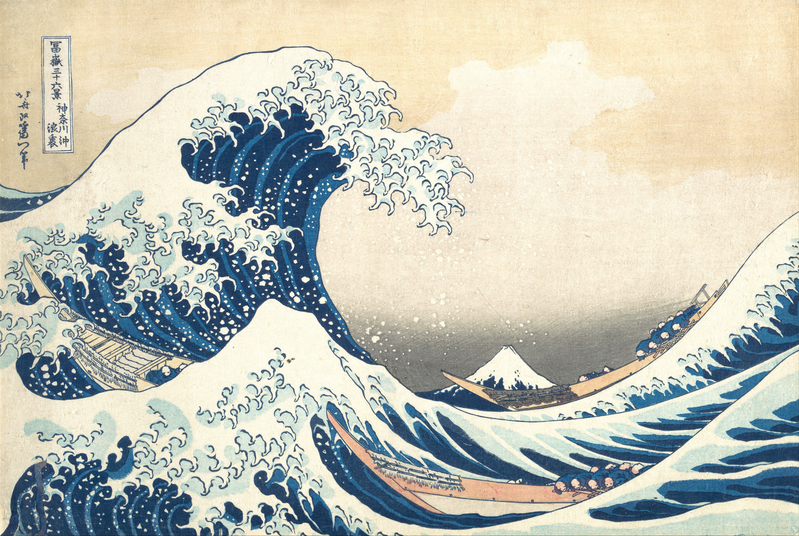
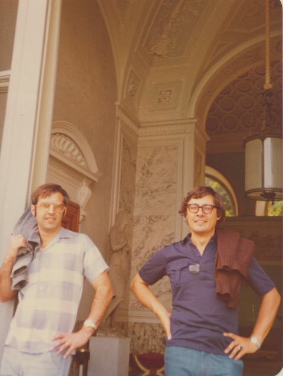

# Figure audit

This file tracks figures used in the reconstructed book. The committed 1989 PDFs in `../references/chapman-rizzoli-1989/` are the visual and scientific reference. A figure is not accepted merely because it looks cleaner: direction, magnitude relationships, wavelength, nodes, tangencies, boundary contact, coordinate orientation, and consistency with nearby equations must also survive review.

Entries are ordered by chapter, then printed page, then asset name. For a vector reconstruction, the committed source crop and vector rendering are the review surface shown below.

Representation describes the literal asset: `vector`, `source-pdf`, `edited-raster`, or `source-photo`. Equation checks remain separate:

- `ai-checked` — all materially equation-constrained content has been checked by an AI model against the governing equation(s), analytically or numerically as appropriate. This is not human validation or peer review.
- `partial` — some equation-constrained content has been checked, but another material part remains schematic or lacks a direct check.
- `pending` — equation checking materially applies but has not yet been completed and recorded.
- `n/a` — no meaningful equation-defined quantity or relation controls the figure; visual, geometric, source, and source-fidelity checks still apply.

An existing equation-check state records a prior audit; it is not proof to inherit blindly after a material figure change. A source mismatch may still be `ai-checked` when the mismatch itself has been checked and is recorded in `ERRATA.md`. `ERRATA.md` owns source discrepancies and approval state; this file cross-references errata rather than duplicating proposed corrections.

This is an asset/placement ledger, not a count of distinct figures in the book: one numbered figure can use more than one underlying asset or source crop. Keep those components separate.

Every `.tikz` file carries a `wave-source` comment naming the source PDF, physical page, and crop. Run `uv run --frozen python scripts/compare_figures.py <stem>` after changing TikZ or crop metadata; it updates the checked-in `.svg` and `.png` siblings. Use `--comparison` only when a temporary raster side-by-side image under `audit/` is useful. Generated previews are not independently edited and never imply human acceptance.

## Visual review

### Chapter 1

#### Figure 1.1 — phase speed

<table>
<tr><th>Original</th><th>Vector</th></tr>
<tr>
  <td></td>
  <td></td>
</tr>
</table>

- **Asset:** `ch01-p004-phase-speed.tikz`
- **Printed page:** 4
- **Representation:** vector
- **Equation check:** ai-checked
- **Scientific check:** Constant-phase planes are normal to `\vec{k}`; adjacent planes separated by `2 pi` in phase have normal spacing `lambda=2 pi/\lvert\vec{k}\rvert`. The wavy propagation arrows follow `+\vec{k}`; display geometry remains schematic.

#### Figure 1.3 — spectrum

<table>
<tr><th>Original</th><th>Vector</th></tr>
<tr>
  <td></td>
  <td></td>
</tr>
</table>

- **Asset:** `ch01-p008-spectrum.tikz`
- **Printed page:** 8
- **Representation:** vector
- **Equation check:** n/a
- **Scientific check:** Narrow-band spectrum is centered at `k_0`; labels do not obscure the curve.

#### Figure 1.2 — wave packet

<table>
<tr><th>Original</th><th>Vector</th></tr>
<tr>
  <td></td>
  <td></td>
</tr>
</table>

- **Asset:** `ch01-p008-wave-packet.tikz`
- **Printed page:** 8
- **Representation:** vector
- **Equation check:** ai-checked
- **Scientific check:** The carrier `cos(250 x)` uses degree arguments in PGF, giving exact display period `360/250=1.44`, equal to the wavelength bracket `3.62-2.18`; the envelope scale is independently much larger than `k_0^{-1}`.

#### Figure 1.4 — stationary phase

<table>
<tr><th>Original</th><th>Vector</th></tr>
<tr>
  <td></td>
  <td></td>
</tr>
</table>

- **Asset:** `ch01-p010-stationary-phase.tikz`
- **Printed page:** 10
- **Representation:** vector
- **Equation check:** ai-checked
- **Scientific check:** The displayed phase is quadratic in `k-k_0`; its derivative vanishes only at `k_0`, so oscillation spacing is broad there and tightens symmetrically with `\lvert k-k_0\rvert`. The modest central envelope is an explicit schematic/source-fidelity amplitude cue, not a consequence of stationary phase or the narrow-band `A(k)` example.

#### Figure 1.5 — wave crest path

<table>
<tr><th>Original</th><th>Vector</th></tr>
<tr>
  <td></td>
  <td></td>
</tr>
</table>

- **Asset:** `ch01-p012-wave-crest-path.tikz`
- **Printed page:** 12
- **Representation:** vector
- **Equation check:** ai-checked
- **Scientific check:** Rechecked against the crest-count/circulation argument: crest segments extend left as in the source and cross the A-to-B region rather than terminating within it, so both boundary paths encounter the same continuous crest family.

#### Figure 1.6 — initial wave groups

<table>
<tr><th>Original</th><th>Vector</th></tr>
<tr>
  <td></td>
  <td></td>
</tr>
</table>

- **Asset:** `ch01-p015-initial-wave-groups.tikz`
- **Printed page:** 15
- **Representation:** vector
- **Equation check:** ai-checked
- **Scientific check:** Carrier periods are exactly the declared `lambda_1=0.54` and `lambda_2=0.45`; each marker measures a center crest to the immediately adjacent crest on its left, and the local-`k` plateau increments have the required inverse-wavelength ratio.

#### Figure 1.7 — ray crossing

<table>
<tr><th>Original</th><th>Vector</th></tr>
<tr>
  <td></td>
  <td></td>
</tr>
</table>

- **Asset:** `ch01-p016-ray-crossing.tikz`
- **Printed page:** 16
- **Representation:** vector
- **Equation check:** ai-checked
- **Scientific check:** Later packet centers are generated by exact linear interpolation along the two straight homogeneous rays from the p.15 packet centers; the raised crossing leaves the displayed packets distinct, and carrier wavelengths remain unchanged along each ray.

### Chapter 2

#### Figure 2.1 — solid boundary reflection

<table>
<tr><th>Original</th><th>Vector</th></tr>
<tr>
  <td></td>
  <td></td>
</tr>
</table>

- **Asset:** `ch02-p021-solid-boundary-reflection.tikz`
- **Printed page:** 21
- **Representation:** vector
- **Equation check:** ai-checked
- **Scientific check:** The tangential wavenumber is conserved while the normal component reverses sign; the two propagation vectors are equal-magnitude specular partners, and the incident crests are normal to the incident wavevector.

#### Figure 2.2 — specular reflection

<table>
<tr><th>Original</th><th>Vector</th></tr>
<tr>
  <td></td>
  <td></td>
</tr>
</table>

- **Asset:** `ch02-p022-specular-reflection.tikz`
- **Printed page:** 22
- **Representation:** vector
- **Equation check:** ai-checked
- **Scientific check:** The wall normal is perpendicular to the boundary and the incident/reflected vectors are constructed at equal and opposite angles about it with equal magnitudes, enforcing the corrected tangential-wavenumber relation.

#### Figure 2.3 — waveguide boundary problem

<table>
<tr><th>Original</th><th>Vector</th></tr>
<tr>
  <td></td>
  <td></td>
</tr>
</table>

- **Asset:** `ch02-p023-waveguide-boundary-problem.tikz`
- **Printed page:** 23
- **Representation:** vector
- **Equation check:** ai-checked
- **Scientific check:** The channel walls are at `z=0,-D` with `p_z=0`; substituting `P=cos(n pi z/D)` gives zero normal derivative at both walls for integer `n` and satisfies the separated acoustic field equation. Wall thickness is schematic.

#### Figure 2.4 — waveguide dispersion

<table>
<tr><th>Original</th><th>Vector</th></tr>
<tr>
  <td></td>
  <td></td>
</tr>
</table>

- **Asset:** `ch02-p024-waveguide-dispersion.tikz`
- **Printed page:** 24
- **Representation:** vector
- **Equation check:** ai-checked
- **Scientific check:** Branches are generated from normalized `S_n=sqrt(K^2+n^2)`. Independent evaluation confirms the `n=0` linear branch, `n=1,2` cutoffs at `S=1,2`, branch ordering, and common large-`K` slope.

#### Figure 2.5 — interface scattering

<table>
<tr><th>Original</th><th>Vector</th></tr>
<tr>
  <td></td>
  <td></td>
</tr>
</table>

- **Asset:** `ch02-p026-interface-scattering.tikz`
- **Printed page:** 26
- **Representation:** vector
- **Equation check:** ai-checked
- **Scientific check:** Incident/reflected rays are exact mirrors about the interface normal. For the declared illustrative ratio `c_2/c_1=1.25`, the transmitted angle is calculated from Snell’s law; ray lengths remain schematic.

#### Figure 2.6 — total internal reflection

<table>
<tr><th>Original</th><th>Vector</th></tr>
<tr>
  <td></td>
  <td></td>
</tr>
</table>

- **Asset:** `ch02-p028-total-internal-reflection.tikz`
- **Printed page:** 28
- **Representation:** vector
- **Equation check:** ai-checked
- **Scientific check:** With the declared illustrative `c_1/c_2=0.75`, calculation gives `theta_Ic=48.590 deg`; the subcritical transmitted ray satisfies Snell’s law, the critical ray is tangent to the interface, and the supercritical panel has no propagating transmitted ray.

#### Figure 2.7 — forced source jump

<table>
<tr><th>Original</th><th>Vector</th></tr>
<tr>
  <td></td>
  <td></td>
</tr>
</table>

- **Asset:** `ch02-p032-forced-source-jump.tikz`
- **Printed page:** 32
- **Representation:** vector
- **Equation check:** ai-checked
- **Scientific check:** Integrating the delta-forced one-dimensional wave equation across `x=0` gives `p_x^R-p_x^L=-q_t`; each side obeys the homogeneous acoustic wave equation.

#### Figure 2.8 — sound speed profile

<table>
<tr><th>Original</th><th>Vector</th></tr>
<tr>
  <td></td>
  <td></td>
</tr>
</table>

- **Asset:** `ch02-p034-sound-speed-profile.tikz`
- **Printed page:** 34
- **Representation:** vector
- **Equation check:** partial
- **Scientific check:** Source-traced empirical deep-sound-channel profile with the source axes, depth orientation, ticks, minimum, and label preserved. The chapter gives `c(s,T,z)` but not the `T(z),s(z)` data needed to derive this exact curve, so the trace is not presented as a newly calculated profile.

#### Figure 2.9 — sound speed profiles

<table>
<tr><th>Original</th><th>Vector</th></tr>
<tr>
  <td></td>
  <td></td>
</tr>
</table>

- **Asset:** `ch02-p035-sound-speed-profiles.tikz`
- **Printed page:** 35
- **Representation:** vector
- **Equation check:** n/a
- **Scientific check:** Three source-traced empirical profiles preserve the source axes, depth orientation, shallow-water wiggles, `44°S`/`59°S` labels, and relative ordering. The source supplies no unique profile equation or environmental data for an independent curve calculation.

#### Figure 2.10 — sound ray turning

<table>
<tr><th>Original</th><th>Vector</th></tr>
<tr>
  <td></td>
  <td></td>
</tr>
</table>

- **Asset:** `ch02-p036-sound-ray-turning.tikz`
- **Printed page:** 36
- **Representation:** vector
- **Equation check:** ai-checked
- **Scientific check:** For `c(z)` increasing upward, `k` remains fixed while `m` decreases. The ray is generated from `dz/dx=m/k=sqrt(sigma^2/(c^2 k^2)-1)` and approaches a horizontal tangent as `m` tends to zero; normalized display values are schematic.

### Chapter 3

#### Figure 3.1 — surface boundaries

<table>
<tr><th>Original</th><th>Vector</th></tr>
<tr>
  <td></td>
  <td></td>
</tr>
</table>

- **Asset:** `ch03-p039-surface-boundaries.tikz`
- **Printed page:** 39
- **Representation:** vector
- **Equation check:** ai-checked
- **Scientific check:** Free surface `z=eta` near `z=0` and rigid bottom `z=-D` are preserved; the adjacent kinematic/dynamic conditions and bottom no-normal-flow condition were checked against the reconstructed derivation. Surface waviness is schematic.

#### Figure 3.2 — surface wave dispersion

<table>
<tr><th>Original</th><th>Vector</th></tr>
<tr>
  <td></td>
  <td></td>
</tr>
</table>

- **Asset:** `ch03-p042-surface-wave-dispersion.tikz`
- **Printed page:** 42
- **Representation:** vector
- **Equation check:** ai-checked
- **Scientific check:** The curve is generated from normalized `S=sqrt(K tanh K)`. Limiting checks recover `S~K` for `K<<1` and `S~sqrt(K)` for `K>>1`, with positive monotone branch and correct asymptotic ordering.

#### Figure 3.3 — two fluid interface

<table>
<tr><th>Original</th><th>Vector</th></tr>
<tr>
  <td></td>
  <td></td>
</tr>
</table>

- **Asset:** `ch03-p044-two-fluid-interface.tikz`
- **Printed page:** 44
- **Representation:** vector
- **Equation check:** ai-checked
- **Scientific check:** Two semi-infinite potential-flow regions meet at `z=eta` near `z=0`; `nabla^2 phi_1=nabla^2 phi_2=0` and the common interface geometry match the checked decay and matching construction. Interface waviness is schematic.

#### Figure 3.4 — delta snapshot

<table>
<tr><th>Original</th><th>Vector</th></tr>
<tr>
  <td></td>
  <td></td>
</tr>
</table>

- **Asset:** `ch03-p052-delta-snapshot.tikz`
- **Printed page:** 52
- **Representation:** vector
- **Equation check:** ai-checked
- **Scientific check:** Snapshot is generated directly from `eta proportional to t x^(-3/2) cos(g t^2/(4x)+pi/4)` at fixed `t`; differentiating the phase confirms local wavelength grows with `x`, while the explicit envelope decays as `x^(-3/2)`.

#### Figure 3.5 — delta wavestaff

<table>
<tr><th>Original</th><th>Vector</th></tr>
<tr>
  <td></td>
  <td></td>
</tr>
</table>

- **Asset:** `ch03-p052-delta-wavestaff.tikz`
- **Printed page:** 52
- **Representation:** vector
- **Equation check:** ai-checked
- **Scientific check:** Fixed-position record is generated from the same asymptotic solution: amplitude envelope grows linearly in `t` and instantaneous frequency grows in magnitude with `t`, so oscillations tighten while the envelope expands.

#### Figure 3.6 — ship wave geometry

<table>
<tr><th>Original</th><th>Vector</th></tr>
<tr>
  <td></td>
  <td></td>
</tr>
</table>

- **Asset:** `ch03-p055-ship-wave-geometry.tikz`
- **Printed page:** 55
- **Representation:** vector
- **Equation check:** ai-checked
- **Scientific check:** Triangle components are constructed so `rho(t)^2=r^2+V^2t^2+2Vtr cos(theta)` for `t<0`; horizontal and vertical projections reproduce the source labels rather than tracing the scan.

#### Figure 3.7 — kelvin wake

<table>
<tr><th>Original</th><th>Vector</th></tr>
<tr>
  <td></td>
  <td></td>
</tr>
</table>

- **Asset:** `ch03-p056-kelvin-wake.tikz`
- **Printed page:** 56
- **Representation:** vector
- **Equation check:** ai-checked
- **Scientific check:** Both crest families are generated from constant `P(t_+)` and `P(t_-)` after substituting the stationary times. The cusp condition `cos^2(theta)=8/9` gives `theta=19 deg 28 min`; phase constants only set crest spacing.

#### Figure 3.8 — shallow mach cone

<table>
<tr><th>Original</th><th>Vector</th></tr>
<tr>
  <td></td>
  <td></td>
</tr>
</table>

- **Asset:** `ch03-p056-shallow-mach-cone.tikz`
- **Printed page:** 56
- **Representation:** vector
- **Equation check:** ai-checked
- **Scientific check:** The wave circles expand at shallow-water speed `c` from successive source positions; their common envelope gives the Mach-cone geometry and the expected speed-angle relation.

#### Figure 3.10 — following current dispersion

<table>
<tr><th>Original</th><th>Vector</th></tr>
<tr>
  <td></td>
  <td></td>
</tr>
</table>

- **Asset:** `ch03-p061-following-current-dispersion.tikz`
- **Printed page:** 61
- **Representation:** vector
- **Equation check:** ai-checked
- **Scientific check:** Curves and marked roots solve normalized `sqrt(k tanh k)=1-Uk`; increasing following current shifts the physical root to smaller `k`, and the upper wave is generated from those local roots so its wavelength lengthens.

#### Figure 3.11 — opposing current blocking

<table>
<tr><th>Original</th><th>Vector</th></tr>
<tr>
  <td></td>
  <td></td>
</tr>
</table>

- **Asset:** `ch03-p062-opposing-current-blocking.tikz`
- **Printed page:** 62
- **Representation:** vector
- **Equation check:** ai-checked
- **Scientific check:** The blocking point is the double-root/tangency condition for the opposing-current dispersion relation; the independent calculation reproduces `k=4.0426391` and `U_abs=0.2498398` in the normalized case.

#### Figure 3.12 — shear current refraction

<table>
<tr><th>Original</th><th>Vector</th></tr>
<tr>
  <td></td>
  <td></td>
</tr>
</table>

- **Asset:** `ch03-p063-shear-current-refraction.tikz`
- **Printed page:** 63
- **Representation:** vector
- **Equation check:** ai-checked
- **Scientific check:** Deep-water ray is integrated from the absolute group velocity while enforcing constant `sigma` and `ell`, `k^2=(sigma-ell V)^4/g^2-ell^2`, and `ell=K sin(theta)`. The component triangle terminates at the wavevector tip; the chosen smooth `V(x)` profile is illustrative.

### Chapter 4

#### Figure 4.1 — parcel displacement

<table>
<tr><th>Original</th><th>Vector</th></tr>
<tr>
  <td></td>
  <td></td>
</tr>
</table>

- **Asset:** `ch04-p065-parcel-displacement.tikz`
- **Printed page:** 65
- **Representation:** vector
- **Equation check:** n/a
- **Scientific check:** Background-density profile, equilibrium location, and upward displacement `xi` are preserved; curvature is schematic.

#### Figure 4.2 — boundary value problem

<table>
<tr><th>Original</th><th>Vector</th></tr>
<tr>
  <td></td>
  <td></td>
</tr>
</table>

- **Asset:** `ch04-p068-boundary-value-problem.tikz`
- **Printed page:** 68
- **Representation:** vector
- **Equation check:** ai-checked
- **Scientific check:** The checked free-surface condition `(sigma^2-f^2) w_z+g nabla_H^2 w=0`, interior internal-wave equation, and bottom `w=0` condition are attached to the correct `z=0,-D` boundaries.

#### Figure 4.3 — dispersion cone

<table>
<tr><th>Original</th><th>Vector</th></tr>
<tr>
  <td></td>
  <td></td>
</tr>
</table>

- **Asset:** `ch04-p069-dispersion-cone.tikz`
- **Printed page:** 69
- **Representation:** vector
- **Equation check:** ai-checked
- **Scientific check:** The cone satisfies `m^2=R^2(k^2+ell^2)`; the displayed opening angle is generated from the same cone geometry rather than hard-coded.

#### Figure 4.4 — nonrotating transverse

<table>
<tr><th>Original</th><th>Vector</th></tr>
<tr>
  <td></td>
  <td></td>
</tr>
</table>

- **Asset:** `ch04-p069-nonrotating-transverse.tikz`
- **Printed page:** 69
- **Representation:** vector
- **Equation check:** ai-checked
- **Scientific check:** For `f=0`, the reconstructed velocity is generated perpendicular to `k`; the vertical component relation `w=u sin(theta)` follows from that geometry.

#### Figure 4.5 — rotating transverse

<table>
<tr><th>Original</th><th>Vector</th></tr>
<tr>
  <td></td>
  <td></td>
</tr>
</table>

- **Asset:** `ch04-p070-rotating-transverse.tikz`
- **Printed page:** 70
- **Representation:** vector
- **Equation check:** ai-checked
- **Scientific check:** The velocity is generated transverse to `k`; `f_parallel` is the projection of vertical `f` onto `k` and `f_perp=f-f_parallel` is normal to `k`.

#### Figure 4.7 — phase energy phi

<table>
<tr><th>Original</th><th>Vector</th></tr>
<tr>
  <td></td>
  <td></td>
</tr>
</table>

- **Asset:** `ch04-p072-phase-energy-phi.tikz`
- **Printed page:** 72
- **Representation:** vector
- **Equation check:** ai-checked
- **Scientific check:** Lower `f>N` / `f<N` pair: `c_g` is the energy direction and phase propagation is perpendicular; the redraw excludes surrounding source prose. Direction relations were independently checked.

#### Figure 4.6 — phase energy theta

<table>
<tr><th>Original</th><th>Vector</th></tr>
<tr>
  <td></td>
  <td></td>
</tr>
</table>

- **Asset:** `ch04-p072-phase-energy-theta.tikz`
- **Printed page:** 72
- **Representation:** vector
- **Equation check:** ai-checked
- **Scientific check:** Upper `f>N` / `f<N` pair: phase direction and energy direction are perpendicular; the energy arrow reverses side as in the source. Direction limits were independently checked.

#### Figure 4.8 — rotation only limits

<table>
<tr><th>Original</th><th>Vector</th></tr>
<tr>
  <td></td>
  <td></td>
</tr>
</table>

- **Asset:** `ch04-p073-rotation-only-limits.tikz`
- **Printed page:** 73
- **Representation:** vector
- **Equation check:** ai-checked
- **Scientific check:** Rotation-only endpoint sketch is reconstructed from the stated limits (`phi=0` Taylor-column limit and `phi=90 deg` inertial limit), excluding surrounding prose. Both endpoint limits were checked from the chapter equations.

#### Figure 4.9 — stratification only limits

<table>
<tr><th>Original</th><th>Vector</th></tr>
<tr>
  <td></td>
  <td></td>
</tr>
</table>

- **Asset:** `ch04-p074-stratification-only-limits.tikz`
- **Printed page:** 74
- **Representation:** vector
- **Equation check:** ai-checked
- **Scientific check:** Stratification-only endpoint sketch preserves the buoyancy-oscillation and steady limits without surrounding source prose. Both endpoint limits were checked from the chapter equations.

#### Figure 4.10 — rotation stratification limits

<table>
<tr><th>Original</th><th>Vector</th></tr>
<tr>
  <td></td>
  <td></td>
</tr>
</table>

- **Asset:** `ch04-p075-rotation-stratification-limits.tikz`
- **Printed page:** 75
- **Representation:** vector
- **Equation check:** ai-checked
- **Scientific check:** Combined rotation/stratification endpoint sketch preserves the buoyancy and inertial limits and their wavenumber orientations. The limiting values were checked from the chapter equations.

#### Figure 4.11 — waveguide boundary problem

<table>
<tr><th>Original</th><th>Vector</th></tr>
<tr>
  <td></td>
  <td></td>
</tr>
</table>

- **Asset:** `ch04-p076-waveguide-boundary-problem.tikz`
- **Printed page:** 76
- **Representation:** vector
- **Equation check:** ai-checked
- **Scientific check:** Substitution confirms the internal-wave field equation and the same free-surface/bottom conditions as p.68, with labels attached to the `z=0,-D` boundaries.

#### Figure 4.12 — frequency regimes

<table>
<tr><th>Original</th><th>Vector</th></tr>
<tr>
  <td></td>
  <td></td>
</tr>
</table>

- **Asset:** `ch04-p077-frequency-regimes.tikz`
- **Printed page:** 77
- **Representation:** vector
- **Equation check:** ai-checked
- **Scientific check:** Frequency regimes are classified from the signs of `S^2=sigma^2-f^2`, `R^2=(N^2-sigma^2)/(sigma^2-f^2)`, and `R_1^2=-R^2`; the four orderings were independently checked.

#### Figure 4.13 — case a intersections

<table>
<tr><th>Original</th><th>Vector</th></tr>
<tr>
  <td></td>
  <td></td>
</tr>
</table>

- **Asset:** `ch04-p078-case-a-intersections.tikz`
- **Printed page:** 78
- **Representation:** vector
- **Equation check:** ai-checked
- **Scientific check:** Root solving of normalized `1/k=tanh(k)` gives `k=+/-1.1996786403`; the vector contains those two symmetric propagating intersections.

#### Figure 4.14 — case a1 no intersections

<table>
<tr><th>Original</th><th>Vector</th></tr>
<tr>
  <td></td>
  <td></td>
</tr>
</table>

- **Asset:** `ch04-p078-case-a1-no-intersections.tikz`
- **Printed page:** 78
- **Representation:** vector
- **Equation check:** ai-checked
- **Scientific check:** For normalized `-1/k=tanh(k)`, the two sides have opposite sign for every nonzero real `k`; a sign/root check confirms no real propagating intersection.

#### Figure 4.15 — case b intersections

<table>
<tr><th>Original</th><th>Vector</th></tr>
<tr>
  <td></td>
  <td></td>
</tr>
</table>

- **Asset:** `ch04-p079-case-b-intersections.tikz`
- **Printed page:** 79
- **Representation:** vector
- **Equation check:** ai-checked
- **Scientific check:** Both panels are generated from normalized `C/x=tan x`. Root calculations reproduce the small-`k` surface pair only for `sigma^2>f^2` and the infinite internal-mode sequence in both sign cases. Asymptotic curves are clipped to the source chart frame.

#### Figure 4.16 — waveguide dispersion

<table>
<tr><th>Original</th><th>Vector</th></tr>
<tr>
  <td></td>
  <td></td>
</tr>
</table>

- **Asset:** `ch04-p080-waveguide-dispersion.tikz`
- **Printed page:** 80
- **Representation:** vector
- **Equation check:** ai-checked
- **Scientific check:** Surface and internal branches are generated from the stated approximate dispersion relations. Limiting checks give `sigma->f` as `k->0`, `sigma->N` as `k->infinity`, and vanishing group velocity at both internal-branch limits.

#### Figure 4.17 — mode structure

<table>
<tr><th>Original</th><th>Vector</th></tr>
<tr>
  <td></td>
  <td></td>
</tr>
</table>

- **Asset:** `ch04-p081-mode-structure.tikz`
- **Printed page:** 81
- **Representation:** vector
- **Equation check:** ai-checked
- **Scientific check:** The `n=1` profiles are generated from `w~sin(pi(z+D)/D)` and `u~cos(pi(z+D)/D)`; nodes, antinodes, and boundary values were checked.

#### Figure 4.18 — particle cells

<table>
<tr><th>Original</th><th>Vector</th></tr>
<tr>
  <td></td>
  <td></td>
</tr>
</table>

- **Asset:** `ch04-p081-particle-cells.tikz`
- **Printed page:** 81
- **Representation:** vector
- **Equation check:** ai-checked
- **Scientific check:** Velocity cells use the same `n=1` solution and are analytically divergence-free. Surface convergence/divergence locations and alternating circulation follow from the checked `u,w` phase relation.

#### Figure 4.19 — evanescent case a

<table>
<tr><th>Original</th><th>Vector</th></tr>
<tr>
  <td></td>
  <td></td>
</tr>
</table>

- **Asset:** `ch04-p083-evanescent-case-a.tikz`
- **Printed page:** 83
- **Representation:** vector
- **Equation check:** ai-checked
- **Scientific check:** Panels are generated from normalized `C/x=-tan x`. Independent roots confirm an infinite evanescent sequence and an additional small-magnitude `k` pair in case A1.

#### Figure 4.20 — evanescent case b

<table>
<tr><th>Original</th><th>Vector</th></tr>
<tr>
  <td></td>
  <td></td>
</tr>
</table>

- **Asset:** `ch04-p084-evanescent-case-b.tikz`
- **Printed page:** 84
- **Representation:** vector
- **Equation check:** ai-checked
- **Scientific check:** The normalized relation `C/x=-tanh x` was solved: the `S^2>0` sign has no real positive root while the `S^2<0` sign has one positive root and its negative partner.

#### Figure 4.21 — topographic generation

<table>
<tr><th>Original</th><th>Vector</th></tr>
<tr>
  <td></td>
  <td></td>
</tr>
</table>

- **Asset:** `ch04-p085-topographic-generation.tikz`
- **Printed page:** 85
- **Representation:** vector
- **Equation check:** ai-checked
- **Scientific check:** For the declared illustrative set `k=100 deg=1.745329` per display unit and `N/U=2`, `m=0.976640` and `k/m=1.787075`. Wavefronts obey `k x+m z=const`, `c_g` is tangent with the exact slope, and `w=U h_x` arrows have the derivative sign.

#### Figure 4.22 — characteristics

<table>
<tr><th>Original</th><th>Vector</th></tr>
<tr>
  <td></td>
  <td></td>
</tr>
</table>

- **Asset:** `ch04-p088-characteristics.tikz`
- **Printed page:** 88
- **Representation:** vector
- **Equation check:** ai-checked
- **Scientific check:** Characteristics have slopes `dz/dx=+-1/R`; wavevectors are normal and group/energy directions tangent, so `k dot c_g=0`.

#### Figure 4.23 — slope reflection

<table>
<tr><th>Original</th><th>Vector</th></tr>
<tr>
  <td></td>
  <td></td>
</tr>
</table>

- **Asset:** `ch04-p089-slope-reflection.tikz`
- **Printed page:** 89
- **Representation:** vector
- **Equation check:** ai-checked
- **Scientific check:** Incident and reflected energy are constrained to the two characteristic slopes `+-1/R`, not specular mirrors about the wall normal; the fixed-frequency direction constraint was checked.

#### Figure 4.24 — wavenumber projection

<table>
<tr><th>Original</th><th>Vector</th></tr>
<tr>
  <td></td>
  <td></td>
</tr>
</table>

- **Asset:** `ch04-p089-wavenumber-projection.tikz`
- **Printed page:** 89
- **Representation:** vector
- **Equation check:** ai-checked
- **Scientific check:** For an explicit subcritical display case, `m_i=Rk_i`, `m_r=-Rk_r`, and the reflected factor is solved from equal phase projection along `z=ax`; the vector is constructed from that relation.

#### Figure 4.26 — velocity reflection

<table>
<tr><th>Original</th><th>Vector</th></tr>
<tr>
  <td></td>
  <td></td>
</tr>
</table>

- **Asset:** `ch04-p090-velocity-reflection.tikz`
- **Printed page:** 90
- **Representation:** vector
- **Equation check:** ai-checked
- **Scientific check:** The revised subcritical velocity construction uses equal-base characteristic vectors and scales the reflected one by `q=(1+aR)/(1-aR)=2.333333`; the reflected-to-incident velocity-magnitude ratio is `q` and `n dot (v_i+v_r)=0`. See `ERRATA.md`, printed p.90, for the source formula issues.

#### Figure 4.25 — wavenumber triangle

<table>
<tr><th>Original</th><th>Vector</th></tr>
<tr>
  <td></td>
  <td></td>
</tr>
</table>

- **Asset:** `ch04-p090-wavenumber-triangle.tikz`
- **Printed page:** 90
- **Representation:** vector
- **Equation check:** ai-checked
- **Scientific check:** The revised subcritical construction uses common `R=1.25`, `a=0.32`; directions are `+/-atan(R)` and arrow lengths use `q=(1+aR)/(1-aR)=2.333333`. It makes no supercritical magnitude claim. See `ERRATA.md`, printed p.90.

#### Figure 4.29 — turning profile

<table>
<tr><th>Original</th><th>Vector</th></tr>
<tr>
  <td></td>
  <td></td>
</tr>
</table>

- **Asset:** `ch04-p093-turning-profile.tikz`
- **Printed page:** 93
- **Representation:** vector
- **Equation check:** ai-checked
- **Scientific check:** The smooth `R^2(z)` curve is an arbitrary input profile, not a solved quantity. Checked constraints: `R^2>0` gives oscillatory structure, `R^2<0` evanescence, and `R^2=0` is the turning level.

#### Figure 4.30 — eigenvalue spectrum

<table>
<tr><th>Original</th><th>Vector</th></tr>
<tr>
  <td></td>
  <td></td>
</tr>
</table>

- **Asset:** `ch04-p094-eigenvalue-spectrum.tikz`
- **Printed page:** 94
- **Representation:** vector
- **Equation check:** ai-checked
- **Scientific check:** The generalized Sturm--Liouville ordering is reconstructed from the stated sequence: negative `k^2` evanescent modes are unbounded below and positive `k^2` travelling modes are unbounded above.

### Chapter 5

#### Figure 5.3 — rectangular basin

<table>
<tr><th>Original</th><th>Vector</th></tr>
<tr>
  <td></td>
  <td></td>
</tr>
</table>

- **Asset:** `ch05-p108-rectangular-basin.tikz`
- **Printed page:** 108
- **Representation:** vector
- **Equation check:** n/a
- **Scientific check:** Four walls and `x=0,a`, `y=0,b` geometry reproduce the source.

#### Figure 5.2 — wall reflection

<table>
<tr><th>Original</th><th>Vector</th></tr>
<tr>
  <td></td>
  <td></td>
</tr>
</table>

- **Asset:** `ch05-p108-wall-reflection.tikz`
- **Printed page:** 108
- **Representation:** vector
- **Equation check:** ai-checked
- **Scientific check:** Reflected endpoint is the mirror of the incident endpoint about the wall normal, so `alpha_R=alpha_I` and displayed ray magnitudes are equal. The mirror/equal-angle constraint was checked.

#### Figure 5.4 — depth step rays

<table>
<tr><th>Original</th><th>Vector</th></tr>
<tr>
  <td></td>
  <td></td>
</tr>
</table>

- **Asset:** `ch05-p110-depth-step-rays.tikz`
- **Printed page:** 110
- **Representation:** vector
- **Equation check:** ai-checked
- **Scientific check:** The illustrative construction declares `D_1/D_2=0.60`; `alpha_T=asin[sqrt(D_1/D_2) sin(alpha_I)]` is generated from Snell’s law and `alpha_R=alpha_I`. Ray lengths alone are schematic.

#### Figure 5.8 — ray paths

<table>
<tr><th>Original</th><th>Vector</th></tr>
<tr>
  <td></td>
  <td></td>
</tr>
</table>

- **Asset:** `ch05-p114-ray-paths.tikz`
- **Printed page:** 114
- **Representation:** vector
- **Equation check:** ai-checked
- **Scientific check:** With declared `D_1/D_2=0.10`, the critical angle is `18.43495 deg`; panel A uses `19.2 deg` and totally reflects, while panel B computes the shelf angle `7.73799 deg` from `25.2 deg` deep incidence and reflects specularly at the coast.

#### Figure 5.7 — step shelf

<table>
<tr><th>Original</th><th>Vector</th></tr>
<tr>
  <td></td>
  <td></td>
</tr>
</table>

- **Asset:** `ch05-p114-step-shelf.tikz`
- **Printed page:** 114
- **Representation:** vector
- **Equation check:** n/a
- **Scientific check:** Coast, shelf width `L`, and `D_1/D_2` step geometry reproduce the source.

#### Figure 5.9 — edge wave profile

<table>
<tr><th>Original</th><th>Vector</th></tr>
<tr>
  <td></td>
  <td></td>
</tr>
</table>

- **Asset:** `ch05-p115-edge-wave-profile.tikz`
- **Printed page:** 115
- **Representation:** vector
- **Equation check:** ai-checked
- **Scientific check:** Shelf cosine and offshore exponential were evaluated and satisfy both `eta` continuity and `D eta_x` continuity at `x=L`; display-only parameters are identified in comments and are not presented as source data.

#### Figure 5.10 — edge wave dispersion

<table>
<tr><th>Original</th><th>Vector</th></tr>
<tr>
  <td></td>
  <td></td>
</tr>
</table>

- **Asset:** `ch05-p116-edge-wave-dispersion.tikz`
- **Printed page:** 116
- **Representation:** vector
- **Equation check:** ai-checked
- **Scientific check:** First three branches are generated from the stated matching relation; branch cutoffs/asymptotes were checked against the dispersion relation.

#### Figure 5.11 — forced shelf profile

<table>
<tr><th>Original</th><th>Vector</th></tr>
<tr>
  <td></td>
  <td></td>
</tr>
</table>

- **Asset:** `ch05-p117-forced-shelf-profile.tikz`
- **Printed page:** 117
- **Representation:** vector
- **Equation check:** ai-checked
- **Scientific check:** The display sets `ell=0`, `D_1/D_2=0.10`, and `k_1 L=6 pi`, so `k_2/k_1=sqrt(D_1/D_2)`; choosing `B=C=A/2` makes both elevation and `D eta_x` continuous at the shelf break.

#### Figure 5.12 — coastal seiche modes

<table>
<tr><th>Original</th><th>Vector</th></tr>
<tr>
  <td></td>
  <td></td>
</tr>
</table>

- **Asset:** `ch05-p118-coastal-seiche-modes.tikz`
- **Printed page:** 118
- **Representation:** vector
- **Equation check:** ai-checked
- **Scientific check:** Both modes have the common shelf-break elevation node; the higher mode adds one shelf zero as required by the modal conditions.

#### Figure 5.13 — particle motion

<table>
<tr><th>Original</th><th>Vector</th></tr>
<tr>
  <td></td>
  <td></td>
</tr>
</table>

- **Asset:** `ch05-p119-particle-motion.tikz`
- **Printed page:** 119
- **Representation:** vector
- **Equation check:** ai-checked
- **Scientific check:** Phase planes are normal to `k`; no-rotation displacement is parallel to `k`, while rotating trajectories are clockwise ellipses checked against `u/v=i sigma/f`.

#### Figure 5.14 — waveguide channel

<table>
<tr><th>Original</th><th>Vector</th></tr>
<tr>
  <td></td>
  <td></td>
</tr>
</table>

- **Asset:** `ch05-p123-waveguide-channel.tikz`
- **Printed page:** 123
- **Representation:** vector
- **Equation check:** n/a
- **Scientific check:** Two channel walls and `v=0`, `y=0,a` labels reproduce the source geometry.

#### Figure 5.15 — amphidromic pattern

<table>
<tr><th>Original / maintained raster</th></tr>
<tr>
  <td></td>
</tr>
</table>

- **Asset:** `ch05-p124-amphidromic-pattern.png`
- **Printed page:** 124
- **Representation:** edited-raster
- **Equation check:** ai-checked
- **Scientific check:** For equal counter-propagating Kelvin waves, superposition gives zeros at `y=a/2`, `x=(n+1/2) pi/k`, spacing `pi/k`, and one rotation per `2 pi/sigma`, matching the kept source field pattern.

#### Figure 5.16 — closed channel

<table>
<tr><th>Original</th><th>Vector</th></tr>
<tr>
  <td></td>
  <td></td>
</tr>
</table>

- **Asset:** `ch05-p125-closed-channel.tikz`
- **Printed page:** 125
- **Representation:** vector
- **Equation check:** n/a
- **Scientific check:** Three closed-channel boundaries and `u=0`, `v=0`, `x=0`, `y=0,a` labels are preserved.

#### Figure 5.17 — kelvin turning corner

<table>
<tr><th>Original / maintained raster</th></tr>
<tr>
  <td></td>
</tr>
</table>

- **Asset:** `ch05-p126-kelvin-turning-corner.png`
- **Printed page:** 126
- **Representation:** edited-raster
- **Equation check:** partial
- **Scientific check:** Far-field Kelvin directions and the no-normal-flow requirement are checked. The detailed near-corner field requires an infinite Poincaré-mode matching solution and is not uniquely reconstructed here, so keeping the source raster is intentional.

#### Figure 5.18 — rossby dispersion

<table>
<tr><th>Original</th><th>Vector</th></tr>
<tr>
  <td></td>
  <td></td>
</tr>
</table>

- **Asset:** `ch05-p129-rossby-dispersion.tikz`
- **Printed page:** 129
- **Representation:** vector
- **Equation check:** ai-checked
- **Scientific check:** Constant-frequency circle and group-velocity normal direction were checked against the stated Rossby relation.

#### Figure 5.19 — rossby mechanism

<table>
<tr><th>Original</th><th>Vector</th></tr>
<tr>
  <td></td>
  <td></td>
</tr>
</table>

- **Asset:** `ch05-p130-rossby-mechanism.tikz`
- **Printed page:** 130
- **Representation:** vector
- **Equation check:** ai-checked
- **Scientific check:** Panels were checked against the stated sinusoidal field and time tendency, producing westward phase displacement.

#### Figure 5.20 — divergent dispersion

<table>
<tr><th>Original</th><th>Vector</th></tr>
<tr>
  <td></td>
  <td></td>
</tr>
</table>

- **Asset:** `ch05-p132-divergent-dispersion.tikz`
- **Printed page:** 132
- **Representation:** vector
- **Equation check:** ai-checked
- **Scientific check:** Fixed-frequency solutions were checked against the stated dispersion relation and lie on the constant-`k` line with arbitrary `ell`.

#### Figure 5.21 — pressure high

<table>
<tr><th>Original</th><th>Vector</th></tr>
<tr>
  <td></td>
  <td></td>
</tr>
</table>

- **Asset:** `ch05-p132-pressure-high.tikz`
- **Printed page:** 132
- **Representation:** vector
- **Equation check:** ai-checked
- **Scientific check:** For geostrophic flow `u=-g eta_y/f`, `v=g eta_x/f`, differentiation gives `div u_g=-g beta eta_x/f^2`: convergence/rising pressure occurs west of the high at A and divergence/falling pressure east at B, with clockwise Northern Hemisphere circulation.

#### Figure 5.22 — general rossby dispersion

<table>
<tr><th>Original</th><th>Vector</th></tr>
<tr>
  <td></td>
  <td></td>
</tr>
</table>

- **Asset:** `ch05-p134-general-rossby-dispersion.tikz`
- **Printed page:** 134
- **Representation:** vector
- **Equation check:** ai-checked
- **Scientific check:** Constant-frequency circle and long-/short-wave branches were checked against the nearby equation.

#### Figure 5.23 — wave class dispersion

<table>
<tr><th>Original</th><th>Vector</th></tr>
<tr>
  <td></td>
  <td></td>
</tr>
</table>

- **Asset:** `ch05-p135-wave-class-dispersion.tikz`
- **Printed page:** 135
- **Representation:** vector
- **Equation check:** ai-checked
- **Scientific check:** Surfaces and inertial/Rossby cutoffs were checked against the model relations rather than accepted from freehand cone placement.

#### Figure 5.24 — angled wall reflection

<table>
<tr><th>Original</th><th>Vector</th></tr>
<tr>
  <td></td>
  <td></td>
</tr>
</table>

- **Asset:** `ch05-p137-angled-wall-reflection.tikz`
- **Printed page:** 137
- **Representation:** vector
- **Equation check:** ai-checked
- **Scientific check:** Wall/normal perpendicularity and incident/reflected group-velocity mirror geometry were checked against the reflection constraint.

#### Figure 5.25 — rossby reflection construction

<table>
<tr><th>Original</th><th>Vector</th></tr>
<tr>
  <td></td>
  <td></td>
</tr>
</table>

- **Asset:** `ch05-p138-rossby-reflection-construction.tikz`
- **Printed page:** 138
- **Representation:** vector
- **Equation check:** ai-checked
- **Scientific check:** Incident/reflected roots and radial group velocities were checked against the constant-frequency circle and equal along-wall wavenumber projection.

#### Figure 5.27 — eastern reflection

<table>
<tr><th>Original</th><th>Vector</th></tr>
<tr>
  <td></td>
  <td></td>
</tr>
</table>

- **Asset:** `ch05-p139-eastern-reflection.tikz`
- **Printed page:** 139
- **Representation:** vector
- **Equation check:** ai-checked
- **Scientific check:** Short-wave incident and long-wave reflected roots, including the group-velocity reversal, were checked against the dispersion geometry.

#### Figure 5.26 — western reflection

<table>
<tr><th>Original</th><th>Vector</th></tr>
<tr>
  <td></td>
  <td></td>
</tr>
</table>

- **Asset:** `ch05-p139-western-reflection.tikz`
- **Printed page:** 139
- **Representation:** vector
- **Equation check:** ai-checked
- **Scientific check:** Long-wave incident and short-wave reflected roots, including the group-velocity reversal, were checked against the dispersion geometry.

#### Figure 5.28 — hermite modes

<table>
<tr><th>Original</th><th>Vector</th></tr>
<tr>
  <td></td>
  <td></td>
</tr>
</table>

- **Asset:** `ch05-p142-hermite-modes.tikz`
- **Printed page:** 142
- **Representation:** vector
- **Equation check:** ai-checked
- **Scientific check:** Curves were checked as `exp(-xi^2/2) H_m(xi)` for `m=0..3`; parity, zeros, and lobes are exact.

#### Figure 5.30 — equatorial dispersion

<table>
<tr><th>Original</th><th>Vector</th></tr>
<tr>
  <td></td>
  <td></td>
</tr>
</table>

- **Asset:** `ch05-p145-equatorial-dispersion.tikz`
- **Printed page:** 145
- **Representation:** vector
- **Equation check:** ai-checked
- **Scientific check:** `m=1,2,3` gravity/Rossby branches, Yanai branch, and Kelvin branch were checked against the stated dispersion relations.

#### Figure 5.29 — kelvin circulation

<table>
<tr><th>Original</th><th>Vector</th></tr>
<tr>
  <td></td>
  <td></td>
</tr>
</table>

- **Asset:** `ch05-p145-kelvin-circulation.tikz`
- **Printed page:** 145
- **Representation:** vector
- **Equation check:** n/a
- **Scientific check:** Eastward equatorial Kelvin-wave path and boundary return circulation preserve the source closure; this is a directional schematic rather than an equation-defined plotted quantity.

#### Figure 5.31 — equatorial ray

<table>
<tr><th>Original</th><th>Vector</th></tr>
<tr>
  <td></td>
  <td></td>
</tr>
</table>

- **Asset:** `ch05-p147-equatorial-ray.tikz`
- **Printed page:** 147
- **Representation:** vector
- **Equation check:** ai-checked
- **Scientific check:** The source-defined sinusoidal ray and its extrema were checked against its turning-latitude construction. See `ERRATA.md`, printed pp.146--147, for the separate group-velocity ray-law issue.

### Chapter 6

#### Figure 6.1 — sloping channel

<table>
<tr><th>Original</th><th>Vector</th></tr>
<tr>
  <td></td>
  <td></td>
</tr>
</table>

- **Asset:** `ch06-p151-sloping-channel.tikz`
- **Printed page:** 151
- **Representation:** vector
- **Equation check:** ai-checked
- **Scientific check:** The channel is constructed with sidewalls `y=0,L`, rigid lid `z=0`, and the planar bottom `z=-H+alpha y`; perspective depth is schematic but every boundary contact follows the stated geometry.

#### Figure 6.2 — bottom trapped mode

<table>
<tr><th>Original</th><th>Vector</th></tr>
<tr>
  <td></td>
  <td></td>
</tr>
</table>

- **Asset:** `ch06-p152-bottom-trapped-mode.tikz`
- **Printed page:** 152
- **Representation:** vector
- **Equation check:** ai-checked
- **Scientific check:** The vertical structure is generated from normalized `cosh(mu z)` with `mu^2=S^2(n^2 pi^2+k^2)`. Evaluation confirms amplitude increases monotonically toward the bottom and trapping strengthens with increasing `mu`.

#### Figure 6.3 — effective slope

<table>
<tr><th>Original</th><th>Vector</th></tr>
<tr>
  <td></td>
  <td></td>
</tr>
</table>

- **Asset:** `ch06-p154-effective-slope.tikz`
- **Printed page:** 154
- **Representation:** vector
- **Equation check:** ai-checked
- **Scientific check:** The scaled bottom is `z prime=R alpha x`, with `theta=atan(R alpha)` and `R alpha=S/sqrt(1-omega^2)`; tangent `k` and normal decay `m` are perpendicular.

#### Figure 6.4 — bottom slope trapping

<table>
<tr><th>Original</th><th>Vector</th></tr>
<tr>
  <td></td>
  <td></td>
</tr>
</table>

- **Asset:** `ch06-p156-bottom-slope-trapping.tikz`
- **Printed page:** 156
- **Representation:** vector
- **Equation check:** ai-checked
- **Scientific check:** From the checked dispersion relation, for `omega<1` the sign of `k^2` is the sign of `S^2-omega^2`: propagation requires `omega<S`, while `omega>S` is evanescent. The reflection/trapping panels encode those regimes.

#### Figure 6.5 — continental shelf

<table>
<tr><th>Original</th><th>Vector</th></tr>
<tr>
  <td></td>
  <td></td>
</tr>
</table>

- **Asset:** `ch06-p157-continental-shelf.tikz`
- **Printed page:** 157
- **Representation:** vector
- **Equation check:** ai-checked
- **Scientific check:** The shelf profile is generated from `D=D_0 exp(2bx)` for `0<x<L` and matched to constant depth offshore; coast, shelf edge, and alongshore/offshore axes obey the chapter definition.

#### Figure 6.6 — shelf root condition

<table>
<tr><th>Original</th><th>Vector</th></tr>
<tr>
  <td></td>
  <td></td>
</tr>
</table>

- **Asset:** `ch06-p159-shelf-root-condition.tikz`
- **Printed page:** 159
- **Representation:** vector
- **Equation check:** ai-checked
- **Scientific check:** The root plot is generated from `tan(kL)=k/(ell-b)`. For normalized `(ell-b)L=-1.5`, roots are `2.1746260`, `5.0036453`, and `8.0384628`, approaching half-integer-`pi` asymptotes.

#### Figure 6.9 — coastal geometry

<table>
<tr><th>Original</th><th>Vector</th></tr>
<tr>
  <td></td>
  <td></td>
</tr>
</table>

- **Asset:** `ch06-p162-coastal-geometry.tikz`
- **Printed page:** 162
- **Representation:** vector
- **Equation check:** n/a
- **Scientific check:** `z=-H` is attached to the flat deep-ocean bottom; the lower shaded closure is distinguished from the physical bottom.

#### Figure 6.10 — ctw dispersion family

<table>
<tr><th>Original</th><th>Vector</th></tr>
<tr>
  <td></td>
  <td></td>
</tr>
</table>

- **Asset:** `ch06-p164-ctw-dispersion-family.tikz`
- **Printed page:** 164
- **Representation:** vector
- **Equation check:** partial
- **Scientific check:** Schematic branches obey checked origin, ordering, and common short-wave asymptote constraints, but the full branch shapes are intentionally schematic rather than independently replotted solutions.

#### Figure 6.11 — stratification effect

<table>
<tr><th>Original</th><th>Vector</th></tr>
<tr>
  <td></td>
  <td></td>
</tr>
</table>

- **Asset:** `ch06-p164-stratification-effect.tikz`
- **Printed page:** 164
- **Representation:** vector
- **Equation check:** partial
- **Scientific check:** Increasing stratification and the finite `omega=1` cutoff are constrained; the strong-`S` branch terminates on the cutoff. Detailed curvature remains schematic for unspecified `D(x)`.

#### Figure 6.12 — scattering by stratification

<table>
<tr><th>Original</th><th>Vector</th></tr>
<tr>
  <td></td>
  <td></td>
</tr>
</table>

- **Asset:** `ch06-p165-scattering-by-stratification.tikz`
- **Printed page:** 165
- **Representation:** vector
- **Equation check:** partial
- **Scientific check:** Weak-stratification panel has incident/reflected/transmitted branches and strong-stratification panel omits the reflected branch as required by the derived regime change; branch shapes remain schematic.

#### Figure 6.13 — mode transition

<table>
<tr><th>Original</th><th>Vector</th></tr>
<tr>
  <td></td>
  <td></td>
</tr>
</table>

- **Asset:** `ch06-p167-mode-transition.tikz`
- **Printed page:** 167
- **Representation:** vector
- **Equation check:** partial
- **Scientific check:** The source family layout is preserved with `ell<0` to the left, inertial line `sigma=f`, and strong-stratification Kelvin limit `omega=-S ell/(n pi)`. Intermediate coastal-trapped/shelf-wave branch shapes are schematic because no unique `D(x)` is specified. See `ERRATA.md`, printed p.167.

#### Figure 6.14 — wind forced shelf

<table>
<tr><th>Original</th><th>Vector</th></tr>
<tr>
  <td></td>
  <td></td>
</tr>
</table>

- **Asset:** `ch06-p168-wind-forced-shelf.tikz`
- **Printed page:** 168
- **Representation:** vector
- **Equation check:** n/a
- **Scientific check:** Coast, offshore `x`, alongshore `y`, shelf edge `x=L`, `D(x)`, and alongshelf wind-stress direction are isolated as vector geometry. The bathymetric curve is schematic and no equation-defined plotted quantity is asserted.

## Front matter and artwork

#### modern cover

- **Asset:** `images/great-wave-met-dp130155.jpg`
- **Use:** modern cover
- **Representation:** edited-raster
- **Equation check:** n/a
- **Scientific check:** Met object identification and public-domain status are recorded; artwork should remain raster rather than be vector-traced.

#### modern front matter

- **Asset:** `images/salmon-hendershott-como-1980.jpg`
- **Use:** modern front matter
- **Representation:** source-photo
- **Equation check:** n/a
- **Scientific check:** Rick Salmon (left) and Myrl Hendershott are confirmed at Villa Carlotta, Lake Como, during the International School of Physics `Enrico Fermi`, Course LXXX, *Topics in Ocean Physics*, July 1980. Photographer attribution remains unconfirmed. A photograph is not a vectorization target.

## Source-PDF-only placements

These placements remain deliberate source-PDF figures because their perspective, empirical profile detail, or source-specific construction would add interpretation risk if redrawn. The publication build renders each crop from the source marker in the chapter; the links below open the immutable source PDF. No vector preview is claimed.

#### Figure 3.9 — source PDF crop, printed page 57

<table>
<tr><th>Original source</th></tr>
<tr>
  <td></td>
</tr>
</table>

- **Asset:** `ch03-p057-energy-sketch.png`
- **Original source:** [ChapmanRizzoli3.pdf](../references/chapman-rizzoli-1989/ChapmanRizzoli3.pdf), physical page 22
- **Representation:** source-pdf
- **Equation check:** n/a
- **Scientific check:** Keep the PE/KE and energy-flux sketch as source art; its labels and source-specific perspective are retained beside the surrounding energy derivation without asserting a reconstructed quantitative geometry.

#### Figure 4.27 — source PDF crop, printed page 91

<table>
<tr><th>Original source</th></tr>
<tr>
  <td></td>
</tr>
</table>

- **Asset:** `ch04-p091-slope-reflection-source.png`
- **Original source:** [ChapmanRizzoli4.pdf](../references/chapman-rizzoli-1989/ChapmanRizzoli4.pdf), physical page 28
- **Representation:** source-pdf
- **Equation check:** partial
- **Scientific check:** Keep the multi-slope reflection sketch because the signed-versus-magnitude convention remains ambiguous for the full displayed regime. See `ERRATA.md`, printed p.90.

#### Figure 4.28 — source PDF crop, printed page 92

<table>
<tr><th>Original source</th></tr>
<tr>
  <td></td>
</tr>
</table>

- **Asset:** `ch04-p092-density-profiles-source.png`
- **Original source:** [ChapmanRizzoli4.pdf](../references/chapman-rizzoli-1989/ChapmanRizzoli4.pdf), physical page 29
- **Representation:** source-pdf
- **Equation check:** n/a
- **Scientific check:** Keep the source-specific typical density and `N^2(z)` profiles; smoothing or redrawing them would invent empirical profile detail not fixed by the chapter equations.

#### Figure 5.1 — source PDF crop, printed page 97

<table>
<tr><th>Original source</th></tr>
<tr>
  <td></td>
</tr>
</table>

- **Asset:** `ch05-p097-spherical-coordinates-source.png`
- **Original source:** [ChapmanRizzoli5.pdf](../references/chapman-rizzoli-1989/ChapmanRizzoli5.pdf), physical page 2
- **Representation:** source-pdf
- **Equation check:** n/a
- **Scientific check:** Deliberately kept after full-page review. The local `u/v/z` tangencies, latitude/longitude construction, point `P`, rotation axis, and `theta/phi` geometry are meaningful, but the viewing projection and hidden-line construction are not specified by the notes.

#### Figure 5.5 — source PDF crop, printed page 113

<table>
<tr><th>Original source</th></tr>
<tr>
  <td></td>
</tr>
</table>

- **Asset:** `ch05-p113-critical-reflection-source.png`
- **Original source:** [ChapmanRizzoli5.pdf](../references/chapman-rizzoli-1989/ChapmanRizzoli5.pdf), physical page 18
- **Representation:** source-pdf
- **Equation check:** ai-checked
- **Scientific check:** Keep the source labels because the disagreement with the nearby equations has been checked and is intentionally preserved as source evidence. See `ERRATA.md`, printed p.113.

#### Figure 5.6 — source PDF crop, printed page 113

<table>
<tr><th>Original source</th></tr>
<tr>
  <td></td>
</tr>
</table>

- **Asset:** `ch05-p113-transmission-source.png`
- **Original source:** [ChapmanRizzoli5.pdf](../references/chapman-rizzoli-1989/ChapmanRizzoli5.pdf), physical page 18
- **Representation:** source-pdf
- **Equation check:** ai-checked
- **Scientific check:** Same disposition: the checked mismatch is documented rather than silently corrected in source art. See `ERRATA.md`, printed p.113.

#### Figure 6.7 — source PDF crop, printed page 159

<table>
<tr><th>Original source</th></tr>
<tr>
  <td></td>
</tr>
</table>

- **Asset:** `ch06-p159-modal-dispersion-source.png`
- **Original source:** [ChapmanRizzoli6.pdf](../references/chapman-rizzoli-1989/ChapmanRizzoli6.pdf), physical page 12
- **Representation:** source-pdf
- **Equation check:** ai-checked
- **Scientific check:** Keep the source modal dispersion diagram. Along each matched mode `tan(kL)=k/(ell-b)`, `k=k_n(ell)`; independently solved maxima preserve one maximum per branch and decreasing peak frequency with mode number. See `ERRATA.md`, printed p.159, for the source extremum issue.

#### Figure 6.8 — source PDF crop, printed page 161

<table>
<tr><th>Original source</th></tr>
<tr>
  <td></td>
</tr>
</table>

- **Asset:** `ch06-p161-coastal-spectrum-source.png`
- **Original source:** [ChapmanRizzoli6.pdf](../references/chapman-rizzoli-1989/ChapmanRizzoli6.pdf), physical page 15
- **Representation:** source-pdf
- **Equation check:** partial
- **Scientific check:** Keep the information-dense full coastal spectrum. The family content (one Kelvin wave, discrete shelf/edge families, Poincaré continuum, no Yanai analogue) is checked, but every detailed branch/cutoff for general `D(x)` is not independently reconstructible from the notes.

## Sizing and acceptance rules

1. Size is part of the audit. A scientifically correct redraw should also occupy roughly the same useful page area as the source without clipping or forcing surrounding text into poor layout.
2. Prefer changing vector drawing scale/extent at the vector source so PDF and generated SVG/HTML inherit the same improvement. Avoid PDF-only sizing hacks.
3. A source crop may keep its source aspect ratio and whitespace when that whitespace carries geometry or annotations; otherwise trim should be tightened in the chapter inclusion rather than resampling the image.
4. Arrowheads must be checked for propagation/group-velocity direction, not only placement. Equal-magnitude vectors must be constructed from equal geometry rather than estimated visually.
5. Wave crests/wavelength markers must be generated from the same wavelength parameter when a quantitative relation is implied.
6. On spherical/curvilinear figures, verify whether vectors/curves actually touch or are tangent to the intended latitude/longitude/meridian construction. Do not infer contact from a low-resolution scan.
7. For free-mode joins, enforce the stated matching conditions (for example both field and flux/transport continuity), not only positional continuity.
8. The committed Original/Vector pair is the visual review surface; freshness checks do not imply scientific or human acceptance.
9. Representation and equation check are independent. A vector may remain pending for equation checking, and a kept source-PDF figure may be `ai-checked` even when it intentionally preserves a documented source error.

## Batch verification checklist

For every changed vector:

01. Inspect the full source page at high resolution.
02. Read the nearby equations/prose and list the geometric constraints.
03. Identify which equation-defined quantities materially control the figure, if any.
04. Encode those constraints in coordinates/equations where practical.
05. For equation-defined charts or curves, independently evaluate or plot the stated equation when practical and compare it to the vector reconstruction.
06. For equation-constrained geometry, independently calculate the relevant angles, ratios, intersections, boundary values, continuity conditions, or vector directions rather than checking only by eye.
07. Compile the TikZ independently.
08. Inspect arrowheads, labels, tangencies, crossings, wavelength, amplitude ratios, and final scale.
09. Update the same-stem SVG/PNG pair and open the affected entry in this file.
10. Compile both PDF editions and generated HTML/EPUB at the batch checkpoint.
11. Compare affected pages/assets with the source.
12. Record intentional schematic simplifications and the explicit `Equation check` state here.

Direct source crops use the committed PDF page through `\includegraphics[page=...,trim=...,clip]`; no permanent raster intermediary is committed unless the source-only asset is intentionally retained.
