# Equation audit — Chapter 1

<!-- Generated from src/chapter1.tex through src/chapter6.tex.
     Do not edit equation entries by hand. -->

[Back to the equation audit](../EQUATIONS.md)

Entries follow printed-page order and display order within each page.
The Markdown math and raw LaTeX source are produced from the same extracted display.

### p. 2 · display 1 · ch01-p002-e01

Source: [chapter1.tex](../chapter1.tex):57 · display type: `bracket`

#### Markdown math

$$
	\phi(\vec{x},t)=\Re\,A e^{i(\vec{k}\cdot\vec{x}-\sigma t)}.
$$

<details>
<summary>LaTeX source</summary>

```tex
\[
	\phi(\vec{x},t)=\Re\,A e^{i(\vec{k}\cdot\vec{x}-\sigma t)}.
\]
```

</details>

| Source PDF | MathJax | MathML |
| --- | --- | --- |
| [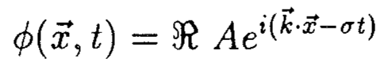](../equations/ch01-p002-e01-source.png) | [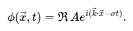](../equations/ch01-p002-e01-mathjax.png) | [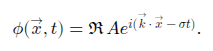](../equations/ch01-p002-e01-mathml.png) |

### p. 3 · display 1 · ch01-p003-e01

Source: [chapter1.tex](../chapter1.tex):70 · display type: `bracket`

#### Markdown math

$$
	\lambda=2\pi/|\vec{k}|=\text{wavelength},\qquad
	f=\sigma/2\pi=\text{frequency},\qquad
	T=2\pi/\sigma=1/f=\text{period}.
$$

<details>
<summary>LaTeX source</summary>

```tex
\[
	\lambda=2\pi/|\vec{k}|=\text{wavelength},\qquad
	f=\sigma/2\pi=\text{frequency},\qquad
	T=2\pi/\sigma=1/f=\text{period}.
\]
```

</details>

| Source PDF | MathJax | MathML |
| --- | --- | --- |
| [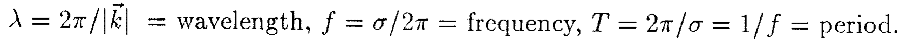](../equations/ch01-p003-e01-source.png) | [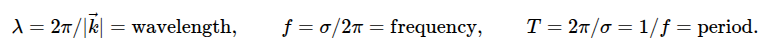](../equations/ch01-p003-e01-mathjax.png) | [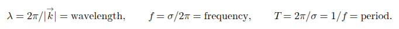](../equations/ch01-p003-e01-mathml.png) |

### p. 3 · display 2 · ch01-p003-e02

Source: [chapter1.tex](../chapter1.tex):78 · display type: `bracket`

#### Markdown math

$$
	\phi(\vec{x},t)=|A|\cos\left(\vec{k}\cdot\vec{x}-\sigma t
	+\tan^{-1}\frac{\Im A}{\Re A}\right)
$$

<details>
<summary>LaTeX source</summary>

```tex
\[
	\phi(\vec{x},t)=|A|\cos\left(\vec{k}\cdot\vec{x}-\sigma t
	+\tan^{-1}\frac{\Im A}{\Re A}\right)
\]
```

</details>

| Source PDF | MathJax | MathML |
| --- | --- | --- |
| [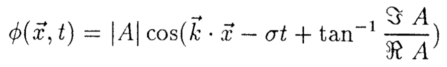](../equations/ch01-p003-e02-source.png) | [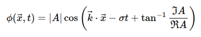](../equations/ch01-p003-e02-mathjax.png) | [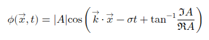](../equations/ch01-p003-e02-mathml.png) |

### p. 4 · display 1 · ch01-p004-e01

Source: [chapter1.tex](../chapter1.tex):108 · display type: `bracket`

#### Markdown math

$$
	c=\sigma/|\vec{k}|=\lambda/T.
$$

<details>
<summary>LaTeX source</summary>

```tex
\[
	c=\sigma/|\vec{k}|=\lambda/T.
\]
```

</details>

| Source PDF | MathJax | MathML |
| --- | --- | --- |
| [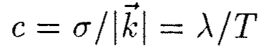](../equations/ch01-p004-e01-source.png) | [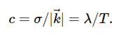](../equations/ch01-p004-e01-mathjax.png) | [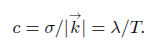](../equations/ch01-p004-e01-mathml.png) |

### p. 4 · display 2 · ch01-p004-e02

Source: [chapter1.tex](../chapter1.tex):113 · display type: `bracket`

#### Markdown math

$$
	\frac{c}{\cos\theta}
	=\left(\frac{\sigma}{|\vec{k}|}\right)
	\left(\frac{|\vec{k}|}{k}\right)
	=\sigma/k
$$

<details>
<summary>LaTeX source</summary>

```tex
\[
	\frac{c}{\cos\theta}
	=\left(\frac{\sigma}{|\vec{k}|}\right)
	\left(\frac{|\vec{k}|}{k}\right)
	=\sigma/k
\]
```

</details>

| Source PDF | MathJax | MathML |
| --- | --- | --- |
| [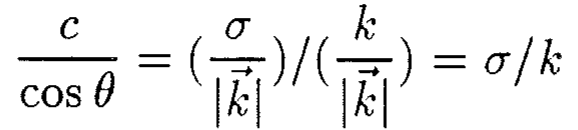](../equations/ch01-p004-e02-source.png) | [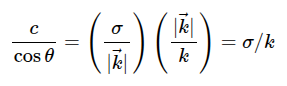](../equations/ch01-p004-e02-mathjax.png) | [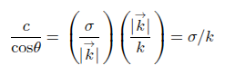](../equations/ch01-p004-e02-mathml.png) |

### p. 4 · display 3 · ch01-p004-e03

Source: [chapter1.tex](../chapter1.tex):124 · display type: `bracket`

#### Markdown math

$$
	Ae^{i(\vec{k}\cdot\vec{x}-\sigma t)}
	+Ae^{i(-\vec{k}\cdot\vec{x}-\sigma t)}
	=2Ae^{-i\sigma t}\cos(\vec{k}\cdot\vec{x})
$$

<details>
<summary>LaTeX source</summary>

```tex
\[
	Ae^{i(\vec{k}\cdot\vec{x}-\sigma t)}
	+Ae^{i(-\vec{k}\cdot\vec{x}-\sigma t)}
	=2Ae^{-i\sigma t}\cos(\vec{k}\cdot\vec{x})
\]
```

</details>

| Source PDF | MathJax | MathML |
| --- | --- | --- |
| [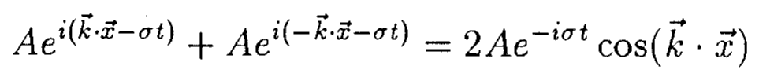](../equations/ch01-p004-e03-source.png) | [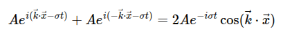](../equations/ch01-p004-e03-mathjax.png) | [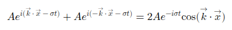](../equations/ch01-p004-e03-mathml.png) |

### p. 5 · display 1 · ch01-p005-e01

Source: [chapter1.tex](../chapter1.tex):143 · display type: `bracket`

#### Markdown math

$$
	\sigma=\Omega(\vec{k})
$$

<details>
<summary>LaTeX source</summary>

```tex
\[
	\sigma=\Omega(\vec{k})
\]
```

</details>

| Source PDF | MathJax | MathML |
| --- | --- | --- |
| [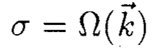](../equations/ch01-p005-e01-source.png) | [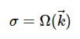](../equations/ch01-p005-e01-mathjax.png) | [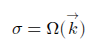](../equations/ch01-p005-e01-mathml.png) |

### p. 6 · display 1 · ch01-p006-e01

Source: [chapter1.tex](../chapter1.tex):209 · display type: `bracket`

#### Markdown math

$$
	\sigma=\Omega_j(\vec{k}),\qquad j=1,\ldots,n
$$

<details>
<summary>LaTeX source</summary>

```tex
\[
	\sigma=\Omega_j(\vec{k}),\qquad j=1,\ldots,n
\]
```

</details>

| Source PDF | MathJax | MathML |
| --- | --- | --- |
| [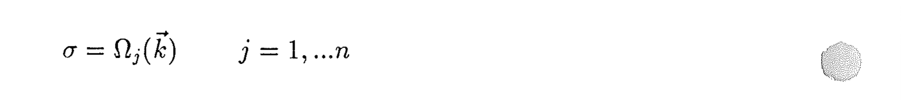](../equations/ch01-p006-e01-source.png) | [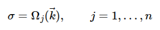](../equations/ch01-p006-e01-mathjax.png) | [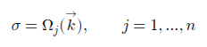](../equations/ch01-p006-e01-mathml.png) |

### p. 7 · display 1 · ch01-p007-e01

Source: [chapter1.tex](../chapter1.tex):219 · display type: `bracket`

#### Markdown math

$$
	\phi(\vec{x},t)=\sum_{j=1}^n
	\iiint_{-\infty}^{\infty}
	A_j(\vec{k})e^{i[\vec{k}\cdot\vec{x}-\Omega_j(\vec{k})t]}
	\,d\vec{k}
$$

<details>
<summary>LaTeX source</summary>

```tex
\[
	\phi(\vec{x},t)=\sum_{j=1}^n
	\iiint_{-\infty}^{\infty}
	A_j(\vec{k})e^{i[\vec{k}\cdot\vec{x}-\Omega_j(\vec{k})t]}
	\,d\vec{k}
\]
```

</details>

| Source PDF | MathJax | MathML |
| --- | --- | --- |
| [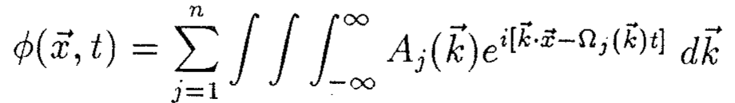](../equations/ch01-p007-e01-source.png) | [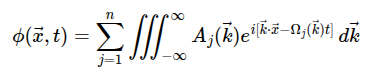](../equations/ch01-p007-e01-mathjax.png) | [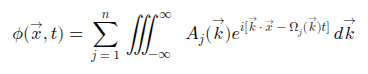](../equations/ch01-p007-e01-mathml.png) |

### p. 7 · display 2 · ch01-p007-e02

Source: [chapter1.tex](../chapter1.tex):227 · display type: `bracket`

#### Markdown math

$$
	\sigma=\Omega(k)
$$

<details>
<summary>LaTeX source</summary>

```tex
\[
	\sigma=\Omega(k)
\]
```

</details>

| Source PDF | MathJax | MathML |
| --- | --- | --- |
| [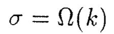](../equations/ch01-p007-e02-source.png) | [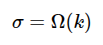](../equations/ch01-p007-e02-mathjax.png) | [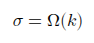](../equations/ch01-p007-e02-mathml.png) |

### p. 7 · display 3 · ch01-p007-e03

Source: [chapter1.tex](../chapter1.tex):230 · display type: `bracket`

#### Markdown math

$$
	\phi(x,t)=\int_{-\infty}^{\infty}
	A(k)e^{i[kx-\Omega(k)t]}
	\,dk.
$$

<details>
<summary>LaTeX source</summary>

```tex
\[
	\phi(x,t)=\int_{-\infty}^{\infty}
	A(k)e^{i[kx-\Omega(k)t]}
	\,dk.
\]
```

</details>

| Source PDF | MathJax | MathML |
| --- | --- | --- |
| [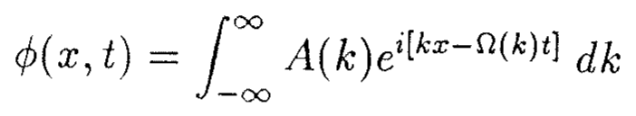](../equations/ch01-p007-e03-source.png) | [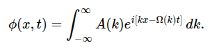](../equations/ch01-p007-e03-mathjax.png) | [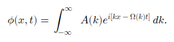](../equations/ch01-p007-e03-mathml.png) |

### p. 7 · display 4 · ch01-p007-e04

Source: [chapter1.tex](../chapter1.tex):236 · display type: `bracket`

#### Markdown math

$$
	\phi(x,0)=\int_{-\infty}^{\infty}A(k)e^{ikx}\,dk;
	\qquad
	A(k)=\frac{1}{2\pi}\int_{-\infty}^{\infty}\phi(x,0)e^{-ikx}\,dx.
$$

<details>
<summary>LaTeX source</summary>

```tex
\[
	\phi(x,0)=\int_{-\infty}^{\infty}A(k)e^{ikx}\,dk;
	\qquad
	A(k)=\frac{1}{2\pi}\int_{-\infty}^{\infty}\phi(x,0)e^{-ikx}\,dx.
\]
```

</details>

| Source PDF | MathJax | MathML |
| --- | --- | --- |
| [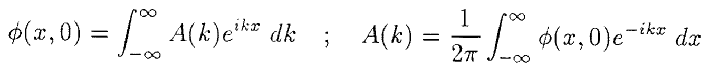](../equations/ch01-p007-e04-source.png) | [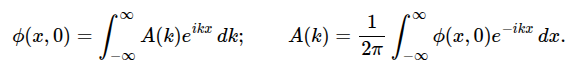](../equations/ch01-p007-e04-mathjax.png) | [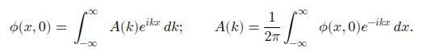](../equations/ch01-p007-e04-mathml.png) |

### p. 7 · display 5 · ch01-p007-e05

Source: [chapter1.tex](../chapter1.tex):242 · display type: `bracket`

#### Markdown math

$$
	\phi(x,t)=\int_{-\infty}^{\infty}A(k)e^{ik(x-ct)}\,dk
	=\int_{-\infty}^{\infty}A(k)e^{ikx'}\,dk
	=\phi(x-ct,0).
$$

<details>
<summary>LaTeX source</summary>

```tex
\[
	\phi(x,t)=\int_{-\infty}^{\infty}A(k)e^{ik(x-ct)}\,dk
	=\int_{-\infty}^{\infty}A(k)e^{ikx'}\,dk
	=\phi(x-ct,0).
\]
```

</details>

| Source PDF | MathJax | MathML |
| --- | --- | --- |
| [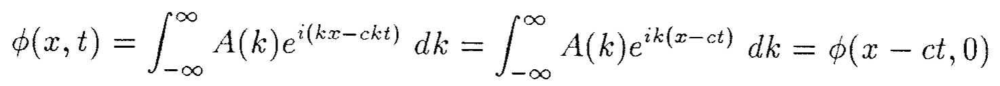](../equations/ch01-p007-e05-source.png) | [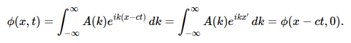](../equations/ch01-p007-e05-mathjax.png) | [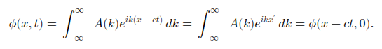](../equations/ch01-p007-e05-mathml.png) |

### p. 8 · display 1 · ch01-p008-e01

Source: [chapter1.tex](../chapter1.tex):276 · display type: `bracket`

#### Markdown math

$$
	\phi(x,0)=\int_{-\infty}^{\infty}A(k)e^{ikx}\,dk;
	\qquad
	A(k)=\frac{1}{2\pi}\int_{-\infty}^{\infty}\phi(x,0)e^{-ikx}\,dx
$$

<details>
<summary>LaTeX source</summary>

```tex
\[
	\phi(x,0)=\int_{-\infty}^{\infty}A(k)e^{ikx}\,dk;
	\qquad
	A(k)=\frac{1}{2\pi}\int_{-\infty}^{\infty}\phi(x,0)e^{-ikx}\,dx
\]
```

</details>

| Source PDF | MathJax | MathML |
| --- | --- | --- |
| [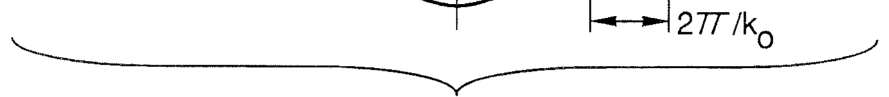](../equations/ch01-p008-e01-source.png) | [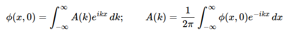](../equations/ch01-p008-e01-mathjax.png) | [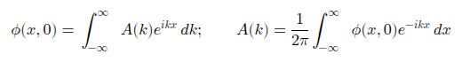](../equations/ch01-p008-e01-mathml.png) |

### p. 8 · display 2 · ch01-p008-e02

Source: [chapter1.tex](../chapter1.tex):282 · display type: `bracket`

#### Markdown math

$$
	A(k)=\frac{1}{2\pi}\int_{-\infty}^{\infty}
	a(x)e^{i(k_0-k)x}\,dx;
	\qquad
	a(x)=\int_{-\infty}^{\infty}A(k)e^{i(k-k_0)x}\,dk.
$$

<details>
<summary>LaTeX source</summary>

```tex
\[
	A(k)=\frac{1}{2\pi}\int_{-\infty}^{\infty}
	a(x)e^{i(k_0-k)x}\,dx;
	\qquad
	a(x)=\int_{-\infty}^{\infty}A(k)e^{i(k-k_0)x}\,dk.
\]
```

</details>

| Source PDF | MathJax | MathML |
| --- | --- | --- |
| [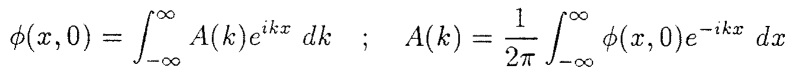](../equations/ch01-p008-e02-source.png) | [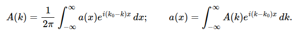](../equations/ch01-p008-e02-mathjax.png) | [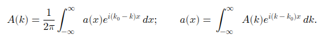](../equations/ch01-p008-e02-mathml.png) |

### p. 9 · display 1 · ch01-p009-e01

Source: [chapter1.tex](../chapter1.tex):309 · display type: `align*`

#### Markdown math

$$
\begin{aligned}
	\phi(x,t)
	 & =\int_{-\infty}^{\infty}A(k)e^{i[kx-\Omega(k)t]}\,dk                 \\
	 & \simeq\int_{-\infty}^{\infty}A(k)
	e^{i[kx-\Omega(k_0)t-(k-k_0)(\partial\Omega/\partial k)|_{k=k_0}t]}\,dk \\
	 & =\int_{-\infty}^{\infty}A(k)
	e^{i[kx-\Omega(k_0)t-(k-k_0)(\partial\Omega/\partial k)|_{k=k_0}t]}
	e^{ik_0x-ik_0x}\,dk                                                     \\
	 & =e^{i[k_0x-\Omega(k_0)t]}
	\int_{-\infty}^{\infty}A(k)
	e^{i(k-k_0)[x-(\partial\Omega/\partial k)|_{k=k_0}t]}\,dk.
\end{aligned}
$$

<details>
<summary>LaTeX source</summary>

```tex
\begin{align*}
	\phi(x,t)
	 & =\int_{-\infty}^{\infty}A(k)e^{i[kx-\Omega(k)t]}\,dk                 \\
	 & \simeq\int_{-\infty}^{\infty}A(k)
	e^{i[kx-\Omega(k_0)t-(k-k_0)(\partial\Omega/\partial k)|_{k=k_0}t]}\,dk \\
	 & =\int_{-\infty}^{\infty}A(k)
	e^{i[kx-\Omega(k_0)t-(k-k_0)(\partial\Omega/\partial k)|_{k=k_0}t]}
	e^{ik_0x-ik_0x}\,dk                                                     \\
	 & =e^{i[k_0x-\Omega(k_0)t]}
	\int_{-\infty}^{\infty}A(k)
	e^{i(k-k_0)[x-(\partial\Omega/\partial k)|_{k=k_0}t]}\,dk.
\end{align*}
```

</details>

| Source PDF | MathJax | MathML |
| --- | --- | --- |
| [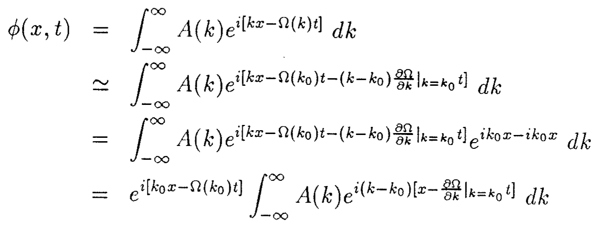](../equations/ch01-p009-e01-source.png) | [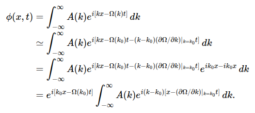](../equations/ch01-p009-e01-mathjax.png) | [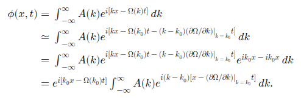](../equations/ch01-p009-e01-mathml.png) |

### p. 9 · display 2 · ch01-p009-e02

Source: [chapter1.tex](../chapter1.tex):322 · display type: `bracket`

#### Markdown math

$$
	\phi(x,t)=e^{i[k_0x-\Omega(k_0)t]}
	a\left(x-\left.\frac{\partial\Omega}{\partial k}\right|_{k=k_0}t\right).
$$

<details>
<summary>LaTeX source</summary>

```tex
\[
	\phi(x,t)=e^{i[k_0x-\Omega(k_0)t]}
	a\left(x-\left.\frac{\partial\Omega}{\partial k}\right|_{k=k_0}t\right).
\]
```

</details>

| Source PDF | MathJax | MathML |
| --- | --- | --- |
| [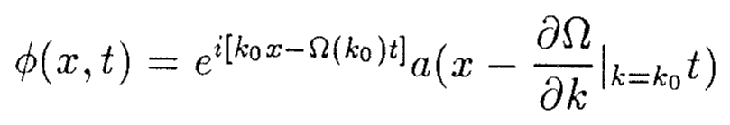](../equations/ch01-p009-e02-source.png) | [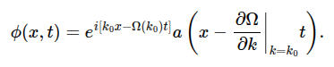](../equations/ch01-p009-e02-mathjax.png) | [](../equations/ch01-p009-e02-mathml.png) |

### p. 9 · display 3 · ch01-p009-e03

Source: [chapter1.tex](../chapter1.tex):329 · display type: `bracket`

#### Markdown math

$$
	c_g=\left.\frac{\partial\Omega}{\partial k}\right|_{k=k_0}
$$

<details>
<summary>LaTeX source</summary>

```tex
\[
	c_g=\left.\frac{\partial\Omega}{\partial k}\right|_{k=k_0}
\]
```

</details>

| Source PDF | MathJax | MathML |
| --- | --- | --- |
| [](../equations/ch01-p009-e03-source.png) | [](../equations/ch01-p009-e03-mathjax.png) | [](../equations/ch01-p009-e03-mathml.png) |

### p. 9 · display 4 · ch01-p009-e04

Source: [chapter1.tex](../chapter1.tex):340 · display type: `bracket`

#### Markdown math

$$
	\phi(x,t)=\int_{-\infty}^{\infty}A(k)e^{i[kx-\Omega(k)t]}\,dk.
$$

<details>
<summary>LaTeX source</summary>

```tex
\[
	\phi(x,t)=\int_{-\infty}^{\infty}A(k)e^{i[kx-\Omega(k)t]}\,dk.
\]
```

</details>

| Source PDF | MathJax | MathML |
| --- | --- | --- |
| [](../equations/ch01-p009-e04-source.png) | [](../equations/ch01-p009-e04-mathjax.png) | [](../equations/ch01-p009-e04-mathml.png) |

### p. 9 · display 5 · ch01-p009-e05

Source: [chapter1.tex](../chapter1.tex):344 · display type: `bracket`

#### Markdown math

$$
	\Theta(k;x,t)=kx/t-\Omega(k).
$$

<details>
<summary>LaTeX source</summary>

```tex
\[
	\Theta(k;x,t)=kx/t-\Omega(k).
\]
```

</details>

| Source PDF | MathJax | MathML |
| --- | --- | --- |
| [](../equations/ch01-p009-e05-source.png) | [](../equations/ch01-p009-e05-mathjax.png) | [](../equations/ch01-p009-e05-mathml.png) |

### p. 9 · display 6 · ch01-p009-e06

Source: [chapter1.tex](../chapter1.tex):348 · display type: `bracket`

#### Markdown math

$$
	\phi(x,t)=\int_{-\infty}^{\infty}A(k)e^{it\Theta(k;x,t)}\,dk.
$$

<details>
<summary>LaTeX source</summary>

```tex
\[
	\phi(x,t)=\int_{-\infty}^{\infty}A(k)e^{it\Theta(k;x,t)}\,dk.
\]
```

</details>

| Source PDF | MathJax | MathML |
| --- | --- | --- |
| [](../equations/ch01-p009-e06-source.png) | [](../equations/ch01-p009-e06-mathjax.png) | [](../equations/ch01-p009-e06-mathml.png) |

### p. 10 · display 1 · ch01-p010-e01

Source: [chapter1.tex](../chapter1.tex):372 · display type: `bracket`

#### Markdown math

$$
	\phi(x,t)\simeq\int_{-\infty}^{\infty}A(k)
	e^{it[\Theta(k_0)+(k-k_0)\Theta'(k_0)
					+(k-k_0)^2\Theta''(k_0)/2]}\,dk.
$$

<details>
<summary>LaTeX source</summary>

```tex
\[
	\phi(x,t)\simeq\int_{-\infty}^{\infty}A(k)
	e^{it[\Theta(k_0)+(k-k_0)\Theta'(k_0)
					+(k-k_0)^2\Theta''(k_0)/2]}\,dk.
\]
```

</details>

| Source PDF | MathJax | MathML |
| --- | --- | --- |
| [](../equations/ch01-p010-e01-source.png) | [](../equations/ch01-p010-e01-mathjax.png) | [](../equations/ch01-p010-e01-mathml.png) |

### p. 10 · display 2 · ch01-p010-e02

Source: [chapter1.tex](../chapter1.tex):380 · display type: `bracket`

#### Markdown math

$$
	x/t-\left.\frac{\partial\Omega}{\partial k}\right|_{k_0}=0
$$

<details>
<summary>LaTeX source</summary>

```tex
\[
	x/t-\left.\frac{\partial\Omega}{\partial k}\right|_{k_0}=0
\]
```

</details>

| Source PDF | MathJax | MathML |
| --- | --- | --- |
| [](../equations/ch01-p010-e02-source.png) | [](../equations/ch01-p010-e02-mathjax.png) | [](../equations/ch01-p010-e02-mathml.png) |

### p. 10 · display 3 · ch01-p010-e03

Source: [chapter1.tex](../chapter1.tex):385 · display type: `bracket`

#### Markdown math

$$
	\left.\frac{\partial\Omega}{\partial k}\right|_{k_0}=x/t;
$$

<details>
<summary>LaTeX source</summary>

```tex
\[
	\left.\frac{\partial\Omega}{\partial k}\right|_{k_0}=x/t;
\]
```

</details>

| Source PDF | MathJax | MathML |
| --- | --- | --- |
| [](../equations/ch01-p010-e03-source.png) | [](../equations/ch01-p010-e03-mathjax.png) | [](../equations/ch01-p010-e03-mathml.png) |

### p. 10 · display 4 · ch01-p010-e04

Source: [chapter1.tex](../chapter1.tex):391 · display type: `bracket`

#### Markdown math

$$
	\phi(x,t)\simeq A(k_0)e^{it\Theta(k_0)}
	\int_{-\infty}^{\infty}
	e^{i(k-k_0)^2\Theta''(k_0)t/2}\,dk.
$$

<details>
<summary>LaTeX source</summary>

```tex
\[
	\phi(x,t)\simeq A(k_0)e^{it\Theta(k_0)}
	\int_{-\infty}^{\infty}
	e^{i(k-k_0)^2\Theta''(k_0)t/2}\,dk.
\]
```

</details>

| Source PDF | MathJax | MathML |
| --- | --- | --- |
| [](../equations/ch01-p010-e04-source.png) | [](../equations/ch01-p010-e04-mathjax.png) | [](../equations/ch01-p010-e04-mathml.png) |

### p. 11 · display 1 · ch01-p011-e01

Source: [chapter1.tex](../chapter1.tex):403 · display type: `bracket`

#### Markdown math

$$
	\phi(x,t)\simeq A(k_0)e^{it\Theta(k_0)}
		[2\pi/-it\Theta''(k_0;x,t)]^{1/2}
$$

<details>
<summary>LaTeX source</summary>

```tex
\[
	\phi(x,t)\simeq A(k_0)e^{it\Theta(k_0)}
		[2\pi/-it\Theta''(k_0;x,t)]^{1/2}
\]
```

</details>

| Source PDF | MathJax | MathML |
| --- | --- | --- |
| [](../equations/ch01-p011-e01-source.png) | [](../equations/ch01-p011-e01-mathjax.png) | [](../equations/ch01-p011-e01-mathml.png) |

### p. 11 · display 2 · ch01-p011-e02

Source: [chapter1.tex](../chapter1.tex):407 · display type: `bracket`

#### Markdown math

$$
	\phi(x,t)\simeq A(k_0)e^{i[k_0x-\Omega(k_0)t]}
		[2\pi/-it\Theta''(k_0;x,t)]^{1/2}.
$$

<details>
<summary>LaTeX source</summary>

```tex
\[
	\phi(x,t)\simeq A(k_0)e^{i[k_0x-\Omega(k_0)t]}
		[2\pi/-it\Theta''(k_0;x,t)]^{1/2}.
\]
```

</details>

| Source PDF | MathJax | MathML |
| --- | --- | --- |
| [](../equations/ch01-p011-e02-source.png) | [](../equations/ch01-p011-e02-mathjax.png) | [](../equations/ch01-p011-e02-mathml.png) |

### p. 11 · display 3 · ch01-p011-e03

Source: [chapter1.tex](../chapter1.tex):413 · display type: `bracket`

#### Markdown math

$$
	\left.\frac{\partial\Omega}{\partial k}\right|_{k_0}=x/t.
$$

<details>
<summary>LaTeX source</summary>

```tex
\[
	\left.\frac{\partial\Omega}{\partial k}\right|_{k_0}=x/t.
\]
```

</details>

| Source PDF | MathJax | MathML |
| --- | --- | --- |
| [](../equations/ch01-p011-e03-source.png) | [](../equations/ch01-p011-e03-mathjax.png) | [](../equations/ch01-p011-e03-mathml.png) |

### p. 11 · display 4 · ch01-p011-e04

Source: [chapter1.tex](../chapter1.tex):435 · display type: `bracket`

#### Markdown math

$$
	\phi=a(\vec{x},t)e^{i\Theta(\vec{x},t)}
$$

<details>
<summary>LaTeX source</summary>

```tex
\[
	\phi=a(\vec{x},t)e^{i\Theta(\vec{x},t)}
\]
```

</details>

| Source PDF | MathJax | MathML |
| --- | --- | --- |
| [](../equations/ch01-p011-e04-source.png) | [](../equations/ch01-p011-e04-mathjax.png) | [](../equations/ch01-p011-e04-mathml.png) |

### p. 12 · display 1 · ch01-p012-e01

Source: [chapter1.tex](../chapter1.tex):449 · display type: `bracket`

#### Markdown math

$$
	\vec{k}=\left.\nabla\Theta\right|_t;
	\qquad
	N=-\left.\Theta_t\right|_{\vec{x}}
$$

<details>
<summary>LaTeX source</summary>

```tex
\[
	\vec{k}=\left.\nabla\Theta\right|_t;
	\qquad
	N=-\left.\Theta_t\right|_{\vec{x}}
\]
```

</details>

| Source PDF | MathJax | MathML |
| --- | --- | --- |
| [](../equations/ch01-p012-e01-source.png) | [](../equations/ch01-p012-e01-mathjax.png) | [](../equations/ch01-p012-e01-mathml.png) |

### p. 12 · display 2 · ch01-p012-e02

Source: [chapter1.tex](../chapter1.tex):459 · display type: `bracket`

#### Markdown math

$$
	\nabla\times\vec{k}=0
$$

<details>
<summary>LaTeX source</summary>

```tex
\[
	\nabla\times\vec{k}=0
\]
```

</details>

| Source PDF | MathJax | MathML |
| --- | --- | --- |
| [](../equations/ch01-p012-e02-source.png) | [](../equations/ch01-p012-e02-mathjax.png) | [](../equations/ch01-p012-e02-mathml.png) |

### p. 12 · display 3 · ch01-p012-e03

Source: [chapter1.tex](../chapter1.tex):469 · display type: `bracket`

#### Markdown math

$$
	n=\frac{1}{2\pi}\int_A^B\vec{k}\cdot d\vec{s}.
$$

<details>
<summary>LaTeX source</summary>

```tex
\[
	n=\frac{1}{2\pi}\int_A^B\vec{k}\cdot d\vec{s}.
\]
```

</details>

| Source PDF | MathJax | MathML |
| --- | --- | --- |
| [](../equations/ch01-p012-e03-source.png) | [](../equations/ch01-p012-e03-mathjax.png) | [](../equations/ch01-p012-e03-mathml.png) |

### p. 13 · display 1 · ch01-p013-e01

Source: [chapter1.tex](../chapter1.tex):486 · display type: `equation`

#### Markdown math

$$
	\left.\frac{\partial\vec{k}}{\partial t}\right|_{\vec{x}}
	+\left.\nabla N\right|_t=0.
	\tag{1.1}
$$

<details>
<summary>LaTeX source</summary>

```tex
\begin{equation}
	\left.\frac{\partial\vec{k}}{\partial t}\right|_{\vec{x}}
	+\left.\nabla N\right|_t=0.
	\tag{1.1}
\end{equation}
```

</details>

| Source PDF | MathJax | MathML |
| --- | --- | --- |
| [](../equations/ch01-p013-e01-source.png) | [](../equations/ch01-p013-e01-mathjax.png) | [](../equations/ch01-p013-e01-mathml.png) |

### p. 13 · display 2 · ch01-p013-e02

Source: [chapter1.tex](../chapter1.tex):492 · display type: `bracket`

#### Markdown math

$$
	\frac{\partial n}{\partial t}
	=\frac{1}{2\pi}\int_A^B\frac{\partial\vec{k}}{\partial t}\cdot d\vec{s}
	=-\frac{1}{2\pi}\int_A^B\nabla N\cdot d\vec{s}
	=\frac{1}{2\pi}(N_A-N_B).
$$

<details>
<summary>LaTeX source</summary>

```tex
\[
	\frac{\partial n}{\partial t}
	=\frac{1}{2\pi}\int_A^B\frac{\partial\vec{k}}{\partial t}\cdot d\vec{s}
	=-\frac{1}{2\pi}\int_A^B\nabla N\cdot d\vec{s}
	=\frac{1}{2\pi}(N_A-N_B).
\]
```

</details>

| Source PDF | MathJax | MathML |
| --- | --- | --- |
| [](../equations/ch01-p013-e02-source.png) | [](../equations/ch01-p013-e02-mathjax.png) | [](../equations/ch01-p013-e02-mathml.png) |

### p. 13 · display 3 · ch01-p013-e03

Source: [chapter1.tex](../chapter1.tex):507 · display type: `bracket`

#### Markdown math

$$
	N=\Omega(\vec{k};\vec{x},t)
$$

<details>
<summary>LaTeX source</summary>

```tex
\[
	N=\Omega(\vec{k};\vec{x},t)
\]
```

</details>

| Source PDF | MathJax | MathML |
| --- | --- | --- |
| [](../equations/ch01-p013-e03-source.png) | [](../equations/ch01-p013-e03-mathjax.png) | [](../equations/ch01-p013-e03-mathml.png) |

### p. 13 · display 4 · ch01-p013-e04

Source: [chapter1.tex](../chapter1.tex):518 · display type: `bracket`

#### Markdown math

$$
	\left.\frac{\partial N}{\partial t}\right|_{\vec{x}}
	=\left.\frac{\partial\Omega}{\partial t}\right|_{\vec{k},\vec{x}}
	+\left.\frac{\partial\Omega}{\partial k_i}\right|_{\vec{x},t}
	\left.\frac{\partial k_i}{\partial t}\right|_{\vec{x}}
	=\left.\frac{\partial\Omega}{\partial t}\right|_{\vec{k},\vec{x}}
	-c_{g_i}\left.\frac{\partial N}{\partial x_i}\right|_t
$$

<details>
<summary>LaTeX source</summary>

```tex
\[
	\left.\frac{\partial N}{\partial t}\right|_{\vec{x}}
	=\left.\frac{\partial\Omega}{\partial t}\right|_{\vec{k},\vec{x}}
	+\left.\frac{\partial\Omega}{\partial k_i}\right|_{\vec{x},t}
	\left.\frac{\partial k_i}{\partial t}\right|_{\vec{x}}
	=\left.\frac{\partial\Omega}{\partial t}\right|_{\vec{k},\vec{x}}
	-c_{g_i}\left.\frac{\partial N}{\partial x_i}\right|_t
\]
```

</details>

| Source PDF | MathJax | MathML |
| --- | --- | --- |
| [](../equations/ch01-p013-e04-source.png) | [](../equations/ch01-p013-e04-mathjax.png) | [](../equations/ch01-p013-e04-mathml.png) |

### p. 13 · display 5 · ch01-p013-e05

Source: [chapter1.tex](../chapter1.tex):527 · display type: `bracket`

#### Markdown math

$$
	c_{g_i}=\frac{\partial N}{\partial k_i}=\frac{\partial\Omega}{\partial k_i}.
$$

<details>
<summary>LaTeX source</summary>

```tex
\[
	c_{g_i}=\frac{\partial N}{\partial k_i}=\frac{\partial\Omega}{\partial k_i}.
\]
```

</details>

| Source PDF | MathJax | MathML |
| --- | --- | --- |
| [](../equations/ch01-p013-e05-source.png) | [](../equations/ch01-p013-e05-mathjax.png) | [](../equations/ch01-p013-e05-mathml.png) |

### p. 14 · display 1 · ch01-p014-e01

Source: [chapter1.tex](../chapter1.tex):537 · display type: `equation`

#### Markdown math

$$
	\frac{\partial N}{\partial t}+\vec{c}_g\cdot\nabla N
	=\left.\frac{\partial\Omega}{\partial t}\right|_{\vec{k},\vec{x}}.
	\tag{1.2}
$$

<details>
<summary>LaTeX source</summary>

```tex
\begin{equation}
	\frac{\partial N}{\partial t}+\vec{c}_g\cdot\nabla N
	=\left.\frac{\partial\Omega}{\partial t}\right|_{\vec{k},\vec{x}}.
	\tag{1.2}
\end{equation}
```

</details>

| Source PDF | MathJax | MathML |
| --- | --- | --- |
| [](../equations/ch01-p014-e01-source.png) | [](../equations/ch01-p014-e01-mathjax.png) | [](../equations/ch01-p014-e01-mathml.png) |

### p. 14 · display 2 · ch01-p014-e02

Source: [chapter1.tex](../chapter1.tex):543 · display type: `bracket`

#### Markdown math

$$
	\frac{\partial k_i}{\partial t}
	+\frac{\partial\Omega}{\partial x_i}
	+\frac{\partial\Omega}{\partial k_j}
	\frac{\partial k_j}{\partial x_i}=0.
$$

<details>
<summary>LaTeX source</summary>

```tex
\[
	\frac{\partial k_i}{\partial t}
	+\frac{\partial\Omega}{\partial x_i}
	+\frac{\partial\Omega}{\partial k_j}
	\frac{\partial k_j}{\partial x_i}=0.
\]
```

</details>

| Source PDF | MathJax | MathML |
| --- | --- | --- |
| [](../equations/ch01-p014-e02-source.png) | [](../equations/ch01-p014-e02-mathjax.png) | [](../equations/ch01-p014-e02-mathml.png) |

### p. 14 · display 3 · ch01-p014-e03

Source: [chapter1.tex](../chapter1.tex):551 · display type: `equation`

#### Markdown math

$$
	\frac{\partial k_i}{\partial t}+\vec{c}_g\cdot\nabla k_i
	=-\left.\frac{\partial\Omega}{\partial x_i}\right|_{\vec{k},t}.
	\tag{1.3}
$$

<details>
<summary>LaTeX source</summary>

```tex
\begin{equation}
	\frac{\partial k_i}{\partial t}+\vec{c}_g\cdot\nabla k_i
	=-\left.\frac{\partial\Omega}{\partial x_i}\right|_{\vec{k},t}.
	\tag{1.3}
\end{equation}
```

</details>

| Source PDF | MathJax | MathML |
| --- | --- | --- |
| [](../equations/ch01-p014-e03-source.png) | [](../equations/ch01-p014-e03-mathjax.png) | [](../equations/ch01-p014-e03-mathml.png) |

### p. 15 · display 1 · ch01-p015-e01

Source: [chapter1.tex](../chapter1.tex):593 · display type: `bracket`

#### Markdown math

$$
	\frac{\partial k_i}{\partial t}
	+c_{g_j}\frac{\partial k_i}{\partial x_j}=0
$$

<details>
<summary>LaTeX source</summary>

```tex
\[
	\frac{\partial k_i}{\partial t}
	+c_{g_j}\frac{\partial k_i}{\partial x_j}=0
\]
```

</details>

| Source PDF | MathJax | MathML |
| --- | --- | --- |
| [](../equations/ch01-p015-e01-source.png) | [](../equations/ch01-p015-e01-mathjax.png) | [](../equations/ch01-p015-e01-mathml.png) |

### p. 15 · display 2 · ch01-p015-e02

Source: [chapter1.tex](../chapter1.tex):597 · display type: `bracket`

#### Markdown math

$$
	\frac{\partial N}{\partial t}
	+c_{g_j}\frac{\partial N}{\partial x_j}=0
$$

<details>
<summary>LaTeX source</summary>

```tex
\[
	\frac{\partial N}{\partial t}
	+c_{g_j}\frac{\partial N}{\partial x_j}=0
\]
```

</details>

| Source PDF | MathJax | MathML |
| --- | --- | --- |
| [](../equations/ch01-p015-e02-source.png) | [](../equations/ch01-p015-e02-mathjax.png) | [](../equations/ch01-p015-e02-mathml.png) |

### p. 16 · display 1 · ch01-p016-e01

Source: [chapter1.tex](../chapter1.tex):622 · display type: `bracket`

#### Markdown math

$$
	\vec{x}=\vec{x}_0+
	\int_0^t\vec{c}_g[\vec{k}(\vec{x},t)]\,dt
$$

<details>
<summary>LaTeX source</summary>

```tex
\[
	\vec{x}=\vec{x}_0+
	\int_0^t\vec{c}_g[\vec{k}(\vec{x},t)]\,dt
\]
```

</details>

| Source PDF | MathJax | MathML |
| --- | --- | --- |
| [](../equations/ch01-p016-e01-source.png) | [](../equations/ch01-p016-e01-mathjax.png) | [](../equations/ch01-p016-e01-mathml.png) |

### p. 16 · display 2 · ch01-p016-e02

Source: [chapter1.tex](../chapter1.tex):631 · display type: `bracket`

#### Markdown math

$$
	\frac{d}{dt}=\frac{\partial}{\partial t}+\vec{c}_g\cdot\nabla
$$

<details>
<summary>LaTeX source</summary>

```tex
\[
	\frac{d}{dt}=\frac{\partial}{\partial t}+\vec{c}_g\cdot\nabla
\]
```

</details>

| Source PDF | MathJax | MathML |
| --- | --- | --- |
| [](../equations/ch01-p016-e02-source.png) | [](../equations/ch01-p016-e02-mathjax.png) | [](../equations/ch01-p016-e02-mathml.png) |

### p. 16 · display 3 · ch01-p016-e03

Source: [chapter1.tex](../chapter1.tex):636 · display type: `bracket`

#### Markdown math

$$
	\frac{dk_i}{dt}=-\frac{\partial\Omega}{\partial x_i}
$$

<details>
<summary>LaTeX source</summary>

```tex
\[
	\frac{dk_i}{dt}=-\frac{\partial\Omega}{\partial x_i}
\]
```

</details>

| Source PDF | MathJax | MathML |
| --- | --- | --- |
| [](../equations/ch01-p016-e03-source.png) | [](../equations/ch01-p016-e03-mathjax.png) | [](../equations/ch01-p016-e03-mathml.png) |

### p. 16 · display 4 · ch01-p016-e04

Source: [chapter1.tex](../chapter1.tex):640 · display type: `bracket`

#### Markdown math

$$
	\frac{dN}{dt}=\frac{\partial\Omega}{\partial t}.
$$

<details>
<summary>LaTeX source</summary>

```tex
\[
	\frac{dN}{dt}=\frac{\partial\Omega}{\partial t}.
\]
```

</details>

| Source PDF | MathJax | MathML |
| --- | --- | --- |
| [](../equations/ch01-p016-e04-source.png) | [](../equations/ch01-p016-e04-mathjax.png) | [](../equations/ch01-p016-e04-mathml.png) |

### p. 17 · display 1 · ch01-p017-e01

Source: [chapter1.tex](../chapter1.tex):650 · display type: `bracket`

#### Markdown math

$$
	\frac{d\vec{x}}{dt}=\vec{c}_g[\vec{k}(\vec{x},t)].
$$

<details>
<summary>LaTeX source</summary>

```tex
\[
	\frac{d\vec{x}}{dt}=\vec{c}_g[\vec{k}(\vec{x},t)].
\]
```

</details>

| Source PDF | MathJax | MathML |
| --- | --- | --- |
| [](../equations/ch01-p017-e01-source.png) | [](../equations/ch01-p017-e01-mathjax.png) | [](../equations/ch01-p017-e01-mathml.png) |

### p. 17 · display 2 · ch01-p017-e02

Source: [chapter1.tex](../chapter1.tex):662 · display type: `bracket`

#### Markdown math

$$
	\frac{\partial\mathcal{A}}{\partial t}
	+\nabla\cdot(\vec{c}_g\mathcal{A})=0
$$

<details>
<summary>LaTeX source</summary>

```tex
\[
	\frac{\partial\mathcal{A}}{\partial t}
	+\nabla\cdot(\vec{c}_g\mathcal{A})=0
\]
```

</details>

| Source PDF | MathJax | MathML |
| --- | --- | --- |
| [](../equations/ch01-p017-e02-source.png) | [](../equations/ch01-p017-e02-mathjax.png) | [](../equations/ch01-p017-e02-mathml.png) |
