# Equation audit — Chapter 2

<!-- Generated from src/chapter1.tex through src/chapter6.tex.
     Do not edit equation entries by hand. -->

[Back to the equation audit](../EQUATIONS.md)

Entries follow printed-page order and display order within each page.
The Markdown math and raw LaTeX source are produced from the same extracted display.

### p. 18 · display 1 · ch02-p018-e01

Source: [chapter2.tex](../chapter2.tex):24 · display type: `align*`

#### Markdown math

$$
\begin{aligned}
	\frac{\partial\vec u^{\,*}}{\partial t}
	+\vec u^{\,*}\cdot\nabla\vec u^{\,*}
	                                 & =-\frac{1}{\rho^*}\nabla p^*, \\
	\frac{\partial\rho^*}{\partial t}
	+\nabla\cdot(\rho^*\vec u^{\,*}) & =0.
\end{aligned}
$$

<details>
<summary>LaTeX source</summary>

```tex
\begin{align*}
	\frac{\partial\vec u^{\,*}}{\partial t}
	+\vec u^{\,*}\cdot\nabla\vec u^{\,*}
	                                 & =-\frac{1}{\rho^*}\nabla p^*, \\
	\frac{\partial\rho^*}{\partial t}
	+\nabla\cdot(\rho^*\vec u^{\,*}) & =0.
\end{align*}
```

</details>

| Source PDF | MathJax | MathML |
| --- | --- | --- |
| [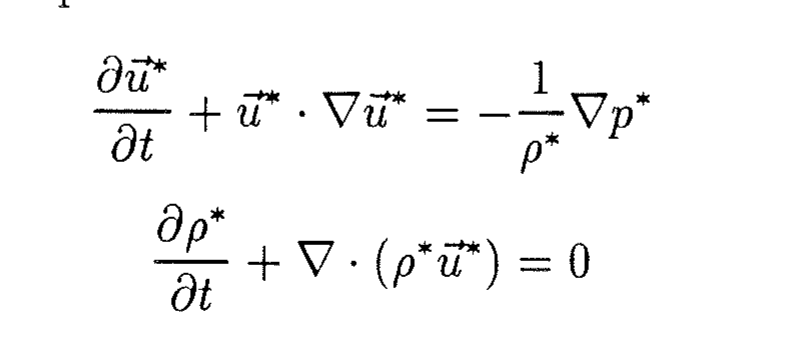](../equations/ch02-p018-e01-source.png) | [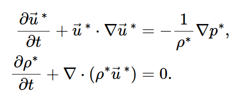](../equations/ch02-p018-e01-mathjax.png) | [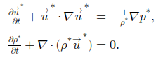](../equations/ch02-p018-e01-mathml.png) |

### p. 19 · display 1 · ch02-p019-e01

Source: [chapter2.tex](../chapter2.tex):41 · display type: `bracket`

#### Markdown math

$$
	\left(\frac{D\rho^*}{Dt}\right)_S
	=\left(\frac{\partial\rho^*}{\partial p^*}\right)_S
	\left(\frac{Dp^*}{Dt}\right)_S.
$$

<details>
<summary>LaTeX source</summary>

```tex
\[
	\left(\frac{D\rho^*}{Dt}\right)_S
	=\left(\frac{\partial\rho^*}{\partial p^*}\right)_S
	\left(\frac{Dp^*}{Dt}\right)_S.
\]
```

</details>

| Source PDF | MathJax | MathML |
| --- | --- | --- |
| [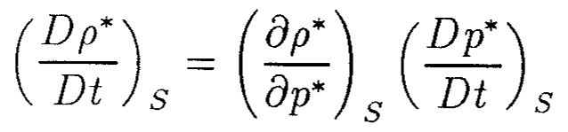](../equations/ch02-p019-e01-source.png) | [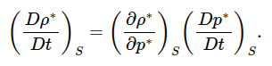](../equations/ch02-p019-e01-mathjax.png) | [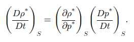](../equations/ch02-p019-e01-mathml.png) |

### p. 19 · display 2 · ch02-p019-e02

Source: [chapter2.tex](../chapter2.tex):47 · display type: `bracket`

#### Markdown math

$$
	\rho^*=\rho_0;\qquad p^*=p_0;\qquad \vec u^{\,*}=0.
$$

<details>
<summary>LaTeX source</summary>

```tex
\[
	\rho^*=\rho_0;\qquad p^*=p_0;\qquad \vec u^{\,*}=0.
\]
```

</details>

| Source PDF | MathJax | MathML |
| --- | --- | --- |
| [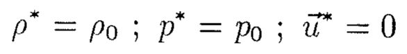](../equations/ch02-p019-e02-source.png) | [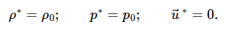](../equations/ch02-p019-e02-mathjax.png) | [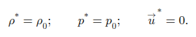](../equations/ch02-p019-e02-mathml.png) |

### p. 19 · display 3 · ch02-p019-e03

Source: [chapter2.tex](../chapter2.tex):52 · display type: `bracket`

#### Markdown math

$$
	\rho^*=\rho_0+\rho;\qquad
	p^*=p_0+p;\qquad
	\vec u^{\,*}=0+\vec u
$$

<details>
<summary>LaTeX source</summary>

```tex
\[
	\rho^*=\rho_0+\rho;\qquad
	p^*=p_0+p;\qquad
	\vec u^{\,*}=0+\vec u
\]
```

</details>

| Source PDF | MathJax | MathML |
| --- | --- | --- |
| [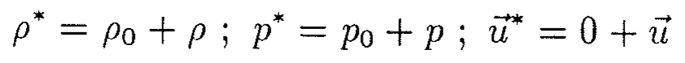](../equations/ch02-p019-e03-source.png) | [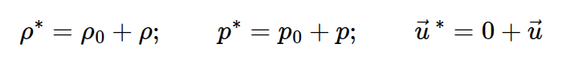](../equations/ch02-p019-e03-mathjax.png) | [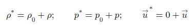](../equations/ch02-p019-e03-mathml.png) |

### p. 19 · display 4 · ch02-p019-e04

Source: [chapter2.tex](../chapter2.tex):59 · display type: `align*`

#### Markdown math

$$
\begin{aligned}
	\frac{\partial\vec u}{\partial t}                       & =-\frac{1}{\rho_0}\nabla p,           \\
	\frac{\partial\rho}{\partial t}+\rho_0\nabla\cdot\vec u & =0,                                   \\
	\frac{\partial\rho}{\partial t}                         & =c^{-2}\frac{\partial p}{\partial t},
\end{aligned}
$$

<details>
<summary>LaTeX source</summary>

```tex
\begin{align*}
	\frac{\partial\vec u}{\partial t}                       & =-\frac{1}{\rho_0}\nabla p,           \\
	\frac{\partial\rho}{\partial t}+\rho_0\nabla\cdot\vec u & =0,                                   \\
	\frac{\partial\rho}{\partial t}                         & =c^{-2}\frac{\partial p}{\partial t},
\end{align*}
```

</details>

| Source PDF | MathJax | MathML |
| --- | --- | --- |
| [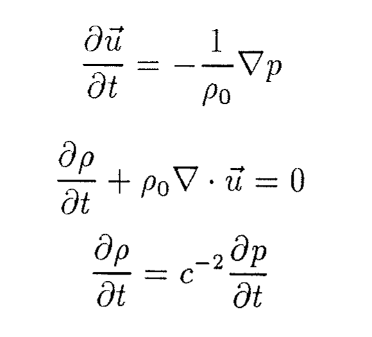](../equations/ch02-p019-e04-source.png) | [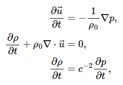](../equations/ch02-p019-e04-mathjax.png) | [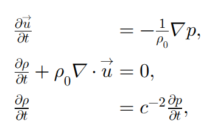](../equations/ch02-p019-e04-mathml.png) |

### p. 19 · display 5 · ch02-p019-e05

Source: [chapter2.tex](../chapter2.tex):65 · display type: `bracket`

#### Markdown math

$$
	c^2=\left(\frac{\partial\rho^*}{\partial p^*}\right)_S^{-1}.
$$

<details>
<summary>LaTeX source</summary>

```tex
\[
	c^2=\left(\frac{\partial\rho^*}{\partial p^*}\right)_S^{-1}.
\]
```

</details>

| Source PDF | MathJax | MathML |
| --- | --- | --- |
| [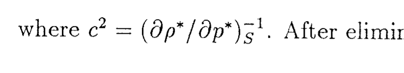](../equations/ch02-p019-e05-source.png) | [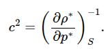](../equations/ch02-p019-e05-mathjax.png) | [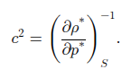](../equations/ch02-p019-e05-mathml.png) |

### p. 19 · display 6 · ch02-p019-e06

Source: [chapter2.tex](../chapter2.tex):69 · display type: `waveequation`

#### Markdown math

$$
	\frac{\partial^2p}{\partial t^2}-c^2\nabla^2p=0.
$$

<details>
<summary>LaTeX source</summary>

```tex
\begin{waveequation}
	\frac{\partial^2p}{\partial t^2}-c^2\nabla^2p=0.
\end{waveequation}
```

</details>

| Source PDF | MathJax | MathML |
| --- | --- | --- |
| [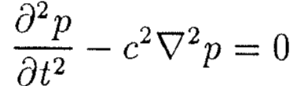](../equations/ch02-p019-e06-source.png) | [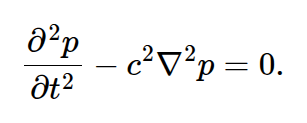](../equations/ch02-p019-e06-mathjax.png) | [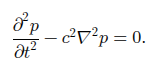](../equations/ch02-p019-e06-mathml.png) |

### p. 20 · display 1 · ch02-p020-e01

Source: [chapter2.tex](../chapter2.tex):84 · display type: `waveequation`

#### Markdown math

$$
	\sigma^2=c_0^2(k^2+\ell^2+m^2)
$$

<details>
<summary>LaTeX source</summary>

```tex
\begin{waveequation}
	\sigma^2=c_0^2(k^2+\ell^2+m^2)
\end{waveequation}
```

</details>

| Source PDF | MathJax | MathML |
| --- | --- | --- |
| [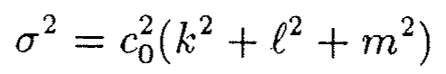](../equations/ch02-p020-e01-source.png) | [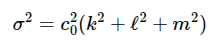](../equations/ch02-p020-e01-mathjax.png) | [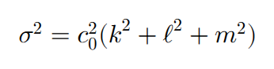](../equations/ch02-p020-e01-mathml.png) |

### p. 20 · display 2 · ch02-p020-e02

Source: [chapter2.tex](../chapter2.tex):93 · display type: `bracket`

#### Markdown math

$$
	c_{gx}=\frac{\partial\sigma}{\partial k};\qquad
	c_{gy}=\frac{\partial\sigma}{\partial\ell};\qquad
	c_{gz}=\frac{\partial\sigma}{\partial m}
$$

<details>
<summary>LaTeX source</summary>

```tex
\[
	c_{gx}=\frac{\partial\sigma}{\partial k};\qquad
	c_{gy}=\frac{\partial\sigma}{\partial\ell};\qquad
	c_{gz}=\frac{\partial\sigma}{\partial m}
\]
```

</details>

| Source PDF | MathJax | MathML |
| --- | --- | --- |
| [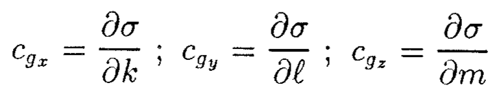](../equations/ch02-p020-e02-source.png) | [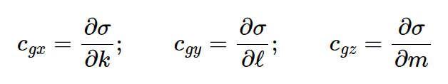](../equations/ch02-p020-e02-mathjax.png) | [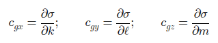](../equations/ch02-p020-e02-mathml.png) |

### p. 20 · display 3 · ch02-p020-e03

Source: [chapter2.tex](../chapter2.tex):102 · display type: `bracket`

#### Markdown math

$$
	\vec u=\frac{\vec k a}{\sigma\rho_0}
	e^{i(\vec k\cdot\vec x-\sigma t)}.
$$

<details>
<summary>LaTeX source</summary>

```tex
\[
	\vec u=\frac{\vec k a}{\sigma\rho_0}
	e^{i(\vec k\cdot\vec x-\sigma t)}.
\]
```

</details>

| Source PDF | MathJax | MathML |
| --- | --- | --- |
| [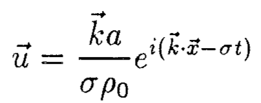](../equations/ch02-p020-e03-source.png) | [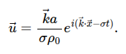](../equations/ch02-p020-e03-mathjax.png) | [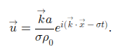](../equations/ch02-p020-e03-mathml.png) |

### p. 20 · display 4 · ch02-p020-e04

Source: [chapter2.tex](../chapter2.tex):113 · display type: `bracket`

#### Markdown math

$$
	p_{inc}=p_0e^{-i\sigma t+ikx+i\ell y-imz}
$$

<details>
<summary>LaTeX source</summary>

```tex
\[
	p_{inc}=p_0e^{-i\sigma t+ikx+i\ell y-imz}
\]
```

</details>

| Source PDF | MathJax | MathML |
| --- | --- | --- |
| [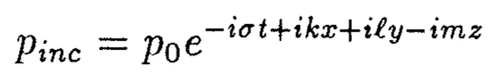](../equations/ch02-p020-e04-source.png) | [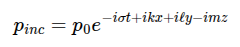](../equations/ch02-p020-e04-mathjax.png) | [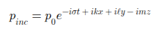](../equations/ch02-p020-e04-mathml.png) |

### p. 21 · display 1 · ch02-p021-e01

Source: [chapter2.tex](../chapter2.tex):125 · display type: `bracket`

#### Markdown math

$$
	p_z=0\qquad\text{at }z=0.
$$

<details>
<summary>LaTeX source</summary>

```tex
\[
	p_z=0\qquad\text{at }z=0.
\]
```

</details>

| Source PDF | MathJax | MathML |
| --- | --- | --- |
| [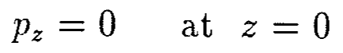](../equations/ch02-p021-e01-source.png) | [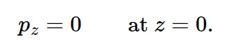](../equations/ch02-p021-e01-mathjax.png) | [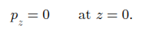](../equations/ch02-p021-e01-mathml.png) |

### p. 21 · display 2 · ch02-p021-e02

Source: [chapter2.tex](../chapter2.tex):133 · display type: `bracket`

#### Markdown math

$$
	p_{ref}=p_0e^{-i\sigma t+ikx+i\ell y+imz}
$$

<details>
<summary>LaTeX source</summary>

```tex
\[
	p_{ref}=p_0e^{-i\sigma t+ikx+i\ell y+imz}
\]
```

</details>

| Source PDF | MathJax | MathML |
| --- | --- | --- |
| [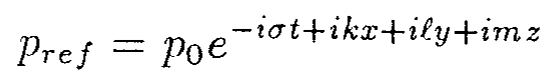](../equations/ch02-p021-e02-source.png) | [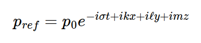](../equations/ch02-p021-e02-mathjax.png) | [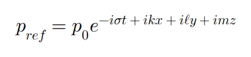](../equations/ch02-p021-e02-mathml.png) |

### p. 21 · display 3 · ch02-p021-e03

Source: [chapter2.tex](../chapter2.tex):137 · display type: `bracket`

#### Markdown math

$$
	p=p_{inc}+p_{ref}=2p_0e^{-i\sigma t+ikx+i\ell y}\cos mz.
$$

<details>
<summary>LaTeX source</summary>

```tex
\[
	p=p_{inc}+p_{ref}=2p_0e^{-i\sigma t+ikx+i\ell y}\cos mz.
\]
```

</details>

| Source PDF | MathJax | MathML |
| --- | --- | --- |
| [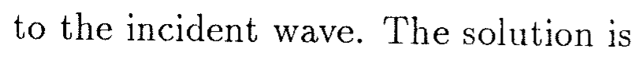](../equations/ch02-p021-e03-source.png) | [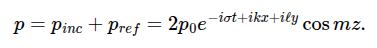](../equations/ch02-p021-e03-mathjax.png) | [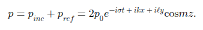](../equations/ch02-p021-e03-mathml.png) |

### p. 22 · display 1 · ch02-p022-e01

Source: [chapter2.tex](../chapter2.tex):154 · display type: `bracket`

#### Markdown math

$$
	|\vec k_i|\cos\theta_i=|\vec k_r|\cos\theta_r,
$$

<details>
<summary>LaTeX source</summary>

```tex
\[
	|\vec k_i|\cos\theta_i=|\vec k_r|\cos\theta_r,
\]
```

</details>

| Source PDF | MathJax | MathML |
| --- | --- | --- |
| [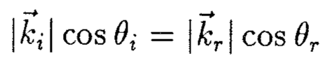](../equations/ch02-p022-e01-source.png) | [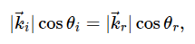](../equations/ch02-p022-e01-mathjax.png) | [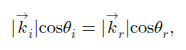](../equations/ch02-p022-e01-mathml.png) |

### p. 23 · display 1 · ch02-p023-e01

Source: [chapter2.tex](../chapter2.tex):186 · display type: `bracket`

#### Markdown math

$$
	p(x,y,z,t)=p_0e^{-i\sigma t+ikx+i\ell y}P(z).
$$

<details>
<summary>LaTeX source</summary>

```tex
\[
	p(x,y,z,t)=p_0e^{-i\sigma t+ikx+i\ell y}P(z).
\]
```

</details>

| Source PDF | MathJax | MathML |
| --- | --- | --- |
| [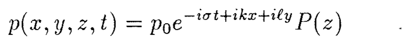](../equations/ch02-p023-e01-source.png) | [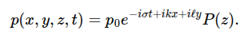](../equations/ch02-p023-e01-mathjax.png) | [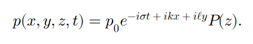](../equations/ch02-p023-e01-mathml.png) |

### p. 23 · display 2 · ch02-p023-e02

Source: [chapter2.tex](../chapter2.tex):191 · display type: `bracket`

#### Markdown math

$$
	P_{zz}+(\sigma^2/c_0^2-k^2-\ell^2)P=0
$$

<details>
<summary>LaTeX source</summary>

```tex
\[
	P_{zz}+(\sigma^2/c_0^2-k^2-\ell^2)P=0
\]
```

</details>

| Source PDF | MathJax | MathML |
| --- | --- | --- |
| [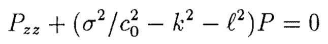](../equations/ch02-p023-e02-source.png) | [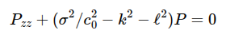](../equations/ch02-p023-e02-mathjax.png) | [](../equations/ch02-p023-e02-mathml.png) |

### p. 23 · display 3 · ch02-p023-e03

Source: [chapter2.tex](../chapter2.tex):194 · display type: `bracket`

#### Markdown math

$$
	P_z=0\qquad\text{at }z=0,-D.
$$

<details>
<summary>LaTeX source</summary>

```tex
\[
	P_z=0\qquad\text{at }z=0,-D.
\]
```

</details>

| Source PDF | MathJax | MathML |
| --- | --- | --- |
| [](../equations/ch02-p023-e03-source.png) | [](../equations/ch02-p023-e03-mathjax.png) | [](../equations/ch02-p023-e03-mathml.png) |

### p. 23 · display 4 · ch02-p023-e04

Source: [chapter2.tex](../chapter2.tex):198 · display type: `bracket`

#### Markdown math

$$
	P(z)=\cos n\pi z/D
$$

<details>
<summary>LaTeX source</summary>

```tex
\[
	P(z)=\cos n\pi z/D
\]
```

</details>

| Source PDF | MathJax | MathML |
| --- | --- | --- |
| [](../equations/ch02-p023-e04-source.png) | [](../equations/ch02-p023-e04-mathjax.png) | [](../equations/ch02-p023-e04-mathml.png) |

### p. 23 · display 5 · ch02-p023-e05

Source: [chapter2.tex](../chapter2.tex):202 · display type: `waveequation`

#### Markdown math

$$
	\sigma^2/c_0^2=k^2+\ell^2+n^2\pi^2/D^2,
	\qquad n=0,1,2,\ldots
$$

<details>
<summary>LaTeX source</summary>

```tex
\begin{waveequation}
	\sigma^2/c_0^2=k^2+\ell^2+n^2\pi^2/D^2,
	\qquad n=0,1,2,\ldots
\end{waveequation}
```

</details>

| Source PDF | MathJax | MathML |
| --- | --- | --- |
| [](../equations/ch02-p023-e05-source.png) | [](../equations/ch02-p023-e05-mathjax.png) | [](../equations/ch02-p023-e05-mathml.png) |

### p. 24 · display 1 · ch02-p024-e01

Source: [chapter2.tex](../chapter2.tex):213 · display type: `bracket`

#### Markdown math

$$
	\frac12p_0e^{-i\sigma t+ikx+i\ell y+in\pi z/D}
	+\frac12p_0e^{-i\sigma t+ikx+i\ell y-in\pi z/D}
$$

<details>
<summary>LaTeX source</summary>

```tex
\[
	\frac12p_0e^{-i\sigma t+ikx+i\ell y+in\pi z/D}
	+\frac12p_0e^{-i\sigma t+ikx+i\ell y-in\pi z/D}
\]
```

</details>

| Source PDF | MathJax | MathML |
| --- | --- | --- |
| [](../equations/ch02-p024-e01-source.png) | [](../equations/ch02-p024-e01-mathjax.png) | [](../equations/ch02-p024-e01-mathml.png) |

### p. 24 · display 2 · ch02-p024-e02

Source: [chapter2.tex](../chapter2.tex):225 · display type: `bracket`

#### Markdown math

$$
	c_{ph}=\sigma/(k^2+\ell^2)^{1/2}
	=\pm c_0\left[1+\frac{n^2\pi^2}{(k^2+\ell^2)D^2}\right]^{1/2}.
$$

<details>
<summary>LaTeX source</summary>

```tex
\[
	c_{ph}=\sigma/(k^2+\ell^2)^{1/2}
	=\pm c_0\left[1+\frac{n^2\pi^2}{(k^2+\ell^2)D^2}\right]^{1/2}.
\]
```

</details>

| Source PDF | MathJax | MathML |
| --- | --- | --- |
| [](../equations/ch02-p024-e02-source.png) | [](../equations/ch02-p024-e02-mathjax.png) | [](../equations/ch02-p024-e02-mathml.png) |

### p. 24 · display 3 · ch02-p024-e03

Source: [chapter2.tex](../chapter2.tex):230 · display type: `bracket`

#### Markdown math

$$
	\vec c_g
	=c_0\frac{k\hat i+\ell\hat j}
	{(k^2+\ell^2+n^2\pi^2/D^2)^{1/2}}.
$$

<details>
<summary>LaTeX source</summary>

```tex
\[
	\vec c_g
	=c_0\frac{k\hat i+\ell\hat j}
	{(k^2+\ell^2+n^2\pi^2/D^2)^{1/2}}.
\]
```

</details>

| Source PDF | MathJax | MathML |
| --- | --- | --- |
| [](../equations/ch02-p024-e03-source.png) | [](../equations/ch02-p024-e03-mathjax.png) | [](../equations/ch02-p024-e03-mathml.png) |

### p. 25 · display 1 · ch02-p025-e01

Source: [chapter2.tex](../chapter2.tex):253 · display type: `bracket`

#### Markdown math

$$
	(k^2+\ell^2)=\sigma^2/c_0^2-n^2\pi^2/D^2
$$

<details>
<summary>LaTeX source</summary>

```tex
\[
	(k^2+\ell^2)=\sigma^2/c_0^2-n^2\pi^2/D^2
\]
```

</details>

| Source PDF | MathJax | MathML |
| --- | --- | --- |
| [](../equations/ch02-p025-e01-source.png) | [](../equations/ch02-p025-e01-mathjax.png) | [](../equations/ch02-p025-e01-mathml.png) |

### p. 25 · display 2 · ch02-p025-e02

Source: [chapter2.tex](../chapter2.tex):260 · display type: `align*`

#### Markdown math

$$
\begin{aligned}
	n<n_{max}\qquad
	p & =e^{-i\sigma t+i(\sigma^2/c_0^2-n^2\pi^2/D^2)^{1/2}x}
	\cos\frac{n\pi z}{D},                                     \\
	n>n_{max}\qquad
	p & =e^{-i\sigma t-(n^2\pi^2/D^2-\sigma^2/c_0^2)^{1/2}x}
	\cos\frac{n\pi z}{D}.
\end{aligned}
$$

<details>
<summary>LaTeX source</summary>

```tex
\begin{align*}
	n<n_{max}\qquad
	p & =e^{-i\sigma t+i(\sigma^2/c_0^2-n^2\pi^2/D^2)^{1/2}x}
	\cos\frac{n\pi z}{D},                                     \\
	n>n_{max}\qquad
	p & =e^{-i\sigma t-(n^2\pi^2/D^2-\sigma^2/c_0^2)^{1/2}x}
	\cos\frac{n\pi z}{D}.
\end{align*}
```

</details>

| Source PDF | MathJax | MathML |
| --- | --- | --- |
| [](../equations/ch02-p025-e02-source.png) | [](../equations/ch02-p025-e02-mathjax.png) | [](../equations/ch02-p025-e02-mathml.png) |

### p. 26 · display 1 · ch02-p026-e01

Source: [chapter2.tex](../chapter2.tex):295 · display type: `align*`

#### Markdown math

$$
\begin{aligned}
	p_I & =a e^{-i\sigma t+ikx+im_1z},  \\
	p_R & =Ra e^{-i\sigma t+ikx-im_1z}, \\
	p_T & =Ta e^{-i\sigma t+ikx+im_2z},
\end{aligned}
$$

<details>
<summary>LaTeX source</summary>

```tex
\begin{align*}
	p_I & =a e^{-i\sigma t+ikx+im_1z},  \\
	p_R & =Ra e^{-i\sigma t+ikx-im_1z}, \\
	p_T & =Ta e^{-i\sigma t+ikx+im_2z},
\end{align*}
```

</details>

| Source PDF | MathJax | MathML |
| --- | --- | --- |
| [](../equations/ch02-p026-e01-source.png) | [](../equations/ch02-p026-e01-mathjax.png) | [](../equations/ch02-p026-e01-mathml.png) |

### p. 27 · display 1 · ch02-p027-e01

Source: [chapter2.tex](../chapter2.tex):314 · display type: `align*`

#### Markdown math

$$
\begin{aligned}
	p_I+p_R                         & =p_T                    &  & \text{at }z=0, \\
	\frac{1}{\rho_1}(p_{Iz}+p_{Rz}) & =\frac{1}{\rho_2}p_{Tz} &  & \text{at }z=0.
\end{aligned}
$$

<details>
<summary>LaTeX source</summary>

```tex
\begin{align*}
	p_I+p_R                         & =p_T                    &  & \text{at }z=0, \\
	\frac{1}{\rho_1}(p_{Iz}+p_{Rz}) & =\frac{1}{\rho_2}p_{Tz} &  & \text{at }z=0.
\end{align*}
```

</details>

| Source PDF | MathJax | MathML |
| --- | --- | --- |
| [](../equations/ch02-p027-e01-source.png) | [](../equations/ch02-p027-e01-mathjax.png) | [](../equations/ch02-p027-e01-mathml.png) |

### p. 27 · display 2 · ch02-p027-e02

Source: [chapter2.tex](../chapter2.tex):319 · display type: `align*`

#### Markdown math

$$
\begin{aligned}
	1+R                     & =T,                   \\
	\frac{m_1}{\rho_1}(1-R) & =\frac{m_2}{\rho_2}T.
\end{aligned}
$$

<details>
<summary>LaTeX source</summary>

```tex
\begin{align*}
	1+R                     & =T,                   \\
	\frac{m_1}{\rho_1}(1-R) & =\frac{m_2}{\rho_2}T.
\end{align*}
```

</details>

| Source PDF | MathJax | MathML |
| --- | --- | --- |
| [](../equations/ch02-p027-e02-source.png) | [](../equations/ch02-p027-e02-mathjax.png) | [](../equations/ch02-p027-e02-mathml.png) |

### p. 27 · display 3 · ch02-p027-e03

Source: [chapter2.tex](../chapter2.tex):325 · display type: `bracket`

#### Markdown math

$$
	\frac{1}{\rho_1c_1}(1-R)\cos\theta_I
	=\frac{1}{\rho_2c_2}T\cos\theta_T.
$$

<details>
<summary>LaTeX source</summary>

```tex
\[
	\frac{1}{\rho_1c_1}(1-R)\cos\theta_I
	=\frac{1}{\rho_2c_2}T\cos\theta_T.
\]
```

</details>

| Source PDF | MathJax | MathML |
| --- | --- | --- |
| [](../equations/ch02-p027-e03-source.png) | [](../equations/ch02-p027-e03-mathjax.png) | [](../equations/ch02-p027-e03-mathml.png) |

### p. 27 · display 4 · ch02-p027-e04

Source: [chapter2.tex](../chapter2.tex):330 · display type: `waveequation`

#### Markdown math

$$
	R=\frac{\rho_2c_2\cos\theta_I-\rho_1c_1\cos\theta_T}
	{\rho_2c_2\cos\theta_I+\rho_1c_1\cos\theta_T}
$$

<details>
<summary>LaTeX source</summary>

```tex
\begin{waveequation}
	R=\frac{\rho_2c_2\cos\theta_I-\rho_1c_1\cos\theta_T}
	{\rho_2c_2\cos\theta_I+\rho_1c_1\cos\theta_T}
\end{waveequation}
```

</details>

| Source PDF | MathJax | MathML |
| --- | --- | --- |
| [](../equations/ch02-p027-e04-source.png) | [](../equations/ch02-p027-e04-mathjax.png) | [](../equations/ch02-p027-e04-mathml.png) |

### p. 27 · display 5 · ch02-p027-e05

Source: [chapter2.tex](../chapter2.tex):334 · display type: `waveequation`

#### Markdown math

$$
	T=\frac{2\rho_2c_2\cos\theta_I}
	{\rho_2c_2\cos\theta_I+\rho_1c_1\cos\theta_T}.
$$

<details>
<summary>LaTeX source</summary>

```tex
\begin{waveequation}
	T=\frac{2\rho_2c_2\cos\theta_I}
	{\rho_2c_2\cos\theta_I+\rho_1c_1\cos\theta_T}.
\end{waveequation}
```

</details>

| Source PDF | MathJax | MathML |
| --- | --- | --- |
| [](../equations/ch02-p027-e05-source.png) | [](../equations/ch02-p027-e05-mathjax.png) | [](../equations/ch02-p027-e05-mathml.png) |

### p. 28 · display 1 · ch02-p028-e01

Source: [chapter2.tex](../chapter2.tex):358 · display type: `bracket`

#### Markdown math

$$
	|p_Iw_I|=|p_Rw_R|+|p_Tw_T|.
$$

<details>
<summary>LaTeX source</summary>

```tex
\[
	|p_Iw_I|=|p_Rw_R|+|p_Tw_T|.
\]
```

</details>

| Source PDF | MathJax | MathML |
| --- | --- | --- |
| [](../equations/ch02-p028-e01-source.png) | [](../equations/ch02-p028-e01-mathjax.png) | [](../equations/ch02-p028-e01-mathml.png) |

### p. 28 · display 2 · ch02-p028-e02

Source: [chapter2.tex](../chapter2.tex):364 · display type: `bracket`

#### Markdown math

$$
	\sigma=c_1(k^2+m_1^2)^{1/2}=c_2(k^2+m_2^2)^{1/2}.
$$

<details>
<summary>LaTeX source</summary>

```tex
\[
	\sigma=c_1(k^2+m_1^2)^{1/2}=c_2(k^2+m_2^2)^{1/2}.
\]
```

</details>

| Source PDF | MathJax | MathML |
| --- | --- | --- |
| [](../equations/ch02-p028-e02-source.png) | [](../equations/ch02-p028-e02-mathjax.png) | [](../equations/ch02-p028-e02-mathml.png) |

### p. 28 · display 3 · ch02-p028-e03

Source: [chapter2.tex](../chapter2.tex):368 · display type: `waveequation`

#### Markdown math

$$
	\frac{\sin\theta_I}{c_1}=\frac{\sin\theta_T}{c_2}
$$

<details>
<summary>LaTeX source</summary>

```tex
\begin{waveequation}
	\frac{\sin\theta_I}{c_1}=\frac{\sin\theta_T}{c_2}
\end{waveequation}
```

</details>

| Source PDF | MathJax | MathML |
| --- | --- | --- |
| [](../equations/ch02-p028-e03-source.png) | [](../equations/ch02-p028-e03-mathjax.png) | [](../equations/ch02-p028-e03-mathml.png) |

### p. 28 · display 4 · ch02-p028-e04

Source: [chapter2.tex](../chapter2.tex):373 · display type: `waveequation`

#### Markdown math

$$
	\theta_{Ic}=\sin^{-1}(c_1/c_2)
$$

<details>
<summary>LaTeX source</summary>

```tex
\begin{waveequation}
	\theta_{Ic}=\sin^{-1}(c_1/c_2)
\end{waveequation}
```

</details>

| Source PDF | MathJax | MathML |
| --- | --- | --- |
| [](../equations/ch02-p028-e04-source.png) | [](../equations/ch02-p028-e04-mathjax.png) | [](../equations/ch02-p028-e04-mathml.png) |

### p. 29 · display 1 · ch02-p029-e01

Source: [chapter2.tex](../chapter2.tex):395 · display type: `align*`

#### Markdown math

$$
\begin{aligned}
	\vec u_t                       & =-\nabla p/\rho_0+\vec F/\rho_0, \\
	\rho_t+\rho_0\nabla\cdot\vec u & =Q.
\end{aligned}
$$

<details>
<summary>LaTeX source</summary>

```tex
\begin{align*}
	\vec u_t                       & =-\nabla p/\rho_0+\vec F/\rho_0, \\
	\rho_t+\rho_0\nabla\cdot\vec u & =Q.
\end{align*}
```

</details>

| Source PDF | MathJax | MathML |
| --- | --- | --- |
| [](../equations/ch02-p029-e01-source.png) | [](../equations/ch02-p029-e01-mathjax.png) | [](../equations/ch02-p029-e01-mathml.png) |

### p. 29 · display 2 · ch02-p029-e02

Source: [chapter2.tex](../chapter2.tex):400 · display type: `waveequation`

#### Markdown math

$$
	p_{tt}-c^2\nabla^2p=c^2(Q_t-\nabla\cdot\vec F).
$$

<details>
<summary>LaTeX source</summary>

```tex
\begin{waveequation}
	p_{tt}-c^2\nabla^2p=c^2(Q_t-\nabla\cdot\vec F).
\end{waveequation}
```

</details>

| Source PDF | MathJax | MathML |
| --- | --- | --- |
| [](../equations/ch02-p029-e02-source.png) | [](../equations/ch02-p029-e02-mathjax.png) | [](../equations/ch02-p029-e02-mathml.png) |

### p. 29 · display 3 · ch02-p029-e03

Source: [chapter2.tex](../chapter2.tex):415 · display type: `bracket`

#### Markdown math

$$
	p_{tt}-c^2p_{xx}=0\qquad -\infty<x<\infty
$$

<details>
<summary>LaTeX source</summary>

```tex
\[
	p_{tt}-c^2p_{xx}=0\qquad -\infty<x<\infty
\]
```

</details>

| Source PDF | MathJax | MathML |
| --- | --- | --- |
| [](../equations/ch02-p029-e03-source.png) | [](../equations/ch02-p029-e03-mathjax.png) | [](../equations/ch02-p029-e03-mathml.png) |

### p. 29 · display 4 · ch02-p029-e04

Source: [chapter2.tex](../chapter2.tex):418 · display type: `bracket`

#### Markdown math

$$
	p(x,0)=P_0(x)\ ;\qquad p_t(x,0)=Q_0(x).
$$

<details>
<summary>LaTeX source</summary>

```tex
\[
	p(x,0)=P_0(x)\ ;\qquad p_t(x,0)=Q_0(x).
\]
```

</details>

| Source PDF | MathJax | MathML |
| --- | --- | --- |
| [](../equations/ch02-p029-e04-source.png) | [](../equations/ch02-p029-e04-mathjax.png) | [](../equations/ch02-p029-e04-mathml.png) |

### p. 30 · display 1 · ch02-p030-e01

Source: [chapter2.tex](../chapter2.tex):428 · display type: `bracket`

#### Markdown math

$$
	p=f(x-ct)+g(x+ct).
$$

<details>
<summary>LaTeX source</summary>

```tex
\[
	p=f(x-ct)+g(x+ct).
\]
```

</details>

| Source PDF | MathJax | MathML |
| --- | --- | --- |
| [](../equations/ch02-p030-e01-source.png) | [](../equations/ch02-p030-e01-mathjax.png) | [](../equations/ch02-p030-e01-mathml.png) |

### p. 30 · display 2 · ch02-p030-e02

Source: [chapter2.tex](../chapter2.tex):432 · display type: `align*`

#### Markdown math

$$
\begin{aligned}
	f(x)+g(x)      & =P_0(x), \\
	-cf'(x)+cg'(x) & =Q_0(x).
\end{aligned}
$$

<details>
<summary>LaTeX source</summary>

```tex
\begin{align*}
	f(x)+g(x)      & =P_0(x), \\
	-cf'(x)+cg'(x) & =Q_0(x).
\end{align*}
```

</details>

| Source PDF | MathJax | MathML |
| --- | --- | --- |
| [](../equations/ch02-p030-e02-source.png) | [](../equations/ch02-p030-e02-mathjax.png) | [](../equations/ch02-p030-e02-mathml.png) |

### p. 30 · display 3 · ch02-p030-e03

Source: [chapter2.tex](../chapter2.tex):437 · display type: `bracket`

#### Markdown math

$$
	f(x)-g(x)=-\frac1c\int_0^x Q_0(x')\,dx'+K
$$

<details>
<summary>LaTeX source</summary>

```tex
\[
	f(x)-g(x)=-\frac1c\int_0^x Q_0(x')\,dx'+K
\]
```

</details>

| Source PDF | MathJax | MathML |
| --- | --- | --- |
| [](../equations/ch02-p030-e03-source.png) | [](../equations/ch02-p030-e03-mathjax.png) | [](../equations/ch02-p030-e03-mathml.png) |

### p. 30 · display 4 · ch02-p030-e04

Source: [chapter2.tex](../chapter2.tex):441 · display type: `align*`

#### Markdown math

$$
\begin{aligned}
	2f(x) & =P_0(x)-\frac1c\int_0^x Q_0(x')\,dx'+K, \\
	2g(x) & =P_0(x)+\frac1c\int_0^x Q_0(x')\,dx'-K.
\end{aligned}
$$

<details>
<summary>LaTeX source</summary>

```tex
\begin{align*}
	2f(x) & =P_0(x)-\frac1c\int_0^x Q_0(x')\,dx'+K, \\
	2g(x) & =P_0(x)+\frac1c\int_0^x Q_0(x')\,dx'-K.
\end{align*}
```

</details>

| Source PDF | MathJax | MathML |
| --- | --- | --- |
| [](../equations/ch02-p030-e04-source.png) | [](../equations/ch02-p030-e04-mathjax.png) | [](../equations/ch02-p030-e04-mathml.png) |

### p. 30 · display 5 · ch02-p030-e05

Source: [chapter2.tex](../chapter2.tex):446 · display type: `bracket`

#### Markdown math

$$
	p(x,t)=\frac12\left[P_0(x-ct)+P_0(x+ct)
		+\frac1c\int_{x-ct}^{x+ct}Q_0(x')\,dx'\right].
$$

<details>
<summary>LaTeX source</summary>

```tex
\[
	p(x,t)=\frac12\left[P_0(x-ct)+P_0(x+ct)
		+\frac1c\int_{x-ct}^{x+ct}Q_0(x')\,dx'\right].
\]
```

</details>

| Source PDF | MathJax | MathML |
| --- | --- | --- |
| [](../equations/ch02-p030-e05-source.png) | [](../equations/ch02-p030-e05-mathjax.png) | [](../equations/ch02-p030-e05-mathml.png) |

### p. 30 · display 6 · ch02-p030-e06

Source: [chapter2.tex](../chapter2.tex):453 · display type: `bracket`

#### Markdown math

$$
	p(x,t)=\frac12[P_0(x-ct)+P_0(x+ct)]
$$

<details>
<summary>LaTeX source</summary>

```tex
\[
	p(x,t)=\frac12[P_0(x-ct)+P_0(x+ct)]
\]
```

</details>

| Source PDF | MathJax | MathML |
| --- | --- | --- |
| [](../equations/ch02-p030-e06-source.png) | [](../equations/ch02-p030-e06-mathjax.png) | [](../equations/ch02-p030-e06-mathml.png) |

### p. 30 · display 7 · ch02-p030-e07

Source: [chapter2.tex](../chapter2.tex):458 · display type: `bracket`

#### Markdown math

$$
	p(x,t)=\int_{-\infty}^{\infty}\bar p(k,t)e^{ikx}\,dk.
$$

<details>
<summary>LaTeX source</summary>

```tex
\[
	p(x,t)=\int_{-\infty}^{\infty}\bar p(k,t)e^{ikx}\,dk.
\]
```

</details>

| Source PDF | MathJax | MathML |
| --- | --- | --- |
| [](../equations/ch02-p030-e07-source.png) | [](../equations/ch02-p030-e07-mathjax.png) | [](../equations/ch02-p030-e07-mathml.png) |

### p. 30 · display 8 · ch02-p030-e08

Source: [chapter2.tex](../chapter2.tex):462 · display type: `bracket`

#### Markdown math

$$
	\bar p_{tt}+c^2k^2\bar p=0
$$

<details>
<summary>LaTeX source</summary>

```tex
\[
	\bar p_{tt}+c^2k^2\bar p=0
\]
```

</details>

| Source PDF | MathJax | MathML |
| --- | --- | --- |
| [](../equations/ch02-p030-e08-source.png) | [](../equations/ch02-p030-e08-mathjax.png) | [](../equations/ch02-p030-e08-mathml.png) |

### p. 30 · display 9 · ch02-p030-e09

Source: [chapter2.tex](../chapter2.tex):465 · display type: `bracket`

#### Markdown math

$$
	\bar p(k,0)=\bar P_0(k)\ ;\qquad \bar p_t(k,0)=0.
$$

<details>
<summary>LaTeX source</summary>

```tex
\[
	\bar p(k,0)=\bar P_0(k)\ ;\qquad \bar p_t(k,0)=0.
\]
```

</details>

| Source PDF | MathJax | MathML |
| --- | --- | --- |
| [](../equations/ch02-p030-e09-source.png) | [](../equations/ch02-p030-e09-mathjax.png) | [](../equations/ch02-p030-e09-mathml.png) |

### p. 31 · display 1 · ch02-p031-e01

Source: [chapter2.tex](../chapter2.tex):475 · display type: `bracket`

#### Markdown math

$$
	\bar p(k,t)=\bar P_0(k)\cos(ckt)
$$

<details>
<summary>LaTeX source</summary>

```tex
\[
	\bar p(k,t)=\bar P_0(k)\cos(ckt)
\]
```

</details>

| Source PDF | MathJax | MathML |
| --- | --- | --- |
| [](../equations/ch02-p031-e01-source.png) | [](../equations/ch02-p031-e01-mathjax.png) | [](../equations/ch02-p031-e01-mathml.png) |

### p. 31 · display 2 · ch02-p031-e02

Source: [chapter2.tex](../chapter2.tex):479 · display type: `align*`

#### Markdown math

$$
\begin{aligned}
	p(x,t)
	 & =\int_{-\infty}^{\infty}\bar P_0(k)\cos(ckt)e^{ikx}\,dk \\
	 & =\frac12\int_{-\infty}^{\infty}\bar P_0(k)
	\left(e^{ikx+ickt}+e^{ikx-ickt}\right)\,dk                 \\
	 & =\frac12[P_0(x-ct)+P_0(x+ct)].
\end{aligned}
$$

<details>
<summary>LaTeX source</summary>

```tex
\begin{align*}
	p(x,t)
	 & =\int_{-\infty}^{\infty}\bar P_0(k)\cos(ckt)e^{ikx}\,dk \\
	 & =\frac12\int_{-\infty}^{\infty}\bar P_0(k)
	\left(e^{ikx+ickt}+e^{ikx-ickt}\right)\,dk                 \\
	 & =\frac12[P_0(x-ct)+P_0(x+ct)].
\end{align*}
```

</details>

| Source PDF | MathJax | MathML |
| --- | --- | --- |
| [](../equations/ch02-p031-e02-source.png) | [](../equations/ch02-p031-e02-mathjax.png) | [](../equations/ch02-p031-e02-mathml.png) |

### p. 31 · display 3 · ch02-p031-e03

Source: [chapter2.tex](../chapter2.tex):491 · display type: `bracket`

#### Markdown math

$$
	Q_t-\nabla\cdot\vec F=\delta(x)q_t(t)
$$

<details>
<summary>LaTeX source</summary>

```tex
\[
	Q_t-\nabla\cdot\vec F=\delta(x)q_t(t)
\]
```

</details>

| Source PDF | MathJax | MathML |
| --- | --- | --- |
| [](../equations/ch02-p031-e03-source.png) | [](../equations/ch02-p031-e03-mathjax.png) | [](../equations/ch02-p031-e03-mathml.png) |

### p. 31 · display 4 · ch02-p031-e04

Source: [chapter2.tex](../chapter2.tex):495 · display type: `bracket`

#### Markdown math

$$
	p_{tt}-c^2p_{xx}=\delta(x)q_t(t)c^2
$$

<details>
<summary>LaTeX source</summary>

```tex
\[
	p_{tt}-c^2p_{xx}=\delta(x)q_t(t)c^2
\]
```

</details>

| Source PDF | MathJax | MathML |
| --- | --- | --- |
| [](../equations/ch02-p031-e04-source.png) | [](../equations/ch02-p031-e04-mathjax.png) | [](../equations/ch02-p031-e04-mathml.png) |

### p. 31 · display 5 · ch02-p031-e05

Source: [chapter2.tex](../chapter2.tex):498 · display type: `bracket`

#### Markdown math

$$
	p(x,0)=p_t(x,0)=0\qquad\text{at }t=0.
$$

<details>
<summary>LaTeX source</summary>

```tex
\[
	p(x,0)=p_t(x,0)=0\qquad\text{at }t=0.
\]
```

</details>

| Source PDF | MathJax | MathML |
| --- | --- | --- |
| [](../equations/ch02-p031-e05-source.png) | [](../equations/ch02-p031-e05-mathjax.png) | [](../equations/ch02-p031-e05-mathml.png) |

### p. 31 · display 6 · ch02-p031-e06

Source: [chapter2.tex](../chapter2.tex):502 · display type: `bracket`

#### Markdown math

$$
	\int_{0^-}^{0^+}(p_{tt}-c^2p_{xx})\,dx
	=-c^2p_x\big|_{0^-}^{0^+}=c^2q_t(t).
$$

<details>
<summary>LaTeX source</summary>

```tex
\[
	\int_{0^-}^{0^+}(p_{tt}-c^2p_{xx})\,dx
	=-c^2p_x\big|_{0^-}^{0^+}=c^2q_t(t).
\]
```

</details>

| Source PDF | MathJax | MathML |
| --- | --- | --- |
| [](../equations/ch02-p031-e06-source.png) | [](../equations/ch02-p031-e06-mathjax.png) | [](../equations/ch02-p031-e06-mathml.png) |

### p. 32 · display 1 · ch02-p032-e01

Source: [chapter2.tex](../chapter2.tex):520 · display type: `bracket`

#### Markdown math

$$
	p^R(x,t)=p^L(-x,t)
$$

<details>
<summary>LaTeX source</summary>

```tex
\[
	p^R(x,t)=p^L(-x,t)
\]
```

</details>

| Source PDF | MathJax | MathML |
| --- | --- | --- |
| [](../equations/ch02-p032-e01-source.png) | [](../equations/ch02-p032-e01-mathjax.png) | [](../equations/ch02-p032-e01-mathml.png) |

### p. 32 · display 2 · ch02-p032-e02

Source: [chapter2.tex](../chapter2.tex):523 · display type: `bracket`

#### Markdown math

$$
	p^R(x,t)=f(x-ct)+g(x+ct)
$$

<details>
<summary>LaTeX source</summary>

```tex
\[
	p^R(x,t)=f(x-ct)+g(x+ct)
\]
```

</details>

| Source PDF | MathJax | MathML |
| --- | --- | --- |
| [](../equations/ch02-p032-e02-source.png) | [](../equations/ch02-p032-e02-mathjax.png) | [](../equations/ch02-p032-e02-mathml.png) |

### p. 32 · display 3 · ch02-p032-e03

Source: [chapter2.tex](../chapter2.tex):526 · display type: `bracket`

#### Markdown math

$$
	p^L(x,t)=f(-x-ct)+g(-x+ct).
$$

<details>
<summary>LaTeX source</summary>

```tex
\[
	p^L(x,t)=f(-x-ct)+g(-x+ct).
\]
```

</details>

| Source PDF | MathJax | MathML |
| --- | --- | --- |
| [](../equations/ch02-p032-e03-source.png) | [](../equations/ch02-p032-e03-mathjax.png) | [](../equations/ch02-p032-e03-mathml.png) |

### p. 32 · display 4 · ch02-p032-e04

Source: [chapter2.tex](../chapter2.tex):530 · display type: `bracket`

#### Markdown math

$$
	f'(-ct)+g'(ct)+f'(-ct)+g'(ct)=-q_t(t)
$$

<details>
<summary>LaTeX source</summary>

```tex
\[
	f'(-ct)+g'(ct)+f'(-ct)+g'(ct)=-q_t(t)
\]
```

</details>

| Source PDF | MathJax | MathML |
| --- | --- | --- |
| [](../equations/ch02-p032-e04-source.png) | [](../equations/ch02-p032-e04-mathjax.png) | [](../equations/ch02-p032-e04-mathml.png) |

### p. 32 · display 5 · ch02-p032-e05

Source: [chapter2.tex](../chapter2.tex):535 · display type: `bracket`

#### Markdown math

$$
	p^R(x,t)=f(x-ct)\qquad p^R\text{ is all right going waves}
$$

<details>
<summary>LaTeX source</summary>

```tex
\[
	p^R(x,t)=f(x-ct)\qquad p^R\text{ is all right going waves}
\]
```

</details>

| Source PDF | MathJax | MathML |
| --- | --- | --- |
| [](../equations/ch02-p032-e05-source.png) | [](../equations/ch02-p032-e05-mathjax.png) | [](../equations/ch02-p032-e05-mathml.png) |

### p. 32 · display 6 · ch02-p032-e06

Source: [chapter2.tex](../chapter2.tex):538 · display type: `bracket`

#### Markdown math

$$
	p^L(x,t)=f(-x-ct)\qquad p^L\text{ is all left going waves}.
$$

<details>
<summary>LaTeX source</summary>

```tex
\[
	p^L(x,t)=f(-x-ct)\qquad p^L\text{ is all left going waves}.
\]
```

</details>

| Source PDF | MathJax | MathML |
| --- | --- | --- |
| [](../equations/ch02-p032-e06-source.png) | [](../equations/ch02-p032-e06-mathjax.png) | [](../equations/ch02-p032-e06-mathml.png) |

### p. 32 · display 7 · ch02-p032-e07

Source: [chapter2.tex](../chapter2.tex):542 · display type: `bracket`

#### Markdown math

$$
	2f'(-ct)=-q_t(t)
$$

<details>
<summary>LaTeX source</summary>

```tex
\[
	2f'(-ct)=-q_t(t)
\]
```

</details>

| Source PDF | MathJax | MathML |
| --- | --- | --- |
| [](../equations/ch02-p032-e07-source.png) | [](../equations/ch02-p032-e07-mathjax.png) | [](../equations/ch02-p032-e07-mathml.png) |

### p. 32 · display 8 · ch02-p032-e08

Source: [chapter2.tex](../chapter2.tex):545 · display type: `bracket`

#### Markdown math

$$
	2f(-ct)=q(t)c
$$

<details>
<summary>LaTeX source</summary>

```tex
\[
	2f(-ct)=q(t)c
\]
```

</details>

| Source PDF | MathJax | MathML |
| --- | --- | --- |
| [](../equations/ch02-p032-e08-source.png) | [](../equations/ch02-p032-e08-mathjax.png) | [](../equations/ch02-p032-e08-mathml.png) |

### p. 32 · display 9 · ch02-p032-e09

Source: [chapter2.tex](../chapter2.tex):548 · display type: `bracket`

#### Markdown math

$$
	f(\tau)=\frac{c}{2}q(-\tau/c).
$$

<details>
<summary>LaTeX source</summary>

```tex
\[
	f(\tau)=\frac{c}{2}q(-\tau/c).
\]
```

</details>

| Source PDF | MathJax | MathML |
| --- | --- | --- |
| [](../equations/ch02-p032-e09-source.png) | [](../equations/ch02-p032-e09-mathjax.png) | [](../equations/ch02-p032-e09-mathml.png) |

### p. 33 · display 1 · ch02-p033-e01

Source: [chapter2.tex](../chapter2.tex):558 · display type: `bracket`

#### Markdown math

$$
	p^R(x,t)=\frac{c}{2}q(-x/c+t)
$$

<details>
<summary>LaTeX source</summary>

```tex
\[
	p^R(x,t)=\frac{c}{2}q(-x/c+t)
\]
```

</details>

| Source PDF | MathJax | MathML |
| --- | --- | --- |
| [](../equations/ch02-p033-e01-source.png) | [](../equations/ch02-p033-e01-mathjax.png) | [](../equations/ch02-p033-e01-mathml.png) |

### p. 33 · display 2 · ch02-p033-e02

Source: [chapter2.tex](../chapter2.tex):561 · display type: `bracket`

#### Markdown math

$$
	p^L(x,t)=\frac{c}{2}q(x/c+t).
$$

<details>
<summary>LaTeX source</summary>

```tex
\[
	p^L(x,t)=\frac{c}{2}q(x/c+t).
\]
```

</details>

| Source PDF | MathJax | MathML |
| --- | --- | --- |
| [](../equations/ch02-p033-e02-source.png) | [](../equations/ch02-p033-e02-mathjax.png) | [](../equations/ch02-p033-e02-mathml.png) |

### p. 33 · display 3 · ch02-p033-e03

Source: [chapter2.tex](../chapter2.tex):568 · display type: `bracket`

#### Markdown math

$$
	p_{tt}-c^2p_{xx}=c^2\delta(x)e^{-i\sigma t}
$$

<details>
<summary>LaTeX source</summary>

```tex
\[
	p_{tt}-c^2p_{xx}=c^2\delta(x)e^{-i\sigma t}
\]
```

</details>

| Source PDF | MathJax | MathML |
| --- | --- | --- |
| [](../equations/ch02-p033-e03-source.png) | [](../equations/ch02-p033-e03-mathjax.png) | [](../equations/ch02-p033-e03-mathml.png) |

### p. 33 · display 4 · ch02-p033-e04

Source: [chapter2.tex](../chapter2.tex):572 · display type: `bracket`

#### Markdown math

$$
	p^R(x,t)=\frac{-c}{2(i\sigma)}e^{-i\sigma(-x/c+t)}
$$

<details>
<summary>LaTeX source</summary>

```tex
\[
	p^R(x,t)=\frac{-c}{2(i\sigma)}e^{-i\sigma(-x/c+t)}
\]
```

</details>

| Source PDF | MathJax | MathML |
| --- | --- | --- |
| [](../equations/ch02-p033-e04-source.png) | [](../equations/ch02-p033-e04-mathjax.png) | [](../equations/ch02-p033-e04-mathml.png) |

### p. 33 · display 5 · ch02-p033-e05

Source: [chapter2.tex](../chapter2.tex):575 · display type: `bracket`

#### Markdown math

$$
	p^L(x,t)=\frac{-c}{2(i\sigma)}e^{-i\sigma(x/c+t)}.
$$

<details>
<summary>LaTeX source</summary>

```tex
\[
	p^L(x,t)=\frac{-c}{2(i\sigma)}e^{-i\sigma(x/c+t)}.
\]
```

</details>

| Source PDF | MathJax | MathML |
| --- | --- | --- |
| [](../equations/ch02-p033-e05-source.png) | [](../equations/ch02-p033-e05-mathjax.png) | [](../equations/ch02-p033-e05-mathml.png) |

### p. 34 · display 1 · ch02-p034-e01

Source: [chapter2.tex](../chapter2.tex):598 · display type: `bracket`

#### Markdown math

$$
	c(s,T,z)=c_0+\alpha_0(T-10)+\beta_0(T-10)^2+\gamma_0(T-18)^2
	+\delta_0(s-35)+\epsilon_0(T-18)(s-35)+\zeta_0|z|
$$

<details>
<summary>LaTeX source</summary>

```tex
\[
	c(s,T,z)=c_0+\alpha_0(T-10)+\beta_0(T-10)^2+\gamma_0(T-18)^2
	+\delta_0(s-35)+\epsilon_0(T-18)(s-35)+\zeta_0|z|
\]
```

</details>

| Source PDF | MathJax | MathML |
| --- | --- | --- |
| [](../equations/ch02-p034-e01-source.png) | [](../equations/ch02-p034-e01-mathjax.png) | [](../equations/ch02-p034-e01-mathml.png) |

### p. 34 · display 2 · ch02-p034-e02

Source: [chapter2.tex](../chapter2.tex):604 · display type: `bracket`

#### Markdown math

$$
			c_0=1493.0,\quad \alpha_0=3.0,\quad \beta_0=-0.006,\quad \gamma_0=-0.04,
			\quad \delta_0=1.2,\quad \epsilon_0=-0.01,\quad \zeta_0=0.0164.
$$

<details>
<summary>LaTeX source</summary>

```tex
		\[
			c_0=1493.0,\quad \alpha_0=3.0,\quad \beta_0=-0.006,\quad \gamma_0=-0.04,
			\quad \delta_0=1.2,\quad \epsilon_0=-0.01,\quad \zeta_0=0.0164.
		\]
```

</details>

| Source PDF | MathJax | MathML |
| --- | --- | --- |
| [](../equations/ch02-p034-e02-source.png) | [](../equations/ch02-p034-e02-mathjax.png) | [](../equations/ch02-p034-e02-mathml.png) |

### p. 35 · display 1 · ch02-p035-e01

Source: [chapter2.tex](../chapter2.tex):637 · display type: `bracket`

#### Markdown math

$$
	\sigma=\Omega(k,m;z).
$$

<details>
<summary>LaTeX source</summary>

```tex
\[
	\sigma=\Omega(k,m;z).
\]
```

</details>

| Source PDF | MathJax | MathML |
| --- | --- | --- |
| [](../equations/ch02-p035-e01-source.png) | [](../equations/ch02-p035-e01-mathjax.png) | [](../equations/ch02-p035-e01-mathml.png) |

### p. 35 · display 2 · ch02-p035-e02

Source: [chapter2.tex](../chapter2.tex):643 · display type: `align*`

#### Markdown math

$$
\begin{aligned}
	\frac{dN}{dt} & =0,                                  \\
	\frac{dk}{dt} & =0,                                  \\
	\frac{dm}{dt} & =-\frac{\partial\Omega}{\partial z}.
\end{aligned}
$$

<details>
<summary>LaTeX source</summary>

```tex
\begin{align*}
	\frac{dN}{dt} & =0,                                  \\
	\frac{dk}{dt} & =0,                                  \\
	\frac{dm}{dt} & =-\frac{\partial\Omega}{\partial z}.
\end{align*}
```

</details>

| Source PDF | MathJax | MathML |
| --- | --- | --- |
| [](../equations/ch02-p035-e02-source.png) | [](../equations/ch02-p035-e02-mathjax.png) | [](../equations/ch02-p035-e02-mathml.png) |

### p. 36 · display 1 · ch02-p036-e01

Source: [chapter2.tex](../chapter2.tex):661 · display type: `waveequation`

#### Markdown math

$$
	\frac{\sin\theta_0}{c_0}=\frac{\sin\theta}{c(z)}
$$

<details>
<summary>LaTeX source</summary>

```tex
\begin{waveequation}
	\frac{\sin\theta_0}{c_0}=\frac{\sin\theta}{c(z)}
\end{waveequation}
```

</details>

| Source PDF | MathJax | MathML |
| --- | --- | --- |
| [](../equations/ch02-p036-e01-source.png) | [](../equations/ch02-p036-e01-mathjax.png) | [](../equations/ch02-p036-e01-mathml.png) |

### p. 36 · display 2 · ch02-p036-e02

Source: [chapter2.tex](../chapter2.tex):665 · display type: `bracket`

#### Markdown math

$$
	\sin\theta=\frac{c(z)}{c_0}\sin\theta_0
$$

<details>
<summary>LaTeX source</summary>

```tex
\[
	\sin\theta=\frac{c(z)}{c_0}\sin\theta_0
\]
```

</details>

| Source PDF | MathJax | MathML |
| --- | --- | --- |
| [](../equations/ch02-p036-e02-source.png) | [](../equations/ch02-p036-e02-mathjax.png) | [](../equations/ch02-p036-e02-mathml.png) |

### p. 36 · display 3 · ch02-p036-e03

Source: [chapter2.tex](../chapter2.tex):686 · display type: `bracket`

#### Markdown math

$$
	\frac{dz}{dx}=\frac{c_{gz}}{c_{gx}}
	=\frac{\partial\Omega/\partial m}{\partial\Omega/\partial k}
	=\frac{m}{k}
	=\left(\frac{\sigma^2}{c^2(z)k^2}-1\right)^{1/2}
$$

<details>
<summary>LaTeX source</summary>

```tex
\[
	\frac{dz}{dx}=\frac{c_{gz}}{c_{gx}}
	=\frac{\partial\Omega/\partial m}{\partial\Omega/\partial k}
	=\frac{m}{k}
	=\left(\frac{\sigma^2}{c^2(z)k^2}-1\right)^{1/2}
\]
```

</details>

| Source PDF | MathJax | MathML |
| --- | --- | --- |
| [](../equations/ch02-p036-e03-source.png) | [](../equations/ch02-p036-e03-mathjax.png) | [](../equations/ch02-p036-e03-mathml.png) |

### p. 37 · display 1 · ch02-p037-e01

Source: [chapter2.tex](../chapter2.tex):700 · display type: `bracket`

#### Markdown math

$$
	\frac{dz}{dx}\simeq
	\left[
		(z-z_c)\frac{d}{dz}\left(\frac{\sigma^2}{c^2(z)k^2}\right)_{z=z_c}
		\right]^{1/2}
$$

<details>
<summary>LaTeX source</summary>

```tex
\[
	\frac{dz}{dx}\simeq
	\left[
		(z-z_c)\frac{d}{dz}\left(\frac{\sigma^2}{c^2(z)k^2}\right)_{z=z_c}
		\right]^{1/2}
\]
```

</details>

| Source PDF | MathJax | MathML |
| --- | --- | --- |
| [](../equations/ch02-p037-e01-source.png) | [](../equations/ch02-p037-e01-mathjax.png) | [](../equations/ch02-p037-e01-mathml.png) |

### p. 37 · display 2 · ch02-p037-e02

Source: [chapter2.tex](../chapter2.tex):707 · display type: `bracket`

#### Markdown math

$$
	z=z_c+\frac14
	\left[\frac{d}{dz}\left(\frac{\sigma^2}{c^2(z)k^2}\right)\right]_{z=z_c}
	(x-x_0)^2.
$$

<details>
<summary>LaTeX source</summary>

```tex
\[
	z=z_c+\frac14
	\left[\frac{d}{dz}\left(\frac{\sigma^2}{c^2(z)k^2}\right)\right]_{z=z_c}
	(x-x_0)^2.
\]
```

</details>

| Source PDF | MathJax | MathML |
| --- | --- | --- |
| [](../equations/ch02-p037-e02-source.png) | [](../equations/ch02-p037-e02-mathjax.png) | [](../equations/ch02-p037-e02-mathml.png) |
