# Equation audit — Chapter 3

<!-- Generated from src/chapter1.tex through src/chapter6.tex.
     Do not edit equation entries by hand. -->

[Back to the equation audit](../EQUATIONS.md)

Entries follow printed-page order and display order within each page.
The Markdown math and raw LaTeX source are produced from the same extracted display.

### p. 39 · display 1 · ch03-p039-e01

Source: [chapter3.tex](../chapter3.tex):32 · display type: `bracket`

#### Markdown math

$$
	\frac{D\vec u}{Dt}=-\nabla p/\rho-g\hat k.
$$

<details>
<summary>LaTeX source</summary>

```tex
\[
	\frac{D\vec u}{Dt}=-\nabla p/\rho-g\hat k.
\]
```

</details>

| Source PDF | MathJax | MathML |
| --- | --- | --- |
| [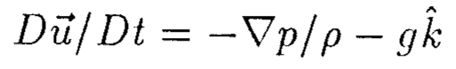](../equations/ch03-p039-e01-source.png) | [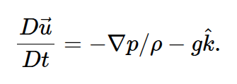](../equations/ch03-p039-e01-mathjax.png) | [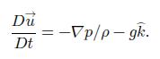](../equations/ch03-p039-e01-mathml.png) |

### p. 39 · display 2 · ch03-p039-e02

Source: [chapter3.tex](../chapter3.tex):36 · display type: `bracket`

#### Markdown math

$$
	\vec\omega=\nabla\times\vec u
$$

<details>
<summary>LaTeX source</summary>

```tex
\[
	\vec\omega=\nabla\times\vec u
\]
```

</details>

| Source PDF | MathJax | MathML |
| --- | --- | --- |
| [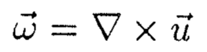](../equations/ch03-p039-e02-source.png) | [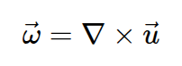](../equations/ch03-p039-e02-mathjax.png) | [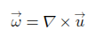](../equations/ch03-p039-e02-mathml.png) |

### p. 39 · display 3 · ch03-p039-e03

Source: [chapter3.tex](../chapter3.tex):40 · display type: `bracket`

#### Markdown math

$$
	\frac{D\vec\omega}{Dt}=(\vec\omega\cdot\nabla)\vec u.
$$

<details>
<summary>LaTeX source</summary>

```tex
\[
	\frac{D\vec\omega}{Dt}=(\vec\omega\cdot\nabla)\vec u.
\]
```

</details>

| Source PDF | MathJax | MathML |
| --- | --- | --- |
| [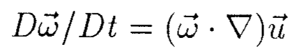](../equations/ch03-p039-e03-source.png) | [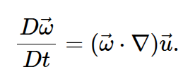](../equations/ch03-p039-e03-mathjax.png) | [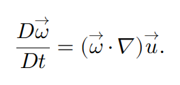](../equations/ch03-p039-e03-mathml.png) |

### p. 39 · display 4 · ch03-p039-e04

Source: [chapter3.tex](../chapter3.tex):47 · display type: `bracket`

#### Markdown math

$$
	\vec u(\vec x,t)=\nabla\phi(\vec x,t).
$$

<details>
<summary>LaTeX source</summary>

```tex
\[
	\vec u(\vec x,t)=\nabla\phi(\vec x,t).
\]
```

</details>

| Source PDF | MathJax | MathML |
| --- | --- | --- |
| [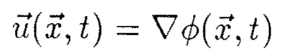](../equations/ch03-p039-e04-source.png) | [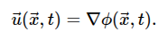](../equations/ch03-p039-e04-mathjax.png) | [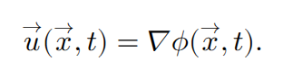](../equations/ch03-p039-e04-mathml.png) |

### p. 39 · display 5 · ch03-p039-e05

Source: [chapter3.tex](../chapter3.tex):51 · display type: `bracket`

#### Markdown math

$$
	\nabla^2\phi=0.
$$

<details>
<summary>LaTeX source</summary>

```tex
\[
	\nabla^2\phi=0.
\]
```

</details>

| Source PDF | MathJax | MathML |
| --- | --- | --- |
| [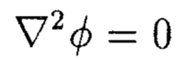](../equations/ch03-p039-e05-source.png) | [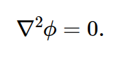](../equations/ch03-p039-e05-mathjax.png) | [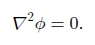](../equations/ch03-p039-e05-mathml.png) |

### p. 39 · display 6 · ch03-p039-e06

Source: [chapter3.tex](../chapter3.tex):57 · display type: `bracket`

#### Markdown math

$$
	\phi_z=0\qquad\text{at}\qquad z=-D.
$$

<details>
<summary>LaTeX source</summary>

```tex
\[
	\phi_z=0\qquad\text{at}\qquad z=-D.
\]
```

</details>

| Source PDF | MathJax | MathML |
| --- | --- | --- |
| [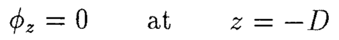](../equations/ch03-p039-e06-source.png) | [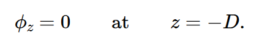](../equations/ch03-p039-e06-mathjax.png) | [](../equations/ch03-p039-e06-mathml.png) |

### p. 40 · display 1 · ch03-p040-e01

Source: [chapter3.tex](../chapter3.tex):71 · display type: `bracket`

#### Markdown math

$$
	w[x,y,\eta(x,y,t),t]=\eta_t+u\eta_x+v\eta_y
	\qquad\text{at}\qquad z=\eta.
$$

<details>
<summary>LaTeX source</summary>

```tex
\[
	w[x,y,\eta(x,y,t),t]=\eta_t+u\eta_x+v\eta_y
	\qquad\text{at}\qquad z=\eta.
\]
```

</details>

| Source PDF | MathJax | MathML |
| --- | --- | --- |
| [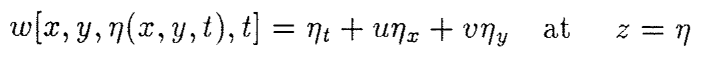](../equations/ch03-p040-e01-source.png) | [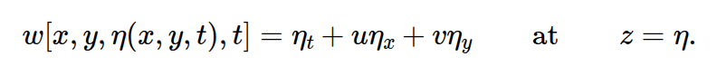](../equations/ch03-p040-e01-mathjax.png) | [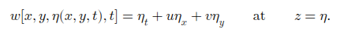](../equations/ch03-p040-e01-mathml.png) |

### p. 40 · display 2 · ch03-p040-e02

Source: [chapter3.tex](../chapter3.tex):76 · display type: `bracket`

#### Markdown math

$$
	\eta_t+\phi_x\eta_x+\phi_y\eta_y=\phi_z
	\qquad\text{at}\qquad z=\eta.
$$

<details>
<summary>LaTeX source</summary>

```tex
\[
	\eta_t+\phi_x\eta_x+\phi_y\eta_y=\phi_z
	\qquad\text{at}\qquad z=\eta.
\]
```

</details>

| Source PDF | MathJax | MathML |
| --- | --- | --- |
| [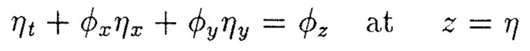](../equations/ch03-p040-e02-source.png) | [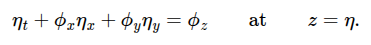](../equations/ch03-p040-e02-mathjax.png) | [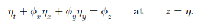](../equations/ch03-p040-e02-mathml.png) |

### p. 40 · display 3 · ch03-p040-e03

Source: [chapter3.tex](../chapter3.tex):86 · display type: `bracket`

#### Markdown math

$$
	p(x,y,\eta,t)=p_{\mathrm{atmosphere}}.
$$

<details>
<summary>LaTeX source</summary>

```tex
\[
	p(x,y,\eta,t)=p_{\mathrm{atmosphere}}.
\]
```

</details>

| Source PDF | MathJax | MathML |
| --- | --- | --- |
| [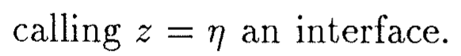](../equations/ch03-p040-e03-source.png) | [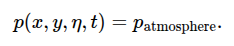](../equations/ch03-p040-e03-mathjax.png) | [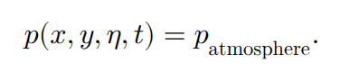](../equations/ch03-p040-e03-mathml.png) |

### p. 40 · display 4 · ch03-p040-e04

Source: [chapter3.tex](../chapter3.tex):90 · display type: `bracket`

#### Markdown math

$$
	\vec u_t+(\vec u\cdot\nabla)\vec u=-\nabla p/\rho-g\hat k.
$$

<details>
<summary>LaTeX source</summary>

```tex
\[
	\vec u_t+(\vec u\cdot\nabla)\vec u=-\nabla p/\rho-g\hat k.
\]
```

</details>

| Source PDF | MathJax | MathML |
| --- | --- | --- |
| [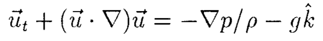](../equations/ch03-p040-e04-source.png) | [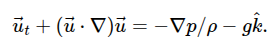](../equations/ch03-p040-e04-mathjax.png) | [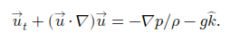](../equations/ch03-p040-e04-mathml.png) |

### p. 40 · display 5 · ch03-p040-e05

Source: [chapter3.tex](../chapter3.tex):94 · display type: `bracket`

#### Markdown math

$$
	(\vec u\cdot\nabla)\vec u=(\nabla\times\vec u)\times\vec u
	+\nabla(\vec u\cdot\vec u/2)
$$

<details>
<summary>LaTeX source</summary>

```tex
\[
	(\vec u\cdot\nabla)\vec u=(\nabla\times\vec u)\times\vec u
	+\nabla(\vec u\cdot\vec u/2)
\]
```

</details>

| Source PDF | MathJax | MathML |
| --- | --- | --- |
| [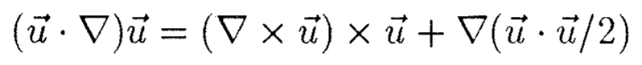](../equations/ch03-p040-e05-source.png) | [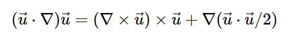](../equations/ch03-p040-e05-mathjax.png) | [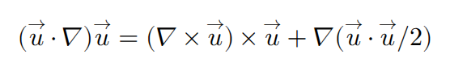](../equations/ch03-p040-e05-mathml.png) |

### p. 40 · display 6 · ch03-p040-e06

Source: [chapter3.tex](../chapter3.tex):99 · display type: `bracket`

#### Markdown math

$$
	\vec u_t+\vec\omega\times\vec u=-\nabla p/\rho
	-\nabla(\vec u\cdot\vec u/2)-\nabla gz.
$$

<details>
<summary>LaTeX source</summary>

```tex
\[
	\vec u_t+\vec\omega\times\vec u=-\nabla p/\rho
	-\nabla(\vec u\cdot\vec u/2)-\nabla gz.
\]
```

</details>

| Source PDF | MathJax | MathML |
| --- | --- | --- |
| [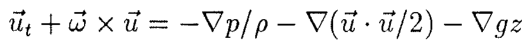](../equations/ch03-p040-e06-source.png) | [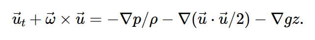](../equations/ch03-p040-e06-mathjax.png) | [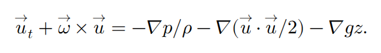](../equations/ch03-p040-e06-mathml.png) |

### p. 40 · display 7 · ch03-p040-e07

Source: [chapter3.tex](../chapter3.tex):104 · display type: `bracket`

#### Markdown math

$$
	\nabla\left(\phi_t+p/\rho+\frac12|\nabla\phi|^2+gz\right)=0
$$

<details>
<summary>LaTeX source</summary>

```tex
\[
	\nabla\left(\phi_t+p/\rho+\frac12|\nabla\phi|^2+gz\right)=0
\]
```

</details>

| Source PDF | MathJax | MathML |
| --- | --- | --- |
| [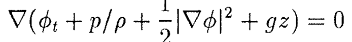](../equations/ch03-p040-e07-source.png) | [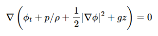](../equations/ch03-p040-e07-mathjax.png) | [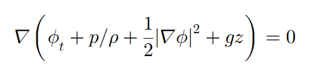](../equations/ch03-p040-e07-mathml.png) |

### p. 40 · display 8 · ch03-p040-e08

Source: [chapter3.tex](../chapter3.tex):107 · display type: `bracket`

#### Markdown math

$$
	\phi_t+p/\rho+gz+\frac12|\nabla\phi|^2=f(t).
$$

<details>
<summary>LaTeX source</summary>

```tex
\[
	\phi_t+p/\rho+gz+\frac12|\nabla\phi|^2=f(t).
\]
```

</details>

| Source PDF | MathJax | MathML |
| --- | --- | --- |
| [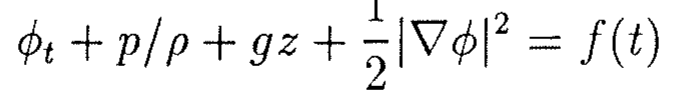](../equations/ch03-p040-e08-source.png) | [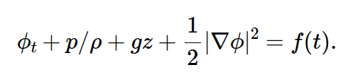](../equations/ch03-p040-e08-mathjax.png) | [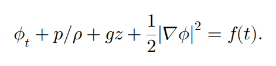](../equations/ch03-p040-e08-mathml.png) |

### p. 41 · display 1 · ch03-p041-e01

Source: [chapter3.tex](../chapter3.tex):117 · display type: `bracket`

#### Markdown math

$$
	\phi_t+\frac12|\nabla\phi|^2+g\eta=f(t)-p_{atm}/\rho.
$$

<details>
<summary>LaTeX source</summary>

```tex
\[
	\phi_t+\frac12|\nabla\phi|^2+g\eta=f(t)-p_{atm}/\rho.
\]
```

</details>

| Source PDF | MathJax | MathML |
| --- | --- | --- |
| [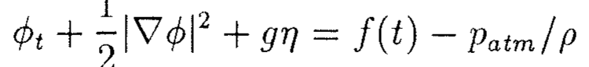](../equations/ch03-p041-e01-source.png) | [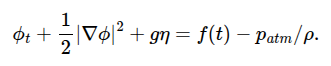](../equations/ch03-p041-e01-mathjax.png) | [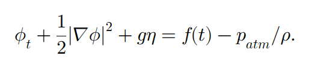](../equations/ch03-p041-e01-mathml.png) |

### p. 41 · display 2 · ch03-p041-e02

Source: [chapter3.tex](../chapter3.tex):123 · display type: `bracket`

#### Markdown math

$$
	\phi_t+\frac12|\nabla\phi|^2+g\eta=0
	\qquad\text{at}\qquad z=\eta.
$$

<details>
<summary>LaTeX source</summary>

```tex
\[
	\phi_t+\frac12|\nabla\phi|^2+g\eta=0
	\qquad\text{at}\qquad z=\eta.
\]
```

</details>

| Source PDF | MathJax | MathML |
| --- | --- | --- |
| [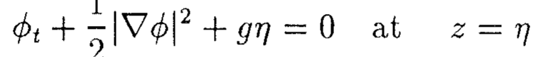](../equations/ch03-p041-e02-source.png) | [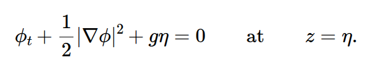](../equations/ch03-p041-e02-mathjax.png) | [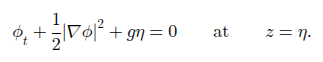](../equations/ch03-p041-e02-mathml.png) |

### p. 41 · display 3 · ch03-p041-e03

Source: [chapter3.tex](../chapter3.tex):131 · display type: `wavealign`

#### Markdown math

$$
\begin{aligned}
	\eta_t+\phi_x\eta_x+\phi_y\eta_y&=\phi_z &&\text{at }z=\eta,\\
	\phi_t+\frac12|\nabla\phi|^2+g\eta&=0 &&\text{at }z=\eta,\\
	\nabla^2\phi&=0,\\
	\phi_z&=0 &&\text{at }z=-D.
\end{aligned}
$$

<details>
<summary>LaTeX source</summary>

```tex
\begin{wavealign}
	\eta_t+\phi_x\eta_x+\phi_y\eta_y&=\phi_z &&\text{at }z=\eta,\\
	\phi_t+\frac12|\nabla\phi|^2+g\eta&=0 &&\text{at }z=\eta,\\
	\nabla^2\phi&=0,\\
	\phi_z&=0 &&\text{at }z=-D.
\end{wavealign}
```

</details>

| Source PDF | MathJax | MathML |
| --- | --- | --- |
| [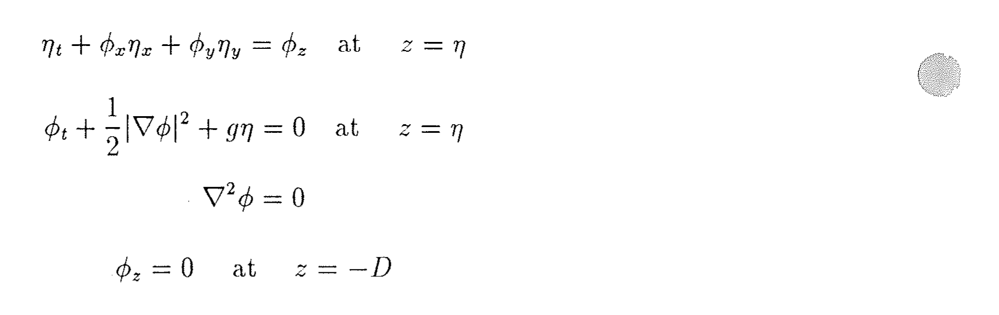](../equations/ch03-p041-e03-source.png) | [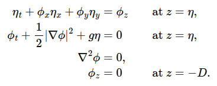](../equations/ch03-p041-e03-mathjax.png) | [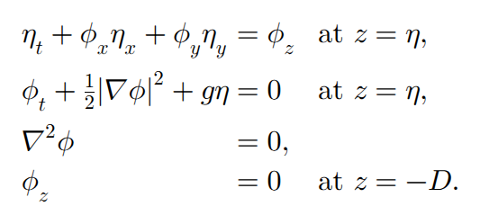](../equations/ch03-p041-e03-mathml.png) |

### p. 41 · display 4 · ch03-p041-e04

Source: [chapter3.tex](../chapter3.tex):143 · display type: `bracket`

#### Markdown math

$$
	\eta_t=\phi_z\qquad\text{at}\qquad z=0
$$

<details>
<summary>LaTeX source</summary>

```tex
\[
	\eta_t=\phi_z\qquad\text{at}\qquad z=0
\]
```

</details>

| Source PDF | MathJax | MathML |
| --- | --- | --- |
| [](../equations/ch03-p041-e04-source.png) | [](../equations/ch03-p041-e04-mathjax.png) | [](../equations/ch03-p041-e04-mathml.png) |

### p. 41 · display 5 · ch03-p041-e05

Source: [chapter3.tex](../chapter3.tex):146 · display type: `bracket`

#### Markdown math

$$
	\phi_t+g\eta=0\qquad\text{at}\qquad z=0
$$

<details>
<summary>LaTeX source</summary>

```tex
\[
	\phi_t+g\eta=0\qquad\text{at}\qquad z=0
\]
```

</details>

| Source PDF | MathJax | MathML |
| --- | --- | --- |
| [](../equations/ch03-p041-e05-source.png) | [](../equations/ch03-p041-e05-mathjax.png) | [](../equations/ch03-p041-e05-mathml.png) |

### p. 42 · display 1 · ch03-p042-e01

Source: [chapter3.tex](../chapter3.tex):155 · display type: `bracket`

#### Markdown math

$$
	\nabla^2\phi=0
$$

<details>
<summary>LaTeX source</summary>

```tex
\[
	\nabla^2\phi=0
\]
```

</details>

| Source PDF | MathJax | MathML |
| --- | --- | --- |
| [](../equations/ch03-p042-e01-source.png) | [](../equations/ch03-p042-e01-mathjax.png) | [](../equations/ch03-p042-e01-mathml.png) |

### p. 42 · display 2 · ch03-p042-e02

Source: [chapter3.tex](../chapter3.tex):158 · display type: `bracket`

#### Markdown math

$$
	\phi_z=0\qquad\text{at}\qquad z=-D.
$$

<details>
<summary>LaTeX source</summary>

```tex
\[
	\phi_z=0\qquad\text{at}\qquad z=-D.
\]
```

</details>

| Source PDF | MathJax | MathML |
| --- | --- | --- |
| [](../equations/ch03-p042-e02-source.png) | [](../equations/ch03-p042-e02-mathjax.png) | [](../equations/ch03-p042-e02-mathml.png) |

### p. 42 · display 3 · ch03-p042-e03

Source: [chapter3.tex](../chapter3.tex):167 · display type: `bracket`

#### Markdown math

$$
	\phi_{tt}+g\phi_z=0\qquad\text{at}\qquad z=0.
$$

<details>
<summary>LaTeX source</summary>

```tex
\[
	\phi_{tt}+g\phi_z=0\qquad\text{at}\qquad z=0.
\]
```

</details>

| Source PDF | MathJax | MathML |
| --- | --- | --- |
| [](../equations/ch03-p042-e03-source.png) | [](../equations/ch03-p042-e03-mathjax.png) | [](../equations/ch03-p042-e03-mathml.png) |

### p. 42 · display 4 · ch03-p042-e04

Source: [chapter3.tex](../chapter3.tex):171 · display type: `bracket`

#### Markdown math

$$
	\phi=Ae^{-i\sigma t+ikx}\cosh k(z+D)
$$

<details>
<summary>LaTeX source</summary>

```tex
\[
	\phi=Ae^{-i\sigma t+ikx}\cosh k(z+D)
\]
```

</details>

| Source PDF | MathJax | MathML |
| --- | --- | --- |
| [](../equations/ch03-p042-e04-source.png) | [](../equations/ch03-p042-e04-mathjax.png) | [](../equations/ch03-p042-e04-mathml.png) |

### p. 42 · display 5 · ch03-p042-e05

Source: [chapter3.tex](../chapter3.tex):175 · display type: `waveequation`

#### Markdown math

$$
	\sigma^2=gk\tanh kD
$$

<details>
<summary>LaTeX source</summary>

```tex
\begin{waveequation}
	\sigma^2=gk\tanh kD
\end{waveequation}
```

</details>

| Source PDF | MathJax | MathML |
| --- | --- | --- |
| [](../equations/ch03-p042-e05-source.png) | [](../equations/ch03-p042-e05-mathjax.png) | [](../equations/ch03-p042-e05-mathml.png) |

### p. 42 · display 6 · ch03-p042-e06

Source: [chapter3.tex](../chapter3.tex):185 · display type: `bracket`

#### Markdown math

$$
	A=-ia\sigma/(k\sinh kD)=-iag/(\sigma\cosh kD).
$$

<details>
<summary>LaTeX source</summary>

```tex
\[
	A=-ia\sigma/(k\sinh kD)=-iag/(\sigma\cosh kD).
\]
```

</details>

| Source PDF | MathJax | MathML |
| --- | --- | --- |
| [](../equations/ch03-p042-e06-source.png) | [](../equations/ch03-p042-e06-mathjax.png) | [](../equations/ch03-p042-e06-mathml.png) |

### p. 43 · display 1 · ch03-p043-e01

Source: [chapter3.tex](../chapter3.tex):197 · display type: `align*`

#### Markdown math

$$
\begin{aligned}
	\eta     & =a\cos(kx-\sigma t),                                                    \\
	\phi     & =\frac{a\sigma}{k\sinh kD}\cosh k(z+D)\sin(kx-\sigma t),                \\
	u        & =\phi_x=\frac{a\sigma}{\sinh kD}\cosh k(z+D)\cos(kx-\sigma t),          \\
	w        & =\phi_z=\frac{a\sigma}{\sinh kD}\sinh k(z+D)\sin(kx-\sigma t),          \\
	p        & =-\rho gz+\frac{\rho\sigma^2a}{k\sinh kD}\cosh k(z+D)\cos(kx-\sigma t), \\
	\sigma^2 & =gk\tanh kD.
\end{aligned}
$$

<details>
<summary>LaTeX source</summary>

```tex
\begin{align*}
	\eta     & =a\cos(kx-\sigma t),                                                    \\
	\phi     & =\frac{a\sigma}{k\sinh kD}\cosh k(z+D)\sin(kx-\sigma t),                \\
	u        & =\phi_x=\frac{a\sigma}{\sinh kD}\cosh k(z+D)\cos(kx-\sigma t),          \\
	w        & =\phi_z=\frac{a\sigma}{\sinh kD}\sinh k(z+D)\sin(kx-\sigma t),          \\
	p        & =-\rho gz+\frac{\rho\sigma^2a}{k\sinh kD}\cosh k(z+D)\cos(kx-\sigma t), \\
	\sigma^2 & =gk\tanh kD.
\end{align*}
```

</details>

| Source PDF | MathJax | MathML |
| --- | --- | --- |
| [](../equations/ch03-p043-e01-source.png) | [](../equations/ch03-p043-e01-mathjax.png) | [](../equations/ch03-p043-e01-mathml.png) |

### p. 43 · display 2 · ch03-p043-e02

Source: [chapter3.tex](../chapter3.tex):211 · display type: `align*`

#### Markdown math

$$
\begin{aligned}
	\eta     & =a\cos(kx-\sigma t),                       \\
	\phi     & =\frac{a\sigma}{k}e^{kz}\sin(kx-\sigma t), \\
	\sigma^2 & =gk.
\end{aligned}
$$

<details>
<summary>LaTeX source</summary>

```tex
\begin{align*}
	\eta     & =a\cos(kx-\sigma t),                       \\
	\phi     & =\frac{a\sigma}{k}e^{kz}\sin(kx-\sigma t), \\
	\sigma^2 & =gk.
\end{align*}
```

</details>

| Source PDF | MathJax | MathML |
| --- | --- | --- |
| [](../equations/ch03-p043-e02-source.png) | [](../equations/ch03-p043-e02-mathjax.png) | [](../equations/ch03-p043-e02-mathml.png) |

### p. 44 · display 1 · ch03-p044-e01

Source: [chapter3.tex](../chapter3.tex):233 · display type: `bracket`

#### Markdown math

$$
	\eta_t=\phi_{1z}\ ;\qquad \eta_t=\phi_{2z}
$$

<details>
<summary>LaTeX source</summary>

```tex
\[
	\eta_t=\phi_{1z}\ ;\qquad \eta_t=\phi_{2z}
\]
```

</details>

| Source PDF | MathJax | MathML |
| --- | --- | --- |
| [](../equations/ch03-p044-e01-source.png) | [](../equations/ch03-p044-e01-mathjax.png) | [](../equations/ch03-p044-e01-mathml.png) |

### p. 44 · display 2 · ch03-p044-e02

Source: [chapter3.tex](../chapter3.tex):236 · display type: `bracket`

#### Markdown math

$$
	\rho_1(\phi_{1t}+g\eta)=\rho_2(\phi_{2t}+g\eta).
$$

<details>
<summary>LaTeX source</summary>

```tex
\[
	\rho_1(\phi_{1t}+g\eta)=\rho_2(\phi_{2t}+g\eta).
\]
```

</details>

| Source PDF | MathJax | MathML |
| --- | --- | --- |
| [](../equations/ch03-p044-e02-source.png) | [](../equations/ch03-p044-e02-mathjax.png) | [](../equations/ch03-p044-e02-mathml.png) |

### p. 44 · display 3 · ch03-p044-e03

Source: [chapter3.tex](../chapter3.tex):240 · display type: `align*`

#### Markdown math

$$
\begin{aligned}
	\phi_1 & =A_1e^{-i\sigma t+ikx-kz}, \\
	\phi_2 & =A_2e^{-i\sigma t+ikx+kz}, \\
	\eta   & =ae^{-i\sigma t+ikx}.
\end{aligned}
$$

<details>
<summary>LaTeX source</summary>

```tex
\begin{align*}
	\phi_1 & =A_1e^{-i\sigma t+ikx-kz}, \\
	\phi_2 & =A_2e^{-i\sigma t+ikx+kz}, \\
	\eta   & =ae^{-i\sigma t+ikx}.
\end{align*}
```

</details>

| Source PDF | MathJax | MathML |
| --- | --- | --- |
| [](../equations/ch03-p044-e03-source.png) | [](../equations/ch03-p044-e03-mathjax.png) | [](../equations/ch03-p044-e03-mathml.png) |

### p. 44 · display 4 · ch03-p044-e04

Source: [chapter3.tex](../chapter3.tex):246 · display type: `bracket`

#### Markdown math

$$
	-i\sigma a=-kA_1\ ;\qquad -i\sigma a=kA_2\ ;\qquad
	\rho_1(-i\sigma A_1+ga)=\rho_2(-i\sigma A_2+ga)
$$

<details>
<summary>LaTeX source</summary>

```tex
\[
	-i\sigma a=-kA_1\ ;\qquad -i\sigma a=kA_2\ ;\qquad
	\rho_1(-i\sigma A_1+ga)=\rho_2(-i\sigma A_2+ga)
\]
```

</details>

| Source PDF | MathJax | MathML |
| --- | --- | --- |
| [](../equations/ch03-p044-e04-source.png) | [](../equations/ch03-p044-e04-mathjax.png) | [](../equations/ch03-p044-e04-mathml.png) |

### p. 44 · display 5 · ch03-p044-e05

Source: [chapter3.tex](../chapter3.tex):251 · display type: `bracket`

#### Markdown math

$$
	A_1=i a\sigma/k\ ;\qquad A_2=-i a\sigma/k\ ;\qquad
	\rho_1(\sigma^2/k+g)=\rho_2(-\sigma^2/k+g).
$$

<details>
<summary>LaTeX source</summary>

```tex
\[
	A_1=i a\sigma/k\ ;\qquad A_2=-i a\sigma/k\ ;\qquad
	\rho_1(\sigma^2/k+g)=\rho_2(-\sigma^2/k+g).
\]
```

</details>

| Source PDF | MathJax | MathML |
| --- | --- | --- |
| [](../equations/ch03-p044-e05-source.png) | [](../equations/ch03-p044-e05-mathjax.png) | [](../equations/ch03-p044-e05-mathml.png) |

### p. 44 · display 6 · ch03-p044-e06

Source: [chapter3.tex](../chapter3.tex):256 · display type: `waveequation`

#### Markdown math

$$
	\sigma^2=gk\frac{\rho_2-\rho_1}{\rho_2+\rho_1}.
$$

<details>
<summary>LaTeX source</summary>

```tex
\begin{waveequation}
	\sigma^2=gk\frac{\rho_2-\rho_1}{\rho_2+\rho_1}.
\end{waveequation}
```

</details>

| Source PDF | MathJax | MathML |
| --- | --- | --- |
| [](../equations/ch03-p044-e06-source.png) | [](../equations/ch03-p044-e06-mathjax.png) | [](../equations/ch03-p044-e06-mathml.png) |

### p. 45 · display 1 · ch03-p045-e01

Source: [chapter3.tex](../chapter3.tex):286 · display type: `bracket`

#### Markdown math

$$
	u_t=-p_x/\rho\ ;\qquad w_t=-p_z/\rho\ ;\qquad u_x+w_z=0.
$$

<details>
<summary>LaTeX source</summary>

```tex
\[
	u_t=-p_x/\rho\ ;\qquad w_t=-p_z/\rho\ ;\qquad u_x+w_z=0.
\]
```

</details>

| Source PDF | MathJax | MathML |
| --- | --- | --- |
| [](../equations/ch03-p045-e01-source.png) | [](../equations/ch03-p045-e01-mathjax.png) | [](../equations/ch03-p045-e01-mathml.png) |

### p. 46 · display 1 · ch03-p046-e01

Source: [chapter3.tex](../chapter3.tex):315 · display type: `bracket`

#### Markdown math

$$
	\left.\phi_t\right|_{z=\eta}
	=\left.\phi_t\right|_{z=0}+\left.\eta\phi_{tz}\right|_{z=0}+\cdots
$$

<details>
<summary>LaTeX source</summary>

```tex
\[
	\left.\phi_t\right|_{z=\eta}
	=\left.\phi_t\right|_{z=0}+\left.\eta\phi_{tz}\right|_{z=0}+\cdots
\]
```

</details>

| Source PDF | MathJax | MathML |
| --- | --- | --- |
| [](../equations/ch03-p046-e01-source.png) | [](../equations/ch03-p046-e01-mathjax.png) | [](../equations/ch03-p046-e01-mathml.png) |

### p. 46 · display 2 · ch03-p046-e02

Source: [chapter3.tex](../chapter3.tex):319 · display type: `bracket`

#### Markdown math

$$
	=\left[-i\sigma A+a(-i\sigma kA)e^{-i\sigma t+ikx}\right]e^{-i\sigma t+ikx}+\cdots
$$

<details>
<summary>LaTeX source</summary>

```tex
\[
	=\left[-i\sigma A+a(-i\sigma kA)e^{-i\sigma t+ikx}\right]e^{-i\sigma t+ikx}+\cdots
\]
```

</details>

| Source PDF | MathJax | MathML |
| --- | --- | --- |
| [](../equations/ch03-p046-e02-source.png) | [](../equations/ch03-p046-e02-mathjax.png) | [](../equations/ch03-p046-e02-mathml.png) |

### p. 46 · display 3 · ch03-p046-e03

Source: [chapter3.tex](../chapter3.tex):329 · display type: `bracket`

#### Markdown math

$$
	u_t=-p_x^*/\rho\ ;\qquad w_t=-p_z^*/\rho-g\ ;\qquad u_x+w_z=0.
$$

<details>
<summary>LaTeX source</summary>

```tex
\[
	u_t=-p_x^*/\rho\ ;\qquad w_t=-p_z^*/\rho-g\ ;\qquad u_x+w_z=0.
\]
```

</details>

| Source PDF | MathJax | MathML |
| --- | --- | --- |
| [](../equations/ch03-p046-e03-source.png) | [](../equations/ch03-p046-e03-mathjax.png) | [](../equations/ch03-p046-e03-mathml.png) |

### p. 46 · display 4 · ch03-p046-e04

Source: [chapter3.tex](../chapter3.tex):336 · display type: `bracket`

#### Markdown math

$$
	u_t=-g\eta_x.
$$

<details>
<summary>LaTeX source</summary>

```tex
\[
	u_t=-g\eta_x.
\]
```

</details>

| Source PDF | MathJax | MathML |
| --- | --- | --- |
| [](../equations/ch03-p046-e04-source.png) | [](../equations/ch03-p046-e04-mathjax.png) | [](../equations/ch03-p046-e04-mathml.png) |

### p. 47 · display 1 · ch03-p047-e01

Source: [chapter3.tex](../chapter3.tex):348 · display type: `bracket`

#### Markdown math

$$
	\int_{-D}^{\eta}(w_z+u_x)\,dz=0
$$

<details>
<summary>LaTeX source</summary>

```tex
\[
	\int_{-D}^{\eta}(w_z+u_x)\,dz=0
\]
```

</details>

| Source PDF | MathJax | MathML |
| --- | --- | --- |
| [](../equations/ch03-p047-e01-source.png) | [](../equations/ch03-p047-e01-mathjax.png) | [](../equations/ch03-p047-e01-mathml.png) |

### p. 47 · display 2 · ch03-p047-e02

Source: [chapter3.tex](../chapter3.tex):351 · display type: `bracket`

#### Markdown math

$$
	\eta_t+u\eta_x+\int_{-D}^{\eta}u_x\,dz=0
$$

<details>
<summary>LaTeX source</summary>

```tex
\[
	\eta_t+u\eta_x+\int_{-D}^{\eta}u_x\,dz=0
\]
```

</details>

| Source PDF | MathJax | MathML |
| --- | --- | --- |
| [](../equations/ch03-p047-e02-source.png) | [](../equations/ch03-p047-e02-mathjax.png) | [](../equations/ch03-p047-e02-mathml.png) |

### p. 47 · display 3 · ch03-p047-e03

Source: [chapter3.tex](../chapter3.tex):354 · display type: `bracket`

#### Markdown math

$$
	\eta_t+[u(\eta+D)]_x=0.
$$

<details>
<summary>LaTeX source</summary>

```tex
\[
	\eta_t+[u(\eta+D)]_x=0.
\]
```

</details>

| Source PDF | MathJax | MathML |
| --- | --- | --- |
| [](../equations/ch03-p047-e03-source.png) | [](../equations/ch03-p047-e03-mathjax.png) | [](../equations/ch03-p047-e03-mathml.png) |

### p. 47 · display 4 · ch03-p047-e04

Source: [chapter3.tex](../chapter3.tex):358 · display type: `bracket`

#### Markdown math

$$
	\eta_t+Du_x=0
$$

<details>
<summary>LaTeX source</summary>

```tex
\[
	\eta_t+Du_x=0
\]
```

</details>

| Source PDF | MathJax | MathML |
| --- | --- | --- |
| [](../equations/ch03-p047-e04-source.png) | [](../equations/ch03-p047-e04-mathjax.png) | [](../equations/ch03-p047-e04-mathml.png) |

### p. 47 · display 5 · ch03-p047-e05

Source: [chapter3.tex](../chapter3.tex):363 · display type: `bracket`

#### Markdown math

$$
	\eta_{tt}-gD\eta_{xx}=0
$$

<details>
<summary>LaTeX source</summary>

```tex
\[
	\eta_{tt}-gD\eta_{xx}=0
\]
```

</details>

| Source PDF | MathJax | MathML |
| --- | --- | --- |
| [](../equations/ch03-p047-e05-source.png) | [](../equations/ch03-p047-e05-mathjax.png) | [](../equations/ch03-p047-e05-mathml.png) |

### p. 47 · display 6 · ch03-p047-e06

Source: [chapter3.tex](../chapter3.tex):368 · display type: `align*`

#### Markdown math

$$
\begin{aligned}
	u   & =\frac{gak}{\sigma}e^{-i\sigma t+ikx},          \\
	w   & =\frac{-igak^2}{\sigma}(z+D)e^{-i\sigma t+ikx}, \\
	p^* & =g\rho(\eta-z).
\end{aligned}
$$

<details>
<summary>LaTeX source</summary>

```tex
\begin{align*}
	u   & =\frac{gak}{\sigma}e^{-i\sigma t+ikx},          \\
	w   & =\frac{-igak^2}{\sigma}(z+D)e^{-i\sigma t+ikx}, \\
	p^* & =g\rho(\eta-z).
\end{align*}
```

</details>

| Source PDF | MathJax | MathML |
| --- | --- | --- |
| [](../equations/ch03-p047-e06-source.png) | [](../equations/ch03-p047-e06-mathjax.png) | [](../equations/ch03-p047-e06-mathml.png) |

### p. 48 · display 1 · ch03-p048-e01

Source: [chapter3.tex](../chapter3.tex):387 · display type: `align*`

#### Markdown math

$$
\begin{aligned}
	\phi_t+g\eta+\frac12(\phi_x^2+\phi_y^2+\phi_z^2) & =0      &  & \text{at }z=\eta, \\
	\eta_t+(\phi_x\eta_x+\phi_y\eta_y)               & =\phi_z &  & \text{at }z=\eta, \\
	\nabla^2\phi                                     & =0,                            \\
	\phi_z                                           & =0      &  & \text{at }z=-D.
\end{aligned}
$$

<details>
<summary>LaTeX source</summary>

```tex
\begin{align*}
	\phi_t+g\eta+\frac12(\phi_x^2+\phi_y^2+\phi_z^2) & =0      &  & \text{at }z=\eta, \\
	\eta_t+(\phi_x\eta_x+\phi_y\eta_y)               & =\phi_z &  & \text{at }z=\eta, \\
	\nabla^2\phi                                     & =0,                            \\
	\phi_z                                           & =0      &  & \text{at }z=-D.
\end{align*}
```

</details>

| Source PDF | MathJax | MathML |
| --- | --- | --- |
| [](../equations/ch03-p048-e01-source.png) | [](../equations/ch03-p048-e01-mathjax.png) | [](../equations/ch03-p048-e01-mathml.png) |

### p. 48 · display 2 · ch03-p048-e02

Source: [chapter3.tex](../chapter3.tex):394 · display type: `bracket`

#### Markdown math

$$
	\begin{array}{ccl}
		\text{dimensional} &   & \text{dimensionless}                                         \\[2pt]
		(x,y)              & = & (x,y)L,                                                      \\
		z                  & = & zD,                                                          \\
		t                  & = & tL/(gD)^{1/2},                                               \\
		\eta               & = & \eta a,                                                      \\
		\phi               & = & \phi\,gaL/(gD)^{1/2}\qquad(\text{from }\phi_t+g\eta\simeq0).
	\end{array}
$$

<details>
<summary>LaTeX source</summary>

```tex
\[
	\begin{array}{ccl}
		\text{dimensional} &   & \text{dimensionless}                                         \\[2pt]
		(x,y)              & = & (x,y)L,                                                      \\
		z                  & = & zD,                                                          \\
		t                  & = & tL/(gD)^{1/2},                                               \\
		\eta               & = & \eta a,                                                      \\
		\phi               & = & \phi\,gaL/(gD)^{1/2}\qquad(\text{from }\phi_t+g\eta\simeq0).
	\end{array}
\]
```

</details>

| Source PDF | MathJax | MathML |
| --- | --- | --- |
| [](../equations/ch03-p048-e02-source.png) | [](../equations/ch03-p048-e02-mathjax.png) | [](../equations/ch03-p048-e02-mathml.png) |

### p. 48 · display 3 · ch03-p048-e03

Source: [chapter3.tex](../chapter3.tex):405 · display type: `bracket`

#### Markdown math

$$
	\eta_t+\phi_x\eta_x=\phi_z
$$

<details>
<summary>LaTeX source</summary>

```tex
\[
	\eta_t+\phi_x\eta_x=\phi_z
\]
```

</details>

| Source PDF | MathJax | MathML |
| --- | --- | --- |
| [](../equations/ch03-p048-e03-source.png) | [](../equations/ch03-p048-e03-mathjax.png) | [](../equations/ch03-p048-e03-mathml.png) |

### p. 48 · display 4 · ch03-p048-e04

Source: [chapter3.tex](../chapter3.tex):409 · display type: `bracket`

#### Markdown math

$$
	\frac{a(gD)^{1/2}}{L}\eta_t
	+\frac{gaL}{(gD)^{1/2}}\frac{a}{L^2}\phi_x\eta_x
	=\frac{gaL}{D(gD)^{1/2}}\phi_z
$$

<details>
<summary>LaTeX source</summary>

```tex
\[
	\frac{a(gD)^{1/2}}{L}\eta_t
	+\frac{gaL}{(gD)^{1/2}}\frac{a}{L^2}\phi_x\eta_x
	=\frac{gaL}{D(gD)^{1/2}}\phi_z
\]
```

</details>

| Source PDF | MathJax | MathML |
| --- | --- | --- |
| [](../equations/ch03-p048-e04-source.png) | [](../equations/ch03-p048-e04-mathjax.png) | [](../equations/ch03-p048-e04-mathml.png) |

### p. 48 · display 5 · ch03-p048-e05

Source: [chapter3.tex](../chapter3.tex):414 · display type: `bracket`

#### Markdown math

$$
	\eta_t+(a/D)\phi_x\eta_x=(L/D)^2\phi_z
	\qquad\text{at}\qquad z=(a/D)\eta.
$$

<details>
<summary>LaTeX source</summary>

```tex
\[
	\eta_t+(a/D)\phi_x\eta_x=(L/D)^2\phi_z
	\qquad\text{at}\qquad z=(a/D)\eta.
\]
```

</details>

| Source PDF | MathJax | MathML |
| --- | --- | --- |
| [](../equations/ch03-p048-e05-source.png) | [](../equations/ch03-p048-e05-mathjax.png) | [](../equations/ch03-p048-e05-mathml.png) |

### p. 48 · display 6 · ch03-p048-e06

Source: [chapter3.tex](../chapter3.tex):419 · display type: `bracket`

#### Markdown math

$$
	\epsilon=a/D\ ;\qquad \delta=D/L
$$

<details>
<summary>LaTeX source</summary>

```tex
\[
	\epsilon=a/D\ ;\qquad \delta=D/L
\]
```

</details>

| Source PDF | MathJax | MathML |
| --- | --- | --- |
| [](../equations/ch03-p048-e06-source.png) | [](../equations/ch03-p048-e06-mathjax.png) | [](../equations/ch03-p048-e06-mathml.png) |

### p. 48 · display 7 · ch03-p048-e07

Source: [chapter3.tex](../chapter3.tex):425 · display type: `bracket`

#### Markdown math

$$
	\phi_t+\frac{\epsilon}{2}(\phi_x^2+\phi_y^2)
	+\frac{\epsilon\delta^{-2}}{2}\phi_z^2+\eta=0
	\qquad\text{at}\qquad z=\epsilon\eta
$$

<details>
<summary>LaTeX source</summary>

```tex
\[
	\phi_t+\frac{\epsilon}{2}(\phi_x^2+\phi_y^2)
	+\frac{\epsilon\delta^{-2}}{2}\phi_z^2+\eta=0
	\qquad\text{at}\qquad z=\epsilon\eta
\]
```

</details>

| Source PDF | MathJax | MathML |
| --- | --- | --- |
| [](../equations/ch03-p048-e07-source.png) | [](../equations/ch03-p048-e07-mathjax.png) | [](../equations/ch03-p048-e07-mathml.png) |

### p. 49 · display 1 · ch03-p049-e01

Source: [chapter3.tex](../chapter3.tex):436 · display type: `bracket`

#### Markdown math

$$
	\eta_t+\epsilon(\eta_x\phi_x+\phi_y\eta_y)=\delta^{-2}\phi_z
	\qquad\text{at}\qquad z=\epsilon\eta
$$

<details>
<summary>LaTeX source</summary>

```tex
\[
	\eta_t+\epsilon(\eta_x\phi_x+\phi_y\eta_y)=\delta^{-2}\phi_z
	\qquad\text{at}\qquad z=\epsilon\eta
\]
```

</details>

| Source PDF | MathJax | MathML |
| --- | --- | --- |
| [](../equations/ch03-p049-e01-source.png) | [](../equations/ch03-p049-e01-mathjax.png) | [](../equations/ch03-p049-e01-mathml.png) |

### p. 49 · display 2 · ch03-p049-e02

Source: [chapter3.tex](../chapter3.tex):440 · display type: `bracket`

#### Markdown math

$$
	\phi_{zz}+\delta^2(\phi_{xx}+\phi_{yy})=0
$$

<details>
<summary>LaTeX source</summary>

```tex
\[
	\phi_{zz}+\delta^2(\phi_{xx}+\phi_{yy})=0
\]
```

</details>

| Source PDF | MathJax | MathML |
| --- | --- | --- |
| [](../equations/ch03-p049-e02-source.png) | [](../equations/ch03-p049-e02-mathjax.png) | [](../equations/ch03-p049-e02-mathml.png) |

### p. 49 · display 3 · ch03-p049-e03

Source: [chapter3.tex](../chapter3.tex):443 · display type: `bracket`

#### Markdown math

$$
	\phi_z=0\qquad\text{at}\qquad z=-1.
$$

<details>
<summary>LaTeX source</summary>

```tex
\[
	\phi_z=0\qquad\text{at}\qquad z=-1.
\]
```

</details>

| Source PDF | MathJax | MathML |
| --- | --- | --- |
| [](../equations/ch03-p049-e03-source.png) | [](../equations/ch03-p049-e03-mathjax.png) | [](../equations/ch03-p049-e03-mathml.png) |

### p. 49 · display 4 · ch03-p049-e04

Source: [chapter3.tex](../chapter3.tex):448 · display type: `bracket`

#### Markdown math

$$
	\phi_t+\eta=0\ ;\qquad \eta_t=\phi_z\qquad\text{at}\qquad z=0
$$

<details>
<summary>LaTeX source</summary>

```tex
\[
	\phi_t+\eta=0\ ;\qquad \eta_t=\phi_z\qquad\text{at}\qquad z=0
\]
```

</details>

| Source PDF | MathJax | MathML |
| --- | --- | --- |
| [](../equations/ch03-p049-e04-source.png) | [](../equations/ch03-p049-e04-mathjax.png) | [](../equations/ch03-p049-e04-mathml.png) |

### p. 49 · display 5 · ch03-p049-e05

Source: [chapter3.tex](../chapter3.tex):451 · display type: `bracket`

#### Markdown math

$$
	\nabla^2\phi=0
$$

<details>
<summary>LaTeX source</summary>

```tex
\[
	\nabla^2\phi=0
\]
```

</details>

| Source PDF | MathJax | MathML |
| --- | --- | --- |
| [](../equations/ch03-p049-e05-source.png) | [](../equations/ch03-p049-e05-mathjax.png) | [](../equations/ch03-p049-e05-mathml.png) |

### p. 49 · display 6 · ch03-p049-e06

Source: [chapter3.tex](../chapter3.tex):454 · display type: `bracket`

#### Markdown math

$$
	\phi_z=0\qquad\text{at}\qquad z=-1
$$

<details>
<summary>LaTeX source</summary>

```tex
\[
	\phi_z=0\qquad\text{at}\qquad z=-1
\]
```

</details>

| Source PDF | MathJax | MathML |
| --- | --- | --- |
| [](../equations/ch03-p049-e06-source.png) | [](../equations/ch03-p049-e06-mathjax.png) | [](../equations/ch03-p049-e06-mathml.png) |

### p. 49 · display 7 · ch03-p049-e07

Source: [chapter3.tex](../chapter3.tex):463 · display type: `bracket`

#### Markdown math

$$
	\delta^{(0)}:\qquad \phi_{0zz}=0\ ;\qquad \phi_{0z}=0\qquad\text{at}\qquad z=-1
$$

<details>
<summary>LaTeX source</summary>

```tex
\[
	\delta^{(0)}:\qquad \phi_{0zz}=0\ ;\qquad \phi_{0z}=0\qquad\text{at}\qquad z=-1
\]
```

</details>

| Source PDF | MathJax | MathML |
| --- | --- | --- |
| [](../equations/ch03-p049-e07-source.png) | [](../equations/ch03-p049-e07-mathjax.png) | [](../equations/ch03-p049-e07-mathml.png) |

### p. 49 · display 8 · ch03-p049-e08

Source: [chapter3.tex](../chapter3.tex):467 · display type: `bracket`

#### Markdown math

$$
	\delta^{(2)}:\qquad \phi_{2zz}+\phi_{0xx}+\phi_{0yy}=0\ ;\qquad
	\phi_{2z}=0\qquad\text{at}\qquad z=-1
$$

<details>
<summary>LaTeX source</summary>

```tex
\[
	\delta^{(2)}:\qquad \phi_{2zz}+\phi_{0xx}+\phi_{0yy}=0\ ;\qquad
	\phi_{2z}=0\qquad\text{at}\qquad z=-1
\]
```

</details>

| Source PDF | MathJax | MathML |
| --- | --- | --- |
| [](../equations/ch03-p049-e08-source.png) | [](../equations/ch03-p049-e08-mathjax.png) | [](../equations/ch03-p049-e08-mathml.png) |

### p. 49 · display 9 · ch03-p049-e09

Source: [chapter3.tex](../chapter3.tex):472 · display type: `bracket`

#### Markdown math

$$
	\phi_2(x,y,z,t)=-(z+1)^2(\phi_{0xx}+\phi_{0yy})/2.
$$

<details>
<summary>LaTeX source</summary>

```tex
\[
	\phi_2(x,y,z,t)=-(z+1)^2(\phi_{0xx}+\phi_{0yy})/2.
\]
```

</details>

| Source PDF | MathJax | MathML |
| --- | --- | --- |
| [](../equations/ch03-p049-e09-source.png) | [](../equations/ch03-p049-e09-mathjax.png) | [](../equations/ch03-p049-e09-mathml.png) |

### p. 49 · display 10 · ch03-p049-e10

Source: [chapter3.tex](../chapter3.tex):476 · display type: `bracket`

#### Markdown math

$$
	\phi=\phi_0(x,y,t)-(z+1)^2\delta^2(\phi_{0xx}+\phi_{0yy})/2.
$$

<details>
<summary>LaTeX source</summary>

```tex
\[
	\phi=\phi_0(x,y,t)-(z+1)^2\delta^2(\phi_{0xx}+\phi_{0yy})/2.
\]
```

</details>

| Source PDF | MathJax | MathML |
| --- | --- | --- |
| [](../equations/ch03-p049-e10-source.png) | [](../equations/ch03-p049-e10-mathjax.png) | [](../equations/ch03-p049-e10-mathml.png) |

### p. 49 · display 11 · ch03-p049-e11

Source: [chapter3.tex](../chapter3.tex):480 · display type: `bracket`

#### Markdown math

$$
	\phi_{0t}+\frac12(\phi_{0x}^2+\phi_{0y}^2)+O(\delta^2)+\eta=0.
$$

<details>
<summary>LaTeX source</summary>

```tex
\[
	\phi_{0t}+\frac12(\phi_{0x}^2+\phi_{0y}^2)+O(\delta^2)+\eta=0.
\]
```

</details>

| Source PDF | MathJax | MathML |
| --- | --- | --- |
| [](../equations/ch03-p049-e11-source.png) | [](../equations/ch03-p049-e11-mathjax.png) | [](../equations/ch03-p049-e11-mathml.png) |

### p. 50 · display 1 · ch03-p050-e01

Source: [chapter3.tex](../chapter3.tex):489 · display type: `bracket`

#### Markdown math

$$
	h_t+(h\phi_{0x})_x+(h\phi_{0y})_y=0+O(\delta^2)
$$

<details>
<summary>LaTeX source</summary>

```tex
\[
	h_t+(h\phi_{0x})_x+(h\phi_{0y})_y=0+O(\delta^2)
\]
```

</details>

| Source PDF | MathJax | MathML |
| --- | --- | --- |
| [](../equations/ch03-p050-e01-source.png) | [](../equations/ch03-p050-e01-mathjax.png) | [](../equations/ch03-p050-e01-mathml.png) |

### p. 50 · display 2 · ch03-p050-e02

Source: [chapter3.tex](../chapter3.tex):495 · display type: `wavealign`

#### Markdown math

$$
\begin{aligned}
	h_t+(u_0h)_x+(v_0h)_y&=0,\\
	u_{0t}+u_0u_{0x}+v_0u_{0y}&=-\eta_x,\\
	v_{0t}+u_0v_{0x}+v_0v_{0y}&=-\eta_y.
\end{aligned}
$$

<details>
<summary>LaTeX source</summary>

```tex
\begin{wavealign}
	h_t+(u_0h)_x+(v_0h)_y&=0,\\
	u_{0t}+u_0u_{0x}+v_0u_{0y}&=-\eta_x,\\
	v_{0t}+u_0v_{0x}+v_0v_{0y}&=-\eta_y.
\end{wavealign}
```

</details>

| Source PDF | MathJax | MathML |
| --- | --- | --- |
| [](../equations/ch03-p050-e02-source.png) | [](../equations/ch03-p050-e02-mathjax.png) | [](../equations/ch03-p050-e02-mathml.png) |

### p. 50 · display 3 · ch03-p050-e03

Source: [chapter3.tex](../chapter3.tex):512 · display type: `bracket`

#### Markdown math

$$
	\eta(x,t)=\int_{-\infty}^{\infty}
	\left[C(k)e^{i\sigma t+ikx}+D(k)e^{-i\sigma t+ikx}\right]dk
$$

<details>
<summary>LaTeX source</summary>

```tex
\[
	\eta(x,t)=\int_{-\infty}^{\infty}
	\left[C(k)e^{i\sigma t+ikx}+D(k)e^{-i\sigma t+ikx}\right]dk
\]
```

</details>

| Source PDF | MathJax | MathML |
| --- | --- | --- |
| [](../equations/ch03-p050-e03-source.png) | [](../equations/ch03-p050-e03-mathjax.png) | [](../equations/ch03-p050-e03-mathml.png) |

### p. 50 · display 4 · ch03-p050-e04

Source: [chapter3.tex](../chapter3.tex):517 · display type: `bracket`

#### Markdown math

$$
	\eta(x,0)=\int_{-\infty}^{\infty}[C(k)+D(k)]e^{ikx}\,dk
$$

<details>
<summary>LaTeX source</summary>

```tex
\[
	\eta(x,0)=\int_{-\infty}^{\infty}[C(k)+D(k)]e^{ikx}\,dk
\]
```

</details>

| Source PDF | MathJax | MathML |
| --- | --- | --- |
| [](../equations/ch03-p050-e04-source.png) | [](../equations/ch03-p050-e04-mathjax.png) | [](../equations/ch03-p050-e04-mathml.png) |

### p. 50 · display 5 · ch03-p050-e05

Source: [chapter3.tex](../chapter3.tex):520 · display type: `bracket`

#### Markdown math

$$
	\eta_t(x,0)=\int_{-\infty}^{\infty}i\sigma[C(k)-D(k)]e^{ikx}\,dk.
$$

<details>
<summary>LaTeX source</summary>

```tex
\[
	\eta_t(x,0)=\int_{-\infty}^{\infty}i\sigma[C(k)-D(k)]e^{ikx}\,dk.
\]
```

</details>

| Source PDF | MathJax | MathML |
| --- | --- | --- |
| [](../equations/ch03-p050-e05-source.png) | [](../equations/ch03-p050-e05-mathjax.png) | [](../equations/ch03-p050-e05-mathml.png) |

### p. 51 · display 1 · ch03-p051-e01

Source: [chapter3.tex](../chapter3.tex):530 · display type: `bracket`

#### Markdown math

$$
	\eta(x,t)=\frac12\int_{-\infty}^{\infty}
	\bar\eta_0(k)\left(e^{i\sigma t+ikx}+e^{-i\sigma t+ikx}\right)dk
$$

<details>
<summary>LaTeX source</summary>

```tex
\[
	\eta(x,t)=\frac12\int_{-\infty}^{\infty}
	\bar\eta_0(k)\left(e^{i\sigma t+ikx}+e^{-i\sigma t+ikx}\right)dk
\]
```

</details>

| Source PDF | MathJax | MathML |
| --- | --- | --- |
| [](../equations/ch03-p051-e01-source.png) | [](../equations/ch03-p051-e01-mathjax.png) | [](../equations/ch03-p051-e01-mathml.png) |

### p. 51 · display 2 · ch03-p051-e02

Source: [chapter3.tex](../chapter3.tex):537 · display type: `bracket`

#### Markdown math

$$
	\eta(x,t)=\frac12\int_{-\infty}^{\infty}\bar\eta_0(k)e^{i\Theta_+t}\,dk
	+\frac12\int_{-\infty}^{\infty}\bar\eta_0(k)e^{i\Theta_-t}\,dk
$$

<details>
<summary>LaTeX source</summary>

```tex
\[
	\eta(x,t)=\frac12\int_{-\infty}^{\infty}\bar\eta_0(k)e^{i\Theta_+t}\,dk
	+\frac12\int_{-\infty}^{\infty}\bar\eta_0(k)e^{i\Theta_-t}\,dk
\]
```

</details>

| Source PDF | MathJax | MathML |
| --- | --- | --- |
| [](../equations/ch03-p051-e02-source.png) | [](../equations/ch03-p051-e02-mathjax.png) | [](../equations/ch03-p051-e02-mathml.png) |

### p. 51 · display 3 · ch03-p051-e03

Source: [chapter3.tex](../chapter3.tex):542 · display type: `bracket`

#### Markdown math

$$
	\Theta_\pm\equiv kx/t\pm(\operatorname{sign}k)(g|k|)^{1/2}.
$$

<details>
<summary>LaTeX source</summary>

```tex
\[
	\Theta_\pm\equiv kx/t\pm(\operatorname{sign}k)(g|k|)^{1/2}.
\]
```

</details>

| Source PDF | MathJax | MathML |
| --- | --- | --- |
| [](../equations/ch03-p051-e03-source.png) | [](../equations/ch03-p051-e03-mathjax.png) | [](../equations/ch03-p051-e03-mathml.png) |

### p. 51 · display 4 · ch03-p051-e04

Source: [chapter3.tex](../chapter3.tex):547 · display type: `bracket`

#### Markdown math

$$
	\eta(x>0,t)=\frac12\int_{-\infty}^{\infty}\bar\eta_0(k)e^{i\Theta_-t}\,dk.
$$

<details>
<summary>LaTeX source</summary>

```tex
\[
	\eta(x>0,t)=\frac12\int_{-\infty}^{\infty}\bar\eta_0(k)e^{i\Theta_-t}\,dk.
\]
```

</details>

| Source PDF | MathJax | MathML |
| --- | --- | --- |
| [](../equations/ch03-p051-e04-source.png) | [](../equations/ch03-p051-e04-mathjax.png) | [](../equations/ch03-p051-e04-mathml.png) |

### p. 51 · display 5 · ch03-p051-e05

Source: [chapter3.tex](../chapter3.tex):551 · display type: `bracket`

#### Markdown math

$$
	\Theta_-=kx/t-(gk)^{1/2}
$$

<details>
<summary>LaTeX source</summary>

```tex
\[
	\Theta_-=kx/t-(gk)^{1/2}
\]
```

</details>

| Source PDF | MathJax | MathML |
| --- | --- | --- |
| [](../equations/ch03-p051-e05-source.png) | [](../equations/ch03-p051-e05-mathjax.png) | [](../equations/ch03-p051-e05-mathml.png) |

### p. 51 · display 6 · ch03-p051-e06

Source: [chapter3.tex](../chapter3.tex):555 · display type: `bracket`

#### Markdown math

$$
	\Theta_-'=x/t-\frac12(g/k)^{1/2}=0
$$

<details>
<summary>LaTeX source</summary>

```tex
\[
	\Theta_-'=x/t-\frac12(g/k)^{1/2}=0
\]
```

</details>

| Source PDF | MathJax | MathML |
| --- | --- | --- |
| [](../equations/ch03-p051-e06-source.png) | [](../equations/ch03-p051-e06-mathjax.png) | [](../equations/ch03-p051-e06-mathml.png) |

### p. 51 · display 7 · ch03-p051-e07

Source: [chapter3.tex](../chapter3.tex):559 · display type: `bracket`

#### Markdown math

$$
	x/t=\frac12(g/k_0)^{1/2}
$$

<details>
<summary>LaTeX source</summary>

```tex
\[
	x/t=\frac12(g/k_0)^{1/2}
\]
```

</details>

| Source PDF | MathJax | MathML |
| --- | --- | --- |
| [](../equations/ch03-p051-e07-source.png) | [](../equations/ch03-p051-e07-mathjax.png) | [](../equations/ch03-p051-e07-mathml.png) |

### p. 51 · display 8 · ch03-p051-e08

Source: [chapter3.tex](../chapter3.tex):563 · display type: `bracket`

#### Markdown math

$$
	\Theta_-''(k_0)=\frac{g^{1/2}}{4k_0^{3/2}}=\frac{2x^3}{gt^3}.
$$

<details>
<summary>LaTeX source</summary>

```tex
\[
	\Theta_-''(k_0)=\frac{g^{1/2}}{4k_0^{3/2}}=\frac{2x^3}{gt^3}.
\]
```

</details>

| Source PDF | MathJax | MathML |
| --- | --- | --- |
| [](../equations/ch03-p051-e08-source.png) | [](../equations/ch03-p051-e08-mathjax.png) | [](../equations/ch03-p051-e08-mathml.png) |

### p. 51 · display 9 · ch03-p051-e09

Source: [chapter3.tex](../chapter3.tex):567 · display type: `bracket`

#### Markdown math

$$
	\eta_{k>0}(x>0,t)\simeq
	\frac12\bar\eta_0(k_0)e^{i\Theta_-(k_0)t}
	\left[\frac{2\pi}{it\Theta_-''(k_0)}\right]^{1/2}.
$$

<details>
<summary>LaTeX source</summary>

```tex
\[
	\eta_{k>0}(x>0,t)\simeq
	\frac12\bar\eta_0(k_0)e^{i\Theta_-(k_0)t}
	\left[\frac{2\pi}{it\Theta_-''(k_0)}\right]^{1/2}.
\]
```

</details>

| Source PDF | MathJax | MathML |
| --- | --- | --- |
| [](../equations/ch03-p051-e09-source.png) | [](../equations/ch03-p051-e09-mathjax.png) | [](../equations/ch03-p051-e09-mathml.png) |

### p. 52 · display 1 · ch03-p052-e01

Source: [chapter3.tex](../chapter3.tex):579 · display type: `bracket`

#### Markdown math

$$
	\eta_{k>0}(x>0,t)=\frac12\bar\eta_0(k_0)e^{-igt^2/4x}e^{-i\pi/4}
	\left(\pi gt^2/x^3\right)^{1/2}.
$$

<details>
<summary>LaTeX source</summary>

```tex
\[
	\eta_{k>0}(x>0,t)=\frac12\bar\eta_0(k_0)e^{-igt^2/4x}e^{-i\pi/4}
	\left(\pi gt^2/x^3\right)^{1/2}.
\]
```

</details>

| Source PDF | MathJax | MathML |
| --- | --- | --- |
| [](../equations/ch03-p052-e01-source.png) | [](../equations/ch03-p052-e01-mathjax.png) | [](../equations/ch03-p052-e01-mathml.png) |

### p. 52 · display 2 · ch03-p052-e02

Source: [chapter3.tex](../chapter3.tex):584 · display type: `bracket`

#### Markdown math

$$
	\eta(x>0,t)=\bar\eta_0(k_0)(\pi g)^{1/2}\frac{t}{x^{3/2}}
	\cos(gt^2/4x+\pi/4).
$$

<details>
<summary>LaTeX source</summary>

```tex
\[
	\eta(x>0,t)=\bar\eta_0(k_0)(\pi g)^{1/2}\frac{t}{x^{3/2}}
	\cos(gt^2/4x+\pi/4).
\]
```

</details>

| Source PDF | MathJax | MathML |
| --- | --- | --- |
| [](../equations/ch03-p052-e02-source.png) | [](../equations/ch03-p052-e02-mathjax.png) | [](../equations/ch03-p052-e02-mathml.png) |

### p. 52 · display 3 · ch03-p052-e03

Source: [chapter3.tex](../chapter3.tex):590 · display type: `bracket`

#### Markdown math

$$
	\eta(x>0,t)=\frac12(g/\pi)^{1/2}\frac{t}{x^{3/2}}
	\cos(gt^2/4x+\pi/4).
$$

<details>
<summary>LaTeX source</summary>

```tex
\[
	\eta(x>0,t)=\frac12(g/\pi)^{1/2}\frac{t}{x^{3/2}}
	\cos(gt^2/4x+\pi/4).
\]
```

</details>

| Source PDF | MathJax | MathML |
| --- | --- | --- |
| [](../equations/ch03-p052-e03-source.png) | [](../equations/ch03-p052-e03-mathjax.png) | [](../equations/ch03-p052-e03-mathml.png) |

### p. 52 · display 4 · ch03-p052-e04

Source: [chapter3.tex](../chapter3.tex):606 · display type: `bracket`

#### Markdown math

$$
	\sigma_{0t}+\left.\frac{\partial\sigma}{\partial k}\right|_{k_0}\sigma_{0x}=0
	\ ;\qquad
	k_{0t}+\left.\frac{\partial\sigma}{\partial k}\right|_{k_0}k_{0x}=0
$$

<details>
<summary>LaTeX source</summary>

```tex
\[
	\sigma_{0t}+\left.\frac{\partial\sigma}{\partial k}\right|_{k_0}\sigma_{0x}=0
	\ ;\qquad
	k_{0t}+\left.\frac{\partial\sigma}{\partial k}\right|_{k_0}k_{0x}=0
\]
```

</details>

| Source PDF | MathJax | MathML |
| --- | --- | --- |
| [](../equations/ch03-p052-e04-source.png) | [](../equations/ch03-p052-e04-mathjax.png) | [](../equations/ch03-p052-e04-mathml.png) |

### p. 53 · display 1 · ch03-p053-e01

Source: [chapter3.tex](../chapter3.tex):625 · display type: `bracket`

#### Markdown math

$$
	N=\Omega(k_0)+\left(x-\frac{\partial\Omega}{\partial k_0}t\right)
	\frac{\partial k_0}{\partial t}=\Omega(k_0)=\sigma_0
$$

<details>
<summary>LaTeX source</summary>

```tex
\[
	N=\Omega(k_0)+\left(x-\frac{\partial\Omega}{\partial k_0}t\right)
	\frac{\partial k_0}{\partial t}=\Omega(k_0)=\sigma_0
\]
```

</details>

| Source PDF | MathJax | MathML |
| --- | --- | --- |
| [](../equations/ch03-p053-e01-source.png) | [](../equations/ch03-p053-e01-mathjax.png) | [](../equations/ch03-p053-e01-mathml.png) |

### p. 53 · display 2 · ch03-p053-e02

Source: [chapter3.tex](../chapter3.tex):629 · display type: `bracket`

#### Markdown math

$$
	k=k_0+\left(x-\frac{\partial\Omega}{\partial k_0}t\right)
	\frac{\partial k_0}{\partial x}=k_0
$$

<details>
<summary>LaTeX source</summary>

```tex
\[
	k=k_0+\left(x-\frac{\partial\Omega}{\partial k_0}t\right)
	\frac{\partial k_0}{\partial x}=k_0
\]
```

</details>

| Source PDF | MathJax | MathML |
| --- | --- | --- |
| [](../equations/ch03-p053-e02-source.png) | [](../equations/ch03-p053-e02-mathjax.png) | [](../equations/ch03-p053-e02-mathml.png) |

### p. 53 · display 3 · ch03-p053-e03

Source: [chapter3.tex](../chapter3.tex):636 · display type: `bracket`

#### Markdown math

$$
	-\frac{\partial}{\partial x}\left.\frac{\partial P}{\partial t}\right|_x
	+\frac{\partial}{\partial t}\left.\frac{\partial P}{\partial x}\right|_t=0
$$

<details>
<summary>LaTeX source</summary>

```tex
\[
	-\frac{\partial}{\partial x}\left.\frac{\partial P}{\partial t}\right|_x
	+\frac{\partial}{\partial t}\left.\frac{\partial P}{\partial x}\right|_t=0
\]
```

</details>

| Source PDF | MathJax | MathML |
| --- | --- | --- |
| [](../equations/ch03-p053-e03-source.png) | [](../equations/ch03-p053-e03-mathjax.png) | [](../equations/ch03-p053-e03-mathml.png) |

### p. 53 · display 4 · ch03-p053-e04

Source: [chapter3.tex](../chapter3.tex):642 · display type: `bracket`

#### Markdown math

$$
	\sigma_{0t}+\left.\frac{\partial\sigma}{\partial k}\right|_{k_0}\sigma_{0x}=0
	\ ;\qquad
	k_{0t}+\left.\frac{\partial\sigma}{\partial k}\right|_{k_0}k_{0x}=0
$$

<details>
<summary>LaTeX source</summary>

```tex
\[
	\sigma_{0t}+\left.\frac{\partial\sigma}{\partial k}\right|_{k_0}\sigma_{0x}=0
	\ ;\qquad
	k_{0t}+\left.\frac{\partial\sigma}{\partial k}\right|_{k_0}k_{0x}=0
\]
```

</details>

| Source PDF | MathJax | MathML |
| --- | --- | --- |
| [](../equations/ch03-p053-e04-source.png) | [](../equations/ch03-p053-e04-mathjax.png) | [](../equations/ch03-p053-e04-mathml.png) |

### p. 53 · display 5 · ch03-p053-e05

Source: [chapter3.tex](../chapter3.tex):653 · display type: `bracket`

#### Markdown math

$$
	\mathcal E_t+(c_g\mathcal E)_x=0
$$

<details>
<summary>LaTeX source</summary>

```tex
\[
	\mathcal E_t+(c_g\mathcal E)_x=0
\]
```

</details>

| Source PDF | MathJax | MathML |
| --- | --- | --- |
| [](../equations/ch03-p053-e05-source.png) | [](../equations/ch03-p053-e05-mathjax.png) | [](../equations/ch03-p053-e05-mathml.png) |

### p. 54 · display 1 · ch03-p054-e01

Source: [chapter3.tex](../chapter3.tex):682 · display type: `bracket`

#### Markdown math

$$
	\eta(x,t)=\Re\left\{K_1\frac{P^{1/2}}{x}e^{iP}\right\}
$$

<details>
<summary>LaTeX source</summary>

```tex
\[
	\eta(x,t)=\Re\left\{K_1\frac{P^{1/2}}{x}e^{iP}\right\}
\]
```

</details>

| Source PDF | MathJax | MathML |
| --- | --- | --- |
| [](../equations/ch03-p054-e01-source.png) | [](../equations/ch03-p054-e01-mathjax.png) | [](../equations/ch03-p054-e01-mathml.png) |

### p. 54 · display 2 · ch03-p054-e02

Source: [chapter3.tex](../chapter3.tex):687 · display type: `bracket`

#### Markdown math

$$
	\eta(x,y,t)=\Re\left\{K_2\frac{P}{r^2}e^{iP}\right\}
$$

<details>
<summary>LaTeX source</summary>

```tex
\[
	\eta(x,y,t)=\Re\left\{K_2\frac{P}{r^2}e^{iP}\right\}
\]
```

</details>

| Source PDF | MathJax | MathML |
| --- | --- | --- |
| [](../equations/ch03-p054-e02-source.png) | [](../equations/ch03-p054-e02-mathjax.png) | [](../equations/ch03-p054-e02-mathml.png) |

### p. 55 · display 1 · ch03-p055-e01

Source: [chapter3.tex](../chapter3.tex):707 · display type: `bracket`

#### Markdown math

$$
	\eta(r,\theta,t=0)=\int_{-\infty}^{0}K_2\frac{P}{\rho^2(t)}e^{iP(t)}\,dt
$$

<details>
<summary>LaTeX source</summary>

```tex
\[
	\eta(r,\theta,t=0)=\int_{-\infty}^{0}K_2\frac{P}{\rho^2(t)}e^{iP(t)}\,dt
\]
```

</details>

| Source PDF | MathJax | MathML |
| --- | --- | --- |
| [](../equations/ch03-p055-e01-source.png) | [](../equations/ch03-p055-e01-mathjax.png) | [](../equations/ch03-p055-e01-mathml.png) |

### p. 55 · display 2 · ch03-p055-e02

Source: [chapter3.tex](../chapter3.tex):715 · display type: `bracket`

#### Markdown math

$$
	\frac{2gt}{4\rho}-\frac{gt^2\rho_t}{4\rho^2}=0
$$

<details>
<summary>LaTeX source</summary>

```tex
\[
	\frac{2gt}{4\rho}-\frac{gt^2\rho_t}{4\rho^2}=0
\]
```

</details>

| Source PDF | MathJax | MathML |
| --- | --- | --- |
| [](../equations/ch03-p055-e02-source.png) | [](../equations/ch03-p055-e02-mathjax.png) | [](../equations/ch03-p055-e02-mathml.png) |

### p. 55 · display 3 · ch03-p055-e03

Source: [chapter3.tex](../chapter3.tex):718 · display type: `bracket`

#### Markdown math

$$
	\frac{2gt}{4\rho}-\frac{gt^2}{4\rho^2}\frac{1}{2\rho}
	(2V^2t+2Vr\cos\theta)=0
$$

<details>
<summary>LaTeX source</summary>

```tex
\[
	\frac{2gt}{4\rho}-\frac{gt^2}{4\rho^2}\frac{1}{2\rho}
	(2V^2t+2Vr\cos\theta)=0
\]
```

</details>

| Source PDF | MathJax | MathML |
| --- | --- | --- |
| [](../equations/ch03-p055-e03-source.png) | [](../equations/ch03-p055-e03-mathjax.png) | [](../equations/ch03-p055-e03-mathml.png) |

### p. 55 · display 4 · ch03-p055-e04

Source: [chapter3.tex](../chapter3.tex):722 · display type: `bracket`

#### Markdown math

$$
	2\rho^2-V^2t^2-Vrt\cos\theta=0
$$

<details>
<summary>LaTeX source</summary>

```tex
\[
	2\rho^2-V^2t^2-Vrt\cos\theta=0
\]
```

</details>

| Source PDF | MathJax | MathML |
| --- | --- | --- |
| [](../equations/ch03-p055-e04-source.png) | [](../equations/ch03-p055-e04-mathjax.png) | [](../equations/ch03-p055-e04-mathml.png) |

### p. 55 · display 5 · ch03-p055-e05

Source: [chapter3.tex](../chapter3.tex):725 · display type: `bracket`

#### Markdown math

$$
	2(r^2+V^2t^2+2Vrt\cos\theta)-V^2t^2-Vrt\cos\theta=0
$$

<details>
<summary>LaTeX source</summary>

```tex
\[
	2(r^2+V^2t^2+2Vrt\cos\theta)-V^2t^2-Vrt\cos\theta=0
\]
```

</details>

| Source PDF | MathJax | MathML |
| --- | --- | --- |
| [](../equations/ch03-p055-e05-source.png) | [](../equations/ch03-p055-e05-mathjax.png) | [](../equations/ch03-p055-e05-mathml.png) |

### p. 55 · display 6 · ch03-p055-e06

Source: [chapter3.tex](../chapter3.tex):728 · display type: `bracket`

#### Markdown math

$$
	2r^2+V^2t^2+3Vrt\cos\theta=0
$$

<details>
<summary>LaTeX source</summary>

```tex
\[
	2r^2+V^2t^2+3Vrt\cos\theta=0
\]
```

</details>

| Source PDF | MathJax | MathML |
| --- | --- | --- |
| [](../equations/ch03-p055-e06-source.png) | [](../equations/ch03-p055-e06-mathjax.png) | [](../equations/ch03-p055-e06-mathml.png) |

### p. 55 · display 7 · ch03-p055-e07

Source: [chapter3.tex](../chapter3.tex):731 · display type: `bracket`

#### Markdown math

$$
	t_\pm=-\frac{3r}{2V}
	\left[\cos\theta\pm(\cos^2\theta-8/9)^{1/2}\right].
$$

<details>
<summary>LaTeX source</summary>

```tex
\[
	t_\pm=-\frac{3r}{2V}
	\left[\cos\theta\pm(\cos^2\theta-8/9)^{1/2}\right].
\]
```

</details>

| Source PDF | MathJax | MathML |
| --- | --- | --- |
| [](../equations/ch03-p055-e07-source.png) | [](../equations/ch03-p055-e07-mathjax.png) | [](../equations/ch03-p055-e07-mathml.png) |

### p. 57 · display 1 · ch03-p057-e01

Source: [chapter3.tex](../chapter3.tex):775 · display type: `bracket`

#### Markdown math

$$
	\rho\vec u_t=-\nabla p-g\rho\hat k
$$

<details>
<summary>LaTeX source</summary>

```tex
\[
	\rho\vec u_t=-\nabla p-g\rho\hat k
\]
```

</details>

| Source PDF | MathJax | MathML |
| --- | --- | --- |
| [](../equations/ch03-p057-e01-source.png) | [](../equations/ch03-p057-e01-mathjax.png) | [](../equations/ch03-p057-e01-mathml.png) |

### p. 57 · display 2 · ch03-p057-e02

Source: [chapter3.tex](../chapter3.tex):778 · display type: `bracket`

#### Markdown math

$$
	\nabla\cdot\vec u=0.
$$

<details>
<summary>LaTeX source</summary>

```tex
\[
	\nabla\cdot\vec u=0.
\]
```

</details>

| Source PDF | MathJax | MathML |
| --- | --- | --- |
| [](../equations/ch03-p057-e02-source.png) | [](../equations/ch03-p057-e02-mathjax.png) | [](../equations/ch03-p057-e02-mathml.png) |

### p. 57 · display 3 · ch03-p057-e03

Source: [chapter3.tex](../chapter3.tex):782 · display type: `bracket`

#### Markdown math

$$
	\left(\frac12\rho\vec u\cdot\vec u\right)_t
	+\vec u\cdot\nabla p+g\rho w=0.
$$

<details>
<summary>LaTeX source</summary>

```tex
\[
	\left(\frac12\rho\vec u\cdot\vec u\right)_t
	+\vec u\cdot\nabla p+g\rho w=0.
\]
```

</details>

| Source PDF | MathJax | MathML |
| --- | --- | --- |
| [](../equations/ch03-p057-e03-source.png) | [](../equations/ch03-p057-e03-mathjax.png) | [](../equations/ch03-p057-e03-mathml.png) |

### p. 57 · display 4 · ch03-p057-e04

Source: [chapter3.tex](../chapter3.tex):787 · display type: `bracket`

#### Markdown math

$$
	\left[\frac12\rho\vec u\cdot\vec u+g\rho z\right]_t
	+\nabla\cdot(\vec u p)=0
$$

<details>
<summary>LaTeX source</summary>

```tex
\[
	\left[\frac12\rho\vec u\cdot\vec u+g\rho z\right]_t
	+\nabla\cdot(\vec u p)=0
\]
```

</details>

| Source PDF | MathJax | MathML |
| --- | --- | --- |
| [](../equations/ch03-p057-e04-source.png) | [](../equations/ch03-p057-e04-mathjax.png) | [](../equations/ch03-p057-e04-mathml.png) |

### p. 57 · display 5 · ch03-p057-e05

Source: [chapter3.tex](../chapter3.tex):791 · display type: `bracket`

#### Markdown math

$$
	[ke+pe]_t+\nabla\cdot eflux=0.
$$

<details>
<summary>LaTeX source</summary>

```tex
\[
	[ke+pe]_t+\nabla\cdot eflux=0.
\]
```

</details>

| Source PDF | MathJax | MathML |
| --- | --- | --- |
| [](../equations/ch03-p057-e05-source.png) | [](../equations/ch03-p057-e05-mathjax.png) | [](../equations/ch03-p057-e05-mathml.png) |

### p. 57 · display 6 · ch03-p057-e06

Source: [chapter3.tex](../chapter3.tex):795 · display type: `align*`

#### Markdown math

$$
\begin{aligned}
	\int_{-D}^{\eta}
	[\partial_x(up)+\partial_y(vp)+\partial_z(wp)]\,dz
	 & =\partial_x\int_{-D}^{\eta}up\,dz
	-p(\eta)u\eta_x+p(-D)uD_x+\cdots      \\
	 & \qquad +wp(\eta)-wp(-D)            \\
	 & =\partial_x\int_{-D}^{\eta}up\,dz,
\end{aligned}
$$

<details>
<summary>LaTeX source</summary>

```tex
\begin{align*}
	\int_{-D}^{\eta}
	[\partial_x(up)+\partial_y(vp)+\partial_z(wp)]\,dz
	 & =\partial_x\int_{-D}^{\eta}up\,dz
	-p(\eta)u\eta_x+p(-D)uD_x+\cdots      \\
	 & \qquad +wp(\eta)-wp(-D)            \\
	 & =\partial_x\int_{-D}^{\eta}up\,dz,
\end{align*}
```

</details>

| Source PDF | MathJax | MathML |
| --- | --- | --- |
| [](../equations/ch03-p057-e06-source.png) | [](../equations/ch03-p057-e06-mathjax.png) | [](../equations/ch03-p057-e06-mathml.png) |

### p. 57 · display 7 · ch03-p057-e07

Source: [chapter3.tex](../chapter3.tex):805 · display type: `bracket`

#### Markdown math

$$
	\left[
		\int_{-D}^{\eta}\frac12\rho\,\overline{\vec u\cdot\vec u}\,dz
		+\frac12\rho g\,\overline{\eta^2}
		\right]_t
	+\nabla_H\cdot\int_{-D}^{\eta}\overline{\vec u p}\,dz=0
$$

<details>
<summary>LaTeX source</summary>

```tex
\[
	\left[
		\int_{-D}^{\eta}\frac12\rho\,\overline{\vec u\cdot\vec u}\,dz
		+\frac12\rho g\,\overline{\eta^2}
		\right]_t
	+\nabla_H\cdot\int_{-D}^{\eta}\overline{\vec u p}\,dz=0
\]
```

</details>

| Source PDF | MathJax | MathML |
| --- | --- | --- |
| [](../equations/ch03-p057-e07-source.png) | [](../equations/ch03-p057-e07-mathjax.png) | [](../equations/ch03-p057-e07-mathml.png) |

### p. 57 · display 8 · ch03-p057-e08

Source: [chapter3.tex](../chapter3.tex):812 · display type: `bracket`

#### Markdown math

$$
	[\overline{KE}+\overline{PE}]_t+\nabla_H\cdot\overline{Eflux}=0
$$

<details>
<summary>LaTeX source</summary>

```tex
\[
	[\overline{KE}+\overline{PE}]_t+\nabla_H\cdot\overline{Eflux}=0
\]
```

</details>

| Source PDF | MathJax | MathML |
| --- | --- | --- |
| [](../equations/ch03-p057-e08-source.png) | [](../equations/ch03-p057-e08-mathjax.png) | [](../equations/ch03-p057-e08-mathml.png) |

### p. 57 · display 9 · ch03-p057-e09

Source: [chapter3.tex](../chapter3.tex):821 · display type: `align*`

#### Markdown math

$$
\begin{aligned}
	\eta & =a\cos(kx-\sigma t),
	     & \sigma^2                                                 & =gk\tanh kD, \\
	\phi & =\frac{a\sigma}{k\sinh kD}\cosh k(z+D)\sin(kx-\sigma t),                \\
	p    & =-g\rho z+\frac{\rho\sigma^2a}{k\sinh kD}
	\cosh k(z+D)\cos(kx-\sigma t),
\end{aligned}
$$

<details>
<summary>LaTeX source</summary>

```tex
\begin{align*}
	\eta & =a\cos(kx-\sigma t),
	     & \sigma^2                                                 & =gk\tanh kD, \\
	\phi & =\frac{a\sigma}{k\sinh kD}\cosh k(z+D)\sin(kx-\sigma t),                \\
	p    & =-g\rho z+\frac{\rho\sigma^2a}{k\sinh kD}
	\cosh k(z+D)\cos(kx-\sigma t),
\end{align*}
```

</details>

| Source PDF | MathJax | MathML |
| --- | --- | --- |
| [](../equations/ch03-p057-e09-source.png) | [](../equations/ch03-p057-e09-mathjax.png) | [](../equations/ch03-p057-e09-mathml.png) |

### p. 58 · display 1 · ch03-p058-e01

Source: [chapter3.tex](../chapter3.tex):836 · display type: `bracket`

#### Markdown math

$$
	\overline{KE}=\overline{PE}=\frac14\rho ga^2
$$

<details>
<summary>LaTeX source</summary>

```tex
\[
	\overline{KE}=\overline{PE}=\frac14\rho ga^2
\]
```

</details>

| Source PDF | MathJax | MathML |
| --- | --- | --- |
| [](../equations/ch03-p058-e01-source.png) | [](../equations/ch03-p058-e01-mathjax.png) | [](../equations/ch03-p058-e01-mathml.png) |

### p. 58 · display 2 · ch03-p058-e02

Source: [chapter3.tex](../chapter3.tex):841 · display type: `align*`

#### Markdown math

$$
\begin{aligned}
	\overline{Eflux}
	 & =\int_{-D}^{0}\overline{up}\,dz                  \\
	 & =\frac12\rho ga^2
	\left(\frac{\sigma^2}{gk}\coth kD\right)
	\frac{\sigma}{2k}
	\left(1+\frac{2kD}{\sinh2kD}\right)                 \\
	 & =\overline E\,\frac{\partial\sigma}{\partial k}.
\end{aligned}
$$

<details>
<summary>LaTeX source</summary>

```tex
\begin{align*}
	\overline{Eflux}
	 & =\int_{-D}^{0}\overline{up}\,dz                  \\
	 & =\frac12\rho ga^2
	\left(\frac{\sigma^2}{gk}\coth kD\right)
	\frac{\sigma}{2k}
	\left(1+\frac{2kD}{\sinh2kD}\right)                 \\
	 & =\overline E\,\frac{\partial\sigma}{\partial k}.
\end{align*}
```

</details>

| Source PDF | MathJax | MathML |
| --- | --- | --- |
| [](../equations/ch03-p058-e02-source.png) | [](../equations/ch03-p058-e02-mathjax.png) | [](../equations/ch03-p058-e02-mathml.png) |

### p. 58 · display 3 · ch03-p058-e03

Source: [chapter3.tex](../chapter3.tex):851 · display type: `waveequation`

#### Markdown math

$$
	\overline{Eflux}=\overline E\,\vec c_g.
$$

<details>
<summary>LaTeX source</summary>

```tex
\begin{waveequation}
	\overline{Eflux}=\overline E\,\vec c_g.
\end{waveequation}
```

</details>

| Source PDF | MathJax | MathML |
| --- | --- | --- |
| [](../equations/ch03-p058-e03-source.png) | [](../equations/ch03-p058-e03-mathjax.png) | [](../equations/ch03-p058-e03-mathml.png) |

### p. 58 · display 4 · ch03-p058-e04

Source: [chapter3.tex](../chapter3.tex):855 · display type: `waveequation`

#### Markdown math

$$
	\overline E_t+\nabla_H\cdot(\overline E\,\vec c_g)=0.
$$

<details>
<summary>LaTeX source</summary>

```tex
\begin{waveequation}
	\overline E_t+\nabla_H\cdot(\overline E\,\vec c_g)=0.
\end{waveequation}
```

</details>

| Source PDF | MathJax | MathML |
| --- | --- | --- |
| [](../equations/ch03-p058-e04-source.png) | [](../equations/ch03-p058-e04-mathjax.png) | [](../equations/ch03-p058-e04-mathml.png) |

### p. 59 · display 1 · ch03-p059-e01

Source: [chapter3.tex](../chapter3.tex):878 · display type: `align*`

#### Markdown math

$$
\begin{aligned}
	U_t+UU_x+VU_y & =-P_x/\rho, \\
	V_t+UV_x+VV_y & =-P_y/\rho, \\
	U_x+V_y+W_z   & =0
	\quad\text{or}\quad
	(h+D)_t+[U(h+D)]_x+[V(h+D)]_y=0.
\end{aligned}
$$

<details>
<summary>LaTeX source</summary>

```tex
\begin{align*}
	U_t+UU_x+VU_y & =-P_x/\rho, \\
	V_t+UV_x+VV_y & =-P_y/\rho, \\
	U_x+V_y+W_z   & =0
	\quad\text{or}\quad
	(h+D)_t+[U(h+D)]_x+[V(h+D)]_y=0.
\end{align*}
```

</details>

| Source PDF | MathJax | MathML |
| --- | --- | --- |
| [](../equations/ch03-p059-e01-source.png) | [](../equations/ch03-p059-e01-mathjax.png) | [](../equations/ch03-p059-e01-mathml.png) |

### p. 59 · display 2 · ch03-p059-e02

Source: [chapter3.tex](../chapter3.tex):887 · display type: `bracket`

#### Markdown math

$$
	P=\rho g(h-z).
$$

<details>
<summary>LaTeX source</summary>

```tex
\[
	P=\rho g(h-z).
\]
```

</details>

| Source PDF | MathJax | MathML |
| --- | --- | --- |
| [](../equations/ch03-p059-e02-source.png) | [](../equations/ch03-p059-e02-mathjax.png) | [](../equations/ch03-p059-e02-mathml.png) |

### p. 59 · display 3 · ch03-p059-e03

Source: [chapter3.tex](../chapter3.tex):893 · display type: `bracket`

#### Markdown math

$$
	\frac{Du^*}{Dt}=-p_x^*/\rho
	\ \longrightarrow\
	(U+u)_t+UU_x+Uu_x+uU_x+uu_x\ldots=-P_x/\rho-p_x/\rho.
$$

<details>
<summary>LaTeX source</summary>

```tex
\[
	\frac{Du^*}{Dt}=-p_x^*/\rho
	\ \longrightarrow\
	(U+u)_t+UU_x+Uu_x+uU_x+uu_x\ldots=-P_x/\rho-p_x/\rho.
\]
```

</details>

| Source PDF | MathJax | MathML |
| --- | --- | --- |
| [](../equations/ch03-p059-e03-source.png) | [](../equations/ch03-p059-e03-mathjax.png) | [](../equations/ch03-p059-e03-mathml.png) |

### p. 59 · display 4 · ch03-p059-e04

Source: [chapter3.tex](../chapter3.tex):900 · display type: `bracket`

#### Markdown math

$$
	u_t+Uu_x+uU_x+Vu_y+vU_y=-p_x/\rho
$$

<details>
<summary>LaTeX source</summary>

```tex
\[
	u_t+Uu_x+uU_x+Vu_y+vU_y=-p_x/\rho
\]
```

</details>

| Source PDF | MathJax | MathML |
| --- | --- | --- |
| [](../equations/ch03-p059-e04-source.png) | [](../equations/ch03-p059-e04-mathjax.png) | [](../equations/ch03-p059-e04-mathml.png) |

### p. 59 · display 5 · ch03-p059-e05

Source: [chapter3.tex](../chapter3.tex):905 · display type: `align*`

#### Markdown math

$$
\begin{aligned}
	u_t+Uu_x+Vu_y & =-p_x/\rho,   \\
	v_t+Uv_x+Vv_y & =-p_y/\rho,   \\
	w_t+Uw_x+Vw_y & =-p_z/\rho-g.
\end{aligned}
$$

<details>
<summary>LaTeX source</summary>

```tex
\begin{align*}
	u_t+Uu_x+Vu_y & =-p_x/\rho,   \\
	v_t+Uv_x+Vv_y & =-p_y/\rho,   \\
	w_t+Uw_x+Vw_y & =-p_z/\rho-g.
\end{align*}
```

</details>

| Source PDF | MathJax | MathML |
| --- | --- | --- |
| [](../equations/ch03-p059-e05-source.png) | [](../equations/ch03-p059-e05-mathjax.png) | [](../equations/ch03-p059-e05-mathml.png) |

### p. 60 · display 1 · ch03-p060-e01

Source: [chapter3.tex](../chapter3.tex):919 · display type: `bracket`

#### Markdown math

$$
	p_t+Up_x+Vp_y=g\rho w\qquad\text{at}\qquad z=0.
$$

<details>
<summary>LaTeX source</summary>

```tex
\[
	p_t+Up_x+Vp_y=g\rho w\qquad\text{at}\qquad z=0.
\]
```

</details>

| Source PDF | MathJax | MathML |
| --- | --- | --- |
| [](../equations/ch03-p060-e01-source.png) | [](../equations/ch03-p060-e01-mathjax.png) | [](../equations/ch03-p060-e01-mathml.png) |

### p. 60 · display 2 · ch03-p060-e02

Source: [chapter3.tex](../chapter3.tex):924 · display type: `bracket`

#### Markdown math

$$
	\sigma=kU+\ell V+
	\left[g(k^2+\ell^2)^{1/2}\tanh D(k^2+\ell^2)^{1/2}\right]^{1/2}
$$

<details>
<summary>LaTeX source</summary>

```tex
\[
	\sigma=kU+\ell V+
	\left[g(k^2+\ell^2)^{1/2}\tanh D(k^2+\ell^2)^{1/2}\right]^{1/2}
\]
```

</details>

| Source PDF | MathJax | MathML |
| --- | --- | --- |
| [](../equations/ch03-p060-e02-source.png) | [](../equations/ch03-p060-e02-mathjax.png) | [](../equations/ch03-p060-e02-mathml.png) |

### p. 60 · display 3 · ch03-p060-e03

Source: [chapter3.tex](../chapter3.tex):934 · display type: `waveequation`

#### Markdown math

$$
	\sigma=\vec k\cdot\vec U(x,y,t)
		+[g|\vec k|\tanh|\vec k|D(x,y,t)]^{1/2}.
$$

<details>
<summary>LaTeX source</summary>

```tex
\begin{waveequation}
	\sigma=\vec k\cdot\vec U(x,y,t)
		+[g|\vec k|\tanh|\vec k|D(x,y,t)]^{1/2}.
\end{waveequation}
```

</details>

| Source PDF | MathJax | MathML |
| --- | --- | --- |
| [](../equations/ch03-p060-e03-source.png) | [](../equations/ch03-p060-e03-mathjax.png) | [](../equations/ch03-p060-e03-mathml.png) |

### p. 60 · display 4 · ch03-p060-e04

Source: [chapter3.tex](../chapter3.tex):941 · display type: `bracket`

#### Markdown math

$$
	\vec c_g=\frac{\partial\sigma}{\partial\vec k}
	=\vec U+\frac{\partial\sigma'}{\partial\vec k}
	=\vec U+\vec c_g'.
$$

<details>
<summary>LaTeX source</summary>

```tex
\[
	\vec c_g=\frac{\partial\sigma}{\partial\vec k}
	=\vec U+\frac{\partial\sigma'}{\partial\vec k}
	=\vec U+\vec c_g'.
\]
```

</details>

| Source PDF | MathJax | MathML |
| --- | --- | --- |
| [](../equations/ch03-p060-e04-source.png) | [](../equations/ch03-p060-e04-mathjax.png) | [](../equations/ch03-p060-e04-mathml.png) |

### p. 60 · display 5 · ch03-p060-e05

Source: [chapter3.tex](../chapter3.tex):947 · display type: `bracket`

#### Markdown math

$$
	\sigma_t+(\vec U+\vec c_g')\cdot\nabla\sigma
	=\Omega_t
	=\vec k\cdot\vec U_t
	+\frac{\partial}{\partial t}[g|\vec k|\tanh|\vec k|D(x,y,t)]^{1/2}
$$

<details>
<summary>LaTeX source</summary>

```tex
\[
	\sigma_t+(\vec U+\vec c_g')\cdot\nabla\sigma
	=\Omega_t
	=\vec k\cdot\vec U_t
	+\frac{\partial}{\partial t}[g|\vec k|\tanh|\vec k|D(x,y,t)]^{1/2}
\]
```

</details>

| Source PDF | MathJax | MathML |
| --- | --- | --- |
| [](../equations/ch03-p060-e05-source.png) | [](../equations/ch03-p060-e05-mathjax.png) | [](../equations/ch03-p060-e05-mathml.png) |

### p. 60 · display 6 · ch03-p060-e06

Source: [chapter3.tex](../chapter3.tex):953 · display type: `bracket`

#### Markdown math

$$
	k_{it}+(\vec U+\vec c_g')\cdot\nabla k_i
	=-\Omega_{x_i}
	=-\vec k\cdot\frac{\partial\vec U}{\partial x_i}
	-\frac{\partial}{\partial x_i}[g|\vec k|\tanh|\vec k|D(x,y,t)]^{1/2}.
$$

<details>
<summary>LaTeX source</summary>

```tex
\[
	k_{it}+(\vec U+\vec c_g')\cdot\nabla k_i
	=-\Omega_{x_i}
	=-\vec k\cdot\frac{\partial\vec U}{\partial x_i}
	-\frac{\partial}{\partial x_i}[g|\vec k|\tanh|\vec k|D(x,y,t)]^{1/2}.
\]
```

</details>

| Source PDF | MathJax | MathML |
| --- | --- | --- |
| [](../equations/ch03-p060-e06-source.png) | [](../equations/ch03-p060-e06-mathjax.png) | [](../equations/ch03-p060-e06-mathml.png) |

### p. 61 · display 1 · ch03-p061-e01

Source: [chapter3.tex](../chapter3.tex):972 · display type: `bracket`

#### Markdown math

$$
	\sigma=\Omega(k;x)=kU+(gk\tanh kD)^{1/2}
$$

<details>
<summary>LaTeX source</summary>

```tex
\[
	\sigma=\Omega(k;x)=kU+(gk\tanh kD)^{1/2}
\]
```

</details>

| Source PDF | MathJax | MathML |
| --- | --- | --- |
| [](../equations/ch03-p061-e01-source.png) | [](../equations/ch03-p061-e01-mathjax.png) | [](../equations/ch03-p061-e01-mathml.png) |

### p. 61 · display 2 · ch03-p061-e02

Source: [chapter3.tex](../chapter3.tex):976 · display type: `bracket`

#### Markdown math

$$
	\sigma_t+(c_g'+U)\sigma_x=0.
$$

<details>
<summary>LaTeX source</summary>

```tex
\[
	\sigma_t+(c_g'+U)\sigma_x=0.
\]
```

</details>

| Source PDF | MathJax | MathML |
| --- | --- | --- |
| [](../equations/ch03-p061-e02-source.png) | [](../equations/ch03-p061-e02-mathjax.png) | [](../equations/ch03-p061-e02-mathml.png) |

### p. 61 · display 3 · ch03-p061-e03

Source: [chapter3.tex](../chapter3.tex):982 · display type: `bracket`

#### Markdown math

$$
	\sigma=k(x)U(x)+[gk(x)\tanh k(x)D]^{1/2}
$$

<details>
<summary>LaTeX source</summary>

```tex
\[
	\sigma=k(x)U(x)+[gk(x)\tanh k(x)D]^{1/2}
\]
```

</details>

| Source PDF | MathJax | MathML |
| --- | --- | --- |
| [](../equations/ch03-p061-e03-source.png) | [](../equations/ch03-p061-e03-mathjax.png) | [](../equations/ch03-p061-e03-mathml.png) |

### p. 63 · display 1 · ch03-p063-e01

Source: [chapter3.tex](../chapter3.tex):1026 · display type: `bracket`

#### Markdown math

$$
	\sigma=\ell V(x)+(gK\tanh KD)^{1/2}
$$

<details>
<summary>LaTeX source</summary>

```tex
\[
	\sigma=\ell V(x)+(gK\tanh KD)^{1/2}
\]
```

</details>

| Source PDF | MathJax | MathML |
| --- | --- | --- |
| [](../equations/ch03-p063-e01-source.png) | [](../equations/ch03-p063-e01-mathjax.png) | [](../equations/ch03-p063-e01-mathml.png) |

### p. 63 · display 2 · ch03-p063-e02

Source: [chapter3.tex](../chapter3.tex):1030 · display type: `align*`

#### Markdown math

$$
\begin{aligned}
	\sigma_t+\vec c_g\cdot\nabla\sigma & =\Omega_t=0,    \\
	\ell_t+\vec c_g\cdot\nabla\ell     & =-\Omega_y=0,   \\
	k_t+\vec c_g\cdot\nabla k          & =-\Omega_x\ne0,
\end{aligned}
$$

<details>
<summary>LaTeX source</summary>

```tex
\begin{align*}
	\sigma_t+\vec c_g\cdot\nabla\sigma & =\Omega_t=0,    \\
	\ell_t+\vec c_g\cdot\nabla\ell     & =-\Omega_y=0,   \\
	k_t+\vec c_g\cdot\nabla k          & =-\Omega_x\ne0,
\end{align*}
```

</details>

| Source PDF | MathJax | MathML |
| --- | --- | --- |
| [](../equations/ch03-p063-e02-source.png) | [](../equations/ch03-p063-e02-mathjax.png) | [](../equations/ch03-p063-e02-mathml.png) |

### p. 63 · display 3 · ch03-p063-e03

Source: [chapter3.tex](../chapter3.tex):1037 · display type: `bracket`

#### Markdown math

$$
	\sigma=\ell V(x)+[g(k^2(x)+\ell^2)^{1/2}\tanh\{(k^2(x)+\ell^2)^{1/2}D\}]^{1/2}
$$

<details>
<summary>LaTeX source</summary>

```tex
\[
	\sigma=\ell V(x)+[g(k^2(x)+\ell^2)^{1/2}\tanh\{(k^2(x)+\ell^2)^{1/2}D\}]^{1/2}
\]
```

</details>

| Source PDF | MathJax | MathML |
| --- | --- | --- |
| [](../equations/ch03-p063-e03-source.png) | [](../equations/ch03-p063-e03-mathjax.png) | [](../equations/ch03-p063-e03-mathml.png) |

### p. 63 · display 4 · ch03-p063-e04

Source: [chapter3.tex](../chapter3.tex):1041 · display type: `bracket`

#### Markdown math

$$
	\ell=[k^2(x)+\ell^2]^{1/2}\sin\theta(x)=\text{constant}
$$

<details>
<summary>LaTeX source</summary>

```tex
\[
	\ell=[k^2(x)+\ell^2]^{1/2}\sin\theta(x)=\text{constant}
\]
```

</details>

| Source PDF | MathJax | MathML |
| --- | --- | --- |
| [](../equations/ch03-p063-e04-source.png) | [](../equations/ch03-p063-e04-mathjax.png) | [](../equations/ch03-p063-e04-mathml.png) |

### p. 63 · display 5 · ch03-p063-e05

Source: [chapter3.tex](../chapter3.tex):1047 · display type: `bracket`

#### Markdown math

$$
	\sigma=\ell V(x)+[g(k^2(x)+\ell^2)^{1/2}]^{1/2}
$$

<details>
<summary>LaTeX source</summary>

```tex
\[
	\sigma=\ell V(x)+[g(k^2(x)+\ell^2)^{1/2}]^{1/2}
\]
```

</details>

| Source PDF | MathJax | MathML |
| --- | --- | --- |
| [](../equations/ch03-p063-e05-source.png) | [](../equations/ch03-p063-e05-mathjax.png) | [](../equations/ch03-p063-e05-mathml.png) |

### p. 63 · display 6 · ch03-p063-e06

Source: [chapter3.tex](../chapter3.tex):1051 · display type: `bracket`

#### Markdown math

$$
	k^2(x)=\frac{[\sigma-\ell V(x)]^4}{g^2}-\ell^2
$$

<details>
<summary>LaTeX source</summary>

```tex
\[
	k^2(x)=\frac{[\sigma-\ell V(x)]^4}{g^2}-\ell^2
\]
```

</details>

| Source PDF | MathJax | MathML |
| --- | --- | --- |
| [](../equations/ch03-p063-e06-source.png) | [](../equations/ch03-p063-e06-mathjax.png) | [](../equations/ch03-p063-e06-mathml.png) |

### p. 63 · display 7 · ch03-p063-e07

Source: [chapter3.tex](../chapter3.tex):1055 · display type: `bracket`

#### Markdown math

$$
	\frac{\sin\theta(x)}{\sin\theta_0}
	=\frac{(k_0^2+\ell^2)^{1/2}}{(k^2(x)+\ell^2)^{1/2}}
	=\frac{(\sigma-\ell V_0)^2}{(\sigma-\ell V(x))^2}.
$$

<details>
<summary>LaTeX source</summary>

```tex
\[
	\frac{\sin\theta(x)}{\sin\theta_0}
	=\frac{(k_0^2+\ell^2)^{1/2}}{(k^2(x)+\ell^2)^{1/2}}
	=\frac{(\sigma-\ell V_0)^2}{(\sigma-\ell V(x))^2}.
\]
```

</details>

| Source PDF | MathJax | MathML |
| --- | --- | --- |
| [](../equations/ch03-p063-e07-source.png) | [](../equations/ch03-p063-e07-mathjax.png) | [](../equations/ch03-p063-e07-mathml.png) |

### p. 63 · display 8 · ch03-p063-e08

Source: [chapter3.tex](../chapter3.tex):1061 · display type: `bracket`

#### Markdown math

$$
	V(x)\to[\sigma-(g\ell)^{1/2}]/\ell,
$$

<details>
<summary>LaTeX source</summary>

```tex
\[
	V(x)\to[\sigma-(g\ell)^{1/2}]/\ell,
\]
```

</details>

| Source PDF | MathJax | MathML |
| --- | --- | --- |
| [](../equations/ch03-p063-e08-source.png) | [](../equations/ch03-p063-e08-mathjax.png) | [](../equations/ch03-p063-e08-mathml.png) |
