# Equation audit — Chapter 5

<!-- Generated from src/chapter1.tex through src/chapter6.tex.
     Do not edit equation entries by hand. -->

[Back to the equation audit](../EQUATIONS.md)

Entries follow printed-page order and display order within each page.
The Markdown math and raw LaTeX source are produced from the same extracted display.

### p. 97 · display 1 · ch05-p097-e01

Source: [chapter5.tex](../chapter5.tex):35 · display type: `align*`

#### Markdown math

$$
\begin{aligned}
	u_t-2\Omega\sin\theta\,v+2\Omega\cos\theta\,w
	                                             & =-\frac{p_\phi}{\rho_0a\cos\theta},                              \\
	v_t+2\Omega\sin\theta\,u
	                                             & =-\frac{p_\theta}{\rho_0a}-\Omega^2a\sin\theta\cos\theta,        \\
	w_t-2\Omega\cos\theta\,u
	                                             & =-\frac{p_z}{\rho_0}-\frac{g\rho}{\rho_0}+\Omega^2a\cos^2\theta, \\
	\rho_t+w\rho_{0z}                            & =0,                                                              \\
	u_\phi+(v\cos\theta)_\theta+a\cos\theta\,w_z & =0.
\end{aligned}
$$

<details>
<summary>LaTeX source</summary>

```tex
\begin{align*}
	u_t-2\Omega\sin\theta\,v+2\Omega\cos\theta\,w
	                                             & =-\frac{p_\phi}{\rho_0a\cos\theta},                              \\
	v_t+2\Omega\sin\theta\,u
	                                             & =-\frac{p_\theta}{\rho_0a}-\Omega^2a\sin\theta\cos\theta,        \\
	w_t-2\Omega\cos\theta\,u
	                                             & =-\frac{p_z}{\rho_0}-\frac{g\rho}{\rho_0}+\Omega^2a\cos^2\theta, \\
	\rho_t+w\rho_{0z}                            & =0,                                                              \\
	u_\phi+(v\cos\theta)_\theta+a\cos\theta\,w_z & =0.
\end{align*}
```

</details>

| Source PDF | MathJax | MathML |
| --- | --- | --- |
| [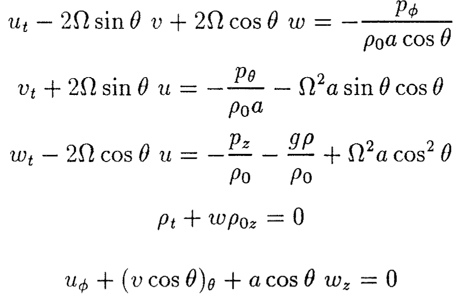](../equations/ch05-p097-e01-source.png) | [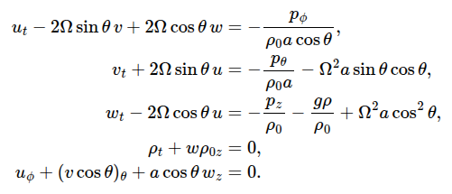](../equations/ch05-p097-e01-mathjax.png) | [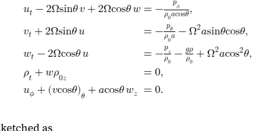](../equations/ch05-p097-e01-mathml.png) |

### p. 97 · display 2 · ch05-p097-e02

Source: [chapter5.tex](../chapter5.tex):51 · display type: `align*`

#### Markdown math

$$
\begin{aligned}
	\phi   & \equiv \text{longitude of the considered point }P,            \\
	\theta & \equiv \text{latitude},                                       \\
	u      & \equiv \text{east-west velocity},                             \\
	v      & \equiv \text{north-south velocity},                           \\
	w      & \equiv \text{velocity in radially upward }z\text{ direction}, \\
	a      & \equiv \text{earth's radius}.
\end{aligned}
$$

<details>
<summary>LaTeX source</summary>

```tex
\begin{align*}
	\phi   & \equiv \text{longitude of the considered point }P,            \\
	\theta & \equiv \text{latitude},                                       \\
	u      & \equiv \text{east-west velocity},                             \\
	v      & \equiv \text{north-south velocity},                           \\
	w      & \equiv \text{velocity in radially upward }z\text{ direction}, \\
	a      & \equiv \text{earth's radius}.
\end{align*}
```

</details>

| Source PDF | MathJax | MathML |
| --- | --- | --- |
| [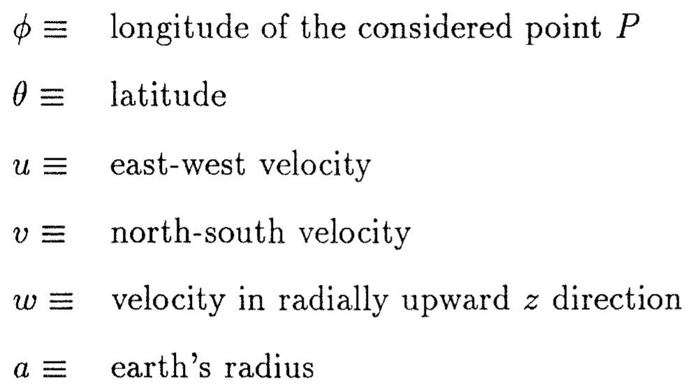](../equations/ch05-p097-e02-source.png) | [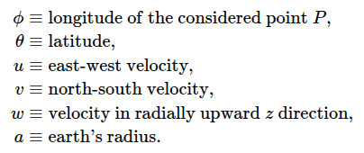](../equations/ch05-p097-e02-mathjax.png) | [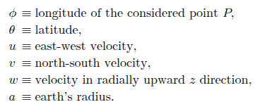](../equations/ch05-p097-e02-mathml.png) |

### p. 98 · display 1 · ch05-p098-e01

Source: [chapter5.tex](../chapter5.tex):73 · display type: `bracket`

#### Markdown math

$$
	gr+\frac12\Omega^2\cos^2\theta\,r^2
$$

<details>
<summary>LaTeX source</summary>

```tex
\[
	gr+\frac12\Omega^2\cos^2\theta\,r^2
\]
```

</details>

| Source PDF | MathJax | MathML |
| --- | --- | --- |
| [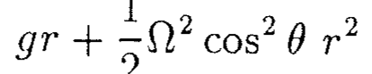](../equations/ch05-p098-e01-source.png) | [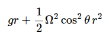](../equations/ch05-p098-e01-mathjax.png) | [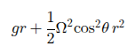](../equations/ch05-p098-e01-mathml.png) |

### p. 98 · display 2 · ch05-p098-e02

Source: [chapter5.tex](../chapter5.tex):85 · display type: `align*`

#### Markdown math

$$
\begin{aligned}
	u_t-2\Omega v & =-gh_x+\frac12[\Omega^2(x^2+y^2)]_x, \\
	v_t+2\Omega u & =-gh_y+\frac12[\Omega^2(x^2+y^2)]_y.
\end{aligned}
$$

<details>
<summary>LaTeX source</summary>

```tex
\begin{align*}
	u_t-2\Omega v & =-gh_x+\frac12[\Omega^2(x^2+y^2)]_x, \\
	v_t+2\Omega u & =-gh_y+\frac12[\Omega^2(x^2+y^2)]_y.
\end{align*}
```

</details>

| Source PDF | MathJax | MathML |
| --- | --- | --- |
| [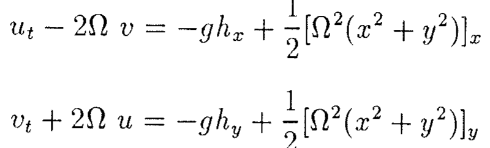](../equations/ch05-p098-e02-source.png) | [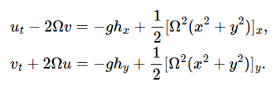](../equations/ch05-p098-e02-mathjax.png) | [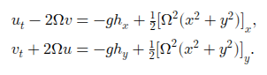](../equations/ch05-p098-e02-mathml.png) |

### p. 98 · display 3 · ch05-p098-e03

Source: [chapter5.tex](../chapter5.tex):91 · display type: `bracket`

#### Markdown math

$$
	h=h_0+\frac{\Omega^2}{2g}(x^2+y^2).
$$

<details>
<summary>LaTeX source</summary>

```tex
\[
	h=h_0+\frac{\Omega^2}{2g}(x^2+y^2).
\]
```

</details>

| Source PDF | MathJax | MathML |
| --- | --- | --- |
| [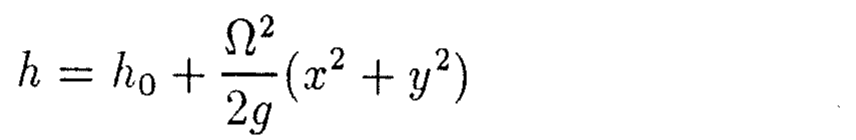](../equations/ch05-p098-e03-source.png) | [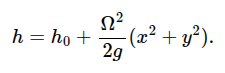](../equations/ch05-p098-e03-mathjax.png) | [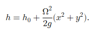](../equations/ch05-p098-e03-mathml.png) |

### p. 98 · display 4 · ch05-p098-e04

Source: [chapter5.tex](../chapter5.tex):95 · display type: `bracket`

#### Markdown math

$$
	h_t+\nabla\cdot\left\{\vec u\left[h_0+\frac{\Omega^2}{2g}(x^2+y^2)\right]\right\}=0.
$$

<details>
<summary>LaTeX source</summary>

```tex
\[
	h_t+\nabla\cdot\left\{\vec u\left[h_0+\frac{\Omega^2}{2g}(x^2+y^2)\right]\right\}=0.
\]
```

</details>

| Source PDF | MathJax | MathML |
| --- | --- | --- |
| [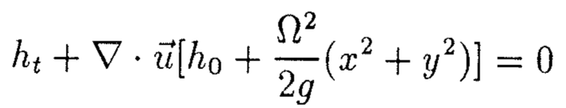](../equations/ch05-p098-e04-source.png) | [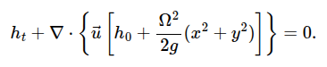](../equations/ch05-p098-e04-mathjax.png) | [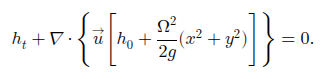](../equations/ch05-p098-e04-mathml.png) |

### p. 99 · display 1 · ch05-p099-e01

Source: [chapter5.tex](../chapter5.tex):116 · display type: `bracket`

#### Markdown math

$$
	(N^2-\sigma^2)w+2\Omega\cos\theta(i\sigma u)=i\sigma p_z/\rho_0
$$

<details>
<summary>LaTeX source</summary>

```tex
\[
	(N^2-\sigma^2)w+2\Omega\cos\theta(i\sigma u)=i\sigma p_z/\rho_0
\]
```

</details>

| Source PDF | MathJax | MathML |
| --- | --- | --- |
| [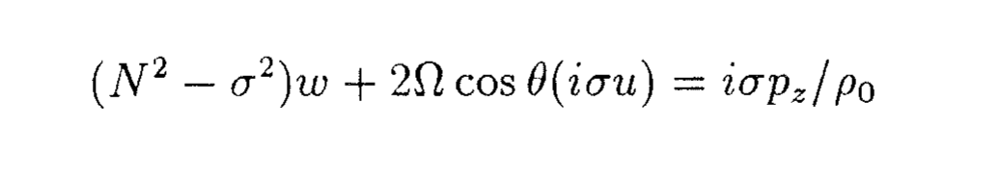](../equations/ch05-p099-e01-source.png) | [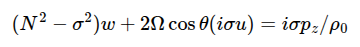](../equations/ch05-p099-e01-mathjax.png) | [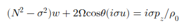](../equations/ch05-p099-e01-mathml.png) |

### p. 99 · display 2 · ch05-p099-e02

Source: [chapter5.tex](../chapter5.tex):120 · display type: `bracket`

#### Markdown math

$$
	(N^2-\sigma^2)w+(4\Omega^2\cos^2\theta)w
	=i\sigma p_z/\rho_0+(4\Omega^2\sin\theta\cos\theta)v
	-2\Omega p_\phi/(\rho_0a).
$$

<details>
<summary>LaTeX source</summary>

```tex
\[
	(N^2-\sigma^2)w+(4\Omega^2\cos^2\theta)w
	=i\sigma p_z/\rho_0+(4\Omega^2\sin\theta\cos\theta)v
	-2\Omega p_\phi/(\rho_0a).
\]
```

</details>

| Source PDF | MathJax | MathML |
| --- | --- | --- |
| [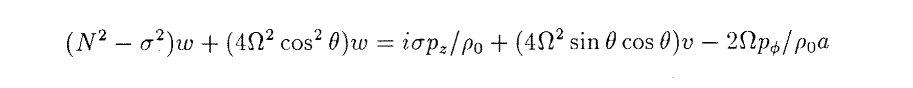](../equations/ch05-p099-e02-source.png) | [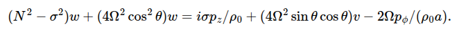](../equations/ch05-p099-e02-mathjax.png) | [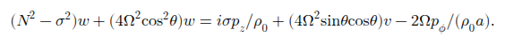](../equations/ch05-p099-e02-mathml.png) |

### p. 99 · display 3 · ch05-p099-e03

Source: [chapter5.tex](../chapter5.tex):136 · display type: `bracket`

#### Markdown math

$$
	u_t-2\Omega\sin\theta\,v=-\frac{p_\phi}{\rho_0a\cos\theta}
$$

<details>
<summary>LaTeX source</summary>

```tex
\[
	u_t-2\Omega\sin\theta\,v=-\frac{p_\phi}{\rho_0a\cos\theta}
\]
```

</details>

| Source PDF | MathJax | MathML |
| --- | --- | --- |
| [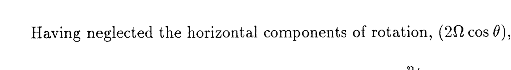](../equations/ch05-p099-e03-source.png) | [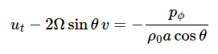](../equations/ch05-p099-e03-mathjax.png) | [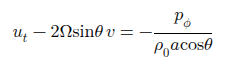](../equations/ch05-p099-e03-mathml.png) |

### p. 100 · display 1 · ch05-p100-e01

Source: [chapter5.tex](../chapter5.tex):145 · display type: `align*`

#### Markdown math

$$
\begin{aligned}
	v_t+2\Omega\sin\theta\,u                     & =-\frac{p_\theta}{\rho_0a},                \\
	w_t                                          & =-\frac{p_z}{\rho_0}-\frac{g\rho}{\rho_0}, \\
	\rho_t+w\rho_{0z}                            & =0,                                        \\
	u_\phi+(v\cos\theta)_\theta+a\cos\theta\,w_z & =0,
\end{aligned}
$$

<details>
<summary>LaTeX source</summary>

```tex
\begin{align*}
	v_t+2\Omega\sin\theta\,u                     & =-\frac{p_\theta}{\rho_0a},                \\
	w_t                                          & =-\frac{p_z}{\rho_0}-\frac{g\rho}{\rho_0}, \\
	\rho_t+w\rho_{0z}                            & =0,                                        \\
	u_\phi+(v\cos\theta)_\theta+a\cos\theta\,w_z & =0,
\end{align*}
```

</details>

| Source PDF | MathJax | MathML |
| --- | --- | --- |
| [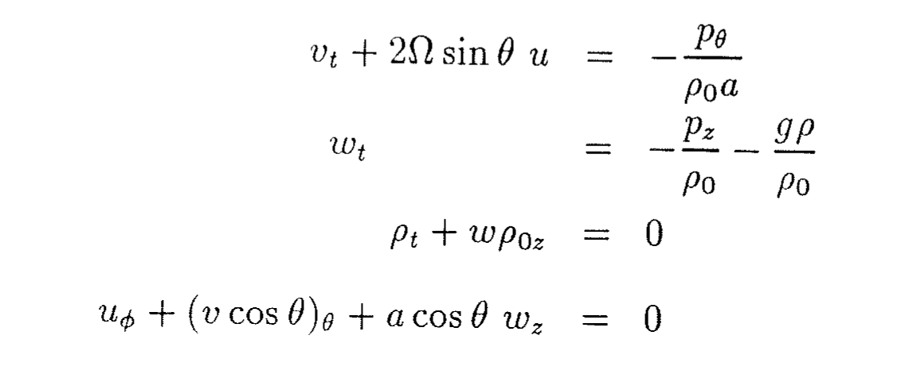](../equations/ch05-p100-e01-source.png) | [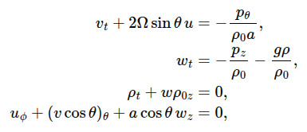](../equations/ch05-p100-e01-mathjax.png) | [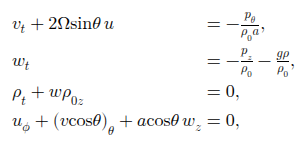](../equations/ch05-p100-e01-mathml.png) |

### p. 100 · display 2 · ch05-p100-e02

Source: [chapter5.tex](../chapter5.tex):152 · display type: `align*`

#### Markdown math

$$
\begin{aligned}
	p_t+w p_{0z}=p_t-gw\rho_0 & =0 &  & \text{at }z=0,  \\
	w                         & =0 &  & \text{at }z=-D.
\end{aligned}
$$

<details>
<summary>LaTeX source</summary>

```tex
\begin{align*}
	p_t+w p_{0z}=p_t-gw\rho_0 & =0 &  & \text{at }z=0,  \\
	w                         & =0 &  & \text{at }z=-D.
\end{align*}
```

</details>

| Source PDF | MathJax | MathML |
| --- | --- | --- |
| [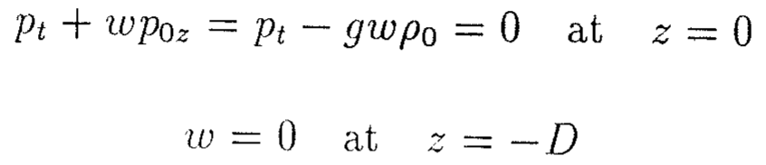](../equations/ch05-p100-e02-source.png) | [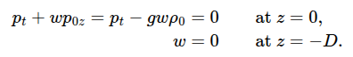](../equations/ch05-p100-e02-mathjax.png) | [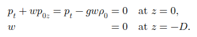](../equations/ch05-p100-e02-mathml.png) |

### p. 100 · display 3 · ch05-p100-e03

Source: [chapter5.tex](../chapter5.tex):157 · display type: `align*`

#### Markdown math

$$
\begin{aligned}
	u & =e^{-i\sigma t}U(\phi,\theta)F(z), \\
	v & =e^{-i\sigma t}V(\phi,\theta)F(z), \\
	w & =e^{-i\sigma t}W(\phi,\theta)G(z), \\
	p & =e^{-i\sigma t}P(\phi,\theta)H(z).
\end{aligned}
$$

<details>
<summary>LaTeX source</summary>

```tex
\begin{align*}
	u & =e^{-i\sigma t}U(\phi,\theta)F(z), \\
	v & =e^{-i\sigma t}V(\phi,\theta)F(z), \\
	w & =e^{-i\sigma t}W(\phi,\theta)G(z), \\
	p & =e^{-i\sigma t}P(\phi,\theta)H(z).
\end{align*}
```

</details>

| Source PDF | MathJax | MathML |
| --- | --- | --- |
| [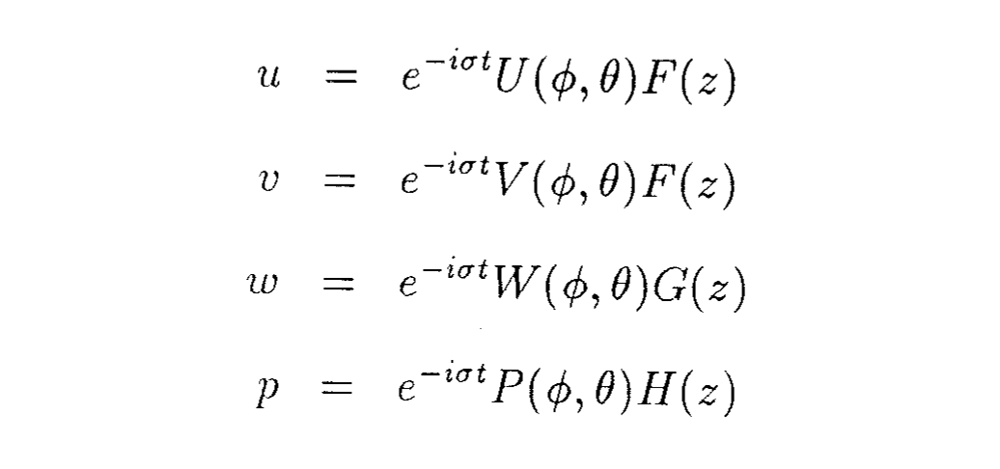](../equations/ch05-p100-e03-source.png) | [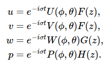](../equations/ch05-p100-e03-mathjax.png) | [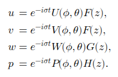](../equations/ch05-p100-e03-mathml.png) |

### p. 100 · display 4 · ch05-p100-e04

Source: [chapter5.tex](../chapter5.tex):164 · display type: `align*`

#### Markdown math

$$
\begin{aligned}
	(-i\sigma U-2\Omega\sin\theta\,V)F
	                                                  & =-\frac{P_\phi H}{\rho_0a\cos\theta},                      \\
	(-i\sigma V+2\Omega\sin\theta\,U)F
	                                                  & =-\frac{P_\theta H}{\rho_0a},                              \\
	(N^2-\sigma^2)WG                                  & =\frac{i\sigma P H_z}{\rho_0},                             \\
	U_\phi F+(V\cos\theta)_\theta F+a\cos\theta\,WG_z & =0,                                                        \\
	-i\sigma PH-g\rho_0WG                             & =0                                    &  & \text{at }z=0,  \\
	WG                                                & =0                                    &  & \text{at }z=-D,
\end{aligned}
$$

<details>
<summary>LaTeX source</summary>

```tex
\begin{align*}
	(-i\sigma U-2\Omega\sin\theta\,V)F
	                                                  & =-\frac{P_\phi H}{\rho_0a\cos\theta},                      \\
	(-i\sigma V+2\Omega\sin\theta\,U)F
	                                                  & =-\frac{P_\theta H}{\rho_0a},                              \\
	(N^2-\sigma^2)WG                                  & =\frac{i\sigma P H_z}{\rho_0},                             \\
	U_\phi F+(V\cos\theta)_\theta F+a\cos\theta\,WG_z & =0,                                                        \\
	-i\sigma PH-g\rho_0WG                             & =0                                    &  & \text{at }z=0,  \\
	WG                                                & =0                                    &  & \text{at }z=-D,
\end{align*}
```

</details>

| Source PDF | MathJax | MathML |
| --- | --- | --- |
| [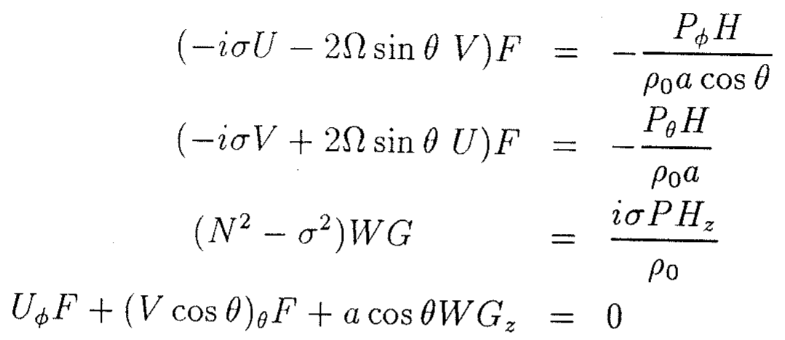](../equations/ch05-p100-e04-source.png) | [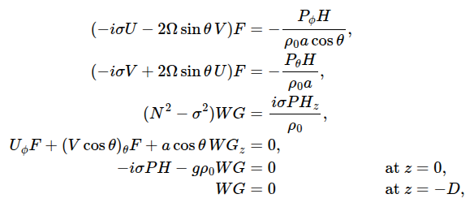](../equations/ch05-p100-e04-mathjax.png) | [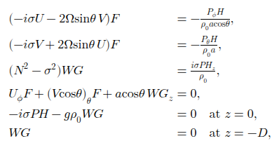](../equations/ch05-p100-e04-mathml.png) |

### p. 100 · display 5 · ch05-p100-e05

Source: [chapter5.tex](../chapter5.tex):176 · display type: `bracket`

#### Markdown math

$$
	W=-i\sigma P,\qquad H=g\rho_0F,\qquad G_z=F/d.
$$

<details>
<summary>LaTeX source</summary>

```tex
\[
	W=-i\sigma P,\qquad H=g\rho_0F,\qquad G_z=F/d.
\]
```

</details>

| Source PDF | MathJax | MathML |
| --- | --- | --- |
| [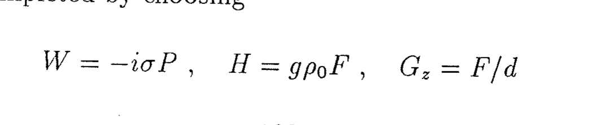](../equations/ch05-p100-e05-source.png) | [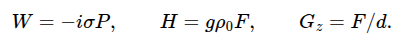](../equations/ch05-p100-e05-mathjax.png) | [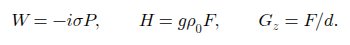](../equations/ch05-p100-e05-mathml.png) |

### p. 101 · display 1 · ch05-p101-e01

Source: [chapter5.tex](../chapter5.tex):186 · display type: `wavealign`

#### Markdown math

$$
\begin{aligned}
	-i\sigma U-2\Omega\sin\theta\,V
	&=-\frac{gP_\phi}{a\cos\theta},\\
	-i\sigma V+2\Omega\sin\theta\,U
	&=-\frac{gP_\theta}{a},\\
	-i\sigma P+\frac{d_n}{a\cos\theta}
	[U_\phi+(V\cos\theta)_\theta]&=0,\\
	G_{zz}+\frac{N^2-\sigma^2}{g d_n}G&=0,\\
	G_z-\frac{1}{d_n}G&=0 &&\text{at }z=0,\\
	G&=0 &&\text{at }z=-D.
\end{aligned}
$$

<details>
<summary>LaTeX source</summary>

```tex
\begin{wavealign}
	-i\sigma U-2\Omega\sin\theta\,V
	&=-\frac{gP_\phi}{a\cos\theta},\\
	-i\sigma V+2\Omega\sin\theta\,U
	&=-\frac{gP_\theta}{a},\\
	-i\sigma P+\frac{d_n}{a\cos\theta}
	[U_\phi+(V\cos\theta)_\theta]&=0,\\
	G_{zz}+\frac{N^2-\sigma^2}{g d_n}G&=0,\\
	G_z-\frac{1}{d_n}G&=0 &&\text{at }z=0,\\
	G&=0 &&\text{at }z=-D.
\end{wavealign}
```

</details>

| Source PDF | MathJax | MathML |
| --- | --- | --- |
| [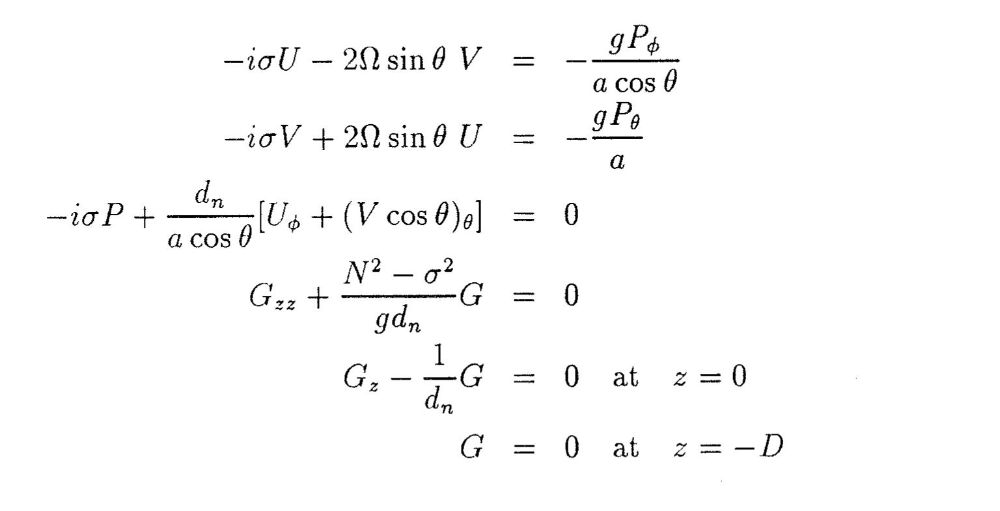](../equations/ch05-p101-e01-source.png) | [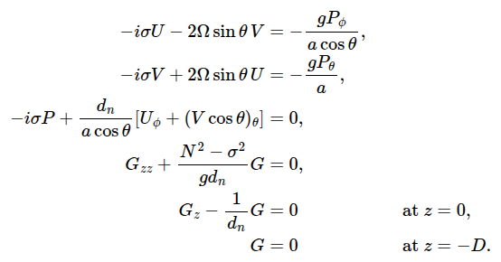](../equations/ch05-p101-e01-mathjax.png) | [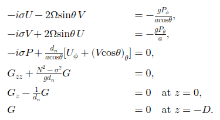](../equations/ch05-p101-e01-mathml.png) |

### p. 102 · display 1 · ch05-p102-e01

Source: [chapter5.tex](../chapter5.tex):231 · display type: `align*`

#### Markdown math

$$
\begin{aligned}
	u_t-fv            & =-\frac{1}{\rho_0}p_x,                      \\
	v_t+fu            & =-\frac{1}{\rho_0}p_y,                      \\
	0                 & =-\frac{1}{\rho_0}p_z-\frac{g\rho}{\rho_0}, \\
	\rho_t+w\rho_{0z} & =0,                                         \\
	u_x+v_y+w_z       & =0,
\end{aligned}
$$

<details>
<summary>LaTeX source</summary>

```tex
\begin{align*}
	u_t-fv            & =-\frac{1}{\rho_0}p_x,                      \\
	v_t+fu            & =-\frac{1}{\rho_0}p_y,                      \\
	0                 & =-\frac{1}{\rho_0}p_z-\frac{g\rho}{\rho_0}, \\
	\rho_t+w\rho_{0z} & =0,                                         \\
	u_x+v_y+w_z       & =0,
\end{align*}
```

</details>

| Source PDF | MathJax | MathML |
| --- | --- | --- |
| [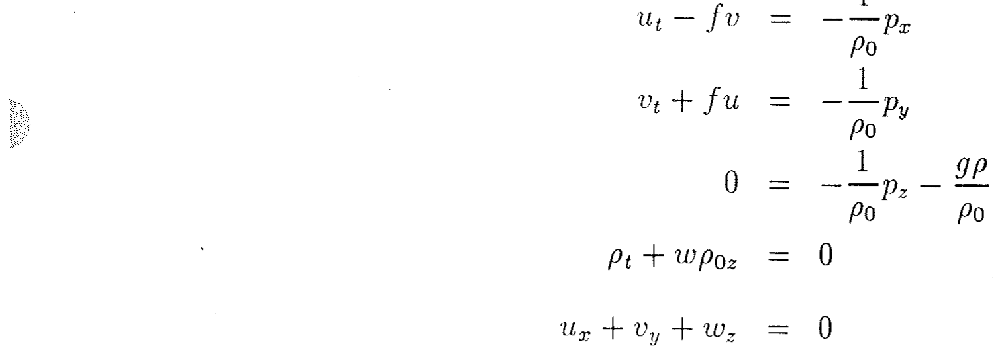](../equations/ch05-p102-e01-source.png) | [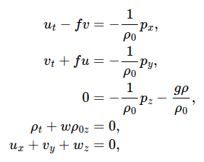](../equations/ch05-p102-e01-mathjax.png) | [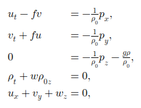](../equations/ch05-p102-e01-mathml.png) |

### p. 102 · display 2 · ch05-p102-e02

Source: [chapter5.tex](../chapter5.tex):245 · display type: `bracket`

#### Markdown math

$$
	N^2w=-\frac{1}{\rho_0}p_{zt}.
$$

<details>
<summary>LaTeX source</summary>

```tex
\[
	N^2w=-\frac{1}{\rho_0}p_{zt}.
\]
```

</details>

| Source PDF | MathJax | MathML |
| --- | --- | --- |
| [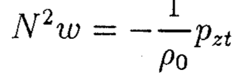](../equations/ch05-p102-e02-source.png) | [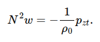](../equations/ch05-p102-e02-mathjax.png) | [](../equations/ch05-p102-e02-mathml.png) |

### p. 103 · display 1 · ch05-p103-e01

Source: [chapter5.tex](../chapter5.tex):257 · display type: `bracket`

#### Markdown math

$$
	p|_\eta-p(z)=-g\rho_0(\eta-z)
$$

<details>
<summary>LaTeX source</summary>

```tex
\[
	p|_\eta-p(z)=-g\rho_0(\eta-z)
\]
```

</details>

| Source PDF | MathJax | MathML |
| --- | --- | --- |
| [](../equations/ch05-p103-e01-source.png) | [](../equations/ch05-p103-e01-mathjax.png) | [](../equations/ch05-p103-e01-mathml.png) |

### p. 103 · display 2 · ch05-p103-e02

Source: [chapter5.tex](../chapter5.tex):261 · display type: `bracket`

#### Markdown math

$$
	p(z)=p_{atm}+g\rho_0(\eta-z).
$$

<details>
<summary>LaTeX source</summary>

```tex
\[
	p(z)=p_{atm}+g\rho_0(\eta-z).
\]
```

</details>

| Source PDF | MathJax | MathML |
| --- | --- | --- |
| [](../equations/ch05-p103-e02-source.png) | [](../equations/ch05-p103-e02-mathjax.png) | [](../equations/ch05-p103-e02-mathml.png) |

### p. 103 · display 3 · ch05-p103-e03

Source: [chapter5.tex](../chapter5.tex):265 · display type: `bracket`

#### Markdown math

$$
	p(z)=g\rho_0(\eta-z).
$$

<details>
<summary>LaTeX source</summary>

```tex
\[
	p(z)=g\rho_0(\eta-z).
\]
```

</details>

| Source PDF | MathJax | MathML |
| --- | --- | --- |
| [](../equations/ch05-p103-e03-source.png) | [](../equations/ch05-p103-e03-mathjax.png) | [](../equations/ch05-p103-e03-mathml.png) |

### p. 103 · display 4 · ch05-p103-e04

Source: [chapter5.tex](../chapter5.tex):270 · display type: `align*`

#### Markdown math

$$
\begin{aligned}
	u_t-fv      & =-g\eta_x, \\
	v_t+fu      & =-g\eta_y, \\
	u_x+v_y+w_z & =0.
\end{aligned}
$$

<details>
<summary>LaTeX source</summary>

```tex
\begin{align*}
	u_t-fv      & =-g\eta_x, \\
	v_t+fu      & =-g\eta_y, \\
	u_x+v_y+w_z & =0.
\end{align*}
```

</details>

| Source PDF | MathJax | MathML |
| --- | --- | --- |
| [](../equations/ch05-p103-e04-source.png) | [](../equations/ch05-p103-e04-mathjax.png) | [](../equations/ch05-p103-e04-mathml.png) |

### p. 103 · display 5 · ch05-p103-e05

Source: [chapter5.tex](../chapter5.tex):276 · display type: `bracket`

#### Markdown math

$$
	\int_{-D}^{\eta}(u_x+v_y)\,dz+w|_{z=\eta}-w|_{z=-D}=0.
$$

<details>
<summary>LaTeX source</summary>

```tex
\[
	\int_{-D}^{\eta}(u_x+v_y)\,dz+w|_{z=\eta}-w|_{z=-D}=0.
\]
```

</details>

| Source PDF | MathJax | MathML |
| --- | --- | --- |
| [](../equations/ch05-p103-e05-source.png) | [](../equations/ch05-p103-e05-mathjax.png) | [](../equations/ch05-p103-e05-mathml.png) |

### p. 103 · display 6 · ch05-p103-e06

Source: [chapter5.tex](../chapter5.tex):280 · display type: `bracket`

#### Markdown math

$$
	(u_x+v_y)(\eta+D)+w|_{z=\eta}-w|_{z=-D}=0.
$$

<details>
<summary>LaTeX source</summary>

```tex
\[
	(u_x+v_y)(\eta+D)+w|_{z=\eta}-w|_{z=-D}=0.
\]
```

</details>

| Source PDF | MathJax | MathML |
| --- | --- | --- |
| [](../equations/ch05-p103-e06-source.png) | [](../equations/ch05-p103-e06-mathjax.png) | [](../equations/ch05-p103-e06-mathml.png) |

### p. 103 · display 7 · ch05-p103-e07

Source: [chapter5.tex](../chapter5.tex):284 · display type: `bracket`

#### Markdown math

$$
	w=\frac{D\eta}{Dt}\quad\text{at }z=\eta
	\ ;\qquad
	w=-uD_x-vD_y\quad\text{at }z=-D.
$$

<details>
<summary>LaTeX source</summary>

```tex
\[
	w=\frac{D\eta}{Dt}\quad\text{at }z=\eta
	\ ;\qquad
	w=-uD_x-vD_y\quad\text{at }z=-D.
\]
```

</details>

| Source PDF | MathJax | MathML |
| --- | --- | --- |
| [](../equations/ch05-p103-e07-source.png) | [](../equations/ch05-p103-e07-mathjax.png) | [](../equations/ch05-p103-e07-mathml.png) |

### p. 103 · display 8 · ch05-p103-e08

Source: [chapter5.tex](../chapter5.tex):290 · display type: `bracket`

#### Markdown math

$$
	\eta_t+[u(\eta+D)]_x+[v(\eta+D)]_y=0.
$$

<details>
<summary>LaTeX source</summary>

```tex
\[
	\eta_t+[u(\eta+D)]_x+[v(\eta+D)]_y=0.
\]
```

</details>

| Source PDF | MathJax | MathML |
| --- | --- | --- |
| [](../equations/ch05-p103-e08-source.png) | [](../equations/ch05-p103-e08-mathjax.png) | [](../equations/ch05-p103-e08-mathml.png) |

### p. 104 · display 1 · ch05-p104-e01

Source: [chapter5.tex](../chapter5.tex):301 · display type: `wavealign`

#### Markdown math

$$
\begin{aligned}
	u_t-fv&=-g\eta_x,\\
	v_t+fu&=-g\eta_y,\\
	\eta_t+[uD]_x+[vD]_y&=0.
\end{aligned}
$$

<details>
<summary>LaTeX source</summary>

```tex
\begin{wavealign}
	u_t-fv&=-g\eta_x,\\
	v_t+fu&=-g\eta_y,\\
	\eta_t+[uD]_x+[vD]_y&=0.
\end{wavealign}
```

</details>

| Source PDF | MathJax | MathML |
| --- | --- | --- |
| [](../equations/ch05-p104-e01-source.png) | [](../equations/ch05-p104-e01-mathjax.png) | [](../equations/ch05-p104-e01-mathml.png) |

### p. 104 · display 2 · ch05-p104-e02

Source: [chapter5.tex](../chapter5.tex):313 · display type: `align*`

#### Markdown math

$$
\begin{aligned}
	u & =U(x,y,t)F(z), \\
	v & =V(x,y,t)F(z), \\
	w & =W(x,y,t)G(z), \\
	p & =P(x,y,t)H(z).
\end{aligned}
$$

<details>
<summary>LaTeX source</summary>

```tex
\begin{align*}
	u & =U(x,y,t)F(z), \\
	v & =V(x,y,t)F(z), \\
	w & =W(x,y,t)G(z), \\
	p & =P(x,y,t)H(z).
\end{align*}
```

</details>

| Source PDF | MathJax | MathML |
| --- | --- | --- |
| [](../equations/ch05-p104-e02-source.png) | [](../equations/ch05-p104-e02-mathjax.png) | [](../equations/ch05-p104-e02-mathml.png) |

### p. 104 · display 3 · ch05-p104-e03

Source: [chapter5.tex](../chapter5.tex):320 · display type: `align*`

#### Markdown math

$$
\begin{aligned}
	(U_t-fV)F       & =-\frac{1}{\rho_0}P_xH,   \\
	(V_t+fU)F       & =-\frac{1}{\rho_0}P_yH,   \\
	N^2WG           & =-\frac{1}{\rho_0}P_tH_z, \\
	(U_x+V_y)F+WG_z & =0.
\end{aligned}
$$

<details>
<summary>LaTeX source</summary>

```tex
\begin{align*}
	(U_t-fV)F       & =-\frac{1}{\rho_0}P_xH,   \\
	(V_t+fU)F       & =-\frac{1}{\rho_0}P_yH,   \\
	N^2WG           & =-\frac{1}{\rho_0}P_tH_z, \\
	(U_x+V_y)F+WG_z & =0.
\end{align*}
```

</details>

| Source PDF | MathJax | MathML |
| --- | --- | --- |
| [](../equations/ch05-p104-e03-source.png) | [](../equations/ch05-p104-e03-mathjax.png) | [](../equations/ch05-p104-e03-mathml.png) |

### p. 104 · display 4 · ch05-p104-e04

Source: [chapter5.tex](../chapter5.tex):327 · display type: `bracket`

#### Markdown math

$$
	H=g\rho_0F\ ;\qquad G_z=F/d\ ;\qquad W=P_t
$$

<details>
<summary>LaTeX source</summary>

```tex
\[
	H=g\rho_0F\ ;\qquad G_z=F/d\ ;\qquad W=P_t
\]
```

</details>

| Source PDF | MathJax | MathML |
| --- | --- | --- |
| [](../equations/ch05-p104-e04-source.png) | [](../equations/ch05-p104-e04-mathjax.png) | [](../equations/ch05-p104-e04-mathml.png) |

### p. 105 · display 1 · ch05-p105-e01

Source: [chapter5.tex](../chapter5.tex):337 · display type: `align*`

#### Markdown math

$$
\begin{aligned}
	U_t-fV                       & =-gP_x,                      \\
	V_t+fU                       & =-gP_y,                      \\
	P_t+d_n(U_x+V_y)             & =0,                          \\
	G_{zz}+\frac{N^2(z)}{g d_n}G & =0,                          \\
	G_z-\frac{1}{d_n}G           & =0      &  & \text{at }z=0,  \\
	G                            & =0      &  & \text{at }z=-D.
\end{aligned}
$$

<details>
<summary>LaTeX source</summary>

```tex
\begin{align*}
	U_t-fV                       & =-gP_x,                      \\
	V_t+fU                       & =-gP_y,                      \\
	P_t+d_n(U_x+V_y)             & =0,                          \\
	G_{zz}+\frac{N^2(z)}{g d_n}G & =0,                          \\
	G_z-\frac{1}{d_n}G           & =0      &  & \text{at }z=0,  \\
	G                            & =0      &  & \text{at }z=-D.
\end{align*}
```

</details>

| Source PDF | MathJax | MathML |
| --- | --- | --- |
| [](../equations/ch05-p105-e01-source.png) | [](../equations/ch05-p105-e01-mathjax.png) | [](../equations/ch05-p105-e01-mathml.png) |

### p. 106 · display 1 · ch05-p106-e01

Source: [chapter5.tex](../chapter5.tex):381 · display type: `bracket`

#### Markdown math

$$
	N=(g/h)^{1/2}
	\qquad\text{where}\qquad
	h=-(\rho_{0z}/\rho_0)^{-1}=g/N^2
$$

<details>
<summary>LaTeX source</summary>

```tex
\[
	N=(g/h)^{1/2}
	\qquad\text{where}\qquad
	h=-(\rho_{0z}/\rho_0)^{-1}=g/N^2
\]
```

</details>

| Source PDF | MathJax | MathML |
| --- | --- | --- |
| [](../equations/ch05-p106-e01-source.png) | [](../equations/ch05-p106-e01-mathjax.png) | [](../equations/ch05-p106-e01-mathml.png) |

### p. 106 · display 2 · ch05-p106-e02

Source: [chapter5.tex](../chapter5.tex):389 · display type: `bracket`

#### Markdown math

$$
	\tan\left(\frac{D}{(hd_n)^{1/2}}\right)
	=\left(\frac{d_n}{h}\right)^{1/2}
$$

<details>
<summary>LaTeX source</summary>

```tex
\[
	\tan\left(\frac{D}{(hd_n)^{1/2}}\right)
	=\left(\frac{d_n}{h}\right)^{1/2}
\]
```

</details>

| Source PDF | MathJax | MathML |
| --- | --- | --- |
| [](../equations/ch05-p106-e02-source.png) | [](../equations/ch05-p106-e02-mathjax.png) | [](../equations/ch05-p106-e02-mathml.png) |

### p. 106 · display 3 · ch05-p106-e03

Source: [chapter5.tex](../chapter5.tex):397 · display type: `bracket`

#### Markdown math

$$
	d_n=\frac{\lambda_v^2}{4\pi^2h}
$$

<details>
<summary>LaTeX source</summary>

```tex
\[
	d_n=\frac{\lambda_v^2}{4\pi^2h}
\]
```

</details>

| Source PDF | MathJax | MathML |
| --- | --- | --- |
| [](../equations/ch05-p106-e03-source.png) | [](../equations/ch05-p106-e03-mathjax.png) | [](../equations/ch05-p106-e03-mathml.png) |

### p. 107 · display 1 · ch05-p107-e01

Source: [chapter5.tex](../chapter5.tex):421 · display type: `align*`

#### Markdown math

$$
\begin{aligned}
	u_t               & =-g\eta_x, \\
	v_t               & =-g\eta_y, \\
	\eta_t+D(u_x+v_y) & =0.
\end{aligned}
$$

<details>
<summary>LaTeX source</summary>

```tex
\begin{align*}
	u_t               & =-g\eta_x, \\
	v_t               & =-g\eta_y, \\
	\eta_t+D(u_x+v_y) & =0.
\end{align*}
```

</details>

| Source PDF | MathJax | MathML |
| --- | --- | --- |
| [](../equations/ch05-p107-e01-source.png) | [](../equations/ch05-p107-e01-mathjax.png) | [](../equations/ch05-p107-e01-mathml.png) |

### p. 107 · display 2 · ch05-p107-e02

Source: [chapter5.tex](../chapter5.tex):427 · display type: `bracket`

#### Markdown math

$$
	u=\frac{gk}{\sigma}\eta
	\ ;\qquad
	v=\frac{g\ell}{\sigma}\eta.
$$

<details>
<summary>LaTeX source</summary>

```tex
\[
	u=\frac{gk}{\sigma}\eta
	\ ;\qquad
	v=\frac{g\ell}{\sigma}\eta.
\]
```

</details>

| Source PDF | MathJax | MathML |
| --- | --- | --- |
| [](../equations/ch05-p107-e02-source.png) | [](../equations/ch05-p107-e02-mathjax.png) | [](../equations/ch05-p107-e02-mathml.png) |

### p. 107 · display 3 · ch05-p107-e03

Source: [chapter5.tex](../chapter5.tex):433 · display type: `waveequation`

#### Markdown math

$$
	\sigma^2=gD(k^2+\ell^2)=gDK^2.
$$

<details>
<summary>LaTeX source</summary>

```tex
\begin{waveequation}
	\sigma^2=gD(k^2+\ell^2)=gDK^2.
\end{waveequation}
```

</details>

| Source PDF | MathJax | MathML |
| --- | --- | --- |
| [](../equations/ch05-p107-e03-source.png) | [](../equations/ch05-p107-e03-mathjax.png) | [](../equations/ch05-p107-e03-mathml.png) |

### p. 107 · display 4 · ch05-p107-e04

Source: [chapter5.tex](../chapter5.tex):438 · display type: `bracket`

#### Markdown math

$$
	c=\sigma/K=(gD)^{1/2}
	\ ;\qquad
	|\vec c_g|=d\sigma/d|\vec k|=(gD)^{1/2}.
$$

<details>
<summary>LaTeX source</summary>

```tex
\[
	c=\sigma/K=(gD)^{1/2}
	\ ;\qquad
	|\vec c_g|=d\sigma/d|\vec k|=(gD)^{1/2}.
\]
```

</details>

| Source PDF | MathJax | MathML |
| --- | --- | --- |
| [](../equations/ch05-p107-e04-source.png) | [](../equations/ch05-p107-e04-mathjax.png) | [](../equations/ch05-p107-e04-mathml.png) |

### p. 108 · display 1 · ch05-p108-e01

Source: [chapter5.tex](../chapter5.tex):458 · display type: `bracket`

#### Markdown math

$$
	\eta
	=a e^{-i\sigma t+ikx+i\ell y}
	+a e^{-i\sigma t-ikx+i\ell y}.
$$

<details>
<summary>LaTeX source</summary>

```tex
\[
	\eta
	=a e^{-i\sigma t+ikx+i\ell y}
	+a e^{-i\sigma t-ikx+i\ell y}.
\]
```

</details>

| Source PDF | MathJax | MathML |
| --- | --- | --- |
| [](../equations/ch05-p108-e01-source.png) | [](../equations/ch05-p108-e01-mathjax.png) | [](../equations/ch05-p108-e01-mathml.png) |

### p. 108 · display 2 · ch05-p108-e02

Source: [chapter5.tex](../chapter5.tex):475 · display type: `align*`

#### Markdown math

$$
\begin{aligned}
	-i\sigma u              & =-g\eta_x,
	                        & -i\sigma v & =-g\eta_y, \\
	-i\sigma\eta+D(u_x+v_y) & =0.
\end{aligned}
$$

<details>
<summary>LaTeX source</summary>

```tex
\begin{align*}
	-i\sigma u              & =-g\eta_x,
	                        & -i\sigma v & =-g\eta_y, \\
	-i\sigma\eta+D(u_x+v_y) & =0.
\end{align*}
```

</details>

| Source PDF | MathJax | MathML |
| --- | --- | --- |
| [](../equations/ch05-p108-e02-source.png) | [](../equations/ch05-p108-e02-mathjax.png) | [](../equations/ch05-p108-e02-mathml.png) |

### p. 109 · display 1 · ch05-p109-e01

Source: [chapter5.tex](../chapter5.tex):492 · display type: `bracket`

#### Markdown math

$$
	\nabla^2\eta+\frac{\sigma^2}{gD}\eta=0.
$$

<details>
<summary>LaTeX source</summary>

```tex
\[
	\nabla^2\eta+\frac{\sigma^2}{gD}\eta=0.
\]
```

</details>

| Source PDF | MathJax | MathML |
| --- | --- | --- |
| [](../equations/ch05-p109-e01-source.png) | [](../equations/ch05-p109-e01-mathjax.png) | [](../equations/ch05-p109-e01-mathml.png) |

### p. 109 · display 2 · ch05-p109-e02

Source: [chapter5.tex](../chapter5.tex):498 · display type: `align*`

#### Markdown math

$$
\begin{aligned}
	\eta_x & =0 &  & \text{at }x=0,a, \\
	\eta_y & =0 &  & \text{at }y=0,b.
\end{aligned}
$$

<details>
<summary>LaTeX source</summary>

```tex
\begin{align*}
	\eta_x & =0 &  & \text{at }x=0,a, \\
	\eta_y & =0 &  & \text{at }y=0,b.
\end{align*}
```

</details>

| Source PDF | MathJax | MathML |
| --- | --- | --- |
| [](../equations/ch05-p109-e02-source.png) | [](../equations/ch05-p109-e02-mathjax.png) | [](../equations/ch05-p109-e02-mathml.png) |

### p. 109 · display 3 · ch05-p109-e03

Source: [chapter5.tex](../chapter5.tex):503 · display type: `bracket`

#### Markdown math

$$
	\eta
	=\cos\left(\frac{n\pi x}{a}\right)
	\cos\left(\frac{m\pi y}{b}\right),
	\qquad n,m=0,1,\ldots
$$

<details>
<summary>LaTeX source</summary>

```tex
\[
	\eta
	=\cos\left(\frac{n\pi x}{a}\right)
	\cos\left(\frac{m\pi y}{b}\right),
	\qquad n,m=0,1,\ldots
\]
```

</details>

| Source PDF | MathJax | MathML |
| --- | --- | --- |
| [](../equations/ch05-p109-e03-source.png) | [](../equations/ch05-p109-e03-mathjax.png) | [](../equations/ch05-p109-e03-mathml.png) |

### p. 109 · display 4 · ch05-p109-e04

Source: [chapter5.tex](../chapter5.tex):510 · display type: `waveequation`

#### Markdown math

$$
	\sigma^2
	=gD\left(\frac{n^2}{a^2}+\frac{m^2}{b^2}\right)\pi^2.
$$

<details>
<summary>LaTeX source</summary>

```tex
\begin{waveequation}
	\sigma^2
	=gD\left(\frac{n^2}{a^2}+\frac{m^2}{b^2}\right)\pi^2.
\end{waveequation}
```

</details>

| Source PDF | MathJax | MathML |
| --- | --- | --- |
| [](../equations/ch05-p109-e04-source.png) | [](../equations/ch05-p109-e04-mathjax.png) | [](../equations/ch05-p109-e04-mathml.png) |

### p. 110 · display 1 · ch05-p110-e01

Source: [chapter5.tex](../chapter5.tex):538 · display type: `bracket`

#### Markdown math

$$
	\nabla^2\eta+(\sigma^2/gD)\eta=0
	\ ;\qquad
	\partial\eta/\partial n=0
	\quad\text{at boundaries}
$$

<details>
<summary>LaTeX source</summary>

```tex
\[
	\nabla^2\eta+(\sigma^2/gD)\eta=0
	\ ;\qquad
	\partial\eta/\partial n=0
	\quad\text{at boundaries}
\]
```

</details>

| Source PDF | MathJax | MathML |
| --- | --- | --- |
| [](../equations/ch05-p110-e01-source.png) | [](../equations/ch05-p110-e01-mathjax.png) | [](../equations/ch05-p110-e01-mathml.png) |

### p. 111 · display 1 · ch05-p111-e01

Source: [chapter5.tex](../chapter5.tex):567 · display type: `align*`

#### Markdown math

$$
\begin{aligned}
	x<0\qquad
	\eta & =e^{-i\sigma t-i\ell y}\left(A_Te^{-ik_1x}\right), \\
	x>0\qquad
	\eta & =e^{-i\sigma t-i\ell y}
	\left(A_Ie^{-ik_2x}+A_Re^{ik_2x}\right),
\end{aligned}
$$

<details>
<summary>LaTeX source</summary>

```tex
\begin{align*}
	x<0\qquad
	\eta & =e^{-i\sigma t-i\ell y}\left(A_Te^{-ik_1x}\right), \\
	x>0\qquad
	\eta & =e^{-i\sigma t-i\ell y}
	\left(A_Ie^{-ik_2x}+A_Re^{ik_2x}\right),
\end{align*}
```

</details>

| Source PDF | MathJax | MathML |
| --- | --- | --- |
| [](../equations/ch05-p111-e01-source.png) | [](../equations/ch05-p111-e01-mathjax.png) | [](../equations/ch05-p111-e01-mathml.png) |

### p. 111 · display 2 · ch05-p111-e02

Source: [chapter5.tex](../chapter5.tex):578 · display type: `align*`

#### Markdown math

$$
\begin{aligned}
	A_I+A_R          & =A_T,          \\
	D_2k_2(-A_I+A_R) & =D_1k_1(-A_T).
\end{aligned}
$$

<details>
<summary>LaTeX source</summary>

```tex
\begin{align*}
	A_I+A_R          & =A_T,          \\
	D_2k_2(-A_I+A_R) & =D_1k_1(-A_T).
\end{align*}
```

</details>

| Source PDF | MathJax | MathML |
| --- | --- | --- |
| [](../equations/ch05-p111-e02-source.png) | [](../equations/ch05-p111-e02-mathjax.png) | [](../equations/ch05-p111-e02-mathml.png) |

### p. 111 · display 3 · ch05-p111-e03

Source: [chapter5.tex](../chapter5.tex):597 · display type: `waveequation`

#### Markdown math

$$
	A_T=2A_I/(1+D_1k_1/D_2k_2).
$$

<details>
<summary>LaTeX source</summary>

```tex
\begin{waveequation}
	A_T=2A_I/(1+D_1k_1/D_2k_2).
\end{waveequation}
```

</details>

| Source PDF | MathJax | MathML |
| --- | --- | --- |
| [](../equations/ch05-p111-e03-source.png) | [](../equations/ch05-p111-e03-mathjax.png) | [](../equations/ch05-p111-e03-mathml.png) |

### p. 112 · display 1 · ch05-p112-e01

Source: [chapter5.tex](../chapter5.tex):606 · display type: `waveequation`

#### Markdown math

$$
	A_R=A_I(1-D_1k_1/D_2k_2)/(1+D_1k_1/D_2k_2).
$$

<details>
<summary>LaTeX source</summary>

```tex
\begin{waveequation}
	A_R=A_I(1-D_1k_1/D_2k_2)/(1+D_1k_1/D_2k_2).
\end{waveequation}
```

</details>

| Source PDF | MathJax | MathML |
| --- | --- | --- |
| [](../equations/ch05-p112-e01-source.png) | [](../equations/ch05-p112-e01-mathjax.png) | [](../equations/ch05-p112-e01-mathml.png) |

### p. 112 · display 2 · ch05-p112-e02

Source: [chapter5.tex](../chapter5.tex):614 · display type: `align*`

#### Markdown math

$$
\begin{aligned}
	K_I=K_R & =(k_2^2+\ell^2)^{1/2}=\sigma/(gD_2)^{1/2}, \\
	K_T     & =(k_1^2+\ell^2)^{1/2}=\sigma/(gD_1)^{1/2},
\end{aligned}
$$

<details>
<summary>LaTeX source</summary>

```tex
\begin{align*}
	K_I=K_R & =(k_2^2+\ell^2)^{1/2}=\sigma/(gD_2)^{1/2}, \\
	K_T     & =(k_1^2+\ell^2)^{1/2}=\sigma/(gD_1)^{1/2},
\end{align*}
```

</details>

| Source PDF | MathJax | MathML |
| --- | --- | --- |
| [](../equations/ch05-p112-e02-source.png) | [](../equations/ch05-p112-e02-mathjax.png) | [](../equations/ch05-p112-e02-mathml.png) |

### p. 112 · display 3 · ch05-p112-e03

Source: [chapter5.tex](../chapter5.tex):619 · display type: `bracket`

#### Markdown math

$$
	\ell=K_I\sin\alpha_I=K_R\sin\alpha_R,
$$

<details>
<summary>LaTeX source</summary>

```tex
\[
	\ell=K_I\sin\alpha_I=K_R\sin\alpha_R,
\]
```

</details>

| Source PDF | MathJax | MathML |
| --- | --- | --- |
| [](../equations/ch05-p112-e03-source.png) | [](../equations/ch05-p112-e03-mathjax.png) | [](../equations/ch05-p112-e03-mathml.png) |

### p. 112 · display 4 · ch05-p112-e04

Source: [chapter5.tex](../chapter5.tex):622 · display type: `bracket`

#### Markdown math

$$
	\alpha_I=\alpha_R,
$$

<details>
<summary>LaTeX source</summary>

```tex
\[
	\alpha_I=\alpha_R,
\]
```

</details>

| Source PDF | MathJax | MathML |
| --- | --- | --- |
| [](../equations/ch05-p112-e04-source.png) | [](../equations/ch05-p112-e04-mathjax.png) | [](../equations/ch05-p112-e04-mathml.png) |

### p. 112 · display 5 · ch05-p112-e05

Source: [chapter5.tex](../chapter5.tex):626 · display type: `bracket`

#### Markdown math

$$
	\ell=K_I\sin\alpha_I=K_T\sin\alpha_T,
$$

<details>
<summary>LaTeX source</summary>

```tex
\[
	\ell=K_I\sin\alpha_I=K_T\sin\alpha_T,
\]
```

</details>

| Source PDF | MathJax | MathML |
| --- | --- | --- |
| [](../equations/ch05-p112-e05-source.png) | [](../equations/ch05-p112-e05-mathjax.png) | [](../equations/ch05-p112-e05-mathml.png) |

### p. 112 · display 6 · ch05-p112-e06

Source: [chapter5.tex](../chapter5.tex):629 · display type: `bracket`

#### Markdown math

$$
	\frac{\sin\alpha_I}{(gD_2)^{1/2}}
	=\frac{\sin\alpha_T}{(gD_1)^{1/2}},
$$

<details>
<summary>LaTeX source</summary>

```tex
\[
	\frac{\sin\alpha_I}{(gD_2)^{1/2}}
	=\frac{\sin\alpha_T}{(gD_1)^{1/2}},
\]
```

</details>

| Source PDF | MathJax | MathML |
| --- | --- | --- |
| [](../equations/ch05-p112-e06-source.png) | [](../equations/ch05-p112-e06-mathjax.png) | [](../equations/ch05-p112-e06-mathml.png) |

### p. 112 · display 7 · ch05-p112-e07

Source: [chapter5.tex](../chapter5.tex):633 · display type: `waveequation`

#### Markdown math

$$
	\frac{\sin\alpha_I}{c_I}=\frac{\sin\alpha_T}{c_T},
$$

<details>
<summary>LaTeX source</summary>

```tex
\begin{waveequation}
	\frac{\sin\alpha_I}{c_I}=\frac{\sin\alpha_T}{c_T},
\end{waveequation}
```

</details>

| Source PDF | MathJax | MathML |
| --- | --- | --- |
| [](../equations/ch05-p112-e07-source.png) | [](../equations/ch05-p112-e07-mathjax.png) | [](../equations/ch05-p112-e07-mathml.png) |

### p. 113 · display 1 · ch05-p113-e01

Source: [chapter5.tex](../chapter5.tex):655 · display type: `waveequation`

#### Markdown math

$$
	\sin\alpha_I'=\left(\frac{D_2}{D_1}\right)^{1/2}.
$$

<details>
<summary>LaTeX source</summary>

```tex
\begin{waveequation}
	\sin\alpha_I'=\left(\frac{D_2}{D_1}\right)^{1/2}.
\end{waveequation}
```

</details>

| Source PDF | MathJax | MathML |
| --- | --- | --- |
| [](../equations/ch05-p113-e01-source.png) | [](../equations/ch05-p113-e01-mathjax.png) | [](../equations/ch05-p113-e01-mathml.png) |

### p. 113 · display 2 · ch05-p113-e02

Source: [chapter5.tex](../chapter5.tex):659 · display type: `bracket`

#### Markdown math

$$
	\ell=K_I\sin\alpha_I
	=\frac{\sigma}{(gD_2)^{1/2}}
	\frac{D_2^{1/2}}{D_1^{1/2}}
	=\frac{\sigma}{(gD_1)^{1/2}}
	=K_T,
$$

<details>
<summary>LaTeX source</summary>

```tex
\[
	\ell=K_I\sin\alpha_I
	=\frac{\sigma}{(gD_2)^{1/2}}
	\frac{D_2^{1/2}}{D_1^{1/2}}
	=\frac{\sigma}{(gD_1)^{1/2}}
	=K_T,
\]
```

</details>

| Source PDF | MathJax | MathML |
| --- | --- | --- |
| [](../equations/ch05-p113-e02-source.png) | [](../equations/ch05-p113-e02-mathjax.png) | [](../equations/ch05-p113-e02-mathml.png) |

### p. 113 · display 3 · ch05-p113-e03

Source: [chapter5.tex](../chapter5.tex):667 · display type: `bracket`

#### Markdown math

$$
	\ell>K_T=(k_1^2+\ell^2)^{1/2},
$$

<details>
<summary>LaTeX source</summary>

```tex
\[
	\ell>K_T=(k_1^2+\ell^2)^{1/2},
\]
```

</details>

| Source PDF | MathJax | MathML |
| --- | --- | --- |
| [](../equations/ch05-p113-e03-source.png) | [](../equations/ch05-p113-e03-mathjax.png) | [](../equations/ch05-p113-e03-mathml.png) |

### p. 114 · display 1 · ch05-p114-e01

Source: [chapter5.tex](../chapter5.tex):697 · display type: `bracket`

#### Markdown math

$$
	\nabla^2\eta+(\sigma^2/gD)\eta=0.
$$

<details>
<summary>LaTeX source</summary>

```tex
\[
	\nabla^2\eta+(\sigma^2/gD)\eta=0.
\]
```

</details>

| Source PDF | MathJax | MathML |
| --- | --- | --- |
| [](../equations/ch05-p114-e01-source.png) | [](../equations/ch05-p114-e01-mathjax.png) | [](../equations/ch05-p114-e01-mathml.png) |

### p. 115 · display 1 · ch05-p115-e01

Source: [chapter5.tex](../chapter5.tex):708 · display type: `align*`

#### Markdown math

$$
\begin{aligned}
	\eta & =A\cos k_1x     &  & 0<x<L, \\
	\eta & =Be^{-k_2(x-L)} &  & x>L,
\end{aligned}
$$

<details>
<summary>LaTeX source</summary>

```tex
\begin{align*}
	\eta & =A\cos k_1x     &  & 0<x<L, \\
	\eta & =Be^{-k_2(x-L)} &  & x>L,
\end{align*}
```

</details>

| Source PDF | MathJax | MathML |
| --- | --- | --- |
| [](../equations/ch05-p115-e01-source.png) | [](../equations/ch05-p115-e01-mathjax.png) | [](../equations/ch05-p115-e01-mathml.png) |

### p. 115 · display 2 · ch05-p115-e02

Source: [chapter5.tex](../chapter5.tex):719 · display type: `bracket`

#### Markdown math

$$
	k_1^2=\sigma^2/gD_1-\ell^2
	\ ;\qquad
	k_2^2=\ell^2-\sigma^2/gD_2.
$$

<details>
<summary>LaTeX source</summary>

```tex
\[
	k_1^2=\sigma^2/gD_1-\ell^2
	\ ;\qquad
	k_2^2=\ell^2-\sigma^2/gD_2.
\]
```

</details>

| Source PDF | MathJax | MathML |
| --- | --- | --- |
| [](../equations/ch05-p115-e02-source.png) | [](../equations/ch05-p115-e02-mathjax.png) | [](../equations/ch05-p115-e02-mathml.png) |

### p. 115 · display 3 · ch05-p115-e03

Source: [chapter5.tex](../chapter5.tex):725 · display type: `bracket`

#### Markdown math

$$
	\sigma^2/gD_1>\ell^2>\sigma^2/gD_2,
$$

<details>
<summary>LaTeX source</summary>

```tex
\[
	\sigma^2/gD_1>\ell^2>\sigma^2/gD_2,
\]
```

</details>

| Source PDF | MathJax | MathML |
| --- | --- | --- |
| [](../equations/ch05-p115-e03-source.png) | [](../equations/ch05-p115-e03-mathjax.png) | [](../equations/ch05-p115-e03-mathml.png) |

### p. 115 · display 4 · ch05-p115-e04

Source: [chapter5.tex](../chapter5.tex):731 · display type: `align*`

#### Markdown math

$$
\begin{aligned}
	A\cos k_1L        & =B,        \\
	-D_1k_1A\sin k_1L & =-D_2k_2B,
\end{aligned}
$$

<details>
<summary>LaTeX source</summary>

```tex
\begin{align*}
	A\cos k_1L        & =B,        \\
	-D_1k_1A\sin k_1L & =-D_2k_2B,
\end{align*}
```

</details>

| Source PDF | MathJax | MathML |
| --- | --- | --- |
| [](../equations/ch05-p115-e04-source.png) | [](../equations/ch05-p115-e04-mathjax.png) | [](../equations/ch05-p115-e04-mathml.png) |

### p. 115 · display 5 · ch05-p115-e05

Source: [chapter5.tex](../chapter5.tex):736 · display type: `waveequation`

#### Markdown math

$$
	\tan k_1L=k_2D_2/k_1D_1,
$$

<details>
<summary>LaTeX source</summary>

```tex
\begin{waveequation}
	\tan k_1L=k_2D_2/k_1D_1,
\end{waveequation}
```

</details>

| Source PDF | MathJax | MathML |
| --- | --- | --- |
| [](../equations/ch05-p115-e05-source.png) | [](../equations/ch05-p115-e05-mathjax.png) | [](../equations/ch05-p115-e05-mathml.png) |

### p. 116 · display 1 · ch05-p116-e01

Source: [chapter5.tex](../chapter5.tex):764 · display type: `align*`

#### Markdown math

$$
\begin{aligned}
	\eta & =A\cos k_1x                      &  & 0<x<L, \\
	\eta & =Be^{ik_2(x-L)}+Ce^{-ik_2(x-L)},
\end{aligned}
$$

<details>
<summary>LaTeX source</summary>

```tex
\begin{align*}
	\eta & =A\cos k_1x                      &  & 0<x<L, \\
	\eta & =Be^{ik_2(x-L)}+Ce^{-ik_2(x-L)},
\end{align*}
```

</details>

| Source PDF | MathJax | MathML |
| --- | --- | --- |
| [](../equations/ch05-p116-e01-source.png) | [](../equations/ch05-p116-e01-mathjax.png) | [](../equations/ch05-p116-e01-mathml.png) |

### p. 117 · display 1 · ch05-p117-e01

Source: [chapter5.tex](../chapter5.tex):780 · display type: `bracket`

#### Markdown math

$$
	k_1^2=\sigma^2/gD_1-\ell^2
	\ ;\qquad
	k_2^2=\sigma^2/gD_2-\ell^2
$$

<details>
<summary>LaTeX source</summary>

```tex
\[
	k_1^2=\sigma^2/gD_1-\ell^2
	\ ;\qquad
	k_2^2=\sigma^2/gD_2-\ell^2
\]
```

</details>

| Source PDF | MathJax | MathML |
| --- | --- | --- |
| [](../equations/ch05-p117-e01-source.png) | [](../equations/ch05-p117-e01-mathjax.png) | [](../equations/ch05-p117-e01-mathml.png) |

### p. 117 · display 2 · ch05-p117-e02

Source: [chapter5.tex](../chapter5.tex):786 · display type: `align*`

#### Markdown math

$$
\begin{aligned}
	A\cos k_1L        & =B+C,          \\
	-D_1k_1A\sin k_1L & =iD_2k_2(B-C),
\end{aligned}
$$

<details>
<summary>LaTeX source</summary>

```tex
\begin{align*}
	A\cos k_1L        & =B+C,          \\
	-D_1k_1A\sin k_1L & =iD_2k_2(B-C),
\end{align*}
```

</details>

| Source PDF | MathJax | MathML |
| --- | --- | --- |
| [](../equations/ch05-p117-e02-source.png) | [](../equations/ch05-p117-e02-mathjax.png) | [](../equations/ch05-p117-e02-mathml.png) |

### p. 117 · display 3 · ch05-p117-e03

Source: [chapter5.tex](../chapter5.tex):791 · display type: `bracket`

#### Markdown math

$$
	A=C\frac{i\,2D_2k_2}
	{iD_2k_2\cos k_1L-D_1k_1\sin k_1L}.
$$

<details>
<summary>LaTeX source</summary>

```tex
\[
	A=C\frac{i\,2D_2k_2}
	{iD_2k_2\cos k_1L-D_1k_1\sin k_1L}.
\]
```

</details>

| Source PDF | MathJax | MathML |
| --- | --- | --- |
| [](../equations/ch05-p117-e03-source.png) | [](../equations/ch05-p117-e03-mathjax.png) | [](../equations/ch05-p117-e03-mathml.png) |

### p. 117 · display 4 · ch05-p117-e04

Source: [chapter5.tex](../chapter5.tex):805 · display type: `bracket`

#### Markdown math

$$
	\left|\frac{A}{C}\right|
	=\frac{2(D_2/g)^{1/2}}
	{\left[(D_2/g)\cos^2k_1L+(D_1/g)\sin^2k_1L\right]^{1/2}}.
$$

<details>
<summary>LaTeX source</summary>

```tex
\[
	\left|\frac{A}{C}\right|
	=\frac{2(D_2/g)^{1/2}}
	{\left[(D_2/g)\cos^2k_1L+(D_1/g)\sin^2k_1L\right]^{1/2}}.
\]
```

</details>

| Source PDF | MathJax | MathML |
| --- | --- | --- |
| [](../equations/ch05-p117-e04-source.png) | [](../equations/ch05-p117-e04-mathjax.png) | [](../equations/ch05-p117-e04-mathml.png) |

### p. 117 · display 5 · ch05-p117-e05

Source: [chapter5.tex](../chapter5.tex):813 · display type: `waveequation`

#### Markdown math

$$
	\sigma=\frac{(gD_1)^{1/2}}{L}(n\pi+\pi/2).
$$

<details>
<summary>LaTeX source</summary>

```tex
\begin{waveequation}
	\sigma=\frac{(gD_1)^{1/2}}{L}(n\pi+\pi/2).
\end{waveequation}
```

</details>

| Source PDF | MathJax | MathML |
| --- | --- | --- |
| [](../equations/ch05-p117-e05-source.png) | [](../equations/ch05-p117-e05-mathjax.png) | [](../equations/ch05-p117-e05-mathml.png) |

### p. 118 · display 1 · ch05-p118-e01

Source: [chapter5.tex](../chapter5.tex):838 · display type: `align*`

#### Markdown math

$$
\begin{aligned}
	u                                        & =\frac{g}{\sigma^2-f^2}(f\eta_y-i\sigma\eta_x),  \\
	v                                        & =-\frac{g}{\sigma^2-f^2}(f\eta_x+i\sigma\eta_y), \\
	\nabla^2\eta+\frac{\sigma^2-f^2}{gD}\eta & =0,
\end{aligned}
$$

<details>
<summary>LaTeX source</summary>

```tex
\begin{align*}
	u                                        & =\frac{g}{\sigma^2-f^2}(f\eta_y-i\sigma\eta_x),  \\
	v                                        & =-\frac{g}{\sigma^2-f^2}(f\eta_x+i\sigma\eta_y), \\
	\nabla^2\eta+\frac{\sigma^2-f^2}{gD}\eta & =0,
\end{align*}
```

</details>

| Source PDF | MathJax | MathML |
| --- | --- | --- |
| [](../equations/ch05-p118-e01-source.png) | [](../equations/ch05-p118-e01-mathjax.png) | [](../equations/ch05-p118-e01-mathml.png) |

### p. 118 · display 2 · ch05-p118-e02

Source: [chapter5.tex](../chapter5.tex):847 · display type: `waveequation`

#### Markdown math

$$
	\sigma^2=gD(k^2+\ell^2)+f^2.
$$

<details>
<summary>LaTeX source</summary>

```tex
\begin{waveequation}
	\sigma^2=gD(k^2+\ell^2)+f^2.
\end{waveequation}
```

</details>

| Source PDF | MathJax | MathML |
| --- | --- | --- |
| [](../equations/ch05-p118-e02-source.png) | [](../equations/ch05-p118-e02-mathjax.png) | [](../equations/ch05-p118-e02-mathml.png) |

### p. 119 · display 1 · ch05-p119-e01

Source: [chapter5.tex](../chapter5.tex):860 · display type: `bracket`

#### Markdown math

$$
	u=\frac{g\eta}{\sigma^2-f^2}(\sigma k)
	\ ;\qquad
	v=\frac{g\eta}{\sigma^2-f^2}(-ifk)
$$

<details>
<summary>LaTeX source</summary>

```tex
\[
	u=\frac{g\eta}{\sigma^2-f^2}(\sigma k)
	\ ;\qquad
	v=\frac{g\eta}{\sigma^2-f^2}(-ifk)
\]
```

</details>

| Source PDF | MathJax | MathML |
| --- | --- | --- |
| [](../equations/ch05-p119-e01-source.png) | [](../equations/ch05-p119-e01-mathjax.png) | [](../equations/ch05-p119-e01-mathml.png) |

### p. 119 · display 2 · ch05-p119-e02

Source: [chapter5.tex](../chapter5.tex):873 · display type: `bracket`

#### Markdown math

$$
	c_{gx}=\frac{gD}{\sigma}k
	\ ;\qquad
	c_{gy}=\frac{gD}{\sigma}\ell.
$$

<details>
<summary>LaTeX source</summary>

```tex
\[
	c_{gx}=\frac{gD}{\sigma}k
	\ ;\qquad
	c_{gy}=\frac{gD}{\sigma}\ell.
\]
```

</details>

| Source PDF | MathJax | MathML |
| --- | --- | --- |
| [](../equations/ch05-p119-e02-source.png) | [](../equations/ch05-p119-e02-mathjax.png) | [](../equations/ch05-p119-e02-mathml.png) |

### p. 119 · display 3 · ch05-p119-e03

Source: [chapter5.tex](../chapter5.tex):886 · display type: `bracket`

#### Markdown math

$$
	-fv=-g\eta_x
	\ ;\qquad
	fu=-g\eta_y
$$

<details>
<summary>LaTeX source</summary>

```tex
\[
	-fv=-g\eta_x
	\ ;\qquad
	fu=-g\eta_y
\]
```

</details>

| Source PDF | MathJax | MathML |
| --- | --- | --- |
| [](../equations/ch05-p119-e03-source.png) | [](../equations/ch05-p119-e03-mathjax.png) | [](../equations/ch05-p119-e03-mathml.png) |

### p. 119 · display 4 · ch05-p119-e04

Source: [chapter5.tex](../chapter5.tex):893 · display type: `bracket`

#### Markdown math

$$
	u_t-fv=0
	\ ;\qquad
	v_t+fu=0.
$$

<details>
<summary>LaTeX source</summary>

```tex
\[
	u_t-fv=0
	\ ;\qquad
	v_t+fu=0.
\]
```

</details>

| Source PDF | MathJax | MathML |
| --- | --- | --- |
| [](../equations/ch05-p119-e04-source.png) | [](../equations/ch05-p119-e04-mathjax.png) | [](../equations/ch05-p119-e04-mathml.png) |

### p. 120 · display 1 · ch05-p120-e01

Source: [chapter5.tex](../chapter5.tex):905 · display type: `bracket`

#### Markdown math

$$
	u=\cos(\sigma t)=\cos(ft)
	\ ;\qquad
	v=\sin(\sigma t)=\sin(ft).
$$

<details>
<summary>LaTeX source</summary>

```tex
\[
	u=\cos(\sigma t)=\cos(ft)
	\ ;\qquad
	v=\sin(\sigma t)=\sin(ft).
\]
```

</details>

| Source PDF | MathJax | MathML |
| --- | --- | --- |
| [](../equations/ch05-p120-e01-source.png) | [](../equations/ch05-p120-e01-mathjax.png) | [](../equations/ch05-p120-e01-mathml.png) |

### p. 120 · display 2 · ch05-p120-e02

Source: [chapter5.tex](../chapter5.tex):916 · display type: `bracket`

#### Markdown math

$$
	-i\sigma\eta_x+f\eta_y=0
	\qquad\text{at }x=0.
$$

<details>
<summary>LaTeX source</summary>

```tex
\[
	-i\sigma\eta_x+f\eta_y=0
	\qquad\text{at }x=0.
\]
```

</details>

| Source PDF | MathJax | MathML |
| --- | --- | --- |
| [](../equations/ch05-p120-e02-source.png) | [](../equations/ch05-p120-e02-mathjax.png) | [](../equations/ch05-p120-e02-mathml.png) |

### p. 120 · display 3 · ch05-p120-e03

Source: [chapter5.tex](../chapter5.tex):922 · display type: `bracket`

#### Markdown math

$$
	\eta=a_i e^{ikx+i\ell y}+a_r e^{-ikx+i\ell y}
$$

<details>
<summary>LaTeX source</summary>

```tex
\[
	\eta=a_i e^{ikx+i\ell y}+a_r e^{-ikx+i\ell y}
\]
```

</details>

| Source PDF | MathJax | MathML |
| --- | --- | --- |
| [](../equations/ch05-p120-e03-source.png) | [](../equations/ch05-p120-e03-mathjax.png) | [](../equations/ch05-p120-e03-mathml.png) |

### p. 120 · display 4 · ch05-p120-e04

Source: [chapter5.tex](../chapter5.tex):926 · display type: `bracket`

#### Markdown math

$$
	-i\sigma(ika_i-ika_r)+f(i\ell a_i+i\ell a_r)=0
$$

<details>
<summary>LaTeX source</summary>

```tex
\[
	-i\sigma(ika_i-ika_r)+f(i\ell a_i+i\ell a_r)=0
\]
```

</details>

| Source PDF | MathJax | MathML |
| --- | --- | --- |
| [](../equations/ch05-p120-e04-source.png) | [](../equations/ch05-p120-e04-mathjax.png) | [](../equations/ch05-p120-e04-mathml.png) |

### p. 120 · display 5 · ch05-p120-e05

Source: [chapter5.tex](../chapter5.tex):930 · display type: `waveequation`

#### Markdown math

$$
	\frac{a_r}{a_i}=\frac{\sigma k-i f\ell}{\sigma k+i f\ell}.
$$

<details>
<summary>LaTeX source</summary>

```tex
\begin{waveequation}
	\frac{a_r}{a_i}=\frac{\sigma k-i f\ell}{\sigma k+i f\ell}.
\end{waveequation}
```

</details>

| Source PDF | MathJax | MathML |
| --- | --- | --- |
| [](../equations/ch05-p120-e05-source.png) | [](../equations/ch05-p120-e05-mathjax.png) | [](../equations/ch05-p120-e05-mathml.png) |

### p. 121 · display 1 · ch05-p121-e01

Source: [chapter5.tex](../chapter5.tex):957 · display type: `align*`

#### Markdown math

$$
\begin{aligned}
	-fv         & =-g\eta_x,
	            & v_t        & =-g\eta_y, \\
	\eta_t+Dv_y & =0.
\end{aligned}
$$

<details>
<summary>LaTeX source</summary>

```tex
\begin{align*}
	-fv         & =-g\eta_x,
	            & v_t        & =-g\eta_y, \\
	\eta_t+Dv_y & =0.
\end{align*}
```

</details>

| Source PDF | MathJax | MathML |
| --- | --- | --- |
| [](../equations/ch05-p121-e01-source.png) | [](../equations/ch05-p121-e01-mathjax.png) | [](../equations/ch05-p121-e01-mathml.png) |

### p. 121 · display 2 · ch05-p121-e02

Source: [chapter5.tex](../chapter5.tex):970 · display type: `bracket`

#### Markdown math

$$
	\eta_{yy}+\frac{\sigma^2}{gD}\eta=0.
$$

<details>
<summary>LaTeX source</summary>

```tex
\[
	\eta_{yy}+\frac{\sigma^2}{gD}\eta=0.
\]
```

</details>

| Source PDF | MathJax | MathML |
| --- | --- | --- |
| [](../equations/ch05-p121-e02-source.png) | [](../equations/ch05-p121-e02-mathjax.png) | [](../equations/ch05-p121-e02-mathml.png) |

### p. 121 · display 3 · ch05-p121-e03

Source: [chapter5.tex](../chapter5.tex):974 · display type: `bracket`

#### Markdown math

$$
	\eta=a(x)e^{i\ell y}
$$

<details>
<summary>LaTeX source</summary>

```tex
\[
	\eta=a(x)e^{i\ell y}
\]
```

</details>

| Source PDF | MathJax | MathML |
| --- | --- | --- |
| [](../equations/ch05-p121-e03-source.png) | [](../equations/ch05-p121-e03-mathjax.png) | [](../equations/ch05-p121-e03-mathml.png) |

### p. 121 · display 4 · ch05-p121-e04

Source: [chapter5.tex](../chapter5.tex):978 · display type: `waveequation`

#### Markdown math

$$
	\sigma^2=gD\ell^2
$$

<details>
<summary>LaTeX source</summary>

```tex
\begin{waveequation}
	\sigma^2=gD\ell^2
\end{waveequation}
```

</details>

| Source PDF | MathJax | MathML |
| --- | --- | --- |
| [](../equations/ch05-p121-e04-source.png) | [](../equations/ch05-p121-e04-mathjax.png) | [](../equations/ch05-p121-e04-mathml.png) |

### p. 121 · display 5 · ch05-p121-e05

Source: [chapter5.tex](../chapter5.tex):983 · display type: `bracket`

#### Markdown math

$$
	-i\sigma\eta_x+f\eta_y=0.
$$

<details>
<summary>LaTeX source</summary>

```tex
\[
	-i\sigma\eta_x+f\eta_y=0.
\]
```

</details>

| Source PDF | MathJax | MathML |
| --- | --- | --- |
| [](../equations/ch05-p121-e05-source.png) | [](../equations/ch05-p121-e05-mathjax.png) | [](../equations/ch05-p121-e05-mathml.png) |

### p. 122 · display 1 · ch05-p122-e01

Source: [chapter5.tex](../chapter5.tex):995 · display type: `bracket`

#### Markdown math

$$
	a(x)=a_0e^{f\ell x/\sigma}.
$$

<details>
<summary>LaTeX source</summary>

```tex
\[
	a(x)=a_0e^{f\ell x/\sigma}.
\]
```

</details>

| Source PDF | MathJax | MathML |
| --- | --- | --- |
| [](../equations/ch05-p122-e01-source.png) | [](../equations/ch05-p122-e01-mathjax.png) | [](../equations/ch05-p122-e01-mathml.png) |

### p. 122 · display 2 · ch05-p122-e02

Source: [chapter5.tex](../chapter5.tex):999 · display type: `bracket`

#### Markdown math

$$
	\eta=a_0e^{-i\sigma t+i\ell y}e^{f\ell x/\sigma}
	=a_0e^{-i\sigma t\pm i\sigma y/(gD)^{1/2}\pm f x/(gD)^{1/2}}.
$$

<details>
<summary>LaTeX source</summary>

```tex
\[
	\eta=a_0e^{-i\sigma t+i\ell y}e^{f\ell x/\sigma}
	=a_0e^{-i\sigma t\pm i\sigma y/(gD)^{1/2}\pm f x/(gD)^{1/2}}.
\]
```

</details>

| Source PDF | MathJax | MathML |
| --- | --- | --- |
| [](../equations/ch05-p122-e02-source.png) | [](../equations/ch05-p122-e02-mathjax.png) | [](../equations/ch05-p122-e02-mathml.png) |

### p. 123 · display 1 · ch05-p123-e01

Source: [chapter5.tex](../chapter5.tex):1027 · display type: `bracket`

#### Markdown math

$$
	\nabla^2\eta+\frac{\sigma^2-f^2}{gD}\eta=0
$$

<details>
<summary>LaTeX source</summary>

```tex
\[
	\nabla^2\eta+\frac{\sigma^2-f^2}{gD}\eta=0
\]
```

</details>

| Source PDF | MathJax | MathML |
| --- | --- | --- |
| [](../equations/ch05-p123-e01-source.png) | [](../equations/ch05-p123-e01-mathjax.png) | [](../equations/ch05-p123-e01-mathml.png) |

### p. 123 · display 2 · ch05-p123-e02

Source: [chapter5.tex](../chapter5.tex):1030 · display type: `bracket`

#### Markdown math

$$
	i\sigma\eta_y+f\eta_x=0
	\qquad\text{at }y=0,a.
$$

<details>
<summary>LaTeX source</summary>

```tex
\[
	i\sigma\eta_y+f\eta_x=0
	\qquad\text{at }y=0,a.
\]
```

</details>

| Source PDF | MathJax | MathML |
| --- | --- | --- |
| [](../equations/ch05-p123-e02-source.png) | [](../equations/ch05-p123-e02-mathjax.png) | [](../equations/ch05-p123-e02-mathml.png) |

### p. 123 · display 3 · ch05-p123-e03

Source: [chapter5.tex](../chapter5.tex):1035 · display type: `bracket`

#### Markdown math

$$
	\eta=e^{ikx}\left(
	\cos\frac{m\pi y}{a}+\alpha_m\sin\frac{m\pi y}{a}
	\right).
$$

<details>
<summary>LaTeX source</summary>

```tex
\[
	\eta=e^{ikx}\left(
	\cos\frac{m\pi y}{a}+\alpha_m\sin\frac{m\pi y}{a}
	\right).
\]
```

</details>

| Source PDF | MathJax | MathML |
| --- | --- | --- |
| [](../equations/ch05-p123-e03-source.png) | [](../equations/ch05-p123-e03-mathjax.png) | [](../equations/ch05-p123-e03-mathml.png) |

### p. 123 · display 4 · ch05-p123-e04

Source: [chapter5.tex](../chapter5.tex):1041 · display type: `waveequation`

#### Markdown math

$$
	k^2=\frac{\sigma^2-f^2}{gD}-\left(\frac{m\pi}{a}\right)^2.
$$

<details>
<summary>LaTeX source</summary>

```tex
\begin{waveequation}
	k^2=\frac{\sigma^2-f^2}{gD}-\left(\frac{m\pi}{a}\right)^2.
\end{waveequation}
```

</details>

| Source PDF | MathJax | MathML |
| --- | --- | --- |
| [](../equations/ch05-p123-e04-source.png) | [](../equations/ch05-p123-e04-mathjax.png) | [](../equations/ch05-p123-e04-mathml.png) |

### p. 123 · display 5 · ch05-p123-e05

Source: [chapter5.tex](../chapter5.tex):1045 · display type: `multline*`

#### Markdown math

$$
\begin{multline*}
	i\sigma\frac{m\pi}{a}
	\left(-\sin\frac{m\pi y}{a}+\alpha_m\cos\frac{m\pi y}{a}\right)\\
	+ifk\left(\cos\frac{m\pi y}{a}+\alpha_m\sin\frac{m\pi y}{a}\right)=0
	\qquad\text{at }y=0,a
\end{multline*}
$$

<details>
<summary>LaTeX source</summary>

```tex
\begin{multline*}
	i\sigma\frac{m\pi}{a}
	\left(-\sin\frac{m\pi y}{a}+\alpha_m\cos\frac{m\pi y}{a}\right)\\
	+ifk\left(\cos\frac{m\pi y}{a}+\alpha_m\sin\frac{m\pi y}{a}\right)=0
	\qquad\text{at }y=0,a
\end{multline*}
```

</details>

| Source PDF | MathJax | MathML |
| --- | --- | --- |
| [](../equations/ch05-p123-e05-source.png) | [](../equations/ch05-p123-e05-mathjax.png) | [](../equations/ch05-p123-e05-mathml.png) |

### p. 123 · display 6 · ch05-p123-e06

Source: [chapter5.tex](../chapter5.tex):1052 · display type: `bracket`

#### Markdown math

$$
	\alpha_m=-\frac{fka}{\sigma m\pi},
	\qquad m=1,2,\ldots
$$

<details>
<summary>LaTeX source</summary>

```tex
\[
	\alpha_m=-\frac{fka}{\sigma m\pi},
	\qquad m=1,2,\ldots
\]
```

</details>

| Source PDF | MathJax | MathML |
| --- | --- | --- |
| [](../equations/ch05-p123-e06-source.png) | [](../equations/ch05-p123-e06-mathjax.png) | [](../equations/ch05-p123-e06-mathml.png) |

### p. 123 · display 7 · ch05-p123-e07

Source: [chapter5.tex](../chapter5.tex):1059 · display type: `bracket`

#### Markdown math

$$
	m=1,2,\ldots<
	\left(\frac{(\sigma^2-f^2)a^2}{gD\pi^2}\right)^{1/2}
$$

<details>
<summary>LaTeX source</summary>

```tex
\[
	m=1,2,\ldots<
	\left(\frac{(\sigma^2-f^2)a^2}{gD\pi^2}\right)^{1/2}
\]
```

</details>

| Source PDF | MathJax | MathML |
| --- | --- | --- |
| [](../equations/ch05-p123-e07-source.png) | [](../equations/ch05-p123-e07-mathjax.png) | [](../equations/ch05-p123-e07-mathml.png) |

### p. 124 · display 1 · ch05-p124-e01

Source: [chapter5.tex](../chapter5.tex):1076 · display type: `bracket`

#### Markdown math

$$
	\eta=e^{-i\sigma t+i\sigma x/(gD)^{1/2}-fy/(gD)^{1/2}}
$$

<details>
<summary>LaTeX source</summary>

```tex
\[
	\eta=e^{-i\sigma t+i\sigma x/(gD)^{1/2}-fy/(gD)^{1/2}}
\]
```

</details>

| Source PDF | MathJax | MathML |
| --- | --- | --- |
| [](../equations/ch05-p124-e01-source.png) | [](../equations/ch05-p124-e01-mathjax.png) | [](../equations/ch05-p124-e01-mathml.png) |

### p. 124 · display 2 · ch05-p124-e02

Source: [chapter5.tex](../chapter5.tex):1080 · display type: `bracket`

#### Markdown math

$$
	\eta=e^{-i\sigma t-i\sigma x/(gD)^{1/2}+f(y-a)/(gD)^{1/2}}
$$

<details>
<summary>LaTeX source</summary>

```tex
\[
	\eta=e^{-i\sigma t-i\sigma x/(gD)^{1/2}+f(y-a)/(gD)^{1/2}}
\]
```

</details>

| Source PDF | MathJax | MathML |
| --- | --- | --- |
| [](../equations/ch05-p124-e02-source.png) | [](../equations/ch05-p124-e02-mathjax.png) | [](../equations/ch05-p124-e02-mathml.png) |

### p. 125 · display 1 · ch05-p125-e01

Source: [chapter5.tex](../chapter5.tex):1119 · display type: `bracket`

#### Markdown math

$$
	m_{max}=\left(\frac{(\sigma^2-f^2)a^2}{gD\pi^2}\right)^{1/2}>1
$$

<details>
<summary>LaTeX source</summary>

```tex
\[
	m_{max}=\left(\frac{(\sigma^2-f^2)a^2}{gD\pi^2}\right)^{1/2}>1
\]
```

</details>

| Source PDF | MathJax | MathML |
| --- | --- | --- |
| [](../equations/ch05-p125-e01-source.png) | [](../equations/ch05-p125-e01-mathjax.png) | [](../equations/ch05-p125-e01-mathml.png) |

### p. 125 · display 2 · ch05-p125-e02

Source: [chapter5.tex](../chapter5.tex):1126 · display type: `bracket`

#### Markdown math

$$
	\frac{\sigma^2-f^2}{gD}<\frac{\pi^2}{a^2}.
$$

<details>
<summary>LaTeX source</summary>

```tex
\[
	\frac{\sigma^2-f^2}{gD}<\frac{\pi^2}{a^2}.
\]
```

</details>

| Source PDF | MathJax | MathML |
| --- | --- | --- |
| [](../equations/ch05-p125-e02-source.png) | [](../equations/ch05-p125-e02-mathjax.png) | [](../equations/ch05-p125-e02-mathml.png) |

### p. 127 · display 1 · ch05-p127-e01

Source: [chapter5.tex](../chapter5.tex):1188 · display type: `bracket`

#### Markdown math

$$
	f=f_0+\beta y.
$$

<details>
<summary>LaTeX source</summary>

```tex
\[
	f=f_0+\beta y.
\]
```

</details>

| Source PDF | MathJax | MathML |
| --- | --- | --- |
| [](../equations/ch05-p127-e01-source.png) | [](../equations/ch05-p127-e01-mathjax.png) | [](../equations/ch05-p127-e01-mathml.png) |

### p. 127 · display 2 · ch05-p127-e02

Source: [chapter5.tex](../chapter5.tex):1196 · display type: `bracket`

#### Markdown math

$$
	u_t-fv=-g\eta_x
	\ ;\qquad
	v_t+fu=-g\eta_y.
$$

<details>
<summary>LaTeX source</summary>

```tex
\[
	u_t-fv=-g\eta_x
	\ ;\qquad
	v_t+fu=-g\eta_y.
\]
```

</details>

| Source PDF | MathJax | MathML |
| --- | --- | --- |
| [](../equations/ch05-p127-e02-source.png) | [](../equations/ch05-p127-e02-mathjax.png) | [](../equations/ch05-p127-e02-mathml.png) |

### p. 128 · display 1 · ch05-p128-e01

Source: [chapter5.tex](../chapter5.tex):1207 · display type: `bracket`

#### Markdown math

$$
	\eta_t+(uD)_x+(vD)_y=0.
$$

<details>
<summary>LaTeX source</summary>

```tex
\[
	\eta_t+(uD)_x+(vD)_y=0.
\]
```

</details>

| Source PDF | MathJax | MathML |
| --- | --- | --- |
| [](../equations/ch05-p128-e01-source.png) | [](../equations/ch05-p128-e01-mathjax.png) | [](../equations/ch05-p128-e01-mathml.png) |

### p. 128 · display 2 · ch05-p128-e02

Source: [chapter5.tex](../chapter5.tex):1213 · display type: `bracket`

#### Markdown math

$$
	(v_x-u_y)_t=-\beta v+\frac{f}{D}\vec u\cdot\nabla D+\frac{f}{D}\eta_t.
$$

<details>
<summary>LaTeX source</summary>

```tex
\[
	(v_x-u_y)_t=-\beta v+\frac{f}{D}\vec u\cdot\nabla D+\frac{f}{D}\eta_t.
\]
```

</details>

| Source PDF | MathJax | MathML |
| --- | --- | --- |
| [](../equations/ch05-p128-e02-source.png) | [](../equations/ch05-p128-e02-mathjax.png) | [](../equations/ch05-p128-e02-mathml.png) |

### p. 128 · display 3 · ch05-p128-e03

Source: [chapter5.tex](../chapter5.tex):1218 · display type: `bracket`

#### Markdown math

$$
	(v_x-u_y)_t=-\beta v-Bv+\frac{f}{D}\eta_t.
$$

<details>
<summary>LaTeX source</summary>

```tex
\[
	(v_x-u_y)_t=-\beta v-Bv+\frac{f}{D}\eta_t.
\]
```

</details>

| Source PDF | MathJax | MathML |
| --- | --- | --- |
| [](../equations/ch05-p128-e03-source.png) | [](../equations/ch05-p128-e03-mathjax.png) | [](../equations/ch05-p128-e03-mathml.png) |

### p. 128 · display 4 · ch05-p128-e04

Source: [chapter5.tex](../chapter5.tex):1232 · display type: `align*`

#### Markdown math

$$
\begin{aligned}
	u_t-fv  & =-g\eta_x,
	        & v_t+fu     & =-g\eta_y, \\
	u_x+v_y & =0.
\end{aligned}
$$

<details>
<summary>LaTeX source</summary>

```tex
\begin{align*}
	u_t-fv  & =-g\eta_x,
	        & v_t+fu     & =-g\eta_y, \\
	u_x+v_y & =0.
\end{align*}
```

</details>

| Source PDF | MathJax | MathML |
| --- | --- | --- |
| [](../equations/ch05-p128-e04-source.png) | [](../equations/ch05-p128-e04-mathjax.png) | [](../equations/ch05-p128-e04-mathml.png) |

### p. 128 · display 5 · ch05-p128-e05

Source: [chapter5.tex](../chapter5.tex):1238 · display type: `waveequation`

#### Markdown math

$$
	(v_x-u_y)_t+\beta v=0.
$$

<details>
<summary>LaTeX source</summary>

```tex
\begin{waveequation}
	(v_x-u_y)_t+\beta v=0.
\end{waveequation}
```

</details>

| Source PDF | MathJax | MathML |
| --- | --- | --- |
| [](../equations/ch05-p128-e05-source.png) | [](../equations/ch05-p128-e05-mathjax.png) | [](../equations/ch05-p128-e05-mathml.png) |

### p. 128 · display 6 · ch05-p128-e06

Source: [chapter5.tex](../chapter5.tex):1243 · display type: `bracket`

#### Markdown math

$$
	u=-\psi_y
	\ ;\qquad
	v=\psi_x.
$$

<details>
<summary>LaTeX source</summary>

```tex
\[
	u=-\psi_y
	\ ;\qquad
	v=\psi_x.
\]
```

</details>

| Source PDF | MathJax | MathML |
| --- | --- | --- |
| [](../equations/ch05-p128-e06-source.png) | [](../equations/ch05-p128-e06-mathjax.png) | [](../equations/ch05-p128-e06-mathml.png) |

### p. 129 · display 1 · ch05-p129-e01

Source: [chapter5.tex](../chapter5.tex):1255 · display type: `bracket`

#### Markdown math

$$
	\nabla^2\psi_t+\beta\psi_x=0.
$$

<details>
<summary>LaTeX source</summary>

```tex
\[
	\nabla^2\psi_t+\beta\psi_x=0.
\]
```

</details>

| Source PDF | MathJax | MathML |
| --- | --- | --- |
| [](../equations/ch05-p129-e01-source.png) | [](../equations/ch05-p129-e01-mathjax.png) | [](../equations/ch05-p129-e01-mathml.png) |

### p. 129 · display 2 · ch05-p129-e02

Source: [chapter5.tex](../chapter5.tex):1259 · display type: `bracket`

#### Markdown math

$$
	\psi=e^{-i\sigma t+ikx+i\ell y}
$$

<details>
<summary>LaTeX source</summary>

```tex
\[
	\psi=e^{-i\sigma t+ikx+i\ell y}
\]
```

</details>

| Source PDF | MathJax | MathML |
| --- | --- | --- |
| [](../equations/ch05-p129-e02-source.png) | [](../equations/ch05-p129-e02-mathjax.png) | [](../equations/ch05-p129-e02-mathml.png) |

### p. 129 · display 3 · ch05-p129-e03

Source: [chapter5.tex](../chapter5.tex):1263 · display type: `waveequation`

#### Markdown math

$$
	\sigma=-\frac{\beta k}{k^2+\ell^2}.
$$

<details>
<summary>LaTeX source</summary>

```tex
\begin{waveequation}
	\sigma=-\frac{\beta k}{k^2+\ell^2}.
\end{waveequation}
```

</details>

| Source PDF | MathJax | MathML |
| --- | --- | --- |
| [](../equations/ch05-p129-e03-source.png) | [](../equations/ch05-p129-e03-mathjax.png) | [](../equations/ch05-p129-e03-mathml.png) |

### p. 129 · display 4 · ch05-p129-e04

Source: [chapter5.tex](../chapter5.tex):1267 · display type: `bracket`

#### Markdown math

$$
	\left(k+\frac{\beta}{2\sigma}\right)^2+\ell^2
	=\left(\frac{\beta}{2\sigma}\right)^2
$$

<details>
<summary>LaTeX source</summary>

```tex
\[
	\left(k+\frac{\beta}{2\sigma}\right)^2+\ell^2
	=\left(\frac{\beta}{2\sigma}\right)^2
\]
```

</details>

| Source PDF | MathJax | MathML |
| --- | --- | --- |
| [](../equations/ch05-p129-e04-source.png) | [](../equations/ch05-p129-e04-mathjax.png) | [](../equations/ch05-p129-e04-mathml.png) |

### p. 129 · display 5 · ch05-p129-e05

Source: [chapter5.tex](../chapter5.tex):1280 · display type: `bracket`

#### Markdown math

$$
	c_x=\frac{\sigma}{k}=-\frac{\beta}{k^2+\ell^2},
	\qquad
	c_y=\frac{\sigma}{\ell}
	=-\frac{\beta k}{\ell(k^2+\ell^2)}.
$$

<details>
<summary>LaTeX source</summary>

```tex
\[
	c_x=\frac{\sigma}{k}=-\frac{\beta}{k^2+\ell^2},
	\qquad
	c_y=\frac{\sigma}{\ell}
	=-\frac{\beta k}{\ell(k^2+\ell^2)}.
\]
```

</details>

| Source PDF | MathJax | MathML |
| --- | --- | --- |
| [](../equations/ch05-p129-e05-source.png) | [](../equations/ch05-p129-e05-mathjax.png) | [](../equations/ch05-p129-e05-mathml.png) |

### p. 130 · display 1 · ch05-p130-e01

Source: [chapter5.tex](../chapter5.tex):1296 · display type: `bracket`

#### Markdown math

$$
	(v_x)_t+\beta v=0.
$$

<details>
<summary>LaTeX source</summary>

```tex
\[
	(v_x)_t+\beta v=0.
\]
```

</details>

| Source PDF | MathJax | MathML |
| --- | --- | --- |
| [](../equations/ch05-p130-e01-source.png) | [](../equations/ch05-p130-e01-mathjax.png) | [](../equations/ch05-p130-e01-mathml.png) |

### p. 130 · display 2 · ch05-p130-e02

Source: [chapter5.tex](../chapter5.tex):1308 · display type: `align*`

#### Markdown math

$$
\begin{aligned}
	c_{gx}=\frac{\partial\sigma}{\partial k}
	 & =-\frac{\beta}{K^2}+\frac{2\beta k^2}{K^4}
	=\frac{\beta(-K^2\sin^2\gamma+K^2\cos^2\gamma)}{K^4}
	=\frac{\beta\cos(2\gamma)}{K^2},              \\
	c_{gy}=\frac{\partial\sigma}{\partial\ell}
	 & =\frac{2\beta k\ell}{K^4}
	=-\frac{\beta\sin(2\gamma)}{K^2},
\end{aligned}
$$

<details>
<summary>LaTeX source</summary>

```tex
\begin{align*}
	c_{gx}=\frac{\partial\sigma}{\partial k}
	 & =-\frac{\beta}{K^2}+\frac{2\beta k^2}{K^4}
	=\frac{\beta(-K^2\sin^2\gamma+K^2\cos^2\gamma)}{K^4}
	=\frac{\beta\cos(2\gamma)}{K^2},              \\
	c_{gy}=\frac{\partial\sigma}{\partial\ell}
	 & =\frac{2\beta k\ell}{K^4}
	=-\frac{\beta\sin(2\gamma)}{K^2},
\end{align*}
```

</details>

| Source PDF | MathJax | MathML |
| --- | --- | --- |
| [](../equations/ch05-p130-e02-source.png) | [](../equations/ch05-p130-e02-mathjax.png) | [](../equations/ch05-p130-e02-mathml.png) |

### p. 130 · display 3 · ch05-p130-e03

Source: [chapter5.tex](../chapter5.tex):1318 · display type: `waveequation`

#### Markdown math

$$
	\vec c_g=\frac{\beta}{K^2}
	[\hat i\cos(2\gamma)-\hat j\sin(2\gamma)].
$$

<details>
<summary>LaTeX source</summary>

```tex
\begin{waveequation}
	\vec c_g=\frac{\beta}{K^2}
	[\hat i\cos(2\gamma)-\hat j\sin(2\gamma)].
\end{waveequation}
```

</details>

| Source PDF | MathJax | MathML |
| --- | --- | --- |
| [](../equations/ch05-p130-e03-source.png) | [](../equations/ch05-p130-e03-mathjax.png) | [](../equations/ch05-p130-e03-mathml.png) |

### p. 130 · display 4 · ch05-p130-e04

Source: [chapter5.tex](../chapter5.tex):1323 · display type: `bracket`

#### Markdown math

$$
	\vec c_g
	=\frac{2\sigma}{K^2}|WC|[\hat i\cos\delta-\hat j\sin\delta]
	=\frac{2\sigma}{K^2}\overrightarrow{WC'}
$$

<details>
<summary>LaTeX source</summary>

```tex
\[
	\vec c_g
	=\frac{2\sigma}{K^2}|WC|[\hat i\cos\delta-\hat j\sin\delta]
	=\frac{2\sigma}{K^2}\overrightarrow{WC'}
\]
```

</details>

| Source PDF | MathJax | MathML |
| --- | --- | --- |
| [](../equations/ch05-p130-e04-source.png) | [](../equations/ch05-p130-e04-mathjax.png) | [](../equations/ch05-p130-e04-mathml.png) |

### p. 131 · display 1 · ch05-p131-e01

Source: [chapter5.tex](../chapter5.tex):1341 · display type: `bracket`

#### Markdown math

$$
	(ik\hat i+i\ell\hat j)\cdot\vec u=0.
$$

<details>
<summary>LaTeX source</summary>

```tex
\[
	(ik\hat i+i\ell\hat j)\cdot\vec u=0.
\]
```

</details>

| Source PDF | MathJax | MathML |
| --- | --- | --- |
| [](../equations/ch05-p131-e01-source.png) | [](../equations/ch05-p131-e01-mathjax.png) | [](../equations/ch05-p131-e01-mathml.png) |

### p. 131 · display 2 · ch05-p131-e02

Source: [chapter5.tex](../chapter5.tex):1345 · display type: `bracket`

#### Markdown math

$$
	v=\psi_x=ik\psi,
	\qquad
	u=-\psi_y=-i\ell\psi=0.
$$

<details>
<summary>LaTeX source</summary>

```tex
\[
	v=\psi_x=ik\psi,
	\qquad
	u=-\psi_y=-i\ell\psi=0.
\]
```

</details>

| Source PDF | MathJax | MathML |
| --- | --- | --- |
| [](../equations/ch05-p131-e02-source.png) | [](../equations/ch05-p131-e02-mathjax.png) | [](../equations/ch05-p131-e02-mathml.png) |

### p. 131 · display 3 · ch05-p131-e03

Source: [chapter5.tex](../chapter5.tex):1356 · display type: `bracket`

#### Markdown math

$$
	-fv=-g\eta_x,
	\qquad
	fu=-g\eta_y,
$$

<details>
<summary>LaTeX source</summary>

```tex
\[
	-fv=-g\eta_x,
	\qquad
	fu=-g\eta_y,
\]
```

</details>

| Source PDF | MathJax | MathML |
| --- | --- | --- |
| [](../equations/ch05-p131-e03-source.png) | [](../equations/ch05-p131-e03-mathjax.png) | [](../equations/ch05-p131-e03-mathml.png) |

### p. 131 · display 4 · ch05-p131-e04

Source: [chapter5.tex](../chapter5.tex):1361 · display type: `bracket`

#### Markdown math

$$
	\eta_t+D(u_x+v_y)=0.
$$

<details>
<summary>LaTeX source</summary>

```tex
\[
	\eta_t+D(u_x+v_y)=0.
\]
```

</details>

| Source PDF | MathJax | MathML |
| --- | --- | --- |
| [](../equations/ch05-p131-e04-source.png) | [](../equations/ch05-p131-e04-mathjax.png) | [](../equations/ch05-p131-e04-mathml.png) |

### p. 131 · display 5 · ch05-p131-e05

Source: [chapter5.tex](../chapter5.tex):1365 · display type: `bracket`

#### Markdown math

$$
	\eta_t-\frac{g\beta D}{f^2}\eta_x=0.
$$

<details>
<summary>LaTeX source</summary>

```tex
\[
	\eta_t-\frac{g\beta D}{f^2}\eta_x=0.
\]
```

</details>

| Source PDF | MathJax | MathML |
| --- | --- | --- |
| [](../equations/ch05-p131-e05-source.png) | [](../equations/ch05-p131-e05-mathjax.png) | [](../equations/ch05-p131-e05-mathml.png) |

### p. 131 · display 6 · ch05-p131-e06

Source: [chapter5.tex](../chapter5.tex):1369 · display type: `bracket`

#### Markdown math

$$
	\eta=F\left(x+\frac{g\beta D}{f^2}t\right)
$$

<details>
<summary>LaTeX source</summary>

```tex
\[
	\eta=F\left(x+\frac{g\beta D}{f^2}t\right)
\]
```

</details>

| Source PDF | MathJax | MathML |
| --- | --- | --- |
| [](../equations/ch05-p131-e06-source.png) | [](../equations/ch05-p131-e06-mathjax.png) | [](../equations/ch05-p131-e06-mathml.png) |

### p. 131 · display 7 · ch05-p131-e07

Source: [chapter5.tex](../chapter5.tex):1374 · display type: `bracket`

#### Markdown math

$$
	\eta=e^{-i\sigma t+ikx+i\ell y}
$$

<details>
<summary>LaTeX source</summary>

```tex
\[
	\eta=e^{-i\sigma t+ikx+i\ell y}
\]
```

</details>

| Source PDF | MathJax | MathML |
| --- | --- | --- |
| [](../equations/ch05-p131-e07-source.png) | [](../equations/ch05-p131-e07-mathjax.png) | [](../equations/ch05-p131-e07-mathml.png) |

### p. 131 · display 8 · ch05-p131-e08

Source: [chapter5.tex](../chapter5.tex):1378 · display type: `waveequation`

#### Markdown math

$$
	\sigma=-\frac{g\beta D}{f^2}k.
$$

<details>
<summary>LaTeX source</summary>

```tex
\begin{waveequation}
	\sigma=-\frac{g\beta D}{f^2}k.
\end{waveequation}
```

</details>

| Source PDF | MathJax | MathML |
| --- | --- | --- |
| [](../equations/ch05-p131-e08-source.png) | [](../equations/ch05-p131-e08-mathjax.png) | [](../equations/ch05-p131-e08-mathml.png) |

### p. 132 · display 1 · ch05-p132-e01

Source: [chapter5.tex](../chapter5.tex):1388 · display type: `bracket`

#### Markdown math

$$
	c=-g\beta D/f^2
$$

<details>
<summary>LaTeX source</summary>

```tex
\[
	c=-g\beta D/f^2
\]
```

</details>

| Source PDF | MathJax | MathML |
| --- | --- | --- |
| [](../equations/ch05-p132-e01-source.png) | [](../equations/ch05-p132-e01-mathjax.png) | [](../equations/ch05-p132-e01-mathml.png) |

### p. 132 · display 2 · ch05-p132-e02

Source: [chapter5.tex](../chapter5.tex):1392 · display type: `bracket`

#### Markdown math

$$
	\vec c_g=\hat i c_{gx}=\hat i\frac{\partial\sigma}{\partial k}
	=-\frac{g\beta D}{f^2}\hat i.
$$

<details>
<summary>LaTeX source</summary>

```tex
\[
	\vec c_g=\hat i c_{gx}=\hat i\frac{\partial\sigma}{\partial k}
	=-\frac{g\beta D}{f^2}\hat i.
\]
```

</details>

| Source PDF | MathJax | MathML |
| --- | --- | --- |
| [](../equations/ch05-p132-e02-source.png) | [](../equations/ch05-p132-e02-mathjax.png) | [](../equations/ch05-p132-e02-mathml.png) |

### p. 133 · display 1 · ch05-p133-e01

Source: [chapter5.tex](../chapter5.tex):1428 · display type: `align*`

#### Markdown math

$$
\begin{aligned}
	u_t-fv            & =-g\eta_x,
	                  & v_t+fu     & =-g\eta_y, \\
	\eta_t+D(u_x+v_y) & =0.
\end{aligned}
$$

<details>
<summary>LaTeX source</summary>

```tex
\begin{align*}
	u_t-fv            & =-g\eta_x,
	                  & v_t+fu     & =-g\eta_y, \\
	\eta_t+D(u_x+v_y) & =0.
\end{align*}
```

</details>

| Source PDF | MathJax | MathML |
| --- | --- | --- |
| [](../equations/ch05-p133-e01-source.png) | [](../equations/ch05-p133-e01-mathjax.png) | [](../equations/ch05-p133-e01-mathml.png) |

### p. 133 · display 2 · ch05-p133-e02

Source: [chapter5.tex](../chapter5.tex):1435 · display type: `bracket`

#### Markdown math

$$
	\nabla^2v+\frac{i\beta}{\sigma}v_x
	+\frac{\sigma^2-f^2}{gD}v=0.
$$

<details>
<summary>LaTeX source</summary>

```tex
\[
	\nabla^2v+\frac{i\beta}{\sigma}v_x
	+\frac{\sigma^2-f^2}{gD}v=0.
\]
```

</details>

| Source PDF | MathJax | MathML |
| --- | --- | --- |
| [](../equations/ch05-p133-e02-source.png) | [](../equations/ch05-p133-e02-mathjax.png) | [](../equations/ch05-p133-e02-mathml.png) |

### p. 133 · display 3 · ch05-p133-e03

Source: [chapter5.tex](../chapter5.tex):1442 · display type: `waveequation`

#### Markdown math

$$
	\left(k+\frac{\beta}{2\sigma}\right)^2+\ell^2
	=\left(\frac{\beta}{2\sigma}\right)^2
	+\frac{\sigma^2-f^2}{gD}
$$

<details>
<summary>LaTeX source</summary>

```tex
\begin{waveequation}
	\left(k+\frac{\beta}{2\sigma}\right)^2+\ell^2
	=\left(\frac{\beta}{2\sigma}\right)^2
	+\frac{\sigma^2-f^2}{gD}
\end{waveequation}
```

</details>

| Source PDF | MathJax | MathML |
| --- | --- | --- |
| [](../equations/ch05-p133-e03-source.png) | [](../equations/ch05-p133-e03-mathjax.png) | [](../equations/ch05-p133-e03-mathml.png) |

### p. 134 · display 1 · ch05-p134-e01

Source: [chapter5.tex](../chapter5.tex):1461 · display type: `bracket`

#### Markdown math

$$
	\beta k/\sigma+f^2/gD\simeq0
	\quad\Rightarrow\quad
	\sigma=-\frac{g\beta D}{f^2}k.
$$

<details>
<summary>LaTeX source</summary>

```tex
\[
	\beta k/\sigma+f^2/gD\simeq0
	\quad\Rightarrow\quad
	\sigma=-\frac{g\beta D}{f^2}k.
\]
```

</details>

| Source PDF | MathJax | MathML |
| --- | --- | --- |
| [](../equations/ch05-p134-e01-source.png) | [](../equations/ch05-p134-e01-mathjax.png) | [](../equations/ch05-p134-e01-mathml.png) |

### p. 134 · display 2 · ch05-p134-e02

Source: [chapter5.tex](../chapter5.tex):1470 · display type: `bracket`

#### Markdown math

$$
	(k^2+\ell^2)+\beta k/\sigma\simeq0
	\quad\Rightarrow\quad
	\sigma=-\frac{\beta k}{k^2+\ell^2}.
$$

<details>
<summary>LaTeX source</summary>

```tex
\[
	(k^2+\ell^2)+\beta k/\sigma\simeq0
	\quad\Rightarrow\quad
	\sigma=-\frac{\beta k}{k^2+\ell^2}.
\]
```

</details>

| Source PDF | MathJax | MathML |
| --- | --- | --- |
| [](../equations/ch05-p134-e02-source.png) | [](../equations/ch05-p134-e02-mathjax.png) | [](../equations/ch05-p134-e02-mathml.png) |

### p. 134 · display 3 · ch05-p134-e03

Source: [chapter5.tex](../chapter5.tex):1478 · display type: `bracket`

#### Markdown math

$$
	\left(\frac{\beta}{2\sigma}\right)^2
	+\frac{\sigma^2-f^2}{gD}>0.
$$

<details>
<summary>LaTeX source</summary>

```tex
\[
	\left(\frac{\beta}{2\sigma}\right)^2
	+\frac{\sigma^2-f^2}{gD}>0.
\]
```

</details>

| Source PDF | MathJax | MathML |
| --- | --- | --- |
| [](../equations/ch05-p134-e03-source.png) | [](../equations/ch05-p134-e03-mathjax.png) | [](../equations/ch05-p134-e03-mathml.png) |

### p. 134 · display 4 · ch05-p134-e04

Source: [chapter5.tex](../chapter5.tex):1483 · display type: `bracket`

#### Markdown math

$$
	\sigma<\frac{\beta(gD)^{1/2}}{2f}\simeq0.2f
$$

<details>
<summary>LaTeX source</summary>

```tex
\[
	\sigma<\frac{\beta(gD)^{1/2}}{2f}\simeq0.2f
\]
```

</details>

| Source PDF | MathJax | MathML |
| --- | --- | --- |
| [](../equations/ch05-p134-e04-source.png) | [](../equations/ch05-p134-e04-mathjax.png) | [](../equations/ch05-p134-e04-mathml.png) |

### p. 134 · display 5 · ch05-p134-e05

Source: [chapter5.tex](../chapter5.tex):1487 · display type: `bracket`

#### Markdown math

$$
	T>\frac{4\pi f}{\beta(gD)^{1/2}}.
$$

<details>
<summary>LaTeX source</summary>

```tex
\[
	T>\frac{4\pi f}{\beta(gD)^{1/2}}.
\]
```

</details>

| Source PDF | MathJax | MathML |
| --- | --- | --- |
| [](../equations/ch05-p134-e05-source.png) | [](../equations/ch05-p134-e05-mathjax.png) | [](../equations/ch05-p134-e05-mathml.png) |

### p. 135 · display 1 · ch05-p135-e01

Source: [chapter5.tex](../chapter5.tex):1499 · display type: `bracket`

#### Markdown math

$$
	\sigma^2=f^2+gD(k^2+\ell^2)
$$

<details>
<summary>LaTeX source</summary>

```tex
\[
	\sigma^2=f^2+gD(k^2+\ell^2)
\]
```

</details>

| Source PDF | MathJax | MathML |
| --- | --- | --- |
| [](../equations/ch05-p135-e01-source.png) | [](../equations/ch05-p135-e01-mathjax.png) | [](../equations/ch05-p135-e01-mathml.png) |

### p. 135 · display 2 · ch05-p135-e02

Source: [chapter5.tex](../chapter5.tex):1520 · display type: `waveequation`

#### Markdown math

$$
	\sigma=-\frac{\beta k}
	{k^2+\ell^2+f^2/gD}.
$$

<details>
<summary>LaTeX source</summary>

```tex
\begin{waveequation}
	\sigma=-\frac{\beta k}
	{k^2+\ell^2+f^2/gD}.
\end{waveequation}
```

</details>

| Source PDF | MathJax | MathML |
| --- | --- | --- |
| [](../equations/ch05-p135-e02-source.png) | [](../equations/ch05-p135-e02-mathjax.png) | [](../equations/ch05-p135-e02-mathml.png) |

### p. 136 · display 1 · ch05-p136-e01

Source: [chapter5.tex](../chapter5.tex):1531 · display type: `bracket`

#### Markdown math

$$
	a_r=(gD)^{1/2}/f
$$

<details>
<summary>LaTeX source</summary>

```tex
\[
	a_r=(gD)^{1/2}/f
\]
```

</details>

| Source PDF | MathJax | MathML |
| --- | --- | --- |
| [](../equations/ch05-p136-e01-source.png) | [](../equations/ch05-p136-e01-mathjax.png) | [](../equations/ch05-p136-e01-mathml.png) |

### p. 137 · display 1 · ch05-p137-e01

Source: [chapter5.tex](../chapter5.tex):1566 · display type: `bracket`

#### Markdown math

$$
	\psi_i=A_i e^{i(k_i x+\ell_i y-\sigma_i t)}
$$

<details>
<summary>LaTeX source</summary>

```tex
\[
	\psi_i=A_i e^{i(k_i x+\ell_i y-\sigma_i t)}
\]
```

</details>

| Source PDF | MathJax | MathML |
| --- | --- | --- |
| [](../equations/ch05-p137-e01-source.png) | [](../equations/ch05-p137-e01-mathjax.png) | [](../equations/ch05-p137-e01-mathml.png) |

### p. 137 · display 2 · ch05-p137-e02

Source: [chapter5.tex](../chapter5.tex):1570 · display type: `bracket`

#### Markdown math

$$
	\psi_r=A_r e^{i(k_r x+\ell_r y-\sigma_r t)}.
$$

<details>
<summary>LaTeX source</summary>

```tex
\[
	\psi_r=A_r e^{i(k_r x+\ell_r y-\sigma_r t)}.
\]
```

</details>

| Source PDF | MathJax | MathML |
| --- | --- | --- |
| [](../equations/ch05-p137-e02-source.png) | [](../equations/ch05-p137-e02-mathjax.png) | [](../equations/ch05-p137-e02-mathml.png) |

### p. 137 · display 3 · ch05-p137-e03

Source: [chapter5.tex](../chapter5.tex):1576 · display type: `bracket`

#### Markdown math

$$
	A_i e^{i(\ell_i y-\sigma_i t)}
	+A_r e^{i(\ell_r y-\sigma_r t)}=0.
$$

<details>
<summary>LaTeX source</summary>

```tex
\[
	A_i e^{i(\ell_i y-\sigma_i t)}
	+A_r e^{i(\ell_r y-\sigma_r t)}=0.
\]
```

</details>

| Source PDF | MathJax | MathML |
| --- | --- | --- |
| [](../equations/ch05-p137-e03-source.png) | [](../equations/ch05-p137-e03-mathjax.png) | [](../equations/ch05-p137-e03-mathml.png) |

### p. 138 · display 1 · ch05-p138-e01

Source: [chapter5.tex](../chapter5.tex):1599 · display type: `bracket`

#### Markdown math

$$
	A_i=-A_r=A.
$$

<details>
<summary>LaTeX source</summary>

```tex
\[
	A_i=-A_r=A.
\]
```

</details>

| Source PDF | MathJax | MathML |
| --- | --- | --- |
| [](../equations/ch05-p138-e01-source.png) | [](../equations/ch05-p138-e01-mathjax.png) | [](../equations/ch05-p138-e01-mathml.png) |

### p. 138 · display 2 · ch05-p138-e02

Source: [chapter5.tex](../chapter5.tex):1610 · display type: `bracket`

#### Markdown math

$$
	k_r-k_i=-2\left[
		\frac{\beta^2}{4\sigma^2}
		-\left(\ell^2+\frac{f^2}{gD}\right)
		\right]^{1/2}.
$$

<details>
<summary>LaTeX source</summary>

```tex
\[
	k_r-k_i=-2\left[
		\frac{\beta^2}{4\sigma^2}
		-\left(\ell^2+\frac{f^2}{gD}\right)
		\right]^{1/2}.
\]
```

</details>

| Source PDF | MathJax | MathML |
| --- | --- | --- |
| [](../equations/ch05-p138-e02-source.png) | [](../equations/ch05-p138-e02-mathjax.png) | [](../equations/ch05-p138-e02-mathml.png) |

### p. 140 · display 1 · ch05-p140-e01

Source: [chapter5.tex](../chapter5.tex):1677 · display type: `wavealign`

#### Markdown math

$$
\begin{aligned}
	u_t-\beta yv&=-g\eta_x,
	&v_t+\beta yu&=-g\eta_y,\\
	\eta_t+D(u_x+v_y)&=0.
\end{aligned}
$$

<details>
<summary>LaTeX source</summary>

```tex
\begin{wavealign}
	u_t-\beta yv&=-g\eta_x,
	&v_t+\beta yu&=-g\eta_y,\\
	\eta_t+D(u_x+v_y)&=0.
\end{wavealign}
```

</details>

| Source PDF | MathJax | MathML |
| --- | --- | --- |
| [](../equations/ch05-p140-e01-source.png) | [](../equations/ch05-p140-e01-mathjax.png) | [](../equations/ch05-p140-e01-mathml.png) |

### p. 140 · display 2 · ch05-p140-e02

Source: [chapter5.tex](../chapter5.tex):1686 · display type: `bracket`

#### Markdown math

$$
	\nabla^2v+\frac{i\beta}{\sigma}v_x
	+\left(\frac{\sigma^2-\beta^2y^2}{gD}\right)v=0.
$$

<details>
<summary>LaTeX source</summary>

```tex
\[
	\nabla^2v+\frac{i\beta}{\sigma}v_x
	+\left(\frac{\sigma^2-\beta^2y^2}{gD}\right)v=0.
\]
```

</details>

| Source PDF | MathJax | MathML |
| --- | --- | --- |
| [](../equations/ch05-p140-e02-source.png) | [](../equations/ch05-p140-e02-mathjax.png) | [](../equations/ch05-p140-e02-mathml.png) |

### p. 141 · display 1 · ch05-p141-e01

Source: [chapter5.tex](../chapter5.tex):1698 · display type: `bracket`

#### Markdown math

$$
	v=v(y)e^{ikx}.
$$

<details>
<summary>LaTeX source</summary>

```tex
\[
	v=v(y)e^{ikx}.
\]
```

</details>

| Source PDF | MathJax | MathML |
| --- | --- | --- |
| [](../equations/ch05-p141-e01-source.png) | [](../equations/ch05-p141-e01-mathjax.png) | [](../equations/ch05-p141-e01-mathml.png) |

### p. 141 · display 2 · ch05-p141-e02

Source: [chapter5.tex](../chapter5.tex):1702 · display type: `bracket`

#### Markdown math

$$
	v_{yy}+\left(
	\frac{\sigma^2}{gD}-k^2-\frac{\beta k}{\sigma}
	-\frac{\beta^2y^2}{gD}
	\right)v=0
$$

<details>
<summary>LaTeX source</summary>

```tex
\[
	v_{yy}+\left(
	\frac{\sigma^2}{gD}-k^2-\frac{\beta k}{\sigma}
	-\frac{\beta^2y^2}{gD}
	\right)v=0
\]
```

</details>

| Source PDF | MathJax | MathML |
| --- | --- | --- |
| [](../equations/ch05-p141-e02-source.png) | [](../equations/ch05-p141-e02-mathjax.png) | [](../equations/ch05-p141-e02-mathml.png) |

### p. 141 · display 3 · ch05-p141-e03

Source: [chapter5.tex](../chapter5.tex):1709 · display type: `bracket`

#### Markdown math

$$
	\lim_{y\to\pm\infty}v=0
$$

<details>
<summary>LaTeX source</summary>

```tex
\[
	\lim_{y\to\pm\infty}v=0
\]
```

</details>

| Source PDF | MathJax | MathML |
| --- | --- | --- |
| [](../equations/ch05-p141-e03-source.png) | [](../equations/ch05-p141-e03-mathjax.png) | [](../equations/ch05-p141-e03-mathml.png) |

### p. 141 · display 4 · ch05-p141-e04

Source: [chapter5.tex](../chapter5.tex):1716 · display type: `bracket`

#### Markdown math

$$
	\psi_{\xi\xi}+(\kappa-\xi^2)\psi=0
	\qquad\text{with}\qquad
	\kappa=2m+1,\quad m=0,1,2,\ldots
$$

<details>
<summary>LaTeX source</summary>

```tex
\[
	\psi_{\xi\xi}+(\kappa-\xi^2)\psi=0
	\qquad\text{with}\qquad
	\kappa=2m+1,\quad m=0,1,2,\ldots
\]
```

</details>

| Source PDF | MathJax | MathML |
| --- | --- | --- |
| [](../equations/ch05-p141-e04-source.png) | [](../equations/ch05-p141-e04-mathjax.png) | [](../equations/ch05-p141-e04-mathml.png) |

### p. 141 · display 5 · ch05-p141-e05

Source: [chapter5.tex](../chapter5.tex):1722 · display type: `bracket`

#### Markdown math

$$
	y=\xi(gD)^{1/4}/\beta^{1/2}
$$

<details>
<summary>LaTeX source</summary>

```tex
\[
	y=\xi(gD)^{1/4}/\beta^{1/2}
\]
```

</details>

| Source PDF | MathJax | MathML |
| --- | --- | --- |
| [](../equations/ch05-p141-e05-source.png) | [](../equations/ch05-p141-e05-mathjax.png) | [](../equations/ch05-p141-e05-mathml.png) |

### p. 141 · display 6 · ch05-p141-e06

Source: [chapter5.tex](../chapter5.tex):1726 · display type: `bracket`

#### Markdown math

$$
	v_{\xi\xi}+\left[
		\frac{(gD)^{1/2}}{\beta}
		\left(\frac{\sigma^2}{gD}-k^2-\frac{\beta k}{\sigma}\right)
		-\xi^2
		\right]v=0.
$$

<details>
<summary>LaTeX source</summary>

```tex
\[
	v_{\xi\xi}+\left[
		\frac{(gD)^{1/2}}{\beta}
		\left(\frac{\sigma^2}{gD}-k^2-\frac{\beta k}{\sigma}\right)
		-\xi^2
		\right]v=0.
\]
```

</details>

| Source PDF | MathJax | MathML |
| --- | --- | --- |
| [](../equations/ch05-p141-e06-source.png) | [](../equations/ch05-p141-e06-mathjax.png) | [](../equations/ch05-p141-e06-mathml.png) |

### p. 141 · display 7 · ch05-p141-e07

Source: [chapter5.tex](../chapter5.tex):1734 · display type: `bracket`

#### Markdown math

$$
	v_m=e^{-\beta y^2/[2(gD)^{1/2}]}
	H_m\!\left[\beta^{1/2}y/(gD)^{1/4}\right]
$$

<details>
<summary>LaTeX source</summary>

```tex
\[
	v_m=e^{-\beta y^2/[2(gD)^{1/2}]}
	H_m\!\left[\beta^{1/2}y/(gD)^{1/4}\right]
\]
```

</details>

| Source PDF | MathJax | MathML |
| --- | --- | --- |
| [](../equations/ch05-p141-e07-source.png) | [](../equations/ch05-p141-e07-mathjax.png) | [](../equations/ch05-p141-e07-mathml.png) |

### p. 141 · display 8 · ch05-p141-e08

Source: [chapter5.tex](../chapter5.tex):1739 · display type: `waveequation`

#### Markdown math

$$
	\frac{(gD)^{1/2}}{\beta}
	\left(\frac{\sigma^2}{gD}-k^2-\frac{\beta k}{\sigma}\right)
	=2m+1.
$$

<details>
<summary>LaTeX source</summary>

```tex
\begin{waveequation}
	\frac{(gD)^{1/2}}{\beta}
	\left(\frac{\sigma^2}{gD}-k^2-\frac{\beta k}{\sigma}\right)
	=2m+1.
\end{waveequation}
```

</details>

| Source PDF | MathJax | MathML |
| --- | --- | --- |
| [](../equations/ch05-p141-e08-source.png) | [](../equations/ch05-p141-e08-mathjax.png) | [](../equations/ch05-p141-e08-mathml.png) |

### p. 141 · display 9 · ch05-p141-e09

Source: [chapter5.tex](../chapter5.tex):1745 · display type: `bracket`

#### Markdown math

$$
	H_0=1;\qquad H_1=2\xi;\qquad H_2=-2+4\xi^2\ldots
$$

<details>
<summary>LaTeX source</summary>

```tex
\[
	H_0=1;\qquad H_1=2\xi;\qquad H_2=-2+4\xi^2\ldots
\]
```

</details>

| Source PDF | MathJax | MathML |
| --- | --- | --- |
| [](../equations/ch05-p141-e09-source.png) | [](../equations/ch05-p141-e09-mathjax.png) | [](../equations/ch05-p141-e09-mathml.png) |

### p. 142 · display 1 · ch05-p142-e01

Source: [chapter5.tex](../chapter5.tex):1761 · display type: `bracket`

#### Markdown math

$$
	\sigma=\omega\beta^{1/2}(gD)^{1/4};
	\qquad
	k=\lambda\beta^{1/2}/(gD)^{1/4}
$$

<details>
<summary>LaTeX source</summary>

```tex
\[
	\sigma=\omega\beta^{1/2}(gD)^{1/4};
	\qquad
	k=\lambda\beta^{1/2}/(gD)^{1/4}
\]
```

</details>

| Source PDF | MathJax | MathML |
| --- | --- | --- |
| [](../equations/ch05-p142-e01-source.png) | [](../equations/ch05-p142-e01-mathjax.png) | [](../equations/ch05-p142-e01-mathml.png) |

### p. 142 · display 2 · ch05-p142-e02

Source: [chapter5.tex](../chapter5.tex):1768 · display type: `waveequation`

#### Markdown math

$$
	\omega^2-\lambda^2-\lambda/\omega=2m+1.
$$

<details>
<summary>LaTeX source</summary>

```tex
\begin{waveequation}
	\omega^2-\lambda^2-\lambda/\omega=2m+1.
\end{waveequation}
```

</details>

| Source PDF | MathJax | MathML |
| --- | --- | --- |
| [](../equations/ch05-p142-e02-source.png) | [](../equations/ch05-p142-e02-mathjax.png) | [](../equations/ch05-p142-e02-mathml.png) |

### p. 142 · display 3 · ch05-p142-e03

Source: [chapter5.tex](../chapter5.tex):1777 · display type: `bracket`

#### Markdown math

$$
	\omega^2=\lambda^2+2m+1
$$

<details>
<summary>LaTeX source</summary>

```tex
\[
	\omega^2=\lambda^2+2m+1
\]
```

</details>

| Source PDF | MathJax | MathML |
| --- | --- | --- |
| [](../equations/ch05-p142-e03-source.png) | [](../equations/ch05-p142-e03-mathjax.png) | [](../equations/ch05-p142-e03-mathml.png) |

### p. 143 · display 1 · ch05-p143-e01

Source: [chapter5.tex](../chapter5.tex):1788 · display type: `bracket`

#### Markdown math

$$
	\sigma=\pm(gD)^{1/2}k.
$$

<details>
<summary>LaTeX source</summary>

```tex
\[
	\sigma=\pm(gD)^{1/2}k.
\]
```

</details>

| Source PDF | MathJax | MathML |
| --- | --- | --- |
| [](../equations/ch05-p143-e01-source.png) | [](../equations/ch05-p143-e01-mathjax.png) | [](../equations/ch05-p143-e01-mathml.png) |

### p. 143 · display 2 · ch05-p143-e02

Source: [chapter5.tex](../chapter5.tex):1796 · display type: `bracket`

#### Markdown math

$$
	\omega=-1/\lambda
$$

<details>
<summary>LaTeX source</summary>

```tex
\[
	\omega=-1/\lambda
\]
```

</details>

| Source PDF | MathJax | MathML |
| --- | --- | --- |
| [](../equations/ch05-p143-e02-source.png) | [](../equations/ch05-p143-e02-mathjax.png) | [](../equations/ch05-p143-e02-mathml.png) |

### p. 143 · display 3 · ch05-p143-e03

Source: [chapter5.tex](../chapter5.tex):1800 · display type: `bracket`

#### Markdown math

$$
	\sigma=-\beta/k.
$$

<details>
<summary>LaTeX source</summary>

```tex
\[
	\sigma=-\beta/k.
\]
```

</details>

| Source PDF | MathJax | MathML |
| --- | --- | --- |
| [](../equations/ch05-p143-e03-source.png) | [](../equations/ch05-p143-e03-mathjax.png) | [](../equations/ch05-p143-e03-mathml.png) |

### p. 143 · display 4 · ch05-p143-e04

Source: [chapter5.tex](../chapter5.tex):1808 · display type: `bracket`

#### Markdown math

$$
	\omega=-\frac{\lambda}{2m+1}
$$

<details>
<summary>LaTeX source</summary>

```tex
\[
	\omega=-\frac{\lambda}{2m+1}
\]
```

</details>

| Source PDF | MathJax | MathML |
| --- | --- | --- |
| [](../equations/ch05-p143-e04-source.png) | [](../equations/ch05-p143-e04-mathjax.png) | [](../equations/ch05-p143-e04-mathml.png) |

### p. 143 · display 5 · ch05-p143-e05

Source: [chapter5.tex](../chapter5.tex):1812 · display type: `bracket`

#### Markdown math

$$
	\sigma=-\frac{(gD)^{1/2}k}{2m+1}.
$$

<details>
<summary>LaTeX source</summary>

```tex
\[
	\sigma=-\frac{(gD)^{1/2}k}{2m+1}.
\]
```

</details>

| Source PDF | MathJax | MathML |
| --- | --- | --- |
| [](../equations/ch05-p143-e05-source.png) | [](../equations/ch05-p143-e05-mathjax.png) | [](../equations/ch05-p143-e05-mathml.png) |

### p. 143 · display 6 · ch05-p143-e06

Source: [chapter5.tex](../chapter5.tex):1823 · display type: `waveequation`

#### Markdown math

$$
	(\lambda+\omega)[\lambda-(\omega-1/\omega)]=0.
$$

<details>
<summary>LaTeX source</summary>

```tex
\begin{waveequation}
	(\lambda+\omega)[\lambda-(\omega-1/\omega)]=0.
\end{waveequation}
```

</details>

| Source PDF | MathJax | MathML |
| --- | --- | --- |
| [](../equations/ch05-p143-e06-source.png) | [](../equations/ch05-p143-e06-mathjax.png) | [](../equations/ch05-p143-e06-mathml.png) |

### p. 144 · display 1 · ch05-p144-e01

Source: [chapter5.tex](../chapter5.tex):1834 · display type: `bracket`

#### Markdown math

$$
	\lambda=\omega-1/\omega
$$

<details>
<summary>LaTeX source</summary>

```tex
\[
	\lambda=\omega-1/\omega
\]
```

</details>

| Source PDF | MathJax | MathML |
| --- | --- | --- |
| [](../equations/ch05-p144-e01-source.png) | [](../equations/ch05-p144-e01-mathjax.png) | [](../equations/ch05-p144-e01-mathml.png) |

### p. 144 · display 2 · ch05-p144-e02

Source: [chapter5.tex](../chapter5.tex):1838 · display type: `bracket`

#### Markdown math

$$
	k=\frac{\sigma}{(gD)^{1/2}}-\frac{\beta}{\sigma}.
$$

<details>
<summary>LaTeX source</summary>

```tex
\[
	k=\frac{\sigma}{(gD)^{1/2}}-\frac{\beta}{\sigma}.
\]
```

</details>

| Source PDF | MathJax | MathML |
| --- | --- | --- |
| [](../equations/ch05-p144-e02-source.png) | [](../equations/ch05-p144-e02-mathjax.png) | [](../equations/ch05-p144-e02-mathml.png) |

### p. 144 · display 3 · ch05-p144-e03

Source: [chapter5.tex](../chapter5.tex):1849 · display type: `align*`

#### Markdown math

$$
\begin{aligned}
	i\sigma u         & =g\eta_x,
	                  & \beta yu  & =-g\eta_y, \\
	-i\sigma\eta+Du_x & =0.
\end{aligned}
$$

<details>
<summary>LaTeX source</summary>

```tex
\begin{align*}
	i\sigma u         & =g\eta_x,
	                  & \beta yu  & =-g\eta_y, \\
	-i\sigma\eta+Du_x & =0.
\end{align*}
```

</details>

| Source PDF | MathJax | MathML |
| --- | --- | --- |
| [](../equations/ch05-p144-e03-source.png) | [](../equations/ch05-p144-e03-mathjax.png) | [](../equations/ch05-p144-e03-mathml.png) |

### p. 144 · display 4 · ch05-p144-e04

Source: [chapter5.tex](../chapter5.tex):1858 · display type: `bracket`

#### Markdown math

$$
	\eta=e^{-\beta k y^2/(2\sigma)}e^{-i\sigma t+ikx}.
$$

<details>
<summary>LaTeX source</summary>

```tex
\[
	\eta=e^{-\beta k y^2/(2\sigma)}e^{-i\sigma t+ikx}.
\]
```

</details>

| Source PDF | MathJax | MathML |
| --- | --- | --- |
| [](../equations/ch05-p144-e04-source.png) | [](../equations/ch05-p144-e04-mathjax.png) | [](../equations/ch05-p144-e04-mathml.png) |

### p. 144 · display 5 · ch05-p144-e05

Source: [chapter5.tex](../chapter5.tex):1864 · display type: `waveequation`

#### Markdown math

$$
	\sigma=(gD)^{1/2}k.
$$

<details>
<summary>LaTeX source</summary>

```tex
\begin{waveequation}
	\sigma=(gD)^{1/2}k.
\end{waveequation}
```

</details>

| Source PDF | MathJax | MathML |
| --- | --- | --- |
| [](../equations/ch05-p144-e05-source.png) | [](../equations/ch05-p144-e05-mathjax.png) | [](../equations/ch05-p144-e05-mathml.png) |

### p. 146 · display 1 · ch05-p146-e01

Source: [chapter5.tex](../chapter5.tex):1902 · display type: `bracket`

#### Markdown math

$$
	v=v_0(y)e^{-i\sigma t+ikx+i\ell(y)y}.
$$

<details>
<summary>LaTeX source</summary>

```tex
\[
	v=v_0(y)e^{-i\sigma t+ikx+i\ell(y)y}.
\]
```

</details>

| Source PDF | MathJax | MathML |
| --- | --- | --- |
| [](../equations/ch05-p146-e01-source.png) | [](../equations/ch05-p146-e01-mathjax.png) | [](../equations/ch05-p146-e01-mathml.png) |

### p. 146 · display 2 · ch05-p146-e02

Source: [chapter5.tex](../chapter5.tex):1907 · display type: `waveequation`

#### Markdown math

$$
	\ell^2(y)=\frac{\sigma^2}{gD}-k^2-\frac{\beta k}{\sigma}
	-\frac{\beta^2y^2}{gD}.
$$

<details>
<summary>LaTeX source</summary>

```tex
\begin{waveequation}
	\ell^2(y)=\frac{\sigma^2}{gD}-k^2-\frac{\beta k}{\sigma}
	-\frac{\beta^2y^2}{gD}.
\end{waveequation}
```

</details>

| Source PDF | MathJax | MathML |
| --- | --- | --- |
| [](../equations/ch05-p146-e02-source.png) | [](../equations/ch05-p146-e02-mathjax.png) | [](../equations/ch05-p146-e02-mathml.png) |

### p. 146 · display 3 · ch05-p146-e03

Source: [chapter5.tex](../chapter5.tex):1912 · display type: `bracket`

#### Markdown math

$$
	\frac{dy}{dx}=\frac{\ell}{k}
	=\left(
	\frac{\sigma^2}{gDk^2}-1-\frac{\beta}{\sigma k}
	-\frac{\beta^2y^2}{gDk^2}
	\right)^{1/2}.
$$

<details>
<summary>LaTeX source</summary>

```tex
\[
	\frac{dy}{dx}=\frac{\ell}{k}
	=\left(
	\frac{\sigma^2}{gDk^2}-1-\frac{\beta}{\sigma k}
	-\frac{\beta^2y^2}{gDk^2}
	\right)^{1/2}.
\]
```

</details>

| Source PDF | MathJax | MathML |
| --- | --- | --- |
| [](../equations/ch05-p146-e03-source.png) | [](../equations/ch05-p146-e03-mathjax.png) | [](../equations/ch05-p146-e03-mathml.png) |

### p. 146 · display 4 · ch05-p146-e04

Source: [chapter5.tex](../chapter5.tex):1920 · display type: `bracket`

#### Markdown math

$$
	\tan\theta_0=\frac{\ell(0)}{k}
	=\left(
	\frac{\sigma^2}{gDk^2}-1-\frac{\beta}{\sigma k}
	\right)^{1/2}.
$$

<details>
<summary>LaTeX source</summary>

```tex
\[
	\tan\theta_0=\frac{\ell(0)}{k}
	=\left(
	\frac{\sigma^2}{gDk^2}-1-\frac{\beta}{\sigma k}
	\right)^{1/2}.
\]
```

</details>

| Source PDF | MathJax | MathML |
| --- | --- | --- |
| [](../equations/ch05-p146-e04-source.png) | [](../equations/ch05-p146-e04-mathjax.png) | [](../equations/ch05-p146-e04-mathml.png) |

### p. 146 · display 5 · ch05-p146-e05

Source: [chapter5.tex](../chapter5.tex):1927 · display type: `bracket`

#### Markdown math

$$
	\int\frac{dy}{(a^2-b^2y^2)^{1/2}}
	=\int dx
	\quad\Rightarrow\quad
	\frac{1}{b}\sin^{-1}\frac{by}{a}=x+\mathrm{const}
$$

<details>
<summary>LaTeX source</summary>

```tex
\[
	\int\frac{dy}{(a^2-b^2y^2)^{1/2}}
	=\int dx
	\quad\Rightarrow\quad
	\frac{1}{b}\sin^{-1}\frac{by}{a}=x+\mathrm{const}
\]
```

</details>

| Source PDF | MathJax | MathML |
| --- | --- | --- |
| [](../equations/ch05-p146-e05-source.png) | [](../equations/ch05-p146-e05-mathjax.png) | [](../equations/ch05-p146-e05-mathml.png) |

### p. 146 · display 6 · ch05-p146-e06

Source: [chapter5.tex](../chapter5.tex):1934 · display type: `bracket`

#### Markdown math

$$
	y=\frac{(gD)^{1/2}k}{\beta}\tan\theta_0
	\sin\left(
	\frac{\beta}{(gD)^{1/2}k}x+\mathrm{const}
	\right).
$$

<details>
<summary>LaTeX source</summary>

```tex
\[
	y=\frac{(gD)^{1/2}k}{\beta}\tan\theta_0
	\sin\left(
	\frac{\beta}{(gD)^{1/2}k}x+\mathrm{const}
	\right).
\]
```

</details>

| Source PDF | MathJax | MathML |
| --- | --- | --- |
| [](../equations/ch05-p146-e06-source.png) | [](../equations/ch05-p146-e06-mathjax.png) | [](../equations/ch05-p146-e06-mathml.png) |

### p. 147 · display 1 · ch05-p147-e01

Source: [chapter5.tex](../chapter5.tex):1955 · display type: `waveequation`

#### Markdown math

$$
	\pm\theta_T=\pm\frac{(gD)^{1/2}k}{\beta}\tan\theta_0.
$$

<details>
<summary>LaTeX source</summary>

```tex
\begin{waveequation}
	\pm\theta_T=\pm\frac{(gD)^{1/2}k}{\beta}\tan\theta_0.
\end{waveequation}
```

</details>

| Source PDF | MathJax | MathML |
| --- | --- | --- |
| [](../equations/ch05-p147-e01-source.png) | [](../equations/ch05-p147-e01-mathjax.png) | [](../equations/ch05-p147-e01-mathml.png) |

### p. 147 · display 2 · ch05-p147-e02

Source: [chapter5.tex](../chapter5.tex):1961 · display type: `bracket`

#### Markdown math

$$
	-\sigma/\beta\le y\le\sigma/\beta
$$

<details>
<summary>LaTeX source</summary>

```tex
\[
	-\sigma/\beta\le y\le\sigma/\beta
\]
```

</details>

| Source PDF | MathJax | MathML |
| --- | --- | --- |
| [](../equations/ch05-p147-e02-source.png) | [](../equations/ch05-p147-e02-mathjax.png) | [](../equations/ch05-p147-e02-mathml.png) |
