# Equation audit — Chapter 6

<!-- Generated from src/chapter1.tex through src/chapter6.tex.
     Do not edit equation entries by hand. -->

[Back to the equation audit](../EQUATIONS.md)

Entries follow printed-page order and display order within each page.
The Markdown math and raw LaTeX source are produced from the same extracted display.

### p. 150 · display 1 · ch06-p150-e01

Source: [chapter6.tex](../chapter6.tex):32 · display type: `align*`

#### Markdown math

$$
\begin{aligned}
	u_t-fv            & =-\frac{1}{\rho_0}p_x,                      \\
	v_t+fu            & =-\frac{1}{\rho_0}p_y,                      \\
	0                 & =-\frac{1}{\rho_0}p_z-\frac{g\rho}{\rho_0}, \\
	\rho_t+w\rho_{0z} & =0,                                         \\
	u_x+v_y+w_z       & =0,
\end{aligned}
$$

<details>
<summary>LaTeX source</summary>

```tex
\begin{align*}
	u_t-fv            & =-\frac{1}{\rho_0}p_x,                      \\
	v_t+fu            & =-\frac{1}{\rho_0}p_y,                      \\
	0                 & =-\frac{1}{\rho_0}p_z-\frac{g\rho}{\rho_0}, \\
	\rho_t+w\rho_{0z} & =0,                                         \\
	u_x+v_y+w_z       & =0,
\end{align*}
```

</details>

| Source PDF | MathJax | MathML |
| --- | --- | --- |
| [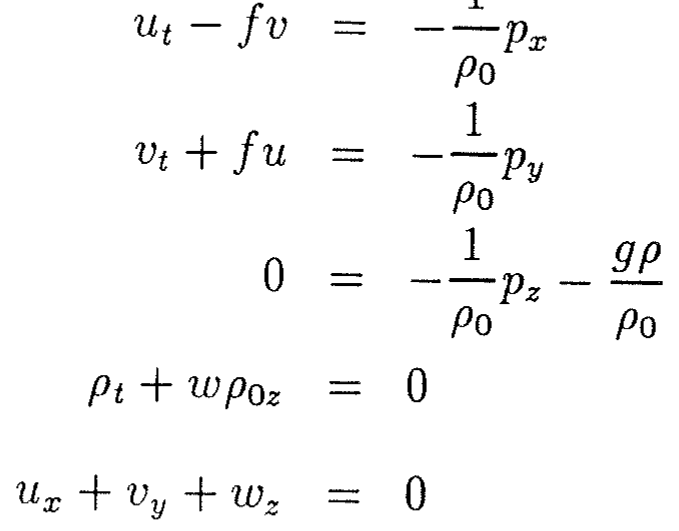](../equations/ch06-p150-e01-source.png) | [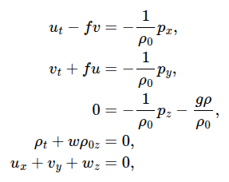](../equations/ch06-p150-e01-mathjax.png) | [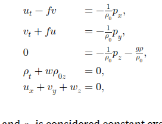](../equations/ch06-p150-e01-mathml.png) |

### p. 150 · display 2 · ch06-p150-e02

Source: [chapter6.tex](../chapter6.tex):41 · display type: `bracket`

#### Markdown math

$$
	w=-\frac{1}{\rho_0N^2}p_{zt}
$$

<details>
<summary>LaTeX source</summary>

```tex
\[
	w=-\frac{1}{\rho_0N^2}p_{zt}
\]
```

</details>

| Source PDF | MathJax | MathML |
| --- | --- | --- |
| [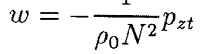](../equations/ch06-p150-e02-source.png) | [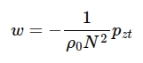](../equations/ch06-p150-e02-mathjax.png) | [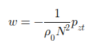](../equations/ch06-p150-e02-mathml.png) |

### p. 150 · display 3 · ch06-p150-e03

Source: [chapter6.tex](../chapter6.tex):45 · display type: `align*`

#### Markdown math

$$
\begin{aligned}
	\left(\frac{\partial^2}{\partial t^2}+f^2\right)u
	 & =-\frac{1}{\rho_0}p_{xt}-\frac{f}{\rho_0}p_y, \\
	\left(\frac{\partial^2}{\partial t^2}+f^2\right)v
	 & =-\frac{1}{\rho_0}p_{yt}+\frac{f}{\rho_0}p_x.
\end{aligned}
$$

<details>
<summary>LaTeX source</summary>

```tex
\begin{align*}
	\left(\frac{\partial^2}{\partial t^2}+f^2\right)u
	 & =-\frac{1}{\rho_0}p_{xt}-\frac{f}{\rho_0}p_y, \\
	\left(\frac{\partial^2}{\partial t^2}+f^2\right)v
	 & =-\frac{1}{\rho_0}p_{yt}+\frac{f}{\rho_0}p_x.
\end{align*}
```

</details>

| Source PDF | MathJax | MathML |
| --- | --- | --- |
| [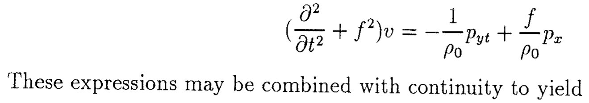](../equations/ch06-p150-e03-source.png) | [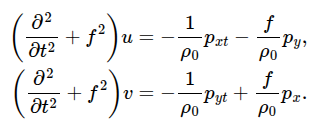](../equations/ch06-p150-e03-mathjax.png) | [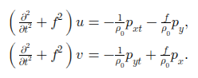](../equations/ch06-p150-e03-mathml.png) |

### p. 150 · display 4 · ch06-p150-e04

Source: [chapter6.tex](../chapter6.tex):52 · display type: `bracket`

#### Markdown math

$$
	\left[
		p_{xx}+p_{yy}
		+\left(\frac{\partial^2}{\partial t^2}+f^2\right)
		\left(\frac{p_z}{N^2}\right)_z
		\right]_t=0.
$$

<details>
<summary>LaTeX source</summary>

```tex
\[
	\left[
		p_{xx}+p_{yy}
		+\left(\frac{\partial^2}{\partial t^2}+f^2\right)
		\left(\frac{p_z}{N^2}\right)_z
		\right]_t=0.
\]
```

</details>

| Source PDF | MathJax | MathML |
| --- | --- | --- |
| [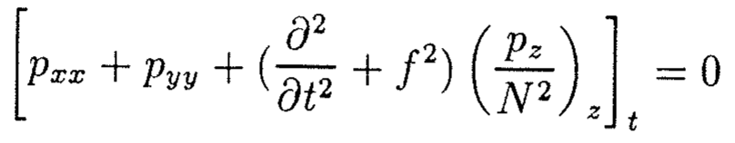](../equations/ch06-p150-e04-source.png) | [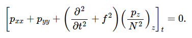](../equations/ch06-p150-e04-mathjax.png) | [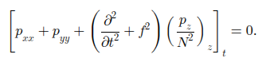](../equations/ch06-p150-e04-mathml.png) |

### p. 150 · display 5 · ch06-p150-e05

Source: [chapter6.tex](../chapter6.tex):60 · display type: `bracket`

#### Markdown math

$$
	p_{xx}+p_{yy}+(f^2-\sigma^2)
	\left(\frac{p_z}{N^2}\right)_z=0.
$$

<details>
<summary>LaTeX source</summary>

```tex
\[
	p_{xx}+p_{yy}+(f^2-\sigma^2)
	\left(\frac{p_z}{N^2}\right)_z=0.
\]
```

</details>

| Source PDF | MathJax | MathML |
| --- | --- | --- |
| [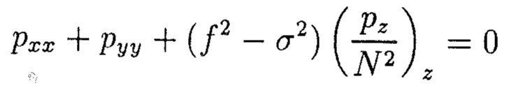](../equations/ch06-p150-e05-source.png) | [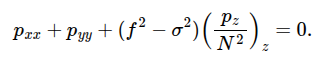](../equations/ch06-p150-e05-mathjax.png) | [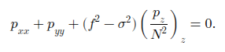](../equations/ch06-p150-e05-mathml.png) |

### p. 151 · display 1 · ch06-p151-e01

Source: [chapter6.tex](../chapter6.tex):78 · display type: `align*`

#### Markdown math

$$
\begin{aligned}
	v=0        & \quad\Rightarrow\quad i\sigma p_y+fp_x=0
	           &                                          & \text{at }y=0,L,         \\
	w=0        & \quad\Rightarrow\quad p_z=0
	           &                                          & \text{at }z=0,           \\
	w=\alpha v & \quad\Rightarrow\quad
	i\sigma(f^2-\sigma^2)p_z
	=\alpha N^2(i\sigma p_y+fp_x)
	           &                                          & \text{at }z=-H+\alpha y.
\end{aligned}
$$

<details>
<summary>LaTeX source</summary>

```tex
\begin{align*}
	v=0        & \quad\Rightarrow\quad i\sigma p_y+fp_x=0
	           &                                          & \text{at }y=0,L,         \\
	w=0        & \quad\Rightarrow\quad p_z=0
	           &                                          & \text{at }z=0,           \\
	w=\alpha v & \quad\Rightarrow\quad
	i\sigma(f^2-\sigma^2)p_z
	=\alpha N^2(i\sigma p_y+fp_x)
	           &                                          & \text{at }z=-H+\alpha y.
\end{align*}
```

</details>

| Source PDF | MathJax | MathML |
| --- | --- | --- |
| [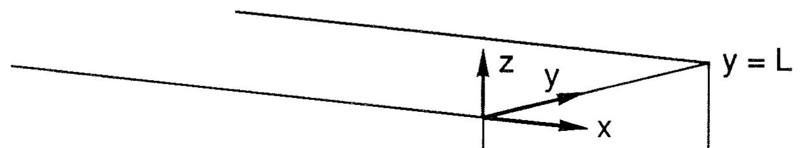](../equations/ch06-p151-e01-source.png) | [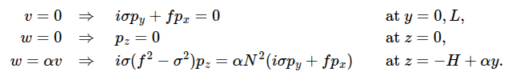](../equations/ch06-p151-e01-mathjax.png) | [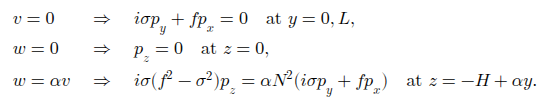](../equations/ch06-p151-e01-mathml.png) |

### p. 151 · display 2 · ch06-p151-e02

Source: [chapter6.tex](../chapter6.tex):90 · display type: `align*`

#### Markdown math

$$
\begin{aligned}
	p_{xx}+p_{yy}+\frac{1-\omega^2}{S^2}p_{zz} & =0,                                                                        \\
	i\omega p_y+p_x                            & =0                           &                          & \text{at }y=0,1, \\
	p_z                                        & =0                           &                          & \text{at }z=0,   \\
	i\omega(1-\omega^2)p_z
	                                           & =\delta S^2(i\omega p_y+p_x)
	                                           &                              & \text{at }z=-1+\delta y,
\end{aligned}
$$

<details>
<summary>LaTeX source</summary>

```tex
\begin{align*}
	p_{xx}+p_{yy}+\frac{1-\omega^2}{S^2}p_{zz} & =0,                                                                        \\
	i\omega p_y+p_x                            & =0                           &                          & \text{at }y=0,1, \\
	p_z                                        & =0                           &                          & \text{at }z=0,   \\
	i\omega(1-\omega^2)p_z
	                                           & =\delta S^2(i\omega p_y+p_x)
	                                           &                              & \text{at }z=-1+\delta y,
\end{align*}
```

</details>

| Source PDF | MathJax | MathML |
| --- | --- | --- |
| [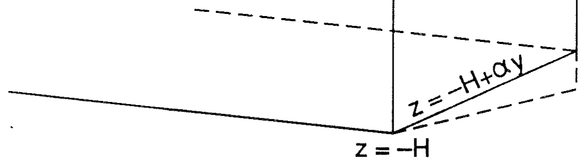](../equations/ch06-p151-e02-source.png) | [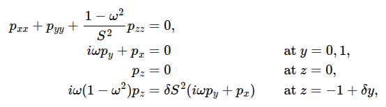](../equations/ch06-p151-e02-mathjax.png) | [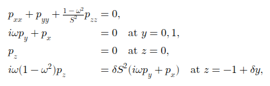](../equations/ch06-p151-e02-mathml.png) |

### p. 152 · display 1 · ch06-p152-e01

Source: [chapter6.tex](../chapter6.tex):115 · display type: `wavealign`

#### Markdown math

$$
\begin{aligned}
	p_{xx}+p_{yy}+\frac{1}{S^2}p_{zz}&=0,\\
	p_x&=0 &&\text{at }y=0,1,\\
	p_z&=0 &&\text{at }z=0,\\
	i\omega p_z&=\delta S^2p_x &&\text{at }z=-1.
\end{aligned}
$$

<details>
<summary>LaTeX source</summary>

```tex
\begin{wavealign}
	p_{xx}+p_{yy}+\frac{1}{S^2}p_{zz}&=0,\\
	p_x&=0 &&\text{at }y=0,1,\\
	p_z&=0 &&\text{at }z=0,\\
	i\omega p_z&=\delta S^2p_x &&\text{at }z=-1.
\end{wavealign}
```

</details>

| Source PDF | MathJax | MathML |
| --- | --- | --- |
| [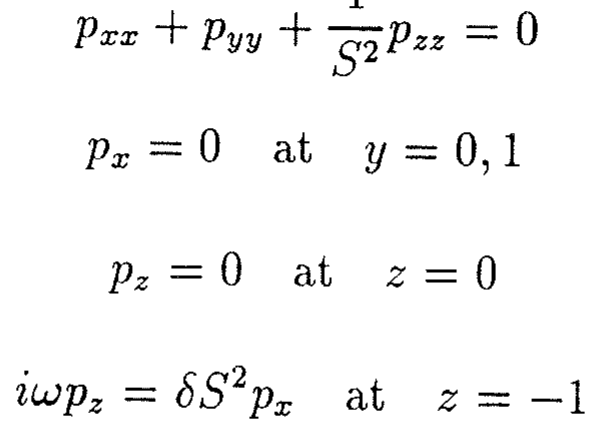](../equations/ch06-p152-e01-source.png) | [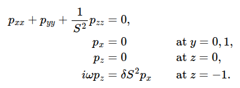](../equations/ch06-p152-e01-mathjax.png) | [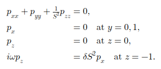](../equations/ch06-p152-e01-mathml.png) |

### p. 152 · display 2 · ch06-p152-e02

Source: [chapter6.tex](../chapter6.tex):124 · display type: `bracket`

#### Markdown math

$$
	p=e^{ikx}\sin(n\pi y)\cosh\mu z
$$

<details>
<summary>LaTeX source</summary>

```tex
\[
	p=e^{ikx}\sin(n\pi y)\cosh\mu z
\]
```

</details>

| Source PDF | MathJax | MathML |
| --- | --- | --- |
| [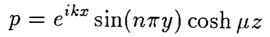](../equations/ch06-p152-e02-source.png) | [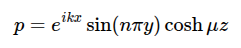](../equations/ch06-p152-e02-mathjax.png) | [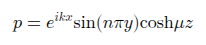](../equations/ch06-p152-e02-mathml.png) |

### p. 152 · display 3 · ch06-p152-e03

Source: [chapter6.tex](../chapter6.tex):134 · display type: `waveequation`

#### Markdown math

$$
	\omega=-\frac{\delta kS^2}{\mu\tanh\mu}.
$$

<details>
<summary>LaTeX source</summary>

```tex
\begin{waveequation}
	\omega=-\frac{\delta kS^2}{\mu\tanh\mu}.
\end{waveequation}
```

</details>

| Source PDF | MathJax | MathML |
| --- | --- | --- |
| [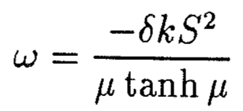](../equations/ch06-p152-e03-source.png) | [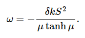](../equations/ch06-p152-e03-mathjax.png) | [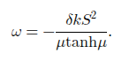](../equations/ch06-p152-e03-mathml.png) |

### p. 153 · display 1 · ch06-p153-e01

Source: [chapter6.tex](../chapter6.tex):152 · display type: `bracket`

#### Markdown math

$$
	\omega=-\frac{\delta k}{n^2\pi^2+k^2}
$$

<details>
<summary>LaTeX source</summary>

```tex
\[
	\omega=-\frac{\delta k}{n^2\pi^2+k^2}
\]
```

</details>

| Source PDF | MathJax | MathML |
| --- | --- | --- |
| [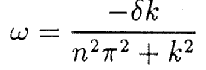](../equations/ch06-p153-e01-source.png) | [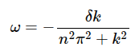](../equations/ch06-p153-e01-mathjax.png) | [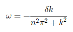](../equations/ch06-p153-e01-mathml.png) |

### p. 153 · display 2 · ch06-p153-e02

Source: [chapter6.tex](../chapter6.tex):156 · display type: `waveequation`

#### Markdown math

$$
	\sigma=-\frac{\alpha kf}
	{H\{(n\pi/L)^2+k^2\}}.
$$

<details>
<summary>LaTeX source</summary>

```tex
\begin{waveequation}
	\sigma=-\frac{\alpha kf}
	{H\{(n\pi/L)^2+k^2\}}.
\end{waveequation}
```

</details>

| Source PDF | MathJax | MathML |
| --- | --- | --- |
| [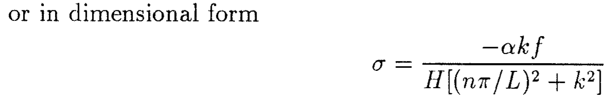](../equations/ch06-p153-e02-source.png) | [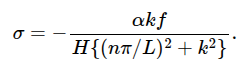](../equations/ch06-p153-e02-mathjax.png) | [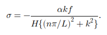](../equations/ch06-p153-e02-mathml.png) |

### p. 153 · display 3 · ch06-p153-e03

Source: [chapter6.tex](../chapter6.tex):172 · display type: `bracket`

#### Markdown math

$$
	p_{xx}+p_{yy}+\frac{f^2-\sigma^2}{N^2}p_{zz}=0
$$

<details>
<summary>LaTeX source</summary>

```tex
\[
	p_{xx}+p_{yy}+\frac{f^2-\sigma^2}{N^2}p_{zz}=0
\]
```

</details>

| Source PDF | MathJax | MathML |
| --- | --- | --- |
| [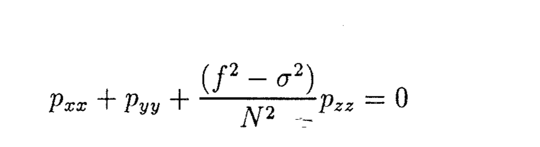](../equations/ch06-p153-e03-source.png) | [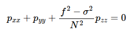](../equations/ch06-p153-e03-mathjax.png) | [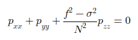](../equations/ch06-p153-e03-mathml.png) |

### p. 154 · display 1 · ch06-p154-e01

Source: [chapter6.tex](../chapter6.tex):187 · display type: `bracket`

#### Markdown math

$$
	i\sigma(f^2-\sigma^2)p_z
	=\alpha N^2(i\sigma p_x-fp_y).
$$

<details>
<summary>LaTeX source</summary>

```tex
\[
	i\sigma(f^2-\sigma^2)p_z
	=\alpha N^2(i\sigma p_x-fp_y).
\]
```

</details>

| Source PDF | MathJax | MathML |
| --- | --- | --- |
| [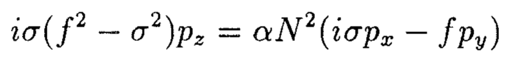](../equations/ch06-p154-e01-source.png) | [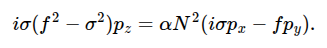](../equations/ch06-p154-e01-mathjax.png) | [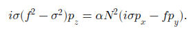](../equations/ch06-p154-e01-mathml.png) |

### p. 154 · display 2 · ch06-p154-e02

Source: [chapter6.tex](../chapter6.tex):193 · display type: `align*`

#### Markdown math

$$
\begin{aligned}
	p_{xx}-\ell^2p+p_{z'z'} & =0,                                                                       \\
	p_{z'}                  & =R\alpha\left(p_x-\frac{\ell f}{\sigma}p\right)
	                        &                                                 & \text{at }z'=R\alpha x.
\end{aligned}
$$

<details>
<summary>LaTeX source</summary>

```tex
\begin{align*}
	p_{xx}-\ell^2p+p_{z'z'} & =0,                                                                       \\
	p_{z'}                  & =R\alpha\left(p_x-\frac{\ell f}{\sigma}p\right)
	                        &                                                 & \text{at }z'=R\alpha x.
\end{align*}
```

</details>

| Source PDF | MathJax | MathML |
| --- | --- | --- |
| [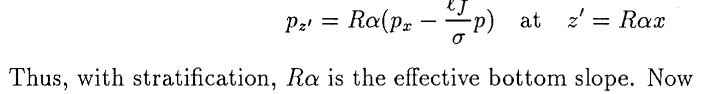](../equations/ch06-p154-e02-source.png) | [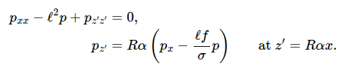](../equations/ch06-p154-e02-mathjax.png) | [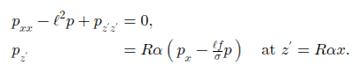](../equations/ch06-p154-e02-mathml.png) |

### p. 154 · display 3 · ch06-p154-e03

Source: [chapter6.tex](../chapter6.tex):199 · display type: `bracket`

#### Markdown math

$$
	R\alpha
	=\frac{N\alpha}{(f^2-\sigma^2)^{1/2}}
	=\frac{N\alpha/f}{(1-\omega^2)^{1/2}}
	=\frac{S}{(1-\omega^2)^{1/2}}
$$

<details>
<summary>LaTeX source</summary>

```tex
\[
	R\alpha
	=\frac{N\alpha}{(f^2-\sigma^2)^{1/2}}
	=\frac{N\alpha/f}{(1-\omega^2)^{1/2}}
	=\frac{S}{(1-\omega^2)^{1/2}}
\]
```

</details>

| Source PDF | MathJax | MathML |
| --- | --- | --- |
| [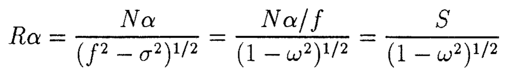](../equations/ch06-p154-e03-source.png) | [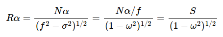](../equations/ch06-p154-e03-mathjax.png) | [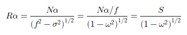](../equations/ch06-p154-e03-mathml.png) |

### p. 154 · display 4 · ch06-p154-e04

Source: [chapter6.tex](../chapter6.tex):213 · display type: `bracket`

#### Markdown math

$$
	\theta=\tan^{-1}R\alpha.
$$

<details>
<summary>LaTeX source</summary>

```tex
\[
	\theta=\tan^{-1}R\alpha.
\]
```

</details>

| Source PDF | MathJax | MathML |
| --- | --- | --- |
| [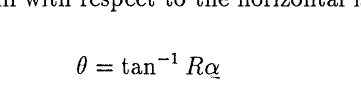](../equations/ch06-p154-e04-source.png) | [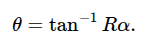](../equations/ch06-p154-e04-mathjax.png) | [](../equations/ch06-p154-e04-mathml.png) |

### p. 155 · display 1 · ch06-p155-e01

Source: [chapter6.tex](../chapter6.tex):223 · display type: `bracket`

#### Markdown math

$$
	p=e^{-i\sigma t+i\ell y
			+ik(x\cos\theta+z'\sin\theta)
			-m(z'\cos\theta-x\sin\theta)}
$$

<details>
<summary>LaTeX source</summary>

```tex
\[
	p=e^{-i\sigma t+i\ell y
			+ik(x\cos\theta+z'\sin\theta)
			-m(z'\cos\theta-x\sin\theta)}
\]
```

</details>

| Source PDF | MathJax | MathML |
| --- | --- | --- |
| [](../equations/ch06-p155-e01-source.png) | [](../equations/ch06-p155-e01-mathjax.png) | [](../equations/ch06-p155-e01-mathml.png) |

### p. 155 · display 2 · ch06-p155-e02

Source: [chapter6.tex](../chapter6.tex):233 · display type: `bracket`

#### Markdown math

$$
	m^2=k^2+\ell^2.
$$

<details>
<summary>LaTeX source</summary>

```tex
\[
	m^2=k^2+\ell^2.
\]
```

</details>

| Source PDF | MathJax | MathML |
| --- | --- | --- |
| [](../equations/ch06-p155-e02-source.png) | [](../equations/ch06-p155-e02-mathjax.png) | [](../equations/ch06-p155-e02-mathml.png) |

### p. 155 · display 3 · ch06-p155-e03

Source: [chapter6.tex](../chapter6.tex):238 · display type: `waveequation`

#### Markdown math

$$
	m=\frac{\ell}{\omega}
	\left(\frac{S^2}{1-\omega^2+S^2}\right)^{1/2}
$$

<details>
<summary>LaTeX source</summary>

```tex
\begin{waveequation}
	m=\frac{\ell}{\omega}
	\left(\frac{S^2}{1-\omega^2+S^2}\right)^{1/2}
\end{waveequation}
```

</details>

| Source PDF | MathJax | MathML |
| --- | --- | --- |
| [](../equations/ch06-p155-e03-source.png) | [](../equations/ch06-p155-e03-mathjax.png) | [](../equations/ch06-p155-e03-mathml.png) |

### p. 155 · display 4 · ch06-p155-e04

Source: [chapter6.tex](../chapter6.tex):242 · display type: `waveequation`

#### Markdown math

$$
	k=\frac{\ell}{\omega}
	\left[
		\frac{(S^2-\omega^2)(1-\omega^2)}
		{1-\omega^2+S^2}
		\right]^{1/2}.
$$

<details>
<summary>LaTeX source</summary>

```tex
\begin{waveequation}
	k=\frac{\ell}{\omega}
	\left[
		\frac{(S^2-\omega^2)(1-\omega^2)}
		{1-\omega^2+S^2}
		\right]^{1/2}.
\end{waveequation}
```

</details>

| Source PDF | MathJax | MathML |
| --- | --- | --- |
| [](../equations/ch06-p155-e04-source.png) | [](../equations/ch06-p155-e04-mathjax.png) | [](../equations/ch06-p155-e04-mathml.png) |

### p. 157 · display 1 · ch06-p157-e01

Source: [chapter6.tex](../chapter6.tex):300 · display type: `align*`

#### Markdown math

$$
\begin{aligned}
	u_t-fv        & =-g\eta_x,
	              & v_t+fu     & =-g\eta_y, \\
	(uD)_x+(vD)_y & =0.
\end{aligned}
$$

<details>
<summary>LaTeX source</summary>

```tex
\begin{align*}
	u_t-fv        & =-g\eta_x,
	              & v_t+fu     & =-g\eta_y, \\
	(uD)_x+(vD)_y & =0.
\end{align*}
```

</details>

| Source PDF | MathJax | MathML |
| --- | --- | --- |
| [](../equations/ch06-p157-e01-source.png) | [](../equations/ch06-p157-e01-mathjax.png) | [](../equations/ch06-p157-e01-mathml.png) |

### p. 157 · display 2 · ch06-p157-e02

Source: [chapter6.tex](../chapter6.tex):306 · display type: `bracket`

#### Markdown math

$$
	uD=\psi_y,
	\qquad
	vD=-\psi_x.
$$

<details>
<summary>LaTeX source</summary>

```tex
\[
	uD=\psi_y,
	\qquad
	vD=-\psi_x.
\]
```

</details>

| Source PDF | MathJax | MathML |
| --- | --- | --- |
| [](../equations/ch06-p157-e02-source.png) | [](../equations/ch06-p157-e02-mathjax.png) | [](../equations/ch06-p157-e02-mathml.png) |

### p. 157 · display 3 · ch06-p157-e03

Source: [chapter6.tex](../chapter6.tex):313 · display type: `bracket`

#### Markdown math

$$
	\left[
		\left(\frac{1}{D}\psi_x\right)_x
		+\left(\frac{1}{D}\psi_y\right)_y
		\right]_t
	+f\left[
		\left(\frac{1}{D}\right)_y\psi_x
		-\left(\frac{1}{D}\right)_x\psi_y
		\right]=0.
$$

<details>
<summary>LaTeX source</summary>

```tex
\[
	\left[
		\left(\frac{1}{D}\psi_x\right)_x
		+\left(\frac{1}{D}\psi_y\right)_y
		\right]_t
	+f\left[
		\left(\frac{1}{D}\right)_y\psi_x
		-\left(\frac{1}{D}\right)_x\psi_y
		\right]=0.
\]
```

</details>

| Source PDF | MathJax | MathML |
| --- | --- | --- |
| [](../equations/ch06-p157-e03-source.png) | [](../equations/ch06-p157-e03-mathjax.png) | [](../equations/ch06-p157-e03-mathml.png) |

### p. 157 · display 4 · ch06-p157-e04

Source: [chapter6.tex](../chapter6.tex):324 · display type: `bracket`

#### Markdown math

$$
	\left(\psi_{xx}+\psi_{yy}-\frac{D_x}{D}\psi_x\right)_t
	+\frac{fD_x}{D}\psi_y=0.
$$

<details>
<summary>LaTeX source</summary>

```tex
\[
	\left(\psi_{xx}+\psi_{yy}-\frac{D_x}{D}\psi_x\right)_t
	+\frac{fD_x}{D}\psi_y=0.
\]
```

</details>

| Source PDF | MathJax | MathML |
| --- | --- | --- |
| [](../equations/ch06-p157-e04-source.png) | [](../equations/ch06-p157-e04-mathjax.png) | [](../equations/ch06-p157-e04-mathml.png) |

### p. 157 · display 5 · ch06-p157-e05

Source: [chapter6.tex](../chapter6.tex):330 · display type: `bracket`

#### Markdown math

$$
	D=\begin{cases}
		D_0e^{2bx}, & 0<x<L, \\
		D_0e^{2bL}, & x>L.
	\end{cases}
$$

<details>
<summary>LaTeX source</summary>

```tex
\[
	D=\begin{cases}
		D_0e^{2bx}, & 0<x<L, \\
		D_0e^{2bL}, & x>L.
	\end{cases}
\]
```

</details>

| Source PDF | MathJax | MathML |
| --- | --- | --- |
| [](../equations/ch06-p157-e05-source.png) | [](../equations/ch06-p157-e05-mathjax.png) | [](../equations/ch06-p157-e05-mathml.png) |

### p. 158 · display 1 · ch06-p158-e01

Source: [chapter6.tex](../chapter6.tex):343 · display type: `bracket`

#### Markdown math

$$
	\psi_{xx}-2b\psi_x
	-\left(\frac{2bf\ell}{\sigma}+\ell^2\right)\psi=0
$$

<details>
<summary>LaTeX source</summary>

```tex
\[
	\psi_{xx}-2b\psi_x
	-\left(\frac{2bf\ell}{\sigma}+\ell^2\right)\psi=0
\]
```

</details>

| Source PDF | MathJax | MathML |
| --- | --- | --- |
| [](../equations/ch06-p158-e01-source.png) | [](../equations/ch06-p158-e01-mathjax.png) | [](../equations/ch06-p158-e01-mathml.png) |

### p. 158 · display 2 · ch06-p158-e02

Source: [chapter6.tex](../chapter6.tex):348 · display type: `bracket`

#### Markdown math

$$
	\psi_{xx}-\ell^2\psi=0.
$$

<details>
<summary>LaTeX source</summary>

```tex
\[
	\psi_{xx}-\ell^2\psi=0.
\]
```

</details>

| Source PDF | MathJax | MathML |
| --- | --- | --- |
| [](../equations/ch06-p158-e02-source.png) | [](../equations/ch06-p158-e02-mathjax.png) | [](../equations/ch06-p158-e02-mathml.png) |

### p. 158 · display 3 · ch06-p158-e03

Source: [chapter6.tex](../chapter6.tex):353 · display type: `bracket`

#### Markdown math

$$
	u=0\quad\Rightarrow\quad\psi=0\quad\text{at }x=0,
$$

<details>
<summary>LaTeX source</summary>

```tex
\[
	u=0\quad\Rightarrow\quad\psi=0\quad\text{at }x=0,
\]
```

</details>

| Source PDF | MathJax | MathML |
| --- | --- | --- |
| [](../equations/ch06-p158-e03-source.png) | [](../equations/ch06-p158-e03-mathjax.png) | [](../equations/ch06-p158-e03-mathml.png) |

### p. 158 · display 4 · ch06-p158-e04

Source: [chapter6.tex](../chapter6.tex):356 · display type: `bracket`

#### Markdown math

$$
	\psi\to0\quad\text{as }x\to\infty.
$$

<details>
<summary>LaTeX source</summary>

```tex
\[
	\psi\to0\quad\text{as }x\to\infty.
\]
```

</details>

| Source PDF | MathJax | MathML |
| --- | --- | --- |
| [](../equations/ch06-p158-e04-source.png) | [](../equations/ch06-p158-e04-mathjax.png) | [](../equations/ch06-p158-e04-mathml.png) |

### p. 158 · display 5 · ch06-p158-e05

Source: [chapter6.tex](../chapter6.tex):360 · display type: `bracket`

#### Markdown math

$$
	\psi=Ae^{b(x-L)}\sin kx.
$$

<details>
<summary>LaTeX source</summary>

```tex
\[
	\psi=Ae^{b(x-L)}\sin kx.
\]
```

</details>

| Source PDF | MathJax | MathML |
| --- | --- | --- |
| [](../equations/ch06-p158-e05-source.png) | [](../equations/ch06-p158-e05-mathjax.png) | [](../equations/ch06-p158-e05-mathml.png) |

### p. 158 · display 6 · ch06-p158-e06

Source: [chapter6.tex](../chapter6.tex):364 · display type: `waveequation`

#### Markdown math

$$
	\sigma=-\frac{2bf\ell}{\ell^2+k^2+b^2}
$$

<details>
<summary>LaTeX source</summary>

```tex
\begin{waveequation}
	\sigma=-\frac{2bf\ell}{\ell^2+k^2+b^2}
\end{waveequation}
```

</details>

| Source PDF | MathJax | MathML |
| --- | --- | --- |
| [](../equations/ch06-p158-e06-source.png) | [](../equations/ch06-p158-e06-mathjax.png) | [](../equations/ch06-p158-e06-mathml.png) |

### p. 158 · display 7 · ch06-p158-e07

Source: [chapter6.tex](../chapter6.tex):372 · display type: `bracket`

#### Markdown math

$$
	\psi=Be^{\ell(x-L)}.
$$

<details>
<summary>LaTeX source</summary>

```tex
\[
	\psi=Be^{\ell(x-L)}.
\]
```

</details>

| Source PDF | MathJax | MathML |
| --- | --- | --- |
| [](../equations/ch06-p158-e07-source.png) | [](../equations/ch06-p158-e07-mathjax.png) | [](../equations/ch06-p158-e07-mathml.png) |

### p. 158 · display 8 · ch06-p158-e08

Source: [chapter6.tex](../chapter6.tex):377 · display type: `bracket`

#### Markdown math

$$
	\tan kL=\frac{-k}{-\ell+b}=\frac{k}{\ell-b}.
$$

<details>
<summary>LaTeX source</summary>

```tex
\[
	\tan kL=\frac{-k}{-\ell+b}=\frac{k}{\ell-b}.
\]
```

</details>

| Source PDF | MathJax | MathML |
| --- | --- | --- |
| [](../equations/ch06-p158-e08-source.png) | [](../equations/ch06-p158-e08-mathjax.png) | [](../equations/ch06-p158-e08-mathml.png) |

### p. 159 · display 1 · ch06-p159-e01

Source: [chapter6.tex](../chapter6.tex):400 · display type: `waveequation`

#### Markdown math

$$
	\left.\ell\right|_{\sigma_{\max}}=-(k^2+b^2)^{1/2}.
$$

<details>
<summary>LaTeX source</summary>

```tex
\begin{waveequation}
	\left.\ell\right|_{\sigma_{\max}}=-(k^2+b^2)^{1/2}.
\end{waveequation}
```

</details>

| Source PDF | MathJax | MathML |
| --- | --- | --- |
| [](../equations/ch06-p159-e01-source.png) | [](../equations/ch06-p159-e01-mathjax.png) | [](../equations/ch06-p159-e01-mathml.png) |

### p. 159 · display 2 · ch06-p159-e02

Source: [chapter6.tex](../chapter6.tex):407 · display type: `bracket`

#### Markdown math

$$
	\sigma=-\frac{2bf\ell}{k^2+b^2}
$$

<details>
<summary>LaTeX source</summary>

```tex
\[
	\sigma=-\frac{2bf\ell}{k^2+b^2}
\]
```

</details>

| Source PDF | MathJax | MathML |
| --- | --- | --- |
| [](../equations/ch06-p159-e02-source.png) | [](../equations/ch06-p159-e02-mathjax.png) | [](../equations/ch06-p159-e02-mathml.png) |

### p. 160 · display 1 · ch06-p160-e01

Source: [chapter6.tex](../chapter6.tex):433 · display type: `align*`

#### Markdown math

$$
\begin{aligned}
	u_t-fv               & =-g\eta_x,
	                     & v_t+fu     & =-g\eta_y, \\
	\eta_t+(uD)_x+(vD)_y & =0.
\end{aligned}
$$

<details>
<summary>LaTeX source</summary>

```tex
\begin{align*}
	u_t-fv               & =-g\eta_x,
	                     & v_t+fu     & =-g\eta_y, \\
	\eta_t+(uD)_x+(vD)_y & =0.
\end{align*}
```

</details>

| Source PDF | MathJax | MathML |
| --- | --- | --- |
| [](../equations/ch06-p160-e01-source.png) | [](../equations/ch06-p160-e01-mathjax.png) | [](../equations/ch06-p160-e01-mathml.png) |

### p. 160 · display 2 · ch06-p160-e02

Source: [chapter6.tex](../chapter6.tex):441 · display type: `waveequation`

#### Markdown math

$$
	(D\eta_x)_x-K\eta=0,
	\qquad
	K=\frac{f\ell}{\sigma}D_x+\ell^2D+\frac{f^2-\sigma^2}{g}.
$$

<details>
<summary>LaTeX source</summary>

```tex
\begin{waveequation}
	(D\eta_x)_x-K\eta=0,
	\qquad
	K=\frac{f\ell}{\sigma}D_x+\ell^2D+\frac{f^2-\sigma^2}{g}.
\end{waveequation}
```

</details>

| Source PDF | MathJax | MathML |
| --- | --- | --- |
| [](../equations/ch06-p160-e02-source.png) | [](../equations/ch06-p160-e02-mathjax.png) | [](../equations/ch06-p160-e02-mathml.png) |

### p. 160 · display 3 · ch06-p160-e03

Source: [chapter6.tex](../chapter6.tex):447 · display type: `bracket`

#### Markdown math

$$
	uD=0\quad\Rightarrow\quad
	D\left(\eta_x-\frac{f\ell}{\sigma}\eta\right)=0
	\quad\text{at }x=0,
$$

<details>
<summary>LaTeX source</summary>

```tex
\[
	uD=0\quad\Rightarrow\quad
	D\left(\eta_x-\frac{f\ell}{\sigma}\eta\right)=0
	\quad\text{at }x=0,
\]
```

</details>

| Source PDF | MathJax | MathML |
| --- | --- | --- |
| [](../equations/ch06-p160-e03-source.png) | [](../equations/ch06-p160-e03-mathjax.png) | [](../equations/ch06-p160-e03-mathml.png) |

### p. 160 · display 4 · ch06-p160-e04

Source: [chapter6.tex](../chapter6.tex):452 · display type: `bracket`

#### Markdown math

$$
	\eta\to0\quad\text{as }x\to\infty.
$$

<details>
<summary>LaTeX source</summary>

```tex
\[
	\eta\to0\quad\text{as }x\to\infty.
\]
```

</details>

| Source PDF | MathJax | MathML |
| --- | --- | --- |
| [](../equations/ch06-p160-e04-source.png) | [](../equations/ch06-p160-e04-mathjax.png) | [](../equations/ch06-p160-e04-mathml.png) |

### p. 162 · display 1 · ch06-p162-e01

Source: [chapter6.tex](../chapter6.tex):504 · display type: `bracket`

#### Markdown math

$$
	p_{xx}-\ell^2p+\frac{f^2-\sigma^2}{N^2}p_{zz}=0,
$$

<details>
<summary>LaTeX source</summary>

```tex
\[
	p_{xx}-\ell^2p+\frac{f^2-\sigma^2}{N^2}p_{zz}=0,
\]
```

</details>

| Source PDF | MathJax | MathML |
| --- | --- | --- |
| [](../equations/ch06-p162-e01-source.png) | [](../equations/ch06-p162-e01-mathjax.png) | [](../equations/ch06-p162-e01-mathml.png) |

### p. 162 · display 2 · ch06-p162-e02

Source: [chapter6.tex](../chapter6.tex):507 · display type: `bracket`

#### Markdown math

$$
	(f^2-\sigma^2)p_z
	+N^2D_x\left(p_x-\frac{f\ell}{\sigma}p\right)=0
	\quad\text{at }z=-D(x),
$$

<details>
<summary>LaTeX source</summary>

```tex
\[
	(f^2-\sigma^2)p_z
	+N^2D_x\left(p_x-\frac{f\ell}{\sigma}p\right)=0
	\quad\text{at }z=-D(x),
\]
```

</details>

| Source PDF | MathJax | MathML |
| --- | --- | --- |
| [](../equations/ch06-p162-e02-source.png) | [](../equations/ch06-p162-e02-mathjax.png) | [](../equations/ch06-p162-e02-mathml.png) |

### p. 162 · display 3 · ch06-p162-e03

Source: [chapter6.tex](../chapter6.tex):512 · display type: `bracket`

#### Markdown math

$$
	p_z=0\quad\text{at }z=0,
$$

<details>
<summary>LaTeX source</summary>

```tex
\[
	p_z=0\quad\text{at }z=0,
\]
```

</details>

| Source PDF | MathJax | MathML |
| --- | --- | --- |
| [](../equations/ch06-p162-e03-source.png) | [](../equations/ch06-p162-e03-mathjax.png) | [](../equations/ch06-p162-e03-mathml.png) |

### p. 162 · display 4 · ch06-p162-e04

Source: [chapter6.tex](../chapter6.tex):515 · display type: `bracket`

#### Markdown math

$$
	p\to0\quad\text{as }x\to\infty.
$$

<details>
<summary>LaTeX source</summary>

```tex
\[
	p\to0\quad\text{as }x\to\infty.
\]
```

</details>

| Source PDF | MathJax | MathML |
| --- | --- | --- |
| [](../equations/ch06-p162-e04-source.png) | [](../equations/ch06-p162-e04-mathjax.png) | [](../equations/ch06-p162-e04-mathml.png) |

### p. 163 · display 1 · ch06-p163-e01

Source: [chapter6.tex](../chapter6.tex):529 · display type: `wavealign`

#### Markdown math

$$
\begin{aligned}
	p_{xx}-\ell^2p+\frac{1-\omega^2}{S^2}p_{zz}&=0,\\
	(1-\omega^2)p_z
	+S^2D_x\left(p_x-\frac{\ell}{\omega}p\right)&=0
	&&\text{at }z=-D(x),\\
	p_z&=0 &&\text{at }z=0,\\
	p&\to0 &&\text{as }x\to\infty,
\end{aligned}
$$

<details>
<summary>LaTeX source</summary>

```tex
\begin{wavealign}
	p_{xx}-\ell^2p+\frac{1-\omega^2}{S^2}p_{zz}&=0,\\
	(1-\omega^2)p_z
	+S^2D_x\left(p_x-\frac{\ell}{\omega}p\right)&=0
	&&\text{at }z=-D(x),\\
	p_z&=0 &&\text{at }z=0,\\
	p&\to0 &&\text{as }x\to\infty,
\end{wavealign}
```

</details>

| Source PDF | MathJax | MathML |
| --- | --- | --- |
| [](../equations/ch06-p163-e01-source.png) | [](../equations/ch06-p163-e01-mathjax.png) | [](../equations/ch06-p163-e01-mathml.png) |

### p. 163 · display 2 · ch06-p163-e02

Source: [chapter6.tex](../chapter6.tex):551 · display type: `bracket`

#### Markdown math

$$
		      \lim_{\ell\to-\infty}\omega=S\max[D_x].
$$

<details>
<summary>LaTeX source</summary>

```tex
	      \[
		      \lim_{\ell\to-\infty}\omega=S\max[D_x].
	      \]
```

</details>

| Source PDF | MathJax | MathML |
| --- | --- | --- |
| [](../equations/ch06-p163-e02-source.png) | [](../equations/ch06-p163-e02-mathjax.png) | [](../equations/ch06-p163-e02-mathml.png) |

### p. 165 · display 1 · ch06-p165-e01

Source: [chapter6.tex](../chapter6.tex):604 · display type: `bracket`

#### Markdown math

$$
	p(x,z)=p_0(x)+S^2p_1(x,z)+O(S^4).
$$

<details>
<summary>LaTeX source</summary>

```tex
\[
	p(x,z)=p_0(x)+S^2p_1(x,z)+O(S^4).
\]
```

</details>

| Source PDF | MathJax | MathML |
| --- | --- | --- |
| [](../equations/ch06-p165-e01-source.png) | [](../equations/ch06-p165-e01-mathjax.png) | [](../equations/ch06-p165-e01-mathml.png) |

### p. 165 · display 2 · ch06-p165-e02

Source: [chapter6.tex](../chapter6.tex):608 · display type: `bracket`

#### Markdown math

$$
	O(1):\qquad p_{0zz}=0
$$

<details>
<summary>LaTeX source</summary>

```tex
\[
	O(1):\qquad p_{0zz}=0
\]
```

</details>

| Source PDF | MathJax | MathML |
| --- | --- | --- |
| [](../equations/ch06-p165-e02-source.png) | [](../equations/ch06-p165-e02-mathjax.png) | [](../equations/ch06-p165-e02-mathml.png) |

### p. 165 · display 3 · ch06-p165-e03

Source: [chapter6.tex](../chapter6.tex):613 · display type: `bracket`

#### Markdown math

$$
	O(S^2):\qquad p_{0xx}-\ell^2p_0+(1-\omega^2)p_{1zz}=0.
$$

<details>
<summary>LaTeX source</summary>

```tex
\[
	O(S^2):\qquad p_{0xx}-\ell^2p_0+(1-\omega^2)p_{1zz}=0.
\]
```

</details>

| Source PDF | MathJax | MathML |
| --- | --- | --- |
| [](../equations/ch06-p165-e03-source.png) | [](../equations/ch06-p165-e03-mathjax.png) | [](../equations/ch06-p165-e03-mathml.png) |

### p. 166 · display 1 · ch06-p166-e01

Source: [chapter6.tex](../chapter6.tex):622 · display type: `bracket`

#### Markdown math

$$
	(1-\omega^2)p_{1z}
	+D_x\left(p_{0x}-\frac{\ell}{\omega}p_0\right)=0
	\quad\text{at }z=-D,
$$

<details>
<summary>LaTeX source</summary>

```tex
\[
	(1-\omega^2)p_{1z}
	+D_x\left(p_{0x}-\frac{\ell}{\omega}p_0\right)=0
	\quad\text{at }z=-D,
\]
```

</details>

| Source PDF | MathJax | MathML |
| --- | --- | --- |
| [](../equations/ch06-p166-e01-source.png) | [](../equations/ch06-p166-e01-mathjax.png) | [](../equations/ch06-p166-e01-mathml.png) |

### p. 166 · display 2 · ch06-p166-e02

Source: [chapter6.tex](../chapter6.tex):627 · display type: `bracket`

#### Markdown math

$$
	p_{1z}=0\quad\text{at }z=0.
$$

<details>
<summary>LaTeX source</summary>

```tex
\[
	p_{1z}=0\quad\text{at }z=0.
\]
```

</details>

| Source PDF | MathJax | MathML |
| --- | --- | --- |
| [](../equations/ch06-p166-e02-source.png) | [](../equations/ch06-p166-e02-mathjax.png) | [](../equations/ch06-p166-e02-mathml.png) |

### p. 166 · display 3 · ch06-p166-e03

Source: [chapter6.tex](../chapter6.tex):632 · display type: `waveequation`

#### Markdown math

$$
	(Dp_{0x})_x-\left(\frac{\ell}{\omega}D_x+\ell^2D\right)p_0=0
$$

<details>
<summary>LaTeX source</summary>

```tex
\begin{waveequation}
	(Dp_{0x})_x-\left(\frac{\ell}{\omega}D_x+\ell^2D\right)p_0=0
\end{waveequation}
```

</details>

| Source PDF | MathJax | MathML |
| --- | --- | --- |
| [](../equations/ch06-p166-e03-source.png) | [](../equations/ch06-p166-e03-mathjax.png) | [](../equations/ch06-p166-e03-mathml.png) |

### p. 166 · display 4 · ch06-p166-e04

Source: [chapter6.tex](../chapter6.tex):643 · display type: `bracket`

#### Markdown math

$$
	\xi=x-D^{-1}(-z),
	\qquad
	\eta=Sz
$$

<details>
<summary>LaTeX source</summary>

```tex
\[
	\xi=x-D^{-1}(-z),
	\qquad
	\eta=Sz
\]
```

</details>

| Source PDF | MathJax | MathML |
| --- | --- | --- |
| [](../equations/ch06-p166-e04-source.png) | [](../equations/ch06-p166-e04-mathjax.png) | [](../equations/ch06-p166-e04-mathml.png) |

### p. 166 · display 5 · ch06-p166-e05

Source: [chapter6.tex](../chapter6.tex):650 · display type: `align*`

#### Markdown math

$$
\begin{aligned}
	p_{\xi\xi}+(1-\omega^2)p_{\eta\eta}-\ell^2p & =0,                        \\
	D_x\left(p_\xi-\frac{\ell}{\omega}p\right)  & =0  &  & \text{at }\xi=0,  \\
	p_\eta                                      & =0  &  & \text{at }\eta=0.
\end{aligned}
$$

<details>
<summary>LaTeX source</summary>

```tex
\begin{align*}
	p_{\xi\xi}+(1-\omega^2)p_{\eta\eta}-\ell^2p & =0,                        \\
	D_x\left(p_\xi-\frac{\ell}{\omega}p\right)  & =0  &  & \text{at }\xi=0,  \\
	p_\eta                                      & =0  &  & \text{at }\eta=0.
\end{align*}
```

</details>

| Source PDF | MathJax | MathML |
| --- | --- | --- |
| [](../equations/ch06-p166-e05-source.png) | [](../equations/ch06-p166-e05-mathjax.png) | [](../equations/ch06-p166-e05-mathml.png) |

### p. 166 · display 6 · ch06-p166-e06

Source: [chapter6.tex](../chapter6.tex):657 · display type: `bracket`

#### Markdown math

$$
	p=e^{\ell\xi/\omega}
	\cos\left[\frac{\ell}{\omega}(\eta+S)\right].
$$

<details>
<summary>LaTeX source</summary>

```tex
\[
	p=e^{\ell\xi/\omega}
	\cos\left[\frac{\ell}{\omega}(\eta+S)\right].
\]
```

</details>

| Source PDF | MathJax | MathML |
| --- | --- | --- |
| [](../equations/ch06-p166-e06-source.png) | [](../equations/ch06-p166-e06-mathjax.png) | [](../equations/ch06-p166-e06-mathml.png) |

### p. 167 · display 1 · ch06-p167-e01

Source: [chapter6.tex](../chapter6.tex):669 · display type: `waveequation`

#### Markdown math

$$
	\omega=\frac{S\ell}{n\pi}.
$$

<details>
<summary>LaTeX source</summary>

```tex
\begin{waveequation}
	\omega=\frac{S\ell}{n\pi}.
\end{waveequation}
```

</details>

| Source PDF | MathJax | MathML |
| --- | --- | --- |
| [](../equations/ch06-p167-e01-source.png) | [](../equations/ch06-p167-e01-mathjax.png) | [](../equations/ch06-p167-e01-mathml.png) |

### p. 168 · display 1 · ch06-p168-e01

Source: [chapter6.tex](../chapter6.tex):717 · display type: `align*`

#### Markdown math

$$
\begin{aligned}
	-fv           & =-g\eta_x,                  \\
	v_t+fu        & =-g\eta_y+\frac{\tau^y}{D}, \\
	(uD)_x+(vD)_y & =0.
\end{aligned}
$$

<details>
<summary>LaTeX source</summary>

```tex
\begin{align*}
	-fv           & =-g\eta_x,                  \\
	v_t+fu        & =-g\eta_y+\frac{\tau^y}{D}, \\
	(uD)_x+(vD)_y & =0.
\end{align*}
```

</details>

| Source PDF | MathJax | MathML |
| --- | --- | --- |
| [](../equations/ch06-p168-e01-source.png) | [](../equations/ch06-p168-e01-mathjax.png) | [](../equations/ch06-p168-e01-mathml.png) |

### p. 168 · display 2 · ch06-p168-e02

Source: [chapter6.tex](../chapter6.tex):728 · display type: `bracket`

#### Markdown math

$$
	uD=\psi_y,
	\qquad
	vD=-\psi_x.
$$

<details>
<summary>LaTeX source</summary>

```tex
\[
	uD=\psi_y,
	\qquad
	vD=-\psi_x.
\]
```

</details>

| Source PDF | MathJax | MathML |
| --- | --- | --- |
| [](../equations/ch06-p168-e02-source.png) | [](../equations/ch06-p168-e02-mathjax.png) | [](../equations/ch06-p168-e02-mathml.png) |

### p. 169 · display 1 · ch06-p169-e01

Source: [chapter6.tex](../chapter6.tex):740 · display type: `bracket`

#### Markdown math

$$
	\left(\frac{\psi_x}{D}\right)_{xt}
	+\frac{fD_x}{D^2}\psi_y
	=\frac{D_x}{D^2}\tau^y.
$$

<details>
<summary>LaTeX source</summary>

```tex
\[
	\left(\frac{\psi_x}{D}\right)_{xt}
	+\frac{fD_x}{D^2}\psi_y
	=\frac{D_x}{D^2}\tau^y.
\]
```

</details>

| Source PDF | MathJax | MathML |
| --- | --- | --- |
| [](../equations/ch06-p169-e01-source.png) | [](../equations/ch06-p169-e01-mathjax.png) | [](../equations/ch06-p169-e01-mathml.png) |

### p. 169 · display 2 · ch06-p169-e02

Source: [chapter6.tex](../chapter6.tex):752 · display type: `bracket`

#### Markdown math

$$
	\psi(x,y,t)=\phi(y,t)F(x).
$$

<details>
<summary>LaTeX source</summary>

```tex
\[
	\psi(x,y,t)=\phi(y,t)F(x).
\]
```

</details>

| Source PDF | MathJax | MathML |
| --- | --- | --- |
| [](../equations/ch06-p169-e02-source.png) | [](../equations/ch06-p169-e02-mathjax.png) | [](../equations/ch06-p169-e02-mathml.png) |

### p. 169 · display 3 · ch06-p169-e03

Source: [chapter6.tex](../chapter6.tex):756 · display type: `bracket`

#### Markdown math

$$
	\phi_t\left(\frac{F_x}{D}\right)_x
	+\frac{fD_x}{D^2}\phi_yF=0
$$

<details>
<summary>LaTeX source</summary>

```tex
\[
	\phi_t\left(\frac{F_x}{D}\right)_x
	+\frac{fD_x}{D^2}\phi_yF=0
\]
```

</details>

| Source PDF | MathJax | MathML |
| --- | --- | --- |
| [](../equations/ch06-p169-e03-source.png) | [](../equations/ch06-p169-e03-mathjax.png) | [](../equations/ch06-p169-e03-mathml.png) |

### p. 169 · display 4 · ch06-p169-e04

Source: [chapter6.tex](../chapter6.tex):761 · display type: `bracket`

#### Markdown math

$$
	\frac{1}{c}\phi_t-\phi_y=0
$$

<details>
<summary>LaTeX source</summary>

```tex
\[
	\frac{1}{c}\phi_t-\phi_y=0
\]
```

</details>

| Source PDF | MathJax | MathML |
| --- | --- | --- |
| [](../equations/ch06-p169-e04-source.png) | [](../equations/ch06-p169-e04-mathjax.png) | [](../equations/ch06-p169-e04-mathml.png) |

### p. 169 · display 5 · ch06-p169-e05

Source: [chapter6.tex](../chapter6.tex):764 · display type: `waveequation`

#### Markdown math

$$
	\left(\frac{F_x}{D}\right)_x
	+\frac{fD_x}{cD^2}F=0
$$

<details>
<summary>LaTeX source</summary>

```tex
\begin{waveequation}
	\left(\frac{F_x}{D}\right)_x
	+\frac{fD_x}{cD^2}F=0
\end{waveequation}
```

</details>

| Source PDF | MathJax | MathML |
| --- | --- | --- |
| [](../equations/ch06-p169-e05-source.png) | [](../equations/ch06-p169-e05-mathjax.png) | [](../equations/ch06-p169-e05-mathml.png) |

### p. 169 · display 6 · ch06-p169-e06

Source: [chapter6.tex](../chapter6.tex):773 · display type: `waveequation`

#### Markdown math

$$
	\int_0^L\frac{D_x}{D^2}F_nF_m\,dx=\delta_{nm}
$$

<details>
<summary>LaTeX source</summary>

```tex
\begin{waveequation}
	\int_0^L\frac{D_x}{D^2}F_nF_m\,dx=\delta_{nm}
\end{waveequation}
```

</details>

| Source PDF | MathJax | MathML |
| --- | --- | --- |
| [](../equations/ch06-p169-e06-source.png) | [](../equations/ch06-p169-e06-mathjax.png) | [](../equations/ch06-p169-e06-mathml.png) |

### p. 169 · display 7 · ch06-p169-e07

Source: [chapter6.tex](../chapter6.tex):779 · display type: `bracket`

#### Markdown math

$$
	\phi=\phi_0(y+ct).
$$

<details>
<summary>LaTeX source</summary>

```tex
\[
	\phi=\phi_0(y+ct).
\]
```

</details>

| Source PDF | MathJax | MathML |
| --- | --- | --- |
| [](../equations/ch06-p169-e07-source.png) | [](../equations/ch06-p169-e07-mathjax.png) | [](../equations/ch06-p169-e07-mathml.png) |

### p. 170 · display 1 · ch06-p170-e01

Source: [chapter6.tex](../chapter6.tex):795 · display type: `bracket`

#### Markdown math

$$
	\psi(x,y,t)=\sum_n\phi_n(y,t)F_n(x).
$$

<details>
<summary>LaTeX source</summary>

```tex
\[
	\psi(x,y,t)=\sum_n\phi_n(y,t)F_n(x).
\]
```

</details>

| Source PDF | MathJax | MathML |
| --- | --- | --- |
| [](../equations/ch06-p170-e01-source.png) | [](../equations/ch06-p170-e01-mathjax.png) | [](../equations/ch06-p170-e01-mathml.png) |

### p. 170 · display 2 · ch06-p170-e02

Source: [chapter6.tex](../chapter6.tex):800 · display type: `waveequation`

#### Markdown math

$$
	\frac{1}{c_n}\phi_{nt}-\phi_{ny}=-b_n\tau^y
$$

<details>
<summary>LaTeX source</summary>

```tex
\begin{waveequation}
	\frac{1}{c_n}\phi_{nt}-\phi_{ny}=-b_n\tau^y
\end{waveequation}
```

</details>

| Source PDF | MathJax | MathML |
| --- | --- | --- |
| [](../equations/ch06-p170-e02-source.png) | [](../equations/ch06-p170-e02-mathjax.png) | [](../equations/ch06-p170-e02-mathml.png) |

### p. 170 · display 3 · ch06-p170-e03

Source: [chapter6.tex](../chapter6.tex):804 · display type: `bracket`

#### Markdown math

$$
	b_n=\frac{1}{f}\int_0^L\frac{D_x}{D^2}F_n\,dx
$$

<details>
<summary>LaTeX source</summary>

```tex
\[
	b_n=\frac{1}{f}\int_0^L\frac{D_x}{D^2}F_n\,dx
\]
```

</details>

| Source PDF | MathJax | MathML |
| --- | --- | --- |
| [](../equations/ch06-p170-e03-source.png) | [](../equations/ch06-p170-e03-mathjax.png) | [](../equations/ch06-p170-e03-mathml.png) |

### p. 170 · display 4 · ch06-p170-e04

Source: [chapter6.tex](../chapter6.tex):809 · display type: `bracket`

#### Markdown math

$$
	\phi_n(y,t)
	=\phi_n\left(0,t+\frac{y}{c_n}\right)
	+b_n\int_0^y
	\tau^y\left(\xi,t+\frac{y-\xi}{c_n}\right)d\xi.
$$

<details>
<summary>LaTeX source</summary>

```tex
\[
	\phi_n(y,t)
	=\phi_n\left(0,t+\frac{y}{c_n}\right)
	+b_n\int_0^y
	\tau^y\left(\xi,t+\frac{y-\xi}{c_n}\right)d\xi.
\]
```

</details>

| Source PDF | MathJax | MathML |
| --- | --- | --- |
| [](../equations/ch06-p170-e04-source.png) | [](../equations/ch06-p170-e04-mathjax.png) | [](../equations/ch06-p170-e04-mathml.png) |
