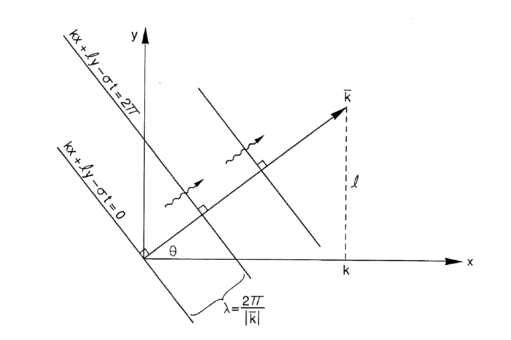
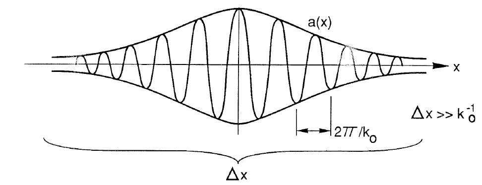
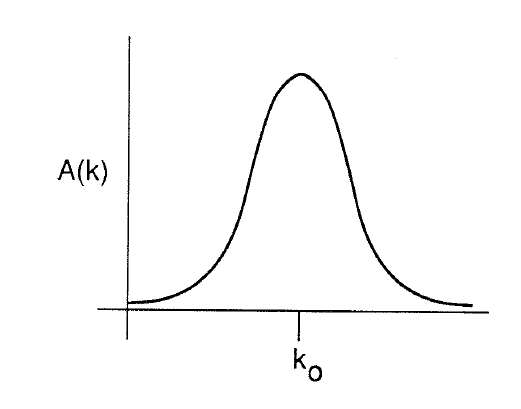
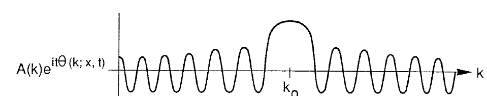
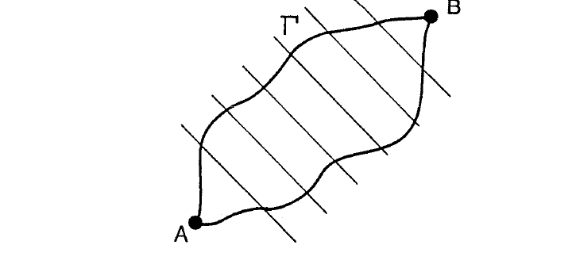
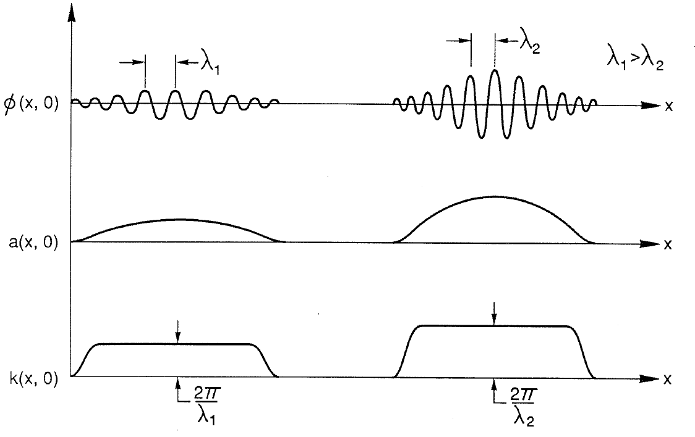
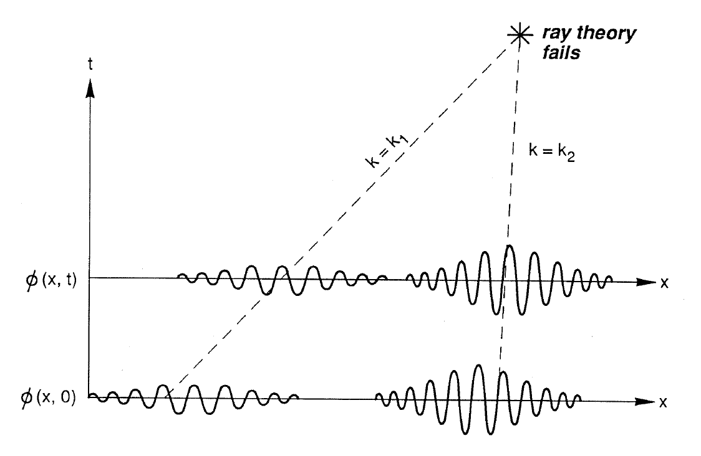

# Figure audit — Chapter 1

[Back to the figure audit landing page](../FIGURES.md)

This chapter ledger contains scientific and technical figure placements only.
Entries follow printed page, figure order on the page, and component asset.

#### Figure 1.1 — phase speed

<table>
<tr><th>Original</th><th>Vector</th></tr>
<tr>
  <td></td>
  <td></td>
</tr>
</table>

- **Asset:** `ch01-p004-phase-speed.tikz`
- **Printed page:** 4
- **Representation:** vector
- **Equation check:** ai-checked
- **Scientific check:** Constant-phase planes are normal to `\vec{k}`; adjacent planes separated by `2 pi` in phase have normal spacing `lambda=2 pi/\lvert\vec{k}\rvert`. The wavy propagation arrows follow `+\vec{k}`; display geometry remains schematic.

#### Figure 1.2 — wave packet

<table>
<tr><th>Original</th><th>Vector</th></tr>
<tr>
  <td></td>
  <td></td>
</tr>
</table>

- **Asset:** `ch01-p008-wave-packet.tikz`
- **Printed page:** 8
- **Representation:** vector
- **Equation check:** ai-checked
- **Scientific check:** The carrier `cos(250 x)` uses degree arguments in PGF, giving exact display period `360/250=1.44`, equal to the wavelength bracket `3.62-2.18`; the envelope scale is independently much larger than `k_0^{-1}`.

#### Figure 1.3 — spectrum

<table>
<tr><th>Original</th><th>Vector</th></tr>
<tr>
  <td></td>
  <td></td>
</tr>
</table>

- **Asset:** `ch01-p008-spectrum.tikz`
- **Printed page:** 8
- **Representation:** vector
- **Equation check:** n/a
- **Scientific check:** Narrow-band spectrum is centered at `k_0`; labels do not obscure the curve.

#### Figure 1.4 — stationary phase

<table>
<tr><th>Original</th><th>Vector</th></tr>
<tr>
  <td></td>
  <td></td>
</tr>
</table>

- **Asset:** `ch01-p010-stationary-phase.tikz`
- **Printed page:** 10
- **Representation:** vector
- **Equation check:** ai-checked
- **Scientific check:** The displayed phase is quadratic in `k-k_0`; its derivative vanishes only at `k_0`, so oscillation spacing is broad there and tightens symmetrically with `\lvert k-k_0\rvert`. The modest central envelope is an explicit schematic/source-fidelity amplitude cue, not a consequence of stationary phase or the narrow-band `A(k)` example.

#### Figure 1.5 — wave crest path

<table>
<tr><th>Original</th><th>Vector</th></tr>
<tr>
  <td></td>
  <td></td>
</tr>
</table>

- **Asset:** `ch01-p012-wave-crest-path.tikz`
- **Printed page:** 12
- **Representation:** vector
- **Equation check:** ai-checked
- **Scientific check:** Rechecked against the crest-count/circulation argument: crest segments extend left as in the source and cross the A-to-B region rather than terminating within it, so both boundary paths encounter the same continuous crest family.

#### Figure 1.6 — initial wave groups

<table>
<tr><th>Original</th><th>Vector</th></tr>
<tr>
  <td></td>
  <td></td>
</tr>
</table>

- **Asset:** `ch01-p015-initial-wave-groups.tikz`
- **Printed page:** 15
- **Representation:** vector
- **Equation check:** ai-checked
- **Scientific check:** Carrier periods are exactly the declared `lambda_1=0.54` and `lambda_2=0.45`; each marker measures a center crest to the immediately adjacent crest on its left, and the local-`k` plateau increments have the required inverse-wavelength ratio.

#### Figure 1.7 — ray crossing

<table>
<tr><th>Original</th><th>Vector</th></tr>
<tr>
  <td></td>
  <td></td>
</tr>
</table>

- **Asset:** `ch01-p016-ray-crossing.tikz`
- **Printed page:** 16
- **Representation:** vector
- **Equation check:** ai-checked
- **Scientific check:** Later packet centers are generated by exact linear interpolation along the two straight homogeneous rays from the p.15 packet centers; the raised crossing leaves the displayed packets distinct, and carrier wavelengths remain unchanged along each ray.
