# Figure audit — Chapter 2

[Back to the figure audit landing page](../FIGURES.md)

This chapter ledger contains scientific and technical figure placements only.
Entries follow printed page, figure order on the page, and component asset.

#### Figure 2.1 — solid boundary reflection

<table>
<tr><th>Original</th><th>Vector</th></tr>
<tr>
  <td>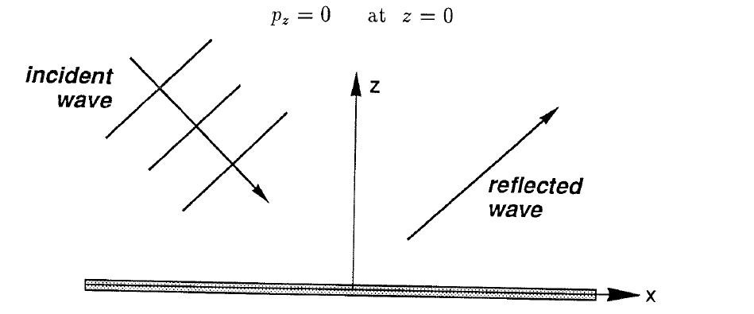</td>
  <td>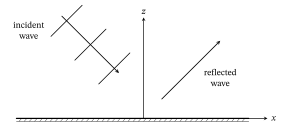</td>
</tr>
</table>

- **Asset:** `ch02-p021-solid-boundary-reflection.tikz`
- **Printed page:** 21
- **Representation:** vector
- **Equation check:** ai-checked
- **Scientific check:** The tangential wavenumber is conserved while the normal component reverses sign; the two propagation vectors are equal-magnitude specular partners, and the incident crests are normal to the incident wavevector.

#### Figure 2.2 — specular reflection

<table>
<tr><th>Original</th><th>Vector</th></tr>
<tr>
  <td>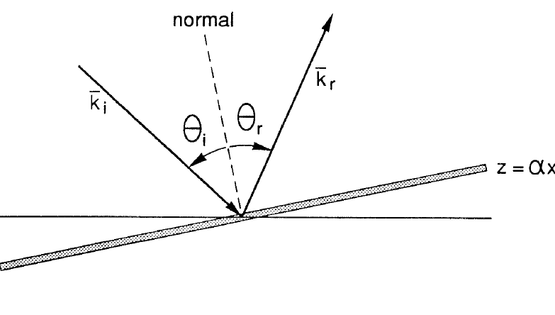</td>
  <td>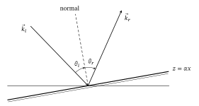</td>
</tr>
</table>

- **Asset:** `ch02-p022-specular-reflection.tikz`
- **Printed page:** 22
- **Representation:** vector
- **Equation check:** ai-checked
- **Scientific check:** The wall normal is perpendicular to the boundary and the incident/reflected vectors are constructed at equal and opposite angles about it with equal magnitudes, enforcing the corrected tangential-wavenumber relation.

#### Figure 2.3 — waveguide boundary problem

<table>
<tr><th>Original</th><th>Vector</th></tr>
<tr>
  <td>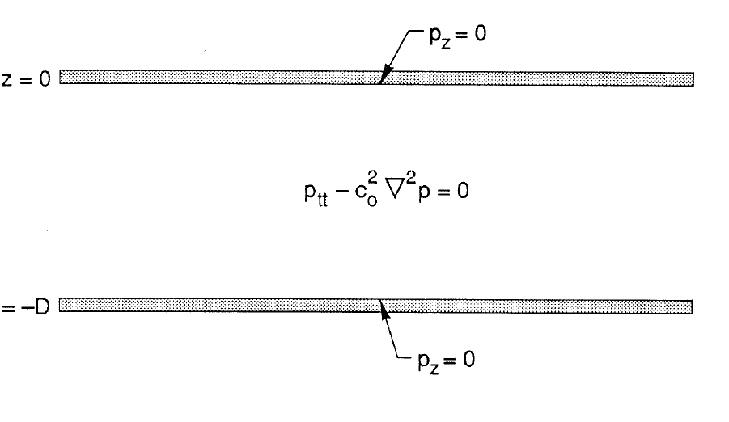</td>
  <td>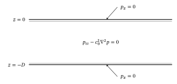</td>
</tr>
</table>

- **Asset:** `ch02-p023-waveguide-boundary-problem.tikz`
- **Printed page:** 23
- **Representation:** vector
- **Equation check:** ai-checked
- **Scientific check:** The channel walls are at `z=0,-D` with `p_z=0`; substituting `P=cos(n pi z/D)` gives zero normal derivative at both walls for integer `n` and satisfies the separated acoustic field equation. Wall thickness is schematic.

#### Figure 2.4 — waveguide dispersion

<table>
<tr><th>Original</th><th>Vector</th></tr>
<tr>
  <td>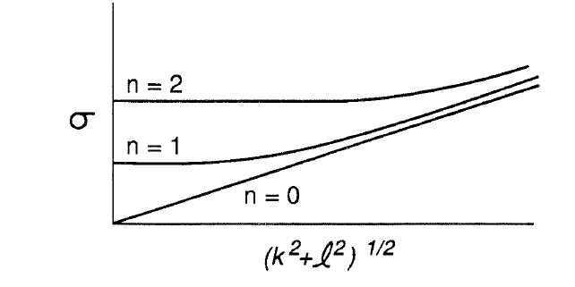</td>
  <td>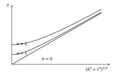</td>
</tr>
</table>

- **Asset:** `ch02-p024-waveguide-dispersion.tikz`
- **Printed page:** 24
- **Representation:** vector
- **Equation check:** ai-checked
- **Scientific check:** Branches are generated from normalized `S_n=sqrt(K^2+n^2)`. Independent evaluation confirms the `n=0` linear branch, `n=1,2` cutoffs at `S=1,2`, branch ordering, and common large-`K` slope.

#### Figure 2.5 — interface scattering

<table>
<tr><th>Original</th><th>Vector</th></tr>
<tr>
  <td>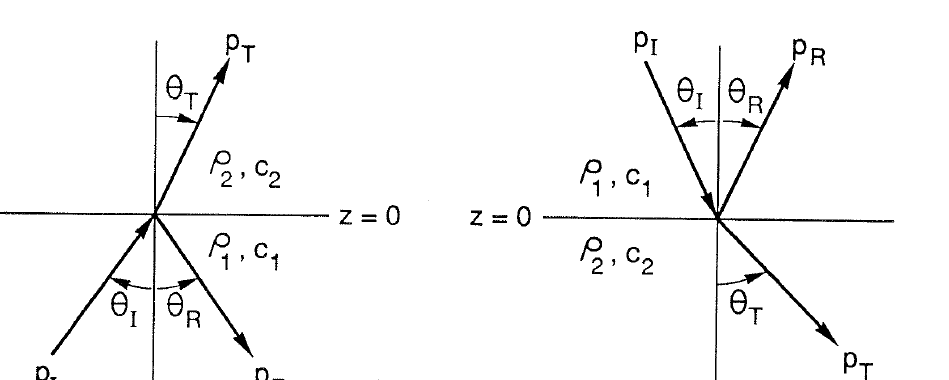</td>
  <td>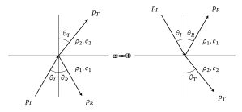</td>
</tr>
</table>

- **Asset:** `ch02-p026-interface-scattering.tikz`
- **Printed page:** 26
- **Representation:** vector
- **Equation check:** ai-checked
- **Scientific check:** Incident/reflected rays are exact mirrors about the interface normal. For the declared illustrative ratio `c_2/c_1=1.25`, the transmitted angle is calculated from Snell’s law; ray lengths remain schematic.

#### Figure 2.6 — total internal reflection

<table>
<tr><th>Original</th><th>Vector</th></tr>
<tr>
  <td>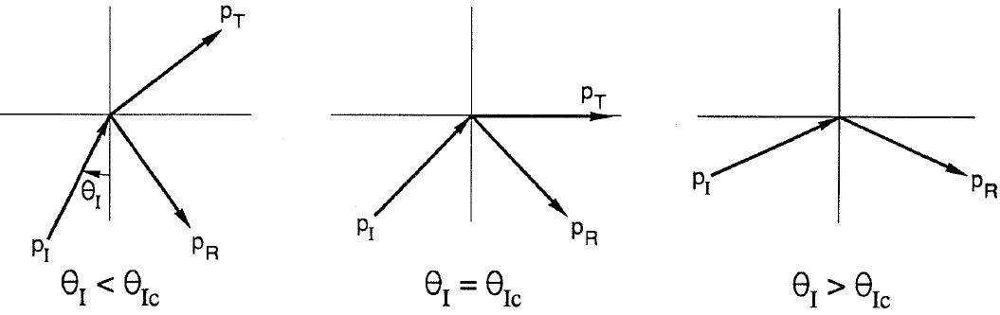</td>
  <td>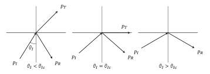</td>
</tr>
</table>

- **Asset:** `ch02-p028-total-internal-reflection.tikz`
- **Printed page:** 28
- **Representation:** vector
- **Equation check:** ai-checked
- **Scientific check:** With the declared illustrative `c_1/c_2=0.75`, calculation gives `theta_Ic=48.590 deg`; the subcritical transmitted ray satisfies Snell’s law, the critical ray is tangent to the interface, and the supercritical panel has no propagating transmitted ray.

#### Figure 2.7 — forced source jump

<table>
<tr><th>Original</th><th>Vector</th></tr>
<tr>
  <td>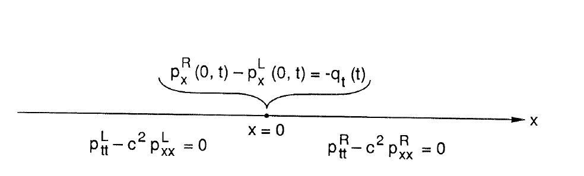</td>
  <td>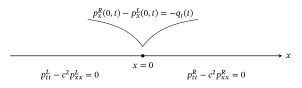</td>
</tr>
</table>

- **Asset:** `ch02-p032-forced-source-jump.tikz`
- **Printed page:** 32
- **Representation:** vector
- **Equation check:** ai-checked
- **Scientific check:** Integrating the delta-forced one-dimensional wave equation across `x=0` gives `p_x^R-p_x^L=-q_t`; each side obeys the homogeneous acoustic wave equation.

#### Figure 2.8 — sound speed profile

<table>
<tr><th>Original</th><th>Vector</th></tr>
<tr>
  <td>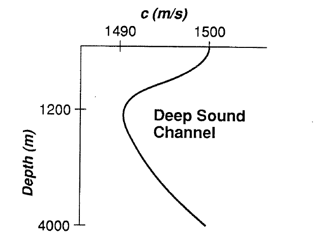</td>
  <td>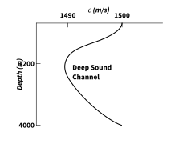</td>
</tr>
</table>

- **Asset:** `ch02-p034-sound-speed-profile.tikz`
- **Printed page:** 34
- **Representation:** vector
- **Equation check:** partial
- **Scientific check:** Source-traced empirical deep-sound-channel profile with the source axes, depth orientation, ticks, minimum, and label preserved. The chapter gives `c(s,T,z)` but not the `T(z),s(z)` data needed to derive this exact curve, so the trace is not presented as a newly calculated profile.

#### Figure 2.9 — sound speed profiles

<table>
<tr><th>Original</th><th>Vector</th></tr>
<tr>
  <td>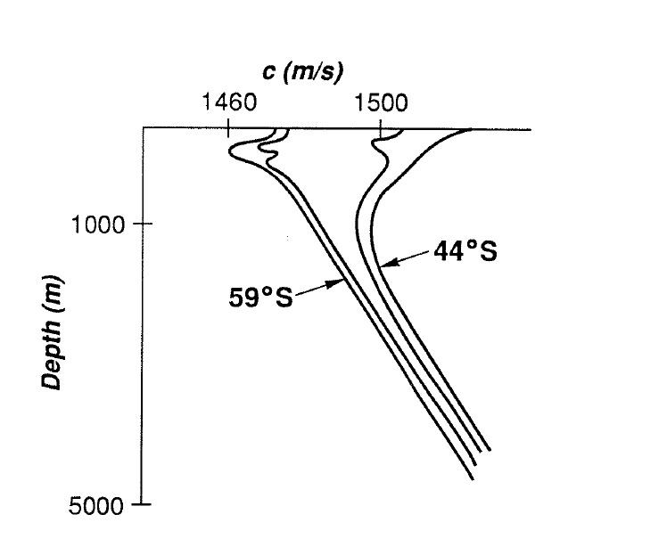</td>
  <td>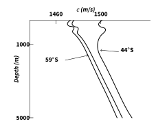</td>
</tr>
</table>

- **Asset:** `ch02-p035-sound-speed-profiles.tikz`
- **Printed page:** 35
- **Representation:** vector
- **Equation check:** n/a
- **Scientific check:** Three source-traced empirical profiles preserve the source axes, depth orientation, shallow-water wiggles, `44°S`/`59°S` labels, and relative ordering. The source supplies no unique profile equation or environmental data for an independent curve calculation.

#### Figure 2.10 — sound ray turning

<table>
<tr><th>Original</th><th>Vector</th></tr>
<tr>
  <td>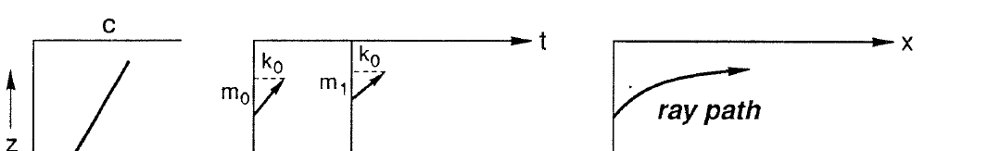</td>
  <td>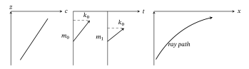</td>
</tr>
</table>

- **Asset:** `ch02-p036-sound-ray-turning.tikz`
- **Printed page:** 36
- **Representation:** vector
- **Equation check:** ai-checked
- **Scientific check:** For `c(z)` increasing upward, `k` remains fixed while `m` decreases. The ray is generated from `dz/dx=m/k=sqrt(sigma^2/(c^2 k^2)-1)` and approaches a horizontal tangent as `m` tends to zero; normalized display values are schematic.

### Chapter 3
