# Figure audit — Chapter 3

[Back to the figure audit landing page](../FIGURES.md)

This chapter ledger contains scientific and technical figure placements only.
Entries follow printed page, figure order on the page, and component asset.

#### Figure 3.1 — surface boundaries

<table>
<tr><th>Original</th><th>Vector</th></tr>
<tr>
  <td>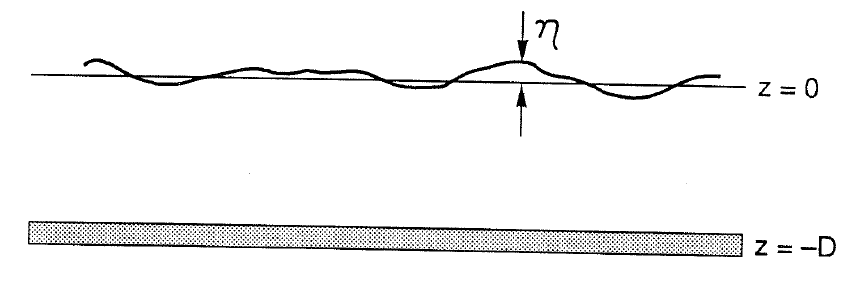</td>
  <td>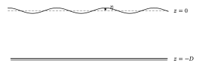</td>
</tr>
</table>

- **Asset:** `ch03-p039-surface-boundaries.tikz`
- **Printed page:** 39
- **Representation:** vector
- **Equation check:** ai-checked
- **Scientific check:** Free surface `z=eta` near `z=0` and rigid bottom `z=-D` are preserved; the adjacent kinematic/dynamic conditions and bottom no-normal-flow condition were checked against the reconstructed derivation. Surface waviness is schematic.

#### Figure 3.2 — surface wave dispersion

<table>
<tr><th>Original</th><th>Vector</th></tr>
<tr>
  <td>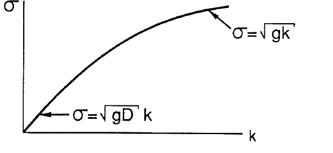</td>
  <td>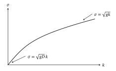</td>
</tr>
</table>

- **Asset:** `ch03-p042-surface-wave-dispersion.tikz`
- **Printed page:** 42
- **Representation:** vector
- **Equation check:** ai-checked
- **Scientific check:** The curve is generated from normalized `S=sqrt(K tanh K)`. Limiting checks recover `S~K` for `K<<1` and `S~sqrt(K)` for `K>>1`, with positive monotone branch and correct asymptotic ordering.

#### Figure 3.3 — two fluid interface

<table>
<tr><th>Original</th><th>Vector</th></tr>
<tr>
  <td>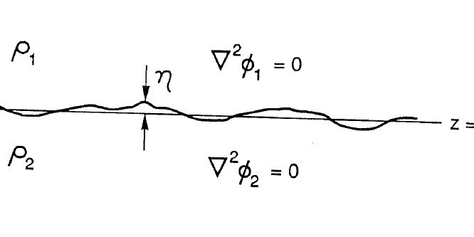</td>
  <td>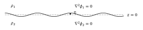</td>
</tr>
</table>

- **Asset:** `ch03-p044-two-fluid-interface.tikz`
- **Printed page:** 44
- **Representation:** vector
- **Equation check:** ai-checked
- **Scientific check:** Two semi-infinite potential-flow regions meet at `z=eta` near `z=0`; `nabla^2 phi_1=nabla^2 phi_2=0` and the common interface geometry match the checked decay and matching construction. Interface waviness is schematic.

#### Figure 3.4 — delta snapshot

<table>
<tr><th>Original</th><th>Vector</th></tr>
<tr>
  <td>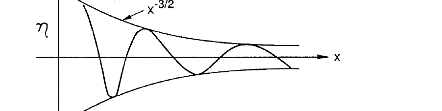</td>
  <td>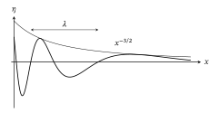</td>
</tr>
</table>

- **Asset:** `ch03-p052-delta-snapshot.tikz`
- **Printed page:** 52
- **Representation:** vector
- **Equation check:** ai-checked
- **Scientific check:** Snapshot is generated directly from `eta proportional to t x^(-3/2) cos(g t^2/(4x)+pi/4)` at fixed `t`; differentiating the phase confirms local wavelength grows with `x`, while the explicit envelope decays as `x^(-3/2)`.

#### Figure 3.5 — delta wavestaff

<table>
<tr><th>Original</th><th>Vector</th></tr>
<tr>
  <td>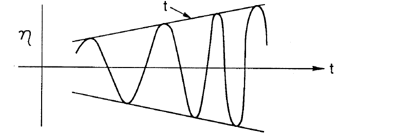</td>
  <td>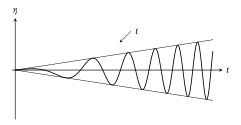</td>
</tr>
</table>

- **Asset:** `ch03-p052-delta-wavestaff.tikz`
- **Printed page:** 52
- **Representation:** vector
- **Equation check:** ai-checked
- **Scientific check:** Fixed-position record is generated from the same asymptotic solution: amplitude envelope grows linearly in `t` and instantaneous frequency grows in magnitude with `t`, so oscillations tighten while the envelope expands.

#### Figure 3.6 — ship wave geometry

<table>
<tr><th>Original</th><th>Vector</th></tr>
<tr>
  <td>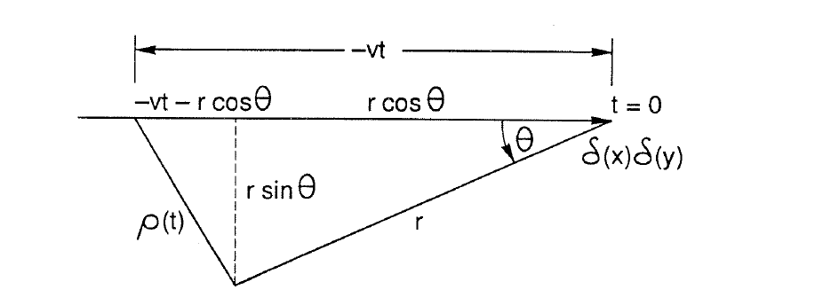</td>
  <td>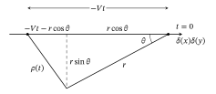</td>
</tr>
</table>

- **Asset:** `ch03-p055-ship-wave-geometry.tikz`
- **Printed page:** 55
- **Representation:** vector
- **Equation check:** ai-checked
- **Scientific check:** Triangle components are constructed so `rho(t)^2=r^2+V^2t^2+2Vtr cos(theta)` for `t<0`; horizontal and vertical projections reproduce the source labels rather than tracing the scan.

#### Figure 3.7 — kelvin wake

<table>
<tr><th>Original</th><th>Vector</th></tr>
<tr>
  <td>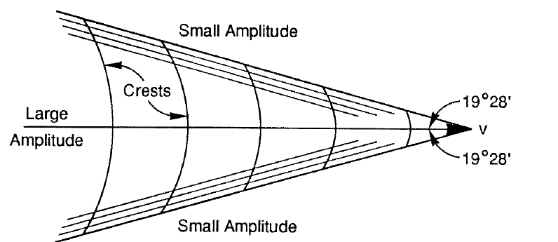</td>
  <td>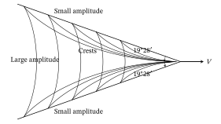</td>
</tr>
</table>

- **Asset:** `ch03-p056-kelvin-wake.tikz`
- **Printed page:** 56
- **Representation:** vector
- **Equation check:** ai-checked
- **Scientific check:** Both crest families are generated from constant `P(t_+)` and `P(t_-)` after substituting the stationary times. The cusp condition `cos^2(theta)=8/9` gives `theta=19 deg 28 min`; phase constants only set crest spacing.

#### Figure 3.8 — shallow mach cone

<table>
<tr><th>Original</th><th>Vector</th></tr>
<tr>
  <td>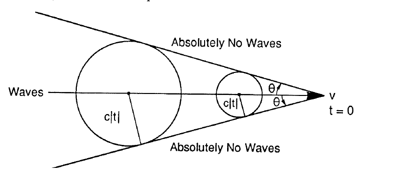</td>
  <td>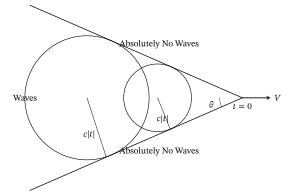</td>
</tr>
</table>

- **Asset:** `ch03-p056-shallow-mach-cone.tikz`
- **Printed page:** 56
- **Representation:** vector
- **Equation check:** ai-checked
- **Scientific check:** The wave circles expand at shallow-water speed `c` from successive source positions; their common envelope gives the Mach-cone geometry and the expected speed-angle relation.

#### Figure 3.9 — source PDF crop, printed page 57

<table>
<tr><th>Original source</th></tr>
<tr>
  <td>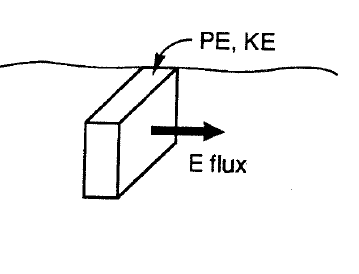</td>
</tr>
</table>

- **Asset:** `ch03-p057-energy-sketch.png`
- **Original source:** [ChapmanRizzoli3.pdf](../../references/chapman-rizzoli-1989/ChapmanRizzoli3.pdf), physical page 22
- **Representation:** source-pdf
- **Equation check:** n/a
- **Scientific check:** Keep the PE/KE and energy-flux sketch as source art; its labels and source-specific perspective are retained beside the surrounding energy derivation without asserting a reconstructed quantitative geometry.

#### Figure 3.10 — following current dispersion

<table>
<tr><th>Original</th><th>Vector</th></tr>
<tr>
  <td>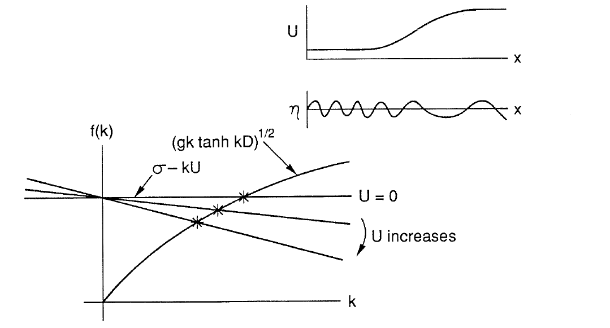</td>
  <td>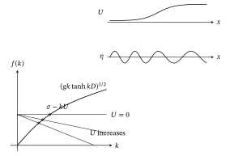</td>
</tr>
</table>

- **Asset:** `ch03-p061-following-current-dispersion.tikz`
- **Printed page:** 61
- **Representation:** vector
- **Equation check:** ai-checked
- **Scientific check:** Curves and marked roots solve normalized `sqrt(k tanh k)=1-Uk`; increasing following current shifts the physical root to smaller `k`, and the upper wave is generated from those local roots so its wavelength lengthens.

#### Figure 3.11 — opposing current blocking

<table>
<tr><th>Original</th><th>Vector</th></tr>
<tr>
  <td>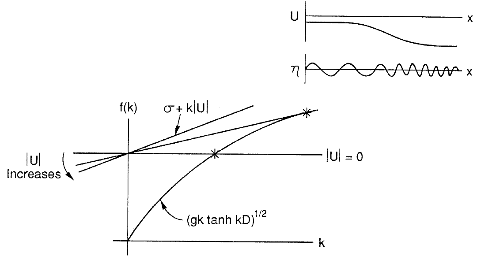</td>
  <td>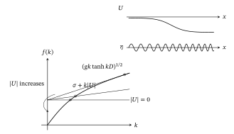</td>
</tr>
</table>

- **Asset:** `ch03-p062-opposing-current-blocking.tikz`
- **Printed page:** 62
- **Representation:** vector
- **Equation check:** ai-checked
- **Scientific check:** The blocking point is the double-root/tangency condition for the opposing-current dispersion relation; the independent calculation reproduces `k=4.0426391` and `U_abs=0.2498398` in the normalized case.

#### Figure 3.12 — shear current refraction

<table>
<tr><th>Original</th><th>Vector</th></tr>
<tr>
  <td>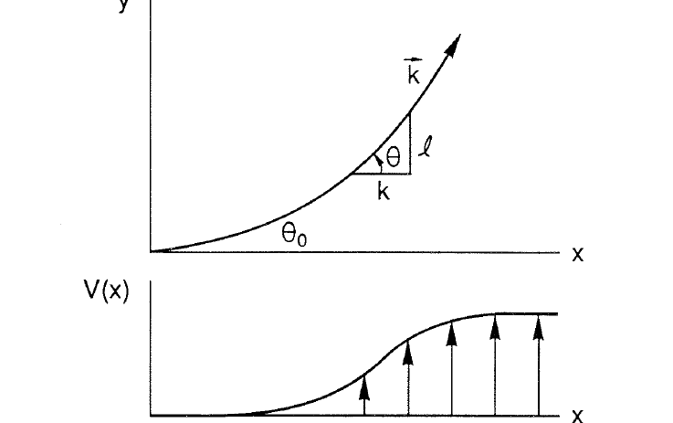</td>
  <td>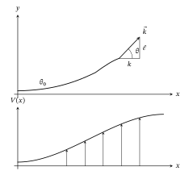</td>
</tr>
</table>

- **Asset:** `ch03-p063-shear-current-refraction.tikz`
- **Printed page:** 63
- **Representation:** vector
- **Equation check:** ai-checked
- **Scientific check:** Deep-water ray is integrated from the absolute group velocity while enforcing constant `sigma` and `ell`, `k^2=(sigma-ell V)^4/g^2-ell^2`, and `ell=K sin(theta)`. The component triangle terminates at the wavevector tip; the chosen smooth `V(x)` profile is illustrative.

### Chapter 4
