# Figure audit — Chapter 4

[Back to the figure audit landing page](../FIGURES.md)

This chapter ledger contains scientific and technical figure placements only.
Entries follow printed page, figure order on the page, and component asset.

#### Figure 4.1 — parcel displacement

<table>
<tr><th>Original source</th></tr>
<tr>
  <td>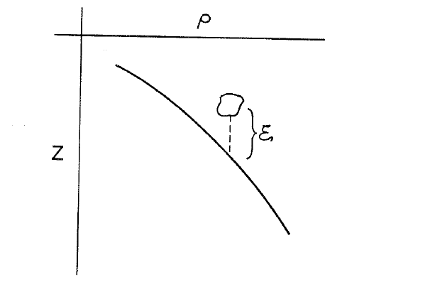</td>
</tr>
</table>

- **Asset:** `ch04-p065-parcel-displacement-source.png`
- **Original source:** [ChapmanRizzoli4.pdf](../../references/chapman-rizzoli-1989/ChapmanRizzoli4.pdf), physical page 2
- **Printed page:** 65
- **Representation:** source-pdf
- **Equation check:** n/a
- **Scientific check:** Keep the source parcel, monotonic density profile, and upward displacement `xi`; the source does not fix an analytic profile that would justify redrawing it.

#### Figure 4.2 — boundary value problem

<table>
<tr><th>Original</th><th>Vector</th></tr>
<tr>
  <td></td>
  <td></td>
</tr>
</table>

- **Asset:** `ch04-p068-boundary-value-problem.tikz`
- **Printed page:** 68
- **Representation:** vector
- **Equation check:** ai-checked
- **Scientific check:** The checked free-surface condition `(sigma^2-f^2) w_z+g nabla_H^2 w=0`, interior internal-wave equation, and bottom `w=0` condition are attached to the correct `z=0,-D` boundaries.

#### Figure 4.3 — dispersion cone

<table>
<tr><th>Original</th><th>Vector</th></tr>
<tr>
  <td></td>
  <td></td>
</tr>
</table>

- **Asset:** `ch04-p069-dispersion-cone.tikz`
- **Printed page:** 69
- **Representation:** vector
- **Equation check:** ai-checked
- **Scientific check:** The cone satisfies `m^2=R^2(k^2+ell^2)`; the displayed opening angle is generated from the same cone geometry rather than hard-coded.

#### Figure 4.4 — nonrotating transverse

<table>
<tr><th>Original source</th></tr>
<tr>
  <td>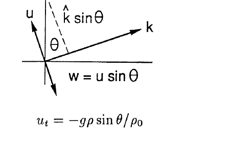</td>
</tr>
</table>

- **Asset:** `ch04-p069-nonrotating-transverse-source.png`
- **Original source:** [ChapmanRizzoli4.pdf](../../references/chapman-rizzoli-1989/ChapmanRizzoli4.pdf), physical page 6
- **Printed page:** 69
- **Representation:** source-pdf
- **Equation check:** ai-checked
- **Scientific check:** The source crop retains the transverse `u` and `k` construction, `w=u sin(theta)`, and the displayed nonrotating momentum relation.

#### Figure 4.5 — rotating transverse

<table>
<tr><th>Original source</th></tr>
<tr>
  <td>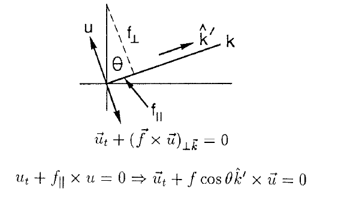</td>
</tr>
</table>

- **Asset:** `ch04-p070-rotating-transverse-source.png`
- **Original source:** [ChapmanRizzoli4.pdf](../../references/chapman-rizzoli-1989/ChapmanRizzoli4.pdf), physical page 7
- **Printed page:** 70
- **Representation:** source-pdf
- **Equation check:** ai-checked
- **Scientific check:** The source crop retains the transverse velocity, the `f_parallel`/`f_perp` decomposition, and both displayed rotating-transverse equations.

#### Figure 4.6 — phase energy theta

<table>
<tr><th>Original</th><th>Vector</th></tr>
<tr>
  <td></td>
  <td></td>
</tr>
</table>

- **Asset:** `ch04-p072-phase-energy-theta.tikz`
- **Printed page:** 72
- **Representation:** vector
- **Equation check:** ai-checked
- **Scientific check:** Upper `f>N` / `f<N` pair: phase direction and energy direction are perpendicular; the energy arrow reverses side as in the source. Direction limits were independently checked.

#### Figure 4.7 — phase energy phi

<table>
<tr><th>Original</th><th>Vector</th></tr>
<tr>
  <td></td>
  <td></td>
</tr>
</table>

- **Asset:** `ch04-p072-phase-energy-phi.tikz`
- **Printed page:** 72
- **Representation:** vector
- **Equation check:** ai-checked
- **Scientific check:** Lower `f>N` / `f<N` pair: `c_g` is the energy direction and phase propagation is perpendicular; the redraw excludes surrounding source prose. Direction relations were independently checked.

#### Figure 4.8 — rotation only limits

<table>
<tr><th>Original</th><th>Vector</th></tr>
<tr>
  <td></td>
  <td></td>
</tr>
</table>

- **Asset:** `ch04-p073-rotation-only-limits.tikz`
- **Printed page:** 73
- **Representation:** vector
- **Equation check:** ai-checked
- **Scientific check:** Rotation-only endpoint sketch is reconstructed from the stated limits (`phi=0` Taylor-column limit and `phi=90 deg` inertial limit), excluding surrounding prose. Both endpoint limits were checked from the chapter equations.

#### Figure 4.9 — stratification only limits

<table>
<tr><th>Original</th><th>Vector</th></tr>
<tr>
  <td></td>
  <td></td>
</tr>
</table>

- **Asset:** `ch04-p074-stratification-only-limits.tikz`
- **Printed page:** 74
- **Representation:** vector
- **Equation check:** ai-checked
- **Scientific check:** Stratification-only endpoint sketch preserves the buoyancy-oscillation and steady limits without surrounding source prose. Both endpoint limits were checked from the chapter equations.

#### Figure 4.10 — rotation stratification limits

<table>
<tr><th>Original</th><th>Vector</th></tr>
<tr>
  <td></td>
  <td></td>
</tr>
</table>

- **Asset:** `ch04-p075-rotation-stratification-limits.tikz`
- **Printed page:** 75
- **Representation:** vector
- **Equation check:** ai-checked
- **Scientific check:** Combined rotation/stratification endpoint sketch preserves the buoyancy and inertial limits and their wavenumber orientations. The limiting values were checked from the chapter equations.

#### Figure 4.11 — waveguide boundary problem

<table>
<tr><th>Original</th><th>Vector</th></tr>
<tr>
  <td></td>
  <td></td>
</tr>
</table>

- **Asset:** `ch04-p076-waveguide-boundary-problem.tikz`
- **Printed page:** 76
- **Representation:** vector
- **Equation check:** ai-checked
- **Scientific check:** Substitution confirms the internal-wave field equation and the same free-surface/bottom conditions as p.68, with labels attached to the `z=0,-D` boundaries.

#### Figure 4.12 — frequency regimes

<table>
<tr><th>Original source</th></tr>
<tr>
  <td>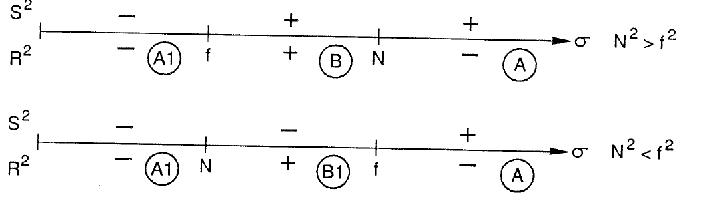</td>
</tr>
</table>

- **Asset:** `ch04-p077-frequency-regimes-source.png`
- **Original source:** [ChapmanRizzoli4.pdf](../../references/chapman-rizzoli-1989/ChapmanRizzoli4.pdf), physical page 14
- **Printed page:** 77
- **Representation:** source-pdf
- **Equation check:** ai-checked
- **Scientific check:** The source crop retains both `N^2>f^2` and `N^2<f^2` sign rows, the `f`/`N` ordering, and the A, A1, B, and B1 labels used by the following case analysis.

#### Figure 4.13 — case a intersections

<table>
<tr><th>Original</th><th>Vector</th></tr>
<tr>
  <td></td>
  <td></td>
</tr>
</table>

- **Asset:** `ch04-p078-case-a-intersections.tikz`
- **Printed page:** 78
- **Representation:** vector
- **Equation check:** ai-checked
- **Scientific check:** Root solving of normalized `1/k=tanh(k)` gives `k=+/-1.1996786403`; the vector contains those two symmetric propagating intersections.

#### Figure 4.14 — case a1 no intersections

<table>
<tr><th>Original</th><th>Vector</th></tr>
<tr>
  <td></td>
  <td></td>
</tr>
</table>

- **Asset:** `ch04-p078-case-a1-no-intersections.tikz`
- **Printed page:** 78
- **Representation:** vector
- **Equation check:** ai-checked
- **Scientific check:** For normalized `-1/k=tanh(k)`, the two sides have opposite sign for every nonzero real `k`; a sign/root check confirms no real propagating intersection.

#### Figure 4.15 — case b intersections

<table>
<tr><th>Original source</th></tr>
<tr>
  <td>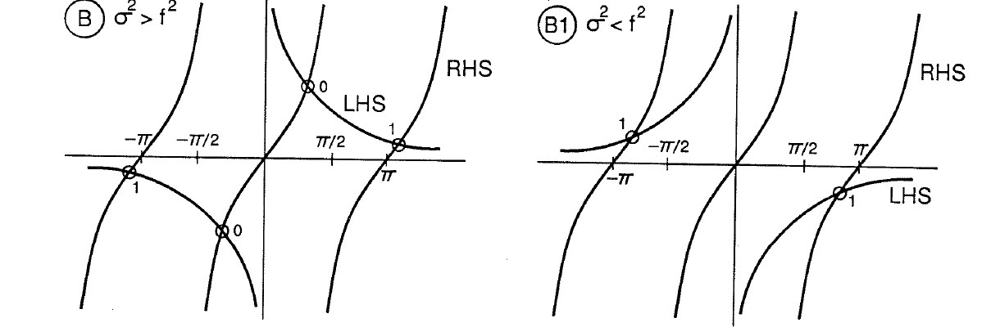</td>
</tr>
</table>

- **Asset:** `ch04-p079-case-b-intersections-source.png`
- **Original source:** [ChapmanRizzoli4.pdf](../../references/chapman-rizzoli-1989/ChapmanRizzoli4.pdf), physical page 16
- **Printed page:** 79
- **Representation:** source-pdf
- **Equation check:** ai-checked
- **Scientific check:** The source crop retains the complete B/B1 panels, tangent asymptotes, LHS/RHS curves, and circled intersections used in the case-B mode count.

#### Figure 4.16 — waveguide dispersion

<table>
<tr><th>Original</th><th>Vector</th></tr>
<tr>
  <td></td>
  <td></td>
</tr>
</table>

- **Asset:** `ch04-p080-waveguide-dispersion.tikz`
- **Printed page:** 80
- **Representation:** vector
- **Equation check:** ai-checked
- **Scientific check:** Surface and internal branches are generated from the stated approximate dispersion relations. Limiting checks give `sigma->f` as `k->0`, `sigma->N` as `k->infinity`, and vanishing group velocity at both internal-branch limits.

#### Figure 4.17 — mode structure

<table>
<tr><th>Original source</th></tr>
<tr>
  <td></td>
</tr>
</table>

- **Asset:** `ch04-p081-mode-structure-source.png`
- **Original source:** [ChapmanRizzoli4.pdf](../../references/chapman-rizzoli-1989/ChapmanRizzoli4.pdf), physical page 18
- **Printed page:** 81
- **Representation:** source-pdf
- **Equation check:** ai-checked
- **Scientific check:** The source crop retains the paired `w/w_0` and `u/Rw_0` vertical profiles, their boundary values, and the `z=0,-D` labels.

#### Figure 4.18 — particle cells

<table>
<tr><th>Original</th><th>Vector</th></tr>
<tr>
  <td></td>
  <td></td>
</tr>
</table>

- **Asset:** `ch04-p081-particle-cells.tikz`
- **Printed page:** 81
- **Representation:** vector
- **Equation check:** ai-checked
- **Scientific check:** Velocity cells use the same `n=1` solution and are analytically divergence-free. Surface convergence/divergence locations and alternating circulation follow from the checked `u,w` phase relation.

#### Figure 4.19 — evanescent case a

<table>
<tr><th>Original source</th></tr>
<tr>
  <td></td>
</tr>
</table>

- **Asset:** `ch04-p083-evanescent-case-a-source.png`
- **Original source:** [ChapmanRizzoli4.pdf](../../references/chapman-rizzoli-1989/ChapmanRizzoli4.pdf), physical page 20
- **Printed page:** 83
- **Representation:** source-pdf
- **Equation check:** ai-checked
- **Scientific check:** The source crop retains both A/A1 panels, their asymptotes, LHS/RHS curves, and circled roots, including the extra A1 pair.

#### Figure 4.20 — evanescent case b

<table>
<tr><th>Original source</th></tr>
<tr>
  <td></td>
</tr>
</table>

- **Asset:** `ch04-p084-evanescent-case-b-source.png`
- **Original source:** [ChapmanRizzoli4.pdf](../../references/chapman-rizzoli-1989/ChapmanRizzoli4.pdf), physical page 21
- **Printed page:** 84
- **Representation:** source-pdf
- **Equation check:** ai-checked
- **Scientific check:** The source crop retains both B/B1 panels, the LHS/RHS curves, and the root/no-intersection distinction used in the evanescent-mode discussion.

#### Figure 4.21 — topographic generation

<table>
<tr><th>Original source</th></tr>
<tr>
  <td>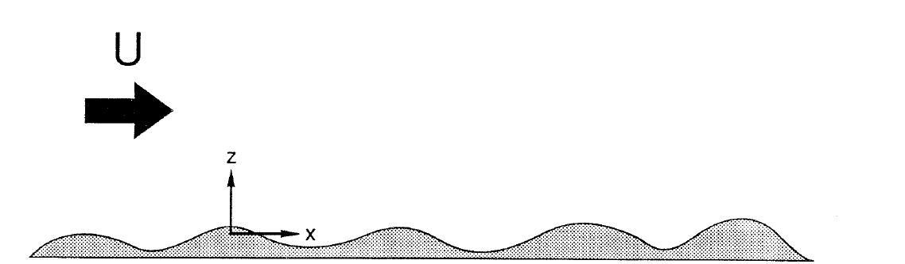</td>
</tr>
</table>

- **Asset:** `ch04-p085-topographic-generation-source.png`
- **Original source:** [ChapmanRizzoli4.pdf](../../references/chapman-rizzoli-1989/ChapmanRizzoli4.pdf), physical page 22
- **Printed page:** 85
- **Representation:** source-pdf
- **Equation check:** ai-checked
- **Scientific check:** The source crop retains the stippled topography, mean flow `U`, and `x,z` axes; the surrounding equations state the topographic forcing and radiation conditions.

#### Figure 4.22 — characteristics

<table>
<tr><th>Original source</th></tr>
<tr>
  <td>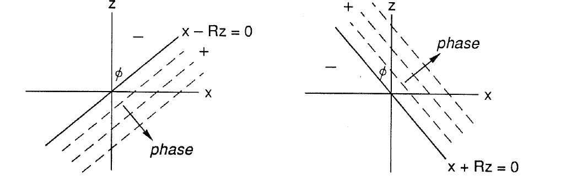</td>
</tr>
</table>

- **Asset:** `ch04-p088-characteristics-source.png`
- **Original source:** [ChapmanRizzoli4.pdf](../../references/chapman-rizzoli-1989/ChapmanRizzoli4.pdf), physical page 25
- **Printed page:** 88
- **Representation:** source-pdf
- **Equation check:** ai-checked
- **Scientific check:** The source crop retains both characteristic panels, phase arrows, and the sign labels for `x-Rz=0` and `x+Rz=0`.

#### Figure 4.23 — slope reflection

<table>
<tr><th>Original source</th></tr>
<tr>
  <td>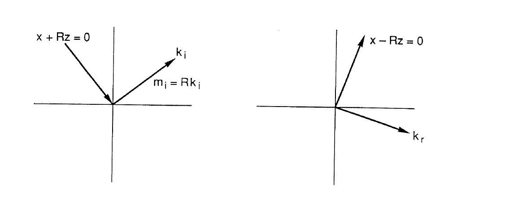</td>
</tr>
</table>

- **Asset:** `ch04-p089-slope-reflection-source.png`
- **Original source:** [ChapmanRizzoli4.pdf](../../references/chapman-rizzoli-1989/ChapmanRizzoli4.pdf), physical page 26
- **Printed page:** 89
- **Representation:** source-pdf
- **Equation check:** ai-checked
- **Scientific check:** The source crop retains the two characteristic lines, incident/reflected energy directions, and the paired wavevector directions used to show non-specular reflection.

#### Figure 4.24 — wavenumber projection

<table>
<tr><th>Original source</th></tr>
<tr>
  <td>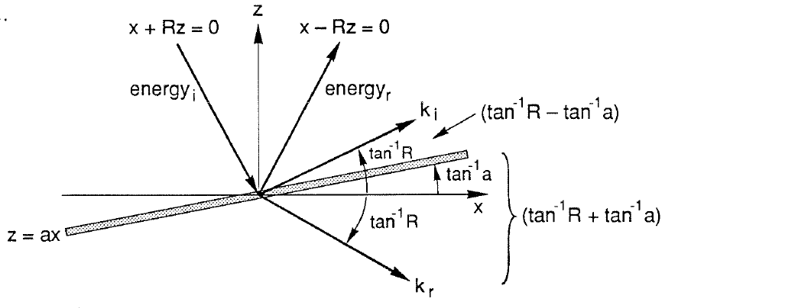</td>
</tr>
</table>

- **Asset:** `ch04-p089-wavenumber-projection-source.png`
- **Original source:** [ChapmanRizzoli4.pdf](../../references/chapman-rizzoli-1989/ChapmanRizzoli4.pdf), physical page 26
- **Printed page:** 89
- **Representation:** source-pdf
- **Equation check:** ai-checked
- **Scientific check:** The source crop retains the sloping wall, both characteristic directions, incident/reflected wavevectors, and all angle annotations used in the equal-projection construction.

#### Figure 4.25 — wavenumber triangle

<table>
<tr><th>Original</th><th>Vector</th></tr>
<tr>
  <td></td>
  <td></td>
</tr>
</table>

- **Asset:** `ch04-p090-wavenumber-triangle.tikz`
- **Printed page:** 90
- **Representation:** vector
- **Equation check:** ai-checked
- **Scientific check:** The revised subcritical construction uses common `R=1.25`, `a=0.32`; directions are `+/-atan(R)` and arrow lengths use `q=(1+aR)/(1-aR)=2.333333`. It makes no supercritical magnitude claim. See `ERRATA.md`, printed p.90.

#### Figure 4.26 — velocity reflection

<table>
<tr><th>Original</th><th>Vector</th></tr>
<tr>
  <td></td>
  <td></td>
</tr>
</table>

- **Asset:** `ch04-p090-velocity-reflection.tikz`
- **Printed page:** 90
- **Representation:** vector
- **Equation check:** ai-checked
- **Scientific check:** The revised subcritical velocity construction uses equal-base characteristic vectors and scales the reflected one by `q=(1+aR)/(1-aR)=2.333333`; the reflected-to-incident velocity-magnitude ratio is `q` and `n dot (v_i+v_r)=0`. See `ERRATA.md`, printed p.90, for the source formula issues.

#### Figure 4.27 — source PDF crop, printed page 91

<table>
<tr><th>Original source</th></tr>
<tr>
  <td></td>
</tr>
</table>

- **Asset:** `ch04-p091-slope-reflection-source.png`
- **Original source:** [ChapmanRizzoli4.pdf](../../references/chapman-rizzoli-1989/ChapmanRizzoli4.pdf), physical page 28
- **Representation:** source-pdf
- **Equation check:** partial
- **Scientific check:** Keep the multi-slope reflection sketch because the signed-versus-magnitude convention remains ambiguous for the full displayed regime. See `ERRATA.md`, printed p.90.

#### Figure 4.28 — source PDF crop, printed page 92

<table>
<tr><th>Original source</th></tr>
<tr>
  <td></td>
</tr>
</table>

- **Asset:** `ch04-p092-density-profiles-source.png`
- **Original source:** [ChapmanRizzoli4.pdf](../../references/chapman-rizzoli-1989/ChapmanRizzoli4.pdf), physical page 29
- **Representation:** source-pdf
- **Equation check:** n/a
- **Scientific check:** Keep the source-specific typical density and `N^2(z)` profiles; smoothing or redrawing them would invent empirical profile detail not fixed by the chapter equations.

#### Figure 4.29 — turning profile

<table>
<tr><th>Original source</th></tr>
<tr>
  <td>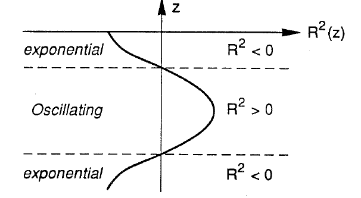</td>
</tr>
</table>

- **Asset:** `ch04-p093-turning-profile-source.png`
- **Original source:** [ChapmanRizzoli4.pdf](../../references/chapman-rizzoli-1989/ChapmanRizzoli4.pdf), physical page 30
- **Printed page:** 93
- **Representation:** source-pdf
- **Equation check:** ai-checked
- **Scientific check:** The source crop retains the exponential/oscillating/exponential regions, both turning levels, and the signs of `R^2` used in the discussion.

#### Figure 4.30 — eigenvalue spectrum

<table>
<tr><th>Original source</th></tr>
<tr>
  <td>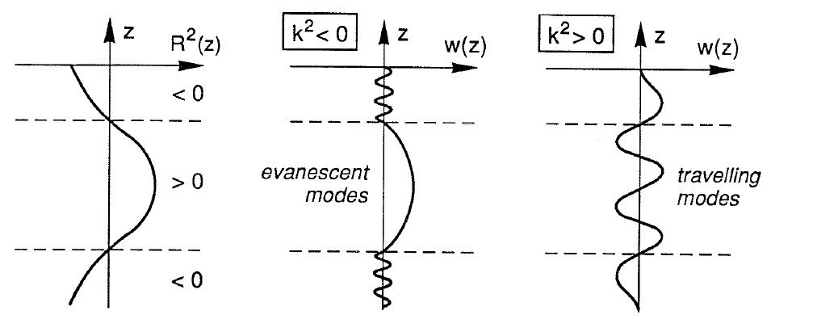</td>
</tr>
</table>

- **Asset:** `ch04-p094-eigenvalue-spectrum-source.png`
- **Original source:** [ChapmanRizzoli4.pdf](../../references/chapman-rizzoli-1989/ChapmanRizzoli4.pdf), physical page 31
- **Printed page:** 94
- **Representation:** source-pdf
- **Equation check:** ai-checked
- **Scientific check:** The source crop retains the `R^2(z)` profile, the evanescent and travelling mode sketches, and the generalized spectrum ordering from negative to positive `k^2`.
