# Figure audit — Chapter 5

[Back to the figure audit landing page](../FIGURES.md)

This chapter ledger contains scientific and technical figure placements only.
Entries follow printed page, figure order on the page, and component asset.

#### Figure 5.1 — source PDF crop, printed page 97

<table>
<tr><th>Original source</th></tr>
<tr>
  <td>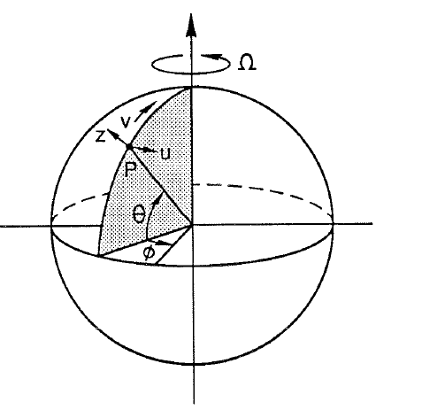</td>
</tr>
</table>

- **Asset:** `ch05-p097-spherical-coordinates-source.png`
- **Original source:** [ChapmanRizzoli5.pdf](../../references/chapman-rizzoli-1989/ChapmanRizzoli5.pdf), physical page 2
- **Representation:** source-pdf
- **Equation check:** n/a
- **Scientific check:** Deliberately kept after full-page review. The local `u/v/z` tangencies, latitude/longitude construction, point `P`, rotation axis, and `theta/phi` geometry are meaningful, but the viewing projection and hidden-line construction are not specified by the notes.

#### Figure 5.2 — wall reflection

<table>
<tr><th>Original</th><th>Vector</th></tr>
<tr>
  <td>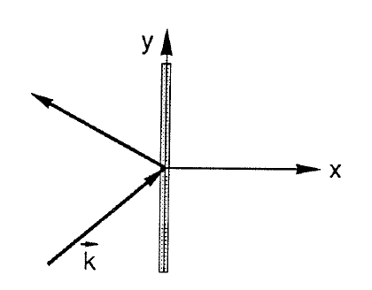</td>
  <td>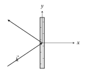</td>
</tr>
</table>

- **Asset:** `ch05-p108-wall-reflection.tikz`
- **Printed page:** 108
- **Representation:** vector
- **Equation check:** ai-checked
- **Scientific check:** Reflected endpoint is the mirror of the incident endpoint about the wall normal, so `alpha_R=alpha_I` and displayed ray magnitudes are equal. The mirror/equal-angle constraint was checked.

#### Figure 5.3 — rectangular basin

<table>
<tr><th>Original</th><th>Vector</th></tr>
<tr>
  <td>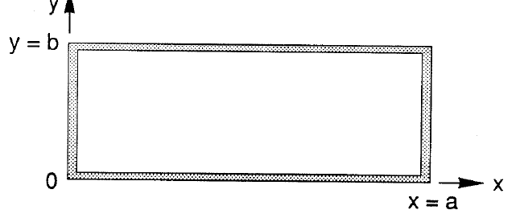</td>
  <td>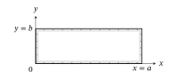</td>
</tr>
</table>

- **Asset:** `ch05-p108-rectangular-basin.tikz`
- **Printed page:** 108
- **Representation:** vector
- **Equation check:** n/a
- **Scientific check:** Four walls and `x=0,a`, `y=0,b` geometry reproduce the source.

#### Figure 5.4 — depth step rays

<table>
<tr><th>Original</th><th>Vector</th></tr>
<tr>
  <td>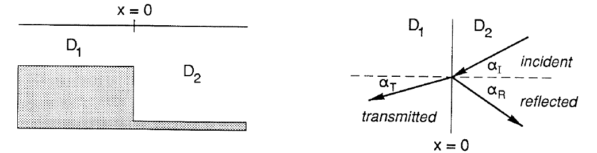</td>
  <td>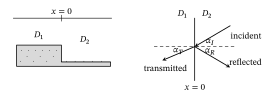</td>
</tr>
</table>

- **Asset:** `ch05-p110-depth-step-rays.tikz`
- **Printed page:** 110
- **Representation:** vector
- **Equation check:** ai-checked
- **Scientific check:** The illustrative construction declares `D_1/D_2=0.60`; `alpha_T=asin[sqrt(D_1/D_2) sin(alpha_I)]` is generated from Snell’s law and `alpha_R=alpha_I`. Ray lengths alone are schematic.

#### Figure 5.5 — source PDF crop, printed page 113

<table>
<tr><th>Original source</th></tr>
<tr>
  <td>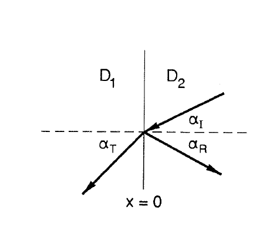</td>
</tr>
</table>

- **Asset:** `ch05-p113-critical-reflection-source.png`
- **Original source:** [ChapmanRizzoli5.pdf](../../references/chapman-rizzoli-1989/ChapmanRizzoli5.pdf), physical page 18
- **Representation:** source-pdf
- **Equation check:** ai-checked
- **Scientific check:** Keep the source labels because the disagreement with the nearby equations has been checked and is intentionally preserved as source evidence. See `ERRATA.md`, printed p.113.

#### Figure 5.6 — source PDF crop, printed page 113

<table>
<tr><th>Original source</th></tr>
<tr>
  <td>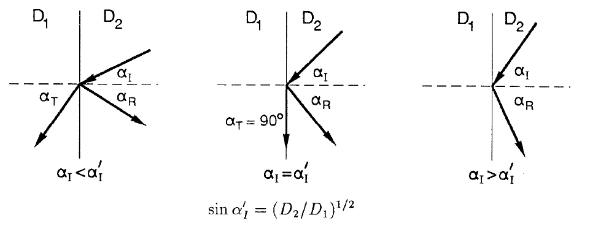</td>
</tr>
</table>

- **Asset:** `ch05-p113-transmission-source.png`
- **Original source:** [ChapmanRizzoli5.pdf](../../references/chapman-rizzoli-1989/ChapmanRizzoli5.pdf), physical page 18
- **Representation:** source-pdf
- **Equation check:** ai-checked
- **Scientific check:** Same disposition: the checked mismatch is documented rather than silently corrected in source art. See `ERRATA.md`, printed p.113.

#### Figure 5.7 — step shelf

<table>
<tr><th>Original</th><th>Vector</th></tr>
<tr>
  <td>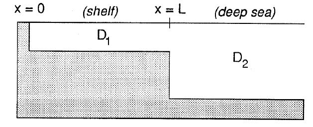</td>
  <td>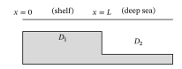</td>
</tr>
</table>

- **Asset:** `ch05-p114-step-shelf.tikz`
- **Printed page:** 114
- **Representation:** vector
- **Equation check:** n/a
- **Scientific check:** Coast, shelf width `L`, and `D_1/D_2` step geometry reproduce the source.

#### Figure 5.8 — ray paths

<table>
<tr><th>Original</th><th>Vector</th></tr>
<tr>
  <td>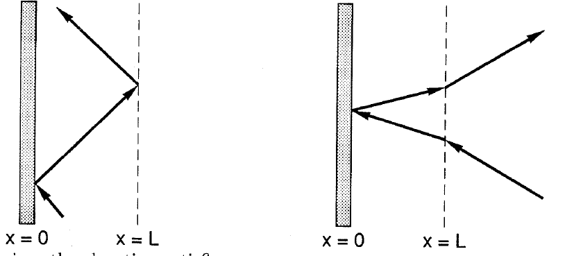</td>
  <td>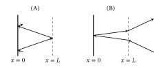</td>
</tr>
</table>

- **Asset:** `ch05-p114-ray-paths.tikz`
- **Printed page:** 114
- **Representation:** vector
- **Equation check:** ai-checked
- **Scientific check:** With declared `D_1/D_2=0.10`, the critical angle is `18.43495 deg`; panel A uses `19.2 deg` and totally reflects, while panel B computes the shelf angle `7.73799 deg` from `25.2 deg` deep incidence and reflects specularly at the coast.

#### Figure 5.9 — edge wave profile

<table>
<tr><th>Original</th><th>Vector</th></tr>
<tr>
  <td>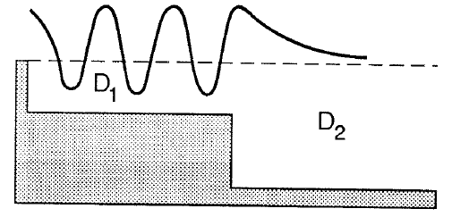</td>
  <td></td>
</tr>
</table>

- **Asset:** `ch05-p115-edge-wave-profile.tikz`
- **Printed page:** 115
- **Representation:** vector
- **Equation check:** ai-checked
- **Scientific check:** Shelf cosine and offshore exponential were evaluated and satisfy both `eta` continuity and `D eta_x` continuity at `x=L`; display-only parameters are identified in comments and are not presented as source data.

#### Figure 5.10 — edge wave dispersion

<table>
<tr><th>Original</th><th>Vector</th></tr>
<tr>
  <td>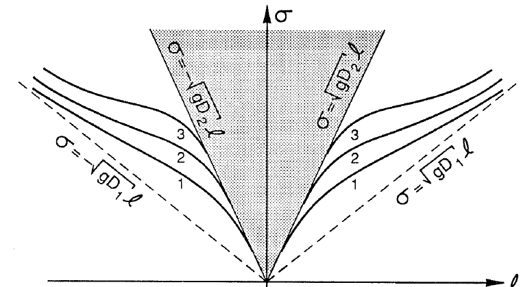</td>
  <td>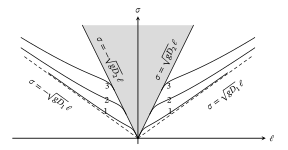</td>
</tr>
</table>

- **Asset:** `ch05-p116-edge-wave-dispersion.tikz`
- **Printed page:** 116
- **Representation:** vector
- **Equation check:** ai-checked
- **Scientific check:** First three branches are generated from the stated matching relation; branch cutoffs/asymptotes were checked against the dispersion relation.

#### Figure 5.11 — forced shelf profile

<table>
<tr><th>Original</th><th>Vector</th></tr>
<tr>
  <td>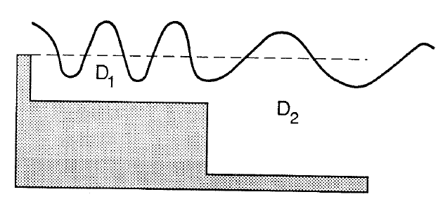</td>
  <td></td>
</tr>
</table>

- **Asset:** `ch05-p117-forced-shelf-profile.tikz`
- **Printed page:** 117
- **Representation:** vector
- **Equation check:** ai-checked
- **Scientific check:** The display sets `ell=0`, `D_1/D_2=0.10`, and `k_1 L=6 pi`, so `k_2/k_1=sqrt(D_1/D_2)`; choosing `B=C=A/2` makes both elevation and `D eta_x` continuous at the shelf break.

#### Figure 5.12 — coastal seiche modes

<table>
<tr><th>Original</th><th>Vector</th></tr>
<tr>
  <td>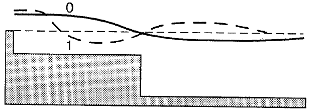</td>
  <td>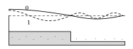</td>
</tr>
</table>

- **Asset:** `ch05-p118-coastal-seiche-modes.tikz`
- **Printed page:** 118
- **Representation:** vector
- **Equation check:** ai-checked
- **Scientific check:** Both modes have the common shelf-break elevation node; the higher mode adds one shelf zero as required by the modal conditions.

#### Figure 5.13 — particle motion

<table>
<tr><th>Original</th><th>Vector</th></tr>
<tr>
  <td>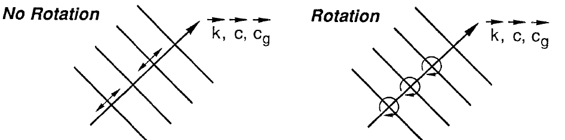</td>
  <td>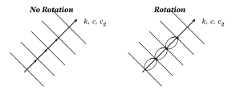</td>
</tr>
</table>

- **Asset:** `ch05-p119-particle-motion.tikz`
- **Printed page:** 119
- **Representation:** vector
- **Equation check:** ai-checked
- **Scientific check:** Phase planes are normal to `k`; no-rotation displacement is parallel to `k`, while rotating trajectories are clockwise ellipses checked against `u/v=i sigma/f`.

#### Figure 5.14 — waveguide channel

<table>
<tr><th>Original</th><th>Vector</th></tr>
<tr>
  <td>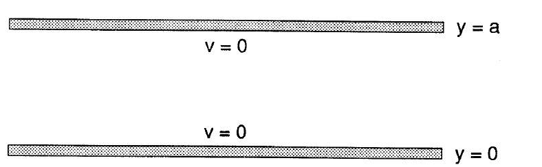</td>
  <td>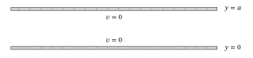</td>
</tr>
</table>

- **Asset:** `ch05-p123-waveguide-channel.tikz`
- **Printed page:** 123
- **Representation:** vector
- **Equation check:** n/a
- **Scientific check:** Two channel walls and `v=0`, `y=0,a` labels reproduce the source geometry.

#### Figure 5.15 — source PDF crop, printed page 124

<table>
<tr><th>Original source</th></tr>
<tr>
  <td>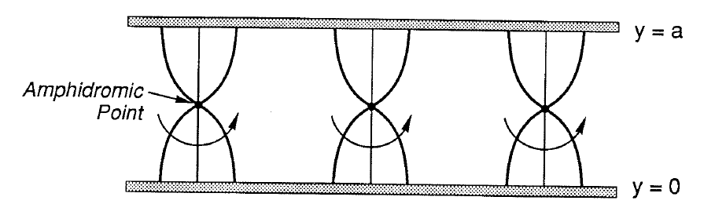</td>
</tr>
</table>

- **Asset:** `ch05-p124-amphidromic-pattern.png`
- **Original source:** [ChapmanRizzoli5.pdf](../../references/chapman-rizzoli-1989/ChapmanRizzoli5.pdf), physical page 29
- **Representation:** source-pdf
- **Equation check:** ai-checked
- **Scientific check:** For equal counter-propagating Kelvin waves, superposition gives zeros at `y=a/2`, `x=(n+1/2) pi/k`, spacing `pi/k`, and one rotation per `2 pi/sigma`, matching the retained source field pattern.

#### Figure 5.16 — closed channel

<table>
<tr><th>Original</th><th>Vector</th></tr>
<tr>
  <td>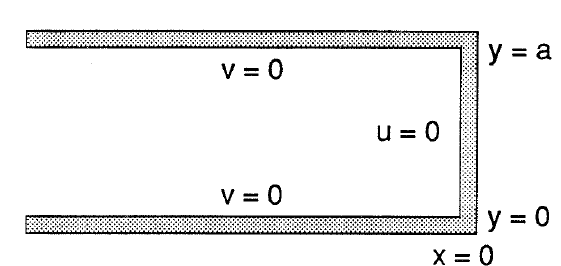</td>
  <td>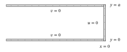</td>
</tr>
</table>

- **Asset:** `ch05-p125-closed-channel.tikz`
- **Printed page:** 125
- **Representation:** vector
- **Equation check:** n/a
- **Scientific check:** Three closed-channel boundaries and `u=0`, `v=0`, `x=0`, `y=0,a` labels are preserved.

#### Figure 5.17 — source PDF crop, printed page 126

<table>
<tr><th>Original source</th></tr>
<tr>
  <td>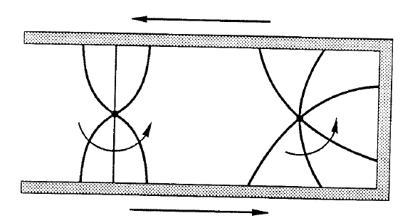</td>
</tr>
</table>

- **Asset:** `ch05-p126-kelvin-turning-corner.png`
- **Original source:** [ChapmanRizzoli5.pdf](../../references/chapman-rizzoli-1989/ChapmanRizzoli5.pdf), physical page 31
- **Representation:** source-pdf
- **Equation check:** partial
- **Scientific check:** Far-field Kelvin directions and the no-normal-flow requirement are checked. The detailed near-corner field requires an infinite Poincaré-mode matching solution and is retained as source art.

#### Figure 5.18 — rossby dispersion

<table>
<tr><th>Original</th><th>Vector</th></tr>
<tr>
  <td>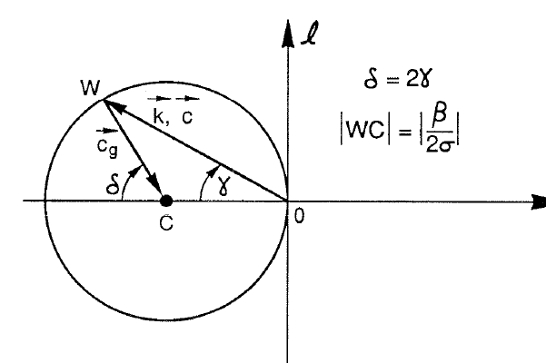</td>
  <td>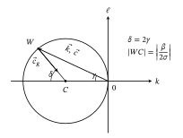</td>
</tr>
</table>

- **Asset:** `ch05-p129-rossby-dispersion.tikz`
- **Printed page:** 129
- **Representation:** vector
- **Equation check:** ai-checked
- **Scientific check:** Constant-frequency circle and group-velocity normal direction were checked against the stated Rossby relation.

#### Figure 5.19 — rossby mechanism

<table>
<tr><th>Original</th><th>Vector</th></tr>
<tr>
  <td>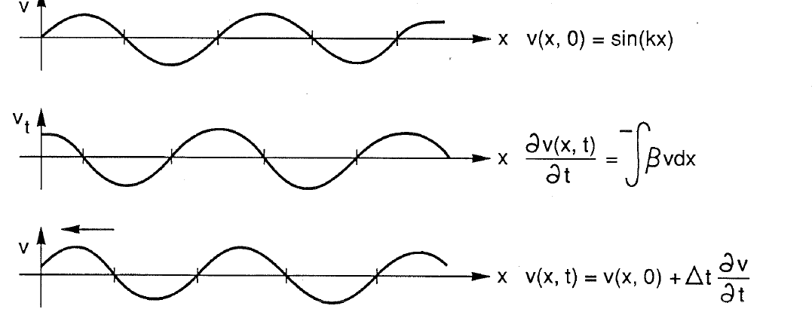</td>
  <td>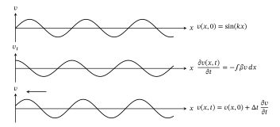</td>
</tr>
</table>

- **Asset:** `ch05-p130-rossby-mechanism.tikz`
- **Printed page:** 130
- **Representation:** vector
- **Equation check:** ai-checked
- **Scientific check:** Panels were checked against the stated sinusoidal field and time tendency, producing westward phase displacement.

#### Figure 5.20 — divergent dispersion

<table>
<tr><th>Original</th><th>Vector</th></tr>
<tr>
  <td>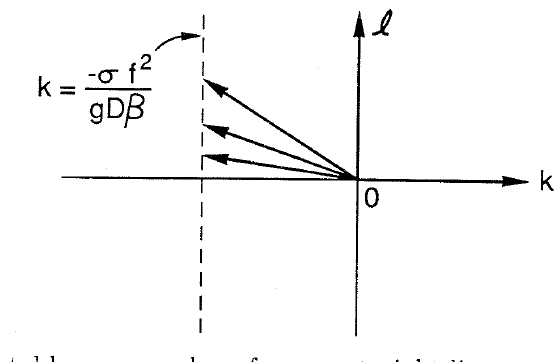</td>
  <td>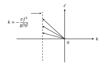</td>
</tr>
</table>

- **Asset:** `ch05-p132-divergent-dispersion.tikz`
- **Printed page:** 132
- **Representation:** vector
- **Equation check:** ai-checked
- **Scientific check:** Fixed-frequency solutions were checked against the stated dispersion relation and lie on the constant-`k` line with arbitrary `ell`.

#### Figure 5.21 — pressure high

<table>
<tr><th>Original</th><th>Vector</th></tr>
<tr>
  <td>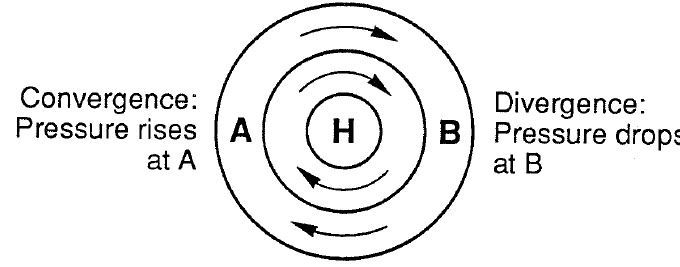</td>
  <td>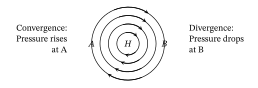</td>
</tr>
</table>

- **Asset:** `ch05-p132-pressure-high.tikz`
- **Printed page:** 132
- **Representation:** vector
- **Equation check:** ai-checked
- **Scientific check:** For geostrophic flow `u=-g eta_y/f`, `v=g eta_x/f`, differentiation gives `div u_g=-g beta eta_x/f^2`: convergence/rising pressure occurs west of the high at A and divergence/falling pressure east at B, with clockwise Northern Hemisphere circulation.

#### Figure 5.22 — general rossby dispersion

<table>
<tr><th>Original</th><th>Vector</th></tr>
<tr>
  <td>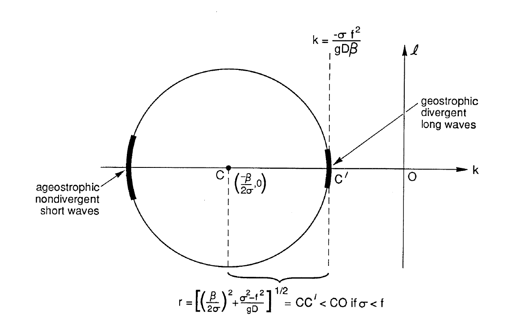</td>
  <td>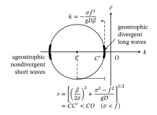</td>
</tr>
</table>

- **Asset:** `ch05-p134-general-rossby-dispersion.tikz`
- **Printed page:** 134
- **Representation:** vector
- **Equation check:** ai-checked
- **Scientific check:** Constant-frequency circle and long-/short-wave branches were checked against the nearby equation.

#### Figure 5.23 — wave class dispersion

<table>
<tr><th>Original</th><th>Vector</th></tr>
<tr>
  <td>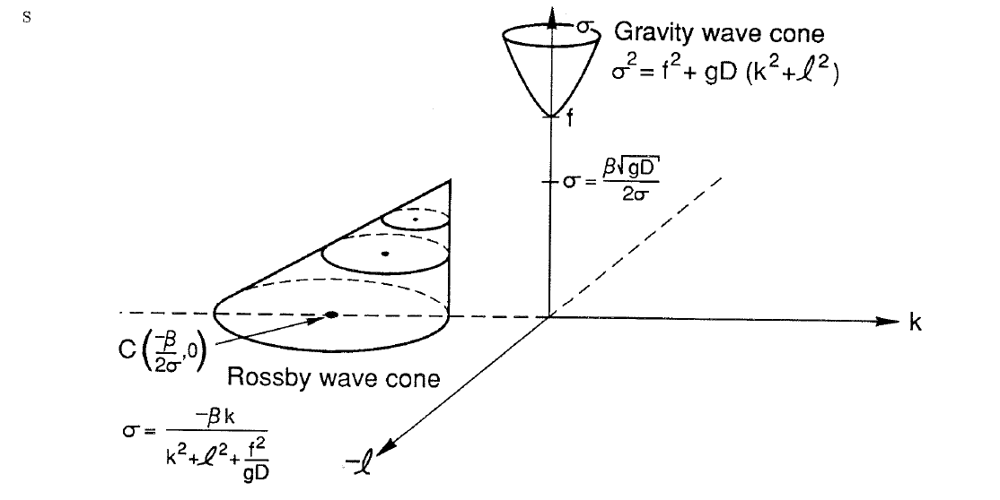</td>
  <td>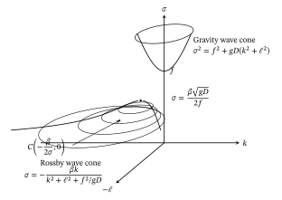</td>
</tr>
</table>

- **Asset:** `ch05-p135-wave-class-dispersion.tikz`
- **Printed page:** 135
- **Representation:** vector
- **Equation check:** ai-checked
- **Scientific check:** Surfaces and inertial/Rossby cutoffs were checked against the model relations rather than accepted from freehand cone placement.

#### Figure 5.24 — angled wall reflection

<table>
<tr><th>Original</th><th>Vector</th></tr>
<tr>
  <td>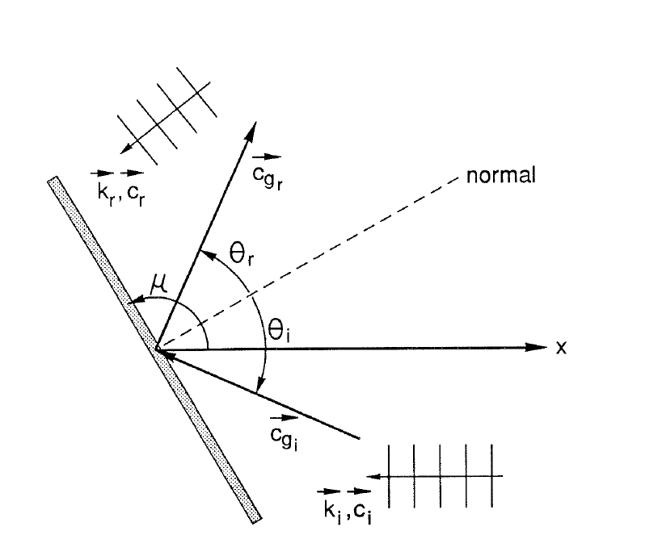</td>
  <td>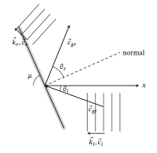</td>
</tr>
</table>

- **Asset:** `ch05-p137-angled-wall-reflection.tikz`
- **Printed page:** 137
- **Representation:** vector
- **Equation check:** ai-checked
- **Scientific check:** Wall/normal perpendicularity and incident/reflected group-velocity mirror geometry were checked against the reflection constraint.

#### Figure 5.25 — rossby reflection construction

<table>
<tr><th>Original</th><th>Vector</th></tr>
<tr>
  <td>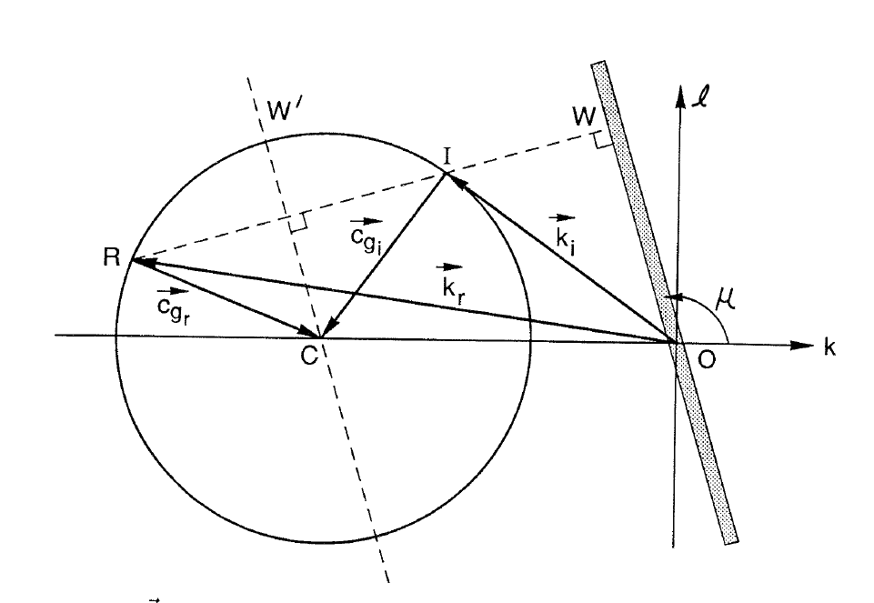</td>
  <td>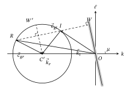</td>
</tr>
</table>

- **Asset:** `ch05-p138-rossby-reflection-construction.tikz`
- **Printed page:** 138
- **Representation:** vector
- **Equation check:** ai-checked
- **Scientific check:** Incident/reflected roots and radial group velocities were checked against the constant-frequency circle and equal along-wall wavenumber projection.

#### Figure 5.26 — western reflection

<table>
<tr><th>Original</th><th>Vector</th></tr>
<tr>
  <td>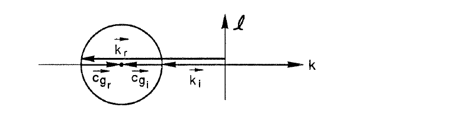</td>
  <td>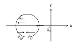</td>
</tr>
</table>

- **Asset:** `ch05-p139-western-reflection.tikz`
- **Printed page:** 139
- **Representation:** vector
- **Equation check:** ai-checked
- **Scientific check:** Long-wave incident and short-wave reflected roots, including the group-velocity reversal, were checked against the dispersion geometry.

#### Figure 5.27 — eastern reflection

<table>
<tr><th>Original</th><th>Vector</th></tr>
<tr>
  <td>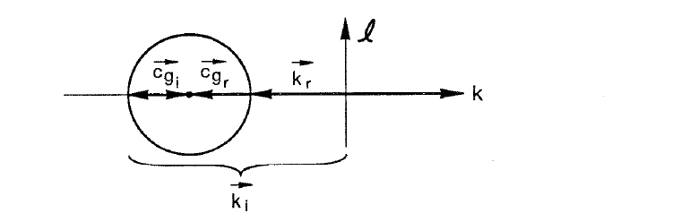</td>
  <td>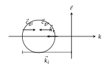</td>
</tr>
</table>

- **Asset:** `ch05-p139-eastern-reflection.tikz`
- **Printed page:** 139
- **Representation:** vector
- **Equation check:** ai-checked
- **Scientific check:** Short-wave incident and long-wave reflected roots, including the group-velocity reversal, were checked against the dispersion geometry.

#### Figure 5.28 — hermite modes

<table>
<tr><th>Original</th><th>Vector</th></tr>
<tr>
  <td>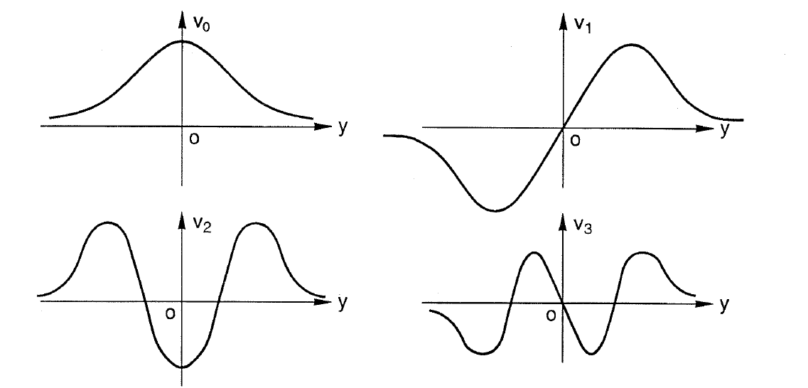</td>
  <td>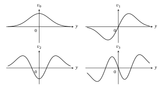</td>
</tr>
</table>

- **Asset:** `ch05-p142-hermite-modes.tikz`
- **Printed page:** 142
- **Representation:** vector
- **Equation check:** ai-checked
- **Scientific check:** Curves were checked as `exp(-xi^2/2) H_m(xi)` for `m=0..3`; parity, zeros, and lobes are exact.

#### Figure 5.29 — kelvin circulation

<table>
<tr><th>Original</th><th>Vector</th></tr>
<tr>
  <td>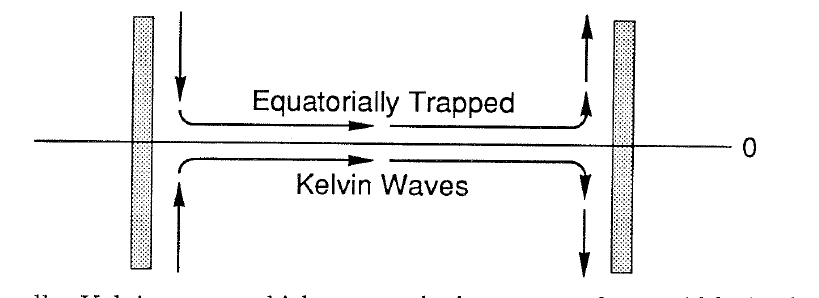</td>
  <td></td>
</tr>
</table>

- **Asset:** `ch05-p145-kelvin-circulation.tikz`
- **Printed page:** 145
- **Representation:** vector
- **Equation check:** n/a
- **Scientific check:** Eastward equatorial Kelvin-wave path and boundary return circulation preserve the source closure; this is a directional schematic rather than an equation-defined plotted quantity.

#### Figure 5.30 — equatorial dispersion

<table>
<tr><th>Original</th><th>Vector</th></tr>
<tr>
  <td></td>
  <td></td>
</tr>
</table>

- **Asset:** `ch05-p145-equatorial-dispersion.tikz`
- **Printed page:** 145
- **Representation:** vector
- **Equation check:** ai-checked
- **Scientific check:** `m=1,2,3` gravity/Rossby branches, Yanai branch, and Kelvin branch were checked against the stated dispersion relations.

#### Figure 5.31 — equatorial ray

<table>
<tr><th>Original</th><th>Vector</th></tr>
<tr>
  <td></td>
  <td></td>
</tr>
</table>

- **Asset:** `ch05-p147-equatorial-ray.tikz`
- **Printed page:** 147
- **Representation:** vector
- **Equation check:** ai-checked
- **Scientific check:** The source-defined sinusoidal ray and its extrema were checked against its turning-latitude construction. See `ERRATA.md`, printed pp.146--147, for the separate group-velocity ray-law issue.

### Chapter 6
