# Figure audit — Chapter 6

[Back to the figure audit landing page](../FIGURES.md)

This chapter ledger contains scientific and technical figure placements only.
Entries follow printed page, figure order on the page, and component asset.

#### Figure 6.1 — sloping channel

<table>
<tr><th>Original</th><th>Vector</th></tr>
<tr>
  <td>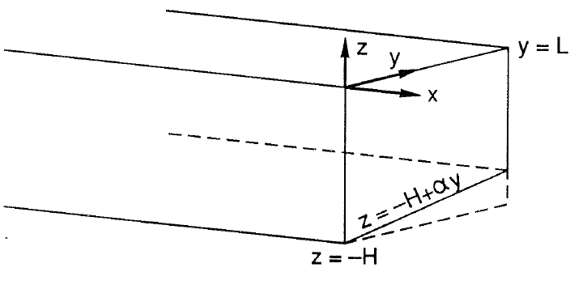</td>
  <td></td>
</tr>
</table>

- **Asset:** `ch06-p151-sloping-channel.tikz`
- **Printed page:** 151
- **Representation:** vector
- **Equation check:** ai-checked
- **Scientific check:** The perspective redraw preserves the source's long channel, the `y=L` cross-section, coordinate axes, and planar bottom relation `z=-H+alpha y`, with the `y=0` and `y=L` sidewall contacts kept exact.

#### Figure 6.2 — bottom-trapped mode

<table>
<tr><th>Original</th><th>Vector</th></tr>
<tr>
  <td>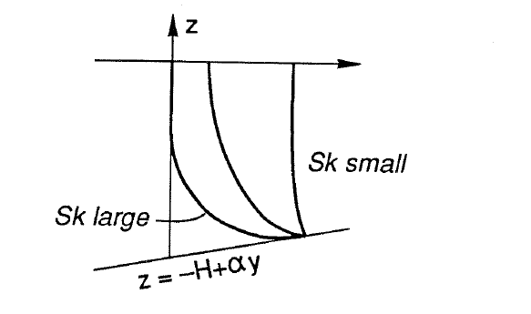</td>
  <td></td>
</tr>
</table>

- **Asset:** `ch06-p152-bottom-trapped-mode.tikz`
- **Printed page:** 152
- **Representation:** vector
- **Equation check:** ai-checked
- **Scientific check:** The source's three large/intermediate/small-`Sk` bottom-trapped profile traces are retained, with all three terminating at the sloping bottom.

#### Figure 6.3 — effective slope

<table>
<tr><th>Original</th><th>Vector</th></tr>
<tr>
  <td>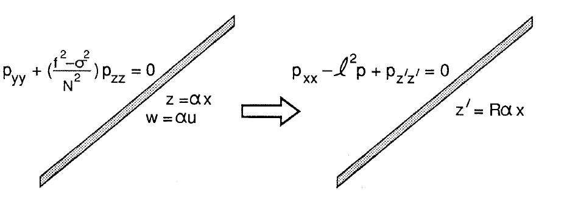</td>
  <td></td>
</tr>
</table>

- **Asset:** `ch06-p154-effective-slope.tikz`
- **Printed page:** 154
- **Representation:** vector
- **Equation check:** ai-checked
- **Scientific check:** The vector preserves the original and scaled slopes, the field equations including `p_xx`, and the `z'=R alpha x` transformation.

#### Figure 6.4 — bottom slope trapping

<table>
<tr><th>Original</th><th>Vector</th></tr>
<tr>
  <td>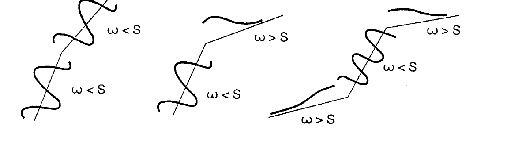</td>
  <td></td>
</tr>
</table>

- **Asset:** `ch06-p156-bottom-slope-trapping.tikz`
- **Printed page:** 156
- **Representation:** vector
- **Equation check:** ai-checked
- **Scientific check:** From the checked dispersion relation, for `omega<1` the sign of `k^2` is the sign of `S^2-omega^2`: propagation requires `omega<S`, while `omega>S` is evanescent. The lower-frequency source-like oscillation counts and the reflection/trapping panels encode those regimes.

#### Figure 6.5 — continental shelf

<table>
<tr><th>Original</th><th>Vector</th></tr>
<tr>
  <td>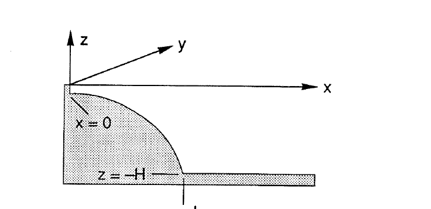</td>
  <td>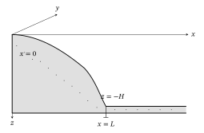</td>
</tr>
</table>

- **Asset:** `ch06-p157-continental-shelf.tikz`
- **Printed page:** 157
- **Representation:** vector
- **Equation check:** ai-checked
- **Scientific check:** The vector preserves the stippled shelf cross-section, coast `x=0`, shelf edge `x=L`, offshore flat bottom `z=-H`, and alongshore/offshore axes.

#### Figure 6.6 — shelf root condition

<table>
<tr><th>Original</th><th>Vector</th></tr>
<tr>
  <td>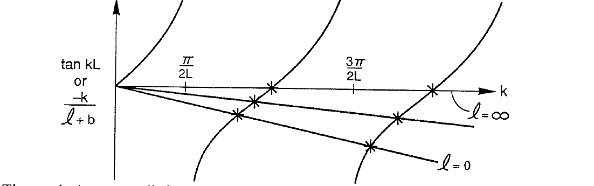</td>
  <td></td>
</tr>
</table>

- **Asset:** `ch06-p159-shelf-root-condition.tikz`
- **Printed page:** 159
- **Representation:** vector
- **Equation check:** ai-checked
- **Scientific check:** Roots for the displayed finite-slope comparisons were independently evaluated from `tan(t)+m t=0`. The 1989 source figure labels the comparison `-k/(ell+b)` and the horizontal limit `ell=infinity`, while the nearby derivation uses signed `ell<0` and gives `tan(kL)=k/(ell-b)`. The vector preserves the source notation pending resolution of this discrepancy; see `ERRATA.md`, printed p.159.

#### Figure 6.7 — source PDF crop, printed page 159

<table>
<tr><th>Original source</th></tr>
<tr>
  <td>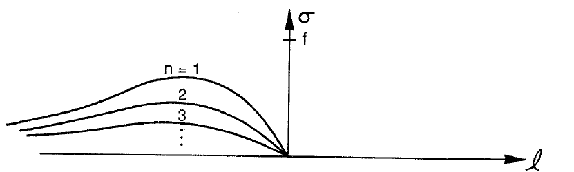</td>
</tr>
</table>

- **Asset:** `ch06-p159-modal-dispersion-source.png`
- **Original source:** [ChapmanRizzoli6.pdf](../../references/chapman-rizzoli-1989/ChapmanRizzoli6.pdf), physical page 12
- **Representation:** source-pdf
- **Equation check:** ai-checked
- **Scientific check:** The source PDF is retained because the modal curves are a qualitative source-specific family rather than a uniquely replotted solution; tracing their individual envelopes would add interpretation. Along each matched mode `tan(kL)=k/(ell-b)`, `k=k_n(ell)`; independently solved maxima preserve one maximum per branch and decreasing peak frequency with mode number. See `ERRATA.md`, printed p.159, for the source extremum issue.

#### Figure 6.8 — source PDF crop, printed page 161

<table>
<tr><th>Original source</th></tr>
<tr>
  <td>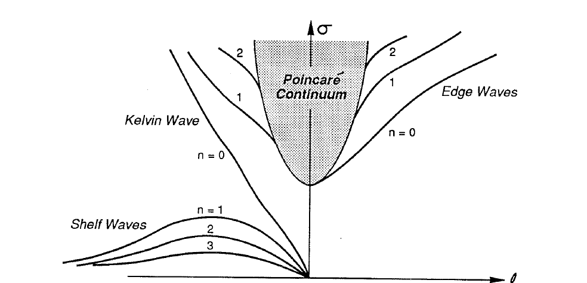</td>
</tr>
</table>

- **Asset:** `ch06-p161-coastal-spectrum-source.png`
- **Original source:** [ChapmanRizzoli6.pdf](../../references/chapman-rizzoli-1989/ChapmanRizzoli6.pdf), physical page 15
- **Representation:** source-pdf
- **Equation check:** partial
- **Scientific check:** The source PDF is retained for this information-dense full coastal spectrum. The family content (one Kelvin wave, discrete shelf/edge families, Poincaré continuum, no Yanai analogue) is checked, but every detailed branch/cutoff for general `D(x)` is not independently reconstructible from the notes; a vector redraw would add interpretation.

#### Figure 6.9 — coastal geometry

<table>
<tr><th>Original</th><th>Vector</th></tr>
<tr>
  <td>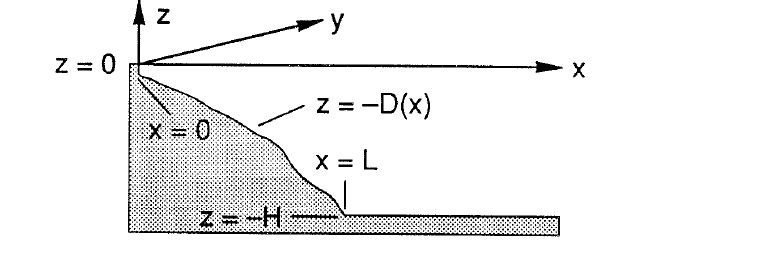</td>
  <td>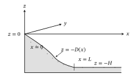</td>
</tr>
</table>

- **Asset:** `ch06-p162-coastal-geometry.tikz`
- **Printed page:** 162
- **Representation:** vector
- **Equation check:** n/a
- **Scientific check:** The vector preserves the three-dimensional coastal coordinate system, variable depth `D(x)`, shelf edge `x=L`, and the clean deep-ocean bottom shown in this redraw.

#### Figure 6.10 — ctw dispersion family

<table>
<tr><th>Original</th><th>Vector</th></tr>
<tr>
  <td>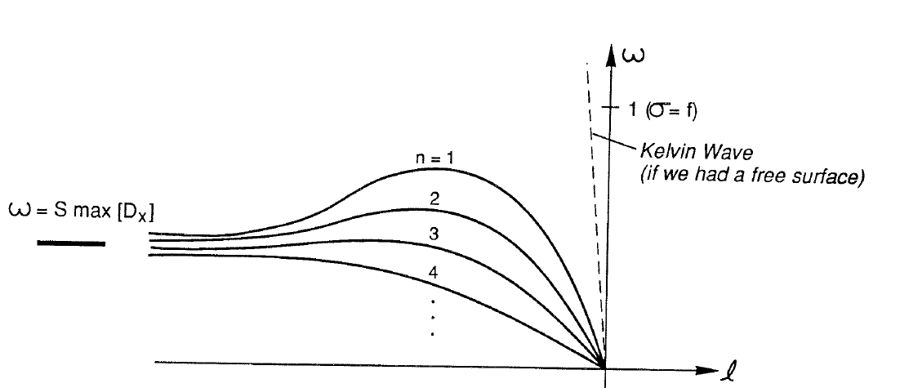</td>
  <td></td>
</tr>
</table>

- **Asset:** `ch06-p164-ctw-dispersion-family.tikz`
- **Printed page:** 164
- **Representation:** vector
- **Equation check:** partial
- **Scientific check:** Schematic branches obey the checked origin, ordering, and common short-wave asymptote constraints, but the full branch shapes are schematic rather than independently replotted solutions.

#### Figure 6.11 — stratification effect

<table>
<tr><th>Original</th><th>Vector</th></tr>
<tr>
  <td>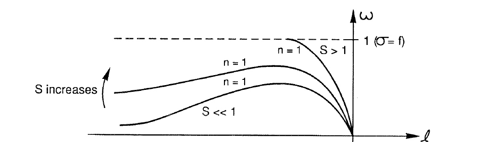</td>
  <td></td>
</tr>
</table>

- **Asset:** `ch06-p164-stratification-effect.tikz`
- **Printed page:** 164
- **Representation:** vector
- **Equation check:** partial
- **Scientific check:** Increasing stratification and the finite `omega=1` cutoff are constrained; the strong-`S` branch terminates on the cutoff. Detailed curvature remains schematic for unspecified `D(x)`.

#### Figure 6.12 — scattering by stratification

<table>
<tr><th>Original</th><th>Vector</th></tr>
<tr>
  <td>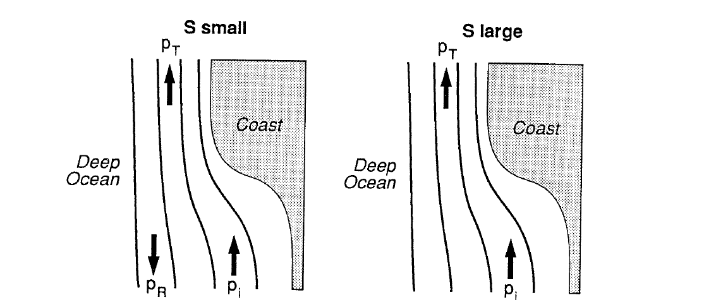</td>
  <td>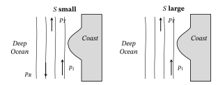</td>
</tr>
</table>

- **Asset:** `ch06-p165-scattering-by-stratification.tikz`
- **Printed page:** 165
- **Representation:** vector
- **Equation check:** partial
- **Scientific check:** Weak-stratification panel has incident/reflected/transmitted branches and strong-stratification panel omits the reflected branch as required by the derived regime change; the stippled coast and italic directional labels follow the source, while branch shapes remain schematic.

#### Figure 6.13 — mode transition

<table>
<tr><th>Original</th><th>Vector</th></tr>
<tr>
  <td>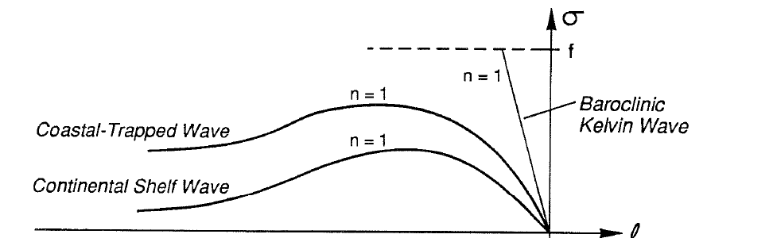</td>
  <td></td>
</tr>
</table>

- **Asset:** `ch06-p167-mode-transition.tikz`
- **Printed page:** 167
- **Representation:** vector
- **Equation check:** partial
- **Scientific check:** The source family layout is preserved with `ell<0` to the left, inertial line `sigma=f`, and the straight Kelvin comparison branch. Intermediate coastal-trapped/shelf-wave branch shapes are schematic because no unique `D(x)` is specified; source italic labeling and the pending p.167 sign convention are retained. See `ERRATA.md`, printed p.167.

#### Figure 6.14 — wind-forced shelf

<table>
<tr><th>Original</th><th>Vector</th></tr>
<tr>
  <td>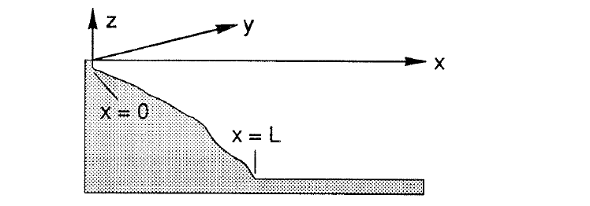</td>
  <td>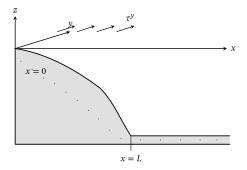</td>
</tr>
</table>

- **Asset:** `ch06-p168-wind-forced-shelf.tikz`
- **Printed page:** 168
- **Representation:** vector
- **Equation check:** n/a
- **Scientific check:** The vector preserves the three-dimensional shelf/coast geometry, offshore and alongshore axes, and shelf edge `x=L`; no wind-stress arrows are added to the source geometry sketch.
